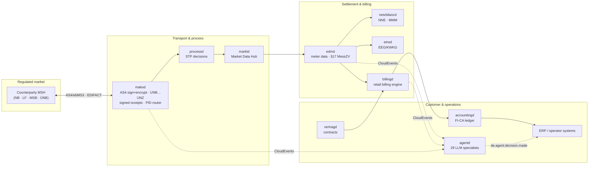

# mako ⚡

[](https://github.com/hupe1980/mako/actions/workflows/ci.yml)
[](./LICENSE-MIT)
[](https://www.rust-lang.org/)
[](https://www.edi-energy.de/)
[](https://github.com/hupe1980/mako/pkgs/container/makod)

> **⚠️ Experimental** — Pre-1.0. APIs may change between releases. Not yet recommended for production without thorough in-house testing.

A **Rust workspace** for end-to-end German energy market communication (**BDEW MaKo / EDI@Energy**) — from raw EDIFACT bytes to production microservices.

The workspace covers the full BDEW MaKo stack across four layers:

| Layer | What it is |
|---|---|
| **Protocol** | `edi-energy` EDIFACT · `dvgw-edi` DVGW gas · `redispatch-xml` Redispatch 2.0 · `mako-engine` event-sourced process runtime · `makod` daemon |
| **Market data** | `mako-markt` library · `marktd` Market Data Hub (PostgreSQL, CloudEvents, OIDC/JWT, EventBus) |
| **Settlement & billing** | `grid-billing` + `netzbilanzd` NNE/MMM/MSB settlement · `eeg-billing` + `einsd` EEG/KWKG · `energy-billing` + `billingd` retail billing |
| **Customer management** | `accountingd` FI-CA ledger · `portald` customer portal · `vertragd` contracts · `tarifbd` tariff catalog · `agentd` AI orchestration |

---

## Architecture at a Glance



## Workspace at a Glance

### Protocol & Domain Crates

| Crate / service | Purpose |
|---|---|
| `edi-energy` | Parse · validate · build all 17 EDI@Energy EDIFACT message types |
| `mako-engine` | Event-sourced runtime: `Workflow`, `Process`, `EventStore`, outbox, deadlines |
| `mako-gpke` | GPKE workflows — UTILMD Strom supplier-switch (55001–55018) + Anfrage Daten (55555, GPKE Teil 4) + Sperrung ORDERS (17115–17117) + INVOIC (31001–31002, 31005–31006) + ORDERS/ORDRSP Konfiguration (17134/17135, 19001/19002) + PARTIN Strom (37000–37006) |
| `mako-wim` | WiM Strom workflows — UTILMD (55039, 55042, 55051, 55168) + MSB-Rechnung INVOIC (31009) + ORDERS/ORDRSP (various) |
| `mako-geli-gas` | GeLi Gas 3.0 workflows — UTILMD G supplier-switch Gas (44001–44021) + INVOIC 31011 (Rechnung sonstige Leistung, AWH Sperrprozesse Gas) |
| `mako-mabis` | MABIS workflows — PID 13003 (Bilanzkreisabrechnung Strom, BKV↔ÜNB) + PIDs 55065/55069/55070 (Clearingliste) |
| `mako-wim-gas` | WiM Gas workflows — UTILMD G MSB-change (44022–44024, 44039–44053, 44168–44170) + INSRPT Gas (23005, 23009) + WiM-Rechnung INVOIC (31003, 31004) |
| `mako-gabi-gas` | GaBi Gas 2.1 (BK7-24-01-008) — INVOIC 31010/31007/31008 + MSCONS 13013 MMMA + DVGW ALOCAT/NOMINT/NOMRES/SCHEDL/IMBNOT/TRANOT/DELORD/DELRES (8 workflows); typed domain: `GasDay` (DST-aware 06:00 CET), `GasQuantity` (Decimal kWh_Hs), `GasBeschaffenheit` (Hs + Zustandszahl, DVGW G 685), `AllocationVersion` (Initial/Correction/Final), `GasMarketRole`, `GasPortfolioBalance` |
| `mako-nbw` | Netzbetreiberwechsel — PARTIN bulk DSO concession handover (PIDs 37000–37014) — placeholder |
| `mako-as4` | BDEW AS4-Profil v1.2 — `BdewAs4Profile`, `bdew_pmode()` (sign+encrypt, X509PKIPathv1, BrainpoolP256r1), `bdew_push_policy()` (require_encrypted_inbound), `BdewTestPki` + `MockAs4Endpoint::builder().with_decryption_key_pem(key)` (full encrypt round-trip, testing feature), per-partner encryption cert registry; asx-rs **v0.8** — `with_signing_material()`, `EventBus::new_for_testing()`, `As4HttpTransport::new_for_localhost_testing()`, partial `As4SendCredentials` fallback |
| `dvgw-edi` | DVGW EDIFACT formats — ALOCAT, NOMINT, NOMRES, SCHEDL, IMBNOT, TRANOT, DELORD, DELRES parsing for GaBi Gas 2.1 (BK7-24-01-008) |
| `mako-redispatch` | Redispatch 2.0 workflows — XML document types (`ActivationDocument`, `Stammdaten`, `NetworkConstraintDocument`, …) + IFTSTA PIDs 21037/21038 |
| `redispatch-xml` | Redispatch 2.0 XML/XSD format parsing — all 9 document types |
| `energy-api` | BDEW API-Webdienste Strom — REST/WebSocket client + Axum server for iMS processes |
| `mako-markt` | Master data library — `MaloId`, `MeloId`, `MarktpartnerId`, repository traits (incl. `LokationszuordnungRepository`, `TechnischeRessourceRepository`), CloudEvents, test doubles |

### Settlement, Billing & Calculation Crates

| Crate / service | Purpose |
|---|---|
| `grid-billing` | Role-neutral German grid **settlement** engine — `calculate_nne_invoice`, `calculate_mmm_invoice`, `calculate_msb_invoice`, `calculate_reversal`; returns `GridSettlement` (no BO4E dep); every position carries `CalculationTrace` with `LegalReference`s (StromNEV §17/§21, GasNEV §14, KAV §2, §14a EnWG, ARegV) and `TariffSource`; `Sparte` enum drives Gas vs. Strom legal refs automatically; `KaKlasse` annotates KAV tier; `ValidationResult` pre-calculation validation; zero I/O |
| `eeg-billing` | Pure EEG/KWKG feed-in settlement library — `calculate_settlement` for all 9 settlement schemes (`SettlementScheme + TariffSource`, EEG 2000–2023 + KWKG 2023); §51 Negativpreisregel (version-aware: EEG 2017/2021/2023 thresholds + Bestandsschutz); §51a Verlängerungsanspruch; §52 Pflichtzahlungen (€10/kW) + §52 Abs. 6 Netting; §20 Abs. 3 Managementprämie; §23a quarterly degression; §36k Wind Korrekturfaktor; §24 multi-block `CapacityBlock`; `SettlementPeriodState` lifecycle state machine; 324 tests; zero float money; no I/O |
| `energy-billing` | Retail energy billing engine (LF role) — `Product` typed enum (12 categories, serde-tagged); per-category typed structs (`ElectricityProduct`, `GasProduct`, …); `ControllableLoadProvider` for §14a; `BillingEngine.validate()` + `bill_batch()`; `Invoice.warnings`; §41b iMSys guard; `StromsteuerBefreiung` typed enum; `EnergieQuellen` CO₂ label; RLM demand charge; §54 EnergieStG exemption; historic levy lookups; §41a EPEX; HT/NT ToU; XRechnung 3.0 / ZUGFeRD 2.3; **160 tests**; zero I/O; no `rubo4e` dep |
| `metering` | German energy metering domain library — `MeterInterval`, Gas m³→kWh_Hs (§25 Nr. 4 MessEV / DVGW G 685 incl. `G685Rounding`); billing period aggregation; SLP/RLM/iMSys classification; BDEW 2025 load profiles (H25/G25/L25/P25/S25) + Dynamisierung; Zählzeitdefinition resolution (§14a); §29/§45 MsbG rollout obligations; Hampel quality scoring; V01–V10 validation engine (incl. plant-capacity ceiling); virtual meters (§42b EnWG GGV Solarpaket I); BSI TR-03109 `SmgwSession`/`ClsChannel`; §17 MessZV Jahresprognose with confidence bounds; zero I/O, no async, no float money |
| `invoic-checker` | INVOIC plausibility — 6 checks (period validity, position arithmetic, document total, tariff match ToU-aware, tariff found, MMM settlement price check) |
| `netz-checker` | NB Anmeldung validation — 6 deterministic checks, ERC A02/A05/A06/A97/A99; no I/O |

### Production Services (17 daemons)

| Service | Port | Role | Purpose |
|---|---|---|---|
| `makod` | `:8080` · `:4080` · `:8090` | All | Protocol daemon — 45+ GPKE/WiM/GeLi Gas/MABIS/GaBi Gas workflows, AS4/REST/iMS, Cedar ABAC, OIDC/JWT, MCP server |
| `marktd` | `:8180` | All | Market Data Hub — MaLo/MeLo/contracts, VersorgungsStatus, typed BO4E API, EventBus fan-out, MMMA monthly import worker |
| `processd` | `:8580` | NB+LF+MSB | Process Decision Engine — Anmeldung STP ≥ 95%, LF E_0624 45-min auto-response, MSB REQOTE auto-response, §14a Steuerungsauftrag |
| `invoicd` | `:8280` | LF | INVOIC plausibility-check — 6 checks, auto-settle/dispute, §22 MessZV receipts |
| `netzbilanzd` | `:8680` | NB | NNE/KA/MMM/MSB/AWH billing — generates INVOIC 31001/31002/31005/31009/31011, full REMADV lifecycle, §14a Modul 2 ToU, §42a GGV, 13-tool MCP server |
| `sperrd` | `:8780` | NB | Sperrung execution tracking — IFTSTA 21039 auto-dispatch, `GET /stats` compliance snapshot, 5-tool MCP server |
| `edmd` | `:8380` | All | Energy Data Management — MSCONS, iMSys direct push, Kafka batch ingest, Hampel quality scoring, V01–V10 validation, virtual meters (§42b GGV), §17 MessZV Jahresprognose, Iceberg/S3 OLAP, 15-tool MCP server |
| `mabis-syncd` | `:8880` | ÜNB/NB | MaBiS Summenzeitreihen (MSCONS 13003) — aggregates per-MaLo Lastgang from edmd; submits to BIKO on the 10. Werktag; Erstaufschlag 1.–10. WT / Clearing 11.–30. WT / KBKA windows per BK6-24-174 Anlage 3 §3.10 |
| `einsd` | `:9180` | NB/LF | Einspeiser Registry + EEG/KWKG settlement — 9 settlement schemes, §52 sanctions, §51 neg-price, 14 MCP tools + 6 prompts |
| `obsd` | `:8480` | All | Business-process observability — KPI reports, §20 EnWG parity, automated deadline computation, `GET /api/v1/audit/bnetza-report` |
| `nis-syncd` | `:9680` | NB | NIS/GIS grid topology import — concurrent sync, drift detection, `check_malo_grid` MCP tool |
| `tarifbd` | `:9080` | LF | Product & Tariff Catalog — **13 categories** (STROM/GAS/WAERME/SOLAR/EEG/EINSPEISUNG/WAERMEPUMPE/WALLBOX/HEMS/EMOBILITY/ENERGIEDIENSTLEISTUNG/BUNDLE/SHARING §42c); OIDC/JWT auth; `product_status` DRAFT/PUBLISHED workflow; §42d comparison portal feed (ETag-cached, BO4E `Tarifinfo`); EPEX Spot for §41a; B2B Angebote ANGELEGT→ANGENOMMEN; **14-tool MCP server + 3 prompts** |
| `billingd` | `:9280` | LF | Energy Billing Engine — **all commercial prices user-defined in `tarifbd`**; pure calculation via `energy-billing` crate (**160 tests**); `STROM` (SLP/RLM Eintarif/HT/NT; `leistungspreis_strom_ct_per_kw_month` demand charge; §14a Modul 1/3 via `ControllableLoadProvider`; §41b iMSys guard); `GAS` (§25 Nr. 4 MessEV Brennwertkorrektur, Energiesteuer, **§54 KWK exemption**, BEHG CO₂, RLM Leistungspreis, indexed TTF/NCG); `WAERME`; `SOLAR` §42b/§42a; `EEG`/`EINSPEISUNG`; §41a EPEX dynamic; **§41b iMSys enforcement**; `StromsteuerBefreiung` typed enum (§9 Nr. 1-5); `EnergieQuellen` CO₂ label; `Invoice.warnings`; **historic levy lookups** (`stromsteuer_for_year`, `energiesteuer_gas_for_year` incl. 2022 0-rate); **VPP auto-billing** (`de.vpp.dispatch.confirmed` → `Rechnung`, RED III Art. 17); XRechnung 3.0 / ZUGFeRD 2.3 (EN16931); **12 MCP tools** |
| `accountingd` | `:9380` | LF | Massenkontokorrent / Customer Account Ledger — double-entry SKR 03/04 journal; aging analysis; Verzugszinsen §288 BGB; Zahlungsvereinbarung (payment plans); FRST/RCUR-separated pain.008 + Gläubiger-ID (EPC AT-02); CAMT.054 dedup import; IBAN hash encryption (pgcrypto); OIDC/JWT + inbound HMAC; auto-Mahnwesen; 107 tests |
| `portald` | `:9480` | LF | Customer Portal read-model gateway — aggregates Lastgang/invoices/balance/VersorgungsStatus/EEG into single REST + SSE API; OIDC auth |
| `vertragd` | `:9780` | LF | Contract & Customer Management — Kunden (B2C + B2B), Rahmenverträge (cascade Kündigung, `angebot_id` CPQ traceability), Versorgungsverträge; OIDC/JWT auth; Preisgarantie guard (§41 EnWG); `widerruf-kuendigung`; dispatch retry (3×); proactive expiry notifications; GDPR Art. 15/17/20; OIDC→MaLo authorization gateway; **16-tool MCP server + 4 prompts** |
| `agentd` | `:9580` | All | Multi-agent LLM orchestration — **29 built-in specialists compiled into container image**, activated via `[bundled_agents]`; 3 dispatch modes (`sequential`/`parallel`/`race`); A2A agent cards; OpenAI, Anthropic, AWS Bedrock; LanceDB RAG |


---

## ✨ Features

### EDIFACT layer (`edi-energy`)

| Category | Detail |
|---|---|
| 📦 **17 message types** | UTILMD, MSCONS, APERAK, CONTRL, INVOIC, REMADV, ORDERS, IFTSTA, INSRPT, REQOTE, PARTIN, ORDCHG, ORDRSP, QUOTES, COMDIS, PRICAT, UTILTS |
| 🔍 **5-layer validation** | MIG structural rules, AHB Pruefidentifikator-specific rules, semantic cross-field rules |
| 📅 **Annual release lifecycle** | Multi-version profile registry with 7-day transition grace windows (BDEW-compliant) |
| 🔒 **Security by default** | DoS limits (max 10 MB, 10 000 segments), log-injection sanitisation, fuzz-tested with 1 329+ corpus entries |
| 🛠️ **Fluent message builders** | Type-state builder API with compile-time mandatory field enforcement |
| 🔁 **Round-trip serialisation** | Parse → validate → serialize with byte-exact EDIFACT output |
| 🧪 **Code-generated profiles** | 36 profiles across 17 types, regenerated annually via `cargo xtask codegen` |

### DVGW gas transport layer (`dvgw-edi`)

| Category | Detail |
|---|---|
| 📦 **8 DVGW message types** | ALOCAT, NOMINT, NOMRES, SCHEDL, IMBNOT, TRANOT, DELORD, DELRES |
| 🔗 **Correlation helpers** | `nomination_ref` links NOMINT → NOMRES; `order_ref` links DELORD → DELRES |
| 🔀 **Synthetic PID routing** | `detect_pid(role_qualifier)` maps each direction to unique PIDs in range 90001–90062 for `mako-engine` integration |
| 🧪 **Independent of edi-energy** | Separate `DvgwPlatform`; shares no parser state with the BDEW EDIFACT stack |
| 📜 **Regulatory basis** | BNetzA BK7-24-01-008 · DVGW G 685 · Kooperationsvereinbarung Gas |

### Redispatch 2.0 XML layer (`redispatch-xml`)

| Category | Detail |
|---|---|
| 📦 **9 CIM/IEC 62325 document types** | `ActivationDocument`, `PlannedResourceSchedule`, `AcknowledgementDocument`, `Stammdaten`, `Unavailability`, `NetworkConstraintDocument`, `Kaskade`, `StatusRequest`, `Kostenblatt` |
| 🔍 **Two-phase validation** | `parse_and_validate()` — XSD structural check + semantic cross-field rules in one call |
| 🔁 **Round-trip serialization** | Parse → serialize with byte-stable XML output |
| 🔑 **Document correlation** | `Document::mrid()`, `sender_id()`, `receiver_id()` — routing keys for `AcknowledgementDocument` process matching |
| 🔒 **`#![deny(unsafe_code)]`** | Memory-safe XML processing; no `unsafe` in the parse path |
| 📜 **Regulatory basis** | BNetzA BK6-20-059 · BK6-20-060 · BK6-20-061 · NABEG §§ 13, 13a, 14 EnWG |

### Master data layer (`mako-markt`)

| Category | Detail |
|---|---|
| 🆔 **Validated domain IDs** | `MaloId` (11-digit BDEW check-digit), `MeloId` (DE+31-char), `MarktpartnerId` (13-digit; auto-derives NAD DE3055 agency code `293`/`332`/`9` from prefix) |
| 🗂️ **Nine repository traits** | `MaloRepository`, `MeloRepository`, `ContractRepository`, `SubscriptionRepository`, `CorrelationIndex`, `PartnerRepository`, `LokationszuordnungRepository`, `TechnischeRessourceRepository`, `SteuerbareRessourceRepository` — AFIT, no `dyn Trait` overhead |
| ⏳ **Temporal role assignments** | `Lokationszuordnung` with `valid_from`/`valid_to` — evaluated against CET/CEST German calendar date at query time |
| 📨 **CloudEvents 1.0** | Outbound events (`MarktEvent`) with HMAC-SHA256 signing; `InboundMakoEvent` for receiving `makod` lifecycle events |
| 🧪 **`testing` feature** | `InMemory*` test doubles for all six traits — no PostgreSQL required in unit tests |
| 🚫 **Zero framework deps** | No axum, sqlx, or async runtime — pure domain library; all I/O lives in `services/marktd` |

### BO4E typed API (`marktd`)

**41 active `rubo4e::current` types — schema validated at every read/write boundary.**

| Category | Detail |
|---|---|
| 📦 **Typed responses** | `GET /api/v1/malo` → `Marktlokation`; `GET /api/v1/melo` → `Messlokation`; `GET /api/v1/zaehler` → `Zaehler`; `GET /api/v1/geraete` → `Geraet` — all canonical BO4E camelCase |
| 🔍 **Schema validation on write** | `PUT` endpoints reject wrong `_typ` with 422; validate enum fields (`bilanzierungsmethode`, `netzebene`, `vertragsart`, …) against `rubo4e::current` types |
| 📋 **`Vertrag` for LRV exchange** | `nb_contracts` stores full BO4E `Vertrag` JSONB + typed SQL columns; `PUT /api/v1/nb-contracts` validates `vertragsart` / `vertragsstatus`; emits `de.markt.nb-contract.updated` CloudEvent |
| 👤 **`Geschaeftspartner` typed partners** | `PUT /api/v1/partners/{mp_id}` validates the BO4E `Geschaeftspartner` payload (auto-injects `_typ`; validates `marktrolle`, `rollencodetyp`, `marktteilnehmerstatus`, `adresse`). `GET` returns the typed `geschaeftspartner` field. |
| 🔢 **`Zaehlwerk` register access** | `GET /api/v1/zaehler/{id}/zaehlwerke` → `Vec<Zaehlwerk>` — OBIS registers for TOU billing and iMSyS demand management |
| ⏰ **`ZaehlzeitRegister` + `ZaehlzeitSaison`** | `GET/PUT /api/v1/zaehler/{id}/register` + `/zaehler-register/{id}/saisons` — iMSys TOU register definitions (HT/NT/EINZEL); `GET /api/v1/zaehler/{id}/tariff-zone?datetime=ISO` resolves zone in one SQL JOIN (§14a Modul 2) |
| ⚡ **`Energiemenge` deliveries** | `GET /api/v1/deliveries/{malo_id}` → `Vec<Energiemenge>` — typed ERP-consumable meter readings without EDIFACT parsing |
| 💰 **MMMA settlement prices** | `GET/PUT /api/v1/mmma-preise/gas/{year}/{month}` — Gas MMM Abrechnungspreise (Trading Hub Europe); `GET/PUT /api/v1/mmm-preise/strom/{year}/{month}` — Strom MMM Ausgleichsenergie per ÜNB. Both auto-fetched by `netzbilanzd` and validated by `invoicd` check 6. |
| 🗂️ **Fallgruppe + Bilanzierungsmethode auto-extract** | `makod` adapters extract `bilanzierungsmethode` (Z01→SLP, Z02→RLM, Z04→IMS) and `fallgruppe` (GaBi Gas, TM+Z10) from UTILMD `TM+EM` / `TM+Z10` segments. `marktd` `event_ingest` calls `patch_typenmerkmal()` on `de.mako.process.initiated` (PIDs 55001/44001) to keep `malo.fallgruppe` / `malo.bilanzierungsmethode` in sync. || 🏷️ **`Tarifpreisblatt` + `Preisblatt`** | `tarifbd` stores all energy products as `Tarifpreisblatt` JSONB; category drives calculator selection; all prices are user-defined; schema validated on PUT (wrong `_typ` → 422); queried by `billingd` calculator for pricing inputs |
| 🧾 **`Steuerbetrag` + `Registeranzahl`** | `energy-billing` projects the EN 16931 BG-23 tax breakdown into BO4E `Steuerbetrag` entries on the Rechnung JSON; `Registeranzahl` (Eintarif/Zweitarif) drives HT/NT position branching |
| 🏦 **`Zahlungsinformation` + `Zahlungsart`** | `accountingd` SEPA mandate registry stores structured payment info; pain.008 XML generated from `SepaMandateRow` (IBAN, BIC, Kontoinhaber, Mandatsreferenz) |
### Process engine layer (`mako-engine` + domain crates)

| Category | Detail |
|---|---|
| ♻️ **Event-sourced processes** | Optimistic-concurrency event append with SlateDB-backed storage |
| ⚛️ **Atomic dual-write** | Events and outbox messages written in a single `WriteBatch` via `AtomicAppend` |
| ⏰ **Regulatory deadlines** | `DeadlineStore` with GPKE 24h / WiM 5-Werktage / GeLi Gas 10-Werktage Fristen |
| 📨 **AS4 inbound transport** | `makod` receives BDEW AS4 pushes via `asx-rs`, deduplicates with `SlateDbInboxStore`, routes by Pruefidentifikator |
| 🔐 **Cedar ABAC authorization** | All HTTP endpoints gated by [Cedar](https://cedarpolicy.com) attribute-based access control; built-in default policy with custom policy overlay via `--cedar-policy-dir` |
| 🪪 **OIDC / JWT + API-key auth** | JWT bearer tokens from Azure AD, Keycloak, Okta, Kubernetes workload identity; RS256/ES256/PS256 families only; JWKS cached with background refresh; coexists with named API keys |
| 📡 **CloudEvents 1.0 ERP webhooks** | Outbound ERP notifications as [CloudEvents 1.0](https://cloudevents.io) structured-mode JSON (`application/cloudevents+json`), HMAC-SHA256 signed; natively routable by SAP BTP, AWS EventBridge, Azure Event Grid, Google Eventarc |
| 🔄 **Format-version coexistence** | Processes started under `FV2025-10-01` run to completion under those rules even after `FV2026-10-01` cutover |
| 🪦 **Dead-letter sink** | Structured `DeadLetterReason` variants — `UnknownPid`, `DuplicateMessage`, `VersionMismatch`, … |

---

## 🚀 Quick Start — EDIFACT parsing

```toml
[dependencies]
edi-energy = "0.12"
```

```rust
use edi_energy::{parse, EdiEnergyMessage};

let input = std::fs::read("Netznutzung_20241015.edi")?;
let msg = parse(&input)?;
let report = msg.validate()?;
println!("Valid: {}", report.is_valid());
```

---

## 🚀 Quick Start — Process engine

```toml
[dependencies]
mako-engine = { version = "0.12", features = ["testing"] }
mako-gpke   = "0.12"
```

```rust
use mako_engine::{
    builder::EngineBuilder,
    ids::TenantId,
    version::WorkflowId,
    event_store::InMemoryEventStore,
};
use mako_gpke::lf_anmeldung::GpkeLfAnmeldungWorkflow;

let ctx = EngineBuilder::new()
    .with_event_store(InMemoryEventStore::new())
    .build();

// Spawn a new process for one delivery point.
let process   = ctx.spawn::<GpkeLfAnmeldungWorkflow>(TenantId::new(), wf_id);
let envelopes = process.execute(initiate_cmd).await?;

// Reconstruct typed state by replaying all persisted events.
let state = process.state().await?;
```

---

## 🚀 Quick Start — DVGW gas transport

```toml
[dependencies]
dvgw-edi = "0.12"
```

```rust
use dvgw_edi::{DvgwPlatform, AnyDvgwMessage};

// Parse: dispatch by EDIFACT message type header, validate envelope
let msg = DvgwPlatform::default().parse(edi_bytes)?;

if let AnyDvgwMessage::Nomint(n) = &msg {
    println!("nomination ref: {:?}", n.nomination_ref);
    for qty in &n.quantities {
        println!("  {} {}", qty.location_code, qty.quantity);
    }
}

// Synthetic PID for mako-engine routing:
// BKV→FNB nomination → 90011; FNB→BKV response → 90012
let pid = msg.detect_pid(Some("Z01"));
```

---

## 🚀 Quick Start — Redispatch 2.0 XML

```toml
[dependencies]
redispatch-xml = "0.12"
```

```rust
use redispatch_xml::{parse_and_validate, serialize, detect, DocumentType};

// Optionally detect document type before parsing (useful for routing)
let doc_type = detect(xml_bytes);

// Parse + validate in one step (recommended)
let doc = parse_and_validate(xml_bytes)?;

// Primary routing keys — use to correlate AcknowledgementDocument to process
println!("mRID:     {}", doc.mrid());
println!("sender:   {}", doc.sender_id());   // EIC of TSO/RSO
println!("receiver: {}", doc.receiver_id());

// Serialize back to XML (byte-stable round-trip)
let out = serialize(&doc)?;
```

---

## 🚀 Quick Start — Master data (`mako-markt`)

```toml
[dependencies]
mako-markt = { version = "0.12", features = ["testing"] }
```

```rust
use mako_markt::domain::{MaloId, MeloId, MarktpartnerId};

// Validated identifiers — construction returns Err on malformed input
let malo_id = MaloId::new("51238696780")?;
let melo_id = MeloId::new("DE00056266802AO6G00000H")?;
let mp_id   = "9900357000004".parse::<MarktpartnerId>()?;

// NAD DE3055 agency code derived from MP-ID prefix automatically:
// "99…" → "293" (BDEW Strom), "98…" → "332" (DVGW Gas), other → "9" (GS1)
assert_eq!(mako_markt::domain::nad_agency_code(&mp_id), "293");

// In tests — use InMemory* doubles; no PostgreSQL required
use mako_markt::testing::InMemoryMaloRepository;
let repo = InMemoryMaloRepository::default();
```

---

## 📋 Format and Document Coverage

### BDEW EDI@Energy (`edi-energy`) — 17 EDIFACT message types

| Message | EDIFACT type | Latest release | Use case |
|---|---|---|---|
| UTILMD Strom | `UTILMD` | S2.2 (`fv20261001`) | Grid connection (supplier switch, registration) |
| UTILMD Gas | `UTILMD` | G1.2 (`fv20261001_gas`) | Gas grid connection processes |
| MSCONS | `MSCONS` | 2.5 (`fv20261001`) | Metered services consumption reports |
| APERAK | `APERAK` | 2.2 (`fv20261001`) | Application error acknowledgements |
| CONTRL | `CONTRL` | 2.0b (`fv20260101`) | Interchange control acknowledgements |
| INVOIC | `INVOIC` | 2.8e (`fv20260401`) | Invoices |
| REMADV | `REMADV` | 2.9f (`fv20260401`) | Remittance advice |
| ORDERS | `ORDERS` | 1.4b (`fv20260401`) | Purchase orders |
| IFTSTA | `IFTSTA` | 2.1 (`fv20261001`) | Multimodal status reports |
| INSRPT | `INSRPT` | 1.1a (`fv20260101`) | Inspection reports |
| REQOTE | `REQOTE` | 1.3c (`fv20260401`) | Requests for quotation |
| PARTIN | `PARTIN` | 1.1 (`fv20260401`) | Party information |
| ORDCHG | `ORDCHG` | 1.2 (`fv20260401`) | Purchase order changes |
| ORDRSP | `ORDRSP` | 1.4c (`fv20260401`) | Purchase order responses |
| QUOTES | `QUOTES` | 1.3c (`fv20260401`) | Quotations |
| COMDIS | `COMDIS` | 1.0h (`fv20261001`) | Commercial dispute (Handelsunstimmigkeit) |
| PRICAT | `PRICAT` | 2.1 (`fv20260401`) | Price/sales catalogue |
| UTILTS | `UTILTS` | 1.1e (`fv20260401`) | Technical master data |

### DVGW gas transport (`dvgw-edi`) — 8 message types

| Message | Version | Direction | Use case |
|---|---|---|---|
| ALOCAT | 5.11a | FNB/MGV/VNB → BKV | Gas quantity allocation list |
| NOMINT | 4.6 FK | BKV → FNB/MGV | Nomination submission |
| NOMRES | 4.7 FK | FNB/MGV → BKV | Nomination response / matching result |
| SCHEDL | G685/G2000 | FNB → BKV | Transport schedule |
| IMBNOT | G685/G2000 | FNB/MGV → BKV | Intraday imbalance notification |
| TRANOT | G685/G2000 | FNB/VNB → BKV/GH/MGV | Transport restriction / event notification |
| DELORD | G685/G2000 | BKV → FNB | Delivery order (quantity nomination) |
| DELRES | G685/G2000 | FNB → BKV | Delivery order confirmation / rejection |

### Redispatch 2.0 XML (`redispatch-xml`) — 9 document types

| Document type | BNetzA ruling | Deadline | Status |
|---|---|---|---|
| `ActivationDocument` | BK6-20-060 | 5 min (UTC) | ✅ |
| `PlannedResourceScheduleDocument` | BK6-20-060 | — | ✅ |
| `AcknowledgementDocument` | BK6-20-059 | 6 h (UTC) | ✅ |
| `Stammdaten` | BK6-20-060 | 1 Werktag (CET/CEST) | ✅ |
| `Unavailability_MarketDocument` | BK6-20-059 | — | ✅ |
| `NetworkConstraintDocument` | BK6-20-060 | — | ✅ |
| `Kaskade` | BK6-20-060 | — | ✅ |
| `StatusRequest_MarketDocument` | BK6-20-059 | 24 h (UTC) | ✅ |
| `Kostenblatt` | BK6-20-061 | 15th of following month (CET/CEST) | ✅ |

---

## 📖 Documentation

| Document | Description |
|---|---|
| [Getting Started](./docs/getting-started.md) | Installation, first parse, first workflow |
| [Architecture](./docs/architecture.md) | System layers, data flows, SlateDB key schema, testing strategy |
| [Process Engine Guide](./docs/engine.md) | `mako-engine` concepts, stores, deadlines, outbox |
| [ERP Integration](./docs/erp-integration.md) | CloudEvents 1.0 webhooks, Command API, HMAC signing, receiver examples |
| [Parsing Guide](./docs/parsing.md) | Single message, interchange, streaming |
| [Validation Guide](./docs/validation.md) | Layers, reports, Pruefidentifikator |
| [Builder Guide](./docs/builders.md) | Constructing messages programmatically |
| [Platform Guide](./docs/platform.md) | Multi-tenant, test isolation, custom profiles |
| [API-Webdienste Strom](./docs/api-webdienste.md) | REST/JSON channel for iMS processes (`energy-api`) |
| [makod Operator Guide](./docs/makod.md) | Production daemon: persistence, ports, auth, MCP, Kubernetes |
| [marktd Operator Guide](./docs/marktd.md) | Market Data Hub: MaLo/MeLo, subscriptions, VersorgungsStatus, OIDC, Docker |
| [processd Operator Guide](./docs/processd.md) | NB Anmeldung STP (netz-checker, ≥ 95 %) + LF E_0624 auto-response + MSB-Wechsel STP; §7 EnWG role features |
| [invoicd Operator Guide](./docs/invoicd.md) | INVOIC plausibility-check daemon: §22 MessZV receipts, 6-check pipeline (incl. AufAbschlag check 6) |
| [netzbilanzd Operator Guide](./docs/netzbilanzd.md) | NNE/KA/MMM billing daemon: invoice generation, draft lifecycle, dispatch to `makod` |
| [sperrd Operator Guide](./docs/sperrd.md) | Sperrung execution tracker: order lifecycle, IFTSTA 21039 auto-dispatch, GPKE compliance |
| [nis-syncd Operator Guide](./docs/nis-syncd.md) | NIS/GIS grid topology import: sync, dry-run, drift detection, STP impact |
| [edmd Operator Guide](./docs/edmd.md) | Energy Data Management: MSCONS storage, BO4E `Energiemenge` deliveries, `Lastgang`/`Zeitreihe`, `MeterBillingPeriod` |
| [obsd Operator Guide](./docs/obsd.md) | Observability: process projections, KPI reports, §20 EnWG parity |
| [einsd Operator Guide](./docs/einsd.md) | EEG/KWKG Settlement: 9 settlement schemes, §20 Abs. 3 Managementprämie, §23a degression, §36k wind, §42b GGV metering, Repowering §22, KWKG Förderdauer, 14 MCP tools, eeg-agent |
| [tarifbd Operator Guide](./docs/tarifbd.md) | Product & Tariff Catalog: STROM/GAS/WAERME/SOLAR/EEG/EINSPEISUNG/WAERMEPUMPE/WALLBOX/HEMS/EMOBILITY/ENERGIEDIENSTLEISTUNG/BUNDLE, EPEX Spot prices for §41a |
| [billingd Operator Guide](./docs/billingd.md) | Energy Billing Engine: STROM/GAS/WAERME/SOLAR/EEG/EINSPEISUNG/WAERMEPUMPE/WALLBOX/HEMS/EMOBILITY; §41a dynamic; XRechnung 3.0 |
| [accountingd Operator Guide](./docs/accountingd.md) | Massenkontokorrent: double-entry SKR 03/04, aging, Verzugszinsen §288 BGB, Zahlungsvereinbarung, SEPA pain.008 (FRST/RCUR separated, Gläubiger-ID), CAMT.054 dedup, OIDC auth, GDPR Art. 17, 107 tests |
| [portald Operator Guide](./docs/portald.md) | Customer Portal gateway: REST + SSE dashboard aggregating all LF services |
| [Release Lifecycle](./docs/release-lifecycle.md) | Annual BDEW profile updates, codegen pipeline |
| [Schema Versioning](./docs/schema-versioning.md) | Profile JSON schema evolution and archive lifecycle |
| [PID Reference](./docs/pid-reference.md) | Prüfidentifikatoren — authoritative crate ownership table |
| [DVGW EDI Guide](./docs/dvgw.md) | ALOCAT/NOMINT/NOMRES/SCHEDL parsing, synthetic PIDs 90001–90062, GaBi Gas 2.1 routing |
| [Redispatch 2.0 Guide](./docs/redispatch.md) | XML document types, 8 workflows, UTC deadline semantics, IFTSTA integration |
| [API Reference](https://docs.rs/edi-energy) | Full rustdoc |

---

## 💡 Usage Examples

### Parse a single message

```rust
use edi_energy::{parse, AnyMessage, EdiEnergyMessage};

let msg = parse(bytes)?;

match &msg {
    AnyMessage::Utilmd(m) => {
        println!("PID: {}", m.detect_pruefidentifikator()?.as_u32());
        if let Some(bgm) = m.bgm() {
            println!("Doc code: {}", bgm.document_code);
        }
    }
    AnyMessage::Mscons(m) => {
        println!("Consumption report, {} segments", m.raw_segments().len());
    }
    AnyMessage::Unknown { message_type_code, .. } => {
        println!("Unrecognised type: {message_type_code}");
    }
    _ => {}
}
```

### Validate and inspect issues

```rust
use edi_energy::{parse, EdiEnergyMessage};

let msg = parse(bytes)?;
let report = msg.validate()?;

if !report.is_valid() {
    for issue in report.errors() {
        println!(
            "[{}] {} — {}",
            issue.rule_id.as_deref().unwrap_or("-"),
            issue.segment_tag.as_deref().unwrap_or("-"),
            issue.message,
        );
    }
}
report.into_error_result()?;
```

### Parse a multi-message interchange

```rust
use std::io::Cursor;
use edi_energy::{parse_interchange, EdiEnergyMessage};

let reader = Cursor::new(bytes);
for msg_result in parse_interchange(reader) {
    let msg = msg_result?;
    if let Some(mt) = msg.try_message_type() {
        println!("{} — PID {:?}", mt.as_str(), msg.detect_pruefidentifikator().ok());
    }
}
```

### Build a UTILMD message

```rust
use edi_energy::{
    builders::UtilmdBuilder,
    EdiEnergyMessage, ObjectType, Pruefidentifikator,
    releases,
};

let bytes = UtilmdBuilder::new(releases::utilmd_fv20261001().clone())
    .pruefidentifikator(Pruefidentifikator::new(55001)?)
    .sender("4012345000023")
    .receiver("9900357000004")
    .document_code("E01")
    .document_date("20261001")
    .transaction(ObjectType::Marktlokation, "51238696782")
        .process_date("163", "20261001")
        .reference("Z13", "55001")
        .done()
    .build()?
    .serialize()?;
```

---

## 🏗️ Architecture

```
mako/
├── crates/
│   ├── edi-energy/          # EDIFACT parse · validate · build · serialize
│   │   ├── src/             # EdiEnergyMessage, Platform, builders, registry
│   │   └── profiles/        # BDEW JSON profile data (MIG + AHB + codelists)
│   │
│   ├── mako-engine/         # Event-sourced process runtime
│   │   └── src/             # Workflow, Process, EngineBuilder, all store traits
│   │                        # + SlateDB implementations, fristen, dead-letter
│   │
│   ├── mako-gpke/           # GPKE domain (55001–55018, 55555 Anfrage, 17115–17117 Sperrung, INVOIC 31001–31002/31005–31006, ORDERS 17134/17135; PARTIN Strom 37000–37006)
│   ├── mako-wim/            # WiM Strom domain (55039, 55042, 55051, 55168, INVOIC 31009, INSRPT 23001–23012)
│   ├── mako-geli-gas/       # GeLi Gas 3.0 domain (44001–44021; PARTIN Gas 37008–37014; INVOIC 31011)
│   ├── mako-mabis/          # MABIS domain (13003 — Bilanzkreisabrechnung Strom)
│   ├── mako-gabi-gas/       # GaBi Gas 2.1 — INVOIC 31007/31008/31010 + MSCONS 13013 + DVGW ALOCAT/NOMINT/NOMRES/SCHEDL/IMBNOT/TRANOT/DELORD/DELRES; typed domain: GasDay/GasQuantity/GasBeschaffenheit/AllocationVersion/GasMarketRole/GasPortfolioBalance
│   ├── mako-wim-gas/        # WiM Gas domain (44022–44024 Stornierung, 44039–44053, 44168–44170, INSRPT Gas 23005/23009, INVOIC 31003/31004)
│   ├── mako-nbw/            # Netzbetreiberwechsel — PARTIN DSO handover (placeholder)
│   ├── mako-as4/            # BDEW AS4-Profil v1.2: BdewAs4Profile, bdew_pmode (ECDSA+ECDH-ES, BrainpoolP256r1)
│   │                        # bdew_push_policy (require_encrypted_inbound), BdewTestPki, MockAs4Endpoint
│   ├── dvgw-edi/            # DVGW EDIFACT formats — ALOCAT, NOMINT, NOMRES, SCHEDL, IMBNOT, TRANOT, DELORD, DELRES (GaBi Gas 2.1)
│   ├── energy-api/          # BDEW REST/WebSocket API client + Axum server (iMS)
│   ├── mako-redispatch/     # Redispatch 2.0 process engine — 8 XML-document-driven workflows
│   ├── redispatch-xml/      # Redispatch 2.0 XML/XSD parsing — all 9 document types
│   └── mako-service/        # Service SDK — load_config · DatabaseConfig · shutdown · OidcConfig · McpAuth · init_tracing_from_env · ServiceBuilder · CedarEnforcer · EventBus
│
├── services/
│   ├── makod/               # Protocol daemon
│   │   └── src/             # main.rs, config.rs, as4_ingest.rs, as4_sender.rs
│   │                        # edifact_api.rs, commands_api.rs, webdienste.rs
│   │                        # adapters.rs, edifact_renderer.rs, erp_adapter.rs
│   │                        # partner_api.rs, deadline_dispatch.rs, health.rs
│   │                        # mcp_server.rs  ← MCP server (tools + resources + prompts)
│   │                        # CLI: --data-dir, --as4-addr, --http-addr, --tenant-id
│   ├── marktd/              # Market Data Hub daemon
│   │   └── src/             # main.rs, config.rs, handlers/, pg/, fanout.rs
│   │                        # PostgreSQL · OIDC/JWT · OpenAPI 3.1 · EventBus fan-out
│   │                        # CLI: --database-url, --tenant, --oidc-issuer, :8180
│   ├── processd/            # Process Decision Engine
│   │   └── src/             # nb_module.rs (netz-checker) + lf_module.rs (E_0624)
│   │                        # Cedar ABAC · PostgreSQL · MCP server; :8580
│   ├── invoicd/             # INVOIC plausibility-check daemon (LF role)
│   │   ├── src/             # handler.rs, server.rs, config.rs, pg/receipts.rs
│   │   │                    # invoic-checker pipeline · PostgreSQL receipt store
│   │   │                    # CLI: --database-url, --makod-url, --marktd-url, :8280
│   │   └── migrations/      # SQLx migrations (invoic_receipts table)
│   ├── edmd/                # Energy Data Management daemon — meter reads · billing; :8380
│   └── obsd/                # Observability daemon — projections · KPIs · §20 parity; :8480
│
├── xtask/                   # Dev automation: codegen · validate · release-diff
└── fuzz/                    # cargo-fuzz targets (1 100+ corpus entries)
```

### Data flow

```
BDEW counterparty (AS4 push)
       │
       ▼
makod/as4_ingest  ──  asx-rs receive + WSS verify + dedup
       │
       ▼  raw EDIFACT bytes
Platform::parse_interchange  ──  edi-energy parse + validate
       │
       ▼  detected PID
PidRouter::route  ──  selects domain handler (GPKE / WiM / GeLi Gas / MABIS)
       │
       ▼  typed Command
Process::execute_and_enqueue  ──  replay state · Workflow::handle · AtomicAppend
       │
       ├─ EventStore (SlateDB)
       ├─ OutboxStore  ──►  OutboxErpWorker  ──►  makod ERP webhook (CloudEvents 1.0)
       ├─ OutboxStore  ──►  OutboxWorker     ──►  AS4 send → BDEW counterparty
       └─ DeadlineStore ──►  scheduler  ──►  TimeoutExpired → de.mako.aperak.timeout

                                          makod ERP webhook
                                                │ POST /api/v1/mako/events
                                                ▼
                                          marktd :8180 (Market Data Hub)
                                          MaLo / MeLo / contracts
                                          VersorgungsStatus · malo_grid
                                          PostgreSQL · OIDC/JWT
                                                │ fan-out (CloudEvents 1.0 + HMAC)
                               ┌────────────────┼──────────────┬──────────────┐
                               ▼                ▼              ▼              ▼
                         processd :8580   invoicd :8280   edmd :8380   obsd :8480
                         netz-checker     invoic-checker  meter reads  projections
                         NB STP + LF E0624 §22 MessZV    billing-period §20 parity
                               │                │
                               └────────────────┴──► makod :8080 (bestaetigen / ablehnen)
                               │
                               ▼
                         ERP system (SAP, Schleupen, Wilken, …)
```

---

## ⚙️ Feature Flags — `edi-energy`

By default UTILMD, MSCONS, APERAK, and CONTRL are compiled in:

```toml
[dependencies]
edi-energy = { version = "0.12", features = ["invoic", "remadv", "orders"] }
```

| Flag | Default | Enables |
|---|---|---|
| `utilmd` | ✅ | UTILMD Strom + Gas |
| `mscons` | ✅ | MSCONS metered consumption |
| `aperak` | ✅ | APERAK error acknowledgement |
| `contrl` | ✅ | CONTRL syntax acknowledgement |
| `invoic` | | INVOIC invoice |
| `remadv` | | REMADV remittance advice |
| `orders` | | ORDERS purchase order |
| `iftsta` | | IFTSTA multimodal status |
| `insrpt` | | INSRPT inspection report |
| `reqote` | | REQOTE request for quotation |
| `partin` | | PARTIN party information |
| `ordchg` | | ORDCHG order change |
| `ordrsp` | | ORDRSP order response |
| `quotes` | | QUOTES quotation |
| `comdis` | | COMDIS commercial dispute |
| `pricat` | | PRICAT price catalogue |
| `utilts` | | UTILTS technical master data |
| `archive` | | All archived profiles (expired release windows) |
| `serde` | | `Serialize` on `EdiEnergyReport` |
| `diagnostics` | | `miette::Diagnostic` on reports |
| `tracing` | | Structured tracing spans |

## ⚙️ Feature Flags — `dvgw-edi`

All 8 format parsers are compiled in by default. Disable unused formats to reduce binary size:

```toml
dvgw-edi = { version = "0.12", default-features = false, features = ["nomint", "nomres"] }
```

| Flag | Default | Enables |
|---|---|---|
| `alocat` | ✅ | `AlocatMessage` and ALOCAT parsing |
| `nomint` | ✅ | `NomintMessage` and NOMINT parsing |
| `nomres` | ✅ | `NomresMessage` and NOMRES parsing |
| `schedl` | ✅ | `SchedlMessage` and SCHEDL parsing |
| `imbnot` | ✅ | `ImbalanceMessage` and IMBNOT parsing |
| `tranot` | ✅ | `TransportNotificationMessage` and TRANOT parsing |
| `delord` | ✅ | `DeliveryOrderMessage` and DELORD parsing |
| `delres` | ✅ | `DeliveryResponseMessage` and DELRES parsing |
| `serde` | | `Serialize`/`Deserialize` on all public types |
| `tracing` | | Structured tracing spans during parse dispatch |

## ⚙️ Feature Flags — `mako-markt`

| Flag | Default | Enables |
|---|---|---|
| *(default)* | ✅ | All domain types, six repository traits, CloudEvents, `InboundMakoEvent` |
| `testing` | | `InMemory*` test doubles for all six traits — **never enable in production** |

## ⚙️ Feature Flags — `mako-engine` / `makod`

| Flag | Crate | Enables |
|---|---|---|
| `slatedb` | `mako-engine` | Production `SlateDbStore`; activated in `makod` via its dep on `mako-engine = { features = ["slatedb"] }` — never enable in library `[features]` defaults |
| `testing` | `mako-engine` | `InMemoryEventStore`, `NoopDeadLetterSink`, `InMemoryInboxStore` — never in production |
| `tracing` | `mako-engine` | Structured instrumentation spans |

---

## 🔧 Development

```bash
# Check all targets — minimum gate before any commit
cargo check --all-targets --all-features

# Run all tests
cargo test --all-features

# Run tests for one crate
cargo test -p mako-engine --all-features

# Build the production daemon (slatedb is already enabled via mako-engine dep in Cargo.toml)
cargo build -p makod --release

# Lint (warnings are errors)
cargo clippy --all-targets --all-features -- -D warnings

# Format
cargo fmt --all

# Dependency audit (license + security)
cargo deny check

# Validate all profile JSON against JSON Schema
cargo xtask validate-profiles

# Check that every Pruefidentifikator has a test fixture
cargo xtask validate-pruefids

# Check that today's date is covered by a current profile
cargo xtask check-release-coverage

# Regenerate all profile Rust code after editing profiles/
cargo xtask codegen

# Check no generated code has drifted
cargo xtask codegen --check

# Compute a diff between two annual releases
cargo xtask release-diff --from utilmd/fv20251001 --to utilmd/fv20261001

# Run fuzz target (requires nightly + cargo-fuzz)
cargo +nightly fuzz run fuzz_parse_validate
```

---

## 📊 Performance — `edi-energy`

Benchmarks on Apple M-series (single core, Criterion):

| Operation | Throughput |
|---|---|
| Parse minimal UTILMD | ~2 µs / message |
| Validate UTILMD S2.1 (MIG + AHB) | ~8 µs / message |
| Parse 100-message interchange | ~180 µs total |
| Build UTILMD + serialize | ~5 µs / message |

```bash
cargo bench --bench benchmarks
```

---

## 🤝 Contributing

Contributions are welcome. Open an issue before large changes.

- Run `cargo check --all-targets --all-features` and `cargo test --all-features` before submitting a PR.
- Generated files under `crates/edi-energy/src/generated/` are machine-produced — edit the profile JSON and run `cargo xtask codegen` instead.
- See [docs/release-lifecycle.md](./docs/release-lifecycle.md) for the annual BDEW profile update procedure.
- See [docs/engine.md](./docs/engine.md) for the process engine architecture and conventions.

---

## 📜 License

Licensed under either of:

- [MIT License](./LICENSE-MIT)
- [Apache License, Version 2.0](./LICENSE-APACHE)

at your option.

---

## 🔗 Resources

- [edi-energy.de](https://www.edi-energy.de/) — Official BDEW specification portal
- [BDEW MaKo](https://www.bdew.de/energie/marktkommunikation/) — Market communication framework
- [edifact-rs](https://crates.io/crates/edifact-rs) — Underlying EDIFACT parser
- [asx-rs](https://crates.io/crates/asx-rs) — AS4/ebMS3 transport library used by `makod`
- [SlateDB](https://slatedb.io/) — Embedded LSM storage backing `mako-engine`
