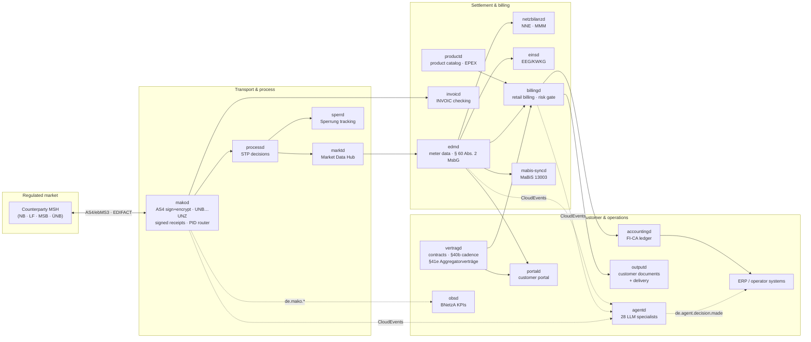

# mako ⚡

[](https://github.com/hupe1980/mako/actions/workflows/ci.yml)
[](./LICENSE-MIT)
[](https://www.rust-lang.org/)
[](https://www.edi-energy.de/)
[](https://github.com/hupe1980/mako/pkgs/container/makod)

> **⚠️ Experimental** — Pre-1.0. APIs may change between releases. Not yet recommended for production without thorough in-house testing.

**mako is the open-source market-operations platform for the German energy market**: every
regulated process — market communication, metering data, settlement, billing — modeled as a
correct, auditable, event-sourced workflow, for every market role (NB, LF, MSB, ESA), from
raw EDIFACT bytes to production microservices. In a sector of closed suites facing the
IS-U sunset, mako is the only end-to-end platform whose source you can read, verify, and
extend — built for the regulatory pace (LFW24, §14a, §41a, §42b/c, the EDIFACT→API
transition) that batch-era systems strain under. The domain layer is deliberately split
from transport and format so that when the market moves — MaBiS-Hub, the EDIFACT→API
target landscape, European harmonization — mako moves with a codegen run, not a rewrite.

The workspace covers the full BDEW MaKo stack across five layers:

| Layer | What it is |
|---|---|
| **Protocol** | `edi-energy` EDIFACT · `dvgw-edi` DVGW gas · `redispatch-xml` Redispatch 2.0 · `mako-engine` event-sourced process runtime · `makod` daemon |
| **Market data** | `mako-markt` library · `marktd` Market Data Hub (PostgreSQL, CloudEvents, OIDC/JWT, EventBus) |
| **Settlement & billing** | `grid-billing` + `netzbilanzd` NNE/MMM/MSB settlement · `eeg-billing` + `einsd` EEG/KWKG · `energy-billing` + `billingd` retail billing |
| **Customer management** | `accountingd` FI-CA ledger · `portald` customer portal · `outputd` customer documents · `vertragd` contracts · `productd` tariff catalog · `agentd` AI orchestration |
| **Agent surface** | 15 of the 17 services expose an MCP server — **163 tools** — and `agentd` is the governed consumer: 28 declarative specialists on the [agentplane](https://github.com/hupe1980/agentplane) durable runtime, every model and tool call a journaled effect, four-eyes before anything acts |
| **Testing** | `makotest` — Python toolkit over the same Rust core: BDEW identifier check digits, the published answer-Frist table, the Entscheidungsbaum Antwortcodes, AHB-validated EDIFACT, counterparties that answer in EDIFACT, seeded EPEX curves, and a `pytest` plugin ([README](makotest/README.md)) |

---

## Architecture at a Glance


```mermaid
flowchart LR
    subgraph Market["Regulated market"]
        MP["Counterparty MSH<br/>(NB · LF · MSB · ÜNB)"]
    end

    subgraph Transport["Transport & process"]
        MAKOD["makod<br/>AS4 sign+encrypt · UNB…UNZ<br/>signed receipts · PID router"]
        PROCESSD["processd<br/>STP decisions"]
        MARKTD["marktd<br/>Market Data Hub"]
        SPERRD["sperrd<br/>Sperrung tracking"]
    end

    subgraph Settlement["Settlement & billing"]
        EDMD["edmd<br/>meter data · § 60 Abs. 2 MsbG"]
        NETZB["netzbilanzd<br/>NNE · MMM"]
        EINSD["einsd<br/>EEG/KWKG"]
        BILLINGD["billingd<br/>retail billing · risk gate"]
        INVOICD["invoicd<br/>INVOIC checking"]
        MABIS["mabis-syncd<br/>MaBiS 13003"]
        PRODUCTD["productd<br/>product catalog · EPEX"]
    end

    subgraph Business["Customer & operations"]
        VERTRAGD["vertragd<br/>contracts · §40b cadence<br/>§41e Aggregatorverträge"]
        ACCOUNTINGD["accountingd<br/>FI-CA ledger"]
        OUTPUTD["outputd<br/>customer documents<br/>+ delivery"]
        PORTALD["portald<br/>customer portal"]
        OBSD["obsd<br/>BNetzA KPIs"]
        AGENTD["agentd<br/>28 LLM specialists"]
        ERP["ERP / operator systems"]
    end

    MP <-->|"AS4/ebMS3 · EDIFACT"| MAKOD
    MAKOD --> PROCESSD --> MARKTD
    MARKTD --> EDMD --> NETZB & EINSD & BILLINGD & MABIS
    MAKOD --> INVOICD
    PRODUCTD --> BILLINGD
    BILLINGD --> ACCOUNTINGD
    BILLINGD --> OUTPUTD
    VERTRAGD --> BILLINGD
    PROCESSD --> SPERRD
    EDMD & VERTRAGD --> PORTALD
    MAKOD -.->|"de.mako.*"| OBSD
    MAKOD & BILLINGD & EDMD -.->|"CloudEvents"| AGENTD
    AGENTD -.->|"de.agent.decision.made"| ERP
    ACCOUNTINGD --> ERP
```

## Workspace at a Glance

### Protocol & Domain Crates

| Crate / service | Purpose |
|---|---|
| `edi-energy` | Parse · validate · build all 17 EDI@Energy EDIFACT message types |
| `mako-engine` | Event-sourced runtime: `Workflow`, `Process`, `EventStore`, outbox, deadlines |
| `mako-gpke` | GPKE workflows — UTILMD Strom supplier-switch (55001–55018) + **Ersatz-/Grundversorgung** (55013–55015, §36/§38 EnWG, both roles) + **Stammdatenänderung** (GPKE Teil 4: 55615–55694, 55109/55110 — apply MaLo change + Rückmeldung A01/A02) + Anfrage Daten (55555, GPKE Teil 4) + Sperrung ORDERS (17115–17117) + INVOIC (31001–31002, 31005–31006) + ORDERS/ORDRSP Konfiguration (17134/17135, 19001/19002) + PARTIN Strom (37000–37006) |
| `mako-wim` | WiM workflows, **Strom und Gas** — MSB-Wechsel UTILMD (55039/55042/55051/55168 und die Gas-Zwillinge 44039/44042/44051/44168, beantwortet mit `SG4 STS+E01` aus `E_0200`…`E_0240` bzw. `E_2000`…`E_2006`, DE 1131 nennt die Codeliste `S_00xx`/`G_00xx`) + die IFTSTA-Gesamtvorgangsstrecke 21009–21013, die die Zuordnung konstitutiv macht (00:00 Uhr Strom, **06:00 Uhr** Gastag) + Geräteübernahme ORDERS 17001 → ORDRSP 19001/19002 und Gerätewechselabsicht 17009 → 19015/19016 + Weiterverpflichtung 17002 → 19003/19004 + Stammdaten + Preisanfrage REQOTE/QUOTES (35001/35002/35004/35005 → 15001/15002/15004/15005, vier verschiedene Fristen) + Preisliste PRICAT (27001–27003) + Technik-Änderung (17011/17118 → 19005/19006) + Rechnungsabwicklung über den LF (17005/17006 → 19009/19010) + INSRPT (23001–23012) + iMS Steuerungsauftrag + INVOIC (31009 MSB-Rechnung Strom, 31003 Abrechnung von Dienstleistungen in beiden Sparten, 31004 Storno). **WiM Teil 2 ESA Wertebestellung** (§34 MsbG) — ein `wim-wertebestellung`/`esa-wertebestellung`-Prozess spannt REQOTE **35003** → QUOTES 15003 → ORDERS 17007/17008 → ORDRSP 19011/19012 → ORDCHG 39002 Storno → ORDRSP 19013/19014, dazu MSCONS 13027 Werte-nach-Typ-2 |
| `mako-geli-gas` | GeLi Gas 3.0 workflows — UTILMD G supplier-switch Gas (44001–44021) + **Stammdatenänderung** (44109–44182 — change families: Zustimmung/Ablehnung E15/E13/E17, Monatserster rule for bilanzierungsrelevante changes; Anfrage families G8–G10 auto-answer with a data-return of the requested MaLo master data) + INVOIC 31011 (Rechnung sonstige Leistung, AWH Sperrprozesse Gas) |
| `mako-mabis` | MABIS workflows — PID 13003 (Bilanzkreisabrechnung Strom, BKV↔ÜNB) + PIDs 55065/55069/55070 (Clearingliste) |
| `mako-emob` | **NZR-EMob / Modell 2** (BK6-20-160 Anlage 6, BK6-24-267) — the virtual Bilanzierungsgebiet a Ladepunktbetreiber runs to book each charging session into the customer's supplier's Bilanzkreis. Allocation engine holding the Anlage 6 §IV.1 conservation identity (`NGZ = Σ Zuordnungen + Deltamenge`, exact per ¼ h **and direction**), BG lifecycle, session→¼-h split with `Provenance`, versions on MaBiS `Datenstatus`. Three Modellwechsel-Workflows (`emob-anmeldung` 55238/55239, `emob-zuordnungsende` 55240/55241, `emob-abmeldung` 55242/55243) routed and rendered by `makod`; an unanswered leg **escalates** rather than confirming, because no published rule gives it a default outcome. Trees `E_0510`–`E_0513` in `mako-pruefung`, Antwortfristen in `mako-fristen`, UTILMD 55235–55243 AHB profiles in `edi-energy`. The Zuordnung des ZP der NGZ zur NZR (55235–55237) is **MaBiS**, not Modell 2, and rides `mako-mabis`'s ZP lifecycle |
| `mako-gabi-gas` | GaBi Gas 2.1 (BK7-24-01-008) — INVOIC 31010/31007/31008 + MSCONS 13013 MMMA + DVGW ALOCAT/NOMINT/NOMRES (3 workflows); typed domain: `GasDay` (DST-aware 06:00 CET), `GasQuantity` (Decimal kWh_Hs), `GasBeschaffenheit` (Hs + Zustandszahl, DVGW G 685), `AllocationVersion` (Initial/Correction/Final), `GasMarketRole`, `GasPortfolioBalance` |
| `mako-nbw` | Netzbetreiberwechsel — PARTIN bulk DSO concession handover (PIDs 37000–37014) — placeholder |
| `mako-as4` | BDEW AS4-Profil v1.2 — `BdewAs4Profile`, `bdew_pmode()` (sign+encrypt, X509PKIPathv1, BrainpoolP256r1), `bdew_push_policy()` (require_encrypted_inbound), `BdewTestPki` + `MockAs4Endpoint::builder().with_decryption_key_pem(key)` (full encrypt round-trip, testing feature), per-partner encryption cert registry; asx-rs **v0.13** — SwA payload packaging with an empty SOAP Body (BDEW §2.2.3.2), synchronous receipt verification (`verify_sync_response` / `send_and_verify`: signature-bound, NRI-digest-verified Non-Repudiation of Receipt), `regulated_with_decryption_key()`, `with_signing_material()`, `As4HttpTransport::new_for_localhost_testing()`, partial `As4SendCredentials` fallback |
| `dvgw-edi` | DVGW EDIFACT formats — ALOCAT, NOMINT and NOMRES parsing for GaBi Gas 2.1 (BK7-24-01-008) |
| `mako-redispatch` | Redispatch 2.0 workflows — XML document types (`ActivationDocument`, `Stammdaten`, `NetworkConstraintDocument`, …) + IFTSTA PIDs 21037/21038 |
| `redispatch-xml` | Redispatch 2.0 XML/XSD format parsing — all 9 document types |
| `energy-api` | BDEW API-Webdienste Strom — REST/WebSocket client + Axum server for iMS processes |
| `mako-fristen` | The German market calendar, in one leaf crate — BDEW Werktage and the MaKo holiday table, the CONTRL/APERAK/Antwortfrist clocks, the per-Prüfidentifikator answer and Meldung tables, and `heute()`/`berlin_date()`/`berlin_midnight()`: a business date is a Europe/Berlin date, never a UTC one |
| `mako-markt` | Master data library — `MaloId`, `MeloId`, `MarktpartnerId`, repository traits (incl. `LokationszuordnungRepository`, `TechnischeRessourceRepository`), CloudEvents, test doubles |

### Settlement, Billing & Calculation Crates

| Crate / service | Purpose |
|---|---|
| `grid-billing` | Role-neutral German grid **settlement** engine — `settle_nne`, `settle_mmm`, `settle_msb`, `settle_gas_awh`, `reverse`, `correct`; returns `SettlementResult`/`InvoiceDocument`; every position carries `CalculationTrace` with `LegalReference`s (StromNEV §17/§21, GasNEV §14, KAV §2, §14a EnWG, ARegV) and `TariffSource`; `Sparte` drives Gas vs. Strom legal refs; `KaKundengruppe` annotates the KAV tier; regime turnovers enforced (`ensure_berechenbar` refuses AgNeS-era settlements); zero I/O; BO4E only via the opt-in `bo4e` feature (`grid_billing::bo4e::into_rechnung`) |
| `eeg-billing` | Pure EEG/KWKG feed-in settlement library — `calculate_settlement` for all 10 settlement schemes (`SettlementScheme + TariffSource`, EEG 2000–2023 + KWKG 2023); §51 Negativpreisregel (version-aware: EEG 2017/2021/2023 thresholds + Bestandsschutz); §51a Verlängerungsanspruch; §52 Pflichtzahlungen (€10/kW) + §52 Abs. 6 Netting; Anlage 1 gleitende Marktprämie (no additive Managementprämie); §49 semi-annual solar degression; §36h Abs. 1/2 Wind Korrekturfaktor + Standortgüte re-eval; §39n Innovationsausschreibung feste Marktprämie; §51a Förderende-Verlängerung; §24 multi-block `CapacityBlock`; `SettlementPeriodState` lifecycle state machine; **§14 UStG Gutschrift** (opt-in `bo4e` feature → BO4E `Rechnung` with per-rate USt breakdown, VAT from declared `ust_status`); zero float money; no I/O |
| `energy-billing` | Retail energy billing engine (LF role) — `Product` typed enum (13 categories, serde-tagged); per-category typed structs (`ElectricityProduct`, `GasProduct`, …); `ControllableLoadProvider` for §14a; `BillingEngine.validate()` + `bill_batch()`; `Invoice.warnings`; §41a Abs. 1 iMSys guard; `Invoice::to_en16931` (EN 16931 model, opt-in `en16931` feature); `StromsteuerBefreiung` typed enum; `EnergieQuellen` CO₂ label; RLM demand charge; §54 EnergieStG exemption; historic levy lookups; §41a EPEX; HT/NT ToU; zero I/O; rubo4e behind the opt-in `bo4e` feature (typed `Rechnung` bridge) |
| `invoic-checker` | INVOIC plausibility — 6 checks (period validity, position arithmetic, document total, tariff match ToU-aware, tariff found, MMM settlement price check) |
| `mako-pruefung` | The BDEW answer rules, executable — NB trees (`E_0622`/`E_0623`, `E_0607`, `E_0608` and the Gas `G_0011`/`G_0012`/`G_0007`), LF trees (`E_0609`, `E_0624`, `E_0614`, `E_0615` + Gas) and the WiM Messstellenbetrieb trees (`E_0200`–`E_0203`, `E_0240`, `E_0247`, `E_0249`/`E_0250`); resolves the Antwortcode for `SG4 STS+E01` / ORDRSP `AJT` **within its own tree**, so a Strom code cannot ride a Gas answer and a GPKE code cannot ride a WiM one; no I/O, no clock |

### Production Services (17 daemons)

| Service | Port | Role | Purpose |
|---|---|---|---|
| `makod` | `:8080` · `:4080` · `:8090` | All | Protocol daemon — 70+ GPKE/WiM/GeLi Gas/MaBiS/GaBi Gas/NZR-EMob workflows, AS4/REST/iMS, Cedar ABAC, OIDC/JWT, MCP server |
| `marktd` | `:8180` | All | Market Data Hub — MaLo/MeLo/contracts, VersorgungsStatus incl. Ersatz-/Grundversorgung, Grundversorger registry (§36 Abs. 2), the dated per-MeLo MSB timeline derived from IFTSTA 21012 and the Messstellenbetriebsverträge `E_0200` decides on, typed BO4E API, EventBus fan-out, MMMA monthly import worker |
| `processd` | `:8580` | NB+LF+MSB | Process Decision Engine — Anmeldung STP ≥ 95%, EoG gap closure + §38 timer, LF answer automation (55007/55010), MSB-Wechsel STP against the WiM Entscheidungsbäume incl. the Mindestvorlaufzeit, MSB REQOTE auto-response, §14a Steuerungsauftrag |
| `invoicd` | `:8280` | LF | INVOIC plausibility check — 10 billing PIDs through one table-driven pipeline (Strom + Gas NNE, MMM, MSB, AWH, Sparte-neutral Storno 31004); persist-before-dispatch § 147 AO receipts with a dead-letter queue for anything that cannot become one; PID-aware answer + operator re-dispatch; self-issued Mehrmengen-Rechnung 31006 via `settle_mmm`; leased ERP outbox + one-shot overdue notice; 7-tool read-only MCP server |
| `netzbilanzd` | `:8680` | NB | NNE/KA/MMM/MSB/AWH settlement — INVOIC 31001 (Abschlagsrechnung, deducted from what is owed by the invoice that settles the period), 31002 (NN-Rechnung, Sparte on the document not the PID), 31005, 31009 (issued **by** the MSB), 31011; consecutive invoice numbering per §14 Abs. 4 Nr. 4 UStG; 19 % Umsatzsteuer with §13b reverse charge on Mehr-/Mindermengen; all three §14a modules; §42b GGV per metered tenant; Storno/Korrektur recomputed from the stored settlement input; Redispatch Kostenblatt, §13a Vergütung and BilAReM Ausfallarbeit; 8-tool **read-only** MCP server |
| `sperrd` | `:8780` | NB | Sperr-/Entsperrauftrag execution queue — ORDERS 17115/17117 ingest, field dispatch with the Treffpunkt, IFTSTA 21039 out with a retry queue, `de.sperr.*` events, 4-tool read-only MCP server |
| `edmd` | `:8380` | All | Energy Data Management — built on the `metering` (computation) and `meterstore` (hot/cold storage) crates: MSCONS, **Zählerstandsgang→Lastgang differencing at the MSB (BK6-24-174, wirksam 06.06.2025)**, iMSys direct push, Kafka batch ingest (optional per-message HMAC), Hampel quality scoring, V01–V09/V11/V12 validation, virtual meters (§42b GGV), § 40a Abs. 2 EnWG Verbrauchsschätzung **and Schätzwert-Bestätigungsschleife** (estimated-reading confirmation tracking with overdue escalation), §22 EnWG Netzverlust indicator, Iceberg/S3 OLAP, 15-tool MCP server |
| `mabis-syncd` | `:8880` | ÜNB/NB | MaBiS Summenzeitreihen (MSCONS 13003) — aggregates per-MaLo Lastgang from edmd (Strom only, Bezugsregister only) into **one filing per Bilanzierungsgebiet**, each tracked in `submission_series` so a retry never re-files what the BIKO already acked; refuses rather than under-reporting a territory; Erstaufschlag 1.–10. WT / Clearing 11.–30. WT / KBKA windows per BK6-24-174 Anlage 3 §3.10; duplicate-filing guard on both entry points; emits `de.mabis.*` through the transactional outbox; read-only MCP surface |
| `einsd` | `:9180` | NB/LF | Einspeiser Registry + EEG/KWKG settlement — 10 settlement schemes, §52 sanctions, §51 neg-price, 19 MCP tools + 6 prompts |
| `obsd` | `:8480` | All | Business-process observability — KPI reports, §20 EnWG parity, automated deadline computation, `GET /api/v1/audit/bnetza-report` |
| `productd` | `:9080` | LF | Product & Tariff Catalog — **14 categories** (STROM/GAS/WAERME/WASSER/SOLAR/EEG/EINSPEISUNG/WAERMEPUMPE/WALLBOX/HEMS/EMOBILITY/ENERGIEDIENSTLEISTUNG/BUNDLE/SHARING §42c); OIDC/JWT auth; `product_status` DRAFT/PUBLISHED workflow; §41c EnWG comparison-portal feed (public by law, ETag-cached, BO4E `Tarifinfo`); EPEX Spot for §41a; B2B Angebote ANGELEGT→ANGENOMMEN; **13-tool MCP server + 3 prompts** |
| `billingd` | `:9280` | LF | Energy Billing Engine — **all commercial prices user-defined in `productd`**; pure calculation via `energy-billing` crate; `STROM` (SLP/RLM Eintarif/HT/NT; `leistungspreis_strom_ct_per_kw_month` demand charge; §14a Modul 1/3 via `ControllableLoadProvider`; §41a Abs. 1 iMSys guard); `GAS` (§25 Nr. 4 MessEV Brennwertkorrektur, Energiesteuer, **§54 KWK exemption**, BEHG CO₂, RLM Leistungspreis, indexed TTF/NCG); `WAERME`; `SOLAR` §42b/§42a; `EEG`/`EINSPEISUNG`; §41a EPEX dynamic; **§41a Abs. 1 iMSys enforcement**; `StromsteuerBefreiung` typed enum (§9 Nr. 1-5); `EnergieQuellen` CO₂ label; `Invoice.warnings`; **historic levy lookups** (`stromsteuer_for_year`, `energiesteuer_gas_for_year`; commodity-aware VAT history incl. the 7 % gas/Fernwärme window 10/2022–03/2024); **VPP auto-billing** (`de.vpp.dispatch.confirmed` → `Rechnung`, § 41e EnWG / Art. 17 RL (EU) 2019/944); **EN 16931 e-invoicing** (semantic model in `en16931_json`, CII + PEPPOL UBL via `en16931-formats`; BG-7 buyer from `vertragd.kunden`; BT-24 declares plain EN 16931 for retail and upgrades to XRechnung 3.0 only on the B2G path, which is profile-validated before writing); **ZUGFeRD PDF/A-3 documents via `outputd`** (billingd proves the payload against the profile it declares before it leaves, projects the template view, and pins the answered template hash per issued invoice for § 147 AO); **deterministic risk gate** (banded 0–100 scoring, HELD dispatch block + analyst release); **§40b billing-run worker** (cadence from vertragd, monthly iMSys Abrechnungsinformation); **11 MCP tools** |
| `outputd` | `:9880` | — | Customer Communications — renders what other services computed and **delivers it**, never recomputes a number; operator-owned **Typst templates** in a no-I/O sandbox (content-addressed, append-only store; publishing gated by proof: payload validated, PDF/A enforced, finished file read back with `en16931-formats::zugferd::extract`, § 14 Abs. 4 UStG terms on the page); **ZUGFeRD PDF/A-3 carrier** (Factur-X XMP by incremental update) around the caller's CII payload; Textform kinds (`MAHNUNG` § 126b BGB with a Stufe-3 gate, `PREISANPASSUNG` § 41 Abs. 5 EnWG with a mixed-change gate that requires the Sonderkündigungsrecht on the page) share the store so one brand has one template system; **issued documents are stored byte-for-byte** (§ 14 Abs. 1 UStG / § 147 AO — a reproduction, never a re-render) and **delivered** over portal inbox, e-mail relay, print spool or ERP with per-channel evidence and a retry ceiling; external validation panel containerized (veraPDF + Mustang, `just zugferd-verify`) |
| `accountingd` | `:9380` | LF | Massenkontokorrent / Customer Account Ledger — **tamper-evident double-entry ledger** on the `doubleentry` crate (append-only BLAKE3 Merkle log, `O(log n)` inclusion proofs, period seals for GoBD/§146 AO **Festschreibung**, store-level idempotent CE ingest); per-MaLo Kontokorrent + GL contras; **Abschläge as receivables** (`ABSCHLAG` debit against Erhaltene Anzahlungen, discharged by an `ABSCHLAG_VERRECHNUNG` when the settling invoice deducts them, with a register carrying each advance's § 14 Abs. 5 Satz 2 UStG rate); **FIFO open-item clearing**; **Summen- und Saldenliste** §238 HGB; aging analysis; Verzugszinsen §288 BGB; Zahlungsvereinbarung (payment plans); pain.008 single-message multi-group (mandatory Gläubiger-ID EPC AT-02) with per-mandate collection tracking; **pain.007 creditor reversals**; **pain.002 ingestion incl. Verification of Payee**; camt.052/053/054 XML and flat-export dedup import (booked entries only) with an IBAN → EndToEndId → remittance-token payment-resolution ladder; ISO 20022 structured postal addresses (EPC cut-over 2026-11-15); keyed-BLAKE3 IBAN hash; OIDC/JWT + inbound HMAC; auto-Mahnwesen that **renders and delivers each case as a MAHNUNG through `outputd`**; §40b Abs. 1 EnWG Jahresabschluss on demand or from the annual worker |
| `portald` | `:9480` | LF | Customer Portal read-model gateway — stateless aggregation of Lastgang/invoices/ledger/VersorgungsStatus/EEG plus the §41 EnWG self-service writes and the **document inbox** (what was actually issued and sent, served out of `outputd`, with the portal read receipt recorded on open); **every route resolves customer ownership through `vertragd`** and object ownership is re-checked on every download; notice periods and IBAN validation stay in the services that own them; 8-tool operator MCP server |
| `vertragd` | `:9780` | LF + MSB | Contract & Customer Management — every contract with a Kunde on one side: Kunden (B2C + B2B), Rahmenverträge (cascade Kündigung, `angebot_id` CPQ traceability), Versorgungsverträge, §§ 9/10 MsbG Messstellenverträge (read by `processd` to answer a WiM Kündigung out of `E_0200`), §41e Aggregatorverträge; OIDC/JWT auth; Preisgarantie guard (§41 EnWG); **§ 41 Abs. 5 Preisänderungsanzeige** rendered and delivered through `outputd`, refused when the Tarifwechsel states no Umfang; `widerruf-kuendigung`; dispatch retry (3×); proactive expiry notifications; GDPR Art. 15/17/20; OIDC→MaLo authorization gateway; **17-tool MCP server + 4 prompts** |
| `agentd` | `:9580` | All | Multi-agent LLM orchestration — **28 declarative specialist manifests** run on the [agentplane](https://github.com/hupe1980/agentplane) durable runtime; every model and tool call is a journaled effect; four-eyes worklist for mutating calls; per-MaLo cases as the erasure unit; A2A agent cards derived from the manifests; Anthropic, OpenAI, Gemini, self-hosted (TGI/vLLM/Ollama), AWS Bedrock |


---

## ✨ Features

### EDIFACT layer (`edi-energy`)

| Category | Detail |
|---|---|
| 📦 **17 message types** | UTILMD, MSCONS, APERAK, CONTRL, INVOIC, REMADV, ORDERS, IFTSTA, INSRPT, REQOTE, PARTIN, ORDCHG, ORDRSP, QUOTES, COMDIS, PRICAT, UTILTS |
| 🔍 **5-layer validation** | Schema, code lists, MIG structure, AHB Prüfidentifikator rules, semantic cross-field rules — all appended to one `ValidationReport` |
| 🔤 **Declared character repertoire** | `UNB+UNOC:3` is ISO 8859-1, not UTF-8 — parsing transcodes by the repertoire the interchange itself declares, and `InterchangeBuilder` encodes back into it |
| 📅 **Annual release lifecycle** | Multi-version profile registry with 7-day transition grace windows (BDEW-compliant) |
| 🔒 **Security by default** | DoS limits (max 10 MB, 10 000 segments), log-injection sanitisation, fuzz-tested with 1 373+ corpus entries |
| 🛠️ **Fluent message builders** | Type-state builder API with compile-time mandatory field enforcement |
| 🔁 **Round-trip serialisation** | Parse → validate → serialize with byte-exact EDIFACT output |
| 🧪 **Code-generated profiles** | 39 profiles across 17 types, regenerated annually via `cargo xtask codegen` |

### DVGW gas transport layer (`dvgw-edi`)

| Category | Detail |
|---|---|
| 📦 **3 DVGW message types** | ALOCAT, NOMINT, NOMRES — the three GaBi Gas 2.1 needs |
| 🔗 **Correlation helpers** | `nomination_ref` links NOMINT → NOMRES |
| 🔀 **Synthetic PID routing** | `detect_pid(role_qualifier)` maps each direction to unique PIDs in range 90001–90062 for `mako-engine` integration |
| 🧪 **Independent of edi-energy** | Separate `DvgwPlatform`; shares no parser state with the BDEW EDIFACT stack |
| 📜 **Regulatory basis** | BNetzA BK7-24-01-008 · DVGW G 685 · Kooperationsvereinbarung Gas |

### Redispatch 2.0 XML layer (`redispatch-xml`)

| Category | Detail |
|---|---|
| 📦 **9 CIM/IEC 62325 document types** | `ActivationDocument`, `PlannedResourceSchedule`, `AcknowledgementDocument`, `Stammdaten`, `Unavailability`, `NetworkConstraintDocument`, `Kaskade`, `StatusRequest`, `Kostenblatt` |
| 🔍 **Two-phase validation** | `parse_and_validate()` — XSD structural check + semantic cross-field rules in one call |
| 🔁 **Round-trip serialization** | Parse → serialize with byte-stable XML output |
| 🔑 **Document correlation** | `Document::mrid()`, `sender_id()`, `receiver_id()` — routing keys for `AcknowledgementDocument` process matching |
| 🔒 **`#![deny(unsafe_code)]`** | Memory-safe XML processing; no `unsafe` in the parse path |
| 📜 **Regulatory basis** | BNetzA BK6-20-059 · BK6-20-060 · BK6-20-061 · NABEG §§ 13, 13a, 14 EnWG |

### Master data layer (`mako-markt`)

| Category | Detail |
|---|---|
| 🆔 **Validated domain IDs** | `MaloId` (11-digit BDEW check-digit), `MeloId` (DE+31-char), `MarktpartnerId` (13-digit; auto-derives NAD DE3055 agency code `293`/`332`/`9` from prefix) |
| 🗂️ **29 repository traits** | One trait per aggregate — `MaloRepository`, `MeloRepository`, `ContractRepository`, `PartnerRepository`, `LokationszuordnungRepository`, `TechnischeRessourceRepository`, `SteuerbareRessourceRepository`, `CorrelationIndex`, … — AFIT, no `dyn Trait` overhead |
| ⏳ **Temporal role assignments** | `Rollenzuordnung` with `valid_from`/`valid_to` — evaluated against CET/CEST German calendar date at query time |
| 📨 **CloudEvents 1.0** | Outbound events (`MarktEvent`) with HMAC-SHA256 signing; `InboundMakoEvent` for receiving `makod` lifecycle events |
| 🧪 **`testing` feature** | `InMemory*` test doubles for every repository trait — no PostgreSQL required in unit tests |
| 🚫 **Zero framework deps** | No axum, sqlx, or async runtime — pure domain library; all I/O lives in `services/marktd` |

### BO4E typed API (`marktd`)

**88 active `rubo4e::current` types — every payload, in or out, crosses one four-stage gate**, decoded through `rubo4e`'s own depth-capped entry point.

| Category | Detail |
|---|---|
| 📦 **Typed responses** | `GET /api/v1/malos` → `Marktlokation`; `GET /api/v1/melos` → `Messlokation`; `GET /api/v1/zaehler` → `Zaehler`; `GET /api/v1/geraete` → `Geraet` — all canonical BO4E camelCase |
| 🔍 **One gate on write** | `mako_markt::bo4e::decode`, at every BO4E endpoint: `_typ` (injected when absent, refused when it names another BO) → typed deserialization → **strict enums** by JSON-path → the rules BO4E states in prose and enforces nowhere. Every refusal is a 422 with the same `code`. Of the 35 BOs, exactly two declare a `required` field and none declares a `oneOf`, so "it deserialises" is not validation |
| 📤 **Nothing is emitted that would be refused** | The same rules run outbound — over every shape the three billing engines can produce, and at runtime wherever a document is *assembled* (a Sammelrechnung, a Rechnung merged with its Fremdkosten). Money is compared at the scale of the stated total |
| 🏦 **Identifiers and bank details** | A customer's **IBAN** (ISO 7064 MOD-97-10) and **BIC** (ISO 9362) are checked before storage, so a typo is a 422 rather than a returned direct debit; `MaloId`, `MeloId` and `EicCode` carry their check digits |
| 📋 **`Vertrag` for LRV exchange** | `nb_contracts` stores full BO4E `Vertrag` JSONB + typed SQL columns; `PUT /api/v1/nb-contracts` validates `vertragsart` / `vertragsstatus`; emits `de.markt.nb-contract.updated` CloudEvent |
| 👤 **`Geschaeftspartner` typed partners** | `PUT /api/v1/partners/{mp_id}` puts the BO4E `Geschaeftspartner` through the gate and stores the canonical round-trip. `GET` returns the typed `geschaeftspartner` field. |
| 🔢 **`Zaehlwerk` register access** | `GET /api/v1/zaehler/{id}/zaehlwerke` → `Vec<Zaehlwerk>` — OBIS registers for TOU billing and iMSyS demand management |
| ⏰ **`ZaehlzeitRegister` + `ZaehlzeitSaison`** | `GET/PUT /api/v1/zaehler/{id}/register` + `/zaehler-register/{id}/saisons` — iMSys TOU register definitions (HT/NT/EINZEL); `GET /api/v1/zaehler/{id}/tariff-zone?datetime=ISO` resolves zone in one SQL JOIN (§14a Modul 2) |
| ⚡ **`Energiemenge` deliveries** | `GET /api/v1/deliveries/{malo_id}` → `Vec<Energiemenge>` — typed ERP-consumable meter readings without EDIFACT parsing |
| 💰 **MMMA settlement prices** | `GET/PUT /api/v1/mmma-preise/gas/{year}/{month}` — Gas MMM Abrechnungspreise (Trading Hub Europe); `GET/PUT /api/v1/mmm-preise/strom/{year}/{month}` — Strom MMM Ausgleichsenergie per ÜNB. Both auto-fetched by `netzbilanzd` and validated by `invoicd` check 6. |
| 🗂️ **Fallgruppe + Bilanzierungsmethode auto-extract** | `makod` adapters extract `bilanzierungsmethode` (Z01→SLP, Z02→RLM, Z04→IMS) and `fallgruppe` (GaBi Gas, TM+Z10) from UTILMD `TM+EM` / `TM+Z10` segments. `marktd` `event_ingest` calls `patch_typenmerkmal()` on `de.mako.process.initiated` (PIDs 55001/44001) to keep `malo.fallgruppe` / `malo.bilanzierungsmethode` in sync. || 🏷️ **`Tarifpreisblatt` + `Preisblatt`** | `productd` stores all energy products as `Tarifpreisblatt` JSONB; category drives calculator selection; all prices are user-defined; schema validated on PUT (wrong `_typ` → 422); queried by `billingd` calculator for pricing inputs |
| 🔒 **One vocabulary per column** | Typed columns are derived from the typed BO, never a string lookup on its JSON, and hold BO4E wire values only. Each enum column's SQL `CHECK` is that enum's `VARIANTS`, compared against the schema by a `mako-markt` test. |
| 🧭 **UTILMD characteristics read by class** | `makod` reads SG10 `CCI`/`CAV` by DE 7059 Klassentyp *and* DE 7037 Merkmal — the two code spaces overlap (`Z18` = Regelzone or „Kein Haushaltskunde") — and maps them to BO4E enums: `CCI+Z30++Z06/Z07` → `Energierichtung`, `CAV+E03…E09` / `Y01…Y03` → `Netzebene`. Each mapping cites its MIG Strom S2.2 / Gas G1.2 segment number. |
| 🏷️ **Namespaced BO4E extensions** | What BO4E does not model rides in a `ZusatzAttribut` named `mako:<snake_case>` — 37, each registered with what it carries. BO4E mandates no convention for its extension slot, so `cargo xtask check-bo4e-attributes` enforces the prefix and keeps the registry consumers read. |
| ✅ **Outbound BO4E conformance** | What mako emits is checked, not just what it receives. Every emission site crosses the same gate — Sammelrechnung, Korrekturrechnung, VPP-Gutschrift, the self-issued INVOIC 31006, the EEG-Gutschrift, the Redispatch-Kostenblatt — because an engine test covers the shapes a builder produces but not the values a request supplies. Out-of-schema **fields** are refused alongside values (`Bo4eExtensions`); documents are built typed, never assembled as JSON, with `check-bo4e-discriminants` and `check-bo4e-examples` enforcing that in code and in the docs. A mako-only price type sits in `mako:preistyp`, never in BO4E's `preistyp`. |
| 🧾 **`Steuerbetrag` + `Registeranzahl`** | `energy-billing` projects the EN 16931 BG-23 tax breakdown into BO4E `Steuerbetrag` entries on the Rechnung JSON; `Registeranzahl` (Eintarif/Zweitarif) drives HT/NT position branching |
| 🏦 **`Zahlungsinformation` + `Zahlungsart`** | `accountingd` SEPA mandate registry stores structured payment info; pain.008 XML generated from `SepaMandateRow` (IBAN, BIC, Kontoinhaber, Mandatsreferenz) |
### Process engine layer (`mako-engine` + domain crates)

| Category | Detail |
|---|---|
| ♻️ **Event-sourced processes** | Optimistic-concurrency event append with SlateDB-backed storage |
| ⚛️ **Atomic dual-write** | Events and outbox messages written in a single `WriteBatch` via `AtomicAppend` |
| ⏰ **Regulatory deadlines** | `DeadlineStore` with GPKE 24h / WiM 5-Werktage / GeLi Gas 10-Werktage Fristen |
| 📨 **AS4 inbound transport** | `makod` receives BDEW AS4 pushes via `asx-rs`, deduplicates with `SlateDbInboxStore`, routes by Pruefidentifikator |
| 🔐 **Cedar ABAC authorization** | All HTTP endpoints gated by [Cedar](https://cedarpolicy.com) attribute-based access control; built-in default policy with custom policy overlay via `--cedar-policy-dir` |
| 🪪 **OIDC / JWT + API-key auth** | JWT bearer tokens from Azure AD, Keycloak, Okta, Kubernetes workload identity; RS256/ES256/PS256 families only; JWKS cached with background refresh; coexists with named API keys |
| 📡 **CloudEvents 1.0 ERP webhooks** | Outbound ERP notifications as [CloudEvents 1.0](https://cloudevents.io) structured-mode JSON (`application/cloudevents+json`), HMAC-SHA256 signed; natively routable by SAP BTP, AWS EventBridge, Azure Event Grid, Google Eventarc |
| 🔄 **Format-version coexistence** | Processes started under `FV2025-10-01` run to completion under those rules even after `FV2026-10-01` cutover |
| 🪦 **Dead-letter sink** | Structured `DeadLetterReason` variants — `UnknownPid`, `DuplicateMessage`, `VersionMismatch`, … |

---

## 🚀 Quick Start — EDIFACT parsing

```bash
cargo add edi-energy
```

```rust
use edi_energy::{parse, EdiEnergyMessage};

let input = std::fs::read("Netznutzung_20241015.edi")?;
let msg = parse(&input)?;
let report = msg.validate()?;
println!("Valid: {}", report.is_valid());
```

---

## 🚀 Quick Start — Process engine

```bash
cargo add mako-engine --features testing
cargo add mako-gpke
```

```rust
use mako_engine::{
    builder::EngineBuilder,
    ids::TenantId,
    version::WorkflowId,
    event_store::InMemoryEventStore,
};
use mako_gpke::lf_anmeldung::GpkeLfAnmeldungWorkflow;

let ctx = EngineBuilder::new()
    .with_event_store(InMemoryEventStore::new())
    .build();

// Spawn a new process for one delivery point.
let process   = ctx.spawn::<GpkeLfAnmeldungWorkflow>(TenantId::new(), wf_id);
let envelopes = process.execute(initiate_cmd).await?;

// Reconstruct typed state by replaying all persisted events.
let state = process.state().await?;
```

---

## 🚀 Quick Start — DVGW gas transport

```bash
cargo add dvgw-edi
```

```rust
use dvgw_edi::{DvgwPlatform, AnyDvgwMessage};

// Parse: dispatch by EDIFACT message type header, validate envelope
let msg = DvgwPlatform::default().parse(edi_bytes)?;

if let AnyDvgwMessage::Nomint(n) = &msg {
    println!("nomination ref: {:?}", n.nomination_ref);
    for qty in &n.quantities {
        println!("  {} {}", qty.location_code, qty.quantity);
    }
}

// Synthetic PID for mako-engine routing:
// BKV→FNB nomination → 90011; FNB→BKV response → 90012
let pid = msg.detect_pid(Some("Z01"));
```

---

## 🚀 Quick Start — Redispatch 2.0 XML

```bash
cargo add redispatch-xml
```

```rust
use redispatch_xml::{parse_and_validate, serialize, detect, DocumentType};

// Optionally detect document type before parsing (useful for routing)
let doc_type = detect(xml_bytes);

// Parse + validate in one step (recommended)
let doc = parse_and_validate(xml_bytes)?;

// Primary routing keys — use to correlate AcknowledgementDocument to process
println!("mRID:     {}", doc.mrid());
println!("sender:   {}", doc.sender_id());   // EIC of TSO/RSO
println!("receiver: {}", doc.receiver_id());

// Serialize back to XML (byte-stable round-trip)
let out = serialize(&doc)?;
```

---

## 🚀 Quick Start — Master data (`mako-markt`)

```bash
cargo add mako-markt --features testing
```

```rust
use mako_markt::domain::{MaloId, MeloId, MarktpartnerId};

// Validated identifiers — construction returns Err on malformed input
let malo_id = MaloId::new("51238696012")?;
let melo_id = MeloId::new("DE0001234567890123456789012345678")?;
let mp_id   = "9900357000004".parse::<MarktpartnerId>()?;

// NAD DE3055 agency code derived from MP-ID prefix automatically:
// "99…" → "293" (BDEW Strom), "98…" → "332" (DVGW Gas), other → "9" (GS1)
assert_eq!(mako_markt::domain::nad_agency_code(&mp_id), "293");

// In tests — use InMemory* doubles; no PostgreSQL required
use mako_markt::testing::InMemoryMaloRepository;
let repo = InMemoryMaloRepository::default();
```

---

## 📋 Format and Document Coverage

### BDEW EDI@Energy (`edi-energy`) — 17 EDIFACT message types

| Message | EDIFACT type | Latest release | Use case |
|---|---|---|---|
| UTILMD Strom | `UTILMD` | S2.2 (`fv20261001`) | Grid connection (supplier switch, registration) |
| UTILMD Gas | `UTILMD` | G1.2 (`fv20261001_gas`) | Gas grid connection processes |
| MSCONS | `MSCONS` | 2.5 (`fv20261001`) | Metered services consumption reports |
| APERAK | `APERAK` | 2.2 (`fv20261001`) | Application error acknowledgements |
| CONTRL | `CONTRL` | 2.0b (`fv20260101`) | Interchange control acknowledgements |
| INVOIC | `INVOIC` | 2.8e (`fv20261001`) | Invoices |
| REMADV | `REMADV` | 2.9f (`fv20261001`) | Remittance advice |
| ORDERS | `ORDERS` | 1.4c (`fv20261001`) | Purchase orders |
| IFTSTA | `IFTSTA` | 2.1 (`fv20261001`) | Multimodal status reports |
| INSRPT | `INSRPT` | 1.1a (`fv20260101`) | Inspection reports |
| REQOTE | `REQOTE` | 1.3c (`fv20261001`) | Requests for quotation |
| PARTIN | `PARTIN` | 1.1 (`fv20261001`) | Party information |
| ORDCHG | `ORDCHG` | 1.2 (`fv20261001`) | Purchase order changes |
| ORDRSP | `ORDRSP` | 1.4c (`fv20261001`) | Purchase order responses |
| QUOTES | `QUOTES` | 1.3c (`fv20261001`) | Quotations |
| COMDIS | `COMDIS` | 1.0h (`fv20260401`) | Commercial dispute (Handelsunstimmigkeit) |
| PRICAT | `PRICAT` | 2.1 (`fv20261001`) | Price/sales catalogue |
| UTILTS | `UTILTS` | 1.1e (`fv20261001`) | Technical master data |

### DVGW gas transport (`dvgw-edi`) — 3 message types

| Message | Version | Direction | Use case |
|---|---|---|---|
| ALOCAT | 5.11a | FNB/MGV/VNB → BKV | Gas quantity allocation list |
| NOMINT | 4.6 FK | BKV → FNB/MGV | Nomination submission |
| NOMRES | 4.7 FK | FNB/MGV → BKV | Nomination response / matching result |

The other DVGW transport formats (SCHEDL, IMBNOT, TRANOT, DELORD/DELRES, SSQNOT,
CHACAP, NUEVOR, SLPASP, TSIMSG) are out of scope: GaBi Gas 2.1 does not need
them, and a workflow for a format nothing parses would be unreachable.

### Redispatch 2.0 XML (`redispatch-xml`) — 9 document types

**BK6-23-241 (07.05.2026) is the basis, and it repealed its predecessors.**
BK6-20-060 and BK6-20-061 are gone (Tenorziffern 4 and 3), BK6-20-059
Tenorziffer 1 with the end of 30.06.2026 — and what replaces them is not a new
table of Fristen but an obligation on the ÜNB to develop bundesweit einheitliche
Prozessbeschreibungen (Tenorziffer 7). So a deadline here is either **sourced**
from a document that still states it, or the **operator's own**, with the
historical figure offered as a labelled default (`fristen::Betreiberfristen`).

| Document type | Deadline | Where it comes from |
|---|---|---|
| `AcknowledgementDocument` | 3 min from receipt of the Übertragungsdatei | **sourced** — `AcknowledgementDocument` FB 1.0g. Never six hours |
| `ActivationDocument` | 5 min | operator's own; historically BK6-20-060 (repealed) |
| `Stammdaten` (VNB → ÜNB) | 1 Werktag | operator's own; historically BK6-20-060 (repealed) |
| `Kostenblatt` | 15th of the following month | operator's own; historically BK6-20-061 (repealed) |
| `PlannedResourceScheduleDocument` | Vorab-Information 30 min before validity (Prognosemodell) | **sourced** — BilAReM Kap. 6.3.1 |
| `Unavailability_MarketDocument` | — | — |
| `NetworkConstraintDocument` | — | — |
| `Kaskade` | — | — |
| `StatusRequest_MarketDocument` | none | it is a Marktpartner availability notification, not a request/response pair — there is no answer document and no 24-hour window |

---

## 📖 Documentation

Full documentation lives at **[hupe1980.github.io/mako](https://hupe1980.github.io/mako/)** —
a searchable site (source under [`site/`](./site), built with [Zola](https://www.getzola.org/)).

| Section | What's inside |
|---|---|
| [Guide](https://hupe1980.github.io/mako/docs/guide/) | Install, parse your first interchange, run a workflow |
| [Architecture](https://hupe1980.github.io/mako/docs/architecture/) | Event-sourced engine, domain model, deadlines, ERP/API integration |
| [Reference](https://hupe1980.github.io/mako/docs/reference/) | Parsing, validation, builders, the platform API, the full process catalog, AS4, DVGW, Redispatch |
| [Services](https://hupe1980.github.io/mako/docs/services/) | Operator guides for all 17 daemons — ports, config, APIs, deployment |
| [Regulatory](https://hupe1980.github.io/mako/docs/regulatory/) | BNetzA determinations and the authoritative Prüfidentifikator catalog |
| [Release & Compliance](https://hupe1980.github.io/mako/docs/compliance/) | Annual EDI@Energy release lifecycle, schema versioning, license governance |
| [API Reference (docs.rs)](https://docs.rs/edi-energy) | Full rustdoc for the published crates |

---

## 💡 Usage Examples

### Parse a single message

```rust
use edi_energy::{parse, AnyMessage, EdiEnergyMessage};

let msg = parse(bytes)?;

match &msg {
    AnyMessage::Utilmd(m) => {
        println!("PID: {}", m.detect_pruefidentifikator()?.as_u32());
        if let Some(bgm) = m.bgm() {
            println!("Doc code: {}", bgm.document_code);
        }
    }
    AnyMessage::Mscons(m) => {
        println!("Consumption report, {} segments", m.raw_segments().len());
    }
    AnyMessage::Unknown { message_type_code, .. } => {
        println!("Unrecognised type: {message_type_code}");
    }
    _ => {}
}
```

### Validate and inspect issues

```rust
use edi_energy::{parse, EdiEnergyMessage};

let msg = parse(bytes)?;
let report = msg.validate()?;

if !report.is_valid() {
    for issue in report.errors() {
        println!(
            "[{}] {} — {}",
            issue.rule_id.as_deref().unwrap_or("-"),
            issue.segment_tag.as_deref().unwrap_or("-"),
            issue.message,
        );
    }
}
report.into_error_result()?;
```

### Parse a multi-message interchange

```rust
use std::io::Cursor;
use edi_energy::{parse_interchange, EdiEnergyMessage};

let reader = Cursor::new(bytes);
for msg_result in parse_interchange(reader) {
    let msg = msg_result?;
    if let Some(mt) = msg.try_message_type() {
        println!("{} — PID {:?}", mt.as_str(), msg.detect_pruefidentifikator().ok());
    }
}
```

### Build a UTILMD message

```rust
use edi_energy::{
    builders::UtilmdBuilder,
    EdiEnergyMessage, ObjectType, Pruefidentifikator,
    releases,
};

let bytes = UtilmdBuilder::new(releases::utilmd_fv20261001().clone())
    .pruefidentifikator(Pruefidentifikator::new(55001)?)
    .sender("4012345000023")
    .receiver("9900357000004")
    .document_code("E01")
    .document_date("20261001")
    .transaction(ObjectType::Marktlokation, "51238696799")
        .process_date("163", "20261001")
        .reference("Z13", "55001")
        .done()
    .build()?
    .serialize()?;
```

---

## 🏗️ Architecture

```
mako/
├── crates/
│   ├── edi-energy/          # EDIFACT parse · validate · build · serialize
│   │   ├── src/             # EdiEnergyMessage, Platform, builders, registry
│   │   └── profiles/        # BDEW JSON profile data (MIG + AHB + codelists)
│   │
│   ├── mako-engine/         # Event-sourced process runtime
│   │   └── src/             # Workflow, Process, EngineBuilder, all store traits
│   │                        # + SlateDB implementations, fristen, dead-letter
│   │
│   ├── mako-gpke/           # GPKE domain (55001–55018, 55555 Anfrage, 17115–17117 Sperrung, INVOIC 31001–31002/31005–31006, ORDERS 17134/17135; PARTIN Strom 37000–37006)
│   ├── mako-wim/            # WiM domain, Strom + Gas (55039/55042/55051/55168 + 44039/44042/44051/44168/44183, INVOIC 31009/31003/31004, INSRPT 23001–23012)
│   ├── mako-geli-gas/       # GeLi Gas 3.0 domain (44001–44024 incl. Stornierung; PARTIN Gas 37008–37014; INVOIC 31011)
│   ├── mako-mabis/          # MABIS domain (13003 — Bilanzkreisabrechnung Strom)
│   ├── mako-emob/           # NZR-EMob / Modell 2 — virtual Bilanzierungsgebiet, allocation engine
│   │                        # (Anlage 6 §IV.1 conservation identity, ¼-h session split, BG lifecycle)
│   ├── mako-gabi-gas/       # GaBi Gas 2.1 — INVOIC 31007/31008/31010 + MSCONS 13013 + DVGW ALOCAT/NOMINT/NOMRES; typed domain: GasDay/GasQuantity/GasBeschaffenheit/AllocationVersion/GasMarketRole/GasPortfolioBalance
│   ├── mako-nbw/            # Netzbetreiberwechsel — PARTIN DSO handover (placeholder)
│   ├── mako-as4/            # BDEW AS4-Profil v1.2: BdewAs4Profile, bdew_pmode (ECDSA+ECDH-ES, BrainpoolP256r1)
│   │                        # bdew_push_policy (require_encrypted_inbound), BdewTestPki, MockAs4Endpoint
│   ├── dvgw-edi/            # DVGW EDIFACT formats — ALOCAT, NOMINT, NOMRES (GaBi Gas 2.1)
│   ├── energy-api/          # BDEW REST/WebSocket API client + Axum server (iMS)
│   ├── mako-redispatch/     # Redispatch 2.0 process engine — 8 XML-document-driven workflows
│   ├── redispatch-xml/      # Redispatch 2.0 XML/XSD parsing — all 9 document types
│   ├── invoic-checker/      # INVOIC plausibility-check pipeline (LF side)
│   ├── mako-pruefung/       # Antwortnachricht decisions (NB + LF + MSB Entscheidungsbäume)
│   ├── mako-fristen/        # The German market calendar — Werktage, Fristen, and what "today" means
│   ├── energy-billing/      # LF consumption billing engine (§§40–41a EnWG)
│   ├── grid-billing/        # NB grid-fee billing — NNE/KA/MMM, §14a, Entgeltregime
│   ├── eeg-billing/         # EEG feed-in remuneration + Marktprämie
│   ├── mako-events/         # CloudEvents type catalog + matches()
│   ├── mako-markt/          # Market master-data domain (BO4E via rubo4e)
│   ├── mako-obs/            # Observability projections
│   ├── mako-plugin/         # Operator CloudEvent extension point — an integration seam
│   └── mako-service/        # Service SDK — load_config · DatabaseConfig · shutdown · OidcConfig · McpAuth · init_tracing_from_env · ServiceBuilder · CedarEnforcer · EventBus
│
├── services/                # 17 daemons, one PostgreSQL schema each
│   ├── makod/               # :8080 · protocol daemon — AS4 ingest, workflow dispatch, EDIFACT render
│   ├── marktd/              # :8180 · master-data hub — BO4E store, MP-ID registry, event fan-out
│   ├── invoicd/             # :8280 · INVOIC plausibility check (LF)
│   ├── edmd/                # :8380 · energy data management — profiles, gap-fill, `?as_of` reads
│   ├── obsd/                # :8480 · observability — projections, KPIs, Fristen tracking
│   ├── processd/            # :8580 · process decision engine — STP checks, auto-responses
│   ├── netzbilanzd/         # :8680 · NB billing — NNE/KA/MMM/MSB INVOIC, REMADV, Redispatch Kostenblatt
│   ├── sperrd/              # :8780 · Sperrung execution tracking
│   ├── mabis-syncd/         # :8880 · MaBiS Summenzeitreihen submission (BIKO)
│   ├── productd/             # :9080 · tariffs & products — §41a dynamic pricing, Preisblätter
│   ├── einsd/               # :9180 · EEG remuneration — Marktprämie, Förderende alerts
│   ├── billingd/            # :9280 · LF customer billing — invoices, Abschläge, XRechnung/ZUGFeRD payloads
│   ├── accountingd/         # :9380 · sub-ledger (doubleentry) — Mahnwesen, §§41f/41g Sperr-Sequenz
│   ├── portald/             # :9480 · customer portal API
│   ├── agentd/              # :9580 · AI agent plane — 28 specialists over MCP, human oversight
│   ├── vertragd/            # :9780 · contract lifecycle — Lieferverträge, GGV, Aggregatoren
│   └── outputd/             # :9880 · document engine — Typst templates, ZUGFeRD carrier, publish gates, issued-document store + delivery
│
├── makotest/                # Python test toolkit (PyO3) — simulators, generators, pytest plugin
├── xtask/                   # Dev automation: codegen · validate · release-diff
└── fuzz/                    # cargo-fuzz targets (1 373+ corpus entries)
```

### Data flow

```
BDEW counterparty (AS4 push)
       │
       ▼
makod/as4_ingest  ──  asx-rs receive + WSS verify + dedup
       │
       ▼  raw EDIFACT bytes
Platform::parse_interchange  ──  edi-energy parse + validate
       │
       ▼  detected PID
PidRouter::route  ──  selects domain handler (GPKE / WiM / GeLi Gas / MABIS)
       │
       ▼  typed Command
Process::execute_and_enqueue  ──  replay state · Workflow::handle · AtomicAppend
       │
       ├─ EventStore (SlateDB)
       ├─ OutboxStore  ──►  OutboxErpWorker  ──►  makod ERP webhook (CloudEvents 1.0)
       ├─ OutboxStore  ──►  OutboxWorker     ──►  AS4 send → BDEW counterparty
       └─ DeadlineStore ──►  scheduler  ──►  TimeoutExpired → de.mako.aperak.timeout

                                          makod ERP webhook
                                                │ POST /api/v1/mako/events
                                                ▼
                                          marktd :8180 (Market Data Hub)
                                          MaLo / MeLo / contracts
                                          VersorgungsStatus · malo_grid
                                          PostgreSQL · OIDC/JWT
                                                │ fan-out (CloudEvents 1.0 + HMAC)
                               ┌────────────────┼──────────────┬──────────────┐
                               ▼                ▼              ▼              ▼
                         processd :8580   invoicd :8280   edmd :8380   obsd :8480
                         mako-pruefung    invoic-checker  meter reads  projections
                         NB STP + LF E0624 § 147 AO / GoBD    billing-period §20 parity
                               │                │
                               └────────────────┴──► makod :8080 (bestaetigen / ablehnen)
                               │
                               ▼
                         ERP system (SAP, Schleupen, Wilken, …)
```

---

## ⚙️ Feature Flags — `edi-energy`

By default UTILMD, MSCONS, APERAK, and CONTRL are compiled in:

```bash
cargo add edi-energy --features invoic,remadv,orders
```

| Flag | Default | Enables |
|---|---|---|
| `utilmd` | ✅ | UTILMD Strom + Gas |
| `mscons` | ✅ | MSCONS metered consumption |
| `aperak` | ✅ | APERAK error acknowledgement |
| `contrl` | ✅ | CONTRL syntax acknowledgement |
| `invoic` | | INVOIC invoice |
| `remadv` | | REMADV remittance advice |
| `orders` | | ORDERS purchase order |
| `iftsta` | | IFTSTA multimodal status |
| `insrpt` | | INSRPT inspection report |
| `reqote` | | REQOTE request for quotation |
| `partin` | | PARTIN party information |
| `ordchg` | | ORDCHG order change |
| `ordrsp` | | ORDRSP order response |
| `quotes` | | QUOTES quotation |
| `comdis` | | COMDIS commercial dispute |
| `pricat` | | PRICAT price catalogue |
| `utilts` | | UTILTS technical master data |
| `archive` | | All archived profiles (expired release windows) |
| `<type>-archive` | | Just that message type's archived profiles — e.g. `mscons-archive` |
| `serde` | | `Serialize` on `EdiEnergyReport` |
| `diagnostics` | | `miette::Diagnostic` on reports |
| `tracing` | | Structured tracing spans |

## ⚙️ Feature Flags — `dvgw-edi`

```bash
cargo add dvgw-edi --features serde
```

| Flag | Default | Enables |
|---|---|---|
| `serde` | | `Serialize`/`Deserialize` on all public types |
| `tracing` | | Structured tracing spans during parse dispatch |

## ⚙️ Feature Flags — `mako-markt`

| Flag | Default | Enables |
|---|---|---|
| *(default)* | ✅ | All domain types, all repository traits, CloudEvents, `InboundMakoEvent` |
| `marktd-client` | | HTTP client for marktd's REST surface |
| `makod-client` | | HTTP client for makod's command API |
| `testing` | | `InMemory*` test doubles for every repository trait — **never enable in production** |

## ⚙️ Feature Flags — `mako-engine` / `makod`

| Flag | Crate | Enables |
|---|---|---|
| `slatedb` | `mako-engine` | Production `SlateDbStore`; activated in `makod` via its dep on `mako-engine = { features = ["slatedb"] }` — never enable in library `[features]` defaults |
| `testing` | `mako-engine` | `InMemoryEventStore`, `NoopDeadLetterSink`, `InMemoryInboxStore` — never in production |
| `tracing` | `mako-engine` | Structured instrumentation spans |

---

## 🔧 Development

The `justfile` is the front door — every gate below has a recipe:

```bash
just            # list all recipes
just check      # cargo check, all targets & features
just test       # full test suite
just ci         # the complete CI gate (check + test + clippy incl. role-scoped builds + fmt + deny + codegen/profile/PID validation)
just test-db           # every real-PostgreSQL integration suite (testcontainers)
just test-accountingd-db  # …or one at a time: edmd, einsd, accountingd, billingd, outputd, vertragd, productd, marktd, processd, sperrd
```

The `test-*-db` suites self-manage PostgreSQL via **testcontainers** — a throwaway
`postgres:17-alpine` container is started in-process and reaped afterwards, so the only
requirement is a running Docker daemon (no manual `docker run`, no `DATABASE_URL`). They
are `#[ignore]`d by default and skip gracefully when Docker is absent.

Raw cargo equivalents:

```bash
# Check all targets — minimum gate before any commit
cargo check --all-targets --all-features

# Run all tests
cargo test --all-features

# Run tests for one crate
cargo test -p mako-engine --all-features

# Build the production daemon (slatedb is already enabled via mako-engine dep in Cargo.toml)
cargo build -p makod --release

# Lint (warnings are errors)
cargo clippy --all-targets --all-features -- -D warnings

# Format
cargo fmt --all

# Dependency audit (license + security)
cargo deny check

# Validate all profile JSON against JSON Schema
cargo xtask validate-profiles

# Check that every Pruefidentifikator has a test fixture
cargo xtask validate-pruefids

# Hold every Antwortcode against the published Entscheidungsbaum PDF —
# tree, code and Cluster (Zustimmung vs Ablehnung)
cargo xtask validate-ebd-codes

# Check that today's date is covered by a current profile
cargo xtask check-release-coverage

# Regenerate all profile Rust code after editing profiles/
cargo xtask codegen

# Check no generated code has drifted
cargo xtask codegen --check

# Compute a diff between two annual releases
cargo xtask release-diff --from utilmd/fv20251001 --to utilmd/fv20261001

# Mirror the BDEW document set every profile is read from
cargo xtask sync-regulatories            # report the diff against bdew-mako.de
cargo xtask sync-regulatories --download # fetch what is in force and missing
cargo xtask sync-regulatories --offline  # verify the mirror, no network

# Run fuzz target (requires nightly + cargo-fuzz)
cargo +nightly fuzz run fuzz_parse_validate
```

---

## 📊 Performance — `edi-energy`

Benchmarks on Apple M-series (single core, Criterion):

| Operation | Throughput |
|---|---|
| Parse minimal UTILMD | ~2 µs / message |
| Validate UTILMD S2.1 (MIG + AHB) | ~8 µs / message |
| Parse 100-message interchange | ~180 µs total |
| Build UTILMD + serialize | ~5 µs / message |

```bash
cargo bench --bench benchmarks
```

---

## 🤝 Contributing

Contributions are welcome. Open an issue before large changes.

- Run `cargo check --all-targets --all-features` and `cargo test --all-features` before submitting a PR.
- Generated files under `crates/edi-energy/src/generated/` are machine-produced — edit the profile JSON and run `cargo xtask codegen` instead.
- See the [Release Lifecycle guide](https://hupe1980.github.io/mako/docs/compliance/release-lifecycle/) for the annual BDEW profile update procedure.
- See the [Process Engine guide](https://hupe1980.github.io/mako/docs/architecture/engine/) for the engine architecture and conventions.

---

## 📜 License

Licensed under either of:

- [MIT License](./LICENSE-MIT)
- [Apache License, Version 2.0](./LICENSE-APACHE)

at your option.

---

## 🔗 Resources

- [edi-energy.de](https://www.edi-energy.de/) — Official BDEW specification portal
- [BDEW MaKo](https://www.bdew.de/energie/marktkommunikation/) — Market communication framework
- [edifact-rs](https://crates.io/crates/edifact-rs) — Underlying EDIFACT parser
- [asx-rs](https://crates.io/crates/asx-rs) — AS4/ebMS3 transport library used by `makod`
- [metering](https://crates.io/crates/metering) — German energy metering domain library (intervals, SLP/RLM classification, Gas m³→kWh_Hs); pure computation, no storage
- [meterstore](https://crates.io/crates/meterstore) — Metering time-series store (PostgreSQL hot window + Iceberg/S3 settled history) beneath `edmd`
- [doubleentry](https://crates.io/crates/doubleentry) — General-purpose tamper-evident double-entry ledger used by `accountingd`
- [rubo4e](https://crates.io/crates/rubo4e) — BO4E business-object types
- [billing](https://crates.io/crates/billing) — Generic EN 16931 tariff/invoicing engine under the settlement crates
- [SlateDB](https://slatedb.io/) — Embedded LSM storage backing `mako-engine`
