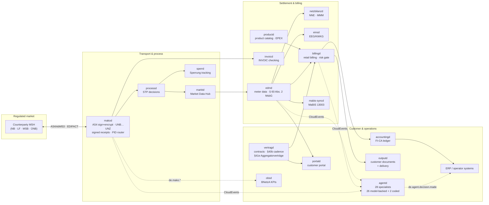

# mako ⚡

[](https://github.com/hupe1980/mako/actions/workflows/ci.yml)
[](./LICENSE-MIT)
[](https://www.rust-lang.org/)
[](https://www.edi-energy.de/)
[](https://github.com/hupe1980/mako/pkgs/container/makod)

> **⚠️ Experimental** — Pre-1.0. APIs may change between releases. Not yet recommended for production without thorough in-house testing.

**mako is the open-source market-operations platform for the German energy market**: every
regulated process — market communication, metering data, settlement, billing — modeled as a
correct, auditable, event-sourced workflow, for every market role (NB, LF, MSB, ESA), from
raw EDIFACT bytes to production microservices. In a sector of closed suites facing the
IS-U sunset, mako is the only end-to-end platform whose source you can read, verify, and
extend — built for the regulatory pace (LFW24, §14a, §41a, §42b/c, the EDIFACT→API
transition) that batch-era systems strain under. The domain layer is deliberately split
from transport and format so that when the market moves — MaBiS-Hub, the EDIFACT→API
target landscape, European harmonization — mako moves with an import run, not a rewrite.

The workspace covers the full BDEW MaKo stack across five layers:

| Layer | What it is |
|---|---|
| **Protocol** | `edi-energy` EDIFACT · `dvgw-edi` DVGW gas · `redispatch-xml` Redispatch 2.0 · `mako-engine` event-sourced process runtime · `makod` daemon |
| **Market data** | `mako-markt` library · `marktd` Market Data Hub (PostgreSQL, CloudEvents, OIDC/JWT, EventBus) |
| **Settlement & billing** | `grid-billing` + `netzbilanzd` NNE/MMM/MSB settlement · `eeg-billing` + `einsd` EEG/KWKG · `energy-billing` + `billingd` retail billing |
| **Customer management** | `accountingd` FI-CA ledger · `portald` customer portal · `outputd` customer documents · `vertragd` contracts · `productd` tariff catalog · `agentd` advisory automation |
| **Agent surface** | 15 of the 17 services expose an MCP server — **163 tools** — and `agentd` is the governed consumer: 28 specialists (26 read-only model-backed plus 2 coded) on [agentplane](https://github.com/hupe1980/agentplane), with journaled effects and durable human triage |
| **Testing** | `makotest` — Python toolkit over the same Rust core: BDEW identifier check digits, the published answer-Frist table, the Entscheidungsbaum Antwortcodes, AHB-validated EDIFACT, counterparties that answer in EDIFACT, seeded EPEX curves, and a `pytest` plugin ([README](makotest/README.md)) |

---

## Architecture at a Glance


```mermaid
flowchart LR
    subgraph Market["Regulated market"]
        MP["Counterparty MSH<br/>(NB · LF · MSB · ÜNB)"]
    end

    subgraph Transport["Transport & process"]
        MAKOD["makod<br/>AS4 sign+encrypt · UNB…UNZ<br/>signed receipts · PID router"]
        PROCESSD["processd<br/>STP decisions"]
        MARKTD["marktd<br/>Market Data Hub"]
        SPERRD["sperrd<br/>Sperrung tracking"]
    end

    subgraph Settlement["Settlement & billing"]
        EDMD["edmd<br/>meter data · § 60 Abs. 2 MsbG"]
        NETZB["netzbilanzd<br/>NNE · MMM"]
        EINSD["einsd<br/>EEG/KWKG"]
        BILLINGD["billingd<br/>retail billing · risk gate"]
        INVOICD["invoicd<br/>INVOIC checking"]
        MABIS["mabis-syncd<br/>MaBiS 13003"]
        PRODUCTD["productd<br/>product catalog · EPEX"]
    end

    subgraph Business["Customer & operations"]
        VERTRAGD["vertragd<br/>contracts · §40b cadence<br/>§41e Aggregatorverträge"]
        ACCOUNTINGD["accountingd<br/>FI-CA ledger"]
        OUTPUTD["outputd<br/>customer documents<br/>+ delivery"]
        PORTALD["portald<br/>customer portal"]
        OBSD["obsd<br/>BNetzA KPIs"]
        AGENTD["agentd<br/>28 specialists<br/>26 model-backed + 2 coded"]
        ERP["ERP / operator systems"]
    end

    MP <-->|"AS4/ebMS3 · EDIFACT"| MAKOD
    MAKOD --> PROCESSD --> MARKTD
    MARKTD --> EDMD --> NETZB & EINSD & BILLINGD & MABIS
    MAKOD --> INVOICD
    PRODUCTD --> BILLINGD
    BILLINGD --> ACCOUNTINGD
    BILLINGD --> OUTPUTD
    VERTRAGD --> BILLINGD
    PROCESSD --> SPERRD
    EDMD & VERTRAGD --> PORTALD
    MAKOD -.->|"de.mako.*"| OBSD
    MAKOD & BILLINGD & EDMD -.->|"CloudEvents"| AGENTD
    AGENTD -.->|"de.agent.decision.made"| ERP
    ACCOUNTINGD --> ERP
```

## Workspace at a Glance

### Protocol & domain crates

Each crate's README carries its PID inventory, its Entscheidungsbäume and its
regulatory sources.

| Crate | Purpose |
|---|---|
| [`edi-energy`](crates/edi-energy/) | Parse · validate · build all 17 EDI@Energy EDIFACT message types |
| [`mako-engine`](crates/mako-engine/) | Event-sourced runtime: `Workflow`, `Process`, `EventStore`, outbox, deadlines |
| [`mako-fristen`](crates/mako-fristen/) | The German market calendar — BDEW Werktage, the MaKo holiday table, the per-PID Antwortfristen |
| [`mako-markt`](crates/mako-markt/) | Master data — `MaloId`, `MeloId`, `MarktpartnerId`, the BO4E gate, repository traits |
| [`mako-gpke`](crates/mako-gpke/) | GPKE Strom — Lieferantenwechsel, Ersatz-/Grundversorgung, Stammdatenänderung, Sperrung, PARTIN |
| [`mako-geli-gas`](crates/mako-geli-gas/) | GeLi Gas 3.0 — Lieferantenwechsel Gas, Stammdatenänderung, AWH Sperrprozesse |
| [`mako-wim`](crates/mako-wim/) | Wechselprozesse im Messwesen, **both Sparten** — MSB-Wechsel, Geräteübernahme, Preisanfrage, INSRPT, ESA Wertebestellung |
| [`mako-mabis`](crates/mako-mabis/) | MaBiS Bilanzkreisabrechnung Strom — Summenzeitreihen, Clearinglisten, the MaBiS-ZP lifecycle |
| [`mako-gabi-gas`](crates/mako-gabi-gas/) | GaBi Gas 2.1 — allocation, nomination, MMMA; typed `GasDay` / `GasQuantity` / `GasBeschaffenheit` |
| [`mako-emob`](crates/mako-emob/) | NZR-EMob / Modell 2 — the virtual Bilanzierungsgebiet, its conservation identity and the three Modellwechsel legs |
| [`mako-redispatch`](crates/mako-redispatch/) | Redispatch 2.0 workflows — §§ 13/13a/14 EnWG under BilAReM |
| [`mako-nbw`](crates/mako-nbw/) | Netzbetreiberwechsel (§ 46 EnWG) — name reservation; not implemented |
| [`mako-as4`](crates/mako-as4/) | BDEW AS4-Profil v1.2 over `asx-rs` — sign, encrypt, signed receipts, per-partner cert registry |
| [`dvgw-edi`](crates/dvgw-edi/) | DVGW transport formats — ALOCAT, NOMINT, NOMRES, SSQNOT |
| [`redispatch-xml`](crates/redispatch-xml/) | Redispatch 2.0 XML/XSD — all 9 document types |
| [`energy-api`](crates/energy-api/) | BDEW API-Webdienste Strom — REST/WebSocket client and Axum server |

### Settlement, billing & calculation crates

| Crate | Purpose |
|---|---|
| [`grid-billing`](crates/grid-billing/) | Role-neutral grid settlement — NNE, MMM, MSB, AWH Gas, reversal and correction, each position carrying its legal-reference trace |
| [`eeg-billing`](crates/eeg-billing/) | EEG/KWKG feed-in settlement — 10 schemes, § 51 Negativpreisregel, § 52 sanctions, § 24 Anlagenerweiterung |
| [`energy-billing`](crates/energy-billing/) | Retail billing (LF) — 13 product categories, § 41a dynamic tariffs, EN 16931 mapping |
| [`invoic-checker`](crates/invoic-checker/) | INVOIC plausibility — six checks over period, arithmetic, totals and tariff match |
| [`mako-pruefung`](crates/mako-pruefung/) | The BDEW Entscheidungsbäume, executable — NB, LF, MSB, ESA and MaBiS answer rules |
| [`mako-invoic`](crates/mako-invoic/) | The INVOIC settle/dispute state machine every billing family registers against |

### Production services (17 daemons)

| Service | Port | Role | Purpose |
|---|---|---|---|
| [`makod`](services/makod/) | `:8080` · `:4080` · `:8090` | All | Protocol daemon — 71 workflows over 469 Prüfidentifikatoren, AS4 · REST · iMS |
| [`marktd`](services/marktd/) | `:8180` | All | Market data hub — MaLo/MeLo, Versorgungsstatus, registries, durable CloudEvents fan-out |
| [`processd`](services/processd/) | `:8580` | NB · LF · MSB | Process decision engine — answers the published Entscheidungsbäume, escalates what it cannot decide |
| [`edmd`](services/edmd/) | `:8380` | All | Energy data management — MSCONS, Zählerstandsgang, quality scoring, Ablesesteuerung, tiered store · 15 MCP tools |
| [`vertragd`](services/vertragd/) | `:9780` | LF · MSB | Contracts and customers — every contract with a Kunde on one side · 17 MCP tools |
| [`productd`](services/productd/) | `:9080` | LF | Product and tariff catalogue — 14 categories, Angebot lifecycle, EPEX and BEHG price series · 13 MCP tools |
| [`netzbilanzd`](services/netzbilanzd/) | `:8680` | NB | Grid settlement runs — NNE, KA, MMM, MSB, AWH; issues the INVOIC · 8 MCP tools |
| [`einsd`](services/einsd/) | `:9180` | NB · LF | Einspeiser registry and EEG/KWKG settlement · 19 MCP tools + 6 prompts |
| [`mabis-syncd`](services/mabis-syncd/) | `:8880` | ÜNB · NB | MaBiS Summenzeitreihen — one filing per Bilanzierungsgebiet, with the clearing windows |
| [`invoicd`](services/invoicd/) | `:8280` | LF | INVOIC plausibility and the REMADV/COMDIS lifecycle · 7 MCP tools |
| [`billingd`](services/billingd/) | `:9280` | LF | Retail billing — §§ 40, 40b EnWG, EN 16931, Abschlagspläne · 11 MCP tools |
| [`accountingd`](services/accountingd/) | `:9380` | LF | Massenkontokorrent — tamper-evident double-entry ledger, SEPA, Mahnwesen |
| [`outputd`](services/outputd/) | `:9880` | — | Customer communications — renders and delivers what other services computed |
| [`portald`](services/portald/) | `:9480` | LF | Customer portal read-model gateway and the § 41 EnWG self-service writes · 8 MCP tools |
| [`sperrd`](services/sperrd/) | `:8780` | NB | Sperr-/Entsperrauftrag execution queue · 4 MCP tools |
| [`obsd`](services/obsd/) | `:8480` | All | Business-process observability — KPIs, Fristen, the § 20 EnWG parity audit |
| [`agentd`](services/agentd/) | `:9580` | All | Advisory agent plane — **28 specialist manifests** over the platform's MCP tools, journaled and human-gated |

## ✨ Features

### EDIFACT layer (`edi-energy`)

| Category | Detail |
|---|---|
| 📦 **17 message types** | UTILMD, MSCONS, APERAK, CONTRL, INVOIC, REMADV, ORDERS, IFTSTA, INSRPT, REQOTE, PARTIN, ORDCHG, ORDRSP, QUOTES, COMDIS, PRICAT, UTILTS |
| 🔍 **Validation from the documents** | Nachrichtenstruktur, Segmentlayouts, formats and code lists of the MIG; the Prüfschablone of the AHB column with its Bedingungen; semantic cross-field rules — all appended to one `ValidationReport`, every finding naming its place by the MIG's `Nr` |
| 🔤 **Declared character repertoire** | `UNB+UNOC:3` is ISO 8859-1, not UTF-8 — parsing transcodes by the repertoire the interchange itself declares, and `InterchangeBuilder` encodes back into it |
| 📅 **Annual release lifecycle** | Multi-version profile registry with 7-day transition grace windows (BDEW-compliant) |
| 🔒 **Security by default** | DoS limits (max 10 MB, 10 000 segments), log-injection sanitisation, fuzz-tested with 1 373+ corpus entries |
| 🛠️ **Fluent message builders** | Type-state builder API with compile-time mandatory field enforcement |
| 🔁 **Round-trip serialisation** | Parse → validate → serialize with byte-exact EDIFACT output |
| 🧪 **Profiles read from the BDEW PDFs** | 32 profiles across 17 types, imported by `cargo xtask import-profiles` from the MIG and AHB documents — every Anwendungsfall's skeleton validates against its own Prüfschablone |

### DVGW gas transport layer (`dvgw-edi`)

| Category | Detail |
|---|---|
| 📦 **4 DVGW message types** | ALOCAT, NOMINT, NOMRES, SSQNOT — identified by `BGM` DE 1001, since every one rides `ORDERS`/`ORDRSP` |
| 🔗 **Published Zuordnung** | `correlation_key()` applies the Zuordnungstupel the Nachrichtenbeschreibungen assign per Prüfidentifikator (`ZO-T1`…`ZG-T1`, SSQNOT's Netzkonto tuple); `process_key()` adds the gas day or Abrechnungszeitraum |
| 🔢 **Real Prüfidentifikatoren** | `SG1 RFF+Z13` carries DVGW's own 70001–70096; `dvgw_edi::catalogue()` ships every published Anwendungsfall with its direction |
| ⚖️ **Energy from the unit** | a `QTY` in `KW1`/`KW2` is a rate integrated over its `DTM+2`; `KWH` is energy — totals stay per direction |
| 🧪 **Independent of edi-energy** | Separate `DvgwPlatform`; `sniff()` tells the two families apart at the ingest boundary |
| 📜 **Regulatory basis** | BNetzA BK7-24-01-008 · Kooperationsvereinbarung Gas · DVGW-Nachrichtenbeschreibungen ALOCAT 5.11a, NOMINT 4.6, NOMRES 4.7, SSQNOT 5.7 |

### Redispatch 2.0 XML layer (`redispatch-xml`)

| Category | Detail |
|---|---|
| 📦 **9 CIM/IEC 62325 document types** | `ActivationDocument`, `PlannedResourceSchedule`, `AcknowledgementDocument`, `Stammdaten`, `Unavailability`, `NetworkConstraintDocument`, `Kaskade`, `StatusRequest`, `Kostenblatt` |
| 🔍 **Two-phase validation** | `parse_and_validate()` — XSD structural check + semantic cross-field rules in one call |
| 🔁 **Round-trip serialization** | Parse → serialize with byte-stable XML output |
| 🔑 **Document correlation** | `Document::mrid()`, `sender_id()`, `receiver_id()` — routing keys for `AcknowledgementDocument` process matching |
| 🔒 **`#![deny(unsafe_code)]`** | Memory-safe XML processing; no `unsafe` in the parse path |
| 📜 **Regulatory basis** | BNetzA BK6-20-059 · BK6-20-060 · BK6-20-061 · NABEG §§ 13, 13a, 14 EnWG |

### Master data layer (`mako-markt`)

| Category | Detail |
|---|---|
| 🆔 **Validated domain IDs** | `MaloId` (11-digit BDEW check-digit), `MeloId` (DE+31-char), `MarktpartnerId` (13-digit; auto-derives NAD DE3055 agency code `293`/`332`/`9` from prefix) |
| 🗂️ **30 repository traits** | One trait per aggregate — `MaloRepository`, `MeloRepository`, `NbContractRepository`, `PartnerRepository`, `LokationszuordnungRepository`, `TechnischeRessourceRepository`, `SteuerbareRessourceRepository`, `CorrelationIndex`, … — AFIT, no `dyn Trait` overhead |
| ⏳ **Temporal role assignments** | `Rollenzuordnung` with `valid_from`/`valid_to` — evaluated against CET/CEST German calendar date at query time |
| 📨 **CloudEvents 1.0** | Outbound events (`MarktEvent`) with HMAC-SHA256 signing; `InboundMakoEvent` for receiving `makod` lifecycle events |
| 🧪 **`testing` feature** | `InMemory*` test doubles for every repository trait — no PostgreSQL required in unit tests |
| 🚫 **Zero framework deps** | No axum, sqlx, or async runtime — pure domain library; all I/O lives in `services/marktd` |

### BO4E typed API (`marktd`)

**88 active `rubo4e::current` types — every payload, in or out, crosses one four-stage gate**, decoded through `rubo4e`'s own depth-capped entry point.

| Category | Detail |
|---|---|
| 📦 **Typed responses** | `GET /api/v1/malos` → `Marktlokation`; `GET /api/v1/melos` → `Messlokation`; `GET /api/v1/zaehler` → `Zaehler`; `GET /api/v1/geraete` → `Geraet` — all canonical BO4E camelCase |
| 🔍 **One gate on write** | `mako_markt::bo4e::decode` at every endpoint: `_typ` → typed deserialization → strict enums by JSON-path → the rules BO4E states in prose and enforces nowhere. Every refusal is a 422 with the same `code` |
| 📤 **Nothing is emitted that would be refused** | The same rules run outbound — over every shape the three billing engines can produce, and at runtime wherever a document is *assembled* (a Sammelrechnung, a Rechnung merged with its Fremdkosten). Money is compared at the scale of the stated total |
| 🏦 **Identifiers and bank details** | A customer's **IBAN** (ISO 7064 MOD-97-10) and **BIC** (ISO 9362) are checked before storage, so a typo is a 422 rather than a returned direct debit; `MaloId`, `MeloId` and `EicCode` carry their check digits |
| 📋 **`Vertrag` for LRV exchange** | `nb_contracts` stores full BO4E `Vertrag` JSONB + typed SQL columns; `PUT /api/v1/nb-contracts` validates `vertragsart` / `vertragsstatus`; emits `de.markt.nb-contract.updated` CloudEvent |
| 👤 **`Geschaeftspartner` typed partners** | `PUT /api/v1/partners/{mp_id}` puts the BO4E `Geschaeftspartner` through the gate and stores the canonical round-trip. `GET` returns the typed `geschaeftspartner` field. |
| 🔢 **`Zaehlwerk` register access** | `GET /api/v1/zaehler/{id}/zaehlwerke` → `Vec<Zaehlwerk>` — OBIS registers for TOU billing and iMSyS demand management |
| ⏰ **`ZaehlzeitRegister` + `ZaehlzeitSaison`** | `GET/PUT /api/v1/zaehler/{id}/register` + `/zaehler-register/{id}/saisons` — iMSys TOU register definitions (HT/NT/EINZEL); `GET /api/v1/zaehler/{id}/tariff-zone?datetime=ISO` resolves zone in one SQL JOIN (§14a Modul 2) |
| ⚡ **`Energiemenge` deliveries** | `GET /api/v1/deliveries/{malo_id}` → `Vec<Energiemenge>` — typed ERP-consumable meter readings without EDIFACT parsing |
| 💰 **MMMA settlement prices** | `GET/PUT /api/v1/mmma-preise/gas/{year}/{month}` — Gas MMM Abrechnungspreise (Trading Hub Europe); `GET/PUT /api/v1/mmm-preise/strom/{year}/{month}` — Strom MMM Ausgleichsenergie per ÜNB. Both auto-fetched by `netzbilanzd` and validated by `invoicd` check 6. |
| 🗂️ **Fallgruppe + Bilanzierungsmethode auto-extract** | `makod` adapters extract `bilanzierungsmethode` (Z01→SLP, Z02→RLM, Z04→IMS) and `fallgruppe` (GaBi Gas, TM+Z10) from UTILMD `TM+EM` / `TM+Z10` segments. `marktd` `event_ingest` calls `patch_typenmerkmal()` on `de.mako.process.initiated` (PIDs 55001/44001) to keep `malo.fallgruppe` / `malo.bilanzierungsmethode` in sync. |
| 🏷️ **`Tarifpreisblatt` + `Preisblatt`** | `productd` stores all energy products as `Tarifpreisblatt` JSONB; category drives calculator selection; all prices are user-defined; schema validated on PUT (wrong `_typ` → 422); queried by `billingd` calculator for pricing inputs |
| 🔒 **One vocabulary per column** | Typed columns are derived from the typed BO, never a string lookup on its JSON, and hold BO4E wire values only. Each enum column's SQL `CHECK` is that enum's `VARIANTS`, compared against the schema by a `mako-markt` test. |
| 🧭 **UTILMD characteristics read by class** | `makod` reads SG10 `CCI`/`CAV` by DE 7059 Klassentyp *and* DE 7037 Merkmal — the two code spaces overlap (`Z18` = Regelzone or „Kein Haushaltskunde") — and maps them to BO4E enums: `CCI+Z30++Z06/Z07` → `Energierichtung`, `CAV+E03…E09` / `Y01…Y03` → `Netzebene`. Each mapping cites its MIG Strom S2.2 / Gas G1.2 segment number. |
| 🏷️ **Namespaced BO4E extensions** | What BO4E does not model rides in a `ZusatzAttribut` named `mako:<snake_case>` — 37, each registered with what it carries. BO4E mandates no convention for its extension slot, so `cargo xtask check-bo4e-attributes` enforces the prefix and keeps the registry consumers read. |
| ✅ **Outbound BO4E conformance** | Every emission site crosses the same gate, because an engine test covers the shapes a builder produces but not the values a request supplies. Out-of-schema **fields** are refused alongside values; documents are built typed, never assembled as JSON |
| 🧾 **`Steuerbetrag` + `Registeranzahl`** | `energy-billing` projects the EN 16931 BG-23 tax breakdown into BO4E `Steuerbetrag` entries on the Rechnung JSON; `Registeranzahl` (Eintarif/Zweitarif) drives HT/NT position branching |
| 🏦 **`Zahlungsinformation` + `Zahlungsart`** | `accountingd` SEPA mandate registry stores structured payment info; pain.008 XML generated from `SepaMandateRow` (IBAN, BIC, Kontoinhaber, Mandatsreferenz) |
### Process engine layer (`mako-engine` + domain crates)

| Category | Detail |
|---|---|
| ♻️ **Event-sourced processes** | Optimistic-concurrency event append with SlateDB-backed storage |
| ⚛️ **Atomic dual-write** | Events and outbox messages written in a single `WriteBatch` via `AtomicAppend` |
| ⏰ **Regulatory deadlines** | `DeadlineStore` over the windows `mako-fristen` publishes per Prüfidentifikator — GPKE clock times on the 1. Werktag (11:00/06:00/05:00), WiM Strom 3/5/7/1 Werktage, GeLi Gas 4/3/2 Werktage. **Never a flat 24 h**, and the GeLi Gas „10 Werktage“ is the *supplier’s* Vorlauffrist, not an answer window |
| 📨 **AS4 inbound transport** | `makod` receives BDEW AS4 pushes via `asx-rs`, deduplicates with `SlateDbInboxStore`, routes by Pruefidentifikator |
| 🔐 **Cedar ABAC authorization** | All HTTP endpoints gated by [Cedar](https://cedarpolicy.com) attribute-based access control; built-in default policy with custom policy overlay via `--cedar-policy-dir` |
| 🪪 **OIDC / JWT + API-key auth** | JWT bearer tokens from Azure AD, Keycloak, Okta, Kubernetes workload identity; RS256/ES256/PS256 families only; JWKS cached with background refresh; coexists with named API keys |
| 📡 **CloudEvents 1.0 ERP webhooks** | Outbound ERP notifications as [CloudEvents 1.0](https://cloudevents.io) structured-mode JSON (`application/cloudevents+json`), HMAC-SHA256 signed; natively routable by SAP BTP, AWS EventBridge, Azure Event Grid, Google Eventarc |
| 🔄 **Format-version coexistence** | Processes started under `FV2025-10-01` run to completion under those rules even after `FV2026-10-01` cutover |
| 🪦 **Dead-letter sink** | Structured `DeadLetterReason` variants — `UnknownPid`, `DuplicateMessage`, `VersionMismatch`, … |

---

## 🚀 Quick Start — run a demo

Two runnable stacks under [`demos/`](demos/), each with a `docker compose` file
and a `smoke.sh` that asserts every step.

| Demo | Services | What it proves |
|---|---|---|
| [`demos/nb-stp`](demos/nb-stp/) | `makod` · `marktd` · `processd` | A UTILMD **55001** Anmeldung arrives over the EDIFACT door, `mako-pruefung` walks `E_0622`, and the **55002** Bestätigung goes back — automatically, inside the Frist |
| [`demos/eeg-billing`](demos/eeg-billing/) | `marktd` · `edmd` · `einsd` | A month of quarter-hour Einspeisemengen settles into a § 21 EEG 2023 Vergütung and a § 14 Abs. 2 UStG Gutschrift |

```bash
just build-demo                 # makod, marktd, processd
cd demos/nb-stp && docker compose up -d && bash smoke.sh
```

The [Getting Started guide](https://hupe1980.github.io/mako/docs/guide/getting-started/)
walks the first one step by step.

---

## 🚀 Quick Start — EDIFACT parsing

```bash
cargo add edi-energy
```

```rust
use edi_energy::{parse, EdiEnergyMessage};

let input = std::fs::read("Netznutzung_20241015.edi")?;
let msg = parse(&input)?;
let report = msg.validate()?;
println!("Valid: {}", report.is_valid());
```

---

## 🚀 Quick Start — Process engine

```bash
cargo add mako-engine --features testing
cargo add mako-gpke
```

```rust
use mako_engine::{
    builder::EngineBuilder,
    ids::TenantId,
    version::WorkflowId,
    event_store::InMemoryEventStore,
};
use mako_gpke::lf_anmeldung::GpkeLfAnmeldungWorkflow;

let ctx = EngineBuilder::new()
    .with_event_store(InMemoryEventStore::new())
    .build();

// Spawn a new process for one delivery point.
let process   = ctx.spawn::<GpkeLfAnmeldungWorkflow>(TenantId::new(), wf_id);
let envelopes = process.execute(initiate_cmd).await?;

// Reconstruct typed state by replaying all persisted events.
let state = process.state().await?;
```

---

## 🚀 Quick Start — DVGW gas transport

```bash
cargo add dvgw-edi
```

```rust
use dvgw_edi::{DvgwMessageType, DvgwPlatform};

// Identity comes from BGM DE 1001 — UNH only names the ORDERS/ORDRSP carrier.
let msg = DvgwPlatform::default().parse(edi_bytes)?;
println!("{} ({})", msg.message_type, msg.document.description());

// The gas day is DTM+Z01; every quantity carries its own DTM+2 period.
if let Some(gas_day) = msg.gas_day() {
    println!("Gastag {gas_day}");
}
// Energy per direction: rates (KW1/KW2) integrated over their period, KWH as is.
for (qualifier, kwh) in msg.energy_by_qualifier() {
    println!("{qualifier}: {kwh} kWh");
}
// The published Zuordnungstupel, ready for a process registry.
println!("{:?}", msg.process_key());

if msg.message_type == DvgwMessageType::Ssqnot {
    let record = dvgw_edi::ssqnot::MehrMindermengenmeldung::from_message(&msg)?;
    println!("Netzkonto {} Saldo {} kWh", record.netzkonto, record.saldo_kwh());
}

let report = DvgwPlatform::validate_message(&msg);
for issue in report.errors() {
    eprintln!("{issue}");
}
```

## 🚀 Quick Start — Redispatch 2.0 XML

```bash
cargo add redispatch-xml
```

```rust
use redispatch_xml::{parse_and_validate, serialize, detect, DocumentType};

// Optionally detect document type before parsing (useful for routing)
let doc_type = detect(xml_bytes);

// Parse + validate in one step (recommended)
let doc = parse_and_validate(xml_bytes)?;

// Primary routing keys — use to correlate AcknowledgementDocument to process
println!("mRID:     {}", doc.mrid());
println!("sender:   {}", doc.sender_id());   // EIC of TSO/RSO
println!("receiver: {}", doc.receiver_id());

// Serialize back to XML (byte-stable round-trip)
let out = serialize(&doc)?;
```

---

## 🚀 Quick Start — Master data (`mako-markt`)

```bash
cargo add mako-markt --features testing
```

```rust
use mako_markt::domain::{MaloId, MeloId, MarktpartnerId};

// Validated identifiers — construction returns Err on malformed input
let malo_id = MaloId::new("51238696012")?;
let melo_id = MeloId::new("DE0001234567890123456789012345678")?;
let mp_id   = "9900357000004".parse::<MarktpartnerId>()?;

// NAD DE3055 agency code derived from MP-ID prefix automatically:
// "99…" → "293" (BDEW Strom), "98…" → "332" (DVGW Gas), other → "9" (GS1)
assert_eq!(mako_markt::domain::nad_agency_code(&mp_id), "293");

// In tests — use InMemory* doubles; no PostgreSQL required
use mako_markt::testing::InMemoryMaloRepository;
let repo = InMemoryMaloRepository::default();
```

---

## 📋 Format and Document Coverage

### BDEW EDI@Energy (`edi-energy`) — 17 EDIFACT message types

| Message | EDIFACT type | Latest release | Use case |
|---|---|---|---|
| UTILMD Strom | `UTILMD` | S2.2 (`fv20261001`) | Grid connection (supplier switch, registration) |
| UTILMD Gas | `UTILMD` | G1.2 (`fv20261001_gas`) | Gas grid connection processes |
| MSCONS | `MSCONS` | 2.5 (`fv20261001`) | Metered services consumption reports |
| APERAK | `APERAK` | 2.2 (`fv20261001`) | Application error acknowledgements |
| CONTRL | `CONTRL` | 2.0b (`fv20260101`) | Interchange control acknowledgements |
| INVOIC | `INVOIC` | 2.8e (`fv20261001`) | Invoices |
| REMADV | `REMADV` | 2.9f (`fv20261001`) | Remittance advice |
| ORDERS | `ORDERS` | 1.4c (`fv20261001`) | Purchase orders |
| IFTSTA | `IFTSTA` | 2.1 (`fv20261001`) | Multimodal status reports |
| INSRPT | `INSRPT` | 1.1a (`fv20260101`) | Inspection reports |
| REQOTE | `REQOTE` | 1.3c (`fv20261001`) | Requests for quotation |
| PARTIN | `PARTIN` | 1.1 (`fv20261001`) | Party information |
| ORDCHG | `ORDCHG` | 1.2 (`fv20261001`) | Purchase order changes |
| ORDRSP | `ORDRSP` | 1.4c (`fv20261001`) | Purchase order responses |
| QUOTES | `QUOTES` | 1.3c (`fv20261001`) | Quotations |
| COMDIS | `COMDIS` | 1.0h (`fv20260401`) | Commercial dispute (Handelsunstimmigkeit) |
| PRICAT | `PRICAT` | 2.1 (`fv20261001`) | Price/sales catalogue |
| UTILTS | `UTILTS` | 1.1e (`fv20261001`) | Technical master data |

### DVGW gas transport (`dvgw-edi`) — 4 message types

| Message | Version | Carrier · `BGM` DE 1001 | Direction | Use case |
|---|---|---|---|---|
| ALOCAT | 5.11a | `ORDRSP` · `X1G`–`XBG` | NB → MGV, MGV → BKV, ENB/ANB → NB, MGV → NB, NB → BKV | Allokation, Mengenmeldung NKP, Clearing |
| NOMINT | 4.6 FK | `ORDERS` · `01G 55G Y1G Y6G Y7G` | Transportkunde → NB/MGV | Nominierung, Re-Nominierung (`RFF+AGO` + `DTM+9`) |
| NOMRES | 4.7 FK | `ORDRSP` · `07G 08G 19G 20G Y2G` | NB/MGV → Transportkunde | Matching-Benachrichtigung, Bestätigung |
| SSQNOT | 5.7 FK | `ORDRSP` · `BAG` | NB → MGV | Mehr-/Mindermengenmeldung zur Führung des Netzkontos |

The other DVGW transport formats (SCHEDL, IMBNOT, TRANOT, DELORD/DELRES, CHACAP,
NUEVOR, SLPASP, TSIMSG) are not parsed, and a workflow for a format nothing
parses would be unreachable.

### Redispatch 2.0 XML (`redispatch-xml`) — 9 document types

**BK6-23-241 (07.05.2026) is the basis, and it repealed its predecessors.**
BK6-20-060 and BK6-20-061 are gone (Tenorziffern 4 and 3), BK6-20-059
Tenorziffer 1 with the end of 30.06.2026 — and what replaces them is not a new
table of Fristen but an obligation on the ÜNB to develop bundesweit einheitliche
Prozessbeschreibungen (Tenorziffer 7). So a deadline here is either **sourced**
from a document that still states it, or the **operator's own**, with the
historical figure offered as a labelled default (`fristen::Betreiberfristen`).

| Document type | Deadline | Where it comes from |
|---|---|---|
| `AcknowledgementDocument` | 3 min from receipt of the Übertragungsdatei | **sourced** — `AcknowledgementDocument` FB 1.0g. Never six hours |
| `ActivationDocument` | 5 min | operator's own; historically BK6-20-060 (repealed) |
| `Stammdaten` (VNB → ÜNB) | 1 Werktag | operator's own; historically BK6-20-060 (repealed) |
| `Kostenblatt` | 15th of the following month | operator's own; historically BK6-20-061 (repealed) |
| `PlannedResourceScheduleDocument` | Vorab-Information 30 min before validity (Prognosemodell) | **sourced** — BilAReM Kap. 6.3.1 |
| `Unavailability_MarketDocument` | — | — |
| `NetworkConstraintDocument` | — | — |
| `Kaskade` | — | — |
| `StatusRequest_MarketDocument` | none | it is a Marktpartner availability notification, not a request/response pair — there is no answer document and no 24-hour window |

---

## 📖 Documentation

Full documentation lives at **[hupe1980.github.io/mako](https://hupe1980.github.io/mako/)** —
a searchable site (source under [`site/`](./site), built with [Zola](https://www.getzola.org/)).

| Section | What's inside |
|---|---|
| [Guide](https://hupe1980.github.io/mako/docs/guide/) | Install, parse your first interchange, run a workflow |
| [Architecture](https://hupe1980.github.io/mako/docs/architecture/) | Event-sourced engine, domain model, deadlines, ERP/API integration |
| [Reference](https://hupe1980.github.io/mako/docs/reference/) | Parsing, validation, builders, the platform API, the full process catalog, AS4, DVGW, Redispatch |
| [Services](https://hupe1980.github.io/mako/docs/services/) | Operator guides for all 17 daemons — ports, config, APIs, deployment |
| [Regulatory](https://hupe1980.github.io/mako/docs/regulatory/) | BNetzA determinations and the authoritative Prüfidentifikator catalog |
| [Release & Compliance](https://hupe1980.github.io/mako/docs/compliance/) | Annual EDI@Energy release lifecycle, schema versioning, license governance |
| [API Reference (docs.rs)](https://docs.rs/edi-energy) | Full rustdoc for the published crates |

---

## 💡 Usage Examples

### Parse a single message

```rust
use edi_energy::{parse, AnyMessage, EdiEnergyMessage};

let msg = parse(bytes)?;

match &msg {
    AnyMessage::Utilmd(m) => {
        println!("PID: {}", m.detect_pruefidentifikator()?.as_u32());
        if let Some(bgm) = m.bgm() {
            println!("Doc code: {}", bgm.document_code);
        }
    }
    AnyMessage::Mscons(m) => {
        println!("Consumption report, {} segments", m.raw_segments().len());
    }
    AnyMessage::Unknown { message_type_code, .. } => {
        println!("Unrecognised type: {message_type_code}");
    }
    _ => {}
}
```

### Validate and inspect issues

```rust
use edi_energy::{parse, EdiEnergyMessage};

let msg = parse(bytes)?;
let report = msg.validate()?;

if !report.is_valid() {
    for issue in report.errors() {
        println!(
            "[{}] {} — {}",
            issue.rule_id.as_deref().unwrap_or("-"),
            issue.segment_tag.as_deref().unwrap_or("-"),
            issue.message,
        );
    }
}
report.into_error_result()?;
```

### Parse a multi-message interchange

```rust
use std::io::Cursor;
use edi_energy::{parse_interchange, EdiEnergyMessage};

let reader = Cursor::new(bytes);
for msg_result in parse_interchange(reader) {
    let msg = msg_result?;
    if let Some(mt) = msg.try_message_type() {
        println!("{} — PID {:?}", mt.as_str(), msg.detect_pruefidentifikator().ok());
    }
}
```

### Build a UTILMD message

```rust
use edi_energy::{
    builders::UtilmdBuilder,
    EdiEnergyMessage, ObjectType, Pruefidentifikator,
    releases,
};

let bytes = UtilmdBuilder::new(releases::utilmd_fv20261001().clone())
    .pruefidentifikator(Pruefidentifikator::new(55001)?)
    .sender("4012345000023")
    .receiver("9900357000004")
    .document_code("E01")
    .document_date("20261001")
    .transaction(ObjectType::Marktlokation, "51238696799")
        .process_date("163", "20261001")
        .reference("Z13", "55001")
        .done()
    .build()?
    .serialize()?;
```

---

## 🏗️ Architecture

```
mako/
├── crates/
│   ├── edi-energy/          # EDIFACT parse · validate · build · serialize
│   │   ├── src/             # EdiEnergyMessage, Platform, builders, registry
│   │   └── profiles/        # BDEW JSON profile data (MIG + AHB + codelists)
│   │
│   ├── mako-engine/         # Event-sourced process runtime
│   │   └── src/             # Workflow, Process, EngineBuilder, all store traits
│   │                        # + SlateDB implementations, fristen, dead-letter
│   │
│   ├── mako-gpke/           # GPKE domain (55001–55018, 55555 Anfrage, 17115–17117 Sperrung, INVOIC 31001–31002/31005–31006, ORDERS 17134/17135; PARTIN Strom 37000–37006)
│   ├── mako-wim/            # WiM domain, Strom + Gas (55039/55042/55051/55168 + 44039/44042/44051/44168/44183, INVOIC 31009/31003/31004, INSRPT 23001–23012)
│   ├── mako-geli-gas/       # GeLi Gas 3.0 domain (44001–44024 incl. Stornierung; PARTIN Gas 37008–37014; INVOIC 31011)
│   ├── mako-mabis/          # MABIS domain (13003 — Bilanzkreisabrechnung Strom)
│   ├── mako-emob/           # NZR-EMob / Modell 2 — virtual Bilanzierungsgebiet, allocation engine
│   │                        # (Anlage 6 §IV.1 conservation identity, ¼-h session split, BG lifecycle)
│   ├── mako-gabi-gas/       # GaBi Gas 2.1 — INVOIC 31007/31008/31010 + MSCONS 13013 + DVGW ALOCAT/NOMINT/NOMRES; typed domain: GasDay/GasQuantity/GasBeschaffenheit/AllocationVersion/GasMarketRole/GasPortfolioBalance
│   ├── mako-nbw/            # Netzbetreiberwechsel — PARTIN DSO handover (placeholder)
│   ├── mako-as4/            # BDEW AS4-Profil v1.2: BdewAs4Profile, bdew_pmode (ECDSA+ECDH-ES, BrainpoolP256r1)
│   │                        # bdew_push_policy (require_encrypted_inbound), BdewTestPki, MockAs4Endpoint
│   ├── dvgw-edi/            # DVGW EDIFACT formats — ALOCAT, NOMINT, NOMRES (GaBi Gas 2.1)
│   ├── energy-api/          # BDEW REST/WebSocket API client + Axum server (iMS)
│   ├── mako-redispatch/     # Redispatch 2.0 process engine — 8 XML-document-driven workflows
│   ├── redispatch-xml/      # Redispatch 2.0 XML/XSD parsing — all 9 document types
│   ├── invoic-checker/      # INVOIC plausibility-check pipeline (LF side)
│   ├── mako-pruefung/       # Antwortnachricht decisions (NB + LF + MSB Entscheidungsbäume)
│   ├── mako-fristen/        # The German market calendar — Werktage, Fristen, and what "today" means
│   ├── energy-billing/      # LF consumption billing engine (§§40–41a EnWG)
│   ├── grid-billing/        # NB grid-fee billing — NNE/KA/MMM, §14a, Entgeltregime
│   ├── eeg-billing/         # EEG feed-in remuneration + Marktprämie
│   ├── mako-events/         # CloudEvents type catalog + matches()
│   ├── mako-markt/          # Market master-data domain (BO4E via rubo4e)
│   ├── mako-obs/            # Observability projections
│   └── mako-service/        # Service SDK — load_config · DatabaseConfig · shutdown · OidcConfig · McpAuth · init_tracing_from_env · ServiceBuilder · CedarEnforcer · EventBus
│
├── services/                # 17 daemons, one PostgreSQL schema each
│   ├── makod/               # :8080 · protocol daemon — AS4 ingest, workflow dispatch, EDIFACT render
│   ├── marktd/              # :8180 · master-data hub — BO4E store, MP-ID registry, event fan-out
│   ├── invoicd/             # :8280 · INVOIC plausibility check (LF)
│   ├── edmd/                # :8380 · energy data management — profiles, gap-fill, `?as_of` reads
│   ├── obsd/                # :8480 · observability — projections, KPIs, Fristen tracking
│   ├── processd/            # :8580 · process decision engine — STP checks, auto-responses
│   ├── netzbilanzd/         # :8680 · NB billing — NNE/KA/MMM/MSB INVOIC, REMADV, Redispatch Kostenblatt
│   ├── sperrd/              # :8780 · Sperrung execution tracking
│   ├── mabis-syncd/         # :8880 · MaBiS Summenzeitreihen submission (BIKO)
│   ├── productd/             # :9080 · tariffs & products — §41a dynamic pricing, Preisblätter
│   ├── einsd/               # :9180 · EEG remuneration — Marktprämie, Förderende alerts
│   ├── billingd/            # :9280 · LF customer billing — invoices, Abschläge, XRechnung/ZUGFeRD payloads
│   ├── accountingd/         # :9380 · sub-ledger (doubleentry) — Mahnwesen, §§41f/41g Sperr-Sequenz
│   ├── portald/             # :9480 · customer portal API
│   ├── agentd/              # :9580 · AI agent plane — 28 specialists over MCP, human oversight
│   ├── vertragd/            # :9780 · contract lifecycle — Lieferverträge, GGV, Aggregatoren
│   └── outputd/             # :9880 · document engine — Typst templates, ZUGFeRD carrier, publish gates, issued-document store + delivery
│
├── makotest/                # Python test toolkit (PyO3) — simulators, generators, pytest plugin
├── xtask/                   # Dev automation: import-profiles · validate · guards
└── fuzz/                    # cargo-fuzz targets (1 373+ corpus entries)
```

### Data flow

```
BDEW counterparty (AS4 push)
       │
       ▼
makod/as4_ingest  ──  asx-rs receive + WSS verify + dedup
       │
       ▼  raw EDIFACT bytes
Platform::parse_interchange  ──  edi-energy parse + validate
       │
       ▼  detected PID
PidRouter::route  ──  selects domain handler (GPKE / WiM / GeLi Gas / MABIS)
       │
       ▼  typed Command
Process::execute_and_enqueue  ──  replay state · Workflow::handle · AtomicAppend
       │
       ├─ EventStore (SlateDB)
       ├─ OutboxStore  ──►  OutboxErpWorker  ──►  makod ERP webhook (CloudEvents 1.0)
       ├─ OutboxStore  ──►  OutboxWorker     ──►  AS4 send → BDEW counterparty
       └─ DeadlineStore ──►  scheduler  ──►  TimeoutExpired → de.mako.aperak.timeout

                                          makod ERP webhook
                                                │ POST /api/v1/mako/events
                                                ▼
                                          marktd :8180 (Market Data Hub)
                                          MaLo / MeLo / contracts
                                          VersorgungsStatus · malo_grid
                                          PostgreSQL · OIDC/JWT
                                                │ fan-out (CloudEvents 1.0 + HMAC)
                               ┌────────────────┼──────────────┬──────────────┐
                               ▼                ▼              ▼              ▼
                         processd :8580   invoicd :8280   edmd :8380   obsd :8480
                         mako-pruefung    invoic-checker  meter reads  projections
                         NB STP + LF E0624 § 147 AO / GoBD    billing-period §20 parity
                               │                │
                               └────────────────┴──► makod :8080 (bestaetigen / ablehnen)
                               │
                               ▼
                         ERP system (SAP, Schleupen, Wilken, …)
```

---

## ⚙️ Feature Flags — `edi-energy`

By default UTILMD, MSCONS, APERAK, and CONTRL are compiled in:

```bash
cargo add edi-energy --features invoic,remadv,orders
```

| Flag | Default | Enables |
|---|---|---|
| `utilmd` | ✅ | UTILMD Strom + Gas |
| `mscons` | ✅ | MSCONS metered consumption |
| `aperak` | ✅ | APERAK error acknowledgement |
| `contrl` | ✅ | CONTRL syntax acknowledgement |
| `invoic` | | INVOIC invoice |
| `remadv` | | REMADV remittance advice |
| `orders` | | ORDERS purchase order |
| `iftsta` | | IFTSTA multimodal status |
| `insrpt` | | INSRPT inspection report |
| `reqote` | | REQOTE request for quotation |
| `partin` | | PARTIN party information |
| `ordchg` | | ORDCHG order change |
| `ordrsp` | | ORDRSP order response |
| `quotes` | | QUOTES quotation |
| `comdis` | | COMDIS commercial dispute |
| `pricat` | | PRICAT price catalogue |
| `utilts` | | UTILTS technical master data |
| `serde` | | `Serialize` on `EdiEnergyReport` |
| `diagnostics` | | `miette::Diagnostic` on reports |
| `tracing` | | Structured tracing spans |

## ⚙️ Feature Flags — `dvgw-edi`

```bash
cargo add dvgw-edi --features serde
```

| Flag | Default | Enables |
|---|---|---|
| `serde` | | `Serialize`/`Deserialize` on all public types |
| `tracing` | | Structured tracing spans during parse dispatch |

## ⚙️ Feature Flags — `mako-markt`

| Flag | Default | Enables |
|---|---|---|
| *(default)* | ✅ | All domain types, all repository traits, CloudEvents, `InboundMakoEvent` |
| `marktd-client` | | HTTP client for marktd's REST surface |
| `makod-client` | | HTTP client for makod's command API |
| `testing` | | `InMemory*` test doubles for every repository trait — **never enable in production** |

## ⚙️ Feature Flags — `mako-engine` / `makod`

| Flag | Crate | Enables |
|---|---|---|
| `slatedb` | `mako-engine` | Production `SlateDbStore`; activated in `makod` via its dep on `mako-engine = { features = ["slatedb"] }` — never enable in library `[features]` defaults |
| `testing` | `mako-engine` | `InMemoryEventStore`, `NoopDeadLetterSink`, `InMemoryInboxStore` — never in production |
| `tracing` | `mako-engine` | Structured instrumentation spans |

---

## 🔧 Development

The `justfile` is the front door — every gate below has a recipe:

```bash
just            # list all recipes
just check      # cargo check, all targets & features
just test       # full test suite
just ci         # the complete CI gate (check + test + clippy incl. role-scoped builds + fmt + deny + profile/PID validation)
just test-db           # every real-PostgreSQL integration suite (testcontainers)
just test-accountingd-db  # …or one at a time: edmd, einsd, accountingd, billingd, outputd, vertragd, productd, marktd, processd, sperrd
```

The `test-*-db` suites self-manage PostgreSQL via **testcontainers** — a throwaway
`postgres:17-alpine` container is started in-process and reaped afterwards, so the only
requirement is a running Docker daemon (no manual `docker run`, no `DATABASE_URL`). They
are `#[ignore]`d by default and skip gracefully when Docker is absent.

Raw cargo equivalents:

```bash
# Check all targets — minimum gate before any commit
cargo check --all-targets --all-features

# Run all tests
cargo test --all-features

# Run tests for one crate
cargo test -p mako-engine --all-features

# Build the production daemon (slatedb is already enabled via mako-engine dep in Cargo.toml)
cargo build -p makod --release

# Lint (warnings are errors)
cargo clippy --all-targets --all-features -- -D warnings

# Format
cargo fmt --all

# Dependency audit (license + security)
cargo deny check

# The committed profiles are consistent: sources.json, dates, PIDs, AHB rows
cargo xtask validate-profiles

# Refuse banker's rounding: money and quantity figures round kaufmaennisch
# (DIN 1333, half away from zero). The modes differ only on exact midpoints,
# so the wrong one misstates a cent without failing an ordinary test.
cargo xtask check-rounding

# How much of the published Pruefidentifikator inventory the profiles carry, and
# whether the PID reference names all of it. validate-profiles compares
# consecutive releases, so it can prove nothing was lost and is blind to a PID
# that was never imported; this is the other direction. The inventory is
# extracted into crates/edi-energy/profiles/pid-overview.json, so this needs no
# source document.
cargo xtask check-pid-coverage

# Hold every Antwortcode against the published Entscheidungsbaum PDF —
# tree, code and Cluster (Zustimmung vs Ablehnung)
cargo xtask validate-ebd-codes

# Check that today's date is covered by a current profile
cargo xtask check-release-coverage

# Regenerate every profile from its BDEW MIG/AHB PDF (needs the mirror below)
cargo xtask import-profiles
cargo xtask import-profiles --check      # a committed profile drifted from its PDF

# Per Prüfidentifikator, what changed between two Formatversionen — the
# release PR's summary. Reads the committed profiles, no PDFs needed.
cargo xtask profile-diff utilmd fv20261001 fv20271001

# Mirror the BDEW document set every profile is read from
cargo xtask sync-regulatories            # report the diff against bdew-mako.de
cargo xtask sync-regulatories --download # fetch what is in force and missing
cargo xtask sync-regulatories --offline  # verify the mirror, no network

# Run fuzz target (requires nightly + cargo-fuzz)
cargo +nightly fuzz run fuzz_parse_validate
```

---

## 📊 Performance — `edi-energy`

Benchmarks on Apple M-series (single core, Criterion):

| Operation | Throughput |
|---|---|
| Parse minimal UTILMD | ~2 µs / message |
| Validate UTILMD S2.1 (MIG + AHB) | ~8 µs / message |
| Parse 100-message interchange | ~180 µs total |
| Build UTILMD + serialize | ~5 µs / message |

```bash
cargo bench --bench benchmarks
```

---

## 🤝 Contributing

Contributions are welcome. Open an issue before large changes.

- Run `cargo check --all-targets --all-features` and `cargo test --all-features` before submitting a PR.
- The profiles under `crates/edi-energy/profiles/` are generated from the BDEW PDFs — fix the reader in `xtask/src/bdew/` and run `cargo xtask import-profiles` instead of editing JSON.
- See the [Release Lifecycle guide](https://hupe1980.github.io/mako/docs/compliance/release-lifecycle/) for the annual BDEW profile update procedure.
- See the [Process Engine guide](https://hupe1980.github.io/mako/docs/architecture/engine/) for the engine architecture and conventions.

---

## 📜 License

Licensed under either of:

- [MIT License](./LICENSE-MIT)
- [Apache License, Version 2.0](./LICENSE-APACHE)

at your option.

---

## 🔗 Resources

- [edi-energy.de](https://www.edi-energy.de/) — Official BDEW specification portal
- [BDEW MaKo](https://www.bdew.de/energie/marktkommunikation/) — Market communication framework
- [edifact-rs](https://crates.io/crates/edifact-rs) — Underlying EDIFACT parser
- [asx-rs](https://crates.io/crates/asx-rs) — AS4/ebMS3 transport library used by `makod`
- [metering](https://crates.io/crates/metering) — German energy metering domain library (intervals, SLP/RLM classification, Gas m³→kWh_Hs); pure computation, no storage
- [meterstore](https://crates.io/crates/meterstore) — Metering time-series store (PostgreSQL hot window + Iceberg/S3 settled history) beneath `edmd`
- [doubleentry](https://crates.io/crates/doubleentry) — General-purpose tamper-evident double-entry ledger used by `accountingd`
- [rubo4e](https://crates.io/crates/rubo4e) — BO4E business-object types
- [billing](https://crates.io/crates/billing) — Generic EN 16931 tariff/invoicing engine under the settlement crates
- [SlateDB](https://slatedb.io/) — Embedded LSM storage backing `mako-engine`
