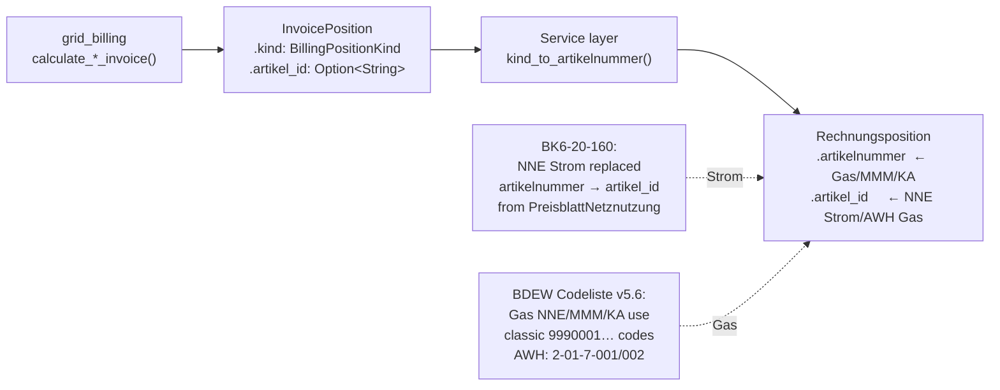

# grid-billing

> Deterministic, regulation-aware German grid settlement engine —
> NNE, KA, MMM, MSB, and GeLi Gas AWH Sperrprozesse (PIDs 31001, 31002, 31005, 31006, 31009, 31011).

[](https://crates.io/crates/grid-billing)

## What this crate does

`grid-billing` computes BDEW INVOIC billing positions with full explainability:

- **NNE Strom** (PID 31001) — flat-rate Arbeit, Leistung (RLM), Konzessionsabgabe
- **NNE Gas** (PID 31005) — GasNEV §14 legal basis, auto-set when `Sparte::Gas`
- **§14a Modul 2 ToU** — mandatory HT/NT Arbeit split for controllable loads (BNetzA BK6-22-300)
- **Selbst ausgestellte NNE** (PID 31006) — LF runs the identical formula (§20 MessZV)
- **MMM Strom** (PID 31002) — Mehr-/Mindermengensaldo, StromNZV §15
- **MMM Gas** (PID 31002 via GasNZV §14) — Gas imbalance with GeLi Gas legal basis
- **MSB-Rechnung** (PID 31009) — Grundgebühr Messstellenbetrieb + optional Messdienstleistung
- **GeLi Gas AWH Sperrprozesse** (PID 31011) — abrechnungswürdige Handlungen (BK7-24-01-009 §5.4)
- **Reversal (Stornorechnung)** — `calculate_reversal()` negates any prior settlement immutably

All calculations are **pure functions** — zero I/O, zero async, no side effects.
All monetary arithmetic uses `rust_decimal::Decimal` via `billing::EuroAmount` — no `f64` anywhere.

## Architecture

### Settlement flow

```
NneInput / MmmInput / MsbInput / GasAwhInput
        │
        ▼
validate_*_input()          ← optional pre-check: ValidationResult
        │
        ▼
calculate_*_invoice()       ← pure, deterministic, no I/O
        │
        ▼
GridSettlement {
  pid, settlement_type, status,
  rechnungsnummer, correction_of,
  nb_mp_id, counterparty_mp_id,  ← auto-populated from input
  positions: Vec<InvoicePosition {
    text, kind, artikel_id,       ← BDEW Artikelnummer bridge
    quantity, unit, unit_price_eur, net_eur,
    trace: CalculationTrace {           ← "why is this amount here?"
      explanation,
      legal_refs: Vec<LegalReference>,  ← StromNEV §17, KAV §2, §14a Modul 2…
      tariff_source: Option<TariffSource>,
      gross_eur, regulatory_reduction_factor, …
    }
  }>,
  total_eur,
  warnings: Vec<SettlementWarning>,
}
        │
        ▼   (service-layer concern — grid-billing has no rubo4e dep)
kind_to_artikelnummer(pos.kind, settlement_type)  → BdewArtikelnummer
        │
        ▼
into_rechnung(&settlement)  → rubo4e::current::Rechnung {
                                rechnungspositionen[].artikelnummer  ← Gas/MMM/KA classic codes
                                rechnungspositionen[].artikel_id     ← NNE Strom / AWH Gas
                              }
        │
        ▼
InvoicCheckEngine::check(pid, &nb_mp_id, &rechnung, …)
        │
        ▼
invoice_drafts (PostgreSQL) → AS4 dispatch
```

### BDEW Artikelnummern architecture

The service layer owns the BDEW Artikelnummer mapping. `grid-billing` stays free
of `rubo4e`:



### Responsibility split

`grid-billing` has **zero dependency on `rubo4e`**. BO4E conversion lives exclusively in the
service layer, keeping this crate publishable to crates.io without pulling in internal workspace crates.

| Responsibility | Where |
|---|---|
| Settlement math + legal refs | `grid-billing` |
| BO4E `Rechnung` conversion | `netzbilanzd::into_rechnung()` / `invoicd::into_rechnung()` |
| INVOIC plausibility checks 1–6 | `invoic-checker` |
| EDIFACT serialization + AS4 dispatch | `makod` |

## Domain types

### `GridSettlement` — canonical output

```rust
pub struct GridSettlement {
    pub pid: u32,                        // BDEW Prüfidentifikator
    pub settlement_type: SettlementType, // NneStrom | NneGas | MmmStrom | MsbRechnung | …
    pub status: SettlementStatus,        // Initial | Correction | Reversal | Final
    pub rechnungsnummer: String,
    pub correction_of: Option<String>,   // set when status = Reversal or Correction
    pub invoice_date: time::Date,
    pub due_date: time::Date,
    pub period_from: time::Date,
    pub period_to: time::Date,
    pub nb_mp_id: String,                // invoice sender (NB or MSB for PID 31009)
    pub counterparty_mp_id: String,      // invoice recipient — auto-populated from input
    pub positions: Vec<InvoicePosition>,
    pub total_eur: Decimal,              // rounded to 2 dp
    pub warnings: Vec<SettlementWarning>,
}

// Backward-compatible alias — existing code using GridInvoice continues to compile:
pub type GridInvoice = GridSettlement;
```

Helper methods on `GridSettlement`:

| Method | Returns | Description |
|---|---|---|
| `is_clean()` | `bool` | `true` when no `Warning`/`Error` severity items in `warnings` |
| `recomputed_total()` | `Decimal` | Re-sums positions — should equal `total_eur` (regression guard) |
| `all_legal_refs()` | `Vec<String>` | Deduplicated citation strings across all positions |
| `positions_count()` | `usize` | Number of billing positions |

### `InvoicePosition` with `CalculationTrace`

Every position carries a full audit record so any amount can be explained without
re-running the calculation. The `kind` field drives the BDEW Artikelnummer mapping
in the service layer, and `artikel_id` carries the new-format article code where applicable
(e.g. AWH Gas: `"2-01-7-001"`, NNE Strom: populated from `PreisblattNetznutzung`):

```rust
pub struct InvoicePosition {
    pub number: u32,
    pub text: String,                        // e.g. "Netznutzung Arbeit HT (§14a Modul 2)"
    pub kind: BillingPositionKind,           // semantic type → maps to BdewArtikelnummer
    pub artikel_id: Option<String>,          // BDEW Artikel-ID (2-01-7-001 etc.) or None
    pub quantity: Decimal,                   // rounded to 3 dp
    pub unit: QuantityUnit,                  // Kwh | Kw | Kvarh | Kvar | Monat
    pub unit_price_eur: Decimal,             // rounded to 6 dp
    pub net_eur: Decimal,                    // quantity × unit_price_eur, rounded to 5 dp
    pub trace: CalculationTrace,
}

pub struct CalculationTrace {
    /// Human-readable explanation, e.g.:
    ///   "1500.000 kWh × 0.035000 EUR/kWh = 52.50000 EUR"
    pub explanation: String,
    pub input_quantity: Decimal,
    pub input_unit_price_eur: Decimal,
    pub gross_eur: Decimal,                       // qty × price before rounding
    pub legal_refs: Vec<LegalReference>,          // at least one, always
    pub tariff_source: Option<TariffSource>,      // where the rate came from
    pub regulatory_reduction_factor: Option<Decimal>, // §14a Modul 1 factor (0–1)
    pub rounding_note: Option<&'static str>,
}
```

### `LegalReference`

```rust
pub enum LegalReference {
    StromNev { paragraph: &'static str },       // "§21" Arbeit, "§17" Leistung
    GasNev   { paragraph: &'static str },       // "§14"
    Kav      { paragraph: &'static str },       // "§2 Abs. 2"
    Sect14aEnwg { module: Sect14aModule },      // Modul1 | Modul2 | Modul3
    BnetzaDecision { reference: &'static str }, // "BK6-22-300"
    BdewAhb  { reference: &'static str },       // "GPKE BK6-22-024"
    MessZv   { paragraph: &'static str },       // "§2"
    MsbG     { paragraph: &'static str },       // "§§6–7"
    StromNzv { paragraph: &'static str },       // "§15" MMM
    GasNzv   { paragraph: &'static str },       // "§14" Gas MMM
    Enwg     { paragraph: &'static str },       // "§14a"
    ARegV    { paragraph: &'static str },       // "§17" incentive regulation
}
```

`.citation()` returns a short German-language string (e.g. `"StromNEV §17"`,
`"§14a EnWG Modul 2 (HT/NT variable)"`, `"ARegV §17"`).

### `Sect14aModule`

```rust
pub enum Sect14aModule {
    Modul1, // §14a pauschale Reduzierung — flat % reduction (BK6-22-300 Anlage 2, default 85%)
    Modul2, // §14a HT/NT time-variable — Zaehlzeitdefinition from UTILTS
    Modul3, // §14a Spotpreis-Netzentgelt — spot-price linked (iMSys required)
}
```

`Sect14aModule::Modul1.label()` = `"§14a EnWG Modul 1 (pauschale Reduzierung)"`;
`.bnentza_reference()` = `"BK6-22-300"` for all three modules.

### `TariffSource`

```rust
pub enum TariffSource {
    PublishedTariffSheet { sheet_id: String },
    HistoricalTariff     { valid_from: time::Date },
    RegulatoryTariff     { decision_ref: &'static str },
    ContractTariff       { contract_ref: String },
    ManualOverride       { reason: String },
}
```

### `Sparte` — commodity dispatch

```rust
#[derive(Default)]
pub enum Sparte {
    #[default]
    Strom,  // → StromNEV §21, SettlementType::NneStrom, PID 31001
    Gas,    // → GasNEV §14,   SettlementType::NneGas,   PID 31005
}
```

`Sparte` is required on `NneInput` and `MmmInput`. The calculation automatically
selects the correct legal references, `SettlementType`, and default PID — no
manual `r.pid = 31005` override needed for standard Gas paths.

### `SettlementType`

```rust
pub enum SettlementType {
    NneStrom,          // PID 31001 — NNE Strom (NB → LF)
    NneGas,            // PID 31005 — NNE Gas  (GNB → LFG)
    NneSelbstausstellt,// PID 31006 — NNE selbst ausgestellt (LF)
    MmmStrom,          // PID 31002 — MMM Strom, StromNZV §15
    MmmGas,            // PID 31002 — MMM Gas,   GasNZV §14 (separate to ensure correct legal refs)
    MsbRechnung,       // PID 31009 — MSB-Rechnung (NB → MSB)
    GasAwhSperrung,    // PID 31011 — AWH Sperrprozesse Gas (GNB → LFG)
    RedispatchKostenblatt, // no standard PID — Redispatch 2.0
}
```

`SettlementType::default_pid()` returns the standard PID for the type.
`MmmGas` and `MmmStrom` share PID 31002 but carry different legal references.

### `BillingPositionKind` — BDEW Artikelnummern bridge

`BillingPositionKind` is the rubo4e-free type carried by every `InvoicePosition.kind`.
The service layer maps it to `rubo4e::current::BdewArtikelnummer` in `into_rechnung()`.

```rust
pub enum BillingPositionKind {
    NneArbeit,           // Wirkarbeit       (9990001 00026 9)
    NneArbeitHt,         // Wirkarbeit       (9990001 00026 9)
    NneArbeitNt,         // Wirkarbeit       (9990001 00026 9)
    NneArbeitModul1,     // Wirkarbeit       (9990001 00026 9) — reduced rate
    NneLeistung,         // Leistung         (9990001 00005 3)
    NneGasGrundpreis,    // Grundpreis       (9990001 00008 7)
    Konzessionsabgabe,   // Konzessionsabgabe(9990001 00041 7)
    Mehrmenge,           // Mehrmenge        (9990001 00074 8)
    Mindermenge,         // Mindermenge      (9990001 00075 6)
    MsbGrundgebuehr,     // EntgeltEinbauBetriebWartungMesstechnik (9990001 00061 5)
    Messdienstleistung,  // EntgeltMessungAblesung (9990001 00062 3)
    GasAwhSperrung,      // artikel_id: "2-01-7-001" (BK7-24-01-009 §5.4)
    GasAwhEntsprrung,    // artikel_id: "2-01-7-002"
    GasAwhSonstige,      // artikel_id from AwhPositionInput.artikel_id
    Blindmehrarbeit,     // Blindmehrarbeit  (9990001 00047 5)
}
```

> **NNE Strom (PIDs 31001/31006):** BK6-20-160 replaced classic `artikelnummer` codes
> with `artikel_id` from the BNetzA Netznutzungspreisblatt. The service layer
> (`netzbilanzd`, `invoicd`) populates `Rechnungsposition.artikel_id` from the tariff
> sheet for those positions; `kind_to_artikelnummer()` returns `None` for Strom NNE.
> Gas NNE, MMM, Konzessionsabgabe still use classic `articlenummer` codes.

Source: BDEW Codeliste Artikelnummern und Artikel-ID v5.6 (valid 01.09.2025).

### `KaKlasse` — KAV rate tier

```rust
pub enum KaKlasse {
    TarifkundeLow,    // ≤25 MWh/a residential — highest rate (KAV §2 Abs. 2)
    TarifkundeMedium, // ≤150 MWh/a commercial
    SonderkundeHigh,  // >150 MWh/a industrial
    Exempt,           // §2 Abs. 7 KAV exemptions
}
```

When `ka_klasse` is set, the KA position text and trace include the tier so
auditors can verify the rate matches the correct KAV §2 band without looking up
the underlying master data.

## Who uses this library

| Consumer | Role | Use case |
|---|---|---|
| `netzbilanzd` | **NB** | Generate INVOIC 31001/31002/31005/31009/31011 to LF/MSB/LFG |
| `invoicd` | **LF** | §20 MessZV selbstausstellen PID 31006 — same formula, LF-initiated |

## Quick start

```toml
[dependencies]
grid-billing = { version = "0.10" }
rust_decimal = "1"
time         = "0.3"
```

### NNE flat-rate (SLP, Strom)

```rust,no_run
use grid_billing::{NneInput, Sparte, calculate_nne_invoice};
use rust_decimal::Decimal;
use time::macros::date;

fn d(s: &str) -> Decimal { Decimal::from_str_exact(s).unwrap() }

let settlement = calculate_nne_invoice(&NneInput {
    malo_id: "51238696780".into(),
    nb_mp_id: "9900357000004".into(),
    lf_mp_id: "9900012345678".into(),
    rechnungsnummer: "NNE-2026-01-0001".into(),
    period_from: date!(2026-01-01),
    period_to:   date!(2026-01-31),
    invoice_date: date!(2026-02-15),
    due_date:    date!(2026-03-17),
    arbeitsmenge_kwh: d("1500"),
    arbeitspreis_ct_per_kwh: d("3.5"),
    arbeitsmenge_ht_kwh: None,
    arbeitspreis_ht_ct_per_kwh: None,
    arbeitsmenge_nt_kwh: None,
    arbeitspreis_nt_ct_per_kwh: None,
    spitzenleistung_kw: None,
    leistungspreis_eur_per_kw: None,
    ka_satz_ct_per_kwh: Some(d("0.11")),
    tariff_sheet_id: Some("Preisblatt-NNE-2026-Q1".into()),
    sparte: Sparte::Strom,
    ka_klasse: None,
    sect14a_modul1_reduction_factor: None,  // §14a Modul 1 not active for this MaLo
    nne_grundpreis_eur_per_month: None,     // no Gas Grundpreis (Strom)
    nne_grundpreis_months: None,
}).expect("valid NNE input");

// settlement.total_eur = 52.50 + 1.65 = 54.15 EUR
assert_eq!(settlement.pid, 31001);
// counterparty_mp_id is auto-populated from lf_mp_id:
assert_eq!(settlement.counterparty_mp_id, "9900012345678");

// Every position is self-explanatory:
for pos in &settlement.positions {
    println!("{}: {}", pos.text, pos.trace.explanation);
    for lr in &pos.trace.legal_refs {
        println!("  → {}", lr.citation());
    }
}
```

### NNE Gas (GasNEV §14)

```rust,no_run
use grid_billing::{NneInput, Sparte, calculate_nne_invoice};

// Only Sparte changes — GasNEV §14 legal refs and PID 31005 are automatic:
let settlement = calculate_nne_invoice(&NneInput {
    sparte: Sparte::Gas,  // ← drives GasNEV §14 + PID 31005
    arbeitsmenge_kwh: d("3000"),  // already kWh_Hs from edmd gas conversion
    arbeitspreis_ct_per_kwh: d("1.80"),
    ka_satz_ct_per_kwh: None,  // KA typically not applicable for Gas
    sect14a_modul1_reduction_factor: None,
    nne_grundpreis_eur_per_month: None,
    nne_grundpreis_months: None,
    // … other identity fields …
}).unwrap();

assert_eq!(settlement.pid, 31005);
```

### §14a Modul 2 ToU (HT/NT split, mandatory since 2024-01-01)

```rust,no_run
use grid_billing::{NneInput, KaKlasse, Sparte, calculate_nne_invoice};

let settlement = calculate_nne_invoice(&NneInput {
    arbeitsmenge_kwh: d("1000"),          // total — ignored when HT/NT supplied
    arbeitspreis_ct_per_kwh: d("3.5"),    // fallback — ignored when HT/NT supplied
    arbeitsmenge_ht_kwh: Some(d("600")),
    arbeitspreis_ht_ct_per_kwh: Some(d("4.20")),
    arbeitsmenge_nt_kwh: Some(d("400")),
    arbeitspreis_nt_ct_per_kwh: Some(d("1.50")),
    ka_satz_ct_per_kwh: Some(d("1.32")),
    ka_klasse: Some(KaKlasse::TarifkundeLow),  // ← auditable tier annotation
    sparte: Sparte::Strom,
    tariff_sheet_id: Some("Preisblatt-14a-2026".into()),
    sect14a_modul1_reduction_factor: None,  // Modul 1 and Modul 2 are mutually exclusive
    nne_grundpreis_eur_per_month: None,
    nne_grundpreis_months: None,
    // … identity fields …
}).unwrap();

// HT: 600×4.20ct=25.20; NT: 400×1.50ct=6.00; KA: 1000×1.32ct=13.20 → total 44.40 EUR
assert_eq!(settlement.positions.len(), 3);  // HT + NT + KA
assert!(settlement.all_legal_refs().iter().any(|r| r.contains("§14a EnWG Modul 2")));
```

### §14a Modul 1 (flat percentage reduction, mandatory offer since 2024-01-01)

```rust,no_run
use grid_billing::{NneInput, Sparte, calculate_nne_invoice};
use rust_decimal_macros::dec;

// BK6-22-300 Anlage 2: default reduction factor = 0.85 (customer pays 85% of full rate).
// The NB may publish a different approved value in their PreisblattNetznutzung.
let settlement = calculate_nne_invoice(&NneInput {
    arbeitsmenge_kwh: d("1500"),
    arbeitspreis_ct_per_kwh: d("3.5"),
    sect14a_modul1_reduction_factor: Some(dec!(0.85)),  // ← 15% reduction
    sparte: Sparte::Strom,
    // All HT/NT fields must be None — Modul 1 and Modul 2 are mutually exclusive
    arbeitsmenge_ht_kwh: None, arbeitspreis_ht_ct_per_kwh: None,
    arbeitsmenge_nt_kwh: None, arbeitspreis_nt_ct_per_kwh: None,
    // … other fields …
}).unwrap();

// 1500 × 0.035 × 0.85 = 44.625 → 44.62 EUR (MidpointNearestEven)
assert!(settlement.all_legal_refs().iter().any(|r| r.contains("Modul 1")));
assert!(settlement.positions[0].trace.regulatory_reduction_factor == Some(dec!(0.85)));
```

### Gas NNE with Grundpreis (GasNEV monthly standing charge)

```rust,no_run
let settlement = calculate_nne_invoice(&NneInput {
    sparte: Sparte::Gas,
    arbeitsmenge_kwh: d("3000"),
    arbeitspreis_ct_per_kwh: d("1.80"),
    nne_grundpreis_eur_per_month: Some(d("15.00")),  // monthly base fee from PreisblattNetznutzung
    nne_grundpreis_months: Some(1),
    sect14a_modul1_reduction_factor: None,
    // … other fields …
}).unwrap();

// Positions: Grundpreis (15.00) + Arbeit (54.00) = 69.00 EUR
assert_eq!(settlement.positions.len(), 2);
assert!(settlement.positions[0].text.contains("Grundpreis"));
```

### GeLi Gas AWH Sperrprozesse (PID 31011)

```rust,no_run
use grid_billing::{GasAwhInput, AwhPositionInput, calculate_gas_awh_invoice};

let settlement = calculate_gas_awh_invoice(&GasAwhInput {
    malo_id: "51238696780".into(),
    nb_mp_id: "9900357000004".into(),
    lf_mp_id: "9900012345678".into(),
    rechnungsnummer: "AWH-2026-01-0001".into(),
    period_from: date!(2026-01-01),
    period_to:   date!(2026-01-31),
    invoice_date: date!(2026-02-15),
    due_date:    date!(2026-03-17),
    tariff_sheet_id: Some("Preisblatt-AWH-2026".into()),
    awh_positionen: vec![
        AwhPositionInput {
            beschreibung: "Sperrung Gaszähler".into(),
            anzahl: 1,
            preis_eur: d("45.00"),
            artikel_id: Some("2-01-7-001".to_owned()),  // BDEW Codeliste v5.6 §3.2
        },
        AwhPositionInput {
            beschreibung: "Entsperrung Gaszähler".into(),
            anzahl: 1,
            preis_eur: d("45.00"),
            artikel_id: Some("2-01-7-002".to_owned()),
        },
    ],
}).unwrap();

assert_eq!(settlement.pid, 31011);
assert_eq!(settlement.total_eur, d("90.00"));
// Both positions cite BK7-24-01-009 §5.4
assert!(settlement.all_legal_refs().iter().any(|r| r.contains("BK7-24-01-009")));
```

### Correction lifecycle (reversal + replacement pair)

```rust,no_run
use grid_billing::{calculate_nne_invoice, calculate_correction, SettlementStatus};

let original = calculate_nne_invoice(&nne_input).unwrap();
let corrected = calculate_nne_invoice(&corrected_input).unwrap();

let (reversal, replacement) = calculate_correction(
    &original,
    corrected,
    "STORNO-NNE-2026-01-0001".to_owned(),
    date!(2026-03-01),
    date!(2026-03-31),
);

assert_eq!(reversal.status, SettlementStatus::Reversal);
assert_eq!(reversal.total_eur, -original.total_eur);
assert_eq!(replacement.status, SettlementStatus::Correction);
assert_eq!(replacement.correction_of.as_deref(), Some("NNE-2026-01-0001"));
```

```rust,no_run
use grid_billing::{calculate_nne_invoice, calculate_reversal};
use time::macros::date;

let original = calculate_nne_invoice(&/* … NneInput … */).unwrap();

let storno = calculate_reversal(
    &original,
    "STORNO-NNE-2026-01-0001".to_owned(),
    date!(2026-03-01),
    date!(2026-03-31),
);

assert_eq!(storno.total_eur, -original.total_eur);
assert_eq!(storno.correction_of.as_deref(), Some("NNE-2026-01-0001"));
```

### Pre-calculation validation

```rust,no_run
use grid_billing::{NneInput, Sparte, validate_nne_input, WarningSeverity};

let input = NneInput { /* … */ };
let v = validate_nne_input(&input);

if !v.is_valid {
    for w in &v.warnings {
        eprintln!("[{}] {}", w.code, w.message);
    }
    return;
}
let settlement = calculate_nne_invoice(&input).unwrap();
```

### Service-layer conversion to BO4E `Rechnung`

```rust,no_run
// In netzbilanzd/src/billing.rs — grid-billing itself has no rubo4e dep:
use grid_billing::{GridSettlement, QuantityUnit};
use rubo4e::current::{Betrag, Menge, Mengeneinheit, Preis, Rechnungsposition, Rechnung, Zeitraum};

fn into_rechnung(s: &GridSettlement) -> Rechnung {
    let lz = Zeitraum {
        startdatum: Some(s.period_from),
        enddatum: Some(s.period_to),
        ..Default::default()
    };
    let positions = s.positions.iter().map(|p| {
        let einheit = match p.unit {
            QuantityUnit::Kwh   => Some(Mengeneinheit::Kwh),
            QuantityUnit::Kw    => Some(Mengeneinheit::Kw),
            QuantityUnit::Kvarh => Some(Mengeneinheit::Kwh),   // map kVARh → kWh bucket
            QuantityUnit::Kvar  => Some(Mengeneinheit::Kw),    // map kVAR  → kW  bucket
            QuantityUnit::Monat => Some(Mengeneinheit::Monat),
        };
        Rechnungsposition {
            positionsnummer:    Some(p.number as i64),
            positionstext:      Some(p.text.clone()),
            // BDEW Artikelnummer from BillingPositionKind (Gas/MMM/KA positions)
            artikelnummer:      kind_to_artikelnummer(p.kind, s.settlement_type),
            // BDEW Artikel-ID (NNE Strom from tariff sheet; AWH Gas 2-01-7-xxx)
            artikel_id:         p.artikel_id.clone(),
            lieferungszeitraum: Some(lz.clone()),
            positions_menge: Some(Menge { wert: Some(p.quantity), einheit, ..Default::default() }),
            einzelpreis:  Some(Preis  { wert: Some(p.unit_price_eur.round_dp(6)), ..Default::default() }),
            gesamtpreis:  Some(Betrag { wert: Some(p.net_eur.round_dp(5)), ..Default::default() }),
            ..Default::default()
        }
    }).collect();
    Rechnung {
        rechnungsnummer:   Some(s.rechnungsnummer.clone()),
        rechnungsdatum:    Some(s.invoice_date),
        faelligkeitsdatum: Some(s.due_date),
        rechnungsperiode:  Some(lz),
        gesamtnetto: Some(Betrag { wert: Some(s.total_eur), ..Default::default() }),
        rechnungspositionen: Some(positions),
        ..Default::default()
    }
}
```

## Generated invoice types

| PID | Description | Direction | Sparte |
|---|---|---|---|
| 31001 | NNE Strom | NB → LF | Strom |
| 31002 | MMM Strom | NB → LF | Strom |
| 31002 | MMM Gas | GNB → LFG | Gas |
| 31005 | NNE Gas | GNB → LFG | Gas (auto via `Sparte::Gas`) |
| 31006 | Selbst ausgestellte NNE | LF | Strom |
| 31009 | MSB-Rechnung | NB → MSB | both |
| 31011 | AWH Sperrprozesse Gas | GNB → LFG | Gas |

## Billing position reference

### NNE

| # | Position text | Unit | `kind` | Condition | Legal basis | Artikelnummer |
|---|---|---|---|---|---|---|
| 1 | `Netznutzung Arbeit` | kWh | `NneArbeit` | flat / SLP | StromNEV §21 (Strom) · GasNEV §14 (Gas) | `Wirkarbeit` (Gas); `artikel_id` (Strom) |
| 1 | `Netznutzung Arbeit §14a Modul 1 (85% Reduzierung)` | kWh | `NneArbeitModul1` | `sect14a_modul1_reduction_factor` set | §14a EnWG Modul 1 · BK6-22-300 | same as NneArbeit |
| 1+2 | `Netznutzung Arbeit HT (§14a Modul 2)` + NT | kWh | `NneArbeitHt` / `NneArbeitNt` | HT + NT both set | §14a EnWG Modul 2 · BK6-22-300 | same as NneArbeit |
| opt | `Netzentgelt Grundpreis Gas` | Monat | `NneGasGrundpreis` | `nne_grundpreis_eur_per_month` set | GasNEV §14 | `Grundpreis` |
| next | `Netznutzung Leistung` | kW | `NneLeistung` | `spitzenleistung_kw` set (RLM) | StromNEV §17 | `Leistung` (Gas); `artikel_id` (Strom) |
| last | `Konzessionsabgabe[tier]` | kWh | `Konzessionsabgabe` | `ka_satz_ct_per_kwh` set | KAV §2 Abs. 2 | `Konzessionsabgabe` |

### MMM

| # | Position text | `kind` | Artikelnummer | Condition |
|---|---|---|---|---|
| 1 | `Mehrmengen` | `Mehrmenge` | `Mehrmenge` | `actual > profil` |
| 2 | `Mindermengen (Gutschrift)` | `Mindermenge` | `Mindermenge` | `profil > actual` |

### MSB

| # | Position text | `kind` | Artikelnummer | Condition |
|---|---|---|---|---|
| 1 | `Grundgebühr Messstellenbetrieb` | `MsbGrundgebuehr` | `EntgeltEinbauBetriebWartungMesstechnik` | Always |
| 2 | `Messdienstleistung` | `Messdienstleistung` | `EntgeltMessungAblesung` | `messdienstleistung_eur` set |

### AWH Gas Sperrprozesse (PID 31011)

| # | Position text | `artikel_id` | Condition |
|---|---|---|---|
| any | `Sperrung Gaszähler` | `2-01-7-001` | Unterbrechung reguläre AZ |
| any | `Entsperrung Gaszähler` | `2-01-7-002` | Wiederherstellung reguläre AZ |
| any | `Erfolglose Unterbrechung` | `2-01-7-003` | Sperrung failed |
| any | `Stornierung Sperrauftrag (Vortag)` | `2-01-7-004` | Cancelled day before |
| any | `Stornierung Sperrauftrag (Sperrtag)` | `2-01-7-005` | Cancelled same day |
| any | `Entsperrung außerhalb AZ` | `2-01-7-006` | Out of hours |

Source: BDEW Codeliste Artikelnummern und Artikel-ID v5.6, Section 3.2 (valid 01.09.2025).

## Design invariants

| Invariant | Detail |
|---|---|
| **No floating-point money** | `rust_decimal::Decimal` throughout; `billing::EuroAmount` for overflow guard. No `f64`. |
| **No rubo4e dependency** | Returns `GridSettlement`; service layer owns `into_rechnung()`. |
| **`counterparty_mp_id` auto-populated** | `lf_mp_id` (NNE/MMM) or `msb_mp_id` (PID 31009) copied automatically. |
| **`Sparte` drives settlement type** | `Sparte::Gas` → `SettlementType::NneGas`, `GasNEV §14`, PID 31005. No manual override needed. |
| **Every position cites regulation** | `trace.legal_refs` is non-empty for every position. Enables BNetzA audit without re-calculation. |
| **Artikelnummer on every position** | `InvoicePosition.kind` → `BdewArtikelnummer` via `kind_to_artikelnummer()` in service layer. Never empty. |
| **`MmmGas` ≠ `MmmStrom`** | Separate `SettlementType` variants ensure correct legal refs (`GasNZV §14` vs `StromNZV §15`) per position. |
| **Immutable correction chain** | `calculate_reversal()` mirrors positions, sets `status = Reversal`, links via `correction_of`. Original never mutated. |
| **`calculate_correction()` pair** | Returns `(reversal, replacement)` — both get status set atomically; caller dispatches both. |
| **Pure functions** | All `calculate_*` functions are sync with no side effects. |
| **`recomputed_total` guard** | `debug_assert_eq!(result.total_eur, result.recomputed_total())` inside every `calculate_*` — catches rounding bugs in debug builds. |
|---|---|
| **No floating-point money** | `rust_decimal::Decimal` throughout; `billing::EuroAmount` for overflow guard. No `f64`. |
| **No rubo4e dependency** | Returns `GridSettlement`; service layer owns `into_rechnung()`. |
| **`counterparty_mp_id` auto-populated** | `lf_mp_id` (NNE/MMM) or `msb_mp_id` (PID 31009) copied automatically — service layer always has the recipient. |
| **`Sparte` drives settlement type** | `Sparte::Gas` → `SettlementType::NneGas`, `GasNEV §14`, PID 31005. No manual override needed. |
| **Every position cites regulation** | `trace.legal_refs` is non-empty for every position. Enables BNetzA audit without re-calculation. |
| **Immutable correction chain** | `calculate_reversal()` mirrors positions, sets `status = Reversal`, links via `correction_of`. Original never mutated. |
| **Pure functions** | All `calculate_*` functions are sync with no side effects. |
| **Decimal-only input** | All rates via `Decimal::from_str_exact`. Never `Decimal::try_from(f64)`. |

## See also

- [`invoic-checker`](../invoic-checker/README.md) — validates the generated `Rechnung` in the service layer
- [`netzbilanzd`](../../services/netzbilanzd/README.md) — NB billing service that calls `grid-billing`
- [`invoicd`](../../services/invoicd/README.md) — LF service using `grid-billing` for selbstausstellen
- [Operator guide → netzbilanzd](../../docs/netzbilanzd.md)

`grid-billing` computes BDEW INVOIC billing positions for:

- **NNE** (Netznutzungsentgelt) — flat-rate or §14a Modul 2 ToU (HT/NT split)
- **KA** (Konzessionsabgabe) — §17 StromNZV, included as separate position
- **MMM** (Mehr-/Mindermengensaldo) — actual vs. SLP profile deviation, credit when Mindermengen dominate
- **MSB-Rechnung** — metering service fee (NB → MSB, PID 31009)

All calculations are **pure functions** — zero I/O, zero async, no side effects.
All monetary arithmetic uses `EuroAmount` = `i64 × 10⁻⁵ EUR` — no `f64` anywhere in the billing path.
