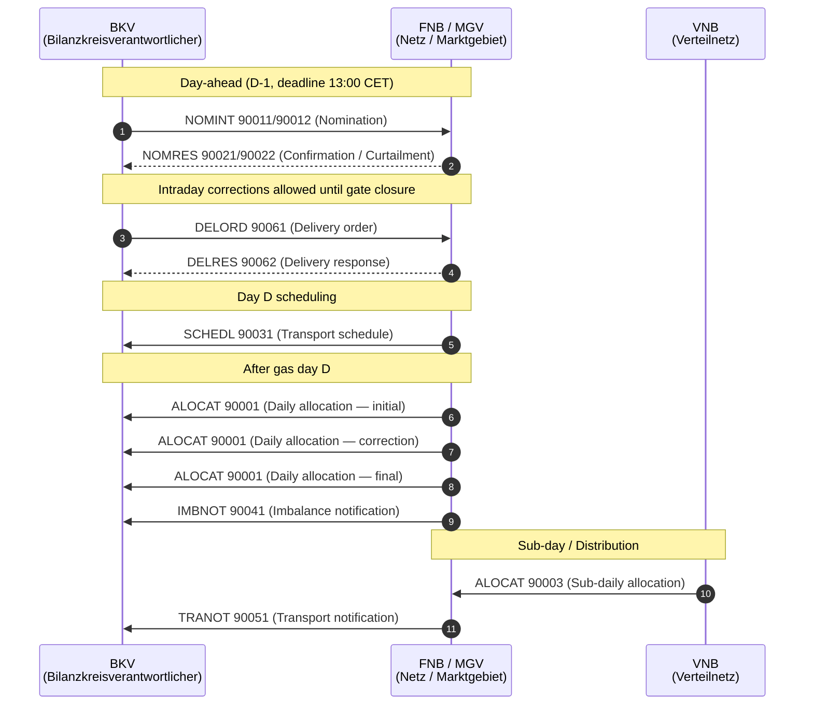

# mako-gabi-gas

**GaBi Gas — Gasbilanzierung Gas (Gas Balancing)**

Process engine workflows for the German gas balancing framework under
GaBi Gas 2.1 (BNetzA BK7-24-01-008). Governs allocation, nomination, and
billing between balance responsible parties (BKV), network operators
(FNB/VNB), and market area managers (MGV).

## Process flow



## Implemented processes

| Workflow | PIDs / Message types | Governing document | Status |
|---|---|---|---|
| `gabi-gas-invoic` | INVOIC 31010 (Kapazitätsrechnung, NB/VNB → BKV) + 31007/31008 (Aggreg. MMM-Rechnung, NB → MGV) | BK7-24-01-008 | ✅ |
| `gabi-gas-allocation` | ALOCAT (synthetic PIDs 90001–90003) | BK7-24-01-008 / DVGW ALOCAT 5.11a | ✅ |
| `gabi-gas-nomination` | NOMINT (90011/90012) + NOMRES (90021/90022) | BK7-24-01-008 / DVGW NOMINT 4.6 FK / NOMRES 4.7 FK | ✅ |
| `gabi-gas-mmma` | MSCONS 13013 + ORDERS 17110 + ORDRSP 19110 (Allokationsliste Gas, MMMA) | BK7-24-01-008 | ✅ |
| `gabi-gas-schedl` | SCHEDL (synthetic PIDs) | DVGW SCHEDL G685/G2000 | ✅ |
| `gabi-gas-imbnot` | IMBNOT (synthetic PIDs) | DVGW IMBNOT 5.7a | ✅ |
| `gabi-gas-tranot` | TRANOT (synthetic PIDs) | DVGW TRANOT 5.8b | ✅ |
| `gabi-gas-delivery-order` | DELORD + DELRES (synthetic PIDs) | DVGW DELORD 4.5 FK / DELRES 4.6 FK | ✅ |

## Domain model (`domain.rs` + `portfolio.rs`)

The `mako-gabi-gas` crate provides a rich domain vocabulary for the German gas
market. All energy quantities use `rust_decimal::Decimal` — never `f32`/`f64`
(**no float money** rule, DVGW G 685 requires ≥ 3 decimal places).

### `GasDay` — typed gas market day

The German gas day starts and ends at **06:00 CET** (DVGW G 2000 §3.2):
- Winter (CET, UTC+1): 06:00 local = 05:00 UTC
- Summer (CEST, UTC+2): 06:00 local = 04:00 UTC
- **Spring forward** (last Sunday March): 23-hour gas day
- **Fall back** (last Sunday October): 25-hour gas day

```rust
let day = GasDay::new(date!(2026-01-15));
println!("Start UTC:           {}", day.start_utc());             // 05:00 UTC (winter)
println!("Duration:            {} hours", day.duration_hours());  // 24
println!("NOMINT deadline:     {}", day.nomination_deadline_utc()); // D-1 13:00 CET → 12:00 UTC
println!("NOMRES deadline:     {}", day.nomres_deadline_utc());     // D-1 15:00 CET → 14:00 UTC
println!("Initial ALOCAT due:  {}", day.initial_alocat_deadline_utc()); // D+3 12:00 CET (KoV §6.4)
println!("Final ALOCAT due:    {}", day.final_alocat_deadline_utc());   // M+2 last day 12:00 CET
```

#### KoV deadline summary

| Deadline | Time | Method |
|---|---|---|
| NOMINT submission | D-1 13:00 CET | `nomination_deadline_utc()` |
| NOMRES response window | D-1 15:00 CET | `nomres_deadline_utc()` |
| Initial ALOCAT | D+3 12:00 CET | `initial_alocat_deadline_utc()` |
| Final ALOCAT | M+2 last day | `final_alocat_deadline_utc()` |

### `GasBeschaffenheit` + `GasQuantity` — DVGW G 685 conversion

```rust
// Energy conversion: kWh_Hs = m³ × Hs × Z  (DVGW G 685)
let beschaffenheit = GasBeschaffenheit {
    brennwert_hs_kwh_per_m3: dec!(10.55),
    zustandszahl: dec!(0.9764),
    quality_class: GasQualityClass::HGas,
    valid_from: date!(2026-01-01),
    ..
};

// Validate against DVGW G 260 physical limits before use
beschaffenheit.validate()?;   // Err if Hs, Hu, or Zustandszahl outside valid range

let quantity = GasQuantity::from_m3(dec!(100), beschaffenheit);
assert_eq!(quantity.energy_kwh_hs, dec!(1030.102)); // rounded to 3 dp
```

#### DVGW G 260 validation ranges

| Parameter | H-Gas valid range | L-Gas valid range |
|---|---|---|
| Hs (kWh/m³) | 9.5 – 13.1 | 7.5 – 10.3 |
| Hu (kWh/m³) | 8.5 – 11.8 | 6.8 – 9.3 |
| Zustandszahl | 0.80 – 1.20 | 0.80 – 1.20 |
| Hu < Hs | always | always |

`validate()` returns `Err(GasBeschaffenheitValidationError)` listing all violated constraints.

### `GasQualityFlag` — measurement quality per § 60 Abs. 2 MsbG / GaBi Gas 2.1 (BK7-24-01-008)

```rust
// Every gas measurement interval carries a quality flag
match flag {
    GasQualityFlag::Measured     => /* direct MSCONS Gas reading */,
    GasQualityFlag::Estimated    => /* SLP Gas profile (G0, H0, G1–G6) */,
    GasQualityFlag::Substituted  => /* § 60 Abs. 2 MsbG replacement value */,
    GasQualityFlag::Calculated   => /* DVGW G 685 m³ → kWh_Hs conversion result */,
    GasQualityFlag::Corrected    => /* revised value, prior version preserved */,
    GasQualityFlag::Rejected     => /* failed validation — triggers Ersatzwertbildung */,
    GasQualityFlag::Unknown      => /* quality not yet determined */,
}

// Billing gate per GaBi Gas 2.1 (BK7-24-01-008)
if flag.is_billable() { /* includes Measured, Substituted, Calculated, Corrected */ }
```

### `AllocationVersion` — KoV §6.4 correction tracking

ALOCAT messages can be sent as initial, corrected, or final allocations per
KoV §6.4. The `AllocationVersion` enum tracks which sequence this is:

```rust
pub enum AllocationVersion {
    Initial,           // First ALOCAT for this gas day
    Correction(u32),   // nth correction (1-based)
    Final,             // Binding for imbalance settlement
}
```

### `GasMarketRole` — typed market role classification

```rust
assert!(GasMarketRole::Bkv.submits_nominations());      // BKV submits NOMINT
assert!(GasMarketRole::Fnb.receives_allocations());     // FNB receives ALOCAT (sub-day)
assert!(GasMarketRole::Bkv.has_imbalance_obligation()); // BKV settles via IMBNOT
assert!(!GasMarketRole::Lf.receives_allocations());     // LF does not receive ALOCAT directly
```

### `GasPortfolioBalance` + `PortfolioPosition` — conservation check

BKV portfolio aggregation across all Bilanzkreise for a gas day:

```rust
let balance = GasPortfolioBalance { bkv_eic: "...", gas_day, positions, .. };
println!("Net: {} kWh", balance.net_imbalance_kwh());    // nominated − allocated
println!("Direction: {:?}", balance.portfolio_direction()); // Mehr / Minder / Balanced
println!("Open positions: {}", balance.open_imbalance_count());

// Verify energy conservation: SUM(BKV allocations) = VNB measured total
// per DVGW G 685
match balance.conservation_check(vnb_total_kwh, dec!(1.0) /* tolerance */) {
    Ok(total) => println!("Conservation OK: {} kWh", total),
    Err(ConservationViolation::EnergyImbalance { deviation_kwh, .. }) =>
        println!("Imbalance: {} kWh exceeds tolerance", deviation_kwh),
    Err(ConservationViolation::IncompleteAllocations { missing_bilanzkreise }) =>
        println!("Missing allocations for: {:?}", missing_bilanzkreise),
}
```

### `GasImbalanceSaldo` — settlement with Ausgleichsenergie price

```rust
let mut saldo = GasImbalanceSaldo::calculate(gas_day, "EIC_BKV", "EIC_BK",
                                              nominated, allocated);
// Mehr-Energie: BKV over-nominated, owes MGV
// Minder-Energie: BKV under-nominated, MGV owes BKV

// Set Ausgleichsenergie price from IMBNOT / MGV publication (KoV §9)
saldo.ausgleichsenergie_price_ct_per_kwh = Some(dec!(5.0)); // 5 ct/kWh

// Settlement amount = imbalance × price
if let Some(amount) = saldo.settlement_amount_ct() {
    println!("Settlement: {} ct", amount);
}
```

### Nomination correction chain

Re-nominations cite the prior NOMINT via `corrects_nomination_ref`:

```rust
// Initial day-ahead nomination (D-1, correction_sequence = 0)
let initial = NominationData {
    nomination_ref: MessageRef::new("NOMINT-2026-001"),
    corrects_nomination_ref: None,
    correction_sequence: 0,
    ..
};

// Intraday re-nomination correcting the initial (correction_sequence = 1)
let correction = NominationData {
    nomination_ref: MessageRef::new("NOMINT-2026-002"),
    corrects_nomination_ref: Some(MessageRef::new("NOMINT-2026-001")),
    correction_sequence: 1,
    ..
};
```

### CloudEvent constants (`de.gabi.*`)

All GaBi Gas domain events use typed constants from the `cloud_events` module:

```rust
use mako_gabi_gas::gabi_cloud_events;

// Use in agentd.toml trigger_event_types or makod CloudEvent dispatch
assert_eq!(gabi_cloud_events::NOMINATION_CREATED, "de.gabi.nomination.created");
assert_eq!(gabi_cloud_events::ALLOCATION_COMPLETED, "de.gabi.allocation.completed");
assert_eq!(gabi_cloud_events::IMBALANCE_CALCULATED, "de.gabi.imbalance.calculated");
assert_eq!(gabi_cloud_events::INVOIC_MMM_RECEIVED, "de.gabi.invoic.mmm.received");
// … 12 typed constants total — use glob "de.gabi.*" to trigger gabi-gas-agent
```

### DVGW format version management

The `dvgw_versions` module tracks biannual DVGW release versions with validity dates:

```rust
use mako_gabi_gas::dvgw_versions;

println!("ALOCAT:  {} (valid from {})", dvgw_versions::ALOCAT.version,
         dvgw_versions::ALOCAT.valid_from); // "5.11a" / 2024-10-01
println!("NOMINT:  {} (valid from {})", dvgw_versions::NOMINT.version,
         dvgw_versions::NOMINT.valid_from); // "4.6 FK" / 2026-02-01
// … NOMRES, SCHEDL, IMBNOT, TRANOT, DELORD, DELRES
```

DVGW releases take effect on **1 April** and **1 October at 06:00 CET** (= start of a gas day).

## Domain background

**GaBi Gas** (*Gasbilanzierung Gas*) is the BNetzA framework for gas network
balancing, established under the Gasnetzzugangsverordnung (GasNZV). It defines
how gas quantities are allocated, nominated, and settled across the German gas
transport and balancing market. The current version is **GaBi Gas 2.1**
(BNetzA BK7-24-01-008), which introduced the two-market-area model and mandatory
DVGW-format electronic exchange for all balancing processes.

## Key boundary: GaBi Gas vs. GeLi Gas

| Aspect | GeLi Gas (`mako-geli-gas`) | GaBi Gas (`mako-gabi-gas`) |
|---|---|---|
| Governing document | BK7-24-01-009 | BK7-24-01-008 |
| Scope | Supplier switching (Lieferantenwechsel Gas) + AWH billing | Gas balancing (Bilanzierung) |
| Parties | LFN ↔ GNB | BKV ↔ FNB/VNB ↔ MGV |
| Primary formats | UTILMD G (PIDs 44xxx), INVOIC 31011 | ALOCAT, NOMINT, NOMRES, INVOIC 31007/31008/31010, MSCONS 13013 |
| INVOIC billing | ✅ PID 31011 (NB → LF, AWH Sperrprozesse) | ✅ PID 31010 (NB → BKV, Kapazität) |

GaBi Gas capacity billing (PID 31010) is in this crate; AWH Sperrprozesse billing (PID 31011) is in `mako-geli-gas`.

## Two-crate architecture

| Crate | Responsibility |
|---|---|
| `dvgw-edi` | EDIFACT parsing — ALOCAT, NOMINT, NOMRES, SCHEDL, IMBNOT, TRANOT, DELORD, DELRES |
| `mako-gabi-gas` | Process engine — all eight workflow state machines, PID routing, deadline handling, domain model |

## INVOIC billing workflows

`GaBiGasInvoicWorkflow` handles all three INVOIC PIDs via a single state machine:

| PID   | Process name                                          | Direction   |
|-------|-------------------------------------------------------|-------------|
| 31010 | Kapazitätsrechnung (NB/VNB → BKV/KN)                 | NB → BKV    |
| 31007 | Aggreg. MMM-Rechnung Gas (NB → MGV)                   | NB → MGV    |
| 31008 | MMM-Rechnung Gas selbst ausgestellt (MGV → NB)        | MGV → NB    |

> PIDs 31007/31008 are Gas-only (GaBi Gas, BK7-24-01-008, NB → MGV).
> PID 31010 is capacity billing between NB/VNB and BKV.
> PID 31011 (AWH Sperrprozesse Gas, NB → LF) belongs to `mako-geli-gas` — it is
> billed by GNB for actions during the Sperrprozess, not by GaBi.

```text
New ──ReceiveInvoic──► InvoicReceived ──[valid]──► ValidationPassed
                                     ╰──[invalid]──► Rejected
ValidationPassed ──SettleInvoice──► Settled
                 ╰─DisputeInvoice──► Disputed
Any active state ──TimeoutExpired──► Rejected
```

After `ValidationPassed`, register a deadline with label
`"gabi-gas-invoic-settlement-deadline"` to enforce the contractual response window.

## Allokationsliste Gas MMMA (`gabi-gas-mmma`)

The MMMA (Marktgebiets-Mehr-/Mindermengenabrechnungs-Allokation) process handles
the allocation list exchange between NB and MGV in the gas balancing framework.

```text
NB ──(ORDERS 17110 Anfrage)──► MGV
                                 │ [accepted]
                                 ├──(MSCONS 13013 Allokationsliste)──► NB
                                 │ [rejected]
                                 └──(ORDRSP 19110 Ablehnung)──► NB
```

| PID   | Message | Process name                              | Direction  |
|-------|---------|-------------------------------------------|------------|
| 17110 | ORDERS  | Anfrage Allokationsliste Gas              | NB → MGV   |
| 19110 | ORDRSP  | Ablehnung Anfrage Allokationsliste Gas    | MGV → NB   |
| 13013 | MSCONS  | Allokationsliste Gas (MMMA)               | MGV → NB   |

> PID 17110 here is Gas (GaBi, BK7-24-01-008). The same PID also exists in `mako-gpke`
> for the Strom Allokationsliste (different commodity — never cross-register).

## DVGW transport workflows

DVGW message types are parsed by `dvgw-edi` and routed via synthetic PIDs
(90001–90062) through `mako-engine`. Each workflow corresponds to one DVGW
message exchange:

| Workflow | Synthetic PIDs | DVGW message(s) | Description |
|---|---|---|---|
| `gabi-gas-allocation` | 90001–90003 | ALOCAT 5.11a | Gas quantity allocation — supports `Initial`, `Correction(n)`, `Final` versions per KoV §6.4 |
| `gabi-gas-nomination` | 90011/90012 (NOMINT) · 90021/90022 (NOMRES) | NOMINT 4.6 FK · NOMRES 4.7 FK | BKV → FNB/MGV nomination + FNB confirmation/rejection; `NominationQuantity` tracks submitted/accepted/curtailed |
| `gabi-gas-schedl` | synthetic | SCHEDL G685/G2000 | Transport schedule for a gas day (typed `GasDay`) |
| `gabi-gas-imbnot` | synthetic | IMBNOT 5.7a | Intraday imbalance notification (MGV/FNB → BKV); `GasImbalanceSaldo` computes Mehr/Minder direction |
| `gabi-gas-tranot` | synthetic | TRANOT 5.8b | Transport notification — capacity restriction or event (FNB/VNB → BKV/GH/MGV) |
| `gabi-gas-delivery-order` | synthetic | DELORD 4.5 FK · DELRES 4.6 FK | Delivery nomination (BKV → FNB) + FNB confirmation/rejection |

Synthetic PID assignment follows `dvgw_edi::AnyDvgwMessage::detect_pid(role_qualifier)`.
PIDs in the 90001–90062 range are unique to this crate and never overlap with
BDEW EDI@Energy PIDs.

## Market roles

| Role | Abbrev. | `GasMarketRole` | `submits_nominations` | `receives_allocations` | `has_imbalance_obligation` |
|---|---|---|:---:|:---:|:---:|
| Fernleitungsnetzbetreiber | FNB | `Fnb` | — | ✅ (sub-day) | — |
| Verteilnetzbetreiber | VNB | `Vnb` | — | — | — |
| Bilanzkreisverantwortlicher | BKV | `Bkv` | ✅ | ✅ | ✅ |
| Marktgebietsverantwortlicher | MGV | `Mgv` | — | — | — |
| Kapazitätsnutzer | KN | — | — | — | — |
| Lieferant | LF | `Lf` | — | — | — |
| Händler | GH | `Haendler` | ✅ | — | — |

## Regulatory references

| Document | Scope |
|---|---|
| **GaBi Gas 2.1 (BK7-24-01-008)** | Statutory basis for balance group accounting |
| **KoV §3.2** | Nomination deadlines (D-1 13:00 CET) |
| **KoV §6.4** | Allocation correction cycle (Initial / Correction / Final) |
| **BNetzA BK7-24-01-008** | GaBi Gas 2.1 — current ruling |
| **DVGW G 685** | Gas metering: kWh_Hs = m³ × Hs × Z (≥ 3 decimal places required) |
| **DVGW G 260** | Gas quality classes: H-Gas (9.5–13.1 kWh/m³) / L-Gas (7.5–10.3 kWh/m³) |
| **DVGW G 2000** | Gas day definition: starts 06:00 CET (DST-aware) |

DVGW AHBs and MIGs: <https://www.dvgw-sc.de/leistungen/it-dienstleistungen/datenaustausch-gas>

Process engine workflows for the German gas balancing framework under
GaBi Gas 2.1 (BNetzA BK7-24-01-008). Governs allocation, nomination, and
billing between balance responsible parties (BKV), network operators
(FNB/VNB), and market area managers (MGV).

## Implemented processes

| Workflow | PIDs / Message types | Governing document | Status |
|---|---|---|---|
| `gabi-gas-invoic` | INVOIC 31010 (Kapazitätsrechnung, NB/VNB → BKV) + 31007/31008 (Aggreg. MMM-Rechnung, NB → MGV) | BK7-24-01-008 | ✅ |
| `gabi-gas-allocation` | ALOCAT (synthetic PIDs 90001–90003) | BK7-24-01-008 / DVGW ALOCAT 5.11a | ✅ |
| `gabi-gas-nomination` | NOMINT (90011/90012) + NOMRES (90021/90022) | BK7-24-01-008 / DVGW NOMINT 4.6 FK / NOMRES 4.7 FK | ✅ |
| `gabi-gas-mmma` | MSCONS 13013 + ORDERS 17110 + ORDRSP 19110 (Allokationsliste Gas, MMMA) | BK7-24-01-008 | ✅ |
| `gabi-gas-schedl` | SCHEDL (synthetic PIDs) | DVGW SCHEDL G685/G2000 | ✅ |
| `gabi-gas-imbnot` | IMBNOT (synthetic PIDs) | DVGW IMBNOT 5.7a | ✅ |
| `gabi-gas-tranot` | TRANOT (synthetic PIDs) | DVGW TRANOT 5.8b | ✅ |
| `gabi-gas-delivery-order` | DELORD + DELRES (synthetic PIDs) | DVGW DELORD 4.5 FK / DELRES 4.6 FK | ✅ |

## Domain background

**GaBi Gas** (*Gasbilanzierung Gas*) is the BNetzA framework for gas network
balancing, established under the Gasnetzzugangsverordnung (GasNZV). It defines
how gas quantities are allocated, nominated, and settled across the German gas
transport and balancing market. The current version is **GaBi Gas 2.1**
(BNetzA BK7-24-01-008), which introduced the two-market-area model and mandatory
DVGW-format electronic exchange for all balancing processes.

## Key boundary: GaBi Gas vs. GeLi Gas

| Aspect | GeLi Gas (`mako-geli-gas`) | GaBi Gas (`mako-gabi-gas`) |
|---|---|---|
| Governing document | BK7-24-01-009 | BK7-24-01-008 |
| Scope | Supplier switching (Lieferantenwechsel Gas) + AWH billing | Gas balancing (Bilanzierung) |
| Parties | LFN ↔ GNB | BKV ↔ FNB/VNB ↔ MGV |
| Primary formats | UTILMD G (PIDs 44xxx), INVOIC 31011 | ALOCAT, NOMINT, NOMRES, INVOIC 31007/31008/31010, MSCONS 13013 |
| INVOIC billing | ✅ PID 31011 (NB → LF, AWH Sperrprozesse) | ✅ PID 31010 (NB → BKV, Kapazität) |

GaBi Gas capacity billing (PID 31010) is in this crate; AWH Sperrprozesse billing (PID 31011) is in `mako-geli-gas`.

## Two-crate architecture

| Crate | Responsibility |
|---|---|
| `dvgw-edi` | EDIFACT parsing — ALOCAT, NOMINT, NOMRES, SCHEDL, IMBNOT, TRANOT, DELORD, DELRES |
| `mako-gabi-gas` | Process engine — all eight workflow state machines, PID routing, deadline handling |

## INVOIC billing workflows

`GaBiGasInvoicWorkflow` handles all three INVOIC PIDs via a single state machine:

| PID   | Process name                                          | Direction   |
|-------|-------------------------------------------------------|-------------|
| 31010 | Kapazitätsrechnung (NB/VNB → BKV/KN)                 | NB → BKV    |
| 31007 | Aggreg. MMM-Rechnung Gas (NB → MGV)                   | NB → MGV    |
| 31008 | MMM-Rechnung Gas selbst ausgestellt (MGV → NB)        | MGV → NB    |

> PIDs 31007/31008 are Gas-only (GaBi Gas, BK7-24-01-008, NB → MGV).
> PID 31010 is capacity billing between NB/VNB and BKV.
> PID 31011 (AWH Sperrprozesse Gas, NB → LF) belongs to `mako-geli-gas` — it is
> billed by GNB for actions during the Sperrprozess, not by GaBi.

```text
New ──ReceiveInvoic──► InvoicReceived ──[valid]──► ValidationPassed
                                     ╰──[invalid]──► Rejected
ValidationPassed ──SettleInvoice──► Settled
                 ╰─DisputeInvoice──► Disputed
Any active state ──TimeoutExpired──► Rejected
```

After `ValidationPassed`, register a deadline with label
`"gabi-gas-invoic-settlement-deadline"` to enforce the contractual response window.

## Allokationsliste Gas MMMA (`gabi-gas-mmma`)

The MMMA (Marktgebiets-Mehr-/Mindermengenabrechnungs-Allokation) process handles
the allocation list exchange between NB and MGV in the gas balancing framework.

```text
NB ──(ORDERS 17110 Anfrage)──► MGV
                                 │ [accepted]
                                 ├──(MSCONS 13013 Allokationsliste)──► NB
                                 │ [rejected]
                                 └──(ORDRSP 19110 Ablehnung)──► NB
```

| PID   | Message | Process name                              | Direction  |
|-------|---------|-------------------------------------------|------------|
| 17110 | ORDERS  | Anfrage Allokationsliste Gas              | NB → MGV   |
| 19110 | ORDRSP  | Ablehnung Anfrage Allokationsliste Gas    | MGV → NB   |
| 13013 | MSCONS  | Allokationsliste Gas (MMMA)               | MGV → NB   |

> PID 17110 here is Gas (GaBi, BK7-24-01-008). The same PID also exists in `mako-gpke`
> for the Strom Allokationsliste (different commodity — never cross-register).

## DVGW transport workflows

DVGW message types are parsed by `dvgw-edi` and routed via synthetic PIDs
(90001–90062) through `mako-engine`. Each workflow corresponds to one DVGW
message exchange:

| Workflow | Synthetic PIDs | DVGW message(s) | Description |
|---|---|---|---|
| `gabi-gas-allocation` | 90001–90003 | ALOCAT 5.11a | Gas quantity allocation per exit zone / entry point / measurement point |
| `gabi-gas-nomination` | 90011/90012 (NOMINT) · 90021/90022 (NOMRES) | NOMINT 4.6 FK · NOMRES 4.7 FK | BKV → FNB/MGV nomination + FNB confirmation/rejection |
| `gabi-gas-schedl` | synthetic | SCHEDL G685/G2000 | Transport schedule for a gas day (FNB → BKV) |
| `gabi-gas-imbnot` | synthetic | IMBNOT 5.7a | Intraday imbalance notification (MGV/FNB → BKV) |
| `gabi-gas-tranot` | synthetic | TRANOT 5.8b | Transport notification — capacity restriction or event (FNB/VNB → BKV/GH/MGV) |
| `gabi-gas-delivery-order` | synthetic | DELORD 4.5 FK · DELRES 4.6 FK | Delivery nomination (BKV → FNB) + FNB confirmation/rejection |

Synthetic PID assignment follows `dvgw_edi::AnyDvgwMessage::detect_pid(role_qualifier)`.
PIDs in the 90001–90062 range are unique to this crate and never overlap with
BDEW EDI@Energy PIDs.

## Market roles

| Role | Abbrev. | Description |
|---|---|---|
| Fernleitungsnetzbetreiber | FNB | Gas transmission system operator |
| Verteilnetzbetreiber | VNB | Gas distribution system operator |
| Bilanzkreisverantwortlicher | BKV | Balance responsible party |
| Marktgebietsverantwortlicher | MGV | Market area manager |
| Kapazitätsnutzer | KN | Capacity user — books entry/exit points; counterparty in PID 31010 |

## Regulatory references

| Document | Scope |
|---|---|
| **GasNZV** | Statutory basis for gas network access and balancing |
| **BNetzA BK7-24-01-008** | GaBi Gas 2.1 — current ruling |
| **DVGW G 685** | Technical standard for gas metering and allocation |

DVGW AHBs and MIGs: <https://www.dvgw-sc.de/leistungen/it-dienstleistungen/datenaustausch-gas>
