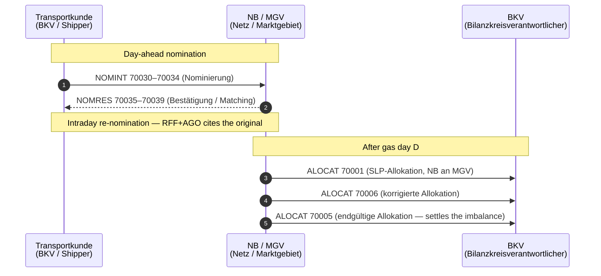

# mako-gabi-gas

**GaBi Gas — Gasbilanzierung (Gas Balancing)**

Process engine workflows for the German gas balancing framework under
GaBi Gas 2.1 (BNetzA BK7-24-01-008). Governs allocation, nomination, and
billing between balance responsible parties (BKV), network operators
(FNB/VNB), and market area managers (MGV).

Every message carries a **Prüfidentifikator** (PID) — a five-digit code naming the
exact Anwendungsfall, and with it the rules and deadlines that apply. DVGW allocates
70000–79999 for the gas transport formats, which never collides with BDEW's range.

## Process flow


```mermaid
sequenceDiagram
    autonumber
    participant TK as Transportkunde<br/>(BKV / Shipper)
    participant NB as NB / MGV<br/>(Netz / Marktgebiet)
    participant BKV as BKV<br/>(Bilanzkreis­verantwortlicher)

    Note over TK,NB: Day-ahead nomination
    TK->>NB: NOMINT 70030–70034 (Nominierung)
    NB-->>TK: NOMRES 70035–70039 (Bestätigung / Matching)

    Note over TK,NB: Intraday re-nomination — RFF+AGO cites the original

    Note over NB,BKV: After gas day D
    NB->>BKV: ALOCAT 70001 (SLP-Allokation, NB an MGV)
    NB->>BKV: ALOCAT 70006 (korrigierte Allokation)
    NB->>BKV: ALOCAT 70005 (endgültige Allokation — settles the imbalance)
```

## Implemented processes

| Workflow | PIDs / Message types | Governing document | Status |
|---|---|---|---|
| `gabi-gas-invoic` | INVOIC 31010 (Kapazitätsrechnung, NB/VNB → BKV) + 31007/31008 (Aggreg. MMM-Rechnung, NB → MGV) | BK7-24-01-008 | ✅ |
| `gabi-gas-allocation` | ALOCAT (PIDs 70001–70023) | BK7-24-01-008 / DVGW ALOCAT 5.11a | ✅ |
| `gabi-gas-nomination` | NOMINT (70030–70034) + NOMRES (70035–70039) — both ends: `SendNomination` enqueues this tenant's NOMINT from its positions and `SendNomres` the answer it owes; `ReceiveNomint`/`ReceiveNomres` record the counterparty's. A curtailment, a refusal and a missed answer each notify the ERP | BK7-24-01-008 / DVGW NOMINT 4.6 FK / NOMRES 4.7 FK | ✅ |
| `gabi-gas-mmma` | MSCONS 13013 + ORDERS 17110 + ORDRSP 19110 (Allokationsliste Gas, MMMA) | BK7-24-01-008 | ✅ |
| `gabi-gas-mehr-mindermengen` | SSQNOT (70095 SLP / 70096 RLM, NB → MGV) — both ends: records a Netzbetreiber's report, or enqueues this tenant's own (`Melden`) | BK7-24-01-008 / DVGW SSQNOT 5.7 | ✅ |

The DVGW transport formats `dvgw-edi` does not parse — SCHEDL, IMBNOT, TRANOT,
DELORD/DELRES, CHACAP, NUEVOR, SLPASP and TSIMSG — have no workflow
here. A workflow for a format nothing can parse is unreachable, and registering
a Prüfidentifikator for it overstates what the router handles.

## Domain model (`domain.rs` + `portfolio.rs`)

The `mako-gabi-gas` crate provides a rich domain vocabulary for the German gas
market. All energy quantities use `rust_decimal::Decimal` — never `f32`/`f64`
(**no float money** rule, DVGW G 685 requires ≥ 3 decimal places).

### `GasDay` — typed gas market day

The German gas day starts and ends at **06:00 CET** (DVGW G 2000 §3.2):
- Winter (CET, UTC+1): 06:00 local = 05:00 UTC
- Summer (CEST, UTC+2): 06:00 local = 04:00 UTC
- **Spring forward** (last Sunday March): 23-hour gas day
- **Fall back** (last Sunday October): 25-hour gas day

```rust
let day = GasDay::new(date!(2026-01-15));
println!("Start UTC:           {}", day.start_utc());             // 05:00 UTC (winter)
println!("Duration:            {} hours", day.duration_hours());  // 24
println!("NOMINT deadline:     {}", day.nomination_deadline_utc()); // D-1 13:00 CET (convention)
println!("NOMRES deadline:     {}", day.nomres_deadline_utc());     // D-1 15:00 CET (convention)
println!("Daily ALOCAT due:    {}", day.taegliche_alocat_deadline_utc()); // D+1 12:00 (§ 46 Ziff. 1 KoV XV)
println!("Final (RLM) due:     {}", day.finale_allokation_deadline_utc(  // M+14 WT (§ 47 Ziff. 1)
    AllokationsSerie::Rlm,
    |from, n| fristen::add_werktage(from, u32::from(n), HolidayCalendar::BdewMaKo),
));
```

#### Deadline summary

| Deadline | Time | Source | Method |
|---|---|---|---|
| Daily ALOCAT | D+1 12:00 | § 46 Ziff. 1/3 KoV XV | `taegliche_alocat_deadline_utc()` |
| Untertägige Meldungen | 15:00 and 18:00 on D | § 46 Ziff. 2 KoV XV | *(not modelled — a second obligation, not this one)* |
| Final allocation, **SLP** | D-1 12:00 | § 47 Ziff. 1 KoV XV | `finale_allokation_deadline_utc(Slp, …)` |
| Final allocation, **RLM** and Entry-/Exitso | end of the 14th Werktag after the Liefermonat | § 47 Ziff. 1 KoV XV | `finale_allokation_deadline_utc(Rlm, …)` |
| NOMINT submission | D-1 13:00 CET | *operating convention* | `nomination_deadline_utc()` |
| NOMRES response window | D-1 15:00 CET | *operating convention* | `nomres_deadline_utc()` |

The two nomination times are **not KoV XV Fristen** — the Kooperations­vereinbarung
sets no clock time for the nomination cycle, and the DVGW NOMINT/NOMRES
Nachrichtenbeschreibungen are format specs with no timing in them. D-1 13:00/15:00
CET is the harmonised day-ahead cycle the FNB's Netzzugangsbedingungen carry;
treat a breach as an operational alert, not as a documented Fristverletzung.

The two final-allocation deadlines are **not variants of one figure**. An SLP
allocation is final *before* the gas day it describes, because it is the forecast
the Marktgebietsverantwortliche balances; an RLM allocation is final two weeks
after the delivery month, once § 46 Ziff. 1's ten-Werktage plausibilisation has
run. `makod` registers the RLM window on an inbound ALOCAT — the SLP one is
already past when the message arrives.

### `GasBeschaffenheit` + `GasQuantity` — DVGW G 685 conversion

```rust
// Energy conversion: kWh_Hs = m³ × Hs × Z  (DVGW G 685)
let beschaffenheit = GasBeschaffenheit {
    brennwert_hs_kwh_per_m3: dec!(10.55),
    zustandszahl: dec!(0.9764),
    quality_class: GasQualityClass::HGas,
    valid_from: date!(2026-01-01),
    ..
};

// Validate against DVGW G 260 physical limits before use
beschaffenheit.validate()?;   // Err if Hs, Hu, or Zustandszahl outside valid range

let quantity = GasQuantity::from_m3(dec!(100), beschaffenheit);
assert_eq!(quantity.energy_kwh_hs, dec!(1030.102)); // rounded to 3 dp
```

#### DVGW G 260 validation ranges

| Parameter | H-Gas valid range | L-Gas valid range |
|---|---|---|
| Hs (kWh/m³) | 9.5 – 13.1 | 7.5 – 10.3 |
| Hu (kWh/m³) | 8.5 – 11.8 | 6.8 – 9.3 |
| Zustandszahl | 0.80 – 1.20 | 0.80 – 1.20 |
| Hu < Hs | always | always |

`validate()` returns `Err(GasBeschaffenheitValidationError)` listing all violated constraints.

### `GasQualityFlag` — measurement quality per KoV XV §§ 46–47 / DVGW G 685

```rust
// Every gas measurement interval carries a quality flag
match flag {
    GasQualityFlag::Measured     => /* direct MSCONS Gas reading */,
    GasQualityFlag::Estimated    => /* SLP Gas profile (G0, H0, G1–G6) */,
    GasQualityFlag::Substituted  => /* KoV XV § 46 replacement value — RLM: ANB per G 685;
                                       SLP: only a missing D-1 allocation, formed by the MGV */,
    GasQualityFlag::Calculated   => /* DVGW G 685 m³ → kWh_Hs conversion result */,
    GasQualityFlag::Corrected    => /* revised value, prior version preserved */,
    GasQualityFlag::Rejected     => /* failed validation — triggers Ersatzwertbildung */,
    GasQualityFlag::Unknown      => /* quality not yet determined */,
}

// Billing gate per GaBi Gas 2.1 (BK7-24-01-008)
if flag.is_billable() { /* includes Measured, Substituted, Calculated, Corrected */ }
```

### `AllocationVersion` — §§46/47 KoV XV correction tracking

ALOCAT messages can be sent as initial, corrected, or final allocations per
§§46/47 KoV XV. The `AllocationVersion` enum tracks which sequence this is:

```rust
pub enum AllocationVersion {
    Initial,           // First ALOCAT for this gas day
    Correction(u32),   // nth correction (1-based)
    Final,             // Binding for imbalance settlement
}
```

### `GasMarketRole` — typed market role classification

```rust
assert!(GasMarketRole::Bkv.submits_nominations());      // BKV submits NOMINT
assert!(GasMarketRole::Fnb.receives_allocations());     // FNB receives ALOCAT (sub-day)
assert!(GasMarketRole::Bkv.has_imbalance_obligation()); // BKV settles via IMBNOT
assert!(!GasMarketRole::Lf.receives_allocations());     // LF does not receive ALOCAT directly
```

### `GasPortfolioBalance` + `PortfolioPosition` — conservation check

BKV portfolio aggregation across all Bilanzkreise for a gas day:

```rust
let balance = GasPortfolioBalance { bkv_eic: "...", gas_day, positions, .. };
println!("Net: {} kWh", balance.net_imbalance_kwh());    // nominated − allocated
println!("Direction: {:?}", balance.portfolio_direction()); // Mehr / Minder / Balanced
println!("Open positions: {}", balance.open_imbalance_count());

// Verify energy conservation: SUM(BKV allocations) = VNB measured total
// per DVGW G 685
match balance.conservation_check(vnb_total_kwh, dec!(1.0) /* tolerance */) {
    Ok(total) => println!("Conservation OK: {} kWh", total),
    Err(ConservationViolation::EnergyImbalance { deviation_kwh, .. }) =>
        println!("Imbalance: {} kWh exceeds tolerance", deviation_kwh),
    Err(ConservationViolation::IncompleteAllocations { missing_bilanzkreise }) =>
        println!("Missing allocations for: {:?}", missing_bilanzkreise),
}
```

### `GasImbalanceSaldo` — settlement with Ausgleichsenergie price

```rust
let mut saldo = GasImbalanceSaldo::calculate(gas_day, "EIC_BKV", "EIC_BK",
                                              nominated, allocated);
// Mehr-Energie: BKV over-nominated, owes MGV
// Minder-Energie: BKV under-nominated, MGV owes BKV

// Set Ausgleichsenergie price from IMBNOT / MGV publication (KoV §9)
saldo.ausgleichsenergie_price_ct_per_kwh = Some(dec!(5.0)); // 5 ct/kWh

// Settlement amount = imbalance × price
if let Some(amount) = saldo.settlement_amount_ct() {
    println!("Settlement: {} ct", amount);
}
```

### Nomination correction chain

Re-nominations cite the prior NOMINT via `corrects_nomination_ref`:

```rust
// Initial day-ahead nomination (D-1, correction_sequence = 0)
let initial = NominationData {
    nomination_ref: MessageRef::new("NOMINT-2026-001"),
    corrects_nomination_ref: None,
    correction_sequence: 0,
    ..
};

// Intraday re-nomination correcting the initial (correction_sequence = 1)
let correction = NominationData {
    nomination_ref: MessageRef::new("NOMINT-2026-002"),
    corrects_nomination_ref: Some(MessageRef::new("NOMINT-2026-001")),
    correction_sequence: 1,
    ..
};
```

### CloudEvent constants (`de.gabi.*`)

All GaBi Gas domain events use typed constants from the `cloud_events` module:

```rust
use mako_gabi_gas::gabi_cloud_events;

// Use in agentd's builtin subscription table or makod CloudEvent dispatch
assert_eq!(gabi_cloud_events::NOMINATION_CREATED, "de.gabi.nomination.created");
assert_eq!(gabi_cloud_events::ALLOCATION_COMPLETED, "de.gabi.allocation.completed");
assert_eq!(gabi_cloud_events::IMBALANCE_CALCULATED, "de.gabi.imbalance.calculated");
assert_eq!(gabi_cloud_events::INVOIC_MMM_RECEIVED, "de.gabi.invoic.mmm.received");
// … 14 typed constants total (`mako_events::gabi`) — use the glob "de.gabi.*"
// to trigger gabi-gas-agent
```

### DVGW format versions

DVGW releases take effect on **1 April** and **1 October at 06:00 CET** (= the
start of a gas day). The version a counterparty claims is `UNH` S009 DE 0057 and
is captured verbatim by `dvgw_edi::DvgwVersion` — DVGW puts either a package
code (`DVGW17`) or the message version (`5.11a`) there, so it is not a uniform
key and nothing selects behaviour from it.

## Domain background

**GaBi Gas** (*Gasbilanzierung Gas*) is the BNetzA framework for gas network
balancing, established under the Gasnetzzugangsverordnung (GasNZV). It defines
how gas quantities are allocated, nominated, and settled across the German gas
transport and balancing market. The current version is **GaBi Gas 2.1**
(BNetzA BK7-24-01-008), which introduced the two-market-area model and mandatory
DVGW-format electronic exchange for all balancing processes.

## Key boundary: GaBi Gas vs. GeLi Gas

| Aspect | GeLi Gas (`mako-geli-gas`) | GaBi Gas (`mako-gabi-gas`) |
|---|---|---|
| Governing document | BK7-24-01-009 | BK7-24-01-008 |
| Scope | Supplier switching (Lieferantenwechsel Gas) + AWH billing | Gas balancing (Bilanzierung) |
| Parties | LFN ↔ GNB | BKV ↔ FNB/VNB ↔ MGV |
| Primary formats | UTILMD G (PIDs 44xxx), INVOIC 31011 | ALOCAT, NOMINT, NOMRES, INVOIC 31007/31008/31010, MSCONS 13013 |
| INVOIC billing | ✅ PID 31011 (NB → LF, AWH Sperrprozesse) | ✅ PID 31010 (NB → BKV, Kapazität) |

GaBi Gas capacity billing (PID 31010) is in this crate; AWH Sperrprozesse billing (PID 31011) is in `mako-geli-gas`.

## Two-crate architecture

| Crate | Responsibility |
|---|---|
| `dvgw-edi` | EDIFACT parsing, validation and writing — ALOCAT, NOMINT, NOMRES |
| `mako-gabi-gas` | Process engine — the five workflows (`gabi-gas-allocation`, `-nomination`, `-invoic`, `-mmma`, `-mehr-mindermengen`), PID routing, deadline handling, domain model |

## INVOIC billing workflows

`GaBiGasInvoicWorkflow` handles all three INVOIC PIDs via a single state machine:

| PID   | Process name                                          | Direction   |
|-------|-------------------------------------------------------|-------------|
| 31010 | Kapazitätsrechnung (FNB/VNB → BKV)                    | NB → BKV    |
| 31007 | Aggreg. MMM-Rechnung Gas (NB → MGV)                   | NB → MGV    |
| 31008 | Aggreg. MMM-Rechnung Gas, selbst ausgestellt          | NB → MGV    |

> PIDs 31007/31008 are Gas-only (GaBi Gas, BK7-24-01-008, NB → MGV).
> PID 31010 is capacity billing between NB/VNB and BKV.
> PID 31011 (AWH Sperrprozesse Gas, NB → LF) belongs to `mako-geli-gas` — it is
> billed by GNB for actions during the Sperrprozess, not by GaBi.

```text
New ──ReceiveInvoic──► InvoicReceived ──[valid]──► ValidationPassed
                                     ╰──[invalid]──► Rejected
ValidationPassed ──SettleInvoice──► Settled
                 ╰─DisputeInvoice──► Disputed
Any active state ──TimeoutExpired──► Rejected
```

After `ValidationPassed`, register a deadline with label
`"gabi-gas-invoic-settlement-deadline"` to enforce the contractual response window.

The state machine itself is not this crate's: all four INVOIC billing families
(GPKE, WiM, GaBi Gas, GeLi Gas) share `mako-invoic`, and this crate declares
only the family — its PID set, its deadline label, and which of the two roles
the deployment plays.

**GaBi Gas receives invoices; it does not issue them.** All three PIDs arrive at
the role this platform plays — the BKV receives the Kapazitätsrechnung, the MGV
the aggregated MMM-Rechnung — so the issuer leg stays shut and no REMADV PID
routes here. COMDIS 29001 does: it is the invoicer refusing *our* REMADV, which
is genuinely inbound for a payer.

## Allokationsliste Gas MMMA (`gabi-gas-mmma`)

The MMMA (Marktgebiets-Mehr-/Mindermengenabrechnungs-Allokation) process handles
the allocation list exchange between NB and MGV in the gas balancing framework.

```text
NB ──(ORDERS 17110 Anfrage)──► MGV
                                 │ [accepted]
                                 ├──(MSCONS 13013 Allokationsliste)──► NB
                                 │ [rejected]
                                 └──(ORDRSP 19110 Ablehnung)──► NB
```

| PID   | Message | Process name                              | Direction  |
|-------|---------|-------------------------------------------|------------|
| 17110 | ORDERS  | Anfrage Allokationsliste Gas              | NB → MGV   |
| 19110 | ORDRSP  | Ablehnung Anfrage Allokationsliste Gas    | MGV → NB   |
| 13013 | MSCONS  | Allokationsliste Gas (MMMA)               | MGV → NB   |

> PID 17110 here is Gas (GaBi, BK7-24-01-008). The same PID also exists in `mako-gpke`
> for the Strom Allokationsliste (different commodity — never cross-register).

## DVGW transport workflows

DVGW message types are parsed by `dvgw-edi` and routed by the Prüfidentifikator
through `mako-engine`. Each workflow corresponds to one DVGW
message exchange:

| Workflow | PIDs | DVGW message(s) | Description |
|---|---|---|---|
| `gabi-gas-allocation` | 70001–70023 | ALOCAT 5.11a | Gas quantity allocation — supports `Initial`, `Correction(n)`, `Final` versions per §§46/47 KoV XV |
| `gabi-gas-nomination` | 70030–70034 (NOMINT) · 70035–70039 (NOMRES) | NOMINT 4.6 · NOMRES 4.7 | Transportkunde → NB/MGV nomination + the NB's Bestätigung or Matching-Benachrichtigung; `NominationQuantity` tracks submitted/accepted/curtailed |
| `gabi-gas-mehr-mindermengen` | 70095 (SLP) · 70096 (RLM) | SSQNOT 5.7 | the Netzbetreiber's Mehr-/Mindermengenmeldung to the MGV — recorded on receipt, or enqueued as this tenant's own (`Melden`) |

The PID is read from `SG1 RFF+Z13`; `dvgw_edi::catalogue()` names each
Anwendungsfall. The process key is the **published Zuordnungstupel** (ALOCAT
5.11a §3.3) composed with the gas day — `dvgw_edi::DvgwMessage::process_key()` —
because a `ZO-T*` tuple identifies an *object* (an account) and a process is one
gas day of it. `ZG-T1` (Clearingnummer) is left alone: a clearing case
legitimately spans several days.

Nominated and confirmed energies are integrated over their periods
(`Σ(rate × duration)` — a DVGW `QTY` is kWh/h), which is what lets the workflow
notice a curtailment: NOMRES has no status segment, so a Bestätigung confirming
less than was nominated is only visible in the numbers.
DVGW allocates from 70000–79999, which never overlaps with
BDEW EDI@Energy PIDs.

## Market roles

| Role | Abbrev. | `GasMarketRole` | `submits_nominations` | `receives_allocations` | `has_imbalance_obligation` |
|---|---|---|:---:|:---:|:---:|
| Fernleitungsnetzbetreiber | FNB | `Fnb` | — | ✅ (sub-day) | — |
| Verteilnetzbetreiber | VNB | `Vnb` | — | — | — |
| Bilanzkreisverantwortlicher | BKV | `Bkv` | ✅ | ✅ | ✅ |
| Marktgebietsverantwortlicher | MGV | `Mgv` | — | — | — |
| Kapazitätsnutzer | KN | — | — | — | — |
| Lieferant | LF | `Lf` | — | — | — |
| Händler | GH | `Haendler` | ✅ | — | — |

## Regulatory references

| Document | Scope |
|---|---|
| **GaBi Gas 2.1 (BK7-24-01-008)** | Statutory basis for balance group accounting |
| **§ 46 KoV XV** | Versand von Allokationsdaten — the daily ALOCAT is due ‚unverzüglich, spätestens jedoch bis 12:00 Uhr‘ on D+1, plus the two untertägige Meldungen at 15:00 and 18:00 |
| **§ 47 KoV XV** | Allokationsclearing — and with it the final-allocation deadline: **D-1 12:00** for SLP, **M+14 Werktage** for RLM and the Entry-/Exitso-Zeitreihen |
| *(not the KoV)* | The nomination cycle. KoV XV sets no clock time for it; D-1 13:00/15:00 CET is the harmonised convention the FNB's Netzzugangsbedingungen carry, and mako treats a breach as an operational alert |
| **BNetzA BK7-24-01-008** | GaBi Gas 2.1 — current ruling |
| **DVGW G 685** | Gas metering: kWh_Hs = m³ × Hs × Z (≥ 3 decimal places required) |
| **DVGW G 260** | Gas quality classes: H-Gas (9.5–13.1 kWh/m³) / L-Gas (7.5–10.3 kWh/m³) |
| **DVGW G 2000** | Gas day definition: starts 06:00 CET (DST-aware) |

DVGW AHBs and MIGs: <https://www.dvgw-sc.de/leistungen/it-dienstleistungen/datenaustausch-gas>

## Related crates

| Crate | Role |
|---|---|
| [`mako-gabi-gas`](https://docs.rs/mako-gabi-gas) ← **this crate** | GaBi Gas workflows, PID routing, gas domain model, `GaBiGasModule` |
| [`dvgw-edi`](https://docs.rs/dvgw-edi) | DVGW EDIFACT — ALOCAT, NOMINT, NOMRES, SSQNOT |
| [`mako-engine`](https://docs.rs/mako-engine) | Event-sourced workflow runtime — `Workflow`, `Process`, `EventStore`, deadlines |
| [`mako-fristen`](https://docs.rs/mako-fristen) | *When* an answer is due — Werktage, the MaKo holiday calendar, the per-PID Antwortfristen |
| [`mako-invoic`](https://docs.rs/mako-invoic) | The INVOIC settle/dispute state machine every billing family shares |
| [`mako-geli-gas`](https://docs.rs/mako-geli-gas) | The other half of the gas market: supplier switching, not balancing |
| [`makod`](https://hupe1980.github.io/mako/docs/services/makod/) | Production daemon — routes, adapts and renders these workflows |

Part of **mako**, an open-source Rust platform for German energy market
communication (Marktkommunikation). Full documentation: <https://hupe1980.github.io/mako/>
