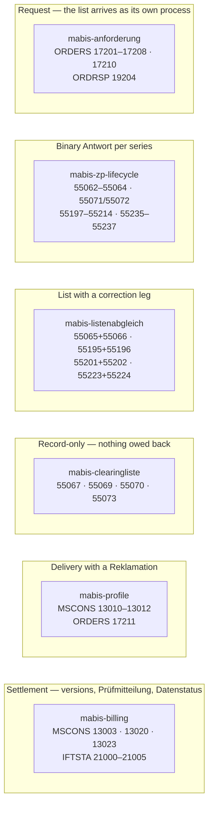

# mako-mabis

**MaBiS — Marktregeln für die Durchführung der Bilanzkreisabrechnung Strom**

The German electricity balance-group settlement, per BNetzA **BK6-24-174
Anlage 3**. Strom only — gas balances through GaBi Gas, on the Gastag and
against a Marktgebiet.

A **Prüfidentifikator** (PID) is the five-digit BDEW code every message in these
processes carries. It names the exact Anwendungsfall, and with it the rules, the
Frist and the answer tree that apply — so the PID, not the EDIFACT message type,
is what routes.

## Three things this crate exists to get right

MaBiS looks like the other MaKo process families and is not shaped like them.
Each of the following is a place where the obvious model produces working code
that is silently wrong.

### 1. There is no Prüfmitteilung deadline

A Summenzeitreihe arrives, a Prüfmitteilung goes back, so it is natural to hang
a response Frist off the arrival the way GPKE and WiM do. The Festlegung says
otherwise, twice:

- **Kap. 9.8.2 Nr. 1** — „Prüfmitteilung BG-SZR (Kategorie B)", Frist column
  **„–"**. The receiving party „**kann** … eine positive oder eine negative
  Prüfmitteilung übermitteln." Every other Prüfmitteilung use case in the
  document carries the same empty cell.
- **Kap. 13.8.2** — no BKV answer at all. Its two rows are the **BIKO's own**
  dispatch Fristen (18. WT vorläufig, 42. WT endgültig) and
  „Abrechnungssummenzeitreihe fehlerhaft — im Bedarfsfall".

What bounds a Prüfmitteilung is the **clearing window** of Kap. 3.10 Tabelle 2 —
a date range on the Bilanzierungsmonat, not a countdown from an arrival. A
1-Werktag response deadline on a monthly settlement raises a false alarm every
day and hides the one that matters: the window closing at the 30. WT.

The two places a **1 Werktag** Frist genuinely appears are both the **BIKO's**:
forwarding a Prüfmitteilung (Kap. 9.8.2 Nr. 3) and dispatching the Datenstatus
(Kap. 9.9.2 Nr. 1).

### 2. A settlement is a sequence of versions, not one message

Kap. 3.8.2: „Die Version einer Summenzeitreihe ist jeweils **aufsteigend** zu
vergeben und ist über die gesamte BKA beizubehalten." One MaBiS-Zählpunkt in one
Bilanzierungsmonat receives a *stream* of versions, each checked, corrected and
superseded until its window closes. A one-shot `New → Received → Sent → Settled`
machine cannot represent the second version — and the second version is the
entire point of the Clearingphase.

The version is not a counter. IFTSTA MIG 2.1 `SG4 RFF+AUU`, DE 1154 `an17`:
„Die Versionsangabe erfolgt über den **Erstellungszeitpunkt**, der in der MSCONS
übermittelt wurde. Beispiel: `RFF+AUU:20110503121544?+00`". It is the key both
ends match on, so [`SzrVersion`] holds the 17 characters verbatim.

### 3. 55062 / 55063 / 55064 are generic codes

**Eleven Summenzeitreihen share them**, and 55064 answers all of them out of
**twelve different Entscheidungsbäume**. Six of the eleven owe a 55064; five owe
nothing. Nothing in the PID says which.

The discriminator is on the wire — `SG10 CCI+++ZB4` / `CAV` DE 7111
„Bezeichnung der Summenzeitreihe", plus `SG10 CCI+6` for the responsible role
(UTILMD AHB Strom 2.2 Kap. 13.1):

| Code | Summenzeitreihe | | Code | Summenzeitreihe |
|------|-----------------|-|------|-----------------|
| `Z95` | BG-SZR (Kat. B) | | `ZA1` | LF-SZR (Kat. A) |
| `Z96` | BG-SZR (Kat. C) | | `ZA2` | LF-SZR (Kat. B), Ebene RZ |
| `Z97` | BK-SZR (Kat. A) | | `ZA3` | LF-SZR (Kat. B), Ebene BG |
| `Z98` | BK-SZR (Kat. B), Ebene RZ | | `ZA4` | Deltazeitreihenübertrag |
| `Z99` | BK-SZR (Kat. B), Ebene BG | | `ZA5` | Netzzeitreihe |
| `ZA0` | BK-SZR (Kat. C) | | `ZA6` | Abrechnungssummenzeitreihe |

`ZpSerie::from_wire` reads both. A message that carries neither is **refused**,
not defaulted: there are eleven wrong answers to guess between, and a wrong one
either invents an answer obligation or drops a real one.

## Six workflows



| Module | Workflow | Contents |
|---|---|---|
| `bilanzkreisabrechnung` | `mabis-billing` | one Summenzeitreihe over one Bilanzierungsmonat: versions, Prüfmitteilungen, Datenstatus |
| `profile` | `mabis-profile` | normierte Profile und Profilscharen + the LF's Reklamation |
| `clearingliste` | `mabis-clearingliste` | the four record-only UTILMD lists |
| `listenabgleich` | `mabis-listenabgleich` | the four lists that owe a Korrekturliste |
| `zp_lifecycle` | `mabis-zp-lifecycle` | MaBiS-ZP Aktivierung/Deaktivierung per series, incl. the NZR-EMob Zuordnung des ZP der NGZ zur NZR (55235–55237, AHB Kap. 13.16) |
| `anforderung` | `mabis-anforderung` | ORDERS list requests + the one Ablehnung |
| `fristen` | — | Kap. 3.10 Tabelle 2, executable |
| `zeitreihen` | — | Kap. 2 Tabelle 1 + the `CAV` codelist |
| `summenzeitreihe` | — | the aggregation builder (`mabis-syncd` uses it) |

## The Fristenkalender

`fristen::Bilanzierungsmonat` is Tabelle 2 (Kap. 3.10). Every Frist is anchored
on the **end of the Bilanzierungsmonat** and measures **arrival at the BIKO**,
not dispatch.

| Zeitreihe | BKA Erstaufschlag | BKA Clearing | KBKA |
|---|---|---|---|
| BG-SZR (Kategorie B) · NZR | 1.–10. WT | 11.–30. WT | 31. WT – Ende 7. Monat |
| BK-SZR (Kategorie A und B) | 1.–12. WT | 13.–30. WT | 31. WT – Ende 7. Monat |
| DZÜ | — | 31.–34. WT | 1.–8. WT des 8. Monats |

| Abrechnungsstichtag | BKA | KBKA |
|---|---|---|
| Vorläufige Bilanzierung | 18. WT, Datenstand 15. WT | 8. WT des 5. Monats, Datenstand Ende 4. Monat |
| Abrechnungsrelevante Bilanzierung | 42. WT, Datenstand 30. WT | Ende 8. Monat, Datenstand Ende 7. Monat |

Kapitel 17 has a **second** Fristentabelle (Kap. 17.3.1.3) for the
Redispatch-Ausfallarbeit series — the monatliche AAÜZ and the LF-AASZR ride the
BK-SZR windows, and the **tägliche AAÜZ** is due „Folgetag (täglich)" with no
Clearingphase at all, the only daily Frist in MaBiS.

The BG/BK offset is not cosmetic. Kap. 3.8.3: a version reaching the BIKO
**inside** the Erstaufschlag window is assigned „Abrechnungsdaten"
automatically; one arriving after it gets „Prüfdaten" and only a **positive**
Prüfmitteilung promotes it. A BK-SZR filed on the 11. WT is still an
Erstaufschlag; a BG-SZR filed the same day is not. Filing a day late therefore
does not merely miss a deadline — it changes the settlement path, silently,
because the message is accepted either way.

## Datenstatus

Five values, assigned **exclusively by the BIKO** (Kap. 3.8.3). On the wire:
`STS+Z04+<code>:<EBD>` (IFTSTA MIG 2.1 SG7; the MIG's own example is
`STS+Z04+A03:E_0026`).

| Code | Datenstatus |
|------|-------------|
| `A01` | Abrechnungsdaten |
| `A02` | Prüfdaten |
| `A03` | Abgerechnete Daten |
| `A04` | Abrechnungsdaten KBKA |
| `A06` | Abgerechnete Daten KBKA |

Three rules that are easy to invert:

- **A negative Prüfmitteilung does not change the Datenstatus** — Kap. 3.8.3
  states it in as many words. It opens a correction obligation; the version
  keeps whatever status it had.
- **Kategorie C carries neither Prüfmitteilung nor Datenstatus**, so a BG-SZR or
  BK-SZR of Kategorie C never enters a settlement stream at all.
- **The settling version is the highest one carrying `A01`/`A04`** — or, once
  the Abrechnungsstichtag has passed, `A03`/`A06`. That is not necessarily the
  highest version: a later one sitting at `A02` does not settle
  (`BillingData::abrechnungsrelevante_version`).

The three EBDs in each Datenstatus triple are the three **occasions** a status is
assigned, and they line up one-to-one with the rules above:

| EBD name | Occasion |
|---|---|
| „…nach Eingang einer Summenzeitreihe vergeben" | arrival — Erstaufschlag → `A01`, otherwise `A02` |
| „…nach Vorliegen einer Prüfmitteilung vergeben" | a positive check promotes `A02` → `A01` |
| „…nach erfolgter Bilanzkreisabrechnung vergeben" | the Abrechnungsstichtag → `A03` / `A06` |

## A Prüfmitteilung states a code, not a verdict

`SendPruefmitteilung` takes an **Antwortcode**, not `positive: bool`. The
Summenzeitreihe the stream settles decides which Entscheidungsbaum applies, and
the workflow resolves the code against that tree (`Zeitreihe::pruef_ebd`):

| Summenzeitreihe | EBD | Zustimmung | „Energiemenge falsch" |
|---|---|---|---|
| LF-SZR (A) / LF-SZR (B) / NZR / LF-AASZR | `E_0007` / `E_0041` / `E_0040` / `E_0093` | `A06` | `A05` |
| BG-SZR (B) / BK-SZR (A) / BK-SZR (B) | `E_0062` / `E_0063` / `E_0064` | `A03` | `A02` |
| DZÜ | `E_0065` | `A04` | `A03` |

Two consequences that a boolean cannot express:

- **`A02` is not one code.** It is „Energiemenge falsch" in `E_0062` and
  „Gewählter Zeitraum nicht zulässig" in `E_0041`. Naming a code the deciding
  tree does not publish is refused rather than sent.
- **Negative is not the opposite of forwarded.** An `Abweisung` (`A01`–`A04` of
  the long form) is refused before it is assessed, and Kap. 9.8.2 Nr. 2 keeps
  its Prüfmitteilung from being forwarded at all; an `Ablehnung` is forwarded.
  `Pruefergebnis::wird_weitergeleitet()` is therefore not `!ist_positiv()`.

The same holds for the other two reply legs:

- **`SendKorrektur`** takes the disputed positions and the **role that
  distributed the list**, not a count. The distributor decides the tree — 55066
  is answered out of `E_0047` when the NB sent the list and out of `E_0004`
  when the ÜNB did — and the same Korrekturgrund is `A07` in one, `A06` in the
  other. An empty list still sends a reply; silence reads as acceptance.
- **`SendReklamation`** takes an `E_0100` code. Four of the six (`A03`–`A06`)
  sit on the Profilschar branch — the Profilschar Version, the Maßeinheit and
  the two Temperaturmaßzahl-Prüfschritte — so sending one for a normiertes
  Profil is refused: Prüfschritt 2 splits and the halves never rejoin.

The catalogue is [`mako-pruefung`](https://docs.rs/mako-pruefung).

## IFTSTA 21000–21005 are not all inbound

| PID | Meaning | Direction |
|----:|---------|-----------|
| 21000 | Prüfmitteilung on the LF-SZR (`E_0007`/`E_0041`) or LF-AASZR (`E_0093`) | LF → NB/ÜNB · **outbound** |
| 21001 | Prüfmitteilung on the Netzzeitreihe (`E_0040`) | NB → NB · **outbound** |
| 21002 | **Abweisung** einer Prüfmitteilung | BIKO → NB/ÜNB · inbound |
| 21003 | Datenstatus **and** Weiterleitung Prüfmitteilung | BIKO → NB/ÜNB · inbound |
| 21004 | Datenstatus **and** Weiterleitung Prüfmitteilung | BIKO → BKV/NB · inbound |
| 21005 | Prüfmitteilung | BKV/NB → BIKO · **outbound** |

**Both 21003 and 21004 carry a Datenstatus.** Which one a participant receives
follows from its role. Treating 21004 as "the Datenstatus PID" drops every
Datenstatus an NB or ÜNB is sent.

**An Abweisung is not a rejection of the data.** Kap. 9.8.2 Nr. 2: a rejected
Prüfmitteilung is never forwarded to the responsible party, so the check never
landed and has to be redone.

## Identifier integrity — the dangerous dimension

MSCONS SG6 carries three `LOC` qualifiers whose values are all free text at the
MIG level: `172` the Meldepunkt (MaBiS-Zählpunkt), `107` the Bilanzierungsgebiet,
`237` the Bilanzkreis. A message that puts the territory EIC in `LOC+172` parses,
validates and is **accepted by the BIKO**, which then files the series against
the wrong Meldepunkt. Nothing downstream can tell that apart from a correct
submission.

All three are validating newtypes, so the whole class is **unrepresentable**
rather than checked:

| `LOC` | Value | Type | Shape enforced |
|---|---|---|---|
| `172` | Meldepunkt | `MabisZaehlpunktId` | 33-character Zählpunktbezeichnung, in `new` **and** in `Deserialize` — the value usually arrives as JSON |
| `107` | Bilanzierungsgebiet | `rubo4e::identifiers::BilanzierungsgebietId` | 16-character EIC, ENTSO-E object type `Y` (Area) |
| `237` | Bilanzkreis | `rubo4e::identifiers::BilanzkreisId` | 16-character EIC, ENTSO-E object type `X` (Party) |

A territory EIC in a Meldepunkt field fails on length, and the two EIC types are
told apart by their type letter rather than by the field they happen to sit in.
There is deliberately **no** `validate_identifiers()` pass over an assembled
`Summenzeitreihe`: with these three types such a check could never fire, and a
control that cannot fire reads as protection during review while providing none
(`src/summenzeitreihe.rs`, `identifier_tests`).

The **inbound** side deliberately keeps a plain `String`
(`ZpLifecycleCommand::ReceiveAnfrage`). A counterparty's malformed Meldepunkt has
to be representable before it can be rejected — parsing into a type belongs on
values this system produces, not on ones it receives.

## MaBiS-ZP lifecycle

Every process has the same shape — an **Anfrage**, optionally an **Antwort**,
optionally a **Weiterleitung** — but which of the three exist depends on the
*series*, not on the PID.

### The eleven series sharing 55062 / 55063 / 55064

| Serie | Achse | Antwort | EBD Aktivierung | EBD Deaktivierung |
|-------|-------|--------:|-----------------|-------------------|
| Netzzeitreihe | NB (verantw.) → NB (benachbart) | 55064 | `E_0020` | `E_0010` |
| Netzzeitreihe | NB (verantw.) → BIKO | 55064 | `E_0024` | `E_0009` |
| Lieferantensummenzeitreihe | NB → LF | — | — | — |
| Lieferantensummenzeitreihe | ÜNB → LF | — | — | — |
| Bilanzierungsgebietssummenzeitreihe | ÜNB → BIKO | 55064 | `E_0015` | `E_0035` |
| Bilanzkreissummenzeitreihe | NB → BIKO | 55064 | `E_0034` | `E_0018` |
| Bilanzkreissummenzeitreihe | ÜNB → BIKO | 55064 | `E_0011` | `E_0012` |
| Deltazeitreihenübertrag | ÜNB → BIKO | 55064 | `E_0027` | `E_0028` |
| Abrechnungssummenzeitreihe | BIKO → NB / BKV / ÜNB | — | — | — |
| tägliche Bilanzierungsgebietssummenzeitreihe | ÜNB → NB | — | — | — |
| tägliche Bilanzkreissummenzeitreihe | ÜNB → BKV | — | — | — |

For the four series that have one, the **Weiterleitung re-uses the request
code**: Prozessschritt 4 is another 55062/55063 addressed to the downstream
party, not a distinct PID.

### The series with their own codes

| Serie | Anfrage | Antwort | EBD | Weiterleitung |
|-------|--------:|--------:|-----|--------------:|
| Zuordnungsermächtigung (BKV → NB) | 55071 / 55072 | — | — | — |
| tägliche AAÜZ (NB (ANB) → ÜNB) | 55197 / 55198 | — | — | — |
| LF-AASZR (NB (ANB) → LF) | 55199 / 55200 | — | — | — |
| monatliche AAÜZ, BKV des LF | 55203 / 55206 | 55204 / 55207 | `E_0071` / `E_0072` | 55205 / 55208 |
| monatliche AAÜZ, BKV des anfNB | 55209 / 55212 | 55210 / 55213 | `E_0078` / `E_0079` | 55211 / 55214 |
| Zuordnung ZP der NGZ zur NZR (verantw. NB → benachb. NB) | 55235 / 55236 | 55237 | `E_0102` / `E_0103` | 55235 / 55236 |

> **55218 and 55220 are not MaBiS.** They are GPKE Teil 2 (Abr.-Daten NNA).
> 55215–55217, 55219, 55221 and 55222 are unassigned. None is routed here.

The last row is the NZR-EMob leg (AHB Kap. 13.16) and it is **MaBiS, not
Modell 2**, which is why it lives here and not in `mako-emob`. One Antwort code
serves both directions — 55237 answers the Zuordnung out of `E_0102` and the
Beendigung out of `E_0103` — which is why the Antwort PID and the EBD are
separate columns. Its Weiterleitung is the same code re-addressed to the ÜNB,
and it is sequenced *after* the neighbouring NB has confirmed.

## The Kapitel-17 series expire

Three Ausfallarbeit series come from MaBiS Anlage 1 **Kapitel 17**, which
BK6-23-241 Tenorziffer 5 repeals with the end of **30.09.2026**:

| Kapitel | Content | From 01.10.2026 |
|---|---|---|
| 17.1, 17.3 (except 17.3.2.1) | bilanzieller Ausgleich, Bilanzierungsprozesse | continue as the „Anlage zur BilAReM" |
| **17.2** | Bilanzkreismonitoring, tägliche AAÜZ (55197/55198) | **gone** |
| **17.3.2.1** | monatliche Ausfallarbeitszeitreihe je MaLo, NB → LF | **gone** |

`ZpSerie::endet_am` and `Familie::endet_am` carry the date, so a deployment can
refuse to activate a Zählpunkt for a series that will not exist when the month it
settles is due. Everything else in Kapitel 17 continues unchanged until the
EDI@Energy documents of BK6-23-241 Tenorziffer 8 apply.

## MaBiS Anforderungen

| PID | Anforderung | Von → An | Abonnement | Ablehnung |
|-----|-------------|----------|------------|-----------|
| 17201 | normierte Profile und Profilschar | LF → NB | ✅ | — |
| 17202 | Lieferantenclearingliste | LF → NB/ÜNB | ✅ | — |
| 17203 | Bilanzkreiszuordnungsliste | BKV → NB/ÜNB | ✅ | — |
| 17204 | Clearingliste BAS | BKV → BIKO | — | — |
| 17205 | Clearingliste DZR | NB → BIKO | — | — |
| 17206 | Bilanzierungsgebietsclearingliste | NB → ÜNB | ✅ | — |
| 17207 | Ab-/Bestellung BK-SZR auf Aggregationsebene | BKV → ÜNB | ✅ | **19204** |
| 17208 | Clearingliste ÜNB-DZR | ÜNB → BIKO | — | — |
| 17210 | Lieferantenausfallarbeitsclearingliste | LF → NB (ANB) | ✅ | — |

**The subscription direction is in the payload, not the PID.** Six codes carry
both the start and the end of an Abonnement — 17207's own AHB name is
*Ab-/Bestellung*. `AbonnementVorgang` is therefore an explicit input; deriving
it from the PID would turn every unsubscribe into a subscribe. The three
one-shot codes (17204/17205/17208) reject an `Abbestellung` outright.

**Only 17207 can be refused**, and the ÜNB answers it out of a *different* tree
per direction: `E_0003` for a Bestellung, `E_0022` for an Abbestellung. Without
that leg a refused subscription is indistinguishable from an accepted one, and
the BKV keeps expecting a BK-SZR on an aggregation level it was never granted.

## Lists

| Liste | Von → An | Antwort | EBD der Antwort | Inhalt |
|------:|----------|--------:|-----------------|--------|
| 55065 | NB → LF | 55066 | `E_0047` | Lieferantenclearingliste |
| 55065 | ÜNB → LF | 55066 | `E_0004` | Lieferantenclearingliste |
| 55195 | ÜNB → NB | 55196 | `E_0017` | Bilanzierungsgebietsclearingliste |
| 55201 | NB → LF | 55202 | `E_0097` | LF-AACL |
| 55223 | ÜNB → NB | 55224 | `E_0070` | DZÜ-Liste |

**55065 is not record-only.** The PID overview gives it a Prozessschritt-3
Korrekturliste. An LF that never sends 55066 has silently accepted whatever the
NB filed. Note that its EBD depends on **who
sent the list** — one PID, two axes, two disjoint code spaces.

The record-only lists are 55067 (Bilanzkreiszuordnungsliste), 55069
(Clearingliste DZR), 55070 (Clearingliste BAS) and 55073 (Liste der
Profildefinitionen). Three of them are the *delivery* leg of an ORDERS request
the counterparty already made.

**A Korrekturliste is a list on the wire, not a Vorgang.** `BGM+Z05`, the
Bilanzierungsmonat in `DTM+157` (`610` `CCYYMM` — the Dokumentendatum is when
the list was *made*), then an `IDE+Z01` head that is the Geschäftsvorfall and
carries the MaBiS-Zählpunkt, the Version der Zeitreihe and the answered list's
number. Each disputed Marktlokation follows as an `IDE+24` with its own
`STS+E01` and `LOC+Z16`. Head status and members are mutually exclusive, which
is the same split `SendKorrektur` and `SendGesamtAblehnung` already make
(UTILMD AHB Strom 2.2 Kap. 13.4).

## Usage

```rust,ignore
use mako_mabis::{
    Bilanzierungsmonat, BillingCommand, Familie, Kategorie, MabisBillingWorkflow,
    MabisZaehlpunktId, SUMMENZEITREIHE_PID, SzrVersion, Zeitreihe,
};

let zeitreihe = Zeitreihe::new(Familie::BgSzr, Some(Kategorie::B))?;
let monat = Bilanzierungsmonat::enthaltend(eingang);

// Which phase the arrival falls in decides the Datenstatus the BIKO will
// assign — so it comes from the calendar, not from the message.
let phase = monat.phase(zeitreihe, eingang);

let process = ctx.spawn::<MabisBillingWorkflow>(tenant_id, workflow_id);
process.execute(BillingCommand::ReceiveSummenzeitreihe {
    pid: Pruefidentifikator::new(SUMMENZEITREIHE_PID)?,
    zeitreihe,
    mabis_zp: MabisZaehlpunktId::new("DE0001111222233334444555566667777")?,
    bilanzierungsmonat: BillingPeriod::new("2026-01"),
    version: SzrVersion::new("20260205081500+00")?,   // RFF+AUU / DTM+293
    im_erstaufschlag: phase.ist_erstaufschlag(),
    absender: MarktpartnerCode::new("9900357000004"),
    biko_id: BikoId::new("10YDE-VE-TRANSMIX"),
    message_ref: MessageRef::new("MSCONS-BG-2026-01-V1"),
}).await?;

// The check has no Frist; it is bounded by the clearing window. The code is a
// bare string because the deciding tree follows from `zeitreihe`, which only
// the workflow holds — here `A02` „Energiemenge falsch" out of `E_0062`.
process.execute(BillingCommand::SendPruefmitteilung {
    version: SzrVersion::new("20260205081500+00")?,
    pid: Pruefidentifikator::new(21_005)?,
    antwortcode: "A02".into(),
    grund: Some("Abweichung 12 kWh".into()),
    message_ref: MessageRef::new("IFTSTA-PM-V1"),
}).await?;
```

A runnable end-to-end walk-through, including the Fristenkalender:

```sh
cargo run --example mabis_bilanzkreisabrechnung -p mako-mabis
```

## Regulatory references

- BNetzA **BK6-24-174 Anlage 3 (MaBiS)** — Kap. 2 (Tabelle 1), Kap. 3.8
  (Bildung, Versionierung, Prüfmitteilung, Datenstatus), Kap. 3.9
  (Aggregationsverantwortung), Kap. 3.10 (Tabelle 2 Fristenkalender), Kap. 6.5
  (normierte Profile), Kap. 9–13 (the use cases), Kap. 17 (Redispatch-Ausfallarbeit)
- BNetzA **BK6-23-241** (Beschluss 07.05.2026) Tenorziffer 5 — repeal of
  MaBiS Anlage 1 Kap. 17 with effect from the end of 30.09.2026
- EDI@Energy **MSCONS AHB 3.1g / 3.2** — Summenzeitreihen (13003, 13020, 13023)
  and normierte Profile (13010–13012)
- EDI@Energy **IFTSTA MIG 2.1 / AHB 2.1** — MaBiS Statusmeldungen 21000–21005,
  `SG4 RFF+AUU` Versionsangabe, `SG7 STS+Z04` Datenstatus
- EDI@Energy **UTILMD AHB Strom 2.2** Kap. 13.1 — MaBiS-ZP Aktivierung/
  Deaktivierung, `SG10 CCI/CAV` Bezeichnung der Summenzeitreihe
- EDI@Energy **Entscheidungsbaum-Diagramme und Codelisten 4.3** — the Datenstatus
  and Antwort trees

## Related crates

The format layer and the domain packs meet in `makod`: a workflow crate knows the
`Pruefidentifikator` and its own domain types, never an EDIFACT message type.

| Crate | Role |
|---|---|
| [`mako-mabis`](https://docs.rs/mako-mabis) ← **this crate** | MaBiS workflows, the Fristenkalender, PID routing, `MabisModule` |
| [`edi-energy`](https://docs.rs/edi-energy) | EDI@Energy EDIFACT — parse · validate · build (UTILMD, MSCONS, ORDERS, INVOIC, APERAK, …); joined to these workflows in `makod`, not depended on |
| [`mako-engine`](https://docs.rs/mako-engine) | Event-sourced workflow runtime — `Workflow`, `Process`, `EventStore`, deadlines |
| [`mako-fristen`](https://docs.rs/mako-fristen) | *When* an answer is due — Werktage, the MaKo holiday calendar, the per-PID Antwortfristen |
| [`mako-pruefung`](https://docs.rs/mako-pruefung) | *What* the answer must be — the BDEW Entscheidungsbäume, executable |
| [`mako-emob`](https://docs.rs/mako-emob) | NZR-EMob — books charge sessions into a supplier's Bilanzkreis, and settles through MaBiS |
| [`makod`](https://hupe1980.github.io/mako/docs/services/makod/) | Production daemon — routes, adapts and renders these workflows |

Part of **mako**, an open-source Rust platform for German energy market
communication (Marktkommunikation). Full documentation: <https://hupe1980.github.io/mako/>
