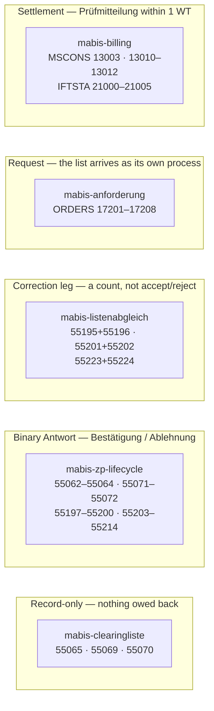

# mako-mabis

**MABIS — Marktprozesse für Bilanzkreis- und Aggregationsverantwortliche**

Process engine workflows for the German electricity balance group settlement
processes, per the BDEW MaBiS specification (BNetzA BK6-24-174 Anlage 3).

## Identifier integrity — the dangerous dimension

MSCONS SG6 carries three `LOC` qualifiers whose values are all free text at the
MIG level: `172` the Meldepunkt (MaBiS-Zählpunkt), `107` the Bilanzierungsgebiet,
`237` the Bilanzkreis. A message that puts the territory EIC in `LOC+172` parses,
validates and is **accepted by the BIKO**, which then files the series against
the wrong Meldepunkt. Nothing downstream can tell that apart from a correct
submission — which is why `Summenzeitreihe::validate_identifiers` refuses rather
than substituting a plausible value.

`MabisZaehlpunktId` is a validating newtype, so most of that class is
**unconstructible** rather than merely refused:

| Defect | Caught where |
|---|---|
| Meldepunkt is not 33 characters (e.g. a 16-character territory EIC) | `MabisZaehlpunktId::new` — and `Deserialize`, which runs the same check, since the value usually arrives as JSON |
| Meldepunkt absent | same — there is no empty `MabisZaehlpunktId` |
| Meldepunkt **equals** the Bilanzierungsgebiet | `validate_identifiers`, at runtime — `BilanzierungsgebietId` is unvalidated, so a 33-character value there could still collide |

Passing a `BilanzierungsgebietId` where a Meldepunkt belongs is a compile
error: both halves of the dangerous pair are typed.

The **inbound** side deliberately keeps a plain `String`
(`ZpLifecycleCommand::ReceiveAnfrage`). A counterparty's malformed Meldepunkt has
to be representable before it can be rejected — parsing into a type belongs on
values this system produces, not on ones it receives.

`marktd` also refuses the equality in its schema (`mabis_zp_not_the_gebiet`
`CHECK`), but that only protects rows written to *that* table. A series assembled
from any other source — a caller passing the EIC straight through, a fixture, a
replayed payload — reaches MSCONS rendering without meeting the constraint, so
the check lives in the pure crate too and `mabis-syncd` fails the run on it.

## Five workflows, three reply semantics

The families differ in **what comes back**, and reusing the wrong shape silently
drops an obligation. This is the distinction to keep straight:



Three things that look like they follow a pattern and do not:

- **`55064` answers both `55062` and `55063`.** Answer PIDs come from a table,
  never from arithmetic on the request.
- **Half the ZP-lifecycle families define no Antwort at all** (55071/55072,
  55197–55200). They are terminal on arrival; modelling them as request/response
  invents a response obligation the AHB does not define.
- **The Anforderung verb lives in the payload, not the PID.** Five of the eight
  ORDERS codes carry both the start *and* the end of an Abonnement — 17207's own
  AHB name is *Ab-/Bestellung*. Deriving it from the PID turns every unsubscribe
  into a subscribe.

## Process model (BKV perspective)

The **BIKO** (Bilanzkoordinator) is the central actor in MaBiS. It calculates
and sends the `Abrechnungssummenzeitreihe` (billing summary time series) to
each **BKV** (Bilanzkreisverantwortlicher). The BKV must respond with a
`Prüfmitteilung` (positive or negative) within **1 Werktag** (BK6-24-174 §13.8).

```
BIKO                               BKV (this crate)
────                               ────────────────
Abrechnungssummenzeitreihe ──────→ ReceiveSummenzeitreihe
                                       └─ register 1-WT deadline
                           ←──────── SendPruefmitteilungPositiv / Negativ (≤ 1 WT)
Datenstatus                ──────→ ReceiveDatastatus → Settled / Disputed
```

### Key difference from supplier-switch workflows

| Aspect | GPKE / WiM / GeLi Gas | MABIS (this crate) |
|---|---|---|
| Trigger | Single inbound EDIFACT | **Abrechnungssummenzeitreihe from BIKO** |
| Counterparty | NB / LFA | **BIKO (Bilanzkoordinator)** |
| Location scope | Single MeLo / MaLo | **Billing period aggregate** |
| Response Frist | 24 h / 5 Wkt / 10 Wkt | **1 Werktag (§13.8)** |
| Outbound message | APERAK / CONTRL | **Prüfmitteilung** |

## PID Inventory

| PID   | Process name                              | Direction    | Status     |
|-------|-------------------------------------------|--------------|------------|
| 13003 | Bilanzkreisabrechnung Strom (BIKO ↔ BKV)  | inbound BIKO | ✓ implemented |

> **PIDs 13002–13028 are NOT MABIS.** They are Messwerten-PIDs (MSCONS meter data
> exchange) in other domains. Never register 13002–13028 under `"mabis-billing"`.

### Lieferantenclearingliste / Clearingliste — UTILMD (BK6-24-174)

Workflow `mabis-clearingliste` handles the three UTILMD PIDs that distribute
settlement reference data across the billing chain. All three are receive-only;
no outbound response is required.

```
BIKO ──┬──(55069 Clearingliste DZR)──→  NB / ÜNB
       └──(55070 Clearingliste BAS)──→  BKV
NB   ─────(55065 Lieferantenclearingliste)──→  LF
```

| PID   | Process name                                   | Direction      | Status         |
|-------|------------------------------------------------|----------------|----------------|
| 55065 | Lieferantenclearingliste (NB → LF)             | NB → LF        | ✅ Implemented |
| 55069 | Clearingliste DZR (BIKO → NB / ÜNB)           | BIKO → NB/ÜNB  | ✅ Implemented |
| 55070 | Clearingliste BAS (BIKO → BKV)                 | BIKO → BKV     | ✅ Implemented |

> PID 55065 is structurally identical to 55069/55070 but is sent by the **NB**
> to the **LF** — not by the BIKO. It carries the settled allocation time-series
> for the current billing period so the LF can reconcile its billing records.
> Despite the routing difference it is handled by the same `MabisClearinglisteWorkflow`.

## EDIFACT Format Versions

| Format version | Valid from | Notes |
|----------------|------------|-------|
| `FV2025-10-01` | 2025-10-01 | MSCONS 2.4c Summenzeitreihen |
| `FV2026-10-01` | 2026-10-01 | MSCONS 2.5 |

### MaBiS-Zählpunkt lifecycle — UTILMD (BK6-24-174 Anlage 3)

Workflow `mabis-zp-lifecycle` activates and deactivates a MaBiS-Zählpunkt for a
given series. Every process has the same shape — an **Anfrage**, optionally an
**Antwort**, optionally a **Weiterleitung** to a third party:

| Anfrage | Vorgang       | Antwort | Weiterleitung | Serie                             |
|--------:|---------------|--------:|--------------:|-----------------------------------|
| 55062   | Aktivierung   | 55064   | —             | MaBiS-Zählpunkt                   |
| 55063   | Deaktivierung | 55064   | —             | MaBiS-Zählpunkt                   |
| 55071   | Aktivierung   | —       | —             | Zuordnungsermächtigung            |
| 55072   | Deaktivierung | —       | —             | Zuordnungsermächtigung            |
| 55197   | Aktivierung   | —       | —             | tägliche AAÜZ                     |
| 55198   | Deaktivierung | —       | —             | tägliche AAÜZ                     |
| 55199   | Aktivierung   | —       | —             | LF-AASZR                          |
| 55200   | Deaktivierung | —       | —             | LF-AASZR                          |
| 55203   | Aktivierung   | 55204   | 55205         | monatliche AAÜZ (BKV des LF)      |
| 55206   | Deaktivierung | 55207   | 55208         | monatliche AAÜZ (BKV des LF)      |
| 55209   | Aktivierung   | 55210   | 55211         | monatliche AAÜZ (BKV des anf. NB) |
| 55212   | Deaktivierung | 55213   | 55214         | monatliche AAÜZ (BKV des anf. NB) |

Two properties are worth stating because they are easy to get wrong:

- **55064 answers both 55062 and 55063.** The answering PID is looked up in
  `ZP_FAMILIEN`, never derived from the request by arithmetic.
- **A family without an Antwort PID is terminal on arrival.** 55071/55072 and
  55197–55200 are record-only; modelling them as request/response would invent a
  response obligation the AHB does not define.

> **55218 and 55220 are not MaBiS.** They are GPKE Teil 2 (Abr.-Daten NNA).
> 55215–55217, 55219, 55221 and 55222 are unassigned. None of them is routed here.

### MaBiS Anforderungen — ORDERS (BK6-24-174 Anlage 3)

Workflow `mabis-anforderung` requests a MaBiS list from the party that maintains
it. The list itself arrives as its own message, so this models the request only.

| PID   | Anforderung                                 | Von → An     | Abonnement |
|-------|---------------------------------------------|--------------|------------|
| 17201 | normierte Profile und Profilschar           | LF → NB      | ✅ |
| 17202 | Lieferantenclearingliste                    | LF → NB/ÜNB  | ✅ |
| 17203 | Bilanzkreiszuordnungsliste                  | BKV → NB/ÜNB | ✅ |
| 17204 | Clearingliste BAS                           | BKV → BIKO   | — |
| 17205 | Clearingliste DZR                           | NB → BIKO    | — |
| 17206 | Bilanzierungsgebietsclearingliste           | NB → ÜNB     | ✅ |
| 17207 | Ab-/Bestellung BK-SZR auf Aggregationsebene | BKV → ÜNB    | ✅ |
| 17208 | Clearingliste ÜNB-DZR                       | ÜNB → BIKO   | — |

**The subscription direction is in the payload, not the PID.** Five codes carry
both the start and the end of an Abonnement — 17207's own AHB name is
*Ab-/Bestellung*. `AbonnementVorgang` is therefore an explicit input; deriving it
from the PID would turn every unsubscribe into a subscribe. The three one-shot
codes (17204/17205/17208) reject an `Abbestellung` outright, so a
misread direction fails loudly instead of inverting the request.

### MaBiS Listenabgleich — UTILMD (BK6-24-174 Anlage 3)

Workflow `mabis-listenabgleich` covers the three lists that carry a **correction
leg**: the receiver reconciles the list and returns a Korrekturliste or
Prüfmitteilung.

| Liste | Von → An | Antwort | Von → An | Inhalt                            |
|------:|----------|--------:|----------|-----------------------------------|
| 55195 | ÜNB → NB | 55196   | NB → ÜNB | Bilanzierungsgebietsclearingliste |
| 55201 | NB → LF  | 55202   | LF → NB  | LF-AACL                           |
| 55223 | ÜNB → NB | 55224   | NB → ÜNB | DZÜ-Liste                         |

Two distinctions this workflow exists to preserve:

- **Not `mabis-clearingliste`.** Those lists (55065/55069/55070) are record-only;
  nothing is owed back. These three owe a reply, and reusing the record-only
  shape would drop that obligation.
- **Not a Bestätigung/Ablehnung.** The reply carries corrections, so it is
  modelled as a correction *count*, not an accept/reject flag. `0` corrections
  is a clean reconciliation and still sends the message — silence is not a valid
  reply.

## Modules

| Rust module             | Workflow name             | Contents                                                      |
|-------------------------|---------------------------|---------------------------------------------------------------|
| `bilanzkreisabrechnung` | `mabis-billing`           | PID 13003 workflow + `BillingProjection` read-model           |
| `clearingliste`         | `mabis-clearingliste`     | PIDs 55065/55069/55070 — Clearingliste DZR/BAS + Lieferantenclearingliste |
| `zp_lifecycle`          | `mabis-zp-lifecycle`      | MaBiS-ZP Aktivierung/Deaktivierung, Zuordnungsermächtigung, AAÜZ/LF-AASZR |
| `anforderung`           | `mabis-anforderung`       | ORDERS 17201–17208 — MaBiS list requests and Abonnements |
| `listenabgleich`        | `mabis-listenabgleich`    | 55195/55196, 55201/55202, 55223/55224 — list + Korrekturliste |

## Usage

```rust
use mako_mabis::{MabisBillingWorkflow, BillingCommand, BillingVersion};
use mako_engine::{
    builder::EngineBuilder,
    event_store::InMemoryEventStore,
    types::{BikoId, BillingPeriod, BkvId, MessageRef, Pruefidentifikator},
};

let process = ctx.spawn::<MabisBillingWorkflow>(tenant_id, workflow_id);

// Step 1: BIKO sent Abrechnungssummenzeitreihe
process.execute(BillingCommand::ReceiveSummenzeitreihe {
    pid: Pruefidentifikator::new(13003).unwrap(),
    billing_period: BillingPeriod::new("2025-09"),
    bkv_id: BkvId::new("4033872000022"),
    biko_id: BikoId::new("10YDE-VE-TRANSMIX"),
    version: BillingVersion::Vorlaeufig,
    message_ref: MessageRef::new("MSCONS-BKA-2025-09-001"),
}).await?;

// Register 1-WT deadline (mabis-pruefmitteilung-1-werktag) in deadline store here.

// Step 2: BKV sends positive Prüfmitteilung
process.execute(BillingCommand::SendPruefmitteilungPositiv {
    message_ref: MessageRef::new("PRUEF-POS-2025-09-001"),
}).await?;

// Step 3: BIKO sends Datenstatus
process.execute(BillingCommand::ReceiveDatastatus {
    data_status: mako_mabis::DataStatus::AbgerechtneteDaten,
}).await?;
```

## Regulatory references

- BNetzA **BK6-24-174** — *Marktregeln für die Durchführung der Bilanzkreisabrechnung
  Strom (MaBiS)*, Anlage 3, §13 (Abrechnungsprozess), §13.8 (Prüfmitteilung Frist)
- EDI@Energy MSCONS AHB 2.4c / 2.5 (Summenzeitreihen)

