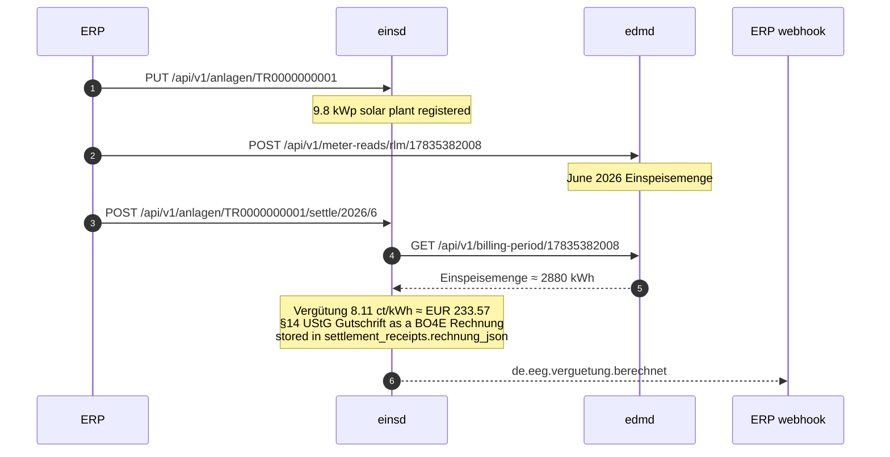

# EEG Billing Demo

End-to-end demonstration of **EEG feed-in settlement** using `einsd` (plant registry + §21 EEG 2023 calculation) and `edmd` (15-min meter data storage).

## What you're running

| Service | Port | Role |
|---|---|---|
| `postgres` | `5432` | PostgreSQL — one database per service |
| `webhook` | `8000` | Demo ERP event receiver (Python, in-memory) |
| `marktd` | `8180` | Market Data Hub — MaLo master data |
| `edmd` | `8380` | Energy Data Management — meter readings + billing periods |
| `einsd` | `9180` | EEG/KWKG settlement — plant register + monthly Vergütung |

## End-to-end flow



The settlement *amount* alone is not a legal document. Under the **Gutschriftverfahren**
(§14 Abs. 2 Satz 2 UStG) the Netzbetreiber issues the Gutschrift to the plant operator, so
`einsd` renders it as a BO4E `Rechnung` and carries the document facts on the CloudEvent for
`accountingd` to book against.

The Gutschrift VAT follows the operator's **declared `ust_status`** — masterdata, not a
function of plant size. This fixture sets `"ust_status": "KLEINUNTERNEHMER"` (§19 UStG), the
typical case for a 9.8 kWp rooftop plant, so the Gutschrift carries **0 % USt** (net = brutto).
An operator on `REGELBESTEUERUNG` would instead see the full 19 % USt breakdown.

## Settlement logic

The demo plant:

| Field | Value |
|---|---|
| ErzeugungsArt | `SOLAR_AUFDACH` (roof-mounted PV) |
| EEG law | EEG 2023 |
| Settlement model | `FEED_IN_TARIFF` (§21 Einspeisevergütung) |
| Installed capacity | 9.8 kWp |
| Feed-in tariff | **8.11 ct/kWh** (Solarpaket I, ≤10 kWp Überschusseinspeisung) |
| Commissioning | 2024-03-15 |
| Förderendedatum | 2044-03-31 (20 years) |

June 2026 result: ~2880 kWh × 8.11 ct = **~EUR 233.57**.

## Build images

```bash
cd ../..  # workspace root

docker build --target marktd-runtime  -t marktd:dev  .
docker build --target edmd-runtime    -t edmd:dev    .
docker build --target einsd-runtime   -t einsd:dev   .
```

> Not `docker buildx bake` — that file is the CI push path (`push-by-digest`),
> so it fails on the default docker driver and never loads a local `:dev` tag.

## Run the demo

```bash
cd demos/eeg-billing
docker compose up -d
docker compose ps   # wait until all containers are running
```

Then run the smoke test:

```bash
bash smoke.sh
```

Expected output:

```
✓ einsd is ready
✓ edmd is ready
✓ PUT /api/v1/malos/17835382008 → 201
✓ PUT /api/v1/anlagen/TR0000000001 → 201  (plant registered)
✓ GET /api/v1/anlagen/TR0000000001 → status=aktiv  verguetungssatz_ct=8.11 ct/kWh
✓ POST /api/v1/meter-reads/rlm/17835382008 → 200  stored=96 intervals
✓ POST /api/v1/meter-reads/rlm/17835382008 → 200  (29 daily buckets, 2784 kWh)
✓ GET /api/v1/billing-period/17835382008 → arbeitsmenge_kwh=2880.0
✓ POST /settle/2026/6 → 200
      settlement_eur=233.57  einspeisemenge_kwh=2880.0  status=calculated
✓ CloudEvent received: type=de.eeg.verguetung.berechnet
✓ GET /settlements?year=2026&month=6 → status=calculated  einspeisemenge_kwh=2880.0  settlement_eur=233.57
All EEG billing smoke tests passed.
```

## Explore the APIs

| Endpoint | Description |
|---|---|
| `http://localhost:9180/api/v1/anlagen/TR0000000001` | Plant registration details |
| `http://localhost:9180/api/v1/anlagen/TR0000000001/settlements?year=2026&month=6` | Settlement receipt |
| `http://localhost:8380/api/v1/billing-period/17835382008?from=2026-06-01&to=2026-07-01` | edmd billing period aggregate |
| `http://localhost:9180/mcp` | einsd MCP server (19 tools) |
| `http://localhost:8380/mcp` | edmd MCP server (15 tools) |
| `http://localhost:8000/events` | ERP webhook event log |

## Other settlement models

The `einsd` service supports 9 EEG/KWKG settlement schemes. To test other models, modify `fixtures/anlage.json`:

| Model | `settlement_model` | Use case |
|---|---|---|
| §21 fixed tariff | `FEED_IN_TARIFF` | Small solar, wind ≤750 kW |
| §20 Direktvermarktung | `MARKET_PREMIUM` | Plants > threshold MW |
| Mieterstromzuschlag (§21 Abs. 3 EEG 2023, rate per §48a) | `TENANT_ELECTRICITY` | Building community solar |
| Post-EEG Spot | `POST_EEG` | Plants after 20-year Förderung |
| KWK-Zuschlag | `KWK_SURCHARGE` | Combined heat & power (KWKG) |
| §50 Flexibilitätsprämie | `FLEXIBILITY_PREMIUM` | Biomass demand response |

## Supported EEG laws

`eeg_gesetz` in `fixtures/anlage.json` selects the regulatory version:
`2000 | 2004 | 2009 | 2012 | 2017 | 2021 | 2023 | 0` (0 = KWKG)

## Clean up

```bash
docker compose down      # keep database volumes
docker compose down -v   # destroy all volumes (full reset)
```
