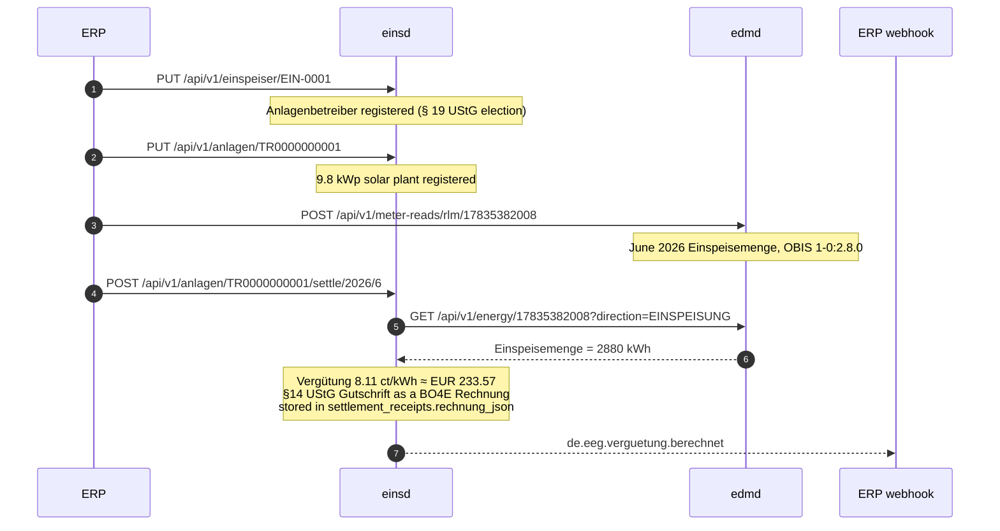

# EEG Billing Demo

End-to-end demonstration of **EEG feed-in settlement** using `einsd` (plant registry + §21 EEG 2023 calculation) and `edmd` (15-min meter data storage).

## What you're running

| Service | Port | Role |
|---|---|---|
| `postgres` | `5432` | PostgreSQL — one database per service |
| `webhook` | `8000` | Demo ERP event receiver (Python, in-memory) |
| `marktd` | `8180` | Market Data Hub — MaLo master data |
| `edmd` | `8380` | Energy Data Management — meter readings + billing periods |
| `einsd` | `9180` | EEG/KWKG settlement — plant register + monthly Vergütung |

## End-to-end flow



The settlement *amount* alone is not a legal document. Under the **Gutschriftverfahren**
(§14 Abs. 2 Satz 2 UStG) the Netzbetreiber issues the Gutschrift to the plant operator, so
`einsd` renders it as a BO4E `Rechnung` and carries the document facts on the CloudEvent for
`accountingd` to book against.

The Gutschrift VAT follows the operator's **declared `ust_status`** — masterdata, not a
function of plant size. It belongs to the person rather than to any one installation, so it
lives on the `einspeiser` record: `fixtures/einspeiser.json` sets
`"ust_status": "KLEINUNTERNEHMER"` (§19 UStG), the typical case for a 9.8 kWp rooftop plant,
so the Gutschrift carries **0 % USt** (net = brutto). An operator on `REGELBESTEUERUNG`
would instead see the full 19 % USt breakdown.

`eeg_anlagen.einspeiser_id` is `NOT NULL` behind a foreign key to that record, which is why
the operator is registered before the plant.

## Settlement logic

The demo plant:

| Field | Value |
|---|---|
| ErzeugungsArt | `SOLAR_AUFDACH` (roof-mounted PV) |
| EEG law | EEG 2023 |
| Settlement model | `VERGUETUNG` (§21 Abs. 1 Einspeisevergütung) |
| Installed capacity | 9.8 kWp |
| Vergütungsform | `UEBERSCHUSS` (§48 — the Volleinspeisung column pays the Abs. 2a uplift instead) |
| Feed-in tariff | **8.11 ct/kWh** (Solarpaket I, ≤10 kWp Überschusseinspeisung) |
| Commissioning | 2024-03-15 |
| §9 Steuerbarkeit | `LEISTUNGSBEGRENZUNG_60` (§9 Abs. 2 Nr. 3, the route open below 25 kW) |
| Einspeiser | `EIN-0001`, Kleinunternehmer (§19 UStG) |

`foerderendedatum` is derived from the Inbetriebnahme (2044-03-31, 20 years) and `status`
from the lifecycle, so neither is stated at registration.

June 2026 result: 2880 kWh × 8.11 ct = **EUR 233.57**.

The readings are pushed under **OBIS `1-0:2.8.0`** (Wirkarbeit Export). `edmd` never reads
an unlabelled reading as feed-in — an unqualified quantity is that measuring point's
consumption — so a push without the register stores intervals the settlement cannot see.

## Build images

```bash
cd ../..  # workspace root
just build-demo-eeg
```

which is the three builds this demo needs:

```bash
docker build --target marktd-runtime  -t marktd:dev  .
docker build --target edmd-runtime    -t edmd:dev    .
docker build --target einsd-runtime   -t einsd:dev   .
```

> Not `docker buildx bake` — that file is the CI push path (`push-by-digest`),
> so it fails on the default docker driver and never loads a local `:dev` tag.

`marktd:dev` is the image the NB STP demo already builds, so a machine that ran that demo
needs only `edmd` and `einsd` here. Both come out of the full `builder` stage, which
compiles **every** service in the workspace in one `cargo build` — including the
Iceberg/DataFusion and LanceDB stacks. Budget **20–45 minutes** on a cold cache; a warm
BuildKit cache brings a rebuild down to a few minutes.

## Run the demo

```bash
cd demos/eeg-billing
docker compose up -d
docker compose ps   # wait until all containers are running
```

Then run the smoke test:

```bash
bash smoke.sh
```

Expected output:

```
✓ einsd is ready
✓ edmd is ready
✓ PUT /api/v1/malos/17835382008 → 201
✓ PUT /api/v1/einspeiser/EIN-0001 → 204 (operator registered)
✓ PUT /api/v1/anlagen/TR0000000001 → 204 (plant registered)
✓ GET /api/v1/anlagen/TR0000000001 → status=aktiv  verguetungssatz_ct=8.11 ct/kWh
✓ POST /api/v1/meter-reads/rlm/17835382008 → 200  stored=96 intervals
✓ POST /api/v1/meter-reads/rlm/17835382008 → 200  (29 daily buckets, 2784 kWh)
✓ GET /api/v1/energy/17835382008?direction=EINSPEISUNG → 2880 kWh
✓ POST /settle/2026/6 → 200
      settlement_eur=233.57  einspeisemenge_kwh=2880.000  status=calculated
✓ CloudEvent received: type=de.eeg.verguetung.berechnet
✓ GET /settlements?limit=1 → status=calculated  einspeisemenge_kwh=2880.000  settlement_eur=233.57
All EEG billing smoke tests passed.
```

Each step asserts the outcome, not just the status code: the settlement must come back
`status=calculated` at EUR 233.57, and the CloudEvent must reach the webhook. A run that
stored no feed-in fails at the `/energy` check rather than reporting a green EUR 0.

## Explore the APIs

| Endpoint | Description |
|---|---|
| `http://localhost:9180/api/v1/anlagen/TR0000000001` | Plant registration details |
| `http://localhost:9180/api/v1/anlagen/TR0000000001/settlements?limit=1` | Most recent settlement receipt |
| `http://localhost:9180/api/v1/einspeiser/EIN-0001` | Operator record — § 19 UStG election, payout account |
| `http://localhost:8380/api/v1/energy/17835382008?direction=EINSPEISUNG&from=2026-06-01T00:00:00%2B02:00&to=2026-07-01T00:00:00%2B02:00` | The projected Einspeisung series the settlement reads |
| `http://localhost:9180/mcp` | einsd MCP server (19 tools) |
| `http://localhost:8380/mcp` | edmd MCP server (15 tools) |
| `http://localhost:8000/events` | ERP webhook event log |

## Other settlement models

`settlement_model` in `fixtures/anlage.json` takes one of twelve tokens. There is one
spelling per model — a value outside the list is refused at registration rather than
settled under a guessed interpretation:

| `settlement_model` | Model | Also needs |
|---|---|---|
| `VERGUETUNG` | §21 Abs. 1 Einspeisevergütung | — |
| `AUSFALLVERGUETUNG` | §21 Abs. 1 Satz 1 Nr. 3 Ausfallvergütung (§53 Abs. 3: −20 %) | — |
| `DIREKTVERMARKTUNG` | §20 gleitende Marktprämie | `direktverm_aw_ct` |
| `AUSSCHREIBUNG` | §22 wettbewerblich ermittelte Marktprämie | `zuschlagswert_ct` (or `direktverm_aw_ct`) + `ausschreibungs_zuschlag_id` |
| `SONSTIGE_DIREKTVERMARKTUNG` | §21a Direktvermarktung ohne EEG-Zahlung | — |
| `MIETERSTROM` | §21 Abs. 3 Mieterstromzuschlag | `mieter_zuschlag_ct` |
| `GGV` | §42b EnWG gemeinschaftliche Gebäudeversorgung | — |
| `EIGENVERBRAUCH` | Keine Netzeinspeisung, keine Zahlung | — |
| `POST_EEG_SPOT` | Nach Förderende: Marktwert | — |
| `KWKG_ZUSCHLAG` | §7 KWKG 2023 KWK-Zuschlag | `erzeugungsart: "KWKG"`, `eeg_gesetz: 0`, `verguetungsform: "KWK_ZUSCHLAG"`, `kwk_foerderdauer_h` or `kwk_anlagenart` |
| `FLEXIBILITAET` | §50b Flexibilitätsprämie (Bestandsanlagen) | `flex_praemie_ct_kwh` |
| `FLEXIBILITAET_ZUSCHLAG` | §50a Flexibilitätszuschlag (Neuanlagen) | — |

## Supported EEG laws

`eeg_gesetz` in `fixtures/anlage.json` selects the regulatory version:
`2000 | 2004 | 2009 | 2012 | 2017 | 2021 | 2023 | 0` (0 = KWKG)

## Clean up

```bash
docker compose down      # keep database volumes
docker compose down -v   # destroy all volumes (full reset)
```
