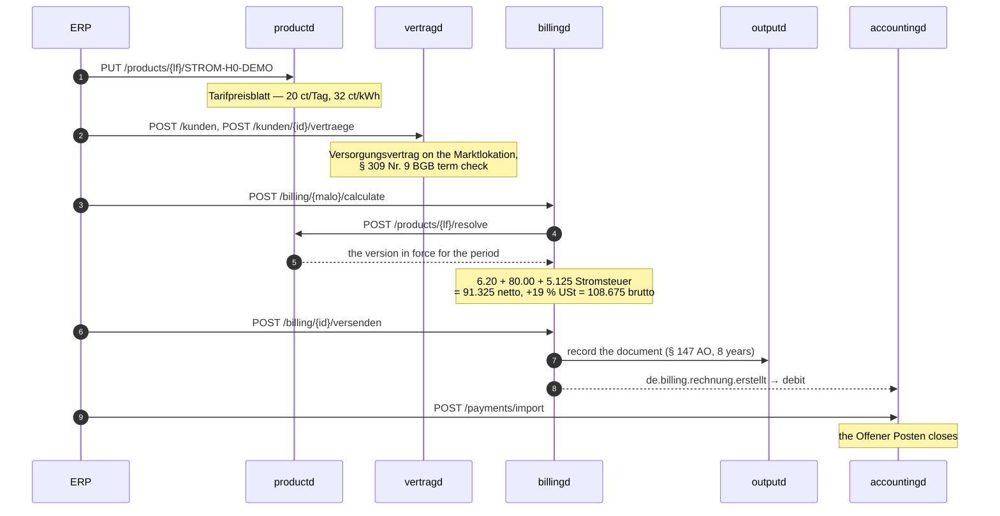

# Order-to-cash demo

The retail money path, end to end. One customer, one Marktlokation, one billing
period: what the supplier sells, who bought it, what they owe, the document that
says so, and the receivable behind it — through to the payment that closes it.

No EDIFACT here. `demos/nb-stp` is where a market message goes out; this is what
happens on the supplier's own books once supply is running.

## What runs in this demo

| Service | Port | Purpose |
|---|---|---|
| `postgres` | `5432` | PostgreSQL — one database per service |
| `webhook` | `:8001` | In-memory ERP event receiver (Python) — 8001 on the host so this stack runs beside `demos/nb-stp` |
| `productd` | `:9080` | Product and tariff catalogue — the only price source |
| `vertragd` | `:9780` | Kunden, Verträge, Kündigungsfristen |
| `billingd` | `:9280` | Multi-product billing engine (EN 16931) |
| `outputd` | `:9880` | Document store and delivery |
| `accountingd` | `:9380` | Massenkontokorrent — the double-entry ledger |

## End-to-end flow



## What the invoice comes to, and why

The smoke test computes the expected amount itself, so the assertion does not
depend on the service that produces it:

| | |
|---|---|
| Grundpreis | `20 ct/Tag × 31 Tage` = **6.20 EUR** |
| Arbeitspreis | `32 ct/kWh × 250 kWh` = **80.00 EUR** |
| Stromsteuer | `2.05 ct/kWh × 250 kWh` = **5.125 EUR** (§ 3 StromStG) |
| Netto | **91.325 EUR** |
| USt 19 % | `17.35175` → **17.35 EUR** (kaufmännisch) |
| Brutto | **108.675 EUR** |
| Forderung | **108.68 EUR** — the ledger holds integer cents, because that is what can be owed and paid |

The Stromsteuer is not a caller override: § 3 StromStG fixes it and `billingd`
applies it to every Strom supply whatever the `grid` block says. A demo that
expected `86.20` would be asserting that mako forgets a tax.

The receivable in `accountingd` must be that figure to the cent. A run that
priced from the wrong tariff version, or rounded the tax the other way, fails
at the assertion rather than reporting a green invoice for a different amount.

## How the payment finds its customer

`accountingd` resolves an incoming payment down a ladder: the counterparty IBAN
(a keyed hash) first, then the `EndToEndId` of a collection it answers, then an
**exact identifier** in the Verwendungszweck — a Marktlokations-ID or a
Mandatsreferenz, matched whole and never as a substring.

The demo lands on the third rung: the account is opened by the billing event,
which carries no bank details, so `accountingd` has never seen this customer's
IBAN. The smoke test asserts `matched_by == "remittance_token"` — the case an
IBAN-only matcher loses.

The bank statement is dated **today**, not inside the billing period: the
Kontokorrent opens in the ledger when the invoice first posts to it, and
`doubleentry` refuses a posting to an account that was not open on the booking
date.

## Prerequisites

| Tool | Purpose |
|---|---|
| Docker 24+ (with Compose v2) | Run the stack |
| `curl`, `jq`, `python3` | The smoke test |

## Build images

```bash
# from the workspace root
just build-demo-o2c
```

which is the five builds this demo needs:

```bash
docker build --target productd-runtime    -t productd:dev    .
docker build --target vertragd-runtime    -t vertragd:dev    .
docker build --target billingd-runtime    -t billingd:dev    .
docker build --target outputd-runtime     -t outputd:dev     .
docker build --target accountingd-runtime -t accountingd:dev .
```

> Not `docker buildx bake` — that file is the CI push path (`push-by-digest`),
> so it fails on the default docker driver and never loads a local `:dev` tag.

All five come out of the full `builder` stage, which compiles **every** service
in the workspace in one `cargo build`. Budget **20–45 minutes** on a cold cache;
a warm BuildKit cache brings a rebuild down to a few minutes.

## Run

```bash
cd demos/o2c
docker compose up -d
docker compose ps   # wait until all containers are Up
bash smoke.sh
```

Expected output:

```
✓ productd is ready
✓ vertragd is ready
✓ billingd is ready
✓ outputd is ready
✓ accountingd is ready

▶ [1] productd — the Tarifpreisblatt
✓ PUT /api/v1/products/<lf>/STROM-H0-DEMO → 201
✓ GET the product back → 200  (the catalogue is the only price source)

▶ [2] vertragd — Kunde and Versorgungsvertrag
✓ POST /api/v1/kunden → 201
✓ POST /api/v1/kunden/<id>/vertraege → 201
✓ GET /api/v1/vertraege/<id> → status ANGELEGT

▶ [3] billingd — POST calculate for 2026-01-01..2026-01-31
✓ POST /api/v1/billing/<malo>/calculate → 201
✓ netto = 91.32500 EUR  (Grundpreis 6.20 + Arbeitspreis 80.00 + Stromsteuer 5.125)
✓ brutto = 108.67500 EUR  (19 % USt, kaufmännisch gerundet)
✓ GET /api/v1/templates/reference/INVOICE → 200
✓ POST /api/v1/templates → 201  (proof=RENDERED_PDFA)
✓ PUT /api/v1/templates/INVOICE/current → 204

▶ [4] billingd → outputd — POST versenden
✓ POST /api/v1/billing/<id>/versenden → 202
✓ GET /api/v1/documents?malo_id=… → 1 × INVOICE, 40782 bytes of application/pdf
✓ GET /api/v1/documents/<id>/content → byte-identical to the record

▶ [5] accountingd — the invoice is a receivable
✓ GET /api/v1/offene-posten → 108.68 EUR open  (10868 ct, the invoice to the cent)

▶ [6] accountingd — import the payment
✓ POST /api/v1/payments/import → 200  (accepted=1)
✓ GET /api/v1/offene-posten → 0 open for <malo>  (the receivable is settled)

▶ [7] what the ERP receiver saw
✓ ERP events: de.accounting.payment.imported, de.billing.rechnung.erstellt, de.tarif.product.updated
✓ de.accounting.payment.imported → 108.68 EUR, matched_by=remittance_token

All order-to-cash smoke tests passed.
```

## What is deliberately not here

| | |
|---|---|
| **edmd** | The metered quantity's production source. The smoke test supplies the reading through billingd's documented `meter` override, which is what makes the invoice reproducible to the cent. `demos/eeg-billing` is where a reading actually comes out of edmd. |
| **marktd** | Where `billingd` resolves the Marktlokation's Netzbetreiber when the caller does not name one. The smoke test names it, so no lookup happens. `demos/nb-stp` is where marktd is exercised. |
| **processd / makod** | `vertragd` dispatches `start-supply` per Vertragskomponente. Neither runs here, so those tasks stay queued and visible in `GET /api/v1/outbound/dead` rather than silently succeeding, and the contract stays `ANGELEGT`: supply starts when the **NB** confirms the Lieferbeginn, not when the supplier files the contract. `demos/nb-stp` is where that confirmation happens. |

All three are configured with hostnames that **do not resolve** (`…​.not-run.invalid`)
rather than omitted: an override that is ever dropped fails loudly at the call
instead of quietly billing zero.

## Service URLs

| Service | URL | Purpose |
|---|---|---|
| productd | http://localhost:9080/api/v1/products/9912345000005 | The tariff catalogue |
| productd § 41c feed | http://localhost:9080/api/v1/comparison-feed | The public comparison feed |
| vertragd | http://localhost:9780/api/v1/vertraege | Open contracts |
| billingd | http://localhost:9280/api/v1/billing | Issued invoices |
| billingd review queue | http://localhost:9280/api/v1/billing/review-queue | Invoices the risk gate held |
| outputd | http://localhost:9880/api/v1/documents | The document store |
| outputd spool | http://localhost:9880/api/v1/spool | Queued deliveries |
| accountingd | http://localhost:9380/api/v1/offene-posten | Open items |
| accountingd aging | http://localhost:9380/api/v1/aging | Receivables by age |
| accountingd trial balance | http://localhost:9380/api/v1/trial-balance | The ledger's Summen- und Saldenliste |
| ERP webhook | http://localhost:8001/events | Delivered CloudEvents |

## Demo configuration

The demo runs as a **Lieferant** with Marktpartner-ID `9912345000005`. That code
satisfies **neither** published check-digit procedure on purpose: publication in
the BDEW code database is what makes an MP-ID usable (Identifikatoren V1.2
§2.1), so a check-digit-valid one names a real company, and a public demo must
not carry one.

Authentication is **disabled** in every service — these are the endpoints that
set prices, create contracts and move money. Do not deploy this configuration.
See the [production guide](https://hupe1980.github.io/mako/docs/guide/getting-started/)
for OIDC setup.

## Stop and clean up

```bash
docker compose down       # keep the PostgreSQL volume
docker compose down -v    # wipe all data (full reset)
```

The MaLo-ID is generated per run, so the demo can be re-run without a reset.
