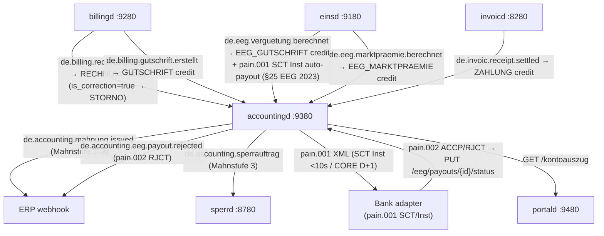
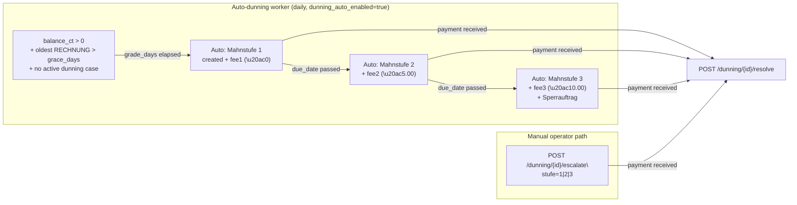
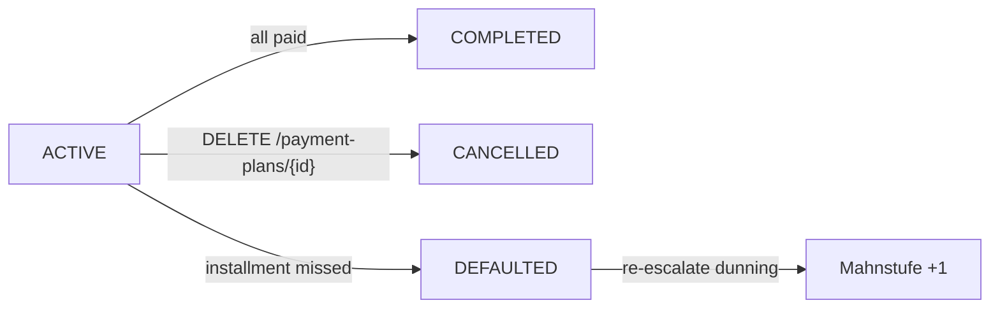
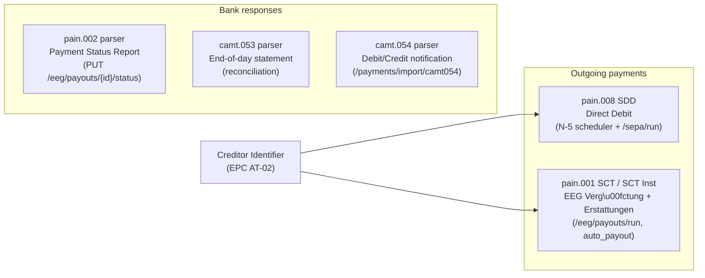
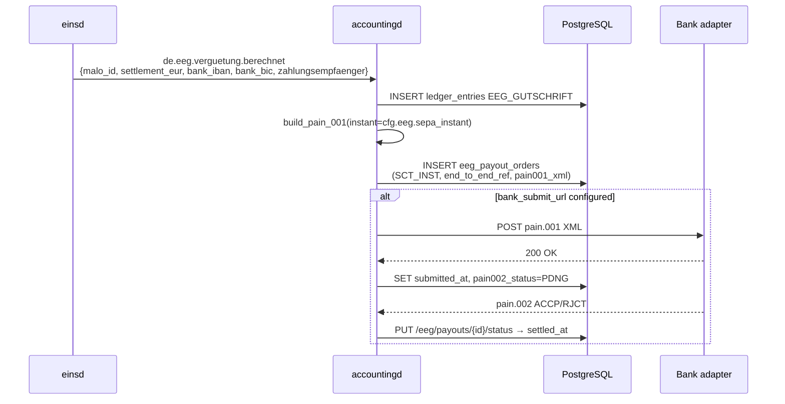

# `accountingd` — Massenkontokorrent / Customer Account Ledger

`accountingd` provides the **FI-CA equivalent** for the mako retail billing stack.
Without it, `billingd` invoices are fire-and-forget — no Offene-Posten tracking,
no automated dunning, no SEPA collection.

Port: **`:9380`**

---

## Why a dedicated ledger?

SAP IS-U calls this module **FI-CA** (Financial Contract Accounting). powercloud and
Wilken ENER:GY both include it natively. `accountingd` provides the same capabilities
as a standalone microservice with CloudEvents integration.

**The ledger is event-driven and idempotent.** CloudEvents from `billingd`, `einsd`,
and `invoicd` drive entries atomically — re-delivering the same CloudEvent produces
no duplicate entry (idempotency via `processed_events` table + DB lock).

---

## Event flow



---

## Ledger entry types

| `entry_type` | Sign | Trigger |
|---|---|---|
| `RECHNUNG` | +debit | `de.billing.rechnung.erstellt` (`is_correction=false`) |
| `STORNO` | ±signed | `de.billing.rechnung.erstellt` (`is_correction=true`) — billing reversal |
| `ZAHLUNG` | -credit | CAMT.054 import or `de.invoic.receipt.settled` |
| `GUTSCHRIFT` | -credit | `de.billing.gutschrift.erstellt` — credit note |
| `EEG_GUTSCHRIFT` | -credit | `de.eeg.verguetung.berechnet` — §21 EEG Einspeisevergütung |
| `EEG_MARKTPRAEMIE` | -credit | `de.eeg.marktpraemie.berechnet` — §20 EEG Direktvermarktung |
| `BANKRUECKLAST` | +debit | Returned SEPA direct debit |
| `MAHNGEBUEHR` | +debit | Dunning fee per Mahnstufe (configurable) |
| `ABSCHLAG` | −credit | Monthly advance payment — reduces the balance (Abschlagslauf scheduler) |
| `JAHRESABSCHLUSS` | ±signed | Annual Mehr-/Mindermengenabrechnung (§40 EnWG) |
| `KORREKTUR` | ±signed | Manual operator correction via `POST /buchen` |

**Balance** = `SUM(amount_ct)` — negative = credit balance (customer overpaid); positive = outstanding debt.

**No f64 money.** All amounts use `i64` cents (1 ct = 0.01 EUR). The pain.008 XML
generator uses integer arithmetic — no floating-point rounding errors.

---

## Mahnwesen (dunning) lifecycle

The dunning engine operates in two modes: **automatic** (background worker) and **manual** (operator-triggered).



**Automatic escalation** (P1-5 fix): set `dunning_auto_enabled = true` in config.
The worker runs daily, is idempotent (`auto_dunning_runs` UNIQUE guard), and emits
`de.accounting.sperrauftrag.batch` when Mahnstufe 3 cases are created.

**Manual escalation**: `POST /api/v1/dunning/{account_id}/escalate` remains available
for operator override (e.g. grace extensions, special B2B arrangements).

---

## Endpoints

| Method | Path | Description |
|--------|------|-------------|
| `POST` | `/webhook` | Ingest CloudEvents (billingd, einsd, invoicd) — HMAC-verified |
| `GET/PUT` | `/api/v1/accounts/{malo_id}` | Account CRUD (IBAN, Abschlag, billing_day) — OIDC required for PUT |
| `GET` | `/api/v1/accounts/{malo_id}/balance` | Current balance in ct; status: overdue/credit/settled |
| `GET` | `/api/v1/accounts/{malo_id}/ledger` | Paged ledger entries |
| `GET` | `/api/v1/accounts/{malo_id}/kontoauszug` | Account statement (portald-consumable) |
| `GET` | `/api/v1/accounts/{malo_id}/open-items` | **FIFO open-item list** — individual unpaid/partial invoices |
| `PUT` | `/api/v1/accounts/{malo_id}/abschlag` | Update monthly advance payment |
| `GET/PUT` | `/api/v1/accounts/{malo_id}/vorauszahlung` | Typed `rubo4e::current::Vorauszahlung` (§40 EnWG) |
| `GET/PUT` | `/api/v1/accounts/{malo_id}/zahlungsinformation` | Typed `rubo4e::current::Zahlungsinformation` |
| `POST` | `/api/v1/accounts/{malo_id}/buchen` | **Manual booking** (operator-authorised ledger entry) |
| `POST` | `/api/v1/accounts/{malo_id}/reconcile` | **Balance reconciliation** — detect/repair `balance_ct` cache drift |
| `POST` | `/api/v1/accounts/{malo_id}/anonymize` | **GDPR Art. 17** pseudonymization (preserves ledger) — OIDC required |
| `GET/POST` | `/api/v1/accounts/{malo_id}/interest-charges` | Verzugszinsen §288 BGB — list/book default interest |
| `GET/POST` | `/api/v1/accounts/{malo_id}/payment-plans` | Zahlungsvereinbarung — list/create payment plans |
| `GET` | `/api/v1/aging` | **Aging analysis** — receivables by 0–30d / 31–60d / 61–90d / >90d buckets |
| `POST` | `/api/v1/payments/import` | Ingest CAMT.054 bank statement (JSON array, deduplicated by `bank_transaction_id`) |
| `GET` | `/api/v1/offene-posten` | Overdue accounts |
| `GET` | `/api/v1/dunning` | Open dunning cases |
| `POST` | `/api/v1/dunning/{account_id}/escalate` | Manual Mahnstufe escalation |
| `POST` | `/api/v1/dunning/{id}/resolve` | Mark dunning case resolved |
| `GET` | `/api/v1/payment-plans/{id}` | Get payment plan with full installment schedule |
| `DELETE` | `/api/v1/payment-plans/{id}` | Cancel payment plan (CANCELLED status) |
| `POST` | `/api/v1/sepa/mandates` | Register SEPA mandate (IBAN validated via mod-97) — OIDC required |
| `GET` | `/api/v1/sepa/mandates/{id}` | Fetch mandate |
| `DELETE` | `/api/v1/sepa/mandates/{id}` | **Revoke mandate** (§58 ZAG) |
| `POST` | `/api/v1/sepa/run` | Generate one pain.008 message (one `PmtInf` group per SequenceType, mandatory Gläubiger-ID) |
| `POST` | `/api/v1/payments/import/camt054` | Ingest a camt.054 XML notification (batch-booked entries expanded per `TxDtls`; returns → `BANKRUECKLAST`) |
| `GET` | `/api/v1/eeg/payouts` | List EEG payout orders (`?status=PDNG\|ACCP\|RJCT\|CANC`) |
| `GET` | `/api/v1/eeg/payouts/{id}` | Single EEG payout with `pain001_xml` for audit |
| `POST` | `/api/v1/eeg/payouts/run` | **Batch-generate** pain.001 for all unbatched `EEG_GUTSCHRIFT` entries |
| `PUT` | `/api/v1/eeg/payouts/{id}/status` | Process pain.002 `ACCP`/`RJCT`/`CANC` |
| `POST` | `/api/v1/jahresabschluss/{malo_id}` | **Annual settlement** (§40 EnWG, idempotent per year; refund on Erstattung) |
| `PUT` | `/api/v1/accounts/{malo_id}/business-partner` | Link account to a `kunden_nr` |
| `GET` | `/api/v1/business-partners/{kunden_nr}/accounts` | All accounts of a business partner |
| `GET` | `/api/v1/business-partners/{kunden_nr}/balance` | Consolidated balance |
| `GET` | `/metrics` | Prometheus financial + operational gauges |
| `GET` | `/health` · `/health/ready` | Liveness / readiness |

---

## Manual booking (`POST /api/v1/accounts/{malo_id}/buchen`)

For operator-authorised bookings not driven by CloudEvents:

```bash
curl -X POST "http://accountingd:9380/api/v1/accounts/51238696780/buchen" \
  -H "Content-Type: application/json" \
  -d '{
    "entry_type":   "ZAHLUNG",
    "amount_ct":    -5000,
    "reference_id": "BANK-TXN-2026-07-10",
    "description":  "Überweisung Kunde (ausserhalb SEPA)"
  }'
```

Allowed `entry_type` values: `RECHNUNG`, `ZAHLUNG`, `GUTSCHRIFT`, `EEG_GUTSCHRIFT`,
`EEG_MARKTPRAEMIE`, `BANKRUECKLAST`, `MAHNGEBUEHR`, `ABSCHLAG`, `JAHRESABSCHLUSS`, `KORREKTUR`, `STORNO`.

`amount_ct`: positive = debit (increases outstanding debt); negative = credit (reduces debt).

---

## Jahresabschluss (§40 Abs. 1 EnWG)

The annual settlement compares actual billed amounts against advance payments collected:

```bash
# Preview (dry_run=true)
curl "http://accountingd:9380/api/v1/jahresabschluss/51238696780?year=2025&dry_run=true"

# Commit
curl -X POST "http://accountingd:9380/api/v1/jahresabschluss/51238696780?year=2025"
```

Response:
```json
{
  "malo_id":                  "51238696780",
  "year":                     2025,
  "rechnung_sum_ct":          120000,
  "abschlag_paid_ct":         -108000,
  "settlement_ct":            12000,
  "settlement_eur":           "120.00",
  "new_monthly_abschlag_ct":  10000,
  "action":                   "NACHZAHLUNG",
  "committed":                true,
  "ce_id":                    "3fa85f64-..."
}
```

### Model

ABSCHLAG entries are advance-payment **credits** (negative) and the annual
Jahresrechnung is booked as a **full-cost debit** (`gesamtbrutto`), so the
running balance already equals the settlement:

```
settlement_ct = rechnung_sum + abschlag_sum   (abschlag_sum is negative)
              = 1300.00 − 1200.00 = 100.00     → Nachzahlung
```

- **Nachzahlung** (settlement > 0): **no** settlement entry is written — the
  balance *is* the open receivable, collected by the SEPA/dunning path.
- **Erstattung** (settlement < 0): a clearing debit zeroes the credit balance
  and a **pain.001** refund is generated to the customer's IBAN (returned in
  the response and dispatched as `de.accounting.erstattung.faellig`). Without a
  stored IBAN the credit is carried forward and offset against the next
  Rechnung.

The run is idempotent per `(tenant, malo_id, year)` via `jahresabschluss_runs`
and recalibrates the monthly `abschlag_ct` to `actual_annual ÷ 12`.
The annual sum includes `RECHNUNG` + `STORNO` + `MAHNGEBUEHR`.

---

## Business partner aggregation (FI-CA contract account)

One customer (`vertragd.kunden.kunden_nr`) may hold several market-location
accounts. Linking them enables cross-MaLo balance and dunning:

```bash
# Link an account to its business partner
curl -X PUT ".../api/v1/accounts/51238696780/business-partner" \
  -H 'Content-Type: application/json' -d '{"kunden_nr":"K-100234"}'

# Consolidated view
curl ".../api/v1/business-partners/K-100234/accounts"
curl ".../api/v1/business-partners/K-100234/balance"
```

## Sperrung handoff (§19 Abs. 2 StromGVV)

When the auto-dunning worker escalates a case to Mahnstufe 3 and the undisputed
arrears reach `sperrung_threshold_ct` (default 100 EUR), accountingd posts a
Sperrauftrag to `sperrd` (`POST /api/v1/sperr-orders`, `order_type: "sperrung"`).
The handoff is idempotent (`dunning_cases.sperrauftrag_ce_id`); `sperrd` owns the
4-week-notice / 8-Werktage-announcement scheduling.

## Metrics

`GET /metrics` exposes Prometheus gauges queried live on scrape:
`accountingd_open_receivables_ct`, `accountingd_credit_balances_ct`,
`accountingd_dunning_open{stufe}`, `accountingd_sepa_runs_pending`,
`accountingd_sperrung_pending`, `accountingd_accounts_total`.

## Vorauszahlung (§40 Abs. 1 EnWG)

```bash
curl -X PUT "http://accountingd:9380/api/v1/accounts/51238696780/vorauszahlung" \
  -H "Content-Type: application/json" \
  -d '{
    "_typ": "VORAUSZAHLUNG",
    "betrag": { "_typ": "BETRAG", "wert": "75.00", "waehrung": "EUR" },
    "gueltigkeit": { "_typ": "ZEITRAUM", "startdatum": "2026-08-01" }
  }'
```

Syncs `abschlag_ct = 7500` atomically. GET returns the stored BO4E object or synthesises
from `abschlag_ct` when no typed value has been stored.

---

## IBAN validation

Every SEPA mandate PUT validates the IBAN using **ISO 13616 mod-97** via the
[`sepa`](https://crates.io/crates/sepa) crate (`sepa::validate_iban`).
Covered by **21 tests** in `unit_tests.rs` (DE, GB, NL, AT, CH, checksum failures, length, lowercase).

---

## Open-item management (FIFO clearing)

`GET /api/v1/accounts/{malo_id}/open-items` returns individual unpaid or partially-paid
invoice debits using **FIFO clearing** against available credits:

```json
{
  "malo_id": "51238696780",
  "balance_ct": 15000,
  "open_item_count": 2,
  "open_items": [
    { "entry_type": "RECHNUNG", "amount_ct": 8000, "outstanding_ct": 0,
      "reference_id": "R2026-05", "booking_date": "2026-05-15" },
    { "entry_type": "RECHNUNG", "amount_ct": 12000, "outstanding_ct": 15000,
      "reference_id": "R2026-06", "booking_date": "2026-06-15" }
  ]
}
```

The oldest debits are cleared first. This matches SAP FI-CA “oldest-first” default and
§252 HGB Abs. 1 Nr. 4 (Vorsichtsprinzip — individual receivables must be tracked separately).

`balance_ct` remains the authoritative balance; open-items add invoice-level transparency.

---

## Balance integrity (`POST /reconcile`)

`balance_ct` is a cached sum updated atomically with every ledger write (`SELECT FOR UPDATE`).
A crash between the INSERT and the UPDATE could leave it inconsistent:

```bash
# Check only
curl -X POST "http://accountingd:9380/api/v1/accounts/51238696780/reconcile"

# Detect + repair
curl -X POST "http://accountingd:9380/api/v1/accounts/51238696780/reconcile?repair=true"
```

Response:
```json
{
  "is_consistent": true,
  "cached_balance_ct": 5000,
  "recomputed_balance_ct": 5000,
  "drift_ct": 0
}
```

When `drift_ct != 0`, the `repair=true` flag atomically resets `balance_ct` to `SUM(amount_ct)`.
Schedule this as a weekly health check in your monitoring pipeline.

---

## GDPR Art. 17 — Pseudonymization

```bash
curl -X POST "http://accountingd:9380/api/v1/accounts/51238696780/anonymize" \
  -H "Content-Type: application/json" \
  -d '{ "requested_by": "operator-1", "legal_basis": "GDPR Art. 17 - customer request #42" }'
```

**What is anonymized**: `accounts.iban` → `ANONYMIZED`, `mandatsref`/`zahlungsinformation`/`vorauszahlung` → `NULL`; `sepa_mandates.iban` → `ANONYMIZED`, `kontoinhaber` → `ANONYMIZED`, `bic` → `NULL`.

**What is preserved**: All `ledger_entries` (amounts, dates, types, references) — exempt from
GDPR Art. 17 under Art. 17(3)(b) and §238 HGB / §147 AO retention requirements (10 years).

**Audit trail**: An immutable record is written to `anonymization_log` (GDPR Art. 5(2)).

The operation is idempotent — returns `409 Conflict` if already anonymized.

---

## CAMT.054 payment import

```bash
curl -X POST "http://accountingd:9380/api/v1/payments/import" \
  -H "Content-Type: application/json" \
  -d '[{ "iban": "DE89 3704 0044 0532 0130 00", "amount_eur": "155.42",
          "reference": "Rechnung R2026-06-001", "date": "2026-07-10",
          "bank_transaction_id": "NTRY-REF-20260710-001" }]'
```

Response: `{ "accepted": 1, "deduplicated": 0, "skipped": 0, "total": 1 }`

### CAMT.054 deduplication

Every import entry is checked against `bank_import_log` before a ledger entry is created.
The deduplication key is `bank_transaction_id` (from CAMT.054 `<NtryRef>` or `<EndToEndId>`).
When that field is absent, a deterministic hash of `(iban|amount|date|reference)` is used.

Re-importing the same bank file (operator error, ERP retry) is safe — duplicates are
counted as `deduplicated`, not `accepted`. Cross-tenant isolation: `bank_import_log` is
scoped by `tenant`.

### IBAN lookup (encrypted-IBAN compatible)

CAMT.054 matching uses `iban_hash` (SHA-256 of normalised IBAN, stored as a generated column in PostgreSQL via `pgcrypto`).
This lookup works correctly even when `iban_encrypted = true` — the hash is computed at write time and persisted alongside the encrypted value.

Amount parsing uses `sepa::ct_from_eur_str` — integer arithmetic only, **no f64**.

---

## Aging analysis

```bash
curl "http://accountingd:9380/api/v1/aging"
```

Response:
```json
{
  "tenant": "9910000000002",
  "total_overdue_ct": 120000,
  "total_overdue_eur": "1200.00",
  "total_overdue_accounts": 12,
  "buckets": [
    { "bucket": "0-30d",  "account_count": 5, "total_ct": 40000, "total_eur": "400.00" },
    { "bucket": "31-60d", "account_count": 4, "total_ct": 50000, "total_eur": "500.00" },
    { "bucket": "61-90d", "account_count": 2, "total_ct": 20000, "total_eur": "200.00" },
    { "bucket": ">90d",   "account_count": 1, "total_ct": 10000, "total_eur": "100.00" }
  ]
}
```

The age is computed from the oldest unresolved `dunning_cases.issued_at`, falling back
to `accounts.updated_at`. Use this report for receivables management, provisioning,
and §252 HGB Abs. 1 Nr. 4 Vorsichtsprinzip assessments.

---

## Verzugszinsen §288 BGB (default interest)

When a customer invoice remains unpaid past its due date, the creditor is entitled to
statutory default interest per §288 BGB. `accountingd` calculates and books interest
as a `MAHNGEBUEHR` ledger entry:

```bash
curl -X POST "http://accountingd:9380/api/v1/accounts/51238696780/interest-charges" \
  -H "Authorization: Bearer $TOKEN" \
  -H "Content-Type: application/json" \
  -d '{
    "invoice_reference": "R2026-05-001",
    "principal_ct":      50000,
    "is_b2b":            false,
    "period_from":       "2026-06-15",
    "period_to":         "2026-07-15"
  }'
```

| Rate type | Formula | Legal basis |
|---|---|---|
| B2C | ECB Basiszinssatz + **5 pp** | §288 Abs. 1 BGB |
| B2B | ECB Basiszinssatz + **9 pp** | §288 Abs. 2 BGB |

The current ECB Basiszinssatz is read from the `ecb_base_rates` table, which is
pre-seeded and updated twice per year (1 January + 1 July) per §247 BGB.

Formula: `interest_ct = principal_ct × rate × days / 36500` (no float arithmetic).

```bash
# List interest charges for an account
curl "http://accountingd:9380/api/v1/accounts/51238696780/interest-charges"
```

---

## Payment plans (Zahlungsvereinbarung)

A structured payment plan (`Zahlungsvereinbarung`) allows a customer in financial
difficulty to pay an overdue balance in instalments, suppressing automatic Sperrung
escalation at Mahnstufe 3 while the plan is `ACTIVE`.

```bash
# Create a 3-month plan: 300 EUR split into 3 × 100 EUR
curl -X POST "http://accountingd:9380/api/v1/accounts/51238696780/payment-plans" \
  -H "Authorization: Bearer $TOKEN" \
  -H "Content-Type: application/json" \
  -d '{
    "total_ct":        30000,
    "installment_ct":  10000,
    "billing_day":     1,
    "first_due_date":  "2026-08-01",
    "dunning_case_id": "a1b2-...",
    "note":            "Customer agreed to payment plan #42"
  }'
```

The response includes a `plan_id` and auto-generated installment schedule:

```json
{
  "plan": { "plan_id": "...", "status": "ACTIVE", "installment_count": 3 },
  "installments": [
    { "installment_no": 1, "due_date": "2026-08-01", "amount_ct": 10000, "status": "PENDING" },
    { "installment_no": 2, "due_date": "2026-09-01", "amount_ct": 10000, "status": "PENDING" },
    { "installment_no": 3, "due_date": "2026-10-01", "amount_ct": 10000, "status": "PENDING" }
  ]
}
```

Plan lifecycle:



---

## Double-entry accounting (SKR 03/04)

`accountingd` maintains a **double-entry journal shadow** alongside the primary
single-entry ledger. Every `ledger_entry` produces two balanced `journal_lines`
rows (Soll/Haben), following the German chart of accounts SKR 03/04.

| `entry_type` | Soll (Debit) | Haben (Credit) |
|---|---|---|
| `RECHNUNG`, `ABSCHLAG` | 1400 Forderungen aus L+L | 4000 Energieerlöse |
| `ZAHLUNG` | 1200 Bankguthaben | 1400 Forderungen aus L+L |
| `GUTSCHRIFT` | 4000 Energieerlöse | 1400 Forderungen aus L+L |
| `BANKRUECKLAST` | 1400 Forderungen aus L+L | 1200 Bankguthaben |
| `MAHNGEBUEHR` | 1400 Forderungen aus L+L | 4003 Mahngebühren / Verzugszinsen |
| `EEG_GUTSCHRIFT`, `EEG_MARKTPRAEMIE` | 3000 Verbindlichkeiten EEG | 4001 EEG Einspeisevergütung |
| `STORNO` (reversal) | 4000 Energieerlöse | 1400 Forderungen aus L+L |

The invariant `SUM(D) = SUM(C)` per `ledger_entry_id` is enforced by `insert_journal_lines()`.
This table supports HGB §238 Buchführungspflicht and enables export to DATEV, SAP FI, or
any other double-entry general ledger via `GET /api/v1/accounts/{malo_id}/ledger` + journal join.

---

## SEPA payments

`accountingd` uses the [`sepa`](https://crates.io/crates/sepa) crate (0.4) —
schema defaults are the current SEPA releases (`pain.008.001.08`,
`pain.001.001.09`), names are transliterated into the SEPA character set, and
every message is validated before serialisation (`build()` returns `Err`
instead of emitting a bank-rejectable file):



### pain.008 Direct Debit

```bash
curl -X POST "http://accountingd:9380/api/v1/sepa/run" > batches.json
```

Returns **one pain.008 message** containing one `PmtInf` group per
`SequenceType` present (FRST, RCUR, FNAL, OOFF — in that order, with
`PmtInfId = <MsgId>-<SEQ>`). The EPC SDD Core Rulebook §3.8 requires FRST and
RCUR in separate payment-information blocks; they live in separate groups of
the same file, so a collection run is a single bank submission and a single
`sepa_collection_runs` audit row.

Response shape:
```json
{
  "collection_date": "2026-07-25",
  "entry_count": 43,
  "total_ct": 320000,
  "groups": [
    { "sequence_type": "FRST", "entry_count": 1,  "total_ct": 5000 },
    { "sequence_type": "RCUR", "entry_count": 42, "total_ct": 315000 }
  ],
  "xml": "<?xml version=\"1.0\"?>..."
}
```

Key features of the pain.008 generator:
- **Typed `SequenceType`**: FRST/RCUR/FNAL/OOFF dispatch per mandate
- **Gläubiger-ID (EPC AT-02)**: `creditor_id` from config is validated via `sepa::validate_creditor_id` (correct EPC262-08 check digits) and included as `<CdtrSchmeId>` — **required**; a missing or invalid CI blocks the run (the EPC rulebook mandates it, banks reject without it)
- **`Mandatsreferenz` = `EndToEndId`**: capped at 35 characters (Max35Text) — enforced at mandate registration and by a DB CHECK
- **`with_description`**: Each entry carries `"Abschlag YYYY-MM"` as RemittanceInfo (`Ustrd`) — visible on debtor's bank statement
- **Hard error**: missing or invalid `creditor_iban` returns HTTP 503 (no silent placeholder IBAN)
- **N-5 scheduler**: Background worker auto-generates and dispatches the pain.008 message 5 days before each `billing_day`; persisted once per collection date in `sepa_collection_runs` for audit and ERP replay

To revoke a mandate (§58 ZAG — customer right to revoke before cut-off):
```bash
curl -X DELETE "http://accountingd:9380/api/v1/sepa/mandates/{mandate_id}"
```

After the first successful direct debit collection, the mandate automatically transitions
from `FRST` to `RCUR` (tracked via `first_collected_at`). Operators do not need to manually
update the sequence type.

### pain.001 Credit Transfer — EEG SCT Inst payout pipeline

`accountingd` implements a full **§25 EEG 2023** payment pipeline: when
`de.eeg.verguetung.berechnet` is received from `einsd`, it credits the ledger
(`EEG_GUTSCHRIFT`) and — when `auto_payout = true` — immediately generates
a SEPA Credit Transfer pain.001 and schedules payout to the plant operator.

#### SCT Inst vs SCT CORE

| Mode | TOML | XML schema | Settlement | Legal basis |
|---|---|---|---|---|
| SCT Instant | `sepa_instant = true` | pain.001.001.09 | **<10 seconds** | EU Reg 2024/886 |
| SCT CORE | `sepa_instant = false` | pain.001.003.03 | D+1 | SEPA SCT Rulebook |

§25 Abs. 1 EEG 2023 mandates *"unverzüglich nach Ende des Monats"*. SCT Inst
satisfies this more strongly than CORE, which becomes D+2 across weekends.
EU Regulation 2024/886 mandates SCT Inst support for all PSPs from **October 2025**.

#### Payout flow



#### Creditor IBAN resolution

`einsd` forwards `bank_iban` + `bank_bic` + `zahlungsempfaenger` in every
`de.eeg.verguetung.berechnet` CE (from the `eeg_anlagen.bank_iban` column).
`accountingd` uses the CE-supplied IBAN as the fast path, falling back to
`accounts.zahlungsinformation.bankverbindung.iban` when the CE lacks bank fields.

#### EEG payout order lifecycle

```
[created]
    │  build_pain_001() → pain001_xml stored
    ▼
[pain002_status = NULL]
    │  POST to bank_submit_url (if configured)
    ▼
[pain002_status = PDNG]  ← awaiting pain.002 confirmation
    │
    ├── PUT /eeg/payouts/{id}/status { status: "ACCP" }
    │       → settled_at = now()
    │       → [pain002_status = ACCP]  ✅ funds credited to plant operator
    │
    └── PUT /eeg/payouts/{id}/status { status: "RJCT", reason_code: "AC01" }
            → de.accounting.eeg.payout.rejected CloudEvent
            → [pain002_status = RJCT]  ❌ operator must correct IBAN and retry
```

#### Endpoints

```bash
# List payout orders for a specific plant/month
curl "http://accountingd:9380/api/v1/eeg/payouts?malo_id=51238696780&year=2026&month=7"

# Get single order with full pain.001 XML
curl "http://accountingd:9380/api/v1/eeg/payouts/a1b2c3d4-..."

# Manually batch-generate for all unbatched EEG_GUTSCHRIFT entries
curl -X POST "http://accountingd:9380/api/v1/eeg/payouts/run" \
  -H "Content-Type: application/json" \
  -d '{ "billing_year": 2026, "billing_month": 7, "instant_override": true }'

# Process pain.002 bank confirmation (called by bank adapter)
curl -X PUT "http://accountingd:9380/api/v1/eeg/payouts/a1b2c3d4-.../status" \
  -H "Content-Type: application/json" \
  -d '{ "status": "ACCP" }'

# Pain.002 rejection with EPC reason code
curl -X PUT "http://accountingd:9380/api/v1/eeg/payouts/a1b2c3d4-.../status" \
  -H "Content-Type: application/json" \
  -d '{ "status": "RJCT", "reason_code": "AC01" }'
```

#### `eeg_payout_orders` table

| Column | Type | Description |
|---|---|---|
| `payout_id` | UUID PK | Generated automatically |
| `malo_id` | TEXT | Plant MaLo |
| `tr_id` | TEXT? | Plant Anlage-ID |
| `billing_year`, `billing_month` | SMALLINT | Settlement period |
| `amount_ct` | BIGINT | Payout amount (positive, EUR-cent) |
| `creditor_iban` | TEXT | Plant operator IBAN |
| `payment_type` | TEXT | `SCT_INST` or `SCT_CORE` |
| `end_to_end_ref` | TEXT UNIQUE | ISO 20022 EndToEndId (`EEG-{malo}-{year}-{month}-{ce_short}`) |
| `pain001_xml` | TEXT | Full pain.001 XML (audit + replay) |
| `pain002_status` | TEXT? | `PDNG` \| `ACCP` \| `RJCT` \| `CANC` |
| `pain002_reason` | TEXT? | EPC reason code (e.g. `AC01` = invalid IBAN) |
| `submitted_at` | TIMESTAMPTZ? | When XML was POSTed to bank adapter |
| `settled_at` | TIMESTAMPTZ? | When `ACCP` received (funds credited) |
| `source_ce_id` | TEXT UNIQUE | Source `de.eeg.verguetung.berechnet` CE id — idempotency guard |

#### `[eeg]` configuration

```toml
[eeg]
sepa_instant     = true                           # SCT Inst (<10s) vs SCT CORE (D+1)
auto_payout      = true                           # generate pain.001 on every settlement CE
debtor_iban      = "env:LF_BANK_IBAN"             # LF's own account (debit side)
bank_submit_url  = "https://banking.internal/pain001"  # optional: auto-submit to bank
bank_api_key     = "env:BANK_API_KEY"
```

When `auto_payout = false` (default), operators trigger payouts manually via
`POST /api/v1/eeg/payouts/run`.  The table always provides a full audit trail.

### pain.002 + camt.053 parsers (sepa 0.3.0)

| Parser | Use case |
|---|---|
| `sepa::parse_pain002` | Bank rejection report → auto-create `BANKRUECKLAST` entries |
| `sepa::parse_camt053` | End-of-day bank statement → full automated reconciliation |

---

## Idempotency

Every CloudEvent `ce_id` is written to `processed_events` atomically with the ledger entry.
Re-delivering produces no duplicate. The `/buchen` endpoint has no idempotency guard —
supply `reference_id` for audit trails.

---

## Database schema

### `accounts`

| Column | Notes |
|--------|-------|
| `account_id` | UUID primary key |
| `malo_id`, `lf_mp_id` | Customer + LF identity |
| `balance_ct` | Cached balance (i64 ct) — updated atomically on every write |
| `abschlag_ct` | Monthly advance payment in ct |
| `billing_day` | Day of month for advance payment (1–28) |
| `iban` | SEPA mandate IBAN; when `iban_encrypted = true` stores `pgp_sym_encrypt(...)` ciphertext |
| `iban_hash` | SHA-256 hash of normalised IBAN (generated column via pgcrypto) — used for CAMT.054 matching even when IBAN is encrypted |
| `iban_encrypted` | `false` (default) or `true` when column stores encrypted ciphertext |
| `mandatsref` | Active SEPA mandate link (fast lookup) |
| `vorauszahlung` | `rubo4e::current::Vorauszahlung` JSONB |
| `zahlungsinformation` | `rubo4e::current::Zahlungsinformation` JSONB |
| `anonymized_at` | GDPR Art. 17 timestamp — set when account is pseudonymized |

**Tenant isolation**: `(malo_id, lf_mp_id, tenant)` UNIQUE constraint.

### `ledger_entries` (immutable, INSERT-only)

`amount_ct != 0` enforced by `CHECK` constraint (zero-amount entries are invalid).
`amount_ct > 0` = debit; `amount_ct < 0` = credit. Balance = `SUM(amount_ct)`.
Includes `booking_date` (Buchungsdatum) and `value_date` (Wertstellung) — may differ
for backdated corrections (§238 HGB).

### `journal_lines` (immutable, INSERT-only)

Double-entry shadow: two rows per `ledger_entry_id` (Soll/Haben). `SUM(D) = SUM(C)` per entry.
SKR 03/04 account codes. Required per §238 HGB Buchführungspflicht.

### `sepa_mandates`

| Column | Notes |
|--------|-------|
| `mandatsref` | UNIQUE per `(tenant, mandatsref)` — no cross-tenant namespace collisions |
| `sequence_type` | `FRST` / `RCUR` / `FNAL` / `OOFF` |
| `signed_at` | Datum der Unterzeichnung |
| `revoked_at` | Set by `DELETE /api/v1/sepa/mandates/{id}` |
| `created_at` | Mandate creation timestamp (audit trail) |
| `first_collected_at` | Set on first successful collection → triggers FRST→RCUR auto-transition |

### `sepa_collection_runs`

One row per pain.008 batch run. Stores the full XML for audit and ERP webhook replay.
`dispatch_status`: `PENDING` → `DISPATCHED` → `FAILED`.
`UNIQUE (tenant, collection_date)` prevents duplicate batches.

### `interest_charges`

Verzugszinsen per §288 BGB. Links to a `MAHNGEBUEHR` ledger entry.
Stores `principal_ct`, `interest_ct`, `rate_pct`, `ecb_base_rate_pct`, `customer_type` (B2C/B2B), `period_from`, `period_to`, `legal_basis`.

### `ecb_base_rates`

ECB Basiszinssatz history (§247 BGB). Updated twice per year (1 Jan + 1 Jul).
Pre-seeded with rates through 2026-07-01. New rates must be inserted by the operator via SQL.

### `payment_plans` + `payment_plan_installments`

Zahlungsvereinbarung lifecycle (ACTIVE/COMPLETED/CANCELLED/DEFAULTED).
`payment_plan_installments`: one row per scheduled payment, `UNIQUE (plan_id, installment_no)`.

### `bank_import_log`

CAMT.054 deduplication log. `UNIQUE (tenant, bank_transaction_id)`. Prevents duplicate
`ZAHLUNG`/`BANKRUECKLAST` entries on re-import of the same bank file.

### `dunning_cases`, `processed_events`, `anonymization_log`, `auto_dunning_runs`

Standard schema — see `migrations/0001_schema.sql`.

### `abschlag_runs` + `jahresabschluss_runs`

Idempotency guards for the Abschlagslauf scheduler and `POST /jahresabschluss`.
`abschlag_runs`: one row per `(tenant, malo_id, period_month)` — prevents duplicate ABSCHLAG postings on restart.
`jahresabschluss_runs`: one row per `(tenant, malo_id, billing_year)` — prevents double annual settlement.

### `account_audit_log` (INSERT-only)

§238 HGB traceability: records every change to account master data (IBAN, billing_day, abschlag_ct)
with `operator_sub` (JWT sub), `action` (endpoint), `old_values` and `new_values` (JSONB).

---

## Configuration

```toml
database_url          = "postgresql://accountingd:secret@db:5432/accountingd"
port                  = 9380
tenant                = "9910000000002"
erp_webhook_url       = "http://erp:8000/webhooks/accounting"
sperrd_url            = "http://sperrd:8780"

# Dunning fees per Mahnstufe
dunning_fee_stufe1_ct = 0     # no fee for first reminder
dunning_fee_stufe2_ct = 500   # 5.00 EUR
dunning_fee_stufe3_ct = 1000  # 10.00 EUR
dunning_grace_days    = 30

# Auto-dunning rule engine (opt-in, default false)
dunning_auto_enabled  = true   # set to true to enable daily auto-escalation

# SEPA creditor IBAN (required for pain.008 generation; hard error if missing/invalid)
creditor_iban         = "DE89370400440532013000"

# SEPA N-5 pre-notification window (default: 5 calendar days)
sepa_pre_notification_days = 5

# §25 EEG 2023 — SEPA Credit Transfer payout pipeline
# sepa_instant=true: uses pain.001.001.09 (SCT Inst, <10s) instead of pain.001.003.03 (D+1)
# auto_payout=true: generates pain.001 immediately on de.eeg.verguetung.berechnet ingest
# debtor_iban: LF's own bank account (debit side for outgoing EEG payouts)
# bank_submit_url: optional HTTP endpoint to submit pain.001 XML to bank adapter
[eeg]
sepa_instant    = true
auto_payout     = true
debtor_iban     = "env:LF_BANK_IBAN"
bank_submit_url = "https://banking-adapter.internal/api/v1/pain001"
bank_api_key    = "env:BANK_API_KEY"
```

## Security

### OIDC/JWT authentication

All financial write endpoints (`PUT /accounts`, `POST /mandates`, `POST /interest-charges`,
`POST /payment-plans`, `DELETE /payment-plans`, `POST /anonymize`) require a valid JWT via
`Authorization: Bearer <token>`.

When `[oidc]` is not configured, the service accepts all requests but emits a startup warning:
```
[WARN] OIDC disabled — financial write endpoints accept all requests (dev mode)
```

### Inbound webhook HMAC verification

`POST /webhook` verifies the `X-Mako-Signature: sha256=<hex>` header when `erp_hmac_secret`
is configured. Requests with a missing or invalid signature are rejected with HTTP 403.

Dev mode (no `erp_hmac_secret`): all webhooks accepted, WARN emitted on each request.

```toml
erp_hmac_secret = "env:ACCOUNTINGD_INBOUND_HMAC_SECRET"
```

### Secrets

`erp_hmac_secret` is stored as `SecretString` internally — it never appears in debug output,
log lines, or config dumps.

---

## Configuration

```toml
database_url          = "postgresql://accountingd:secret@db:5432/accountingd"
port                  = 9380
tenant                = "9910000000002"
erp_webhook_url       = "http://erp:8000/webhooks/accounting"
erp_hmac_secret       = "env:ACCOUNTINGD_INBOUND_HMAC_SECRET"
sperrd_url            = "http://sperrd:8780"

# OIDC authentication (optional — dev mode when absent, all writes accepted)
[oidc]
issuer   = "https://keycloak:8080/realms/mako"
audience = "accountingd"

# Dunning fees per Mahnstufe
dunning_fee_stufe1_ct = 0     # no fee for first reminder
dunning_fee_stufe2_ct = 500   # 5.00 EUR
dunning_fee_stufe3_ct = 1000  # 10.00 EUR
dunning_grace_days    = 30

# Auto-dunning rule engine (opt-in, default false)
dunning_auto_enabled  = true

# SEPA creditor IBAN (required for pain.008 generation; hard error if missing/invalid)
creditor_iban         = "DE89370400440532013000"

# SEPA Creditor Identifier (Gläubiger-ID, EPC AT-02)
# Obtain from your bank or the Bundesbank creditor registry.
# Format example: DE74ZZZ09999999999
# Missing: generates WARN + XML lacks CdtrSchmeId (banks may reject)
creditor_id           = "DE74ZZZ09999999999"

# Display name on pain.008 <Cdtr><Nm> (defaults to tenant if absent)
creditor_name         = "Muster Energie GmbH"

# SEPA N-5 pre-notification window (default: 5 calendar days)
sepa_pre_notification_days = 5

# §25 EEG 2023 — SEPA Credit Transfer payout pipeline
[eeg]
sepa_instant    = true                           # SCT Inst (<10s) vs SCT CORE (D+1)
auto_payout     = true                           # generate pain.001 on every settlement CE
debtor_iban     = "env:LF_BANK_IBAN"
bank_submit_url = "https://banking-adapter.internal/api/v1/pain001"
bank_api_key    = "env:BANK_API_KEY"
```

> **`creditor_iban` is now required.** Missing or invalid `creditor_iban` causes `POST /sepa/run`
> to return HTTP 503. The N-5 background worker also blocks (no silent placeholder IBAN fallback).

---

## MCP server

`accountingd` exposes **12 tools** at `/mcp` (Streamable HTTP 2025-11-25):

| Tool | Description |
|---|---|
| `get_balance` | Current open-items balance in ct |
| `list_ledger` | Ledger entries for a MaLo |
| `list_dunning` | Active dunning cases |
| `list_overdue` | Accounts with overdue invoices |
| `update_abschlag` | Update monthly advance payment |
| `import_payments` | Import CAMT.054 bank entries (deduplicated) |
| `run_sepa_collection` | Generate pain.008 batches for all active mandates |
| `trigger_jahresabschluss` | Run annual settlement (dry-run or commit) |
| `run_abschlag_cycle` | Process Abschlagslauf for a specific billing day |
| `compute_bilanzielle_abgrenzung` | pRAP/aRAP calculation for HGB §250 period close |
| `suggest_payment_match` | AI payment reconciliation — match CAMT.054 to open Rechnungen |
| `post_manual_booking` | Create an operator-authorised ledger entry |

The `payment-reconciliation-agent` in `agentd` uses these tools for automated payment
matching (powercloud-equivalent >98% match rate).

---

## Testing

**87 tests** (`cargo test -p accountingd`):

**Unit tests** (75 in `unit_tests.rs`, no database required):
- IBAN validation (21 tests): DE/GB/NL/AT/CH, checksum, length, lowercase
- Entry type coverage: all 11 types, sign conventions, STORNO vs KORREKTUR semantics
- Jahresabschluss: Nachzahlung/Erstattung/Ausgeglichen, STORNO inclusion in annual sum
- Decimal precision: `f64` vs `Decimal` rounding correctness (`1.99 EUR = 199 ct`, not 198 ct)
- Open-item FIFO: formula verification for FIFO clearing across 4 scenarios
- GDPR anonymization: field list completeness, required-field validation
- Auto-dunning rules: grace period logic, default fee schedule
- pain.008 formatting: integer arithmetic, no f64, CtrlSum validation
- SEPA sequence types (FRST/RCUR/FNAL/OOFF), mandate revocation

**Integration tests** (16 in `integration_tests.rs`, pure logic, no database required):
- §288 BGB Verzugszinsen: B2C (+5pp) and B2B (+9pp) interest rates, formula correctness
- SKR 03/04 journal mapping: correct account codes for all key entry types
- SEPA pain.008 FRST/RCUR separation: 1 FRST + 2 RCUR → one message with two `PmtInf` groups
- `creditor_id` (Gläubiger-ID) validation and inclusion in XML
- CAMT.054 deduplication hash: stable / deterministic for same input
- pain.008 `creditor_name` bug regression: IBAN string no longer passed as creditor name

```bash
cargo test -p accountingd --all-features
```
