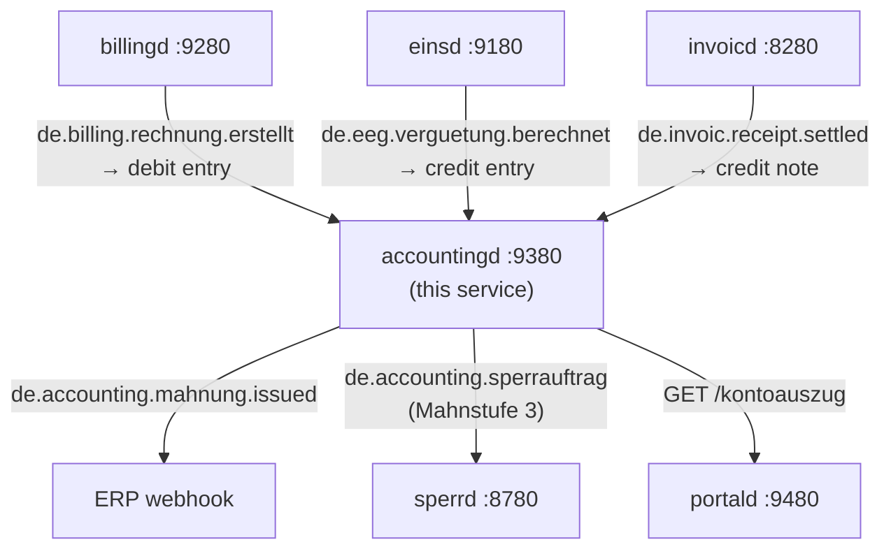

# `accountingd` — Massenkontokorrent / Customer Account Ledger

`accountingd` provides the **FI-CA equivalent** for the mako retail billing stack.
Without it, `billingd` invoices are fire-and-forget — no Offene-Posten tracking,
no automated dunning, no SEPA collection.

Port: **`:9380`**

---

## Why a dedicated ledger?

SAP IS-U calls this module **FI-CA** (Financial Contract Accounting). powercloud and
Wilken ENER:GY both include it natively. `accountingd` provides the same capabilities
as a standalone microservice with CloudEvents integration.

The key design decision: **the ledger is event-driven and idempotent**. CloudEvents
from `billingd` and `einsd` drive entries atomically — re-delivering the same CloudEvent
produces no duplicate entry.

---

## Event flow



---

## Ledger entry types

| `entry_type` | Sign | Trigger |
|---|---|---|
| `RECHNUNG` | +debit | `de.billing.rechnung.erstellt` from `billingd` |
| `ZAHLUNG` | -credit | CAMT.054 import (`POST /api/v1/payments/import`) |
| `GUTSCHRIFT` | -credit | Credit note from ERP |
| `EEG_GUTSCHRIFT` | -credit | `de.eeg.verguetung.berechnet` from `einsd` |
| `BANKRUECKLAST` | +debit | Returned SEPA direct debit |
| `MAHNGEBUEHR` | +debit | Dunning fee (configurable per Mahnstufe) |
| `ABSCHLAG` | +debit | Monthly advance payment |
| `KORREKTUR` | ±signed | Manual correction |

**Balance** = `SUM(amount_ct)` — negative = credit balance (customer overpaid); positive = outstanding debt.

---

## Mahnwesen (dunning) lifecycle

```
balance_ct > 0 AND booking_date > issued_date + dunning_grace_days
  → POST /api/v1/dunning/{account_id}/escalate { "stufe": 1 }
  → emit de.accounting.mahnung.issued → ERP prints Mahnung letter

balance_ct > 0 AND stufe 1 unresolved for 14 days
  → escalate stufe 2 (+ Mahngebühr 5.00 EUR debit entry)

balance_ct > 0 AND stufe 2 unresolved for 14 days
  → escalate stufe 3 (+ Mahngebühr 10.00 EUR debit entry)
  → emit de.accounting.sperrauftrag → sperrd creates sperr_order
```

---

## Endpoints

| Method | Path | Description |
|--------|------|-------------|
| `POST` | `/webhook` | Ingest CloudEvents from billingd/invoicd/einsd |
| `GET/PUT` | `/api/v1/accounts/{malo_id}` | Account CRUD (IBAN, Abschlag, billing_day) |
| `GET` | `/api/v1/accounts/{malo_id}/balance` | Current balance in ct; `status: overdue/credit/settled` |
| `GET` | `/api/v1/accounts/{malo_id}/ledger` | Paged ledger entries |
| `GET` | `/api/v1/accounts/{malo_id}/kontoauszug` | Account statement (portald-consumable) |
| `PUT` | `/api/v1/accounts/{malo_id}/abschlag` | Update monthly advance payment amount |
| `GET/PUT` | `/api/v1/accounts/{malo_id}/vorauszahlung` | Typed `rubo4e::current::Vorauszahlung` (Intervall, Betrag, Gueltigkeit) |
| `POST` | `/api/v1/payments/import` | Ingest CAMT.054 bank statement (JSON array) |
| `GET` | `/api/v1/offene-posten` | Overdue accounts (`?min_balance_eur=&limit=`) |
| `GET` | `/api/v1/dunning` | Open dunning cases |
| `POST` | `/api/v1/dunning/{account_id}/escalate` | Manual Mahnstufe escalation |
| `POST` | `/api/v1/dunning/{id}/resolve` | Mark dunning case resolved |
| `POST` | `/api/v1/sepa/mandates` | Register SEPA mandate (IBAN validated via mod-97) |
| `GET` | `/api/v1/sepa/mandates/{id}` | Fetch mandate |
| `POST` | `/api/v1/sepa/run` | Generate pain.008 XML for all active Abschlag mandates |
| `GET` | `/health` | Liveness |
| `GET` | `/health/ready` | Readiness |

---

## Vorauszahlung (§40 Abs. 1 EnWG)

`accountingd` stores the monthly advance payment both as a raw `abschlag_ct` column (for
fast scheduler queries) and as a typed `rubo4e::current::Vorauszahlung` BO4E COM:

```bash
curl -s -X PUT "http://accountingd:9380/api/v1/accounts/51238696780/vorauszahlung?lf_mp_id=9900357000004" \
  -H "Content-Type: application/json" \
  -d '{
    "_typ": "VORAUSZAHLUNG",
    "betrag": {
      "_typ": "BETRAG",
      "wert": "75.00",
      "waehrung": "EUR"
    },
    "gueltigkeit": {
      "_typ": "ZEITRAUM",
      "startdatum": "2026-08-01"
    }
  }'
```

The `wert` is synced to `abschlag_ct` (EUR × 100 = ct). The GET returns the stored `Vorauszahlung`
or falls back to a synthesised value from `abschlag_ct` when no typed BO4E object has been stored.

---

## IBAN validation

Every SEPA mandate PUT validates the IBAN using the **ISO 13616 mod-97 algorithm**:

1. Remove whitespace, uppercase.
2. Move the first 4 characters to the end.
3. Replace each letter with its numeric code (A=10 … Z=35).
4. Compute the decimal value mod 97 in rolling 9-digit chunks.
5. Valid if result == 1.

Malformed IBANs are rejected at the API boundary with `HTTP 422` — before reaching the
SEPA pain.008 XML generator. The validation logic is covered by **21 unit tests**
(`cargo test -p accountingd --test unit_tests`), including DE, GB, NL, AT, and CH
IBAN formats, checksum failures, length errors, and lowercase normalization.

---

## CAMT.054 payment import

```bash
curl -s -X POST "http://accountingd:9380/api/v1/payments/import" \
  -H "Content-Type: application/json" \
  -d '[
    {
      "iban":       "DE89 3704 0044 0532 0130 00",
      "amount_eur": 155.42,
      "reference":  "Rechnung R2026-06-001",
      "date":       "2026-07-10"
    }
  ]'
```

`accountingd` matches by IBAN against the `accounts` table, writes a `ZAHLUNG` credit entry,
and updates the balance. Returns `{ "accepted": 1, "total": 1 }`.

---

## SEPA pain.008 generation

`POST /api/v1/sepa/run` collects all active SEPA mandates with a positive `abschlag_ct`
and generates a standards-compliant ISO 20022 pain.008.003.02 XML.  The XML can be uploaded
directly to your bank's online banking portal.

```bash
curl -s -X POST "http://accountingd:9380/api/v1/sepa/run" \
  -H "Accept: application/xml" > abschlag-2026-07.xml
```

---

## Idempotency

Every CloudEvent is identified by `ce_id` (the CloudEvents `id` field). On ingest,
`accountingd` writes the `ce_id` into `processed_events` atomically with the ledger entry.
Re-delivering the same event produces no duplicate.

---

## Database schema

### `accounts`

| Column | Notes |
|--------|-------|
| `account_id` | UUID — primary key |
| `malo_id`, `lf_mp_id` | Customer + LF identity |
| `balance_ct` | Cached balance (i64, ct) — updated atomically on every write |
| `abschlag_ct` | Monthly advance payment amount in ct |
| `billing_day` | Day of month for advance payment |
| `iban`, `mandatsref` | Active SEPA mandate link |

### `ledger_entries`

Immutable. One row per credit/debit. `amount_ct > 0` = debit; `amount_ct < 0` = credit.
Balance = `SUM(amount_ct)`. Indexed on `(account_id, booking_date DESC)` for fast statement queries.

---

## Configuration

```toml
# accountingd.toml
database_url          = "postgresql://accountingd:secret@db:5432/accountingd"
port                  = 9380
tenant                = "9910000000002"

# Optional: ERP webhook (Mahnwesen + Sperrauftrag notifications)
erp_webhook_url       = "http://erp:8000/webhooks/accounting"

# Optional: sperrd URL for Mahnstufe 3 auto-trigger
sperrd_url            = "http://sperrd:8780"

# Dunning fees (ct = EUR × 100)
dunning_fee_stufe1_ct = 0       # Reminder — no fee
dunning_fee_stufe2_ct = 500     # Warning — 5.00 EUR
dunning_fee_stufe3_ct = 1000    # Legal notice — 10.00 EUR

dunning_grace_days    = 30
```
