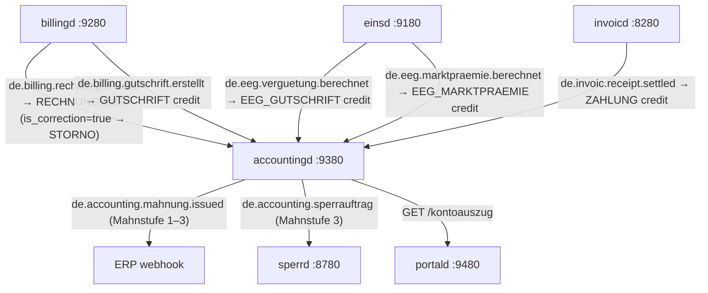
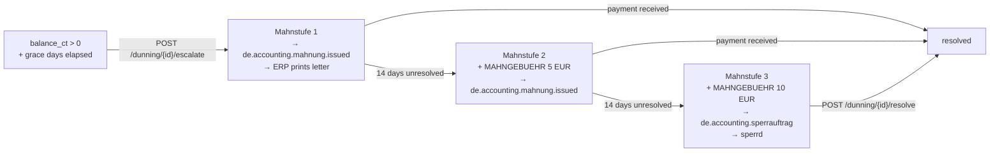

# `accountingd` — Massenkontokorrent / Customer Account Ledger

`accountingd` provides the **FI-CA equivalent** for the mako retail billing stack.
Without it, `billingd` invoices are fire-and-forget — no Offene-Posten tracking,
no automated dunning, no SEPA collection.

Port: **`:9380`**

---

## Why a dedicated ledger?

SAP IS-U calls this module **FI-CA** (Financial Contract Accounting). powercloud and
Wilken ENER:GY both include it natively. `accountingd` provides the same capabilities
as a standalone microservice with CloudEvents integration.

**The ledger is event-driven and idempotent.** CloudEvents from `billingd`, `einsd`,
and `invoicd` drive entries atomically — re-delivering the same CloudEvent produces
no duplicate entry (idempotency via `processed_events` table + DB lock).

---

## Event flow



---

## Ledger entry types

| `entry_type` | Sign | Trigger |
|---|---|---|
| `RECHNUNG` | +debit | `de.billing.rechnung.erstellt` (`is_correction=false`) |
| `STORNO` | ±signed | `de.billing.rechnung.erstellt` (`is_correction=true`) — billing reversal |
| `ZAHLUNG` | -credit | CAMT.054 import or `de.invoic.receipt.settled` |
| `GUTSCHRIFT` | -credit | `de.billing.gutschrift.erstellt` — credit note |
| `EEG_GUTSCHRIFT` | -credit | `de.eeg.verguetung.berechnet` — §21 EEG Einspeisevergütung |
| `EEG_MARKTPRAEMIE` | -credit | `de.eeg.marktpraemie.berechnet` — §20 EEG Direktvermarktung |
| `BANKRUECKLAST` | +debit | Returned SEPA direct debit |
| `MAHNGEBUEHR` | +debit | Dunning fee per Mahnstufe (configurable) |
| `ABSCHLAG` | +debit | Monthly advance payment (Abschlagslauf scheduler) |
| `JAHRESABSCHLUSS` | ±signed | Annual Mehr-/Mindermengenabrechnung (§40 EnWG) |
| `KORREKTUR` | ±signed | Manual operator correction via `POST /buchen` |

**Balance** = `SUM(amount_ct)` — negative = credit balance (customer overpaid); positive = outstanding debt.

**No f64 money.** All amounts use `i64` cents (1 ct = 0.01 EUR). The pain.008 XML
generator uses integer arithmetic — no floating-point rounding errors.

---

## Mahnwesen (dunning) lifecycle



---

## Endpoints

| Method | Path | Description |
|--------|------|-------------|
| `POST` | `/webhook` | Ingest CloudEvents (billingd, einsd, invoicd) |
| `GET/PUT` | `/api/v1/accounts/{malo_id}` | Account CRUD (IBAN, Abschlag, billing_day) |
| `GET` | `/api/v1/accounts/{malo_id}/balance` | Current balance in ct; status: overdue/credit/settled |
| `GET` | `/api/v1/accounts/{malo_id}/ledger` | Paged ledger entries |
| `GET` | `/api/v1/accounts/{malo_id}/kontoauszug` | Account statement (portald-consumable) |
| `PUT` | `/api/v1/accounts/{malo_id}/abschlag` | Update monthly advance payment |
| `GET/PUT` | `/api/v1/accounts/{malo_id}/vorauszahlung` | Typed `rubo4e::current::Vorauszahlung` (§40 EnWG) |
| `GET/PUT` | `/api/v1/accounts/{malo_id}/zahlungsinformation` | Typed `rubo4e::current::Zahlungsinformation` |
| `POST` | `/api/v1/accounts/{malo_id}/buchen` | **Manual booking** (operator-authorised ledger entry) |
| `POST` | `/api/v1/payments/import` | Ingest CAMT.054 bank statement (JSON array) |
| `GET` | `/api/v1/offene-posten` | Overdue accounts |
| `GET` | `/api/v1/dunning` | Open dunning cases |
| `POST` | `/api/v1/dunning/{account_id}/escalate` | Manual Mahnstufe escalation |
| `POST` | `/api/v1/dunning/{id}/resolve` | Mark dunning case resolved |
| `POST` | `/api/v1/sepa/mandates` | Register SEPA mandate (IBAN validated via mod-97) |
| `GET` | `/api/v1/sepa/mandates/{id}` | Fetch mandate |
| `DELETE` | `/api/v1/sepa/mandates/{id}` | **Revoke mandate** (§58 ZAG) |
| `POST` | `/api/v1/sepa/run` | Generate pain.008 XML for all active Abschlag mandates |
| `POST` | `/api/v1/jahresabschluss/{malo_id}` | **Annual settlement** (§40 EnWG Mehr-/Mindermengenabrechnung) |
| `GET` | `/health` · `/health/ready` | Liveness / readiness |

---

## Manual booking (`POST /api/v1/accounts/{malo_id}/buchen`)

For operator-authorised bookings not driven by CloudEvents:

```bash
curl -X POST "http://accountingd:9380/api/v1/accounts/51238696780/buchen" \
  -H "Content-Type: application/json" \
  -d '{
    "entry_type":   "ZAHLUNG",
    "amount_ct":    -5000,
    "reference_id": "BANK-TXN-2026-07-10",
    "description":  "Überweisung Kunde (ausserhalb SEPA)"
  }'
```

Allowed `entry_type` values: `RECHNUNG`, `ZAHLUNG`, `GUTSCHRIFT`, `EEG_GUTSCHRIFT`,
`EEG_MARKTPRAEMIE`, `BANKRUECKLAST`, `MAHNGEBUEHR`, `ABSCHLAG`, `JAHRESABSCHLUSS`, `KORREKTUR`, `STORNO`.

`amount_ct`: positive = debit (increases outstanding debt); negative = credit (reduces debt).

---

## Jahresabschluss (§40 Abs. 1 EnWG)

The annual settlement compares actual billed amounts against advance payments collected:

```bash
# Preview (dry_run=true)
curl "http://accountingd:9380/api/v1/jahresabschluss/51238696780?year=2025&dry_run=true"

# Commit
curl -X POST "http://accountingd:9380/api/v1/jahresabschluss/51238696780?year=2025"
```

Response:
```json
{
  "malo_id":                  "51238696780",
  "year":                     2025,
  "rechnung_sum_ct":          120000,
  "abschlag_paid_ct":         -108000,
  "settlement_ct":            12000,
  "settlement_eur":           "120.00",
  "new_monthly_abschlag_ct":  10000,
  "action":                   "NACHZAHLUNG",
  "committed":                true,
  "ce_id":                    "3fa85f64-..."
}
```

When committed, writes a `JAHRESABSCHLUSS` entry (positive = Nachzahlung; negative = Erstattung)
and updates the monthly `abschlag_ct` to `actual_annual ÷ 12` (§40 Abs. 1 EnWG).

The annual sum includes: `RECHNUNG` + `STORNO` + `MAHNGEBUEHR` (net billed amounts including reversals).

---

## Vorauszahlung (§40 Abs. 1 EnWG)

```bash
curl -X PUT "http://accountingd:9380/api/v1/accounts/51238696780/vorauszahlung" \
  -H "Content-Type: application/json" \
  -d '{
    "_typ": "VORAUSZAHLUNG",
    "betrag": { "_typ": "BETRAG", "wert": "75.00", "waehrung": "EUR" },
    "gueltigkeit": { "_typ": "ZEITRAUM", "startdatum": "2026-08-01" }
  }'
```

Syncs `abschlag_ct = 7500` atomically. GET returns the stored BO4E object or synthesises
from `abschlag_ct` when no typed value has been stored.

---

## IBAN validation

Every SEPA mandate PUT validates the IBAN using **ISO 13616 mod-97** via the
[`sepa`](https://crates.io/crates/sepa) crate (`sepa::validate_iban`).
Covered by **21 tests** in `unit_tests.rs` (DE, GB, NL, AT, CH, checksum failures, length, lowercase).

---

## CAMT.054 payment import

```bash
curl -X POST "http://accountingd:9380/api/v1/payments/import" \
  -H "Content-Type: application/json" \
  -d '[{ "iban": "DE89 3704 0044 0532 0130 00", "amount_eur": "155.42",
          "reference": "Rechnung R2026-06-001", "date": "2026-07-10" }]'
```

Matches by IBAN → writes `ZAHLUNG` credit (or `BANKRUECKLAST` for returned direct debits) → updates balance. Returns `{ "accepted": 1, "total": 1 }`.

Amount parsing uses `sepa::camt054::parse_simple_json` — integer arithmetic only, **no f64**.

---

## SEPA pain.008

```bash
curl -X POST "http://accountingd:9380/api/v1/sepa/run" -H "Accept: application/xml" > abschlag-2026-07.xml
```

Generates ISO 20022 pain.008.003.02 via the [`sepa`](https://crates.io/crates/sepa) crate
(`sepa::Pain008Builder`) for all active mandates with `abschlag_ct > 0`.
**No f64** — all `InstdAmt` values use integer arithmetic (`ct ÷ 100`).

The N-5 scheduler (background worker) auto-generates pain.008 5 days before each `billing_day`.

To revoke a mandate (§58 ZAG — customer right to revoke before cut-off):
```bash
curl -X DELETE "http://accountingd:9380/api/v1/sepa/mandates/{mandate_id}"
```

---

## Idempotency

Every CloudEvent `ce_id` is written to `processed_events` atomically with the ledger entry.
Re-delivering produces no duplicate. The `/buchen` endpoint has no idempotency guard —
supply `reference_id` for audit trails.

---

## Database schema

### `accounts`

| Column | Notes |
|--------|-------|
| `account_id` | UUID primary key |
| `malo_id`, `lf_mp_id` | Customer + LF identity |
| `balance_ct` | Cached balance (i64 ct) — updated atomically on every write |
| `abschlag_ct` | Monthly advance payment in ct |
| `billing_day` | Day of month for advance payment (1–28) |
| `iban`, `mandatsref` | Active SEPA mandate link (fast lookup) |
| `vorauszahlung` | `rubo4e::current::Vorauszahlung` JSONB |
| `zahlungsinformation` | `rubo4e::current::Zahlungsinformation` JSONB |

### `ledger_entries` (immutable)

`amount_ct > 0` = debit; `amount_ct < 0` = credit. Balance = `SUM(amount_ct)`.
Includes `booking_date` (Buchungsdatum) and `value_date` (Wertstellung) — may differ
for backdated corrections (§238 HGB).

### `sepa_mandates`

| Column | Notes |
|--------|-------|
| `mandatsref` | UNIQUE creditor-assigned mandate reference |
| `sequence_type` | `FRST` / `RCUR` / `FNAL` / `OOFF` |
| `signed_at` | Datum der Unterzeichnung |
| `revoked_at` | Set by `DELETE /api/v1/sepa/mandates/{id}` |

### `dunning_cases`, `processed_events`

Standard schema — see `migrations/0001_initial.sql`.

### `migrations/0004_entry_types.sql`

Extended `entry_type` CHECK: added `STORNO` (billing reversals), `EEG_MARKTPRAEMIE`
(Direktvermarktung EEG), `JAHRESABSCHLUSS` (annual settlement).

---

## Configuration

```toml
database_url          = "postgresql://accountingd:secret@db:5432/accountingd"
port                  = 9380
tenant                = "9910000000002"
erp_webhook_url       = "http://erp:8000/webhooks/accounting"
sperrd_url            = "http://sperrd:8780"
dunning_fee_stufe1_ct = 0     # no fee for first reminder
dunning_fee_stufe2_ct = 500   # 5.00 EUR
dunning_fee_stufe3_ct = 1000  # 10.00 EUR
dunning_grace_days    = 30
creditor_iban         = "DE89370400440532013000"
```

---

## MCP server

10 tools at `/mcp` (Streamable HTTP 2025-11-25):

`get_balance` · `list_ledger` · `list_dunning` · `list_overdue` · `update_abschlag` ·
`import_payments` · `run_sepa_collection` · `trigger_jahresabschluss` ·
`run_abschlag_cycle` · `compute_bilanzielle_abgrenzung` · `suggest_payment_match` ·
`post_manual_booking`

The `payment-reconciliation-agent` in `agentd` uses these tools for automated payment
matching (powercloud-equivalent >98% match rate).

---

## Testing

**54+ unit tests** (`cargo test -p accountingd --test unit_tests`):

- IBAN validation (21 tests): DE/GB/NL/AT/CH, checksum, length, lowercase
- Entry type coverage: all 11 types, sign conventions, STORNO vs KORREKTUR semantics
- Jahresabschluss: Nachzahlung/Erstattung/Ausgeglichen, STORNO inclusion in annual sum
- pain.008 formatting: integer arithmetic, no f64, CtrlSum validation
- Dunning fee amounts, escalation sequence
- SEPA sequence types (FRST/RCUR/FNAL/OOFF), mandate revocation

```bash
cargo test -p accountingd --all-features
```
