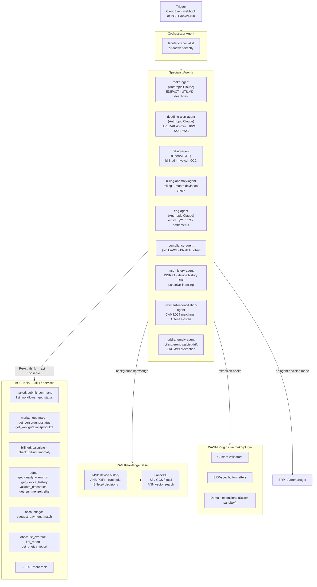
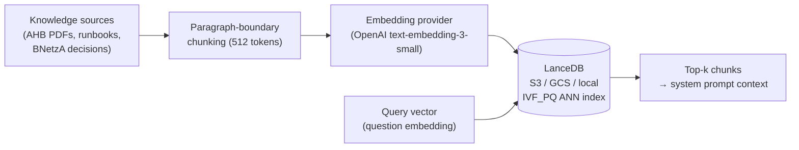

# `agentd` — Multi-Agent LLM Orchestration

`agentd` is the **AI automation layer** for the mako platform. It connects large
language models to all 17 production services via MCP, enabling automated analysis,
decision support, and workflow orchestration.

Port: **`:9580`**

| Endpoint | Description |
|---|---|
| `POST /webhook` | Inbound CloudEvent trigger |
| `POST /api/v1/run` | Manual agent invocation |
| `GET /api/v1/sessions` | Last 100 agent decisions (in-memory ring buffer) |
| `POST /api/v1/rag/ingest` | Index a live text document into LanceDB (M9: MSB device history) |
| `POST /api/v1/rag/search` | Query the RAG knowledge base directly |
| `GET /health` · `GET /health/ready` | Liveness / readiness |

---

## Architecture



---

## Agent Mesh

`agentd` uses the **Orchestrator + Specialist Mesh** pattern:

1. **Orchestrator** receives the trigger and either:
   - Matches a `trigger_pattern` glob → routes directly to the specialist
   - Asks the LLM to triage → specialist selection via `transfer_to_{specialist}` tool call
   - Answers directly if no specialist applies

2. **Specialist agents** run a **ReAct loop** (Reason → Act → Observe):
   - Each iteration calls one or more MCP tools
   - Observes tool results and decides next action
   - Continues until a `Text` result or a `Handoff` to another specialist

3. **Handoffs** are followed up to 3 hops. Each hop re-runs the full ReAct loop
   with the new specialist's system prompt and tool set.

### Bundled specialists

| Specialist | Provider | Triggers | MCP tools used |
|---|---|---|---|
| `mako-agent` | Anthropic Claude | `de.mako.process.*`, `de.mako.aperak.*` | makod, marktd, processd, obsd |
| `deadline-alert-agent` | Anthropic Claude | `de.mako.process.escalated`, `de.mako.process.timedout`, `de.obs.stp.parity.alert` | makod, obsd, marktd |
| `billing-agent` | OpenAI GPT | `de.invoic.receipt.disputed`, `de.accounting.*` | invoicd, billingd, accountingd, netzbilanzd |
| `netzbilanz-agent` | Anthropic Claude | `de.netzbilanz.invoic.drafted`, `de.netzbilanz.invoic.dispatched` | netzbilanzd, marktd, edmd |
| `invoice-reconciliation-agent` | Anthropic Claude Opus | `de.invoic.payment.overdue`, `de.invoic.receipt.disputed` | invoicd, marktd, netzbilanzd |
| `billing-anomaly-agent` | OpenAI GPT | `de.billing.rechnung.erstellt` | billingd, tarifbd, edmd |
| `eeg-agent` | Anthropic Claude | `de.eeg.*` | einsd, edmd, marktd |
| `compliance-agent` | Anthropic Claude | (manual / scheduled) | obsd, processd, marktd, invoicd |
| `payment-reconciliation-agent` | OpenAI GPT | `de.accounting.payment.due`, `de.accounting.bankruecklast` | accountingd |
| `msb-history-agent` | Anthropic Claude | `de.edmd.reading.quality.warning`, `de.edmd.reading.direct.stored` | edmd, makod, marktd |
| `meter-data-agent` | Anthropic Claude | `de.edmd.reading.quality.warning`, `de.mako.process.completed` | edmd, marktd |
| `grid-anomaly-agent` | Anthropic Claude | `de.markt.grid.drift.detected`, `de.markt.nb-contract.updated` | marktd, obsd |
| `tariff-optimization-agent` | OpenAI GPT | `de.billing.rechnung.erstellt`, `de.mako.process.completed` | billingd, tarifbd, edmd, marktd |
| `vertragd-agent` | Anthropic Claude | `de.vertrag.*`, `de.mako.process.abgelehnt` | vertragd, processd, marktd |
| `tarifbd-agent` | Anthropic Claude | `de.tarifd.product.updated`, `de.tarifd.angebot.*` | tarifbd, marktd |
| `processd-agent` | Anthropic Claude | `de.mako.process.initiated`, `de.mako.process.rejected` | processd, marktd, obsd |
| `sperrd-agent` | Anthropic Claude | `de.sperr.*`, `de.mako.process.completed` | sperrd, makod, marktd |
| `nis-syncd-agent` | Anthropic Claude | `de.markt.grid.drift.detected`, `de.markt.malo.updated` | nis-syncd, processd, marktd, obsd |
| `portald-agent` | Anthropic Claude | `de.billing.rechnung.erstellt`, `de.eeg.anlage.foerderung_auslaufend`, `de.accounting.mahnung.issued` | portald, billingd, einsd, accountingd |
| `regulatory-reporting-agent` | Anthropic Claude Opus | (manual / scheduled) | obsd, processd, invoicd, marktd |
| `replacement-value-agent` | Anthropic Claude | `de.edmd.reading.quality.warning`, `de.mako.process.completed` | edmd, marktd, obsd |
| `mabis-syncd-agent` | Anthropic Claude | `de.edmd.reading.quality.warning` | edmd, obsd, marktd |
| `smgw-diagnostics-agent` | Anthropic Claude | `de.edmd.reading.quality.warning`, `de.edmd.reading.direct.stored`, `de.mako.process.initiated` | edmd, marktd, obsd, processd |

All 24 specialists are configured in `agentd.toml` — see `demo/agentd.toml` for a fully working example.

---

## LLM Providers

| Provider | Backend string | Notes |
|---|---|---|
| OpenAI | `openai` | `text-embedding-3-small` for embeddings; compatible with Azure OpenAI, Ollama, LM Studio |
| Anthropic | `anthropic` | Claude 3.5 Sonnet; BM25 keyword fallback (no embedding API) |
| AWS Bedrock | `bedrock` | SigV4 signed requests (no AWS SDK — manual HMAC-SHA256); Claude on Bedrock |

---

## RAG (Retrieval-Augmented Generation)

`agentd` uses **LanceDB** as its vector store — a Rust-native, serverless vector database
that stores embeddings on object storage (S3/GCS/Azure Blob) or locally.



**BM25 fallback:** When using Anthropic (no embedding API), `agentd` runs keyword search
over all stored chunks. Suitable for knowledge bases up to ~50,000 chunks.

**Storage URI examples:**
```toml
storage_uri = "./data/rag"                    # local (dev)
storage_uri = "s3://my-bucket/rag"            # AWS S3
storage_uri = "gs://my-bucket/rag"            # Google Cloud Storage
storage_uri = "az://my-container/rag"         # Azure Blob
```

---

## Configuration

```toml
# agentd.toml
database_url = "postgresql://..."   # optional: for audit log
port         = 9580
tenant       = "9900357000004"

[orchestrator]
provider = "mako-agent"   # which provider the orchestrator uses for triage

[[providers]]
name    = "mako-agent"
backend = "anthropic"
model   = "claude-3-5-sonnet-20241022"
api_key = "env:ANTHROPIC_API_KEY"

[[providers]]
name    = "billing-agent"
backend = "openai"
model   = "gpt-4o"
api_key = "env:OPENAI_API_KEY"

[[providers]]
name    = "bedrock-agent"
backend = "bedrock"
model   = "anthropic.claude-3-5-sonnet-20241022-v2:0"
aws_region = "eu-central-1"
# Uses AWS_ACCESS_KEY_ID + AWS_SECRET_ACCESS_KEY env vars or instance role

[[agents]]
name     = "mako-agent"
provider = "mako-agent"
use_rag  = true
system_prompt = """
  You are an expert on German energy market communication (BDEW MaKo).
  Use the available tools to answer questions about EDIFACT processes,
  regulatory deadlines, and market data.
"""
trigger_patterns = ["de.mako.*", "mako.process.*"]

[[agents]]
name     = "billing-agent"
provider = "billing-agent"
use_rag  = false
trigger_patterns = ["de.billing.*", "de.accounting.*"]

[mcp_servers]
makod       = "http://makod:8080/mcp"
marktd      = "http://marktd:8180/mcp"
billingd    = "http://billingd:9280/mcp"
accountingd = "http://accountingd:9380/mcp"
vertragd    = "http://vertragd:9780/mcp"
obsd        = "http://obsd:8480/mcp"
# ... all 17 services

[rag]
storage_uri    = "./data/rag"
embedding_dim  = 1536
top_k          = 5
chunk_size     = 512
chunk_overlap  = 64

# [[rag.sources]]
# name = "billingd-guide"
# path = "./docs/billingd.md"
```

---

## Triggering an agent run

**Via CloudEvent webhook:**

```bash
curl -X POST http://agentd:9580/webhook \
  -H "Content-Type: application/cloudevents+json" \
  -d '{
    "specversion": "1.0",
    "type": "de.billing.rechnung.disputed",
    "source": "billingd",
    "id": "123e4567-e89b-12d3-a456-426614174000",
    "data": { "malo_id": "51238696781", "record_id": "...", "reason": "check 4 failed" }
  }'
```

**Manual run:**

```bash
curl -X POST http://agentd:9580/api/v1/run \
  -H "Content-Type: application/json" \
  -d '{
    "event_type": "manual.billing.dispute-analysis",
    "data": { "malo_id": "51238696781", "context": "Invoice R2026-001 disputed" }
  }'
```

---

## WASM Plugins

`agentd` loads WASM plugins at startup from `[[plugin]]` entries in `agentd.toml`.
Plugins are sandboxed via Extism (Wasmtime) — no filesystem or network access.

```toml
[[plugin]]
kind = "wasm"
path = "./plugins/erp-formatter.wasm"
capabilities = ["cloud_event", "webhook"]

[[plugin]]
kind = "native"
path = "./plugins/libmy_billing_rules.so"
capabilities = ["billing"]
```

Plugin interfaces: `CloudEventPlugin` (enrich/filter events), `McpToolPlugin` (add
custom tools), `BillingPlugin` (post-process positions), `ValidatorPlugin` (custom
EDIFACT rules), `WebhookPlugin` (sign/enrich outbound webhooks).

---

## CloudEvents emitted

| Event type | When |
|---|---|
| `de.agent.decision.made` | Agent completes a run (includes decision text + tools used) |

---

## Endpoints

| Method | Path | Description |
|---|---|---|
| `POST` | `/webhook` | Inbound CloudEvent trigger |
| `POST` | `/api/v1/run` | Manual agent invocation |
| `GET`  | `/api/v1/sessions` | Last 100 agent decisions (in-memory ring buffer) |
| `POST` | `/api/v1/rag/ingest` | Index a live text document into LanceDB |
| `POST` | `/api/v1/rag/search` | Query the RAG knowledge base directly |
| `GET`  | `/health` | Liveness |
| `GET`  | `/health/ready` | Readiness |
