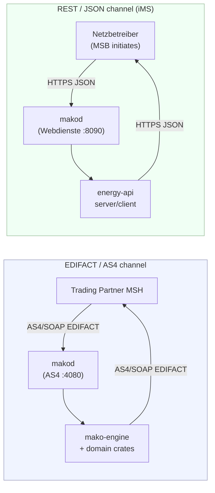
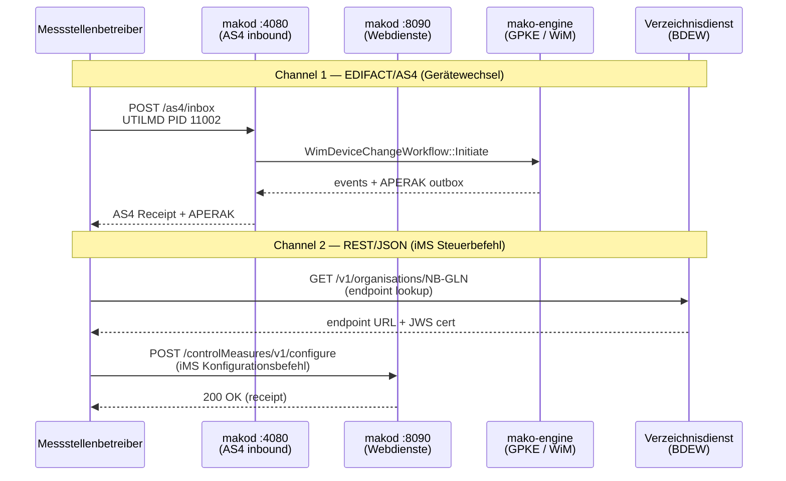

# BDEW API-Webdienste Strom

The German energy market uses **two distinct communication channels** for
electricity market processes. This document explains both, clarifies which
processes use which channel, and shows how to integrate both crates in a
single application.

---

## Two parallel channels



| Channel | Crates | Transport | Processes |
|---------|--------|-----------|-----------|
| EDIFACT/AS4 | `edi-energy` + `mako-engine` + `makod` | SOAP/MTOM, TLS, WS-Security | UTILMD, MSCONS, APERAK, CONTRL, INVOIC, REMADV, ORDERS, ORDRSP, and all other MaKo message types |
| REST/JSON (API-Webdienste) | `energy-api` | HTTPS, JWS signatures | iMS control measures, MaLo-ID queries, directory service |

The REST channel is a **parallel channel introduced for intelligente Messsysteme
(iMS) processes** as of 2026-01-29 ([BDEW API-Webdienste Strom, valid from
2026-01-29](https://www.bdew-mako.de/documents)). It does **not** replace
EDIFACT for electricity market processes. Both channels are mandatory for market
participants who are in scope for iMS.

---

## When to use each crate

### EDIFACT/AS4 channel — `edi-energy` + `mako-engine` + `makod`

```toml
[dependencies]
edi-energy  = { version = "0.2", features = ["utilmd", "mscons"] }
mako-engine = { version = "0.2", features = ["slatedb"] }
mako-gpke   = "0.2"   # or mako-wim / mako-geli-gas / mako-mabis
```

Use these crates for:
- Parsing and validating EDIFACT messages received over AS4 (`edi-energy`).
- Building outgoing EDIFACT messages (`edi-energy` builders).
- Running long-lived market processes with event sourcing, regulatory deadlines, and atomic outbox enqueue (`mako-engine` + domain crates).
- Production AS4 inbound reception with WSS verification and deduplication (`makod` via `asx-rs`).

See the [Process Engine Guide](./engine.md) for `mako-engine` architecture and the [Getting Started guide](./getting-started.md) for a first workflow example.

### `energy-api` — for iMS REST processes

```toml
[dependencies]
energy-api = { version = "0.2", features = ["client"] }   # HTTP client
energy-api = { version = "0.2", features = ["server"] }   # Axum server handler
```

Use this crate for:
- Sending and receiving iMS grid control commands (`controlMeasuresV1`).
- MaLo-ID queries (`maloIdentV1`).
- Looking up endpoint URLs via the Verzeichnisdienst (directory service).
- JWS signing and verification of directory records (`crypto` feature).

---

## Processes mapped to channels

| BDEW process | Channel | Crate | Notes |
|---|---|---|---|
| Lieferbeginn/-ende (GPKE) | EDIFACT/AS4 | `edi-energy` | UTILMD |
| Zählpunktregistrierung (WiM) | EDIFACT/AS4 | `edi-energy` | UTILMD |
| Fahrplankommunikation | EDIFACT/AS4 | `edi-energy` | MSCONS |
| Lastgangkommunikation | EDIFACT/AS4 | `edi-energy` | MSCONS |
| iMS Steuerbefehle (Konfiguration, Abschalten, Zuschalten) | REST/JSON | `energy-api` | `ControlMeasuresClient` |
| iMS Rückmeldungen | REST/JSON | `energy-api` | `ControlMeasuresClient` |
| MaLo-ID-Abfrage | REST/JSON | `energy-api` | `MaloIdentClient` |
| iMS Universalbestellprozess — Anmeldung (PID 11021) | REST/JSON | `energy-api` | `WimOrderHandler::on_anmeldung` |
| iMS Universalbestellprozess — Bestätigung (PID 11022) | REST/JSON | `energy-api` | `WimOrderHandler::on_bestaetigung` |
| iMS Universalbestellprozess — Ablehnung (PID 11023) | REST/JSON | `energy-api` | `WimOrderHandler::on_ablehnung` |
| Endpunkt-Lookup | REST/JSON | `energy-api` | `DirectoryServiceClient` |

---

## Integration pattern

A market participant acting as **Netzbetreiber (NB)** typically needs both
channels simultaneously: EDIFACT for GPKE/WiM process messages and REST for iMS
control measure reception.




```rust
use edi_energy::{parse_interchange, EdiEnergyMessage};
use energy_api::directory::DirectoryServiceClient;
use energy_api::server::control_measures;
use url::Url;

// ── EDIFACT/AS4 channel ──────────────────────────────────────────────────────
// Incoming AS4 payload bytes arrive from the message queue:
fn handle_as4_message(payload: &[u8]) -> Result<(), edi_energy::Error> {
    for msg in parse_interchange(std::io::Cursor::new(payload)) {
        let msg = msg?;
        let pid = msg.detect_pruefidentifikator()?;
        let report = msg.validate()?;
        println!("MSG {pid}: valid={}", report.is_valid());
    }
    Ok(())
}

// ── REST/JSON channel ────────────────────────────────────────────────────────
// Look up the MSB endpoint for a given MaLo before sending a control command:
#[cfg(feature = "client")]
async fn lookup_msb_endpoint() -> Result<(), energy_api::Error> {
    let dir = DirectoryServiceClient::new_insecure(
        Url::parse("https://verzeichnisdienst.example.de/").unwrap(),
    )?;
    let (record, _cert, _sig) = dir
        .get_record("1234567890123", "controlMeasuresV1", 1)
        .await?;
    println!("MSB endpoint: {}", record.url);
    Ok(())
}
```

The two channels operate independently: the `edi-energy` crate has no runtime
dependency on `energy-api` and vice versa. They share no types; the only shared
concern is the MaLo/MeLo identifier strings that appear in both EDIFACT segments
and REST payloads.

---

## `energy-api` feature flags

| Feature | What it enables |
|---------|-----------------|
| `client` | `ControlMeasuresClient`, `MaloIdentClient`, `DirectoryServiceClient` HTTP clients (reqwest + rustls) |
| `server` | Axum router factories for `ControlMeasuresHandler`, `MaloIdentHandler`, and `WimOrderHandler` receive handlers |
| `websocket` | WebSocket subscription client for real-time directory updates (tokio-tungstenite) |
| `crypto` | JWS ECDSA-SHA256 sign/verify for directory records (p256) |

---

## Scope boundary: Electricity only (Gas API status)

The `energy-api` crate is scoped to the **BDEW API-Webdienste Strom** (REST/JSON,
valid from 2026-01-29).  As of the 2026 annual update cycle, **BDEW has not
published an equivalent Gas API-Webdienste specification**.  Gas iMS processes
continue to use EDIFACT over AS4 via the `edi-energy` crate.

When BDEW publishes a Gas API specification, the intent is to add a `gas` feature
flag to `energy-api` alongside the existing `client`/`server` features, keeping
the electricity and gas implementations independently opt-in.

Monitor the BDEW document portal at <https://www.bdew-mako.de/documents> for
Gas API-Webdienste announcements.

---

## Further reading

- [Getting Started](getting-started.md) — EDIFACT parsing and process engine first steps
- [Process Engine Guide](engine.md) — `mako-engine` architecture, stores, deadlines, outbox
- [Platform guide](platform.md) — multi-tenant EDIFACT processing
- [Validation guide](validation.md)
- BDEW MaKo document portal: <https://www.bdew-mako.de/documents>
