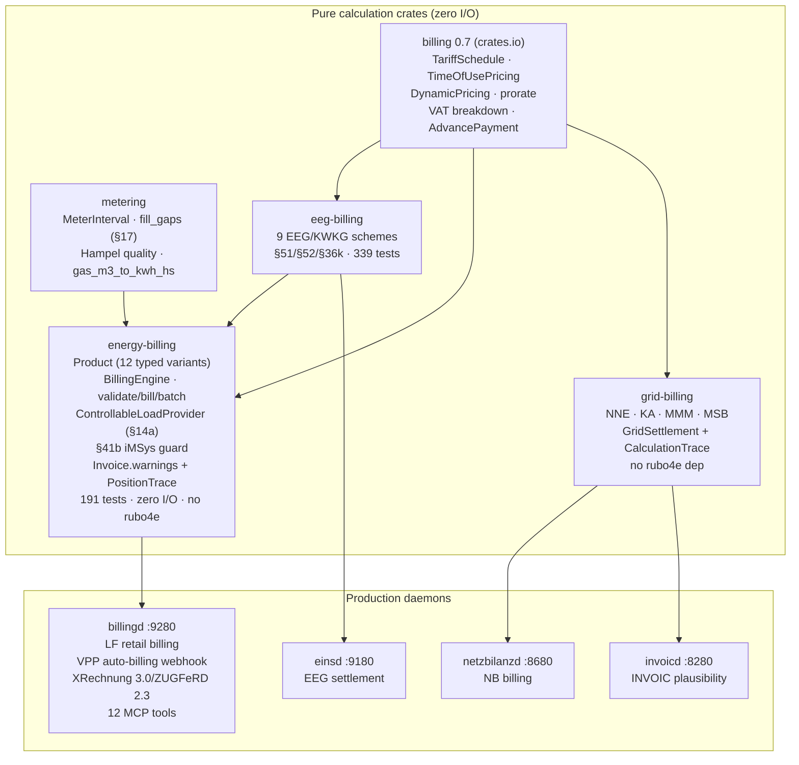
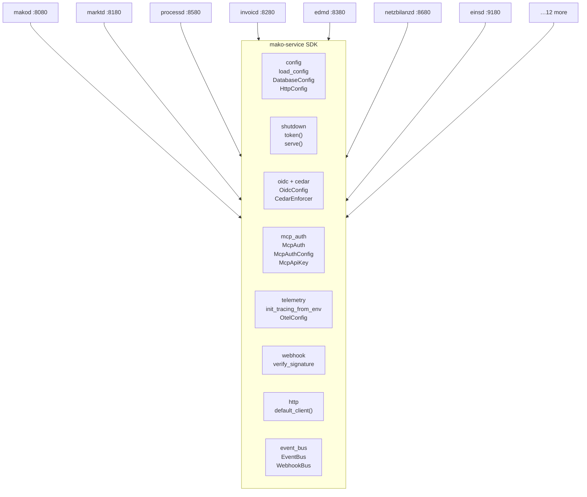
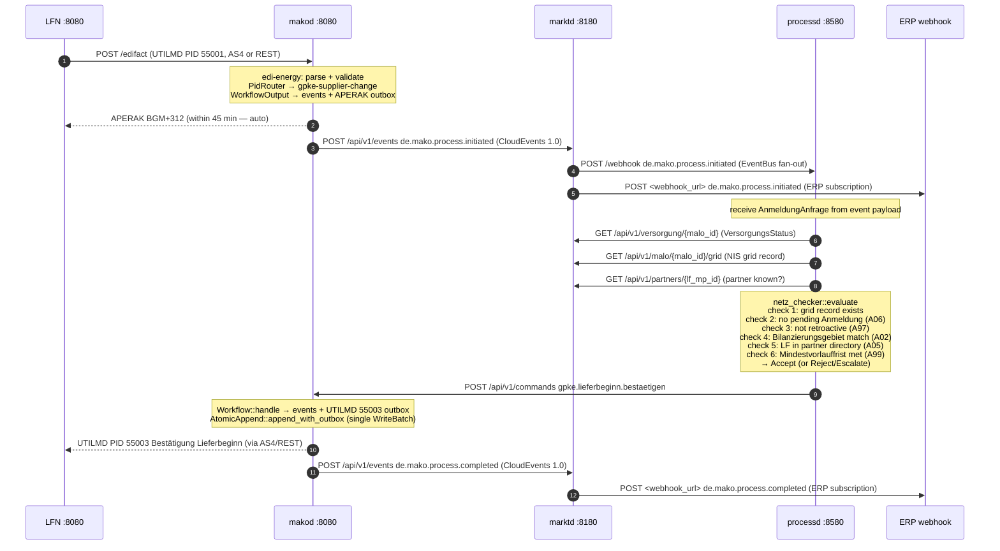

# Architecture

This document covers the design of `mako-engine` and the full service mesh:
event-sourced process runtime, inbound/outbound transport channels, ERP
integration via BO4E + CloudEvents 1.0, and the SlateDB persistence layer.
It also describes all **seventeen** companion daemons and the `mako-service` shared
infrastructure library they build on.

---

## Design principles

| Principle | Consequence |
|---|---|
| **Protocol processor, not a business system** | `makod` handles EDIFACT, BDEW rules, AS4 delivery, and regulatory deadlines. Contract data and billing logic live in your ERP. |
| **`Workflow::handle` and `Workflow::apply` are pure functions** | All I/O, parsing, and clock access happens at the transport boundary before a command is constructed. This makes processes deterministic, replayable, and trivially testable. |
| **Atomic dual-write** | Events and outbox entries are written in a single `WriteBatch` via `AtomicAppend::append_with_outbox`. There is no two-phase commit, no compensation path for a lost APERAK. |
| **Event sourcing** | State is rebuilt by replaying the append-only event log. Audit trails, bug reproductions, and format-version migrations are a consequence of the model, not bolt-ons. |
| **Format-version coexistence** | `FV2025-10-01` and `FV2026-10-01` coexist in the same running instance. A process started under the old format version continues under those rules until it completes. |
| **Persist before dispatch** | `invoicd` writes each INVOIC receipt to PostgreSQL before issuing the settlement command to `makod`. A crash between check and dispatch is recoverable; a crash between persist and dispatch is not a data-loss event. |

---

## Service topology

```mermaid
graph TB
    NB["BDEW counterparty<br/>(NB / MSB / LF)"]
    AS4["AS4/ebMS3<br/>:4080"]
    REST["HTTP REST<br/>:8080"]
    API["API-Webdienste Strom<br/>:8090 (iMS)"]

    subgraph makod ["makod — Protocol daemon"]
        EDI["edi-energy<br/>Parse · Validate"]
        ENG["mako-engine<br/>Process Runtime"]
        SLATE["SlateDB<br/>events / outbox / deadlines"]
        EDI --> ENG --> SLATE
    end

    subgraph marktd ["marktd :8180 — Market Data Hub (pure data hub)"]
        MDM_DB["PostgreSQL\nMaLo · MeLo · contracts\nVersorgungsStatus + history · NeLo\nNbContracts · partners · preisblaetter\nmalo_grid (NB STP)"]
        FANOUT["EventBus fan-out\n→ ERP + processd + invoicd + edmd + obsd\n(WebhookBus default · KafkaBus via krafka feature)"]
    end

    subgraph processd ["processd :8580 — Process Decision Engine"]
        NB_MOD["NB module\nnetz-checker (6 checks)\nAnmeldung STP ≥ 95%"]
        LF_MOD["LF module\nE_0624 auto-response\napproval_queue"]
        PROC_DB["PostgreSQL\nanmeldung_decisions\napproval_queue"]
        NB_MOD & LF_MOD --> PROC_DB
    end

    subgraph invoicd ["invoicd :8280 — INVOIC settlement (LF)"]
        CHK["invoic-checker\n5+1 plausibility checks\n(check 6 = MMM settlement prices)\n+ selbstausstellen 31006"]
        INV_DB["PostgreSQL\ninvoic_receipts (§ 147 AO / GoBD)"]
        CHK --> INV_DB
    end

    subgraph netzbilanzd ["netzbilanzd :8680 — NNE billing (NB)"]
        NNE["grid-billing\nNNE/KA/MMM/MSB calculation\nGridSettlement (+ CalculationTrace)\ninto_rechnung() in service layer"]
        DRAFT_DB["PostgreSQL\ninvoice_drafts"]
        NNE --> DRAFT_DB
    end

    subgraph sperrd ["sperrd :8780 — Sperrung tracker (NB)"]
        SPR["Sperrung lifecycle\nIFTSTA 21039 auto-dispatch"]
        SPR_DB["PostgreSQL\nsperr_orders"]
        SPR --> SPR_DB
    end

    subgraph edmd ["edmd :8380 — Energy data"]
        EDM_DB["PostgreSQL\nmeter_reads · billing_periods"]
    end

    subgraph obsd ["obsd :8480 — Observability"]
        PROJ["process_projections<br/>KPI · overdue · §20 parity"]
    end

    ERP["ERP system<br/>(SAP · CATENA-X · custom)"]
    OPS["Alertmanager · Grafana<br/>BNetzA KPI reports"]
    NIS["nis-syncd :9680<br/>grid topology import (stateless)"]
    EEG["einsd :9180<br/>EEG settlement (NB)"]
    TARIFBD["tarifbd :9080<br/>product catalog"]
    ACCTD["accountingd :9380<br/>customer ledger"]
    subgraph o2c ["Contract + Customer (LF)"]
        AUF["vertragd :9780<br/>Kunden B2C+B2B<br/>Rahmenvertraege<br/>Versorgungsvertraege"]
    end
    subgraph ai ["AI layer"]
        AGT["agentd :9580<br/>29 built-in specialists<br/>Orchestrator + Specialist Mesh<br/>LanceDB RAG · MCP"]
    end

    NB <-->|AS4/SOAP+MTOM| AS4
    NB <-->|HTTP REST| REST
    NB <-->|iMS REST/WS| API
    AS4 & REST & API --> EDI

    SLATE -->|"CloudEvents 1.0 HMAC POST"| marktd
    FANOUT -->|de.mako.process.initiated| processd
    FANOUT -->|de.mako.process.initiated| invoicd
    FANOUT -->|de.mako.*| edmd
    FANOUT -->|de.mako.*| obsd
    FANOUT -->|"CloudEvents 1.0 HMAC"| ERP

    NB_MOD -->|"GET /versorgung, /malo/id/grid"| marktd
    LF_MOD -->|GET /versorgung| marktd
    NB_MOD -->|POST /api/v1/commands| makod
    LF_MOD -->|POST /api/v1/commands| makod

    CHK -->|GET /api/v1/preisblaetter| marktd
    CHK -->|GET /api/v1/billing-period| edmd
    CHK -->|POST /api/v1/commands| makod

    NNE -->|POST /api/v1/commands| makod
    SPR -->|"POST /commands IFTSTA 21039"| makod
    NIS -->|PUT /api/v1/malo/id/grid| marktd
    EEG -->|"GET /api/v1/billing-period"| edmd

    PROJ --> OPS
    AUF -->|POST start-supply| processd
    AUF -->|POST reading-orders| edmd
    AUF -->|PUT customer product| TARIFBD
    AUF -->|POST accounts| ACCTD
    processd -->|"de.mako.*.bestaetigt"| AUF
    AGT -->|"MCP tools (all services)"| makod
    AGT -->|MCP tools| marktd
```



---

```
┌─────────────────────────────────────────────────────────────────────┐
│  Transport                                                           │
│  ┌──────────┐  ┌─────────────┐  ┌──────────────────────────────┐   │
│  │ AS4/SOAP │  │ HTTP REST   │  │ BDEW API-Webdienste Strom     │   │
│  │ :4080    │  │ :8080       │  │ :8090                         │   │
│  └────┬─────┘  └──────┬──────┘  └──────────────┬───────────────┘   │
└───────┼───────────────┼──────────────────────────┼──────────────────┘
        │               │                          │
┌───────▼───────────────▼──────────────────────────▼──────────────────┐
│  edi-energy — Parse · Validate · Build                              │
│  Profile registry (MIG + AHB rules) · 17 message types             │
└───────────────────────────┬─────────────────────────────────────────┘
                            │ typed Command
┌───────────────────────────▼─────────────────────────────────────────┐
│  mako-engine — Process Runtime                                      │
│  PidRouter · EngineContext · Process · Workflow (handle / apply)    │
│  DeadlineStore · OutboxStore · EventStore · SnapshotStore           │
└───────┬──────────────────────────────────────────────────────────┬──┘
        │                                                          │
        ▼  events + outbox (single WriteBatch)                     ▼  HTTP POST (CloudEvents 1.0)
┌───────────────────────────────┐         ┌────────────────────────────────────┐
│  SlateDB (object store)       │         ┌────────────────────────────────────┐
│  e/ events                    │         │  marktd :8180                        │
│  om/ outbox messages          │  POST   │  MaLo / MeLo / contracts           │
│  dl/ deadlines                │ ──────► │  partners / preisblaetter          │
│  pr/ process registry         │CloudEv. │  PostgreSQL · OIDC/JWT             │
│  pt/ partner directory        │         │  Cedar ABAC · fan-out to ERP       │
│  ib/ inbox dedup              │         └────────────┬───────────┬───────────┘
│  sv/ stream versions          │                      │           │
└───────────────────────────────┘           CloudEv.   │           │ CloudEv. 1.0 + HMAC
                                           ┌────────────▼──────┐  ┌▼───────────────────┐
                                           │  invoicd :8280    │  │  ERP system         │
                                           │  invoic-checker   │  │  BO4E JSON          │
                                           │  PostgreSQL audit │  │  HMAC-SHA256 signed │
                                           └────────┬──────────┘  └────────────────────┘
                                                    │ POST /api/v1/commands
                                           ┌────────▼──────────┐
                                           │  makod :8080      │
                                           │  annehmen/ablehnen│
                                           │  → REMADV/COMDIS  │
                                           └───────────────────┘
```

```
BDEW counterparty
    │  AS4/ebMS3 push (SOAP+MTOM over HTTPS)
    ▼
makod/as4_ingest
    │  WSS-verify signature · extract MIME attachment
    ▼
InboxStore::accept     ← 72-hour dedup (prevents double-processing)
    │  raw EDIFACT bytes
    ▼
Platform::parse_interchange (edi-energy)
    │  structured messages, detected PID per message
    ▼
PidRouter::route       ← selects domain module by Prüfidentifikator
    │  workflow_name + PID
    ▼
EdifactIngestDispatcher::dispatch   ← spawns or resumes process by MaLo business key
    │  typed Command (via AdapterRegistry → MessageAdapter)
    ▼
Process::execute_and_enqueue_with_snapshot_and_retry
    ├── replay EventStore → rebuild State   (Workflow::apply — pure)
    ├── Workflow::handle(state, command)     (pure, returns events + outbox)
    └── AtomicAppend::append_with_outbox    (single WriteBatch)
         ├── EventStore  (e/<tenant>/<stream_id>/seq)
         └── OutboxStore (om/<tenant>/<id>)
```

---

## Domain library crates

These are the pure, zero-I/O library crates that domain logic is extracted into.
Each is independently testable and suitable for crates.io publication.

| Crate | Role | Key API |
|---|---|---|
| `edi-energy` | EDIFACT parse / validate / build | `parse()`, `Platform`, `Validator` |
| `mako-engine` | Event-sourced process runtime | `Workflow`, `EventStore`, `OutboxStore`, `DeadlineStore` |
| `mako-markt` | Market data domain types + repo traits | `MaloId`, `MeloId`, `MarktpartnerId`, `VersorgungsStatus` |
| `grid-billing` | NNE/KA/MMM/MSB grid **settlement** engine | `calculate_nne_invoice`, `GridSettlement` (+ `CalculationTrace`, `LegalReference`); `Sparte` drives Gas/Strom refs; `calculate_reversal()`; no rubo4e dep; `into_rechnung()` in service layer |
| `energy-billing` | Pure multi-product retail energy billing (LF) | `Product` typed enum (12 categories, serde-tagged); `BillingEngine`/`BillingProvider` pipeline; `ControllableLoadProvider` (§14a); `validate()` + `bill_batch()`; `Invoice.warnings` + `§41b` guard; `StromsteuerBefreiung` typed enum; `EnergieQuellen` CO₂ label; HT/NT (`billing::TimeOfUsePricing`); block tariffs (`billing::TariffSchedule`); **RLM demand charge** (`leistungspreis_strom_ct_per_kw_month`); **gas §54 exemption**; **historic levy rates**; §41a EPEX; `Invoice::merge()`, `Invoice::allocate_proportionally()`; `eeg` optional feature; no `rubo4e` dep; **191 tests**; zero I/O |
| `eeg-billing` | Pure EEG/KWKG feed-in settlement (NB) | `calculate_settlement`, 9 settlement schemes, §51/§52 rules, `InbetriebnahmeTyp`, proptest invariants, **339 tests** |
| `metering` | German energy metering domain | `MeterInterval`, `aggregate`, `fill_gaps` / `fill_gaps_with_config` (§ 60 Abs. 2 MsbG — `FillGapsConfig` supports `PriorPeriodAverage`), `gas_m3_to_kwh_hs`, `score_intervals` (Hampel A/B/C/F) |
| `invoic-checker` | INVOIC plausibility 6-check pipeline | `InvoicCheckEngine::check`, `CheckOutcome` |
| `netz-checker` | NB Anmeldung 6-check validation | `check_anmeldung`, ERC A02/A05/A06/A97/A99 |
| `mako-obs` | Process observability types | `ProcessProjection`, `KpiReport`, `DeadlineRisk` |
| `mako-service` | **Service SDK** — cross-cutting infrastructure for all 17 daemons | `load_config`, `DatabaseConfig`, `HttpConfig`, `shutdown::token/serve`, `OidcConfig::build_verifier`, `McpAuth`, `McpAuthConfig`, `init_tracing_from_env`, `CedarEnforcer`, `EventBus`, `ServiceBuilder` |
| `mako-plugin` | WASM plugin extension system | `PluginRegistry`, 5 extension-point traits, Extism sandbox |

### Billing crate hierarchy



### `energy-billing` — LF retail billing engine

The `energy-billing` crate uses a **typed `Product` enum** as the primary dispatch mechanism.
Each product category has its own struct — no flat god-struct with 50 optional fields:

```
Product::Strom(ElectricityProduct)           → ElectricityProvider / DynamicElectricityProvider
Product::Waermepumpe(ControllableLoadProduct) → ControllableLoadProvider (§14a)
Product::Wallbox(ControllableLoadProduct)     → ControllableLoadProvider (§14a)
Product::Gas(GasProduct)                      → GasProvider
Product::Waerme(HeatProduct)                  → HeatProvider
Product::Solar(SolarProduct)                  → SolarProvider
Product::Eeg(EegProduct)                      → EegProvider
Product::Einspeisung(EinspeisungProduct)       → EinspeisungProvider
Product::Sharing(SharingProduct)               → ElectricityProvider + EnergyShareProvider
```

`ControllableLoadProduct` uses `#[serde(flatten)] base: ElectricityProduct` — the standard
electricity billing is delegated to `ElectricityProvider`, then §14a credit positions are appended.
This eliminates the old category-string check (`matches!(tariff.category, "WAERMEPUMPE"|"WALLBOX")`).

The engine runs in passes:

```
Pass 0  validate_warnings()      §41b iMSys guard · StromsteuerBefreiung checks
Pass 1  commodity / levy providers   (per-variant provider)
Pass 2  tax provider                 (MwStProvider — groups by applicable_tax_rate)
Pass 3  Abschlag deductions          (Final invoice reconciliation)
Pass 4  Minimum invoice top-up       (B2B Mindestabnahmeverpflichtung)
Pass 5  Cancellation sign reversal   (Stornorechnung)
```

### External crates.io dependencies

| Crate | Version | Purpose |
|---|---|---|
| [`billing`](https://crates.io/crates/billing) | `0.6` | Generic tariff billing engine — graduated/volume/block/capacity pricing (`TariffSchedule`), HT/NT (`TimeOfUsePricing`), EPEX intervals (`DynamicPricing`), `prorate`/`merge_period_documents`, penny-correct `ProportionalAllocation`; used by `energy-billing` and `eeg-billing` |
| [`sepa`](https://crates.io/crates/sepa) | `0.3` | SEPA payment utilities — IBAN (ISO 13616 + 56-country registry), BIC (ISO 9362), `CreditorId` (EPC AT-02), pain.008 SDD CORE+B2B XML (`Pain008Builder`, typed `SequenceType`), pain.001 SCT+SCT Instant XML (`Pain001Builder`), pain.002 status report parser, camt.053 end-of-day statement parser, camt.054 notification types; `ct_from_eur_str` / `ct_to_eur_str`; used by `accountingd` and `vertragd` |

---

## Companion daemons

All **seventeen** daemons share a common operational model:
- **TOML configuration** — loaded from a file (`makod.toml`, `marktd.toml`, …) with `env:VAR_NAME` secret interpolation
- **Cedar ABAC** — all HTTP endpoints gated by Cedar attribute-based access control
- **OIDC/JWT** — asymmetric algorithm only; JWKS cached with background refresh; omit `[oidc]` for dev mode
- **MCP server** — built-in `POST|GET /mcp` endpoint (MCP Streamable HTTP, 2025-11-25) for LLM tooling
- **OpenTelemetry** — OTLP traces on all workflow commands, event appends, and webhook deliveries

| Daemon | Port | Role | Config file |
|--------|------|------|-------------|
| `makod` | `:8080` / `:4080` / `:8090` | Protocol gateway — EDIFACT ↔ BO4E, 45+ workflows, AS4 ingest, deadlines | `makod.toml` |
| `marktd` | `:8180` | Market Data Hub — MaLo/MeLo/NeLo/TR/SR, Lokationszuordnung graph, preisblaetter, VersorgungsStatus, `event_log` replay, EventBus fan-out; **Geraet** typed konfigurationen sub-resource (16-variant `Konfigurationsparameter` enum, GIN-indexed); **Zaehlzeitdefinition** typed endpoint; ZaehlzeitRegister auto-population from WiM Stammdaten | `marktd.toml` |
| `processd` | `:8580` | Process decision engine — NB STP (`netz-checker`) + LF E_0624 auto-response | `processd.toml` |
| `invoicd` | `:8280` | INVOIC plausibility — REMADV, selbstausstellen, overdue-REMADV, § 147 AO / GoBD audit | `invoicd.toml` |
| `netzbilanzd` | `:8680` | NNE/KA/MMM billing daemon (NB role) — generates INVOIC 31001/31002/31005, invoice draft lifecycle | `netzbilanzd.toml` |
| `sperrd` | `:8780` | Sperrung execution tracker (NB role) — `sperr_orders` lifecycle, IFTSTA 21039 auto-dispatch | `sperrd.toml` |
| `nis-syncd` | `:9680` | NIS/GIS grid topology import (NB role, stateless) — pushes `malo_grid` to `marktd`; STP ~80%→≥95% | `nis-syncd.toml` |
| `edmd` | `:8380` | Energy data management — MSCONS meter readings, BO4E `Energiemenge` deliveries, `Lastgang` + `Zeitreihe` time-series, `MeterBillingPeriod`; **§14a SMGW compliance** (MsbG §21c): `smgw_sessions` + `cls_compliance_log` tables, daily `check_session_compliance()` sweep, `de.edmd.cls.compliance_issue` CloudEvents | `edmd.toml` |
| `obsd` | `:8480` | Process observability — KPI reports, deadline-risk alerts, §20 EnWG parity | `obsd.toml` |
| `einsd` | `:9180` | Einspeiser Registry + EEG/KWKG Settlement (NB/LF role) — **9 settlement schemes** (Vergütung, Mieterstrom §38a, Direktvermarktung, Ausschreibung, Post-EEG Spot, Eigenverbrauch, KWKG-Zuschlag §7 KWKG 2023, Flexibilitätsprämie §50 EEG, Flexibilitätszuschlag §50b EEG); Repowering §22 EEG; KWKG Förderdauer; built-in rate table EEG 2000–2023 + KWKG 2023; CloudEvents `de.eeg.verguetung.berechnet` + `de.eeg.marktpraemie.berechnet` + `de.eeg.anlage.foerderung_auslaufend` | `einsd.toml` |
| `tarifbd` | `:9080` | Product & Tariff Catalog (LF role) — user-defined energy products (STROM/GAS/WAERME/SOLAR/EEG/EINSPEISUNG/WAERMEPUMPE/WALLBOX/HEMS/EMOBILITY/ENERGIEDIENSTLEISTUNG/BUNDLE); all prices in `Tarifpreisblatt` JSONB; version history; MaLo→product assignment; EPEX Spot for §41a | `tarifbd.toml` |
| `billingd` | `:9280` | Energy Billing Engine (LF role) — all prices user-defined in `tarifbd`; 13 categories (STROM/GAS/WAERME/SOLAR/EEG/EINSPEISUNG/WAERMEPUMPE/WALLBOX/HEMS/EMOBILITY/ENERGIEDIENSTLEISTUNG/BUNDLE/VPP); §41a dynamic; VPP auto-billing webhook (`de.vpp.dispatch.confirmed` → `Rechnung`); `/preview` dry-run; XRechnung 3.0 / ZUGFeRD 2.3; `de.billing.rechnung.erstellt` | `billingd.toml` |
| `accountingd` | `:9380` | Customer Account Ledger (LF role) — running Kundenkonto ledger; idempotent CE ingest (billing/EEG credits); **FIFO open-item management** (`/open-items`); CAMT.054 import; SEPA pain.008 XML (sepa 0.3.0, typed `SequenceType`, hard `creditor_iban` validation); pain.001 SCT credit-transfer; **auto-dunning rule engine** (Mahnstufe 1–3, background worker); **balance reconciliation** (`/reconcile`); **GDPR Art. 17 pseudonymization** (`/anonymize`); Mahnwesen Mahnstufe 1–3; 6 DB migrations | `accountingd.toml` |
| `portald` | `:9480` | Customer Portal read-model gateway (LF role, stateless) — aggregates Lastgang, invoices, account balance, VersorgungsStatus, EEG settlement; `/dashboard` parallel aggregation; `/events` SSE stream; OIDC-gated | `portald.toml` |
| `vertragd` | `:9780` | Contract & Customer Management (LF role) — `Kunden` (B2C + B2B) with `kunden_identitaeten` (N OIDC logins per company, rolle=VOLLZUGRIFF/ADMIN/FINANZEN/TECHNIK/READONLY, optional `standort_filter` for site-scoped B2B access); `Rahmenverträge` (B2B portfolio: Sammelrechnung, indexation, volume discount, `angebot_id` CPQ); `Versorgungsverträge` per site/commodity (ANGELEGT→IN_BEARBEITUNG→TEILERFUELLUNG→AKTIV→GEKÜNDIGT→ABGELAUFEN); triggers GPKE/GeLi Gas Lieferbeginn/-ende via `processd`; Tarifwechsel + Preisgarantie guard (§41 EnWG); Kündigung with coordinated Schlussablesung; auto-renewal worker; Preisanpassungsbenachrichtigung worker (§41 Abs. 3 EnWG); OIDC sub → MaLo authorization gateway (`GET /kunden/authenticate`) for `portald`; **GDPR Art. 15 export** (`/export`); **GDPR Art. 17 pseudonymization** (`/anonymize`) with immutable audit log; `Zahlungsinformation` typed IBAN/SEPA; 3 DB migrations; 9-tool MCP server | `vertragd.toml` |
| `mabis-syncd` | `:8880` | MaBiS synchronisation daemon (ÜNB/NB role) — aggregates per-MaLo quarter-hourly Lastgang from `edmd` via `mako-mabis::SummenzeitreiheBuilder`, submits Summenzeitreihen to the BIKO as MSCONS PID 13003 through `makod`; ascending version per (Bilanzierungsgebiet, Bilanzierungsmonat) and BIKO-assigned Datenstatus per BK6-24-174 Anlage 3; submits on the 10. Werktag (Erstaufschlag); `submission_runs`, `submission_malo_log` and `pruefmitteilung` tables | `mabis-syncd.toml` |
| `agentd` | `:9580` | Multi-agent LLM orchestration daemon — Orchestrator + Specialist Mesh; OpenAI / Anthropic / AWS Bedrock SigV4; ReAct loop with MCP tool calls across all 17 services; LanceDB RAG (persistent ANN, S3/GCS/local); TOML-defined custom agents + compiled-in specialist catalog; **29 bundled specialists** incl. `billing-regulatory-guard-agent` (§41/§41b compliance), `jahresabrechnung-agent` (annual settlement), `replacement-value-agent` (§ 60 Abs. 2 MsbG), `mabis-syncd-agent` (UTILTS deadlines), `smgw-diagnostics-agent` (BSI TR-03109 + §14a CLS) | [agentd guide](agentd) |

### `marktd` — Market Data Hub (`:8180`)

`marktd` is the single source of truth for all market entity state.
It stores Marktlokationen (MaLo) with typed columns (`netzebene`, `bilanzierungsgebiet`,
`gasqualitaet`, `energierichtung`, `bilanzierungsmethode`, `regelzone`, `fallgruppe`)
and **typed `rubo4e::current::Marktlokation`** API responses (schema validated on every `PUT` — wrong `_typ` or invalid enum → 422),
Messlokationen (MeLo) with typed `netzebene_messung`, `regelzone`, `standorteigenschaften JSONB`,
and **typed `rubo4e::current::Messlokation`** responses,
contracts, trading partners, network contracts (`NbContractRecord`),
price sheets (NNE, Messung, KA, Dienstleistung, Hardware),
**VersorgungsStatus per MaLo** (with full history and `?at=YYYY-MM-DD` point-in-time queries),
**MaLo grid topology** (`malo_grid`, sourced from the NB's NIS/GIS),
**Netz-Element-Lokationen (NeLo)** with typed Redispatch 2.0 columns
(`steuerkanal`, `eigenschaft_msb_lokation`, `grundzustaendiger_msb_codenr`),
**TechnischeRessource** (E-mobility, generation, storage for iMS and Redispatch 2.0),
**SteuerbareRessource** with `konfigurationsprodukte JSONB` (contracted iMS control products),
**Zaehler** (meter registry) returning typed `rubo4e::current::Zaehler`, with
`GET /api/v1/zaehler/{id}/zaehlwerke` for `Vec<Zaehlwerk>` OBIS register access,
**ZaehlzeitRegister + ZaehlzeitSaison** for iMSys Time-of-Use (TOU) register definitions:
`GET/PUT /api/v1/zaehler/{id}/register` stores HT/NT/EINZEL register records;
`GET/PUT /api/v1/zaehler-register/{id}/saisons` stores seasonal time windows (SOMMER/WINTER/GESAMT)
with ISO weekday bitmasks and local-time HH:MM bounds (PostgreSQL JSONB `@>` containment);
`GET /api/v1/zaehler/{id}/tariff-zone?datetime=ISO` resolves the active zone with a single
JOIN query — enabling `billingd` to automatically classify 15-min Lastgang intervals into
HT/NT bands for §14a Modul 2 ToU billing without per-meter manual configuration.

**ZaehlzeitRegister auto-population from WiM Stammdaten:** when `makod` receives a WiM
ORDERS response (PIDs 17102–17133) from the MSB, the `extract_zak_ze_zaehlwerke()` adapter
parses ZAK+ZE+ZD segments and emits a `de.mako.process.completed` event carrying the parsed
register data. `marktd`'s `event_ingest` handler upserts `ZaehlzeitRegister` +
`ZaehlzeitSaison` rows automatically — operators do not need to configure TOU registers
manually for meters where the MSB sends Stammdaten responses.
**Geraete** returning typed `rubo4e::current::Geraet`,
and the full **`Lokationszuordnung` location graph** (temporal `valid_from`/`valid_to` edges,
recursive-CTE BFS traversal via `GET /api/v1/malo/{id}/lokationen`).

`makod` pushes `de.mako.process.*` CloudEvents to `marktd`'s ingest endpoint.
Every inbound event is appended to the **durable `event_log` table** before fan-out,
enabling full replay via `GET /admin/events?from=&to=&type=&limit=`.
W3C Trace Context (`traceparent`, `tracestate`) from the originating `makod` event is
forwarded unchanged in every outbound webhook, enabling end-to-end distributed traces.

`marktd` fans events out to all registered subscribers via HMAC-SHA256-signed HTTP webhooks.
The `VersorgungsStatus` is derived automatically on `de.mako.process.completed`
(PIDs 55003/44003 → Beliefert, 55013/44013 → Unbeliefert). Every supply-state change is written
to `versorgungsstatus_history`, enabling both full audit logs and bitemporal
"as-of" queries by date.

Fan-out deliveries are retried with exponential back-off. Events that exhaust
all retry attempts are written to `fanout_dlq` rather than silently dropped.
This durable failure path ensures § 147 AO / GoBD compliance — a silent drop of a
`de.mako.process.initiated` event to `invoicd` would prevent the INVOIC
plausibility check from running. Operators inspect and retry via
`GET|POST|DELETE /admin/fanout/dlq`.

`marktd` is a **pure data hub** — it stores market entity state and fans out
CloudEvents to subscribers but contains no domain policy. Automated Anmeldung
decisions live in `processd`'s NB module.

See [`marktd` Operator Guide](./marktd.md).

### `processd` — Process Decision Engine (`:8580`)

`processd` consumes `de.mako.process.initiated` CloudEvents from `marktd` and
makes automated decisions within regulatory deadlines.

**NB module** (`--features nb-only` or `integrated`):
- Handles GPKE Lieferbeginn (55001/55016) and GeLi Gas Lieferbeginn (44001)
- Fetches `VersorgungsStatus` + `MaloGridRecord` from `marktd`
- Evaluates 6 objective checks via the pure `netz-checker` library
- Dispatches `bestaetigen`/`ablehnen` to `makod` with §20 EnWG parity logging
- STP target ≥ 95 % (requires NIS/GIS grid records via `nis-syncd` or manual provisioning)

**LF module** (`--features lf-only` or `integrated`):
- Handles LFA E_0624 (PID 55008) within the 45-minute LFW24 window
- Auto-consents clean Abmeldungen; auto-rejects Einzug (A32) scenarios
- Queues ambiguous cases in `approval_queue` for ERP operator review

See [`processd` Operator Guide](./processd.md).

### `invoicd` — Automated Billing Settlement (`:8280`)

`invoicd` is the autonomous INVOIC plausibility-check pipeline for the
Lieferant role. It subscribes to `de.mako.process.initiated` events from `marktd`,
runs five checks (period validity, position arithmetic, document total, tariff
match, tariff found), persists the receipt to PostgreSQL, then issues
`gpke.abrechnung.annehmen` or `gpke.abrechnung.ablehnen` back to `makod`.

The PostgreSQL persistence provides a durable audit trail of all received
invoices, plausibility outcomes, and check findings — satisfying the 3-year
retention requirement under § 147 AO / GoBD and §41 EnWG.

**Supported PIDs:** 31001, 31002, 31005, 31006 (GPKE MMM-Rechnung); 31009
(WiM MSB-Rechnung).

**Payment lifecycle:**
- `POST /api/v1/receipts/{id}/confirm-payment` — ERP calls when bank transfer confirmed; sets `payment_confirmed_at`
- `GET /api/v1/zahlungsstatus/{malo_id}` — pending / settled / overdue counts per MaLo for AR reconciliation
- `POST /api/v1/selbstausstellen/{malo_id}` — outbound INVOIC 31006 (LF selbstausgestellt)
- `GET /api/v1/overdue-remadv` — receipts approaching Zahlungsziel without REMADV
- `de.invoic.payment.overdue` CloudEvent emitted every 6 h by `payment_overdue` worker for overdue receipts
- MCP tools: `get_receipt`, `list_disputes`, `list_overdue_remadv`, `get_zahlungsstatus`

### `edmd` — Energy Data Management (`:8380`)

`edmd` stores MSCONS meter readings received from `marktd` and makes them
queryable via a REST time-series API. It is the authoritative source of
LF-side metered consumption data for Mehr-/Mindermengen (MMM) imbalance
calculations and billing plausibility.

Key facts:
- Subscribes to `de.mako.process.completed` events from `marktd` where `makopid`
  is in the MSCONS PID set (`mako_edm::domain::MSCONS_PIDS`).
- Stores typed kWh interval reads with `(malo_id, dtm_from, dtm_to)` primary key.
- `GET /api/v1/deliveries/{malo_id}` returns **BO4E `Energiemenge` objects** —
  each read mapped to `{ obisKennzahl, menge: { wert, einheit: KWH }, zeitraum }`,
  ready for direct ERP billing-import without EDIFACT parsing.
- `GET /api/v1/lastgang/{malo_id}` (BO4E `Lastgang`, grouped by OBIS register),
  `GET /api/v1/zeitreihe/{malo_id}` (BO4E `Zeitreihe`, commodity metadata), and
  `GET /api/v1/billing-period/{malo_id}?from=&to=`.
- `MeterBillingPeriod` provides `arbeitsmenge_kwh`, `spitzenleistung_kw` (RLM Strom),
  `brennwert_kwh_per_m3` + `zustandszahl` (Gas) for billing plausibility
  and NNE invoice generation.
- Pre-aggregated `meter_billing_periods` table  for fast billing queries.

### `obsd` — Business-Process Observability (`:8480`)

`obsd` projects all `de.mako.*` CloudEvents from `marktd` into a queryable CQRS
read-model of running and completed MaKo processes. It has no authoritative
state — the projection is fully rebuildable by replaying the event stream.

Key facts:
- Wildcard subscription to all `de.mako.*` events from `marktd`.
- One `process_projections` row per MaKo process, with state, deadline, and
  pre-computed `deadline_risk` (`green` / `amber` / `red` / `overdue`).
- `GET /obs/processes`, `GET /obs/kpis`, `GET /obs/overdue` REST endpoints.
- BNetzA KPI report via `GET /obs/kpis?pid=55001&period=2025-10`.
- Integrates with Alertmanager: `GET /obs/overdue` as a Prometheus alert target.

See [`obsd` Operator Guide](./obsd.md).

### `netzbilanzd` — NNE/KA/MMM Billing Daemon (`:8680`)

`netzbilanzd` automates the outbound billing cycle for the NB role: generating
Netznutzungsentgelt (NNE), Konzessionsabgabe (KA), Mehr-/Mindermengen (MMM), and
MSB-Rechnung invoices, running `invoic-checker` self-validation, and dispatching
via `makod` as INVOIC 31001/31002/31005/31009.

Key facts:
- **`grid-billing` pure library** — all monetary arithmetic uses `rust_decimal::Decimal` via `billing::EuroAmount`,
  zero floating-point money. Returns `GridSettlement` (`GridInvoice` is a backward-compatible alias) — no `rubo4e` dependency.
  Every position carries `CalculationTrace { explanation, legal_refs, tariff_source, … }` for full audit.
  `Sparte::Gas` automatically selects `GasNEV §14` legal references and PID 31005. `KaKlasse` annotates KAV tier.
  The service layer (`netzbilanzd`, `invoicd`) owns the `into_rechnung()` conversion.
  The same library is used by `invoicd` for LF selbstausstellen (PID 31006).
- **Operator-supplied inputs** — `POST /api/v1/billing/run` accepts meter readings and tariff data
  directly in the request body. `netzbilanzd` does not query `marktd` or `edmd` autonomously,
  making each billing run idempotent by design.
- **Self-validation before draft** — checks 1–3 (period, arithmetic, total) run immediately
  after generation. A `CheckReport { outcome: Dispute }` never reaches `invoice_drafts`.
- **Operator review step** — generated invoices land in `invoice_drafts` with status `draft`.
  An explicit `PUT /api/v1/billing/drafts/{id}/dispatch` is required to send via `makod`.
  Pre-dispatch re-validation blocks erroneous invoices from reaching counterparties.
- **`invoice_drafts` lifecycle**: `draft → dispatched` (on operator approval) or `rejected`
  (on operator rejection or pre-dispatch `Dispute`).

See [`netzbilanzd` Operator Guide](./netzbilanzd.md).

### `sperrd` — Sperrung Execution Tracker (`:8780`)

`sperrd` tracks the field execution of Sperrung (power/gas disconnection) and
Entsperrung (reconnection) orders under GPKE BK6-22-024. Without it, the NB
risks a permanent protocol violation if a field team executes a disconnection
but the IFTSTA 21039 confirmation is never sent to `makod`.

Key facts:
- **`sperr_orders` lifecycle**: `pending → executed` (field confirmation received) or
  `failed` (field team cannot execute) or `cancelled` (order withdrawn before execution).
- **IFTSTA 21039 auto-dispatch** — when the field team calls `PUT /api/v1/sperr-orders/{id}/execute`,
  `sperrd` atomically updates the order status and issues the IFTSTA 21039 command to `makod`.
- **Operator escalation** — `PUT /api/v1/sperr-orders/{id}/fail` records the failure and
  triggers an operator alert, preventing silent non-execution.
- No event subscription from `marktd`; order IDs are created by the NB operator or ERP
  when a Sperrung workflow reaches the execution milestone in `makod`.

See [`sperrd` Operator Guide](./sperrd.md).

### `nis-syncd` — Grid Topology Import (`:9680`, stateless)

`nis-syncd` bridges the NB's NIS/GIS system to `marktd`'s `malo_grid` table,
which is the prerequisite for `processd` achieving its ≥ 95 % STP target.

Key facts:
- **Stateless** — no PostgreSQL; every request is a read-from-NIS + push-to-`marktd`
  cycle. Safe to restart at any time.
- **`POST /api/v1/grid/sync`** — accepts a list of `MaloGridRecord` objects from the NIS/GIS
  adapter and upserts them into `marktd` via `PUT /api/v1/malo/{id}/grid`.
- **Dry-run mode** — `?dry_run=true` returns a diff of what would change without writing.
- **Per-entry drift detection** — each record is compared to the current `marktd` value
  and emits a `de.nis.grid.drift` CloudEvent on change.
- **STP impact** — without grid records, `processd` `netz-checker` check 1 always
  escalates (unknown MaLo). With full grid records, acceptance rate rises from ~80 % to ≥ 95 %.

See [`nis-syncd` Operator Guide](./nis-syncd.md).

### `mako-service` — Service SDK (library)

`mako-service` is the **shared SDK** that every mako daemon builds on. It eliminates
cross-cutting boilerplate so service code focuses exclusively on domain logic.



| Module | Key exports |
|---|---|
| `config` | `load_config`, `DatabaseConfig`, `HttpConfig` — layered TOML + env-var + `_FILE` secrets |
| `shutdown` | `token()` (SIGINT + SIGTERM), `serve()` — graceful connection drain |
| `oidc` | `OidcConfig`, `OidcVerifier`, `OidcConfig::build_verifier()` — JWKS refresh, dev bypass |
| `mcp_auth` | `McpAuth`, `McpAuthConfig`, `McpApiKey` (SecretString), `McpIdentity` — JWT routing + Cedar + API key |
| `telemetry` | `init_tracing_from_env`, `init_tracing`, `OtelConfig` — structured JSON + OTel OTLP |
| `cedar` | `CedarEnforcer` — Cedar ABAC policy evaluation |
| `health` | `health_routes` — `/health/live` + `/health/ready` |
| `http` | `default_client()` — `reqwest::Client` with 5 s connect + 30 s request timeout |
| `webhook` | `verify_signature` — constant-time HMAC-SHA256 |
| `builder` | `ServiceBuilder` — composable Axum router with health, metrics, trace layer |
| `event_bus` | `EventBus`, `WebhookBus` — CloudEvent fan-out (webhook or Kafka) |

See the [`mako-service` README](https://github.com/hupe1980/mako/tree/main/crates/mako-service)
for code examples covering every module.

---

## EDM reference architecture mapping

Classic German EDM platforms (Robotron ecount, SAP IS-U EDM, Kisters BelVis)
bundle the whole energy-data value chain into one system. mako distributes
the same layers across single-purpose daemons around one metered-data spine
(`edmd`). The mapping, layer by layer:

| EDM reference layer | Home | Notes |
|---|---|---|
| Data acquisition | `edmd` — MSCONS via marktd webhook, direct iMSys/RLM/Gas push, IoT push, bulk, optional Kafka consumer | All paths converge on the same V01–V10 validation; SMGW registry handles compliance, not transport |
| Time-series database | `edmd` — PostgreSQL hot tier (monthly partitions, overlap-excluded, bitemporal corrections) + Apache Iceberg/S3 cold tier with DataFusion OLAP and Iceberg REST catalog | `?as_of=` reconstruction; `allocation_version` INITIAL/CORRECTION/FINAL |
| Validation engine (VEE) | `metering::validation` (pure V01–V10) invoked on every ingest path | Annotate-only by design: suspect readings are stored with `quality_warnings`, never discarded — billing blockage is a separate decision |
| Substitute values (§ 60 Abs. 2 MsbG) | `metering::substitute` + `edmd` REST/MCP — linear interpolation, prior-period average, carry-forward, zero-fill; full `substitute_value_log` audit | Manual values enter via the §22 corrections endpoint |
| Calculation engine | `metering` (pure): aggregation, HT/NT, Spitzenleistung, G685 gas conversion, virtual meters, § 13 StromNZV imbalance, §22 EnWG Netzverlust indicator | Fixed typed rules instead of a free-form formula editor — deterministic by construction |
| Forecasting | `edmd /forecast` — § 60 Abs. 2 MsbG Jahresprognose (daily-average projection with prior-year seasonal correction) | Deliberately no ML runtime in-core; see non-goals |
| Balancing / settlement | `mabis-syncd` (MaBiS Summenzeitreihen, PID 13003, 10-Werktage Erstaufschlag), `netzbilanzd` (NNE/KA/MMM/MSB settlement), `mako-gabi-gas` in makod (GaBi Gas) | edmd serves `/summenzeitreihe` and `/billing-period` to both |
| Market communication | `makod` — 17 EDIFACT message types incl. MSCONS/UTILMD/APERAK/INVOIC/CONTRL, deadline scheduler, CONTRL/APERAK auto-acknowledgement | Protocol processor by design; business state lives in the daemons |
| Billing interface | `billingd` (LF retail, §40–§42 EnWG) and `invoicd` (INVOIC plausibility via `invoic-checker`) consume edmd's `MeterBillingPeriod` and Lastgang | edmd stays billing-free: it answers "what flowed", never "what it costs" |
| Reporting & analytics | `obsd` (BNetzA KPI, §20 EnWG parity report), edmd OLAP (`/archive/*`, `/query/sql`, Arrow IPC), `portald` (customer dashboard), `agentd` (LLM analytics over MCP) | Headless: cockpit rendering is a frontend concern |
| Workflow automation | Config-gated workers per daemon: edmd Iceberg archival + CLS/SMGW compliance, billingd §40b billing runs, accountingd Abschlag/SEPA/dunning, mabis-syncd submission windows | mmma-worker pattern: hourly tick, gated, idempotent via SQL claim |

**Deliberate non-goals** (differences to the monolithic reference, by design):

- **No SCADA/Leittechnik acquisition** — mako is a market-communication and
  metering platform; grid operation systems stay upstream and can push via
  the IoT/bulk APIs.
- **No in-core ML forecasting** — `metering` is pure and deterministic; an
  ML runtime (ONNX/PyTorch) would belong in a dedicated service that reads
  edmd and writes forecast series back as `CALCULATED` quality.
- **No weather ingestion** — Redispatch 2.0 meteorological MSCONS (PID
  13021) is stored as time series; a weather-driven forecaster would join
  the ML service above.
- **Water is metering-only** — `Sparte::WASSER` reads are stored and
  validated, but no water tariff, billing, or market process exists.
- **No operator cockpit UI** — every layer is API/MCP-first; obsd and
  portald serve machine-readable projections for whatever frontend the
  operator runs.

## End-to-end: UTILMD 55001 Lieferbeginn

This sequence traces a complete GPKE supplier-switch from the LF submitting the
Anmeldung to the NB Bestätigung being delivered back.



**Key timing guarantees:**
- APERAK BGM+312 (step 2): within 45 minutes per APERAK AHB §2.4.1
- `processd` decision (steps 7–11): typically < 500 ms from event delivery
- Total LF→NB confirmation: measured in seconds, not minutes

---

## Outbound flows

### AS4 EDIFACT delivery

`OutboxWorker` polls `OutboxStore` every 5 seconds. For each pending message:

1. Render EDIFACT interchange via `edi-energy` builders.
2. Look up trading partner AS4 endpoint in `PartnerStore`.
3. Sign + encrypt with operator BrainpoolP256r1 credentials (`asx-rs` v0.8 — ECDSA-SHA256 + ECDH-ES key agreement via `with_signing_material(cert, key)`).
4. POST via `asx-rs` AS4 sender.
5. On HTTP 200: delete outbox entry. On 4xx/5xx: back-off and retry.

**Self-addressed messages** (`recipient == tenant_party_id`) bypass the AS4
transport entirely.  `BdewAs4Sender` renders the EDIFACT bytes, re-parses
them via `Platform::parse_interchange`, and passes each message to
`EdifactIngestDispatcher::dispatch` for in-process delivery to the correct
workflow.  See [Integrated operators](./makod.md#integrated-operators-nb--msb-same-gln)
for the full dispatch table and configuration notes.

### ERP CloudEvents delivery

`OutboxErpWorker` polls `OutboxStore` every 5 seconds. For each ERP-targeted message:

1. Build a [CloudEvents 1.0](https://cloudevents.io) envelope from the `ErpEvent`.
2. Set `Content-Type: application/cloudevents+json`.
3. Sign with `HMAC-SHA256` over the raw body (when `--erp-webhook-secret` is set).
4. POST to the configured `--erp-webhook-url`.
5. On `2xx`: acknowledged. On `429`/`5xx`: exponential back-off. On `4xx`: dead-letter immediately.

See [ERP Integration](./erp-integration.md) for the full CloudEvents schema and receiver implementation guide.

### Deadline scheduler

`DeadlineScheduler` ticks every **30 seconds** by default (configurable via
`--deadline-poll-interval-secs`; minimum 1 second). For each due entry in `DeadlineStore`:

1. Reconstruct the `ProcessIdentity` from the deadline record.
2. Dispatch a `TimeoutExpired` command to the workflow.
3. The workflow produces a `DeadlineExpired` event and an `AperakTimeout` outbox entry.
4. The outbox entry routes to `OutboxErpWorker`, which delivers the `de.mako.aperak.timeout` CloudEvent to the ERP.

---

## Domain crate layering

Each domain crate is a thin wrapper that:
- Defines `Command`, `Event`, and `State` enums specific to its regulatory process family.
- Implements `Workflow` with pure `handle` and `apply` functions.
- Registers itself in the `PidRouter` via a `register_*` function called from `makod`.

`makod` wires the domain modules, transport adapters, and the ingest dispatcher
at startup:

```
makod (binary)
├── registers mako-gpke    → PIDs 55001–55024, 55555, 55607–55609, 17115–17117 (Strom NB),
│                            17134/17135, 19001/19002, 31001–31002, 31005–31006, 37000–37006
├── registers mako-wim     → PIDs 55039, 55042, 55051, 55168, 31009, 23001/23003/23004/23008,
│                            17001–17011, 19001/19002 (nMSB role), 39000, 35001–35005, 15001–15005
├── registers mako-geli-gas → PIDs 44001–44021, 44022* (Nb role), 44023–44024* (Lf role),
│                             37008–37014, 31011, 17115–17117 (Gas NB)
├── registers mako-mabis   → PID 13003
├── registers mako-wim-gas → PIDs 44022–44024* (Msb/Nmsb role), 44039–44053, 44168–44170,
│                            31003, 31004, 23005, 23009
├── registers mako-gabi-gas → PIDs 31007, 31008, 31010, ORDERS 17110, ORDRSP 19110,
│                             MSCONS 13013, synthetic PIDs 90001–90062 (DVGW gas transport)
├── registers mako-redispatch → Redispatch 2.0 XML workflows
│
└── wires EdifactIngestDispatcher
         ├── called by: AS4 inbound (as4_ingest), REST ingest (edifact_api)
         └── called by: AS4 sender loopback (BdewAs4Sender, recipient == own GLN)
```

`*` PIDs 44022–44024 use role-conditional routing:
- `mako-wim-gas` `wim-gas-stornierung`: Msb/Nmsb/all-role deployments
- `mako-geli-gas` `geli-gas-stornierung`: Nb-only (44022 inbound as GNB)
- `mako-geli-gas` `geli-gas-stornierung-lf`: Lf-only (44023/44024 inbound as LFN/LFA)

See [PID Reference](./pid-reference.md) for the complete table.

---

## SlateDB key schema

All state is stored in a single SlateDB column family. Keys are byte-sortable
to enable efficient range scans per tenant and stream.

| Prefix | Content | Key pattern |
|--------|---------|-------------|
| `e/` | Event log | `e/<tenant>/<stream_id>/<seq_u64_big_endian>` |
| `sv/` | Stream version (optimistic lock) | `sv/<tenant>/<stream_id>` |
| `om/` | Outbox messages | `om/<tenant>/<ulid>` |
| `dl/` | Deadlines | `dl/<tenant>/<due_timestamp_secs>/<id>` |
| `pr/` | Process registry | `pr/<tenant>/<conversation_id>` |
| `pt/` | Partner directory | `pt/<tenant>/<mp_id>` |
| `ib/` | Inbox dedup | `ib/<tenant>/<message_ref>` |
| `sn/` | Snapshots | `sn/<tenant>/<stream_id>` |

The `dl/` prefix sorts by due timestamp, so `range_scan(prefix, now_key)` is
the entire scheduler implementation.

---

## Testing strategy

Every service is structured as a **lib + binary crate**: `src/lib.rs` re-exports all
modules as `pub`, and `src/main.rs` is a thin driver. This enables `tests/` integration
test files that `use {service_name}::*` without any database or HTTP infrastructure.

| Layer | Test type | Tooling |
|---|---|---|
| EDIFACT parse/validate | Unit + property | `edi-energy` tests, `cargo-fuzz` (1 100+ corpus entries) |
| Workflow logic | Unit (sync) | `InMemoryEventStore`, `InMemoryOutboxStore`, `NoopErpAdapter` |
| End-to-end process flows | Async integration | `mako-engine` integration tests; `makod` e2e AHB conformance test |
| Deadline arithmetic | Unit | `fristen` crate with Germany public holiday fixtures |
| CloudEvents delivery | Integration | `OutboxErpWorker` test with mock HTTP server |
| AS4 inbound routing | Integration | `e2e_ahb_conformance.rs` — real fixture EDIFACT → full pipeline |
| EEG settlement formulas | Unit (no DB) | `cargo test -p einsd --test settlement_tests` (18 tests) |
| IBAN mod-97 algorithm | Unit (no DB) | `cargo test -p accountingd --test unit_tests` (**71 tests**: IBAN, FIFO open-items, GDPR anonymization, auto-dunning, decimal precision) |
| Billing arithmetic | Unit (no DB) | `cargo test -p energy-billing --all-features` (**191 tests**: unit + proptest + golden master) |

Run all pure-logic tests without a database:

```bash
cargo test -p energy-billing --all-features  # 191 tests: all categories, §41b guard, §54 EnergieStG, historic rates
           -p accountingd --test unit_tests \
           -p einsd --test settlement_tests
```

---

## Related documentation

| Topic | File |
|---|---|
| Getting started | [getting-started.md](getting-started.md) |
| Engine internals | [engine.md](engine.md) |
| `makod` operator guide | [makod.md](makod.md) |
| `marktd` operator guide | [marktd.md](marktd.md) |
| `processd` operator guide | [processd.md](processd.md) |
| `invoicd` operator guide | [invoicd.md](invoicd.md) |
| `netzbilanzd` operator guide | [netzbilanzd.md](netzbilanzd.md) |
| `sperrd` operator guide | [sperrd.md](sperrd.md) |
| `nis-syncd` operator guide | [nis-syncd.md](nis-syncd.md) |
| `edmd` operator guide | [edmd.md](edmd.md) |
| `obsd` operator guide | [obsd.md](obsd.md) |
| ERP integration | [erp-integration.md](erp-integration.md) |
| PID reference | [pid-reference.md](pid-reference.md) |
| Compensation flows | [compensation.md](compensation.md) |
