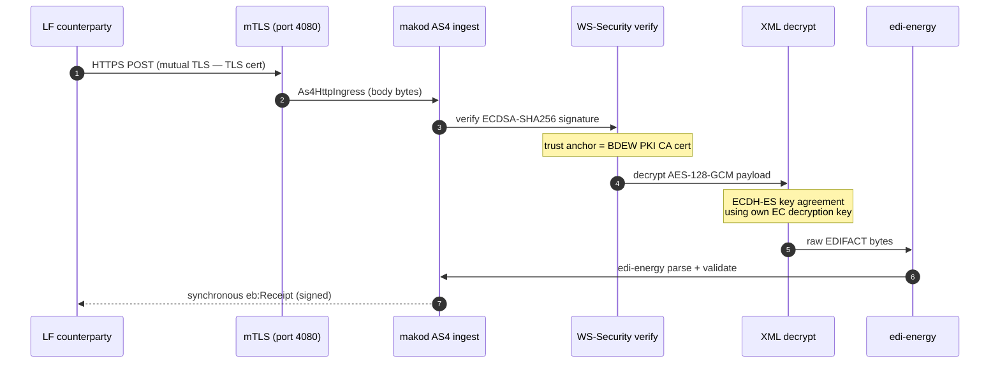
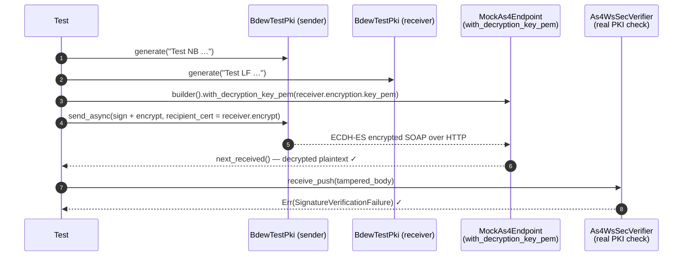

# BDEW AS4 Guide

AS4 became the mandatory transport for BDEW MaKo since **1 April 2024** (Strom, BK6-22-024)
and **1 April 2025** (Gas, BK7-22-023). This guide covers everything needed to operate
`makod` in a BDEW production environment.

---

## BDEW AS4-Profil v1.2 vs PEPPOL/CEF

BDEW AS4 is based on the CEF eDelivery profile but extends it with mandatory BSI TR-03116-3
cryptographic algorithms. The differences are significant enough to cause interoperability
failures if you treat them as equivalent.

| Aspect | PEPPOL / CEF eDelivery | BDEW AS4-Profil v1.2 (01.04.2026) |
|---|---|---|
| Signing algorithm | RSA-SHA256 | **ECDSA-SHA256 + BrainpoolP256r1** |
| Encryption | Optional | **Mandatory** |
| Key agreement | RSA-OAEP | **ECDH-ES + ConcatKDF** |
| Payload cipher | AES-256-GCM | **AES-128-GCM** |
| EC curve | P-256 (NIST) | **BrainpoolP256r1** (RFC 5639) |
| PKI | PEPPOL PKI | **SM-PKI** (BSI) / BDEW Marktpartner PKI |
| Service URI | PEPPOL identifier | `urn:bdew:as4:service` |
| Action URI | PEPPOL BIS type | `urn:bdew:as4:service:<EDIFACT_TYPE>` |
| Receipt | Optional synchronous | **Mandatory synchronous** (§4.6.3) |
| Dedup window | Not prescribed | **72 hours** (§4.2) |
| Certificate triplet | 2 (TLS + signing) | **3 (TLS + signing + encryption)** |

The signing algorithm is auto-detected from the key type: EC keys use ECDSA-SHA256,
RSA keys use RSA-SHA256. Encryption uses ECDH-ES + ConcatKDF + AES-128-GCM when the
recipient certificate carries an EC public key. Supply BrainpoolP256r1 material and the
correct paths are selected without any explicit configuration.

---

## Certificate triplet

BDEW requires **three separate X.509 keypairs** per market participant, all using
BrainpoolP256r1. These are called the WIRK certificates:

```
┌─────────────────────────────────────────────────────────────────────┐
│  Certificate triplet (SM-PKI / BDEW Marktpartner PKI)               │
│                                                                     │
│  ┌──────────────────┐   ┌───────────────────┐   ┌────────────────┐  │
│  │   TLS cert       │   │  Signing cert      │   │ Encryption cert│  │
│  │  (mTLS auth)     │   │  (WS-Security sig) │   │ (ECDH-ES KEX)  │  │
│  │  KeyUsage:       │   │  KeyUsage:         │   │ KeyUsage:      │  │
│  │  digitalSig +    │   │  digitalSignature  │   │ keyAgreement   │  │
│  │  keyEncipherment │   │                    │   │                │  │
│  └──────────────────┘   └───────────────────┘   └────────────────┘  │
│                                                                     │
│  All three: EC BrainpoolP256r1 · BSI TR-03116-3 §9.1/§9.2          │
└─────────────────────────────────────────────────────────────────────┘
```

### Obtaining WIRK certificates

1. Register as a Marktpartner at [bdew-codes.de](https://www.bdew-codes.de)
2. Apply for a WIRK certificate at the BDEW Marktpartner portal
3. The CA signs three certificates (TLS, signing, encryption) for your GLN
4. Download as PKCS#12 bundles and extract PEM with:

```bash
# Extract signing cert + key
openssl pkcs12 -in signing.p12 -nocerts -nodes -out as4-signing.key.pem
openssl pkcs12 -in signing.p12 -nokeys        -out as4-signing.cert.pem

# Extract encryption cert + key
openssl pkcs12 -in encryption.p12 -nocerts -nodes -out as4-encrypt.key.pem
openssl pkcs12 -in encryption.p12 -nokeys        -out as4-encrypt.cert.pem

# Extract BDEW CA trust anchor
openssl pkcs12 -in signing.p12 -cacerts -nokeys  -out bdew-ca.cert.pem
```

---

## makod configuration

Each `[[party]]` entry registers one BDEW market-participant identity (`mp_id`).
A single operator (tenant) typically holds **multiple `mp_id`s** — one per
Marktrolle/Sparte combination:

- **Strom** roles (LF, NB, MSB, BKV) use a **BDEW-Codenummer** (`99…`, NAD DE3055 `293`)
- **Gas** roles (LFG, GNB, GMSB) use a **DVGW-Codenummer** (`98…`, NAD DE3055 `332`)

A combined Strom+Gas operator therefore needs at least two `[[party]]` entries:

```toml
# makod.toml — combined Strom + Gas operator (LG)

# Strom identity: BDEW-Codenummer (starts with 99)
[[party]]
mp_id   = "9900357000004"
primary = true              # becomes the AS4 receipt sender-ID and storage partition key
roles   = ["LF", "MSB"]

# Gas identity: DVGW-Codenummer (starts with 98)
[[party]]
mp_id   = "9800357000005"
roles   = ["LFG", "GMSB"]
```

### One AS4 endpoint for all mp_ids

**One URL serves all mp_ids — but each mp_id still needs its own certificate triplet.**

Per BDEW Allgemeine Festlegungen §2.14 and SM-PKI rules, every mp_id must have a
separately issued WIRK certificate triplet (TLS + signing + encryption) registered in
the BDEW portal (Strom: bdew-codes.de, Gas: codevergabe.dvgw-sc.de). A company
operating as LF Strom (`99…`) and LF Gas (`98…`) therefore holds **two certificate
triplets** — one registered against each mp_id.

However, **all those identities can share one `--as4-addr`**. A single `makod` instance
accepts inbound AS4 messages addressed to any registered mp_id; the `As4PushPolicy`
does not filter by `<eb:To>/<eb:PartyId>`. Routing to the correct workflow happens at
the EDIFACT ingest layer based on the Prüfidentifikator.

```
Company X
  MP-ID Strom  9900357000004  (BDEW cert A) ─┐
  MP-ID Gas    9800357000005  (DVGW cert B) ─┤─► https://as4.company.de:4080/as4/inbox
```

For outbound messages the EDIFACT `NAD+MS` sender is set automatically per workflow
(Strom workflows use the BDEW code, Gas workflows use the DVGW code).

#### Signing cert and `<eb:From>` in the current release

`makod` maintains **one outbound `SessionContext`** backed by a single signing
key/cert (configured via `--as4-signing-key-pem` / `--as4-signing-cert-pem`). This
means:

- All outbound AS4 messages are signed with that one key, regardless of which mp_id
  is the EDIFACT `NAD+MS` sender.
- The AS4 `<eb:From>/<eb:PartyId>` for receipts and error signals is always the
  **primary** mp_id (or the explicit `--as4-party-id`).

In practice counterparties validate the cert against the BDEW PKI trust anchor (not
against the `<eb:From>` value), so this works for the majority of deployments. For
**strict per-mp_id cert compliance** in a combined Strom+Gas deployment, configure
the primary mp_id's cert as the shared signing key and register both WIRK triplets
in the BDEW/DVGW portal — using the same physical cert for both is permissible for
same-entity mp_ids; separate certs are optional.

For a single-Sparte deployment one `[[party]]` block and one certificate triplet is
sufficient.

### CLI / environment variables

| Flag | Env var | Purpose |
|---|---|---|
| `--as4-addr :4080` | `MAKOD_AS4_ADDR` | AS4 inbound listen address |
| `--as4-signing-key-pem <PEM>` | `MAKOD_AS4_SIGNING_KEY_PEM` | Signing private key (ECDSA BrainpoolP256r1) |
| `--as4-signing-cert-pem <PEM>` | `MAKOD_AS4_SIGNING_CERT_PEM` | Signing X.509 certificate |
| `--as4-trust-anchor-pem <PEM>` | `MAKOD_AS4_TRUST_ANCHOR_PEM` | BDEW PKI CA certificate (trust anchor) |
| `--as4-decryption-key-pem <PEM>` | `MAKOD_AS4_DECRYPTION_KEY_PEM` | Own EC decryption private key |
| `--as4-party-id <GLN>` | `MAKOD_AS4_PARTY_ID` | AS4 `<eb:PartyId>` (defaults to primary `[[party]]` `mp_id`) |
| `--as4-partner <GLN=URL>` | `MAKOD_AS4_PARTNER` | Trading partner endpoint (repeatable) |
| `--as4-partner-cert <GLN=PEM>` | `MAKOD_AS4_PARTNER_CERT` | Per-partner encryption cert (repeatable) |

### Example production startup

```bash
makod \
  --config /etc/makod/makod.toml \
  --as4-addr :4080 \
  --as4-signing-key-pem  "$(cat /etc/certs/as4-signing.key.pem)" \
  --as4-signing-cert-pem "$(cat /etc/certs/as4-signing.cert.pem)" \
  --as4-trust-anchor-pem "$(cat /etc/certs/bdew-ca.cert.pem)" \
  --as4-decryption-key-pem "$(cat /etc/certs/as4-encrypt.key.pem)" \
  --as4-partner 9900000000001=https://netzbetreiber-a.example/as4/inbox \
  --as4-partner-cert "9900000000001=$(cat /etc/partner-certs/9900000000001-encrypt.pem)" \
  --http-addr :8080
```

The `[[party]]` entries in `makod.toml` register all operator mp_ids. `--as4-party-id` defaults to the primary entry's `mp_id` and can be omitted when they match.

### Kubernetes secret example

```yaml
# k8s/makod-secret.yaml
apiVersion: v1
kind: Secret
metadata:
  name: makod-as4-certs
type: Opaque
stringData:
  AS4_SIGNING_KEY_PEM:    <base64-encoded PEM>
  AS4_SIGNING_CERT_PEM:   <base64-encoded PEM>
  AS4_DECRYPTION_KEY_PEM: <base64-encoded PEM>
  AS4_TRUST_ANCHOR_PEM:   <base64-encoded BDEW CA PEM>
```

Use `_FILE` suffix to load from a mounted secret:

```bash
MAKOD_AS4_SIGNING_KEY_PEM_FILE=/run/secrets/as4-signing-key  makod ...
```

---

## P-Mode registry

Every trading partner requires registered P-Modes before AS4 messages can be delivered.
`makod` registers one P-Mode per standard BDEW EDIFACT message type for each partner.

### Registering partners with multiple mp_ids

A counterpart operating Strom and Gas has two distinct mp_ids. Register **each**
separately — both can point to the same inbox URL:

```bash
# NB Strom (BDEW-Codenummer, 99…)
--as4-partner 9900000000001=https://nb-a.example/as4/inbox \
--as4-partner-cert "9900000000001=$(cat /etc/partner-certs/9900000000001-enc.pem)"

# Same NB, Gas role (DVGW-Codenummer, 98…) — same URL, different mp_id
--as4-partner 9800000000002=https://nb-a.example/as4/inbox \
--as4-partner-cert "9800000000002=$(cat /etc/partner-certs/9800000000002-enc.pem)"
```

The P-Mode registry does an **exact mp_id match** on every outbound message.
A missing Gas mp_id registration causes `PartnerUnknown` dead-letters on Gas workflows.

P-Modes are registered at startup. To add a new trading partner, restart `makod` with the
new `--as4-partner` / `--as4-partner-cert` flags.

---

## BDEW Verzeichnisdienst — API-Webdienste endpoint discovery

The BDEW Verzeichnisdienst ("Regelungen zum Verzeichnisdienst" v1.0, applicable 03.04.2025)
is a registry for **API-Webdienste Strom endpoints** (SM-PKI certificate class EMT.API).
It is **not** used for AS4 EDIFACT delivery — AS4 inbox endpoints are carried in EMT.MAK
certificates and exchanged via PARTIN Kommunikationsdaten (PIDs 37000–37014).

`makod` uses the Verzeichnisdienst exclusively to discover **MaLo-Identifikation callback
URLs** (API-Kennung `maloIdV1`, stored as `CommunicationChannel { qualifier: "AW" }` in the
partner store). Configure it so that the LF's MaLo-ID response endpoint is resolved
automatically instead of hard-coded:

```bash
--verzeichnisdienst-url https://<verzeichnisdienst-host>/api/directory/v1
```

At startup and every 5 minutes, `makod` queries
`GET <base-url>/record/<lf_mp_id>/maloIdV1/1/v1` for each known LF.
Static `--maloid-partner GLN=URL` entries always take priority.

> **AS4 partner endpoints** (PARTIN COM qualifier `AK`) are populated by inbound PARTIN
> messages (PIDs 37000–37014) or seeded at startup via `--as4-partner`. The Verzeichnisdienst
> is not involved in AS4 endpoint resolution.

---

## Message flow



---

## Testing without WIRK certificates

WIRK certificate registration takes days to weeks. Use `mako-as4`'s built-in test helpers
to run integration tests locally immediately:

### Rust unit/integration tests

```toml
[dev-dependencies]
mako-as4 = { path = "../mako-as4", features = ["testing"] }
# asx-rs 0.8 testing helpers used below
asx-rs   = { version = "0.8", features = ["as4", "testing"] }
```

The following uses **asx-rs v0.8.0 convenience APIs** — no manual `CertHandle`
construction or direct `zeroize` dependency required:

```rust
use mako_as4::testing::{BdewTestPki, MockAs4Endpoint};
use asx_rs::core::SessionContextBuilder;
use asx_rs::observability::EventBus;
use asx_rs::transport::As4HttpTransport;

#[tokio::test]
async fn test_as4_full_round_trip() {
    let sender_pki = BdewTestPki::generate("Test NB 9900357000004");
    let receiver_pki = BdewTestPki::generate("Test LF 9900357000005");

    // Mock endpoint configured to decrypt ECDH-ES messages (asx-rs 0.8 FR-1).
    // Without with_decryption_key_pem(), encrypted messages would return HTTP 400.
    let mock = MockAs4Endpoint::builder()
        .with_decryption_key_pem(receiver_pki.encryption.key_pem.clone())
        .bind("127.0.0.1:0")
        .await
        .unwrap();

    // with_signing_material() atomically sets cert + key and auto-derives key_id
    // from partner_id — no manual CertHandle construction needed (asx-rs 0.8 BUG-1 fix).
    let session = std::sync::Arc::new(
        SessionContextBuilder::new("sess-test", "9900357000004")
            .with_signing_material(
                sender_pki.signing.cert_pem_str(),
                sender_pki.signing.key_pem_str(),
            )
            .with_trust_anchor_pem(sender_pki.signing.cert_pem_str())
            .build()
            .unwrap(),
    );

    // EventBus::new_for_testing() — BestEffort mode, no audit sink required (asx-rs 0.8 FR-2).
    let event_bus = std::sync::Arc::new(EventBus::new_for_testing());

    // ... build and send As4SendRequest with partial credentials (FR-4):
    // Only recipient_cert_pem is needed — signing falls back to session cert_handle.

    // As4HttpTransport for localhost — SSRF guard disabled (asx-rs 0.8 FR-3).
    // Use send_to_localhost() (not send()) to bypass SSRF URL validation.
    let transport = As4HttpTransport::new_for_localhost_testing().unwrap();
    // transport.send_to_localhost(&mock.local_url(), &output).await.unwrap();

    // mock.next_received() delivers the decrypted plaintext payload (FR-1).
    // let received = mock.next_received().await.unwrap();
    // assert!(received.payload.starts_with(b"UNB"));
}
```

For a complete, runnable example with SOAP envelope verification, see
`services/makod/tests/as4_security.rs` — 11 tests covering the full BDEW AS4 security
envelope including tampered-signature rejection and `require_encrypted_inbound` enforcement.

### Generating test certificates manually with OpenSSL

```bash
# Generate BrainpoolP256r1 EC signing key and self-signed cert
openssl ecparam -name brainpoolP256r1 -genkey -noout -out test-signing.key.pem
openssl req -new -x509 -key test-signing.key.pem \
  -out test-signing.cert.pem -days 365 \
  -subj "/CN=Test NB 9900357000004"

# Generate encryption keypair
openssl ecparam -name brainpoolP256r1 -genkey -noout -out test-encrypt.key.pem
openssl req -new -x509 -key test-encrypt.key.pem \
  -out test-encrypt.cert.pem -days 365 \
  -subj "/CN=Test NB 9900357000004 (enc)"

# Verify curve
openssl ec -in test-signing.key.pem -text -noout | grep "NIST CURVE\|ASN1 OID"
```

## Supported EDIFACT message types (`BdewAction`)

`mako_as4::BdewAction` covers all 16 standard BDEW EDIFACT message types.
Each variant maps to the AS4 action URI `urn:bdew:as4:service:<TYPE>`.

| Variant | EDIFACT type | Used in |
|---|---|---|
| `Utilmd` | UTILMD | GPKE, WiM, GeLi Gas, WiM Gas |
| `Aperak` | APERAK | All processes |
| `Contrl` | CONTRL | All processes |
| `Mscons` | MSCONS | Meter readings / time series |
| `Invoic` | INVOIC | GPKE NNE, WiM MSB, GeLi Gas AWH, MABIS |
| `Remadv` | REMADV | GPKE, MABIS billing |
| `Iftsta` | IFTSTA | GPKE Sperrung / Entsperrung |
| `Ordrsp` | ORDRSP | GPKE Konfiguration, WiM Geräteübernahme |
| `Orders` | ORDERS | WiM Geräteübernahme, GPKE Sperrung |
| `Ordchg` | ORDCHG | WiM Stornierung, GeLi Gas AWH Stornierung |
| `Reqote` | REQOTE | WiM Preisanfrage MSB |
| `Insrpt` | INSRPT | WiM Ablesesteuerung / Gerätebefund |
| `Pricat` | PRICAT | WiM Preisliste MSB |
| `Quotes` | QUOTES | WiM Preisanfrage MSB response |
| `Partin` | PARTIN | GPKE Kommunikationsdaten (PIDs 37000–37006), GeLi Gas (PIDs 37008–37014) |
| `Utilts` | UTILTS | GPKE UTILTS Konfigurationsdaten, MaBiS Summenzeitreihen |

Non-standard types use `BdewAction::custom("TYPENAME")` which composes the full URI.

### Idiomatic Rust conversions

`BdewAction` implements `Display` (EDIFACT type name) and `FromStr` (parses type name,
unknown types map to `Custom` — never fails):

```rust
use mako_as4::pmode::BdewAction;

// Display shows the EDIFACT type name
assert_eq!(BdewAction::Partin.to_string(), "PARTIN");

// Parse from a string (used in outbox delivery loop)
let action: BdewAction = "UTILTS".parse().unwrap();
assert_eq!(action, BdewAction::Utilts);

// Unknown types → Custom (delivery is attempted, not rejected)
let action: BdewAction = "SLSFCT".parse().unwrap();
assert!(matches!(action, BdewAction::Custom(_)));

// Access the EDIFACT type name without heap allocation
let name: &str = BdewAction::Partin.as_edifact_type(); // "PARTIN"

// Access the full AS4 action URI
let uri: String = BdewAction::Partin.as_uri(); // "urn:bdew:as4:service:PARTIN"
```

---


one as sender, one as receiver — using self-signed test certificates:

```toml
# nb.toml
[[party]]
mp_id   = "9900357000004"
primary = true
roles   = ["NB"]

[storage]
allow_volatile = true
```

```toml
# lf.toml
[[party]]
mp_id   = "4012345000023"
primary = true
roles   = ["LF"]

[storage]
allow_volatile = true
```

```bash
# Terminal 1 — receiver (NB)
makod \
  --config nb.toml \
  --as4-addr :4080 \
  --as4-signing-key-pem "$(cat test-signing.key.pem)" \
  --as4-signing-cert-pem "$(cat test-signing.cert.pem)" \
  --as4-trust-anchor-pem "$(cat test-signing.cert.pem)" \
  --as4-decryption-key-pem "$(cat test-encrypt.key.pem)" \
  --http-addr :8080 \
  --allow-no-as4-signing

# Terminal 2 — sender (LF)
makod \
  --config lf.toml \
  --as4-signing-key-pem "$(cat lf-signing.key.pem)" \
  --as4-signing-cert-pem "$(cat lf-signing.cert.pem)" \
  --as4-trust-anchor-pem "$(cat test-signing.cert.pem)" \
  --as4-partner "9900357000004=http://localhost:4080" \
  --as4-partner-cert "9900357000004=$(cat test-encrypt.cert.pem)" \
  --http-addr :8081
```

---

## BDEW cryptographic algorithm reference

### Signing (§2.2.6.2.1, BSI TR-03116-3 §9.1)

```
SignatureMethod Algorithm = "http://www.w3.org/2001/04/xmldsig-more#ecdsa-sha256"
HashFunction Algorithm   = "http://www.w3.org/2001/04/xmlenc#sha256"
EC Curve                 = BrainpoolP256r1 (RFC 5639)
Token Type               = BinarySecurityToken / X509PKIPathv1
Exclusive C14N           = "http://www.w3.org/2001/10/xml-exc-c14n#"
```

### Encryption (§2.2.6.2.2, BSI TR-03116-3 §9.2)

```
EncryptedData algorithm   = "http://www.w3.org/2009/xmlenc11#aes128-gcm"
Key wrap (CEK)            = "http://www.w3.org/2001/04/xmlenc#kw-aes128"
Key agreement             = "http://www.w3.org/2009/xmlenc11#ECDH-ES"
Key derivation            = "http://www.w3.org/2009/xmlenc11#ConcatKDF"
ConcatKDF digest          = "http://www.w3.org/2001/04/xmlenc#sha256"
EC Curve                  = BrainpoolP256r1
Key reference in KeyInfo  = X509SKI
AlgorithmID/PartyUInfo/PartyVInfo = empty strings (§2.2.6.2.2)
```

---

## Troubleshooting

| Symptom | Likely cause | Fix |
|---|---|---|
| Counterparty rejects signature | Wrong key type (RSA instead of EC) | Use EC (BrainpoolP256r1) signing key |
| Counterparty rejects our cert | Cert not registered for sending mp_id | Register the cert in BDEW portal (bdew-codes.de) against the sending mp_id; for Gas use DVGW portal (codevergabe.dvgw-sc.de) |
| Counterparty cannot decrypt | Missing or wrong encryption cert | `--as4-partner-cert GLN=<partner-encrypt.cert.pem>` (EC cert, not signing cert) |
| Own decryption fails | Decryption key not configured | `--as4-decryption-key-pem` with EC private key PEM |
| Trust verification failure | Self-signed cert or wrong CA | `--as4-trust-anchor-pem` must be the BDEW PKI CA (not the signing cert itself) |
| Inbound messages not arriving | AS4 not configured | `--as4-addr :4080` + signing key/cert required |
| "AS4 inbox dedup is volatile" warning | No `--data-dir` set | Add `--data-dir /var/lib/makod` for durable dedup (required for BDEW conformance) |
| Partner endpoint not found | P-Mode not registered | Add `--as4-partner GLN=URL` for the recipient GLN |

---

## Security test coverage

`makod` ships **11 automated tests** in `services/makod/tests/as4_security.rs` that
verify the full BDEW AS4-Profil v1.2 security envelope without WIRK certificates:



| Test | Verifies | BDEW spec |
|---|---|---|
| `sign_encrypt_pmode_defaults` | `bdew_pmode()` forces `encrypt=true` by default | §2.2.6.2.2 |
| `sign_only_pmode_disables_encryption` | `bdew_pmode_sign_only()` is dev-only | §2.2.6.2.2 |
| `policy_with_key_requires_encryption` | `bdew_push_policy(key)` enforces `require_encrypted_inbound` | §2.2.6.2.2 |
| `policy_without_key_no_encryption_required` | Dev-mode without key does not block onboarding | §2.2.6.2.2 |
| `fragment_scope_is_soap_sender_id` | OneWayPush never triggers fragment `PolicyViolation` | §2.2.5 |
| `sign_encrypt_policy_is_bdew_compliant` | SOAP policy constants satisfy §2.2.6.2.1 + §2.2.6.2.2 | §2.2.6 |
| `replay_dedup_blocks_duplicate_message_id` | 72-hour dedup window prevents replays | §4.2 |
| **`tampered_signature_is_rejected`** | Real `As4WsSecVerifier` rejects payload tampering | §2.2.6.2.1 |
| **`inbound_encryption_enforced_when_decryption_key_set`** | Unencrypted inbound is rejected when key is set | §2.2.6.2.2 |
| `sign_encrypt_round_trip_via_mock_endpoint` | Full sign+encrypt→transport→decrypt pipeline | §2.2.6 |
| `sign_only_round_trip_envelope_contains_wssec_signature` | Sign-only maintains WS-Security elements | §2.2.6.2.1 |

Run with: `cargo test -p makod --test as4_security`

---

## Further reading

| Resource | Description |
|---|---|
| [BDEW AS4-Profil v1.2](https://www.edi-energy.de) | Official AS4 specification (01.04.2026) |
| [BSI TR-03116-3](https://www.bsi.bund.de) | Cryptographic requirements for Telematikinfrastruktur |
| [RFC 5639](https://www.rfc-editor.org/rfc/rfc5639) | BrainpoolP256r1 curve definition |
| [RFC 6090](https://www.rfc-editor.org/rfc/rfc6090) | Fundamental EC cryptography (referenced by BDEW §2.2.6.2.1/2) |
| [makod operator guide](./makod) | Full makod configuration reference |
| [ERP integration guide](./erp-integration) | CloudEvents, Command API, HMAC |
