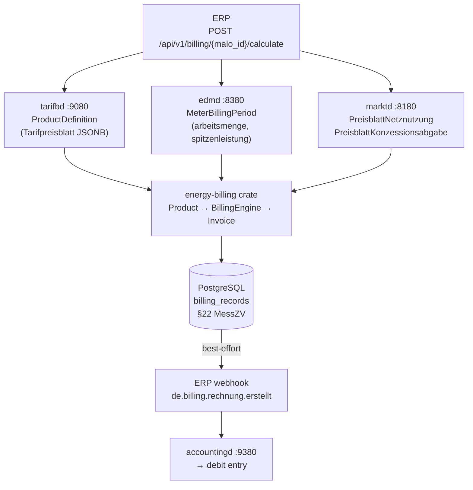
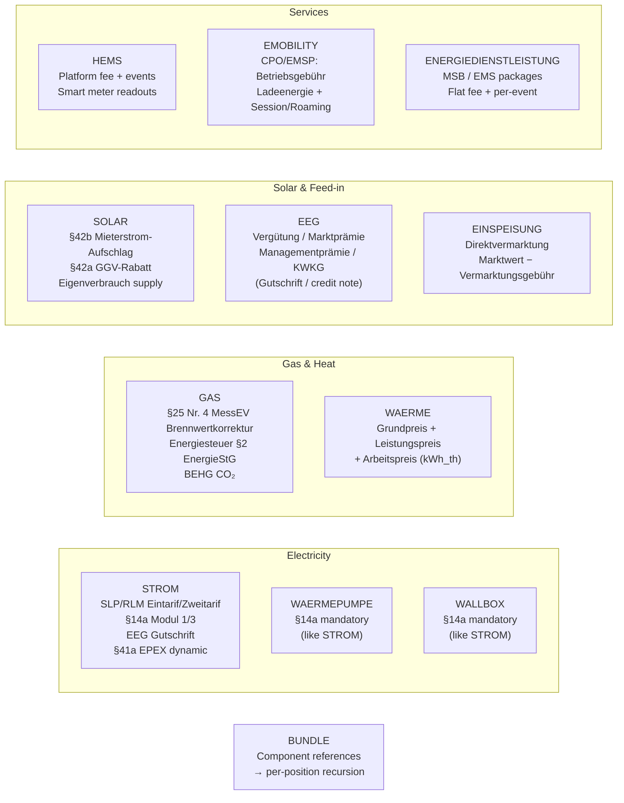
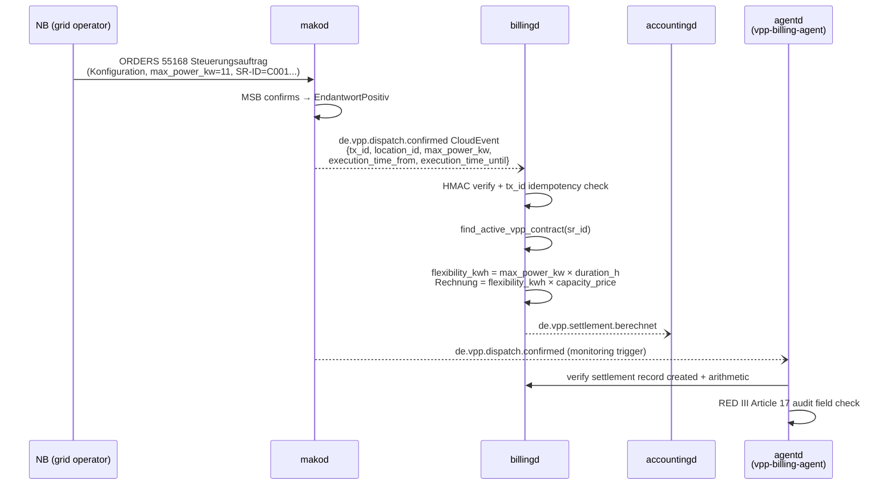

# `billingd` — Multi-Product Billing Engine

`billingd` is a **pure calculation service**. It has no grid topology knowledge and no
business policy — all decisions come from the product definition in `tarifbd` and the
measurement data in `edmd`.

Port: **`:9280`**

---

## Why pure calculation?

Every billing run is **deterministic and reproducible**: given the same inputs (product, meter,
tariff), the output is always the same `Rechnung`. This means:

- BNetzA §22 MessZV compliance: auditors can re-run the calculation from stored inputs
- No hidden state: all inputs are either stored in `tarifbd`, `edmd`, or `marktd`
- Testable: `energy-billing` has **190 tests** (property-based, golden master, integration) — zero I/O, zero async, all pure Rust

---

## Architecture: `energy-billing` crate

The pure billing logic lives in the **`energy-billing`** crate (extracted from `billingd`).
This follows the same pattern as `eeg-billing` for `einsd`:

```
billingd (HTTP service)
    │   config · persistence · CloudEvents · XRechnung
    │   HTTP endpoints · tarifbd/edmd/marktd clients
    │
    └── energy-billing (pure crate, crates.io)
            │   Product (typed enum, 12 variants)
            │   Quantities · BillingContext · RegulatoryRates
            │   BillingEngine (provider pipeline, validate + bill + bill_batch)
            │   Invoice { positions, warnings, netto_eur, mwst_eur, brutto_eur }
            │
            ├── ElectricityProvider      §41a EPEX; HT/NT; block tariffs; RLM demand
            ├── ControllableLoadProvider §14a Modul 1/3 (WAERMEPUMPE, WALLBOX)
            ├── GasProvider              §25 Nr. 4 MessEV Brennwertkorrektur; BEHG CO₂
            ├── HeatProvider             Fernwärme; auto-7% MwSt (renewable)
            ├── SolarProvider            §42b Mieterstrom; §42a GGV
            ├── EegProvider              LF-side Gutschrift; contractual §51
            ├── EinspeisungProvider      Direktvermarktung Marktwert
            ├── HemsProvider             Platform subscription + events
            ├── EmobilityProvider        CPO/EMSP
            ├── ServiceProvider          Energiedienstleistung
            ├── DynamicElectricityProvider  §41a per-interval EPEX (§41b iMSys guard)
            ├── EnergyShareProvider      §42c Energiegemeinschaft credit
            └── MwStProvider             Multi-rate MwSt (7% / 19% / 0% per position)
```

`energy-billing` is **zero I/O, zero async** — `BillingEngine::bill()` is a pure function
returning `Result<Invoice, EngineError>`; each error variant carries a stable
machine-readable `code()` that `billingd` surfaces in structured error bodies.
`Invoice` carries `positions: Vec<BillingPosition>`, `warnings: Vec<BillingWarning>`, and
exposes `to_rechnung_json()` (BO4E-compatible JSONB for `accountingd` ingestion).
Helper methods: `.assert_valid()`, `.total_by_tag()`, `.positions_by_tag()`,
`.kilowattstundenpreis_brutto_ct()`, `.has_errors()`.

Statutory rates (Stromsteuer, Energiesteuer Gas, BEHG CO₂) are injected via `RegulatoryRates`
from `billingd.toml` — zero hardcoded values in the crate.

---

## Calculation pipeline



---

## Product categories

`billingd` routes each billing request to a category-specific pure calculator.
**All commercial prices are user-defined in `tarifbd`** — the engine contains no hardcoded
rates. Statutory rates (Stromsteuer, Energiesteuer Gas, BEHG CO₂) are configured in
`billingd.toml` under `[rates]` and can be overridden per-product.



### STROM — Electricity

```
Grundpreis              [from tarifbd]     ct/day
Arbeitspreis            [from tarifbd]     ct/kWh
Leistungspreis          [from tarifbd]     ct/kW/month  RLM demand charge on spitzenleistung_kw
NNE Grundpreis          [from marktd]      pass-through
NNE Arbeitspreis        [from marktd]      pass-through
NNE Leistungspreis      [from marktd]      RLM only (EUR/kW/month)
Konzessionsabgabe       [from marktd]      pass-through
§14a Modul 1 Rabatt     [if product set]   negative EUR/kW/year
§14a Modul 3 Gutschrift [if product set]   negative, pro-rated to load-shedding hours
EEG Gutschrift          [from einsd]       negative, if PV self-consumption
Stromsteuer             [from billingd.toml, overridable per-product]  ct/kWh
──────────────────────────────────────────────────
Netto
MwSt [from billingd.toml or product override]
Brutto
```

Variants: `Eintarif`, `Zweitarif` (HT/NT), `Mehrtarif` (multiple registers).
**§41a EPEX dynamic**: when `dynamic_epex = true` in the product, `billingd` fetches
15-min Lastgang and prices per hour from `tarifbd`. `arbeitspreis_ct_per_kwh` is ignored.

**RLM demand charge**: For large commercial customers with measured peak demand (§4 MessZV,
≥100 MWh/year), set `leistungspreis_strom_ct_per_kw_month` in the product definition.
`billingd` bills `spitzenleistung_kw × rate` as a `Leistungspreis` position.
Supply `spitzenleistung_kw` from `edmd` MeterBillingPeriod. Applies to `metering_mode: RLM`
or `Imsys` metering points.

### GAS — Natural Gas

```
Brennwertkorrektur      [informational]    m³ × Hs × Z → kWh_Hs  (§25 Nr. 4 MessEV)
Grundpreis Gas          [from tarifbd]     ct/day
Arbeitspreis Gas        [from tarifbd]     ct/kWh_Hs
Gasnetzentgelt GP       [from marktd]      pass-through
Gasnetzentgelt AP       [from marktd]      pass-through
Konzessionsabgabe Gas   [from marktd]      pass-through
Bilanzierungsumlage Gas [from marktd]      pass-through
Energiesteuer Erdgas    [from billingd.toml] §2 EnergieStG  0.55 ct/kWh_Hs
                        OR Exemption notice when gas_energiesteuer_befreiung=true
                           (§54 EnergieStG KWK/industrial) — requires customer certificate
CO₂-Abgabe BEHG         [from billingd.toml] ~1.31 ct/kWh_Hs (65 EUR/t CO₂, 2026)
MwSt                    [from billingd.toml] 19%
```

**Historic statutory rates:** For retroactive correction invoices, the year tables in
`energy_billing::rates` apply the correct historical defaults: `effective_stromsteuer_for_year()`,
`effective_energiesteuer_gas_for_year()` (heating gas has been a constant 0.55 ct/kWh_Hs —
the 2022 Energiesteuersenkungsgesetz reduced motor-fuel rates only) and
`effective_behg_gas_for_year()`. VAT history is commodity-aware:
`mwst_rate_for_period()` covers the 2020 COVID 16 % window, and
`mwst_rate_for_gas_waerme_period()` additionally covers the **7 % gas/Fernwärme window
01.10.2022–31.03.2024** (§28 Abs. 5/6 UStG). Periods straddling a VAT boundary return
`None` — split at the Stichtag and merge the invoices.

Supply `gas_meter.messung_qm3` + `brennwert_kwh_per_qm3` + `zustandszahl` in the request.
`billingd` computes `kWh_Hs = m³ × Hs × Z` and uses it for all price positions.

**H2-blend / `gasqualitaet`:** Supply the optional `gasqualitaet` field from
`marktd.malo.gasqualitaet` (e.g. `"H_GAS"`, `"L_GAS"`, `"H2_BLEND"`). The field does **not**
alter the billing amount — per DVGW G 260, `edmd` already reports the measured Brennwert
reflecting the actual gas blend. `billingd` records `gasqualitaet` as a `ZusatzAttribut` on
the `Rechnung` for regulatory audit transparency, enabling operators to trace billing periods
during H2-blend transitions.

### WAERME — District Heat (Fernwärme)

```
Grundpreis Fernwärme    [from tarifbd]     EUR/month
Leistungspreis          [from tarifbd]     EUR/kW/month × peak kW
Arbeitspreis            [from tarifbd]     ct/kWh_th
MwSt
```

### SOLAR — Mieterstrom / §42a GGV

```
Arbeitspreis Solar      [from tarifbd]     ct/kWh  (Eigenverbrauch supply price)
Mieterstrom-Aufschlag   [from tarifbd]     ct/kWh  §42b EEG (BNetzA-capped annually)
§42a GGV-Rabatt         [from tarifbd]     ct/kWh  negative discount
Stromsteuer             skipped by default  §9a StromStG exemption for on-site Eigenverbrauch
MwSt
```

Set `solar_include_stromsteuer: true` in the product definition for non-exempt cases.

### EEG — Feed-in Settlement (Gutschrift)

Credit note for feed-in plant operators (§21 EEG Vergütung, §38 EEG Marktprämie):

```
EEG Einspeisevergütung  [from tarifbd]     ct/kWh (credit)
EEG Marktprämie         [from tarifbd]     ct/kWh (credit, per settlement period)
Managementprämie        [from tarifbd]     ct/kWh §53 EEG (fixed by technology)
KWKG Zuschlag           [from tarifbd]     ct/kWh (credit, if applicable)
MwSt
```

Net result is typically negative brutto (the LF pays the producer).

> **LF vs NB for §51 EEG Negativpreisregel**
>
> The mandatory §51 EEG implementation (suspension of Vergütung during negative-EPEX hours)
> lives in `eeg-billing` / `einsd` — this governs the **NB paying the plant operator** under
> the statutory EEG.
>
> The `EEG` category in `billingd` is for the **LF** (private contractual billing): Mieterstrom
> §38a contracts and Direktvermarktung arrangements where the LF is the contracting party.
> These are **private law contracts** not subject to statutory §51.
>
> For contracts that **voluntarily mirror §51** (e.g. "no credit during negative hours"):
> supply `eeg_meter.kwh_during_negative_epex` to suspend Vergütung/Marktprämie for those kWh.
> KWKG Zuschlag is always exempt (different law).
>
> `§12 Abs. 3 UStG` (0% MwSt for PV ≤30 kWp, from 01.01.2023): set
> `mwst_rate_override: 0` in the product definition in `tarifbd`.

### EINSPEISUNG — Direktvermarktung Settlement

```
Marktwert Strom         [from tarifbd]     ct/kWh (EPEX Spot Monatsmarktwert)
Vermarktungsgebühr      [from tarifbd]     ct/kWh negative (aggregator fee)
MwSt
```

### WAERMEPUMPE / WALLBOX — §14a Controlled Loads

Identical to `STROM` but §14a positions are **always included** when the product carries
`steuerungsrabatt_modul1_eur_per_kw_year` and/or `steuerungsrabatt_modul3_eur_per_kw_year`.
No separate provider — `Product::Waermepumpe` and `Product::Wallbox` variants use
`ControllableLoadProvider`, which delegates standard electricity billing to `ElectricityProvider`
and appends §14a Modul 1/3 credit positions.

Set `steuerungsrabatt_modul1_eur_per_kw_year` (annual capacity-based NNE reduction) and/or
`sect14a_modul1_nne_reduktion_ct_per_kwh` (per-kWh NNE reduction) in the product definition.

### HEMS / EMOBILITY / ENERGIEDIENSTLEISTUNG / BUNDLE

```
HEMS: Platform fee (EUR/month) + Optimization events + Smart meter readouts
EMOBILITY: Betriebsgebühr (EUR/month) + Ladeenergie (ct/kWh) + Session/Roaming fees
ENERGIEDIENSTLEISTUNG: Flat fee (EUR/period) + per-event charge
BUNDLE: per-component recursion — ERP must submit individual calculate requests per position
```

---


---

## Product and tariff model

### Product — type-safe dispatch

`Product` is a typed enum deserialized directly from `tarifbd` JSONB using the `"category"`
discriminator. Call `product.build_engine(&grid, &rates)` to obtain a configured `BillingEngine`:

```rust
// Deserializes from {"category":"STROM","arbeitspreis_ct_per_kwh":32.0,...}
let product: Product = serde_json::from_str(&product_json)?;
let engine = product.build_engine(&grid, &rates);
// No more Option<BillingEngine> or PricingModel::try_from() needed
let invoice = engine.bill(ctx, &quantities)?;
```

`Product` has 12 exhaustive variants, each wrapping a typed per-category struct:
`Strom(ElectricityProduct)`, `Waermepumpe/Wallbox(ControllableLoadProduct)`,
`Gas(GasProduct)`, `Waerme(HeatProduct)`, `Solar(SolarProduct)`,
`Eeg(EegProduct)`, `Einspeisung(EinspeisungProduct)`,
`Hems(HemsProduct)`, `Emobility(EmobilityProduct)`, `Energiedienstleistung(ServiceProduct)`,
`Sharing(SharingProduct)`.

### Regulatory additions

| Addition | Law |
|---|---|
| `anlage_kwp` on product → auto-0% MwSt | §12 Abs. 3 UStG (Solarpaket I 2023) |
| `industrie_stromsteuer_befreiung` → exemption notice | §9 Abs. 1 Nr. 4 StromStG |
| `preisgarantie_bis` → disclosure on invoice | §41 Abs. 1 Nr. 4 EnWG |
| `MeteringMode` (SLP/RLM/iMSys) on MeterInput | §3/§4 MessZV, §31 MsbG |
| `is_estimated` flag → §17 MessZV notice | §17 Abs. 1 MessZV |
| `zaehler_replaced` flag → Zählerwechsel notice | §41 EnWG |
| `Sect41aAnnualComparison` in Quantities | §41a Abs. 6 EnWG |
| `InvoiceType::PartialInvoice` | §41 EnWG, StromGVV §17 |

### Tarifwechsel endpoint

Mid-period price changes (§41 EnWG transparency requirement) are supported natively:

```http
POST /api/v1/billing/{malo_id}/tarifwechsel
Content-Type: application/json

{
  "lf_mp_id":    "9910000000002",
  "period_from": "2026-01-01",
  "period_to":   "2026-01-31",
  "switch_date": "2026-01-15",
  "old_tariff":  { "category": "STROM", "arbeitspreis_ct_per_kwh": 28.0 },
  "new_tariff":  { "category": "STROM", "arbeitspreis_ct_per_kwh": 32.0 },
  "old_meter":   { "arbeitsmenge_kwh": 140 },
  "new_meter":   { "arbeitsmenge_kwh": 170 }
}
```

Two sub-period invoices are calculated and merged via `Invoice::merge()`. Positions from
both sub-periods appear on one combined invoice. Tax is applied independently per sub-period
(correct per §41 EnWG for mid-month rate changes).

### Pro-rata Grundpreis (move-in / move-out)

`billingd` pro-rates Grundpreis when `vertragsbeginn` or `vertragsende` falls
within the billing period. Pass these in the `BillingContext`:

```json
{
  "vertragsbeginn": "2026-01-16"
}
```

A customer joining on Jan 16 is billed 16 × rate instead of 31 × rate.
A customer who moves in mid-period is charged the standing rate for the days
supplied, not the full period.

### Audit trail

Every billing run now generates a unique `billing_run_id` (UUID v4). It is stored on
`Invoice.billing_run_id` and propagated to:

- `billing_records.billing_run_id` in PostgreSQL
- `rechnung_json.zusatzAttribute["billingRunId"]`

This links each database record to the exact calculation output for §22 MessZV compliance.

## Triggering a billing run

```http
POST /api/v1/billing/51238696781/calculate
Content-Type: application/json

{
  "lf_mp_id":   "9910000000002",
  "nb_mp_id":   "9900000000001",
  "period_from": "2026-06-01",
  "period_to":   "2026-06-30",
  "rechnungsnummer": "R2026-06-001"
}
```

`billingd` automatically fetches:
1. Product from `tarifbd GET /api/v1/customer/51238696781/product`
2. Meter data from `edmd GET /api/v1/billing-period/51238696781?from=...&to=...`
3. NNE tariff from `marktd GET /api/v1/preisblaetter/{nb_mp_id}`
4. KA tariff from `marktd GET /api/v1/preisblaetter-ka/{nb_mp_id}`

**Override any input** by passing it directly in the request body — useful for testing
or when the upstream service is temporarily unavailable:

```http
POST /api/v1/billing/51238696781/calculate
Content-Type: application/json

{
  "lf_mp_id": "9910000000002",
  "nb_mp_id": "9900000000001",
  "period_from": "2026-06-01",
  "period_to": "2026-06-30",
  "meter": {
    "arbeitsmenge_kwh": "312.5",
    "sparte": "STROM"
  },
  "tariff": {
    "category": "STROM",
    "grundpreis_ct_per_day": "20.0",
    "arbeitspreis_ct_per_kwh": "32.0"
  }
}
```

### §41a Dynamic Tariff (iMSys)

When the product in `tarifbd` has `dynamic_epex: true`, `billingd` automatically:

1. Fetches 15-min Lastgang from `edmd` (`GET /api/v1/lastgang/{malo_id}?from=…&to=…`)
2. Fetches hourly EPEX prices from `tarifbd` (`GET /api/v1/epex-prices/{date}/hourly`) for each day
3. Calculates `Σ(kWh_interval × EPEX_hour_ct) / 100` as the energy cost
4. Adds NNE / Konzessionsabgabe / Stromsteuer as usual

The `tariff.arbeitspreis_ct_per_kwh` field is ignored when `dynamic_epex: true` — the EPEX
spot price from `tarifbd` is the actual price applied per hour.

**Price floor (`dynamic_epex_floor_ct_kwh`):** Set this field in the tarifbd product to cap
how low the EPEX price can go. Common configurations:
- `null` (default) — full pass-through; negative EPEX → customer receives a credit
- `0` — zero floor; negative EPEX bills at 0 ct/kWh (no credit, no charge)
- `5` — minimum 5 ct/kWh regardless of spot price

```json
{
  "category": "STROM",
  "dynamic_epex": true,
  "dynamic_epex_floor_ct_kwh": "0"
}
```

**Fallback**: when Lastgang data is unavailable, `billingd` falls back to `arbeitsmenge_kwh`
from `edmd`'s `billing-period` endpoint with the static `arbeitspreis_ct_per_kwh`.

```http
POST /api/v1/billing/51238696781/calculate
Content-Type: application/json

{
  "lf_mp_id": "9910000000002",
  "nb_mp_id": "9900000000001",
  "period_from": "2026-06-01",
  "period_to": "2026-06-30",
  "tariff": {
    "category": "STROM",
    "grundpreis_ct_per_day": "5.0",
    "dynamic_epex": true
  }
}
```

> EPEX prices must be imported daily into `tarifbd` via `PUT /api/v1/epex-prices/{date}`.

---

## Idempotency

`billing_records` has a partial unique index on `(malo_id, lf_mp_id, period_from,
period_to, product_code, tenant)` for non-correction, non-Sammel rows. Re-running
the same billing request updates the existing record **only while it is a draft**
(`outcome = 'generated'`) — a dispatched record refuses the overwrite and points
at the correction path.

---

## Endpoints

| Method | Path | Description |
|--------|------|-------------|
| `POST` | `/api/v1/billing/{malo_id}/calculate` | Calculate, persist, emit CloudEvent |
| `POST` | `/api/v1/billing/{malo_id}/preview` | Dry-run calculation (no persist, no CloudEvent) |
| `GET` | `/api/v1/billing` | List records (`?malo_id=&lf_mp_id=&outcome=`) |
| `GET` | `/api/v1/billing/{id}` | Fetch single record with full `Rechnung` JSONB |
| `GET` | `/api/v1/billing/{id}/xrechnung` | XRechnung 3.0 / ZUGFeRD 2.3 CII XML |
| `GET` | `/api/v1/billing/{id}/ubl` | PEPPOL BIS Billing 3.0 UBL 2.1 (EN16931) |
| `POST` | `/api/v1/billing/{id}/correction` | Korrekturrechnung / Stornorechnung (§22 MessZV) |
| `POST` | `/api/v1/billing/{malo_id}/tarifwechsel` | Combined invoice for mid-period price change (§41 EnWG) |
| `POST` | `/api/v1/billing/{id}/submit-b2g` | XRechnung B2G submission (§27 EGovG) |
| `GET` | `/health` | Liveness |
| `GET` | `/health/ready` | Readiness |
| `POST\|GET` | `/mcp` | MCP Streamable HTTP (LLM tooling) |

---

## MCP server

`billingd` ships a built-in MCP server at `/mcp` (Streamable HTTP 2025-11-25). **Twelve tools**
and six prompts are available to LLM agents:

| Tool | Description |
|---|
---|
| `list_billing_records` | List records for a MaLo — summary without full `Rechnung` |
| `get_billing_record` | Full BO4E `Rechnung` JSONB for a specific record UUID |
| `preview_billing` | Dry-run preview (calls `/preview` internally — no side effects) |
| `calculate_billing` | Trigger a real billing run (calls `/calculate`) |
| `get_xrechnung` | Fetch XRechnung 3.0 / ZUGFeRD 2.3 CII XML for B2G submission |
| `check_billing_anomaly` | Rolling 3-month deviation check — flags invoices outside threshold |
| `list_vpp_settlements` | List VPP aggregation settlement records |
| `list_corrections` | List Korrekturrechnung / Stornorechnung records (§22 MessZV) |
| `list_product_categories` | Describe all 13 billing categories and their required product fields |
| `get_billing_summary` | Aggregate stats per MaLo: total billed, avg monthly, by category |
| `validate_tariff_config` | Pre-flight: §41b iMSys guard, KAV plausibility, missing fields |
| `explain_invoice_position` | Full `PositionTrace` audit for a given position (formula, §-refs) |

| Prompt | Description |
|---|---|
| `order-to-cash` | Full O2C: GPKE Lieferbeginn → Jahresabschluss |
| `preview-invoice` | Step-by-step: preview before committing a billing run |
| `check-dynamic-tariff` | Verify §41a EPEX tariff configuration |
| `14a-steuerungsrabatt` | Configure §14a Modul 1/3 for Wärmepumpe / Wallbox |
| `eeg-billing` | Set up EEG / EINSPEISUNG billing with double-booking guard |
| `gas-billing` | Configure Brennwertkorrektur, BEHG CO₂, H2-blend, L-Gas |

The `tariff-optimization-agent` in `agentd` calls `list_billing_records` and
`get_billing_summary` to detect customers on sub-optimal tariffs and automatically suggests
§41a dynamic tariff switches for iMSys customers.

---

## Korrekturrechnung (§22 MessZV)

`POST /api/v1/billing/{id}/correction` creates a Korrekturrechnung or Stornorechnung:

```json
{ "reason": "Falsche Zählerstandsaufnahme Q2 2026", "negate": true }
```

- `negate: true` → Stornorechnung (all positions negated, `is_correction: true` in DB)
- `negate: false` → Korrekturrechnung (amended positions only)

Both variants include `zusatzAttribute.originalRechnungsnummer` for §22 MessZV audit trail.

A second correction of the same original is refused with `409 Conflict` —
`KORR-{original_nr}` must stay einmalig (§14 Abs. 4 Nr. 4 UStG), and a double
negation would corrupt the accounting ledger.

---

### ENERGIEDIENSTLEISTUNG products

When `tariff.category == "ENERGIEDIENSTLEISTUNG"`, `billingd` deserializes the product JSON to
`Product::Energiedienstleistung(ServiceProduct)` and builds a `ServiceProvider`:

```json
{
  "lf_mp_id": "9910000000002",
  "nb_mp_id": "9900000000001",
  "period_from": "2026-06-01",
  "period_to": "2026-06-30",
  "tariff": {
    "category": "ENERGIEDIENSTLEISTUNG",
    "service_fee_eur": "14.99",
    "service_event_price_eur": "0.05"
  },
  "service_meter": {
    "months": "1",
    "event_count": 30
  }
}
```

Generates two positions: `ServiceFee` (monthly Grundgebühr) and `EventFee` (per-readout charge).

---

## XRechnung / ZUGFeRD 2.3

`GET /api/v1/billing/{id}/xrechnung` returns structured invoice XML for any stored billing record.

**Standard:** ZUGFeRD 2.3 Extended / XRechnung 3.0 CIUS — profile identifier:
`urn:cen.eu:en16931:2017#compliant#urn:xoev-de:kosit:standard:xrechnung_3.0`

**Format:** CII (Cross Industry Invoice, CII D16B) — the German FERD/ZUGFeRD standard.

**Legal mandate:**
- **B2G invoices:** mandatory from 01.01.2027 (§§27 EGovG, 4 E-Rechnungsverordnung; EU Directive 2014/55/EU transposed)
- **B2B invoices:** mandatory from 01.01.2028 (§14 UStG n.F. — E-Rechnungspflicht)

EEG plant operators who are municipalities or public-law entities require XRechnung for all
incoming service invoices today.

**Response headers:**
```
Content-Type: application/xml; charset=UTF-8
Content-Disposition: attachment; filename="xrechnung-{id}.xml"
```

**Due date (BT-9):** rendered from the Rechnung's `zahlungsziel` (issue + 14
days) — §40c EnWG lets payment become due at the earliest two weeks after
receipt of the payment request. The UBL endpoint and the MCP `get_xrechnung`
tool use the same value; all three render the stored per-rate `steuerbetraege`
as the EN16931 BG-23 breakdown, so 19 % / 7 % / 0 % mixed invoices reconcile.

**Configuration for XRechnung:**
```toml
seller_vat_id = "DE123456789"   # BT-31 Seller VAT registration number
```

---

## §40b scheduled billing runs

The `[billing_runs]` worker (default off) sweeps daily after `run_hour_utc`:
active contracts and their `abrechnungszyklus` come from vertragd
(`GET /api/v1/vertraege/billing-candidates`); each contract's most recently
completed period (previous month/quarter/half, or the rolling year before the
`vertragsbeginn` anniversary for JAEHRLICH) is billed through the same
pipeline as `POST …/calculate`, skipping periods that already have a
`billing_records` row. Monthly audit lives in `billing_run_log` (one
accumulated row per tenant/LF/month; any failed sweep pins the month
`failed`). iMSys MaLos additionally receive the free monthly
Abrechnungsinformation (§40b Abs. 2 EnWG) as
`de.billing.abrechnungsinformation.monatlich`, logged in
`abrechnungsinfo_log` — exactly once per MaLo and month.

---

## Preview (dry-run)

`POST /api/v1/billing/{malo_id}/preview` runs the full calculation pipeline without
persisting a record or emitting a CloudEvent.

```http
POST /api/v1/billing/51238696781/preview
Content-Type: application/json

{
  "lf_mp_id": "9910000000002",
  "nb_mp_id": "9900000000001",
  "period_from": "2026-06-01",
  "period_to": "2026-06-30"
}
```

Returns `{ "preview": true, "netto_eur": "…", "brutto_eur": "…", "rechnung": { … } }`.

Useful for:
- ERP billing simulations before committing to a monthly run
- Customer portal "estimated invoice" features via `portald`
- Plausibility checks before importing a new tariff into `tarifbd`

---

## Database schema

### `billing_records`

| Column | Notes |
|--------|-------|
| `id` | UUID primary key |
| `malo_id`, `lf_mp_id` | MaLo + LF identity |
| `product_code`, `category` | Product reference (`VPP` for dispatch settlements) |
| `period_from`, `period_to` | Billing period |
| `rechnung_json` | Full BO4E `Rechnung` JSONB (§22 MessZV) |
| `total_netto_eur`, `total_brutto_eur` | Cached totals for fast reporting |
| `outcome` | `generated` → `dispatched` → `paid`/`disputed` |
| `ce_id` | CloudEvent ID of emitted `de.billing.rechnung.erstellt` |

### `vpp_contracts`

Maps a `SteuerbareRessource`-ID (SR-ID) to the billing parameters needed for automatic
VPP settlement via `POST /api/v1/webhooks/vpp-dispatch`.

| Column | Notes |
|--------|-------|
| `sr_id` | SteuerbareRessource-ID (`C…`) or NeLo-ID (`10Y…` / `E…`) |
| `vpp_id` | Operator-assigned VPP portfolio identifier (used as path on `/billing/vpp/{vpp_id}`) |
| `malo_id`, `lf_mp_id` | Aggregation point + invoice issuer |
| `capacity_price_eur_per_kwh` | Agreed Einsatzkosten per kWh — from TSO/DSO bilateral contract |
| `valid_from`, `valid_to` | Contract validity window; `valid_to NULL` = currently active |
| `mwst_rate_override` | Override MwSt rate (defaults to `billingd.toml` global) |

### `vpp_dispatch_ledger`

Idempotency table for `de.vpp.dispatch.confirmed` webhook delivery. Each `tx_id` is
recorded exactly once per tenant; retried deliveries return `202 Accepted` without
re-billing.

| Column | Notes |
|--------|-------|
| `tx_id` | Transaction ID from the `WimSteuerungsauftrag` (primary key) |
| `tenant` | Tenant data-isolation key |
| `record_id` | FK to `billing_records.id` (NULL if `vpp_auto_billing = false`) |

---

## VPP Aggregation Billing (RED III Article 17)

`billingd` supports fully automatic VPP (Virtual Power Plant) dispatch-to-billing,
closing the loop from ORDRSP confirmation to BO4E `Rechnung` without operator intervention.

### Architecture



### Setup

**1. Register a VPP contract** for each controllable resource:

```bash
curl -s -X PUT "http://billingd:9280/api/v1/billing/vpp-contracts/C0001234567890" \
  -H "Authorization: Bearer <token>" \
  -H "Content-Type: application/json" \
  -d '{
    "id": "00000000-0000-0000-0000-000000000000",
    "vpp_id": "VPP-PORTFOLIO-001",
    "malo_id": "51238696781",
    "lf_mp_id": "9910000000002",
    "capacity_price_eur_per_kwh": "0.12",
    "valid_from": "2026-01-01",
    "mwst_rate_override": null,
    "tenant": "9910000000002",
    "updated_at": "2026-01-01T00:00:00Z"
  }'
```

**2. Enable auto-billing** in `billingd.toml`:

```toml
vpp_auto_billing       = true
inbound_webhook_secret = "env:BILLINGD_INBOUND_HMAC_SECRET"
```

**3. Register `billingd` as a subscriber** in `marktd` so it receives
`de.vpp.dispatch.confirmed` events from `makod`'s outbox via the `marktd` EventBus fan-out:

```bash
curl -s -X PUT "http://marktd:8180/api/v1/subscriptions/billingd-vpp" \
  -H "Authorization: Bearer <token>" \
  -H "Content-Type: application/json" \
  -d '{
    "webhook_url": "http://billingd:9280/api/v1/webhooks/vpp-dispatch",
    "event_types": ["de.vpp.dispatch.confirmed"],
    "hmac_secret": "env:BILLINGD_INBOUND_HMAC_SECRET"
  }'
```

### Flexibility calculation

`flexibility_kwh = max_power_kw × (execution_time_until − execution_time_from) / 3600`

When `execution_time_until` is absent, `billingd` falls back to **15 minutes**
(the statutory BNetzA §14a minimum dispatch window).

### Invoice shape

Each auto-billed dispatch generates a `Rechnung` with:
- `category = "VPP"`, `product_code = "VPP_{vpp_id}"`  
- One `Rechnungsposition` with `positionstyp = "vpp_dispatch"` and a `zeitraum` covering the exact dispatch window
- `zusatzAttribute`: `regulatory_basis = "RED III Article 17"`, `tx_id`, `sr_id`, `flexibility_kwh`
- The `tx_id` cross-references the originating `WimSteuerungsauftrag` process in `makod`

### Manual fallback

When `vpp_auto_billing = false` or no contract exists for the SR-ID, the webhook records
the dispatch in `vpp_dispatch_ledger` without generating a `Rechnung`. Operators can
still trigger billing manually via `POST /api/v1/billing/vpp/{vpp_id}` at any time.

### Monitoring

The built-in `vpp-billing-agent` in `agentd` monitors the pipeline for completeness:

- **Settlement completeness**: verifies every `de.vpp.dispatch.confirmed` produced a matching settlement within the SLA window
- **Arithmetic validation**: `flexibility_kwh = max_power_kw × duration_h`; flags deviations
- **RED III Article 17 audit**: confirms all required `zusatzAttribute` fields are present
- **Missing contract escalation**: alerts operator if no `vpp_contracts` row exists for the SR-ID

---

## EN16931 VAT breakdown (BG-23)

EN16931 requires **one VAT breakdown entry per category and rate**, each with its
own taxable base (BT-116) and tax amount (BT-117). A single aggregate `mwst_eur`
cannot express that.

`energy_billing::invoice::tax_subtotals_of` groups the positions by effective
rate — a position's own `applicable_tax_rate` when set, otherwise the engine
default — and the XRechnung/ZUGFeRD generator emits one `ApplicableTradeTax`
block per subtotal.

This matters because multi-rate invoices are already reachable:

| Rate | Case |
|---|---|
| 19 % | standard supply |
| 7 % | Fernwärme, §12 Abs. 2 Nr. 1 UStG |
| 0 % | Solar ≤ 30 kWp, §12 Abs. 3 UStG (Solarpaket I) |

**Zero-rated bases are included** (category `Z`). Omitting them would leave the
sum of the taxable bases short of the invoice net, which is precisely what the
EN16931 total-reconciliation rules check.

`Tax`, `Abschlag` and `Info` positions are excluded from the base — they are not
supplies, and including them would levy VAT on VAT.

Each subtotal projects to BO4E via `TaxSubtotal::to_bo4e()` →
`rubo4e::current::Steuerbetrag`, carrying `basiswert`, `steuerwert`, `steuersatz`
(as a percentage, matching BT-119) and `steuerart` (`Ust`, or `Rcv` for §13b
reverse charge).

The breakdown is **derived, never stored**: a persisted copy could disagree with
the positions it summarises. It is emitted on the BO4E Rechnung as
`steuerbetraege`, whose entries must sum to `gesamtsteuer`, and carried into the
XRechnung/ZUGFeRD CII as BG-23.

## Advance payments on the invoice

A Jahresabrechnung settles the Abschläge the customer already paid. They appear on
the BO4E Rechnung as `vorauszahlungen` — one `Vorauszahlung` per payment with its
gross amount and the date it was received, so the reconciliation is verifiable per
payment as §41 EnWG requires, rather than as one lump sum.

In the CII rendering they drive the monetary summary:

| Term | CII element | Value |
|---|---|---|
| BT-112 | `GrandTotalAmount` | gross for the period |
| BT-113 | `TotalPrepaidAmount` | sum of the advances, gross |
| BT-115 | `DuePayableAmount` | BT-112 − BT-113 |

BT-115 is **derived**, per EN 16931 rule BR-CO-16. Emitting the gross there would
bill the customer a second time for advances they have already settled.

The tax contained in the advances is available as `Invoice::abschlag_ust_eur`,
which §14 Abs. 5 Satz 2 UStG requires an Endrechnung to state. See
[`energy-billing`](../crates/energy-billing/README.md) for the two settlement
forms — Endrechnung by deduction, or Restrechnung by residual.

## Configuration

```toml
# billingd.toml
database_url  = "postgresql://billingd:secret@db:5432/billingd"
port          = 9280
tenant        = "9910000000002"
tarifbd_url   = "http://tarifbd:9080"
edmd_url      = "http://edmd:8380"
marktd_url    = "http://marktd:8180"

# §3 StromStG: Stromsteuer 2.05 ct/kWh (valid since 01.07.2023)
stromsteuer_ct_per_kwh = "0.0205"
mwst_rate              = "0.19"

# Seller VAT ID for XRechnung / ZUGFeRD (B2G mandate 01.01.2027)
seller_vat_id = "DE123456789"

# Optional: ERP webhook
erp_webhook_url = "http://erp:8000/webhooks/billing"

# VPP dispatch-to-billing automation (RED III Article 17)
# Set vpp_auto_billing = true and register vpp_contracts for each SR-ID.
vpp_auto_billing       = false          # flip to true to enable auto-billing
inbound_webhook_secret = "env:BILLINGD_INBOUND_HMAC_SECRET"  # HMAC for POST /webhooks/vpp-dispatch
```
