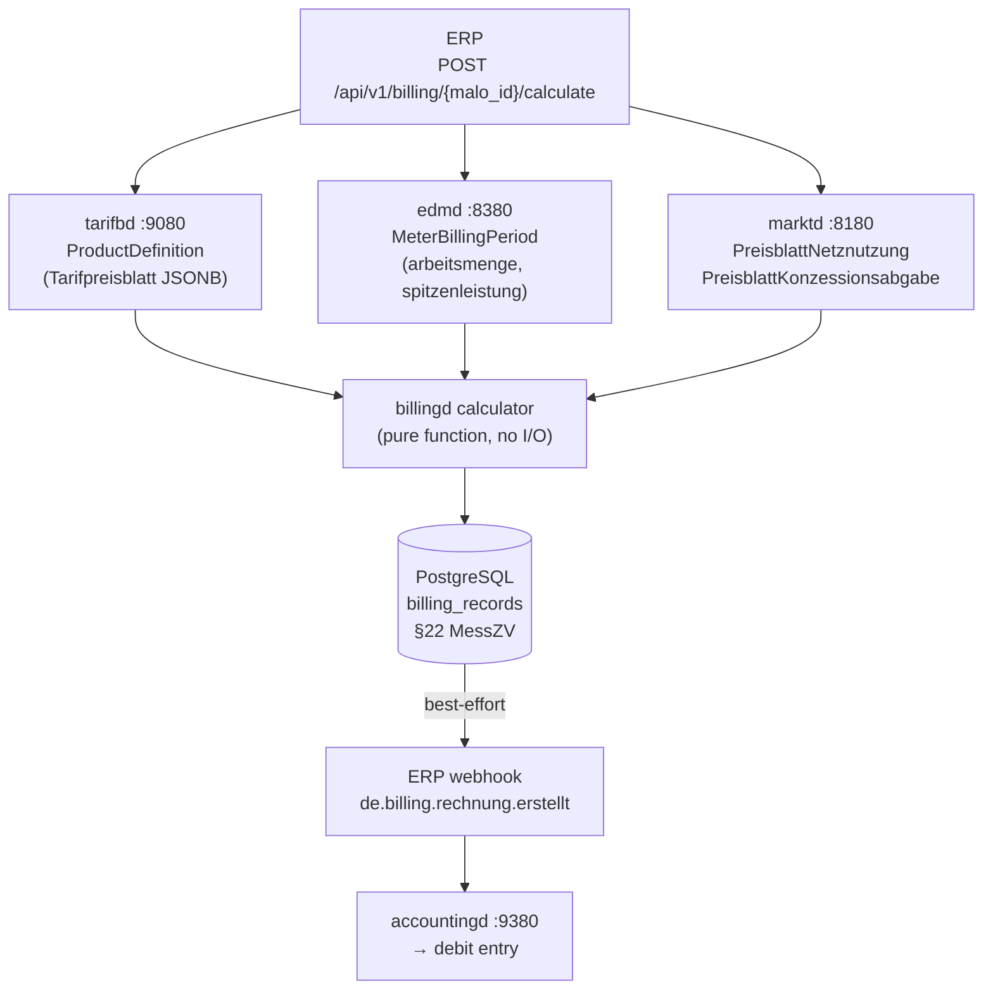

# `billingd` — Multi-Product Billing Engine

`billingd` is a **pure calculation service**. It has no grid topology knowledge and no
business policy — all decisions come from the product definition in `tarifbd` and the
measurement data in `edmd`.

Port: **`:9280`**

---

## Why pure calculation?

Every billing run is **deterministic and reproducible**: given the same inputs (product, meter,
tariff), the output is always the same `Rechnung`. This means:

- BNetzA §22 MessZV compliance: auditors can re-run the calculation from stored inputs
- No hidden state: all inputs are either stored in `tarifbd`, `edmd`, or `marktd`
- Testable: `energy-billing` has **44 unit tests** with known in/out pairs, all pure Rust

---

## Architecture: `energy-billing` crate

The pure billing logic lives in the **`energy-billing`** crate (extracted from `billingd`).
This follows the same pattern as `eeg-billing` for `einsd`:

```
billingd (HTTP service)
    │   config · persistence · CloudEvents · XRechnung
    │   HTTP endpoints · tarifbd/edmd/marktd clients
    │
    └── energy-billing (pure crate, crates.io)
            │   TariffInput · MeterInput · GridInput · RegulatoryRates
            │   BillingResult { positions, netto_eur, mwst_eur, brutto_eur, rechnung_json }
            │
            ├── calculate_strom()          §14a Modul 1/3, §41a EPEX, Zweitarif
            ├── calculate_gas()            §10 GasGVV, §2 EnergieStG, BEHG CO₂
            ├── calculate_waerme()         Fernwärme Grund/Leistungs/Arbeitspreis
            ├── calculate_solar()          §42b Mieterstrom, §42a GGV
            ├── calculate_eeg()            §21/§38 EEG Vergütung/Marktprämie, KWKG
            ├── calculate_einspeisung()    Direktvermarktung Marktwert
            ├── calculate_hems()           Platform fee + events
            ├── calculate_emobility()      CPO/EMSP billing
            ├── calculate_energiedienstleistung()
            └── calculate_dynamic_strom()  §41a EPEX per-interval
```

`energy-billing` is **zero I/O, zero async** — every function is a pure `Result<BillingResult, _>`.
The `BillingResult` carries `positions: Vec<billing::LineItem>` and `rechnung_json` (BO4E-compatible JSONB).
Helper methods: `.assert_valid()`, `.position_total_by_tag()`, `.levy_total_eur()`.

Statutory rates (Stromsteuer, Energiesteuer Gas, BEHG CO₂) are injected via `RegulatoryRates`
from `billingd.toml` — zero hardcoded values in the crate.

---

## Calculation pipeline



---

## Product categories

`billingd` routes each billing request to a category-specific pure calculator.
**All commercial prices are user-defined in `tarifbd`** — the engine contains no hardcoded
rates. Statutory rates (Stromsteuer, Energiesteuer Gas, BEHG CO₂) are configured in
`billingd.toml` under `[rates]` and can be overridden per-product.


### STROM — Electricity

```
Grundpreis              [from tarifbd]     ct/day
Arbeitspreis            [from tarifbd]     ct/kWh
NNE Grundpreis          [from marktd]      pass-through
NNE Arbeitspreis        [from marktd]      pass-through
NNE Leistungspreis      [from marktd]      RLM only (EUR/kW/month)
Konzessionsabgabe       [from marktd]      pass-through
§14a Modul 1 Rabatt     [if product set]   negative EUR/kW/year
§14a Modul 3 Gutschrift [if product set]   negative, pro-rated to load-shedding hours
EEG Gutschrift          [from einsd]       negative, if PV self-consumption
Stromsteuer             [from billingd.toml, overridable per-product]  ct/kWh
──────────────────────────────────────────────────
Netto
MwSt [from billingd.toml or product override]
Brutto
```

Variants: `Eintarif`, `Zweitarif` (HT/NT), `Mehrtarif` (multiple registers).
**§41a EPEX dynamic**: when `dynamic_epex = true` in the product, `billingd` fetches
15-min Lastgang and prices per hour from `tarifbd`. `arbeitspreis_ct_per_kwh` is ignored.

### GAS — Natural Gas

```
Brennwertkorrektur      [informational]    m³ × Hs × Z → kWh_Hs  (§10 GasGVV)
Grundpreis Gas          [from tarifbd]     ct/day
Arbeitspreis Gas        [from tarifbd]     ct/kWh_Hs
Gasnetzentgelt GP       [from marktd]      pass-through
Gasnetzentgelt AP       [from marktd]      pass-through
Konzessionsabgabe Gas   [from marktd]      pass-through
Bilanzierungsumlage Gas [from marktd]      pass-through
Energiesteuer Erdgas    [from billingd.toml] §2 EnergieStG  0.55 ct/kWh_Hs
CO₂-Abgabe BEHG         [from billingd.toml] ~1.11 ct/kWh_Hs (55 EUR/t CO₂, 2025)
MwSt                    [from billingd.toml] 19%
```

Supply `gas_meter.messung_qm3` + `brennwert_kwh_per_qm3` + `zustandszahl` in the request.
`billingd` computes `kWh_Hs = m³ × Hs × Z` and uses it for all price positions.

**H2-blend / `gasqualitaet`:** Supply the optional `gasqualitaet` field from
`marktd.malo.gasqualitaet` (e.g. `"H_GAS"`, `"L_GAS"`, `"H2_BLEND"`). The field does **not**
alter the billing amount — per DVGW G 260, `edmd` already reports the measured Brennwert
reflecting the actual gas blend. `billingd` records `gasqualitaet` as a `ZusatzAttribut` on
the `Rechnung` for regulatory audit transparency, enabling operators to trace billing periods
during H2-blend transitions.

### WAERME — District Heat (Fernwärme)

```
Grundpreis Fernwärme    [from tarifbd]     EUR/month
Leistungspreis          [from tarifbd]     EUR/kW/month × peak kW
Arbeitspreis            [from tarifbd]     ct/kWh_th
MwSt
```

### SOLAR — Mieterstrom / §42a GGV

```
Arbeitspreis Solar      [from tarifbd]     ct/kWh  (Eigenverbrauch supply price)
Mieterstrom-Aufschlag   [from tarifbd]     ct/kWh  §42b EEG (BNetzA-capped annually)
§42a GGV-Rabatt         [from tarifbd]     ct/kWh  negative discount
Stromsteuer             skipped by default  §9a StromStG exemption for on-site Eigenverbrauch
MwSt
```

Set `solar_include_stromsteuer: true` in the product definition for non-exempt cases.

### EEG — Feed-in Settlement (Gutschrift)

Credit note for feed-in plant operators (§21 EEG Vergütung, §38 EEG Marktprämie):

```
EEG Einspeisevergütung  [from tarifbd]     ct/kWh (credit)
EEG Marktprämie         [from tarifbd]     ct/kWh (credit, per settlement period)
Managementprämie        [from tarifbd]     ct/kWh §53 EEG (fixed by technology)
KWKG Zuschlag           [from tarifbd]     ct/kWh (credit, if applicable)
MwSt
```

Net result is typically negative brutto (the LF pays the producer).

> **LF vs NB for §51 EEG Negativpreisregel**
>
> The mandatory §51 EEG implementation (suspension of Vergütung during negative-EPEX hours)
> lives in `eeg-billing` / `einsd` — this governs the **NB paying the plant operator** under
> the statutory EEG.
>
> The `EEG` category in `billingd` is for the **LF** (private contractual billing): Mieterstrom
> §38a contracts and Direktvermarktung arrangements where the LF is the contracting party.
> These are **private law contracts** not subject to statutory §51.
>
> For contracts that **voluntarily mirror §51** (e.g. "no credit during negative hours"):
> supply `eeg_meter.kwh_during_negative_epex` to suspend Vergütung/Marktprämie for those kWh.
> KWKG Zuschlag is always exempt (different law).
>
> `§12 Abs. 3 UStG` (0% MwSt for PV ≤30 kWp, from 01.01.2023): set
> `mwst_rate_override: 0` in the product definition in `tarifbd`.

### EINSPEISUNG — Direktvermarktung Settlement

```
Marktwert Strom         [from tarifbd]     ct/kWh (EPEX Spot Monatsmarktwert)
Vermarktungsgebühr      [from tarifbd]     ct/kWh negative (aggregator fee)
MwSt
```

### WAERMEPUMPE / WALLBOX — §14a Controlled Loads

Identical to `STROM` but §14a positions are **always included** when the product carries
`steuerungsrabatt_modul1_eur_per_kw_year` and/or `steuerungsrabatt_modul3_eur_per_kw_year`.
No separate calculation function — routes to `calculate_strom()`.

### HEMS / EMOBILITY / ENERGIEDIENSTLEISTUNG / BUNDLE

```
HEMS: Platform fee (EUR/month) + Optimization events + Smart meter readouts
EMOBILITY: Betriebsgebühr (EUR/month) + Ladeenergie (ct/kWh) + Session/Roaming fees
ENERGIEDIENSTLEISTUNG: Flat fee (EUR/period) + per-event charge
BUNDLE: per-component recursion — ERP must submit individual calculate requests per position
```

---

## Triggering a billing run

```http
POST /api/v1/billing/51238696781/calculate
Content-Type: application/json

{
  "lf_mp_id":   "9910000000002",
  "nb_mp_id":   "9900000000001",
  "period_from": "2026-06-01",
  "period_to":   "2026-06-30",
  "rechnungsnummer": "R2026-06-001"
}
```

`billingd` automatically fetches:
1. Product from `tarifbd GET /api/v1/customer/51238696781/product`
2. Meter data from `edmd GET /api/v1/billing-period/51238696781?from=...&to=...`
3. NNE tariff from `marktd GET /api/v1/preisblaetter/{nb_mp_id}`
4. KA tariff from `marktd GET /api/v1/preisblaetter-ka/{nb_mp_id}`

**Override any input** by passing it directly in the request body — useful for testing
or when the upstream service is temporarily unavailable:

```http
POST /api/v1/billing/51238696781/calculate
Content-Type: application/json

{
  "lf_mp_id": "9910000000002",
  "nb_mp_id": "9900000000001",
  "period_from": "2026-06-01",
  "period_to": "2026-06-30",
  "meter": {
    "arbeitsmenge_kwh": "312.5",
    "sparte": "STROM"
  },
  "tariff": {
    "category": "STROM",
    "grundpreis_ct_per_day": "20.0",
    "arbeitspreis_ct_per_kwh": "32.0"
  }
}
```

### §41a Dynamic Tariff (iMSys)

When the product in `tarifbd` has `dynamic_epex: true`, `billingd` automatically:

1. Fetches 15-min Lastgang from `edmd` (`GET /api/v1/lastgang/{malo_id}?from=…&to=…`)
2. Fetches hourly EPEX prices from `tarifbd` (`GET /api/v1/epex-prices/{date}/hourly`) for each day
3. Calculates `Σ(kWh_interval × EPEX_hour_ct) / 100` as the energy cost
4. Adds NNE / Konzessionsabgabe / Stromsteuer as usual

The `tariff.arbeitspreis_ct_per_kwh` field is ignored when `dynamic_epex: true` — the EPEX
spot price from `tarifbd` is the actual price applied per hour.

**Price floor (`dynamic_epex_floor_ct_kwh`):** Set this field in the tarifbd product to cap
how low the EPEX price can go. Common configurations:
- `null` (default) — full pass-through; negative EPEX → customer receives a credit
- `0` — zero floor; negative EPEX bills at 0 ct/kWh (no credit, no charge)
- `5` — minimum 5 ct/kWh regardless of spot price

```json
{
  "category": "STROM",
  "dynamic_epex": true,
  "dynamic_epex_floor_ct_kwh": "0"
}
```

**Fallback**: when Lastgang data is unavailable, `billingd` falls back to `arbeitsmenge_kwh`
from `edmd`'s `billing-period` endpoint with the static `arbeitspreis_ct_per_kwh`.

```http
POST /api/v1/billing/51238696781/calculate
Content-Type: application/json

{
  "lf_mp_id": "9910000000002",
  "nb_mp_id": "9900000000001",
  "period_from": "2026-06-01",
  "period_to": "2026-06-30",
  "tariff": {
    "category": "STROM",
    "grundpreis_ct_per_day": "5.0",
    "dynamic_epex": true
  }
}
```

> EPEX prices must be imported daily into `tarifbd` via `PUT /api/v1/epex-prices/{date}`.

---

## Idempotency

`billing_records` has a unique constraint on `(malo_id, lf_mp_id, period_from, period_to, product_code)`.
Re-running the same billing request updates the existing record — safe to retry.

---

## Endpoints

| Method | Path | Description |
|--------|------|-------------|
| `POST` | `/api/v1/billing/{malo_id}/calculate` | Calculate, persist, emit CloudEvent |
| `POST` | `/api/v1/billing/{malo_id}/preview` | Dry-run calculation (no persist, no CloudEvent) |
| `GET` | `/api/v1/billing` | List records (`?malo_id=&lf_mp_id=&outcome=`) |
| `GET` | `/api/v1/billing/{id}` | Fetch single record with full `Rechnung` JSONB |
| `GET` | `/api/v1/billing/{id}/xrechnung` | XRechnung 3.0 / ZUGFeRD 2.3 CII XML |
| `GET` | `/api/v1/billing/{id}/ubl` | PEPPOL BIS Billing 3.0 UBL 2.1 (EN16931) |
| `POST` | `/api/v1/billing/{id}/correction` | Korrekturrechnung / Stornorechnung (§22 MessZV) |
| `POST` | `/api/v1/billing/{id}/submit-b2g` | XRechnung B2G submission (§27 EGovG) |
| `GET` | `/health` | Liveness |
| `GET` | `/health/ready` | Readiness |
| `POST\|GET` | `/mcp` | MCP Streamable HTTP (LLM tooling) |

---

## MCP server

`billingd` ships a built-in MCP server at `/mcp` (Streamable HTTP, 2025-11-05). Ten tools
and six prompts are available to LLM agents:

| Tool | Description |
|---|---|
| `list_billing_records` | List records for a MaLo — summary without full `Rechnung` |
| `get_billing_record` | Full BO4E `Rechnung` JSONB for a specific record UUID |
| `preview_billing` | Dry-run preview (calls `/preview` internally — no side effects) |
| `calculate_billing` | Trigger a real billing run (calls `/calculate`) |
| `get_xrechnung` | Fetch XRechnung 3.0 / ZUGFeRD 2.3 CII XML for B2G submission |
| `check_billing_anomaly` | Rolling 3-month deviation check — flags invoices outside threshold |
| `list_vpp_settlements` | List VPP aggregation settlement records |
| `list_corrections` | List Korrekturrechnung / Stornorechnung records (§22 MessZV) |
| `list_product_categories` | Describe all 12 categories + required `TariffInput` fields |
| `get_billing_summary` | Aggregate stats per MaLo: total billed, avg monthly, by category |

| Prompt | Description |
|---|---|
| `order-to-cash` | Full O2C: GPKE Lieferbeginn → Jahresabschluss |
| `preview-invoice` | Step-by-step: preview before committing a billing run |
| `check-dynamic-tariff` | Verify §41a EPEX tariff configuration |
| `14a-steuerungsrabatt` | Configure §14a Modul 1/3 for Wärmepumpe / Wallbox |
| `eeg-billing` | Set up EEG / EINSPEISUNG billing with double-booking guard |
| `gas-billing` | Configure Brennwertkorrektur, BEHG CO₂, H2-blend, L-Gas |

The `tariff-optimization-agent` in `agentd` calls `list_billing_records` and
`get_billing_summary` to detect customers on sub-optimal tariffs and automatically suggests
§41a dynamic tariff switches for iMSys customers.

---

## Korrekturrechnung (§22 MessZV)

`POST /api/v1/billing/{id}/correction` creates a Korrekturrechnung or Stornorechnung:

```json
{ "reason": "Falsche Zählerstandsaufnahme Q2 2026", "negate": true }
```

- `negate: true` → Stornorechnung (all positions negated, `is_correction: true` in DB)
- `negate: false` → Korrekturrechnung (amended positions only)

Both variants include `zusatzAttribute.originalRechnungsnummer` for §22 MessZV audit trail.

---

### ENERGIEDIENSTLEISTUNG products

When `tariff.category == "ENERGIEDIENSTLEISTUNG"`, `billingd` routes to `calculate_energiedienstleistung()`:

```json
{
  "lf_mp_id": "9910000000002",
  "nb_mp_id": "9900000000001",
  "period_from": "2026-06-01",
  "period_to": "2026-06-30",
  "tariff": {
    "category": "ENERGIEDIENSTLEISTUNG",
    "service_fee_eur": "14.99",
    "service_event_price_eur": "0.05"
  },
  "service_meter": {
    "months": "1",
    "event_count": 30
  }
}
```

Generates two positions: `ServiceFee` (monthly Grundgebühr) and `EventFee` (per-readout charge).

---

## XRechnung / ZUGFeRD 2.3

`GET /api/v1/billing/{id}/xrechnung` returns structured invoice XML for any stored billing record.

**Standard:** ZUGFeRD 2.3 Extended / XRechnung 3.0 CIUS — profile identifier:
`urn:cen.eu:en16931:2017#compliant#urn:xoev-de:kosit:standard:xrechnung_3.0`

**Format:** CII (Cross Industry Invoice, CII D16B) — the German FERD/ZUGFeRD standard.

**Legal mandate:**
- **B2G invoices:** mandatory from 01.01.2027 (§§27 EGovG, 4 E-Rechnungsverordnung; EU Directive 2014/55/EU transposed)
- **B2B invoices:** mandatory from 01.01.2028 (§14 UStG n.F. — E-Rechnungspflicht)

EEG plant operators who are municipalities or public-law entities require XRechnung for all
incoming service invoices today.

**Response headers:**
```
Content-Type: application/xml; charset=UTF-8
Content-Disposition: attachment; filename="xrechnung-{id}.xml"
```

**Configuration for XRechnung:**
```toml
seller_vat_id = "DE123456789"   # BT-31 Seller VAT registration number
```

---

## Preview (dry-run)

`POST /api/v1/billing/{malo_id}/preview` runs the full calculation pipeline without
persisting a record or emitting a CloudEvent.

```http
POST /api/v1/billing/51238696781/preview
Content-Type: application/json

{
  "lf_mp_id": "9910000000002",
  "nb_mp_id": "9900000000001",
  "period_from": "2026-06-01",
  "period_to": "2026-06-30"
}
```

Returns `{ "preview": true, "netto_eur": "…", "brutto_eur": "…", "rechnung": { … } }`.

Useful for:
- ERP billing simulations before committing to a monthly run
- Customer portal "estimated invoice" features via `portald`
- Plausibility checks before importing a new tariff into `tarifbd`

---

## Database schema

### `billing_records`

| Column | Notes |
|--------|-------|
| `id` | UUID primary key |
| `malo_id`, `lf_mp_id` | MaLo + LF identity |
| `product_code`, `category` | Product reference |
| `period_from`, `period_to` | Billing period |
| `rechnung_json` | Full BO4E `Rechnung` JSONB (§22 MessZV) |
| `total_netto_eur`, `total_brutto_eur` | Cached totals for fast reporting |
| `outcome` | `generated` → `dispatched` → `paid`/`disputed` |
| `ce_id` | CloudEvent ID of emitted `de.billing.rechnung.erstellt` |

---

## Configuration

```toml
# billingd.toml
database_url  = "postgresql://billingd:secret@db:5432/billingd"
port          = 9280
tenant        = "9910000000002"
tarifbd_url   = "http://tarifbd:9080"
edmd_url      = "http://edmd:8380"
marktd_url    = "http://marktd:8180"

# §3 StromStG: Stromsteuer 2.05 ct/kWh (valid since 01.07.2023)
stromsteuer_ct_per_kwh = "0.0205"
mwst_rate              = "0.19"

# Seller VAT ID for XRechnung / ZUGFeRD (B2G mandate 01.01.2027)
seller_vat_id = "DE123456789"

# Optional: ERP webhook
erp_webhook_url = "http://erp:8000/webhooks/billing"
```
