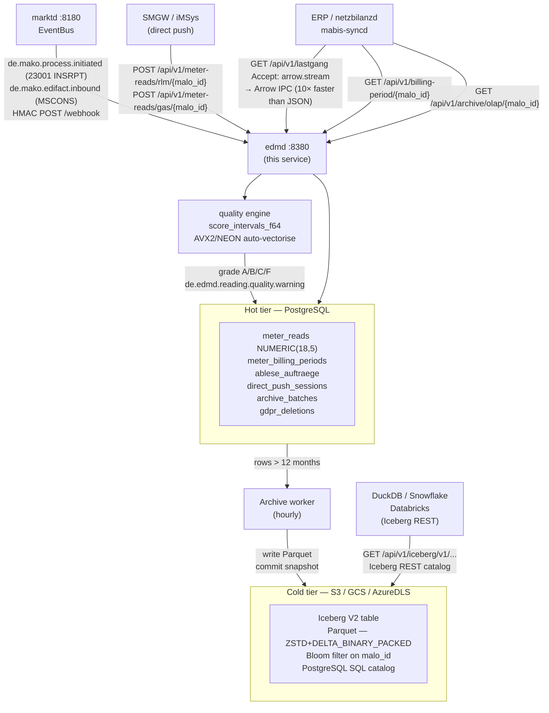
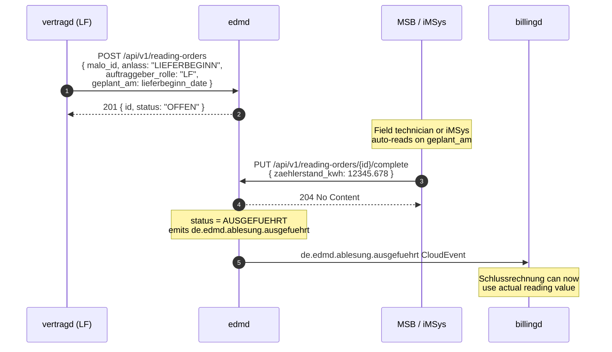
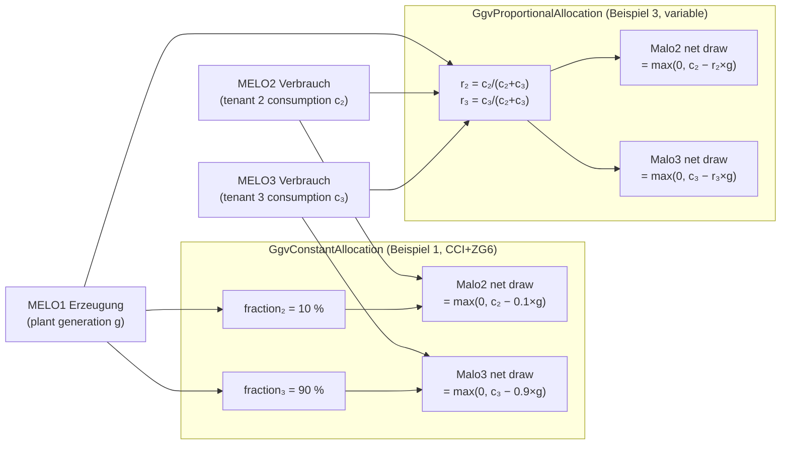
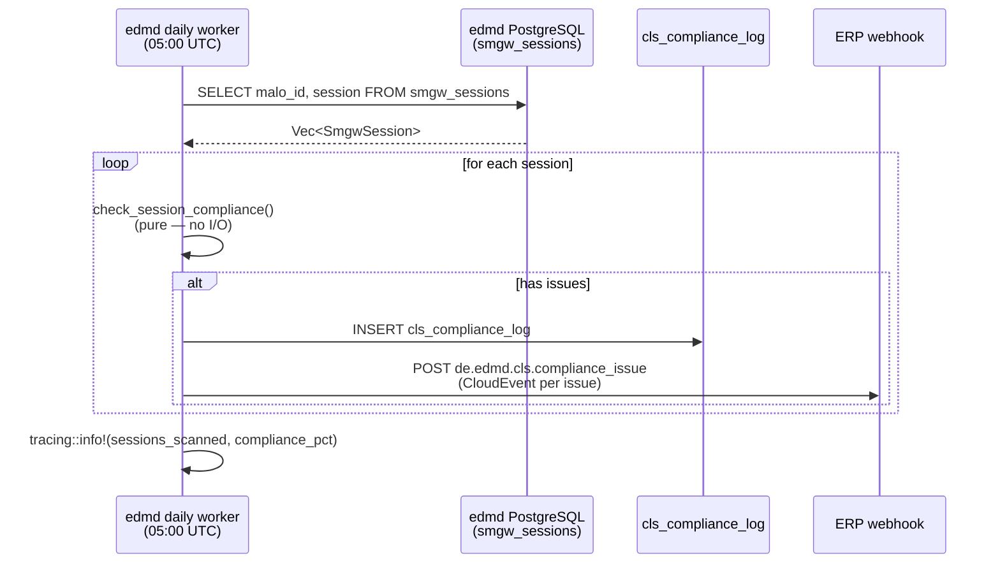

# `edmd` Operator Guide

`edmd` is the **Energy Data Management daemon** — the service that stores meter
readings and computes billing-relevant energy quantities for downstream services.

Key responsibilities:

- Store MSCONS meter readings (SLP and RLM) via the webhook from `marktd`.
- Accept **iMSys / SMGW direct push** (15-min intervals in JSON, bypassing EDIFACT) for §41a real-time billing.
- Run the **Hampel-filter quality scorer** and **V01–V10 validation engine** on all inbound interval data. Emit `de.edmd.reading.quality.warning` CloudEvents for grade C/F data.
- Schedule and track **reading orders** (Ablesesteuerung) for all three market roles (LF, MSB, NB). Auto-creates `INSRPT_STOERUNG` orders when a WiM INSRPT PID 23001 Störungsmeldung arrives.
- Compute and serve **virtual meter time series** (Sum, Residual, PvSelfConsumption, GgvConstantAllocation, GgvProportionalAllocation per §42b EnWG Solarpaket I GGV community solar) on demand.
- Generate **§17 MessZV annual forecasts** (Jahresprognose) and **prior-period substitute values** for gap intervals.
- Provide resampled Lastgang (hourly / daily / monthly / yearly buckets) and monthly Summenzeitreihe for MaBiS.
- Provide a time-series query API for ERP and `netzbilanzd`.
- Export BO4E `Lastgang` objects and `Zeitreihe` objects for ERP and API-Webdienste Strom consumers.
- Compute `MeterBillingPeriod` — RLM Spitzenleistung (kW) and Gas Brennwert / Zustandszahl — required by `netzbilanzd` for Leistungspreis billing.
- Accumulate **Mehr-/Mindermengensaldo** imbalance records per MaLo.
- **Apache Iceberg V2 OLAP archival**: automatically export `meter_reads` older than the configured retention window (default 12 months) to Parquet files on S3/GCS/Azure in Iceberg V2 table format.

The **domain calculation logic** is provided by the [`metering`](https://github.com/hupe1980/mako/tree/main/crates/metering) library crate (zero I/O, no async, 177 tests):

| Function / Type | §-basis | Used in |
|---|---|---|
| `gas_m3_to_kwh_hs(m3, hs, z)` | §24 GasGVV / DVGW G 685 | Gas direct push |
| `aggregate(intervals, AggregationConfig)` | §2 Nr. 17 MessZV | `MeterBillingPeriod` |
| `classify_messtyp(intervals, source)` | §3/§4 MessZV, §41a EnWG | iMSys classification |
| `compute_imbalance(actual, contracted)` | §27 MessZV | Mehr-/Mindermengensaldo |
| `score_intervals(intervals, config)` | — | Hampel quality scoring (A/B/C/F) |
| `validate_intervals(intervals, config)` | §17–22 MessZV | V01–V10 validation engine |
| `resample(intervals, config)` | §27 MessZV, MaBiS | Hourly/daily/monthly resampling |
| `compute_virtual_meter(rule, sources)` | §42b EEG, §42a EEG | GGV community solar, Residuallast |
| `project_annual_consumption(intervals, _)` | §17 MessZV Jahresprognose | Annual consumption forecast |
| `prior_period_substitutes(gap, _, _, prior, _)` | §17 Abs. 2 MessZV | Prior-period gap filling |
| `SmgwSession`, `ClsChannel` | BSI TR-03109, §14a EnWG | SMGW lifecycle + CLS management |



---

## Port layout

```
┌────────────────────────────────────────────────────────────────────────────┐
│  edmd  :8380                                                                │
│                                                                            │
│  POST /webhook                              ← marktd CloudEvents          │
│  GET  /api/v1/deliveries/{malo_id}          ← BO4E Energiemenge           │
│  GET  /api/v1/billing-period/{malo_id}      ← MeterBillingPeriod          │
│  GET  /api/v1/billing-periods               ← collection (mabis-syncd)    │
│  GET  /api/v1/imbalance/{malo_id}/{y}/{m}   ← Mehr-/Mindermengen          │
│  GET  /api/v1/lastgang/{malo_id}            ← BO4E Lastgang               │
│  GET  /api/v1/zeitreihe/{malo_id}           ← BO4E Zeitreihe              │
│  GET  /api/v1/lastgang/{malo_id}/resampled  ← hourly/daily/monthly        │
│  GET  /api/v1/summenzeitreihe/{malo_id}     ← MaBiS monthly aggregate     │
│  GET  /api/v1/forecast/{malo_id}            ← §17 MessZV Jahresprognose   │
│  GET  /api/v1/gas-quality/{malo_id}         ← Brennwert + Zustandszahl    │
│  GET  /api/v1/corrections/{malo_id}         ← bitemporal audit trail      │
│  GET  /api/v1/quality-assessments/{malo_id} ← Hampel rescore history      │
│  GET  /api/v1/sharing/{community_id}/alloc  ← §42c Energy Sharing VZW     │
│                                                                            │
│  ── iMSys direct push ────────────────────────────────────────────────── │
│  POST /api/v1/meter-reads/rlm/{malo_id}     ← Strom 15-min direct push   │
│  POST /api/v1/meter-reads/gas/{malo_id}     ← Gas direct push (m³→kWh_Hs)│
│                                                                            │
│  ── §14a SMGW session registry (MsbG §21c / BSI TR-03109) ─────────────  │
│  PUT  /api/v1/smgw/{malo_id}                ← upsert SmgwSession          │
│  GET  /api/v1/smgw/{malo_id}                ← session + recent issues     │
│  GET  /api/v1/smgw                          ← fleet list with issue counts│
│  GET  /api/v1/smgw/compliance               ← read-only compliance scan   │
│  POST /api/v1/smgw/compliance/scan          ← side-effecting fleet sweep  │
│                                                                            │
│  ── Reading order scheduling (Ablesesteuerung) ──────────────────────── │
│  POST|GET /api/v1/reading-orders            ← schedule / list orders     │
│  GET  /api/v1/reading-orders/{id}           ← order detail               │
│  PUT  /api/v1/reading-orders/{id}/complete  ← record reading result       │
│  PUT  /api/v1/reading-orders/{id}/cancel    ← cancel                     │
│  POST /api/v1/reading-orders/campaign       ← bulk Jahresablese-Kampagne  │
│                                                                            │
│  ── Quality scoring ──────────────────────────────────────────────────── │
│  POST /api/v1/quality-score/{malo_id}       ← retroactive Hampel rescore  │
│                                                                            │
│  ── Iceberg / S3 OLAP archival ─────────────────────────────────────────  │
│  GET  /api/v1/archive/status                ← archival stats + batches   │
│  GET  /api/v1/archive/olap/{malo_id}        ← MMM aggregation (OLAP)     │
│  GET  /api/v1/archive/portfolio             ← portfolio-level OLAP        │
│  GET  /api/v1/archive/timeseries/{malo_id}  ← historical time-series      │
│  POST /api/v1/query/sql                     ← arbitrary DataFusion SQL    │
│                                                                            │
│  ── Iceberg REST catalog (DuckDB / Snowflake / Databricks) ──────────── │
│  GET  /api/v1/iceberg/v1/config                                           │
│  GET  /api/v1/iceberg/v1/namespaces[/{ns}/tables[/{table}]]              │
│                                                                            │
│  ── GDPR ─────────────────────────────────────────────────────────────── │
│  DELETE /api/v1/gdpr/erasure/{malo_id}      ← Art. 17 DSGVO erasure      │
│                                                                            │
│  GET  /metrics                              ← Prometheus metrics          │
│  GET  /health/live  /health/ready                                         │
│  POST|GET /mcp      ← MCP Streamable HTTP (LLM tooling)                   │
└────────────────────────────────────────────────────────────────────────────┘
```

---

## Inbound event routing

| `ce_type` | `makopid` | Action |
|-----------|-----------|--------|
| `de.mako.process.completed` | MSCONS set | Store meter readings |
| `de.mako.process.initiated` | 23001 (INSRPT Störungsmeldung) | Auto-create `INSRPT_STOERUNG` reading order (§18 MessZV) |
| anything else | — | 204 No Content (ignored) |

### MSCONS PIDs handled

| PID | Description | Direction |
|-----|-------------|-----------|
| 13005 | Lastgang Messwerte Strom | NB → LF |
| 13006 | Zählerstand / Ersatzwert Strom | NB → LF |
| 13007 | **Gasbeschaffenheitsdaten — Brennwert + Zustandszahl** | NB → LF |
| 13013 | Allokationsliste Gas MMMA (GaBi Gas 2.0) | NB → LF |
| 13015 | Lastgang Summenzeitreihe SLP Strom | NB → LF |
| 13016 | Ausfallarbeit Strom | NB → LF |
| 13017 | Zählerstand Strom — Ablese-Übermittlung | NB → LF |
| 13018 | Messwerte Strom — korrigierte Werte | NB → LF |
| 13019 | Netzverluste Strom | NB → LF |
| 13020–13023, 13026 | Redispatch 2.0 Zeitreihen | NB / ÜNB → LF |
| 13025 | Lastgang Gas — Zustandsmengen / Energiemengen | NB → LF |
| 13027 | Zählerstand Gas | NB → LF |

**PID 13007 (Gasbeschaffenheitsdaten):** When a `de.mako.process.completed` event
arrives for PID 13007, `edmd` automatically extracts `brennwert_kwh_per_m3` (from
`QTY+Z08`) and `zustandszahl` (from `QTY+Z10`) and populates `meter_billing_periods`.
This makes Gas NNE billing possible without manual data entry.

To request Gas quality data on-demand, use `makod` command `geli.gas.datenabruf.anfragen`
(dispatches ORDERS 17103 to the GNB, 10-Werktage response deadline).

---

## iMSys direct push (§41a)

For **iMSys / SMGW** customers with 15-min interval meters, `edmd` accepts direct JSON
push bypassing the EDIFACT/MSCONS pipeline entirely. This is required for §41a EnWG
dynamic tariffs where the MSCONS round-trip adds 15–60 min latency.

```http
POST /api/v1/meter-reads/rlm/{malo_id}
Content-Type: application/json

{
  "session_id": "SMGW-SN-00112233-20260713T0600Z",
  "source": "SMGW",
  "obis_code": "1-0:1.8.0",
  "intervals": [
    { "from": "2026-07-13T00:00:00Z", "to": "2026-07-13T00:15:00Z", "value": "2.345", "unit": "kWh" },
    { "from": "2026-07-13T00:15:00Z", "to": "2026-07-13T00:30:00Z", "value": "2.412", "unit": "kWh" }
  ]
}
```

**Gas variant** (`/api/v1/meter-reads/gas/{malo_id}`): supply `unit = "m3"` plus `brennwert_kwh_per_m3` and optionally `zustandszahl`; `edmd` converts m³ × Hs × Z to kWh_Hs before storing.

The response includes a **quality report** (see below). HTTP 201 = clean data; 202 = stored with quality warnings.

Idempotent on `session_id` — re-submitting the same key returns 200 with the original result.

---

## Hampel-filter quality scoring

`edmd` runs the **Hampel filter** (window k=3, threshold t=3.0, MAD × 1.4826 robust σ)
on every inbound interval batch via `metering::score_intervals_f64`. This function:

- Converts Decimal quantities to f64 once per batch — lossless for kWh ≤ 10¹³
- Uses tight loops over contiguous f64 slices that **auto-vectorise to AVX2
  (4×f64/cycle)** on x86-64 and **NEON (2×f64/cycle)** on AArch64 at `opt-level = 2`
- Returns a full `QualityReport` with gap positions, outlier timestamps, zero-run
  length, coverage %, and grade A/B/C/F — not just a scalar score

The Decimal path is kept for exact billing arithmetic; quality scoring uses f64
because outlier detection doesn't require accounting precision.

### Quality checks

| Check | Detection | Grade impact |
|-------|-----------|--------------|
| Gap detection | Adjacent intervals where `to[i] ≠ from[i+1]` | Warnings |
| Consecutive zero-run | Max run of zero-value intervals | Warnings if > 4 |
| **Hampel outliers** | `\|x[i] − window_median\| > 3.0 × 1.4826 × MAD` | Warnings |
| Spike detection | `value > 10 × window_median` of neighbours | Warnings |
| Interval consistency | Mixed SLP/RLM interval durations | Warnings |
| Coverage | `accepted / expected × 100 %` | Grade degrades if < 95 % |

### Quality grades

| Grade | Meaning | Billing action |
|-------|---------|----------------|
| **A** | No anomalies | Normal billing run |
| **B** | Minor issues | Proceed with note |
| **C** | Significant issues | Manual review recommended |
| **F** | Unusable | Block billing run |

Grade F triggers `de.edmd.reading.quality.warning` CloudEvent to the ERP webhook, and also triggers the `msb-history-agent` in `agentd` (LanceDB RAG indexing).

### Retroactive rescoring

To re-score existing historical data (e.g. after a MSCONS delivery of old data, or after a firmware fix):

```http
POST /api/v1/quality-score/{malo_id}?from=2026-01-01T00:00:00Z&to=2026-07-01T00:00:00Z
```

Returns `{ malo_id, rows_rescored, warnings_found, grade }`.

---

## Reading order scheduling (Ablesesteuerung)

`edmd` is the scheduling authority for **all three market roles**:

| Role | Typical `anlass` values |
|------|------------------------|
| LF | `LIEFERBEGINN`, `LIEFERENDE`, `ZWISCHENABLESUNG`, `JAHRESABLESUNG` |
| NB | `JAHRESABLESUNG`, `SPERRUNG`, `ENTSPERRUNG` |
| MSB | `SONDERABLESUNG`, `INSRPT_STOERUNG`, `ISMS_AUSLESUNG` |

### INSRPT → reading order automation (§18 MessZV)

When `edmd` receives `de.mako.process.initiated` for PID 23001 (INSRPT Störungsmeldung), it **automatically** creates an `INSRPT_STOERUNG` reading order:

- `geplant_am` = tomorrow
- `ausfuehrt_bis` = + 7 calendar days (covers 5 Werktage WiM Strom window)
- `auftraggeber_rolle` = `MSB`
- Idempotent on `insrpt_process_id`

This eliminates the risk of billing a zero-reading period after a device swap — the field-service scheduler is unblocked immediately on INSRPT arrival, without any ERP action required.

---

## MCP server tools

`edmd` exposes an MCP server at `/mcp` with the following tools:

| Tool | Description |
|------|-------------|
| `get_timeseries` | Meter data time-series for a MaLo in a date range |
| `get_imbalance` | Mehr-/Mindermengen imbalance report |
| `get_billing_period` | MeterBillingPeriod (arbeitsmenge, spitzenleistung, brennwert) |
| `get_device_history` | MSB device history text for LanceDB RAG indexing |
| `get_quality_warnings` | Hampel-filter quality warnings (grade A/B/C/F) |
| `list_reading_orders` | Ablesesteuerung orders for a MaLo |
| `list_overdue_reading_orders` | §40 EnWG compliance gaps |
| `trigger_jahresablesung` | Launch or preview annual reading campaign |
| `get_correction_history` | Bitemporal correction audit trail (§22 MessZV) |
| `validate_timeseries` | Run V01–V10 validation on stored meter reads |

Prompts: `analyze-consumption`, `submit-mscons`, `quality-assessment`, `jahresablesung-workflow`, `reading-order-lifecycle`.

---
│                                                                       │
---

## Inbound event routing

| `ce_type` | `makopid` | Action |
|-----------|-----------|--------|
| `de.mako.process.completed` | MSCONS set | Store meter readings |
| `de.mako.process.initiated` | 23001 (INSRPT Störungsmeldung) | Auto-create `INSRPT_STOERUNG` reading order (§18 MessZV) |
| anything else | — | 204 No Content (ignored) |

## BO4E `Energiemenge` deliveries export

`GET /api/v1/deliveries/{malo_id}?from=RFC3339&to=RFC3339`

Returns all stored meter readings for a MaLo as a **BO4E `Energiemenge` array** —
the canonical business object for metered energy quantities, identical in
structure to what MSCONS messages carry per OBIS register per interval.

This endpoint is the primary data feed for ERP billing-import pipelines and
Mehr-/Mindermengen reconciliation tools. The response is a hard-typed BO4E
contract — not a raw database dump — so ERP systems can consume it without
parsing EDIFACT format-version details.

```bash
curl -s "http://edmd:8380/api/v1/deliveries/10001234567?from=2026-01-01T00:00:00Z&to=2026-04-01T00:00:00Z" \
  -H "Authorization: Bearer <token>" | jq '.[0] | {
    obisKennzahl,
    menge_wert: .menge.wert,
    menge_einheit: .menge.einheit,
    zeitraum_start: .zeitraum.startdatum,
    zeitraum_ende:  .zeitraum.enddatum
  }'
```

Response shape (one `Energiemenge` per stored interval read):

```json
[
  {
    "_typ": "ENERGIEMENGE",
    "obisKennzahl": "1-0:1.29.0",
    "menge": {
      "wert": 42.375,
      "einheit": "KWH"
    },
    "zeitraum": {
      "startdatum": "2026-01-01",
      "startuhrzeit": "00:00:00+00:00",
      "enddatum":    "2026-01-01",
      "enduhrzeit":  "00:15:00+00:00"
    }
  }
]
```

**Filtering.** Both `from` and `to` are optional; omitting them returns all
stored readings. Times are RFC 3339 UTC; use `?from=2026-01-01T00:00:00Z`
for calendar-day boundaries.

**Grouping.** One `Energiemenge` object per stored interval row. For grouped
aggregate views (one object per register with all intervals nested), use
`GET /api/v1/lastgang/{malo_id}` instead.

**Cedar action:** `read-timeseries`

---

## `MeterBillingPeriod`

The `MeterBillingPeriod` struct contains the billing-relevant quantities for
a MaLo over a calendar billing period:

| Field | Type | Source |
|-------|------|--------|
| `spitzenleistung_kw` | `Option<f64>` | RLM: highest 15-min demand in kW |
| `brennwert_kwh_per_m3` | `Option<f64>` | Gas: calorific value (Brennwert H) |
| `zustandszahl` | `Option<f64>` | Gas: state conversion factor |
| `total_kwh` | `f64` | Consumption sum over billing period |

Used by `netzbilanzd` to compute the Leistungspreisanteil (kW × kW-price)
and Gas quantity conversion (m³ × Brennwert × Zustandszahl = kWh).

---

## BO4E `Zeitreihe` export

`GET /api/v1/zeitreihe/{malo_id}?from=RFC3339&to=RFC3339`

Returns the meter time series as a **BO4E `Zeitreihe`** object array — the
generic time-series format used by API-Webdienste Strom consumers. Unlike
`Lastgang`, `Zeitreihe` carries commodity metadata (`medium`, `messart`,
`einheit`) without interval-specific fields (`zeit_intervall_laenge`, OBIS
structure). One `Zeitreihe` is returned per distinct OBIS register.

```bash
curl -s "http://edmd:8380/api/v1/zeitreihe/10001234567?from=2026-01-01T00:00:00Z&to=2026-02-01T00:00:00Z" \
  -H "Authorization: Bearer <token>" | jq '.[0] | {
    bezeichnung,
    medium,
    messart,
    einheit,
    werte_count: (.werte | length)
  }'
```

Response shape:

```json
[
  {
    "bezeichnung": "Zeitreihe MaLo 10001234567 OBIS 1-0:1.29.0",
    "medium":      "STROM",
    "messart":     "MITTELWERT",
    "einheit":     "KWH",
    "werte": [
      {
        "zeitraum": {
          "startdatum": "2026-01-01", "startuhrzeit": "00:00:00+00:00",
          "enddatum":   "2026-01-01", "enduhrzeit":   "00:15:00+00:00"
        },
        "wert": 1.234,
        "status": "ABGELESEN"
      }
    ]
  }
]
```

**When to use `Zeitreihe` vs. `Lastgang`.** Use `Lastgang` when the consumer
needs interval metadata (register, sparte, interval length) for structured
RLM/SLP processing. Use `Zeitreihe` when the consumer is an API-Webdienste
Strom client that expects the generic time-series contract, or when the
commodity context (`medium`, `messart`) is more relevant than the EDIFACT
structure.

---

## BO4E `Lastgang` export

`GET /api/v1/lastgang/{malo_id}?from=RFC3339&to=RFC3339`

Returns the meter time series as a **BO4E `Lastgang`** object array, suitable
for direct import into ERP systems and for the API-Webdienste Strom interface.
Readings are grouped by OBIS-Kennzahl — one `Lastgang` per distinct measurement
register.

```bash
curl -s "http://edmd:8380/api/v1/lastgang/10001234567?from=2026-01-01T00:00:00Z&to=2026-02-01T00:00:00Z" \
  -H "Authorization: Bearer <token>" | jq '.[0] | {
    sparte,
    obis_kennzahl,
    zeit_intervall_laenge,
    werte_count: (.werte | length)
  }'
```

Response shape (one element per OBIS register):

```json
[
  {
    "sparte": "STROM",
    "obis_kennzahl": "1-0:1.29.0",
    "zeitIntervallLaenge": { "wert": 15, "einheit": "VIERTELSTUNDE" },
    "werte": [
      {
        "zeitraum": {
          "startdatum": "2026-01-01", "startuhrzeit": "00:00:00+00:00",
          "enddatum":   "2026-01-01", "enduhrzeit":   "00:15:00+00:00"
        },
        "wert": 1.234,
        "status": "ABGELESEN"
      }
    ]
  }
]
```

**Interval detection.** The `zeitIntervallLaenge` is inferred from the first
consecutive read pair (15 min → `VIERTELSTUNDE`, 60 min → `MINUTE(60)`, 1440
min → `TAG`). RLM reads are typically 15-minute intervals.

**OBIS codes.** Each `MeterRead` carries an optional `obis_code` field
populated from the MSCONS PIA segment. Common values:

| OBIS | Meaning | Sparte |
|------|---------|--------|
| `1-0:1.8.0` | Active energy import, cumulative | Strom |
| `1-0:1.29.0` | Active energy max demand (Spitzenleistung) | Strom RLM |
| `7-20:3.0.0` | Gas volume unconverted (m³) | Gas |
| `7-20:15.0.0` | Gas energy (kWh, after Brennwert conversion) | Gas |

---

## Ablesesteuerung — Reading Order API

All three market roles schedule meter readings through the same `edmd` API.
Reading orders are stored in `ablese_auftraege` and linked to `auftrag_positionen`
(O2C) or MaKo process IDs (makod-triggered).



### Anlass types

| Anlass | Triggered by | Purpose |
|---|---|---|
| `LIEFERBEGINN` | `vertragd` after NB confirms Lieferbeginn | Billing cutoff for outgoing supplier |
| `LIEFERENDE` | `vertragd` on Kündigung | Billing cutoff for final invoice |
| `JAHRESABLESUNG` | NB background job or ERP | §40 EnWG annual billing accuracy |
| `ZWISCHENABLESUNG` | LF or ERP | On-demand (tariff change, billing dispute) |
| `EINZUG` | NB on customer move-in | |
| `AUSZUG` | NB on customer move-out | |
| `SPERRUNG` | `sperrd` before disconnection | §19 StromGVV / §33 GasGVV |
| `ENTSPERRUNG` | `sperrd` after reconnection | |
| `SONDERABLESUNG` | MSB on `INSRPT` fault | Billing restart after meter replacement |
| `ISMS_AUSLESUNG` | iMSys automatic | Smart meter daily/15-min auto-readout |

### Endpoints

| Method | Path | Description |
|---|---|---|
| `POST` | `/api/v1/reading-orders` | Create reading order |
| `GET` | `/api/v1/reading-orders` | List (`?malo_id=&status=&anlass=&limit=`) |
| `GET` | `/api/v1/reading-orders/{id}` | Get status and result |
| `PUT` | `/api/v1/reading-orders/{id}/complete` | Record meter reading result |
| `PUT` | `/api/v1/reading-orders/{id}/cancel` | Cancel pending order |

### iMSys auto-close

For smart meters (iMSys), MSCONS data arrives automatically via `makod` → `edmd` webhook.
`edmd` auto-closes open reading orders for the same `malo_id` when the MSCONS timestamp
matches `geplant_am` within ±1 day.

---

## Virtual meters (§42b EnWG GGV — Solarpaket I)

`edmd` computes virtual meter time series on demand for MaLo IDs that have a
`virtual_meter_configs` row. Virtual meters are used for:

| Rule | Legal basis | Typical use-case |
|---|---|---|
| `Sum` | — | Portfolio totals, Summenmessung (multiple transformers, shared substations) |
| `Residual` | §42a EEG | Grid feed-in = gross generation − own consumption |
| `PvSelfConsumption` | §42b EEG | Prosumer: net grid draw after PV self-use |
| `GgvConstantAllocation` | §42b Abs. 5 EnWG | GGV tenant with fixed allocation fraction (UTILTS CCI+ZG6) |
| `GgvProportionalAllocation` | §42b Abs. 5 EnWG | GGV tenant with dynamic consumption-based allocation |

### GGV allocation formulas (BDEW Anwendungshilfe, 25.01.2024)

Both GGV variants compute the tenant's **net grid draw after PV allocation** —
the energy each participant draws from the public grid *after* their community
PV share has been credited. This is the `Malo_i Verbrauch` quantity in the
BDEW formula sheets, and directly corresponds to the `Verbrauchszeitreihe`
submitted to the BKV in UTILTS.

The critical invariant (§42b Abs. 5 EnWG, sentence 2) is that the **allocated
PV energy can never exceed the tenant's actual consumption** in any 15-minute
interval. This is enforced by the `Pos()` = `max(0, x)` operator:

```
§42b Abs. 5: "Die einem einzelnen teilnehmenden Letztverbraucher im Wege der
rechnerischen Aufteilung innerhalb eines 15-Minuten-Zeitintervalls zuteilbare
Strommenge ist begrenzt auf die durch ihn in diesem Zeitintervall verbrauchte
Strommenge."
```

**Constant allocation** (BDEW Beispiel 1 — UTILTS CCI+ZG6):

$$\text{net\_grid\_draw}_i[t] = \max\!\bigl(0,\ c_i[t] - f_i \times g[t]\bigr)$$

where $c_i[t]$ is tenant $i$'s consumption, $f_i$ is the static fraction, and $g[t]$ is plant generation.

**Proportional allocation** (BDEW Beispiel 3 — variable):

$$r_i[t] = \frac{c_i[t]}{\sum_j c_j[t]} \qquad \text{(0 if } \sum c_j = 0 \text{)}$$

$$\text{net\_grid\_draw}_i[t] = \max\!\bigl(0,\ c_i[t] - r_i[t] \times g[t]\bigr)$$



### Configuring virtual meters

Create a virtual meter config via the REST API (stored in `virtual_meter_configs`):

```bash
# Tenant 2: constant 10 % allocation (GgvConstantAllocation)
curl -X POST http://edmd:8380/api/v1/virtual-meter-configs \
  -H "Authorization: Bearer <token>" \
  -H "Content-Type: application/json" -d '{
    "virtual_malo_id": "10001234002",
    "display_name":    "GGV MaLo2 — Wohnung 2",
    "sparte":          "STROM",
    "legal_basis":     "§42b EnWG Solarpaket I",
    "valid_from":      "2026-01-01T00:00:00Z",
    "rule_json": {
      "GgvConstantAllocation": {
        "plant_melo_id":  "DE0001234560001",
        "tenant_melo_id": "DE0001234560002",
        "fraction":       "0.10"
      }
    }
  }'

# Tenant 2: proportional/variable allocation (GgvProportionalAllocation)
curl -X POST http://edmd:8380/api/v1/virtual-meter-configs \
  -H "Authorization: Bearer <token>" \
  -H "Content-Type: application/json" -d '{
    "virtual_malo_id": "10001234002",
    "display_name":    "GGV MaLo2 — proportional",
    "sparte":          "STROM",
    "legal_basis":     "§42b EnWG Solarpaket I",
    "valid_from":      "2026-01-01T00:00:00Z",
    "rule_json": {
      "GgvProportionalAllocation": {
        "plant_melo_id":      "DE0001234560001",
        "tenant_melo_id":     "DE0001234560002",
        "all_tenant_melo_ids": ["DE0001234560002", "DE0001234560003"]
      }
    }
  }'
```

### Querying virtual meter time series

```bash
# Net grid draw for tenant MaLo2 — computed live from plant + tenant consumption MeLos
curl -s "http://edmd:8380/api/v1/virtual/10001234002/lastgang?from=2026-07-01T00:00:00Z&to=2026-07-02T00:00:00Z" \
  -H "Authorization: Bearer <token>" | jq '{
    virtual_malo_id: "10001234002",
    first_interval: .[0].werte[0]
  }'
```

Results carry `source = "VIRTUAL"`, `quality` propagated as the worst of all
source MeLo qualities, and `obis_code = null` (set by the caller).

### Design: one rule per tenant MaLo

Each GGV tenant has its own `virtual_meter_configs` row referencing the shared
PV plant MeLo plus that tenant's consumption MeLo. For proportional allocation
the rule also lists **all** tenant MeLos so the denominator $\sum c_j[t]$ can
be computed.

| Config field | GgvConstantAllocation | GgvProportionalAllocation |
|---|---|---|
| `plant_melo_id` | shared PV plant MeLo | shared PV plant MeLo |
| `tenant_melo_id` | this tenant's MeLo | this tenant's MeLo |
| `fraction` | static 0–1 | — |
| `all_tenant_melo_ids` | — | all participating tenant MeLos |

### UTILTS encoding (BDEW CCI+ZG6)

The BDEW UTILTS message encodes both allocation methods as `CCI+ZG6` segments
(Aufteilungsfaktor Energiemenge). Constant fractions use `CAV+Z28:::0.10` for
10%, proportional allocation uses `CAV+Z74` (Divisionsquotient). `makod` handles
UTILTS encoding/decoding transparently — `edmd` only deals with the computed
net-grid-draw intervals.

---

`edmd` reads its configuration from a **TOML file** (default: `edmd.toml`),
with secrets deferred to environment variables via `"env:VAR_NAME"` values.

### CLI flags

| Flag | Env var | Default | Description |
|------|---------|---------|-------------|
| `--config` / `-c` | `EDMD_CONFIG` | `edmd.toml` | Path to `edmd.toml` |
| `--log-level` | `RUST_LOG` | `info` | Log level |
| `--check` | `EDMD_CHECK` | `false` | Validate config + DB connectivity, then exit 0. Used by Dockerfile HEALTHCHECK. |

```bash
edmd --config /etc/edmd/edmd.toml
# or: EDMD_CONFIG=/etc/edmd/edmd.toml edmd
```

### Full `edmd.toml` reference

```toml
[http]
addr = "0.0.0.0:8380"          # default

[database]
url       = "env:DATABASE_URL"  # required; use env: for secrets
pool_size = 10                  # default

[identity]
tenant = "9900357000004"        # required — MP-ID of the operator

[marktd]
url     = "http://marktd:8180"       # required
api_key = "env:EDMD_MARKTD_API_KEY" # required

[webhook]
inbound_secret = "env:EDMD_INBOUND_SECRET"  # optional; omit for dev

[subscription]
# Self-registers with marktd on startup — no manual curl required.
webhook_url   = "http://edmd:8380/webhook"  # public URL marktd POSTs to
subscriber_id = "edmd"                       # default
event_types   = [
  "de.mako.process.initiated",
  "de.mako.process.completed",
  "de.mako.edifact.inbound",
]

# [oidc]          # omit to disable auth (dev only — never omit in production)
# issuer   = "https://login.microsoftonline.com/{tenant-id}/v2.0"
# audience = "api://mako-edmd"
# jwks_refresh_secs = 300

# [otel]          # omit to disable tracing
# endpoint = "http://otel-collector:4317"
```

---

## marktd subscription

`edmd` **auto-registers** its EventBus subscription with `marktd` on startup
when `subscription.webhook_url` is set in the config — no manual `curl` required.

To force re-registration or verify the subscription:

```bash
curl -s http://marktd:8180/api/v1/subscriptions/edmd \
  -H "Authorization: Bearer <token>" | jq .
```

---

## Query examples

```bash
# BO4E Energiemenge — all meter readings for a MaLo (typed, ERP-consumable)
curl -s "http://edmd:8380/api/v1/deliveries/10001234567?from=2026-01-01T00:00:00Z&to=2026-04-01T00:00:00Z" \
  -H "Authorization: Bearer <token>" | jq '.[0] | {obisKennzahl, menge_kwh: .menge.wert}'

# Billing period for a MaLo (used by netzbilanzd)
curl -s "http://edmd:8380/api/v1/billing-period/10001234567?from=2026-01-01&to=2026-03-31" \
  -H "Authorization: Bearer <token>" | jq '{
    spitzenleistung_kw,
    arbeitsmenge_kwh,
    period_from,
    period_to
  }'

# Mehr-/Mindermengensaldo for January 2026
curl -s "http://edmd:8380/api/v1/imbalance/10001234567/2026/1" \
  -H "Authorization: Bearer <token>" | jq .

# BO4E Lastgang export — one object per OBIS register
curl -s "http://edmd:8380/api/v1/lastgang/10001234567?from=2026-01-01T00:00:00Z&to=2026-02-01T00:00:00Z" \
  -H "Authorization: Bearer <token>" | jq '.[0] | {sparte, obis_kennzahl, zeit_intervall_laenge}'

# BO4E Zeitreihe export — one object per OBIS register (medium/messart metadata)
curl -s "http://edmd:8380/api/v1/zeitreihe/10001234567?from=2026-01-01T00:00:00Z&to=2026-02-01T00:00:00Z" \
  -H "Authorization: Bearer <token>" | jq '.[0] | {bezeichnung, medium, messart, einheit}'
```

---

## Apache Iceberg / S3 OLAP archival

`edmd` can automatically offload `meter_reads` older than the configured
retention window to **Apache Iceberg V2 tables** on S3, GCS, or Azure Data Lake.
A **PostgreSQL-backed SQL catalog** (`iceberg-catalog-sql`) stores all table
metadata (schema, partition spec, snapshots, manifests) in the same database that
`edmd` already manages — no Nessie, Apache Polaris, or AWS Glue required.
[Apache DataFusion](https://arrow.apache.org/datafusion/) executes SQL queries
over the Parquet files with Iceberg partition pruning for ≥ 10× faster MMM
aggregation versus full PostgreSQL scans.

### Why Iceberg?

| Challenge | Solution |
|---|---|
| 35 000 rows/RLM MaLo/year — PG scan degrades after year 2 | Parquet columnar format on object storage |
| MMM aggregation spans 3+ years | DataFusion pushes predicates to Iceberg partitions + Parquet row-group statistics |
| Multi-engine access (Spark, Trino, DuckDB) | Iceberg V2 table format via `iceberg = "0.9.1"` |
| No external catalog service | `iceberg-catalog-sql` stores metadata in existing PostgreSQL |

### File layout

```
{storage_uri}/
  data/
    sparte=STROM/                    ← identity(sparte) partition
      dtm_from_year=2024/            ← year(dtm_from)
        dtm_from_month=1/            ← month(dtm_from)
          edmd-archive-{uuid}.parquet
    sparte=GAS/
      dtm_from_year=2024/
        ...
  metadata/
    v1.metadata.json                 ← Iceberg V2 table metadata
```

### Configuration

```toml
[archive]
enabled                = true
storage_uri            = "s3://my-bucket/edmd/meter_reads"
access_key_id          = "env:AWS_ACCESS_KEY_ID"
secret_access_key      = "env:AWS_SECRET_ACCESS_KEY"
region                 = "eu-central-1"
# Optional — for MinIO, Ceph RGW, LocalStack:
# endpoint_url         = "http://minio:9000"
retention_months       = 12      # keep in PostgreSQL for this many months
batch_size             = 100000  # rows per archive run
interval_secs          = 3600    # run every hour
# Iceberg catalog in the same PostgreSQL — no extra service:
iceberg_catalog_schema = "iceberg_catalog"   # schema created automatically
iceberg_catalog_name   = "edmd"
```

### Archive OLAP endpoints

| Endpoint | Description |
|---|---|
| `GET /api/v1/archive/status` | Archival statistics (total batches, rows archived, bytes written) + 20 most recent batches |
| `GET /api/v1/archive/olap/{malo_id}?from=&to=` | **MMM aggregation**: total kWh, read count, period bounds for one MaLo from the cold tier |
| `GET /api/v1/archive/portfolio?from=&to=&limit=N` | Portfolio-level aggregation: top-N MaLo by consumption across the full archive |
| `GET /api/v1/archive/timeseries/{malo_id}?from=&to=` | Historical time-series export from Parquet (up to 50 000 rows) |

**Typical `mmm_aggregate` query** (executes via DataFusion over S3 Parquet):

```bash
curl "http://edmd:8380/api/v1/archive/olap/10001234567?from=2023-01-01T00:00:00Z&to=2025-12-31T23:59:59Z" \
  -H "Authorization: Bearer <token>" | jq '{total_kwh, read_count, period_from, period_to}'
```

Response:

```json
{
  "malo_id":     "10001234567",
  "total_kwh":   123456.789,
  "read_count":  105120,
  "period_from": "2023-01-01T00:00:00Z",
  "period_to":   "2025-12-31T23:45:00Z",
  "source":      "iceberg-archive"
}
```

### Dependencies

| Crate | Version | Purpose |
|---|---|---|
| `iceberg` | 0.9.1 | Apache Iceberg core — FileIO, table spec, writer |
| `iceberg-storage-opendal` | 0.9.1 | S3/GCS/AzureDLS storage via opendal 0.55 |
| `iceberg-datafusion` | 0.9.1 | `IcebergTableProvider` for DataFusion SQL |
| `iceberg-catalog-sql` | 0.9.1 | PostgreSQL-backed Iceberg catalog |
| `datafusion` | 52 | SQL query engine + partition pruning |
| MSRV | **1.94** | Required by iceberg 0.9.1 |

---

## Arrow IPC bulk export

For high-throughput bulk reads — such as `mabis-syncd` fetching a month of
15-min data for 50 000 MaLos — `edmd` supports the
**Apache Arrow IPC stream** binary format as an alternative to JSON.
Set the `Accept` header to request Arrow IPC; the response carries the same
data as the JSON endpoint but serialised as a self-describing columnar stream.
This delivers **10–50× higher throughput** and eliminates the JSON parsing
overhead in the consumer.

```bash
# Request Arrow IPC stream from the Lastgang endpoint
curl -s "http://edmd:8380/api/v1/lastgang/10001234567?from=2026-01-01T00:00:00Z&to=2026-02-01T00:00:00Z" \
  -H "Authorization: Bearer <token>" \
  -H "Accept: application/vnd.apache.arrow.stream" \
  > reads.arrows

# Consume directly in DuckDB (no conversion needed)
duckdb -c "SELECT SUM(quantity_kwh), quality FROM read_ipc_stream('reads.arrows') GROUP BY quality"

# Consume in Python / Polars
python3 -c "
import pyarrow.ipc as ipc
with open('reads.arrows', 'rb') as f:
    reader = ipc.open_stream(f)
    tbl = reader.read_all()
    print(tbl.schema)
    print(f'{len(tbl)} intervals')
"
```

**Endpoints supporting Arrow IPC:**

| Endpoint | JSON response | Arrow IPC available |
|---|---|---|
| `GET /api/v1/lastgang/{malo_id}` | BO4E `Lastgang` | ✓ |
| `GET /api/v1/zeitreihe/{malo_id}` | BO4E `Zeitreihe` | ✓ |

**Arrow schema** (per response row):

| Column | Type | Notes |
|---|---|---|
| `malo_id` | `Utf8` | 11-digit Marktlokations-ID |
| `dtm_from` | `Timestamp(µs, UTC)` | Interval start |
| `dtm_to` | `Timestamp(µs, UTC)` | Interval end |
| `quantity_kwh` | `Float64` | Energy in kWh |
| `quality` | `Utf8` | `MEASURED` / `ESTIMATED` / … |
| `sparte` | `Utf8` | `STROM` / `GAS` |
| `obis_code` | `Utf8?` | nullable |
| `pid` | `Int32` | Source MSCONS PID |

---

## DataFusion SQL endpoint

`POST /api/v1/query/sql` executes an arbitrary SQL query via **Apache DataFusion**
over the Iceberg cold tier. This is the power-user interface for ad-hoc OLAP
analysis — the Iceberg REST catalog endpoints enable tool-native access, while
this endpoint allows programmatic SQL without a database client.

```bash
# Aggregate annual consumption per MaLo from the cold archive
curl -s -X POST http://edmd:8380/api/v1/query/sql \
  -H "Authorization: Bearer <token>" \
  -H "Content-Type: application/json" -d '{
    "sql": "SELECT malo_id, CAST(SUM(quantity_kwh) AS DOUBLE) AS kwh_total FROM meter_reads_archive WHERE dtm_from >= TIMESTAMP '\'2025-01-01T00:00:00Z\'' GROUP BY malo_id ORDER BY kwh_total DESC LIMIT 20",
    "limit": 20
  }' | jq .
```

**Access control:** requires Cedar action `read-archive-olap`.
Only `SELECT` and `WITH` statements are accepted; `INSERT`/`UPDATE`/`DROP` are rejected.

---

## Iceberg REST catalog — external OLAP

`edmd` exposes the Iceberg REST catalog protocol (ICEBERG-89 spec) so that
**DuckDB**, **Snowflake**, and **Databricks** can attach directly to the cold archive
without any ETL pipeline.

```sql
-- DuckDB: attach edmd's Iceberg catalog and query the cold archive directly
ATTACH 'http://edmd:8380/api/v1/iceberg/v1'
    AS mako (TYPE ICEBERG, ENDPOINT_TYPE REST);

-- Annual energy by MaLo — full partition pruning + Bloom filter
SELECT
    malo_id,
    DATE_TRUNC('month', dtm_from) AS month,
    SUM(quantity_kwh)              AS arbeitsmenge_kwh
FROM mako.edmd.meter_reads_archive
WHERE dtm_from BETWEEN TIMESTAMP '2025-01-01' AND TIMESTAMP '2025-12-31'
  AND quality NOT IN ('FAULTY', 'UNKNOWN')
GROUP BY 1, 2
ORDER BY 1, 2;
```

DuckDB executes this with full four-level pruning:
1. Iceberg month-partition pruning
2. Manifest `lower_bound`/`upper_bound` (TimeIndex)
3. Parquet row-group min/max statistics (ZoneMap)
4. Parquet Bloom filter on `malo_id` (1 % FPR, eliminates ~99 % of files for single-MaLo queries)

**Authorization.** All catalog endpoint responses are gated by OIDC/Cedar.
Snowflake or Databricks must present a valid bearer token in the `CATALOG INTEGRATION`
config. Unauthenticated requests receive `403 Forbidden`.

---

## §14a Fernsteuerbarkeit compliance — SMGW session registry

`edmd` maintains a **SMGW (Smart Meter Gateway) session registry** and runs a daily
compliance sweep per **MsbG §21c** and **BSI TR-03109-4 §6.3**.

### Why here?

`edmd` already owns meter-data push sessions (`direct_push_sessions`) and reading-order
scheduling. SMGW connectivity is a metering-domain concern: when a gateway's TLS cert
expires or a CLS channel loses its §14a Konfigurationsprodukt, meter data stops flowing
and substitute values (§17 MessZV) become mandatory. `edmd` detects both conditions and
emits `de.edmd.cls.compliance_issue` CloudEvents so `agentd`'s `smgw-diagnostics-agent`
can escalate to the MSB and ERP system automatically.

### Data model

```
smgw_sessions (1) ──────────────────────────────────► cls_compliance_log (N)
  malo_id (PK)          append-only audit trail
  device_id             per issue detected (CRITICAL / WARNING)
  gateway_status        ← promoted column for fast pre-filtering
  session (JSONB)       ← full SmgwSession (certs + CLS channels)
  last_contact_at
  geraet_konfigurationen (from marktd) drives SMGW_CERT_ABLAUFDATUM here
```

The `session` JSONB column is GIN-indexed, enabling direct SQL queries on the
certificate and CLS channel arrays without application-layer deserialization.

### Compliance check logic

The pure function `check_session_compliance()` in `edmd/src/smgw.rs` checks six
issue types in priority order:

| Priority | `issue_type` | Severity | Legal basis |
|---|---|---|---|
| 1 | `GATEWAY_REVOKED` | **CRITICAL** | MsbG §29 — replace immediately |
| 2 | `COMMUNICATION_FAULT` | **CRITICAL** | §17 MessZV — substitute values required after 2h silence |
| 3 | `TLS_CERT_MISSING` | **CRITICAL** | BSI TR-03109-4 — SMGW Admin Protocol unreachable |
| 4 | `CERT_EXPIRED` | **CRITICAL** | BSI TR-03109-4 §6.3 — §14a eligibility lost |
| 5 | `CERT_EXPIRING` | WARNING | BSI TR-03109-4 §6.3 — 30-day renewal window |
| 6 | `CLS_NOT_COMPLIANT` | WARNING | BK6-24-174 §4.3 — DSO load control impossible |

### Background worker

`spawn_cls_compliance_worker()` runs daily (configurable), with a 30s startup delay
and graceful shutdown via `CancellationToken`. On each sweep:

1. Query all `smgw_sessions` for the tenant.
2. For each session, run `check_session_compliance()` (pure — no I/O).
3. For each issue found: insert into `cls_compliance_log` + emit `de.edmd.cls.compliance_issue`.
4. Tracing logs the sweep result (sessions scanned, issue count, `has_critical`).

### SMGW session API

```bash
# Register or update a SMGW session (after BSI TR-03109-4 Admin session or GWA sync)
curl -s -X PUT "http://edmd:8380/api/v1/smgw/10001234567" \
  -H "Authorization: Bearer <token>" \
  -H "Content-Type: application/json" \
  -d '{
    "device_id":       "SMGW-2026-001",
    "firmware_version": "3.1.2",
    "msb_mp_id":       "9900000000003",
    "malo_id":         "10001234567",
    "status":          "OPERATIONAL",
    "certificates": [
      {
        "serial_number": "AA:BB:CC:DD",
        "cert_type":     "TLS",
        "subject_cn":    "SMGW-2026-001",
        "issuer_cn":     "BSI-Smart-Meter-CA",
        "valid_from":    "2025-01-01",
        "valid_to":      "2027-06-30",
        "is_revoked":    false
      }
    ],
    "cls_channels": [
      {
        "channel_id":     "CLS-00042",
        "malo_id":        "10001234567",
        "device_type":    "HEAT_PUMP",
        "max_power_kw":   "8.50",
        "channel_status": "ACTIVE",
        "produktcode":    "FLEX-001",
        "valid_from":     "2026-01-01"
      }
    ],
    "last_contact_at": "2026-07-18T07:55:00Z",
    "installed_at":    "2025-06-01"
  }'
# → 204 No Content when compliant
# → 200 { "status": "accepted_with_compliance_issues", "issues": [...] } when issues detected

# Get session + 10 most recent compliance events
curl -s "http://edmd:8380/api/v1/smgw/10001234567" \
  -H "Authorization: Bearer <token>" | jq '{gateway_status, recent_issues}'

# Fleet overview (with 24-hour issue counts)
curl -s "http://edmd:8380/api/v1/smgw?status=OPERATIONAL" \
  -H "Authorization: Bearer <token>" | jq '.sessions[] | {malo_id, critical_issues_24h}'

# On-demand read-only compliance scan (no CloudEvents emitted, no DB writes)
curl -s "http://edmd:8380/api/v1/smgw/compliance" \
  -H "Authorization: Bearer <token>" | jq '{sessions_scanned, has_critical, compliance_pct}'

# Force a full side-effecting sweep (logs + emits CloudEvents)
curl -s -X POST "http://edmd:8380/api/v1/smgw/compliance/scan" \
  -H "Authorization: Bearer <token>" | jq '{sessions_scanned, sessions_with_issues}'
```

### `de.edmd.cls.compliance_issue` CloudEvent

```json
{
  "specversion": "1.0",
  "id":          "a1b2c3d4-...",
  "type":        "de.edmd.cls.compliance_issue",
  "source":      "urn:edmd:tenant:9900000000003:cls-compliance-worker",
  "subject":     "10001234567",
  "time":        "2026-07-18T05:00:00Z",
  "data": {
    "malo_id":        "10001234567",
    "device_id":      "SMGW-2026-001",
    "issue_type":     "CERT_EXPIRING",
    "severity":       "WARNING",
    "cert_serial":    "AA:BB:CC:DD",
    "cert_type":      "TLS",
    "days_to_expiry": 12,
    "channel_id":     null,
    "description":    "SMGW SMGW-2026-001 TLS cert AA:BB:CC:DD expires in 12 days — renew now"
  }
}
```

`agentd`'s `smgw-diagnostics-agent` subscribes to `de.edmd.cls.compliance_issue` and
automatically escalates to the MSB team, suggests remediation steps, and checks whether
the same device has open §17 MessZV substitute-value orders.

### Mermaid: daily sweep flow



---

## GDPR Art. 17 erasure

`DELETE /api/v1/gdpr/erasure/{malo_id}` implements the
[GDPR right to erasure](https://eur-lex.europa.eu/legal-content/EN/TXT/?uri=CELEX%3A32016R0679#d1e2606-1-1)
for meter data. This endpoint:

1. Deletes all rows for the MaLo from `meter_reads` (hot tier) and related tables.
2. Logs the erasure in `gdpr_deletions` (audit trail with `authorized_by`, timestamp).
3. All subsequent cold-tier (Iceberg) queries automatically exclude the erased MaLo
   via a `AND malo_id NOT IN (...)` filter injected at DataFusion query time.

```bash
curl -X DELETE "http://edmd:8380/api/v1/gdpr/erasure/10001234567" \
  -H "Authorization: Bearer <token>" \
  -H "X-Authorized-By: gdpr-officer@example.com" \
  -H "X-Erasure-Reason: Customer right-to-erasure request #2026-42"
```

Response `200 OK`:
```json
{ "malo_id": "10001234567", "rows_deleted": 35040, "archived_pending": true }
```

> **Note:** Physical deletion of Parquet data files from S3 requires an
> asynchronous compaction job (Iceberg copy-on-write). Until the job runs,
> the data is excluded from all query results but physically still present in
> object storage. The `archived_pending: true` field signals that the
> Parquet-level rewrite is outstanding.

---

## Cedar ABAC

`edmd` uses Cedar for access control. Grant the `read-timeseries` action to
principals that need meter data access:

```cedar
permit(
  principal,
  action == Action::"read-timeseries",
  resource
) when {
  context.principal_tenant == context.resource_tenant
};
```

Add `read-archive-olap` for access to Iceberg OLAP endpoints:

```cedar
permit(
  principal,
  action == Action::"read-archive-olap",
  resource
) when {
  context.principal_tenant == context.resource_tenant
};
```

---

## Monitoring

| Metric | Target |
|--------|--------|
| Webhook `de.mako.edifact.inbound` success rate | > 99 % |
| DB pool utilisation | < 80 % |
| `meter_reads` rows with `archived = false` and `dtm_from < now() - retention_months` | Should decrease each hour when archival is enabled |

