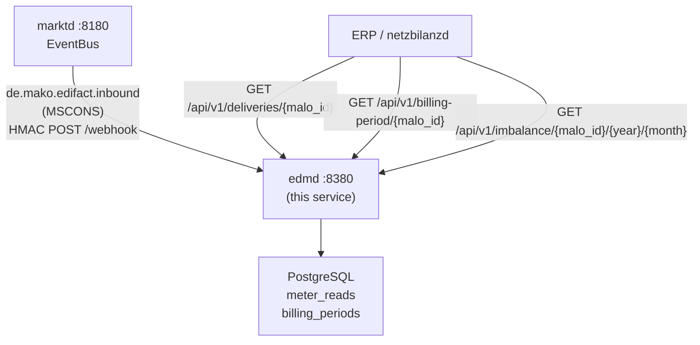

# `edmd` Operator Guide

`edmd` is the **Energy Data Management daemon** — the service that stores meter
readings and computes billing-relevant energy quantities for downstream services.

Key responsibilities:
- Store MSCONS meter readings (SLP and RLM) via the webhook from `marktd`.
- Provide a time-series query API for ERP and `netzbilanzd`.
- Compute `MeterBillingPeriod` — RLM Spitzenleistung (kW) and Gas Brennwert /
  Zustandszahl — required by `netzbilanzd` for Leistungspreis billing.
- Accumulate **Mehr-/Mindermengensaldo** imbalance records per MaLo.



---

## Port layout

```
┌─────────────────────────────────────────────────────────────────┐
│  edmd  :8380                                                     │
│                                                                 │
│  POST /webhook                          ← marktd CloudEvents    │
│  GET  /api/v1/deliveries/{malo_id}      ← meter reads / TS      │
│  GET  /api/v1/billing-period/{malo_id}  ← MeterBillingPeriod    │
│  GET  /api/v1/imbalance/{malo_id}/{y}/{m} ← Mehr-/Mindermengen  │
│  GET  /metrics                          ← Prometheus metrics    │
│  GET  /health/live  /health/ready                               │
│  POST|GET /mcp      ← MCP Streamable HTTP (LLM tooling)         │
└─────────────────────────────────────────────────────────────────┘
```

---

## Inbound event routing

| `ce_type` | Action |
|-----------|--------|
| `de.mako.edifact.inbound` with `makomessagetype=MSCONS` | Store meter readings |
| anything else | 204 No Content (ignored) |

MSCONS PIDs handled: `13002`, `13003`, `13004`, `13005`, `13006`, `13007`, `13008`,
`13013` (Allokationsliste Gas).

---

## `MeterBillingPeriod`

The `MeterBillingPeriod` struct contains the billing-relevant quantities for
a MaLo over a calendar billing period:

| Field | Type | Source |
|-------|------|--------|
| `spitzenleistung_kw` | `Option<f64>` | RLM: highest 15-min demand in kW |
| `brennwert_kwh_per_m3` | `Option<f64>` | Gas: calorific value (Brennwert H) |
| `zustandszahl` | `Option<f64>` | Gas: state conversion factor |
| `total_kwh` | `f64` | Consumption sum over billing period |

Used by `netzbilanzd` (N4) to compute the Leistungspreisanteil (kW × kW-price)
and Gas quantity conversion (m³ × Brennwert × Zustandszahl = kWh).

---

## Configuration reference

`edmd` reads its configuration from a **TOML file** (default: `edmd.toml`),
with secrets deferred to environment variables via `"env:VAR_NAME"` values.

### CLI flags

| Flag | Env var | Default | Description |
|------|---------|---------|-------------|
| `--config` / `-c` | `EDMD_CONFIG` | `edmd.toml` | Path to `edmd.toml` |
| `--log-level` | `RUST_LOG` | `info` | Log level |
| `--check` | `EDMD_CHECK` | `false` | Validate config + DB connectivity, then exit 0. Used by Dockerfile HEALTHCHECK. |

```bash
edmd --config /etc/edmd/edmd.toml
# or: EDMD_CONFIG=/etc/edmd/edmd.toml edmd
```

### Full `edmd.toml` reference

```toml
[http]
addr = "0.0.0.0:8380"          # default

[database]
url       = "env:DATABASE_URL"  # required; use env: for secrets
pool_size = 10                  # default

[identity]
tenant = "9900357000004"        # required — MP-ID of the operator

[marktd]
url     = "http://marktd:8180"       # required
api_key = "env:EDMD_MARKTD_API_KEY" # required

[webhook]
inbound_secret = "env:EDMD_INBOUND_SECRET"  # optional; omit for dev

[subscription]
# Self-registers with marktd on startup — no manual curl required.
webhook_url   = "http://edmd:8380/webhook"  # public URL marktd POSTs to
subscriber_id = "edmd"                       # default
event_types   = [
  "de.mako.process.initiated",
  "de.mako.process.completed",
  "de.mako.edifact.inbound",
]

# [oidc]          # omit to disable auth (dev only — never omit in production)
# issuer   = "https://login.microsoftonline.com/{tenant-id}/v2.0"
# audience = "api://mako-edmd"
# jwks_refresh_secs = 300

# [otel]          # omit to disable tracing
# endpoint = "http://otel-collector:4317"
```

---

## marktd subscription

`edmd` **auto-registers** its EventBus subscription with `marktd` on startup
when `subscription.webhook_url` is set in the config — no manual `curl` required.

To force re-registration or verify the subscription:

```bash
curl -s http://marktd:8180/api/v1/subscriptions/edmd \
  -H "Authorization: Bearer <token>" | jq .
```

---

## Query examples

```bash
# Meter readings for MaLo in a date range
curl -s "http://edmd:8380/api/v1/deliveries/10001234567?from=2026-01-01T00:00:00Z&to=2026-04-01T00:00:00Z" \
  -H "Authorization: Bearer <token>" | jq .

# Billing period for a MaLo (used by netzbilanzd)
curl -s "http://edmd:8380/api/v1/billing-period/10001234567" \
  -H "Authorization: Bearer <token>" | jq '{
    spitzenleistung_kw,
    total_kwh,
    period_from,
    period_to
  }'

# Mehr-/Mindermengensaldo for January 2026
curl -s "http://edmd:8380/api/v1/imbalance/10001234567/2026/1" \
  -H "Authorization: Bearer <token>" | jq .
```

---

## Cedar ABAC

`edmd` uses Cedar for access control. Grant the `read-timeseries` action to
principals that need meter data access:

```cedar
permit(
  principal,
  action == Action::"read-timeseries",
  resource
) when {
  context.principal_tenant == context.resource_tenant
};
```

---

## Monitoring

| Metric | Target |
|--------|--------|
| Webhook `de.mako.edifact.inbound` success rate | > 99 % |
| DB pool utilisation | < 80 % |
| `billing_period` records older than 3 years | Eligible for archival |
