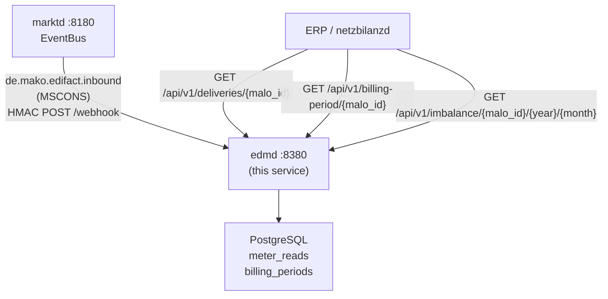

# `edmd` Operator Guide

`edmd` is the **Energy Data Management daemon** — the service that stores meter
readings and computes billing-relevant energy quantities for downstream services.

Key responsibilities:
- Store MSCONS meter readings (SLP and RLM) via the webhook from `marktd`.
- Provide a time-series query API for ERP and `netzbilanzd`.
- Compute `MeterBillingPeriod` — RLM Spitzenleistung (kW) and Gas Brennwert /
  Zustandszahl — required by `netzbilanzd` for Leistungspreis billing.
- Accumulate **Mehr-/Mindermengensaldo** imbalance records per MaLo.



---

## Port layout

```
┌─────────────────────────────────────────────────────────────────┐
│  edmd  :8380                                                     │
│                                                                 │
│  POST /webhook                          ← marktd CloudEvents    │
│  GET  /api/v1/deliveries/{malo_id}      ← meter reads / TS      │
│  GET  /api/v1/billing-period/{malo_id}  ← MeterBillingPeriod    │
│  GET  /api/v1/imbalance/{malo_id}/{y}/{m} ← Mehr-/Mindermengen  │
│  GET  /health/live  /health/ready                               │
└─────────────────────────────────────────────────────────────────┘
```

---

## Inbound event routing

| `ce_type` | Action |
|-----------|--------|
| `de.mako.edifact.inbound` with `makomessagetype=MSCONS` | Store meter readings |
| anything else | 204 No Content (ignored) |

MSCONS PIDs handled: `13002`, `13003`, `13004`, `13005`, `13006`, `13007`, `13008`,
`13013` (Allokationsliste Gas).

---

## `MeterBillingPeriod`

The `MeterBillingPeriod` struct contains the billing-relevant quantities for
a MaLo over a calendar billing period:

| Field | Type | Source |
|-------|------|--------|
| `spitzenleistung_kw` | `Option<f64>` | RLM: highest 15-min demand in kW |
| `brennwert_kwh_per_m3` | `Option<f64>` | Gas: calorific value (Brennwert H) |
| `zustandszahl` | `Option<f64>` | Gas: state conversion factor |
| `total_kwh` | `f64` | Consumption sum over billing period |

Used by `netzbilanzd` (N4) to compute the Leistungspreisanteil (kW × kW-price)
and Gas quantity conversion (m³ × Brennwert × Zustandszahl = kWh).

---

## Configuration reference

| Env var | CLI flag | Default | Description |
|---------|----------|---------|-------------|
| `EDMD_LISTEN` | `--listen` | `0.0.0.0:8380` | HTTP listen address |
| `EDMD_DATABASE_URL` | `--database-url` | — | PostgreSQL connection string |
| `EDMD_DB_POOL_SIZE` | `--db-pool-size` | `10` | Connection pool size |
| `EDMD_MARKTD_URL` | `--marktd-url` | `http://localhost:8180` | `marktd` base URL |
| `EDMD_MARKTD_API_KEY` | `--marktd-api-key` | — | `marktd` Bearer token |
| `EDMD_SUBSCRIBER_ID` | `--subscriber-id` | `edmd` | EventBus subscriber ID |
| `EDMD_WEBHOOK_URL` | `--webhook-url` | — | Public URL `marktd` POSTs events to |
| `EDMD_WEBHOOK_SECRET` | `--webhook-secret` | — | HMAC signing secret |
| `EDMD_INBOUND_SECRET` | `--inbound-secret` | = webhook-secret | HMAC verification secret |
| `EDMD_TENANT` | `--tenant` | `default` | Tenant identifier |
| `EDMD_OIDC_ISSUER` | `--oidc-issuer` | — | OIDC issuer (omit for dev mode) |
| `EDMD_OIDC_AUDIENCE` | `--oidc-audience` | — | OIDC audience |
| `RUST_LOG` | `--log-level` | `info` | Log level |
| `EDMD_OTEL_ENDPOINT` | `--otel-endpoint` | — | OTLP endpoint |

---

## marktd subscription setup

```bash
curl -X PUT http://marktd:8180/api/v1/subscriptions/edmd \
  -H "Authorization: Bearer <token>" \
  -H "Content-Type: application/json" \
  -d '{
    "webhook_url": "http://edmd:8380/webhook",
    "webhook_secret": "<shared-hmac-secret>",
    "event_types": ["de.mako.edifact.inbound"],
    "active": true
  }'
```

---

## Query examples

```bash
# Meter readings for MaLo in a date range
curl -s "http://edmd:8380/api/v1/deliveries/10001234567?from=2026-01-01T00:00:00Z&to=2026-04-01T00:00:00Z" \
  -H "Authorization: Bearer <token>" | jq .

# Billing period for a MaLo (used by netzbilanzd)
curl -s "http://edmd:8380/api/v1/billing-period/10001234567" \
  -H "Authorization: Bearer <token>" | jq '{
    spitzenleistung_kw,
    total_kwh,
    period_from,
    period_to
  }'

# Mehr-/Mindermengensaldo for January 2026
curl -s "http://edmd:8380/api/v1/imbalance/10001234567/2026/1" \
  -H "Authorization: Bearer <token>" | jq .
```

---

## Cedar ABAC

`edmd` uses Cedar for access control. Grant the `read-timeseries` action to
principals that need meter data access:

```cedar
permit(
  principal,
  action == Action::"read-timeseries",
  resource
) when {
  context.principal_tenant == context.resource_tenant
};
```

---

## Monitoring

| Metric | Target |
|--------|--------|
| Webhook `de.mako.edifact.inbound` success rate | > 99 % |
| DB pool utilisation | < 80 % |
| `billing_period` records older than 3 years | Eligible for archival |
