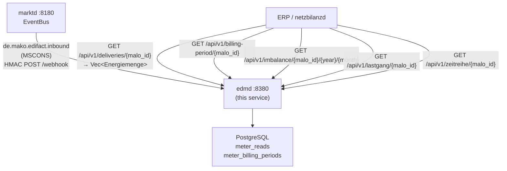

# `edmd` Operator Guide

`edmd` is the **Energy Data Management daemon** — the service that stores meter
readings and computes billing-relevant energy quantities for downstream services.

Key responsibilities:
- Store MSCONS meter readings (SLP and RLM) via the webhook from `marktd`.
- Provide a time-series query API for ERP and `netzbilanzd`.
- Export BO4E `Lastgang` objects and `Zeitreihe` objects for ERP and API-Webdienste Strom consumers.
- Compute `MeterBillingPeriod` — RLM Spitzenleistung (kW) and Gas Brennwert /
  Zustandszahl — required by `netzbilanzd` for Leistungspreis billing.
- Accumulate **Mehr-/Mindermengensaldo** imbalance records per MaLo.



---

## Port layout

```
┌─────────────────────────────────────────────────────────────────┐
│  edmd  :8380                                                     │
│                                                                 │
│  POST /webhook                              ← marktd CloudEvents│
│  GET  /api/v1/deliveries/{malo_id}          ← BO4E Energiemenge │
│  GET  /api/v1/billing-period/{malo_id}      ← MeterBillingPeriod│
│  GET  /api/v1/imbalance/{malo_id}/{y}/{m}   ← Mehr-/Mindermengen│
│  GET  /api/v1/lastgang/{malo_id}            ← BO4E Lastgang     │
│  GET  /api/v1/zeitreihe/{malo_id}           ← BO4E Zeitreihe    │
│  GET  /metrics                              ← Prometheus metrics│
│  GET  /health/live  /health/ready                               │
│  POST|GET /mcp      ← MCP Streamable HTTP (LLM tooling)         │
└─────────────────────────────────────────────────────────────────┘
```

---

## Inbound event routing

| `ce_type` | Action |
|-----------|--------|
| `de.mako.edifact.inbound` with `makomessagetype=MSCONS` | Store meter readings |
| anything else | 204 No Content (ignored) |

MSCONS PIDs handled:

| PID | Description | Direction |
|-----|-------------|-----------|
| 13005, 13006 | Strom Messwerte / Lastgang | NB → LF |
| 13007 | **Gas Datenabruf: Abrechnungsbrennwert + Zustandszahl** | NB → LF |
| 13008, 13009 | Gas Lastgang / Energiemenge | NB → LF |
| 13015–13027 | Strom / Gas various delivery confirmations | NB → LF |

**PID 13007 (Gasbeschaffenheitsdaten):** When a `de.mako.process.completed` event
arrives for PID 13007, `edmd` automatically extracts `brennwert_kwh_per_m3` (from
`QTY+Z08`) and `zustandszahl` (from `QTY+Z10`) and calls `update_gas_quality` to
populate `meter_billing_periods`. This makes Gas NNE billing possible without
manual data entry.

To request Gas quality data on-demand, use `makod` command `geli.gas.datenabruf.anfragen`
(dispatches ORDERS 17103 to the GNB, 10-Werktage response deadline).

---

## BO4E `Energiemenge` deliveries export

`GET /api/v1/deliveries/{malo_id}?from=RFC3339&to=RFC3339`

Returns all stored meter readings for a MaLo as a **BO4E `Energiemenge` array** —
the canonical business object for metered energy quantities, identical in
structure to what MSCONS messages carry per OBIS register per interval.

This endpoint is the primary data feed for ERP billing-import pipelines and
Mehr-/Mindermengen reconciliation tools. The response is a hard-typed BO4E
contract — not a raw database dump — so ERP systems can consume it without
parsing EDIFACT format-version details.

```bash
curl -s "http://edmd:8380/api/v1/deliveries/10001234567?from=2026-01-01T00:00:00Z&to=2026-04-01T00:00:00Z" \
  -H "Authorization: Bearer <token>" | jq '.[0] | {
    obisKennzahl,
    menge_wert: .menge.wert,
    menge_einheit: .menge.einheit,
    zeitraum_start: .zeitraum.startdatum,
    zeitraum_ende:  .zeitraum.enddatum
  }'
```

Response shape (one `Energiemenge` per stored interval read):

```json
[
  {
    "_typ": "ENERGIEMENGE",
    "obisKennzahl": "1-0:1.29.0",
    "menge": {
      "wert": 42.375,
      "einheit": "KWH"
    },
    "zeitraum": {
      "startdatum": "2026-01-01",
      "startuhrzeit": "00:00:00+00:00",
      "enddatum":    "2026-01-01",
      "enduhrzeit":  "00:15:00+00:00"
    }
  }
]
```

**Filtering.** Both `from` and `to` are optional; omitting them returns all
stored readings. Times are RFC 3339 UTC; use `?from=2026-01-01T00:00:00Z`
for calendar-day boundaries.

**Grouping.** One `Energiemenge` object per stored interval row. For grouped
aggregate views (one object per register with all intervals nested), use
`GET /api/v1/lastgang/{malo_id}` instead.

**Cedar action:** `read-timeseries`

---

## `MeterBillingPeriod`

The `MeterBillingPeriod` struct contains the billing-relevant quantities for
a MaLo over a calendar billing period:

| Field | Type | Source |
|-------|------|--------|
| `spitzenleistung_kw` | `Option<f64>` | RLM: highest 15-min demand in kW |
| `brennwert_kwh_per_m3` | `Option<f64>` | Gas: calorific value (Brennwert H) |
| `zustandszahl` | `Option<f64>` | Gas: state conversion factor |
| `total_kwh` | `f64` | Consumption sum over billing period |

Used by `netzbilanzd` (N4) to compute the Leistungspreisanteil (kW × kW-price)
and Gas quantity conversion (m³ × Brennwert × Zustandszahl = kWh).

---

## BO4E `Zeitreihe` export

`GET /api/v1/zeitreihe/{malo_id}?from=RFC3339&to=RFC3339`

Returns the meter time series as a **BO4E `Zeitreihe`** object array — the
generic time-series format used by API-Webdienste Strom consumers. Unlike
`Lastgang`, `Zeitreihe` carries commodity metadata (`medium`, `messart`,
`einheit`) without interval-specific fields (`zeit_intervall_laenge`, OBIS
structure). One `Zeitreihe` is returned per distinct OBIS register.

```bash
curl -s "http://edmd:8380/api/v1/zeitreihe/10001234567?from=2026-01-01T00:00:00Z&to=2026-02-01T00:00:00Z" \
  -H "Authorization: Bearer <token>" | jq '.[0] | {
    bezeichnung,
    medium,
    messart,
    einheit,
    werte_count: (.werte | length)
  }'
```

Response shape:

```json
[
  {
    "bezeichnung": "Zeitreihe MaLo 10001234567 OBIS 1-0:1.29.0",
    "medium":      "STROM",
    "messart":     "MITTELWERT",
    "einheit":     "KWH",
    "werte": [
      {
        "zeitraum": {
          "startdatum": "2026-01-01", "startuhrzeit": "00:00:00+00:00",
          "enddatum":   "2026-01-01", "enduhrzeit":   "00:15:00+00:00"
        },
        "wert": 1.234,
        "status": "ABGELESEN"
      }
    ]
  }
]
```

**When to use `Zeitreihe` vs. `Lastgang`.** Use `Lastgang` when the consumer
needs interval metadata (register, sparte, interval length) for structured
RLM/SLP processing. Use `Zeitreihe` when the consumer is an API-Webdienste
Strom client that expects the generic time-series contract, or when the
commodity context (`medium`, `messart`) is more relevant than the EDIFACT
structure.

---

## BO4E `Lastgang` export

`GET /api/v1/lastgang/{malo_id}?from=RFC3339&to=RFC3339`

Returns the meter time series as a **BO4E `Lastgang`** object array, suitable
for direct import into ERP systems and for the API-Webdienste Strom interface.
Readings are grouped by OBIS-Kennzahl — one `Lastgang` per distinct measurement
register.

```bash
curl -s "http://edmd:8380/api/v1/lastgang/10001234567?from=2026-01-01T00:00:00Z&to=2026-02-01T00:00:00Z" \
  -H "Authorization: Bearer <token>" | jq '.[0] | {
    sparte,
    obis_kennzahl,
    zeit_intervall_laenge,
    werte_count: (.werte | length)
  }'
```

Response shape (one element per OBIS register):

```json
[
  {
    "sparte": "STROM",
    "obis_kennzahl": "1-0:1.29.0",
    "zeitIntervallLaenge": { "wert": 15, "einheit": "VIERTELSTUNDE" },
    "werte": [
      {
        "zeitraum": {
          "startdatum": "2026-01-01", "startuhrzeit": "00:00:00+00:00",
          "enddatum":   "2026-01-01", "enduhrzeit":   "00:15:00+00:00"
        },
        "wert": 1.234,
        "status": "ABGELESEN"
      }
    ]
  }
]
```

**Interval detection.** The `zeitIntervallLaenge` is inferred from the first
consecutive read pair (15 min → `VIERTELSTUNDE`, 60 min → `MINUTE(60)`, 1440
min → `TAG`). RLM reads are typically 15-minute intervals.

**OBIS codes.** Each `MeterRead` carries an optional `obis_code` field
populated from the MSCONS PIA segment. Common values:

| OBIS | Meaning | Sparte |
|------|---------|--------|
| `1-0:1.8.0` | Active energy import, cumulative | Strom |
| `1-0:1.29.0` | Active energy max demand (Spitzenleistung) | Strom RLM |
| `7-20:3.0.0` | Gas volume unconverted (m³) | Gas |
| `7-20:15.0.0` | Gas energy (kWh, after Brennwert conversion) | Gas |

---

## Configuration reference

`edmd` reads its configuration from a **TOML file** (default: `edmd.toml`),
with secrets deferred to environment variables via `"env:VAR_NAME"` values.

### CLI flags

| Flag | Env var | Default | Description |
|------|---------|---------|-------------|
| `--config` / `-c` | `EDMD_CONFIG` | `edmd.toml` | Path to `edmd.toml` |
| `--log-level` | `RUST_LOG` | `info` | Log level |
| `--check` | `EDMD_CHECK` | `false` | Validate config + DB connectivity, then exit 0. Used by Dockerfile HEALTHCHECK. |

```bash
edmd --config /etc/edmd/edmd.toml
# or: EDMD_CONFIG=/etc/edmd/edmd.toml edmd
```

### Full `edmd.toml` reference

```toml
[http]
addr = "0.0.0.0:8380"          # default

[database]
url       = "env:DATABASE_URL"  # required; use env: for secrets
pool_size = 10                  # default

[identity]
tenant = "9900357000004"        # required — MP-ID of the operator

[marktd]
url     = "http://marktd:8180"       # required
api_key = "env:EDMD_MARKTD_API_KEY" # required

[webhook]
inbound_secret = "env:EDMD_INBOUND_SECRET"  # optional; omit for dev

[subscription]
# Self-registers with marktd on startup — no manual curl required.
webhook_url   = "http://edmd:8380/webhook"  # public URL marktd POSTs to
subscriber_id = "edmd"                       # default
event_types   = [
  "de.mako.process.initiated",
  "de.mako.process.completed",
  "de.mako.edifact.inbound",
]

# [oidc]          # omit to disable auth (dev only — never omit in production)
# issuer   = "https://login.microsoftonline.com/{tenant-id}/v2.0"
# audience = "api://mako-edmd"
# jwks_refresh_secs = 300

# [otel]          # omit to disable tracing
# endpoint = "http://otel-collector:4317"
```

---

## marktd subscription

`edmd` **auto-registers** its EventBus subscription with `marktd` on startup
when `subscription.webhook_url` is set in the config — no manual `curl` required.

To force re-registration or verify the subscription:

```bash
curl -s http://marktd:8180/api/v1/subscriptions/edmd \
  -H "Authorization: Bearer <token>" | jq .
```

---

## Query examples

```bash
# BO4E Energiemenge — all meter readings for a MaLo (typed, ERP-consumable)
curl -s "http://edmd:8380/api/v1/deliveries/10001234567?from=2026-01-01T00:00:00Z&to=2026-04-01T00:00:00Z" \
  -H "Authorization: Bearer <token>" | jq '.[0] | {obisKennzahl, menge_kwh: .menge.wert}'

# Billing period for a MaLo (used by netzbilanzd)
curl -s "http://edmd:8380/api/v1/billing-period/10001234567?from=2026-01-01&to=2026-03-31" \
  -H "Authorization: Bearer <token>" | jq '{
    spitzenleistung_kw,
    arbeitsmenge_kwh,
    period_from,
    period_to
  }'

# Mehr-/Mindermengensaldo for January 2026
curl -s "http://edmd:8380/api/v1/imbalance/10001234567/2026/1" \
  -H "Authorization: Bearer <token>" | jq .

# BO4E Lastgang export — one object per OBIS register
curl -s "http://edmd:8380/api/v1/lastgang/10001234567?from=2026-01-01T00:00:00Z&to=2026-02-01T00:00:00Z" \
  -H "Authorization: Bearer <token>" | jq '.[0] | {sparte, obis_kennzahl, zeit_intervall_laenge}'

# BO4E Zeitreihe export — one object per OBIS register (medium/messart metadata)
curl -s "http://edmd:8380/api/v1/zeitreihe/10001234567?from=2026-01-01T00:00:00Z&to=2026-02-01T00:00:00Z" \
  -H "Authorization: Bearer <token>" | jq '.[0] | {bezeichnung, medium, messart, einheit}'
```

---

## Cedar ABAC

`edmd` uses Cedar for access control. Grant the `read-timeseries` action to
principals that need meter data access:

```cedar
permit(
  principal,
  action == Action::"read-timeseries",
  resource
) when {
  context.principal_tenant == context.resource_tenant
};
```

---

## Monitoring

| Metric | Target |
|--------|--------|
| Webhook `de.mako.edifact.inbound` success rate | > 99 % |
| DB pool utilisation | < 80 % |
| `billing_period` records older than 3 years | Eligible for archival |
