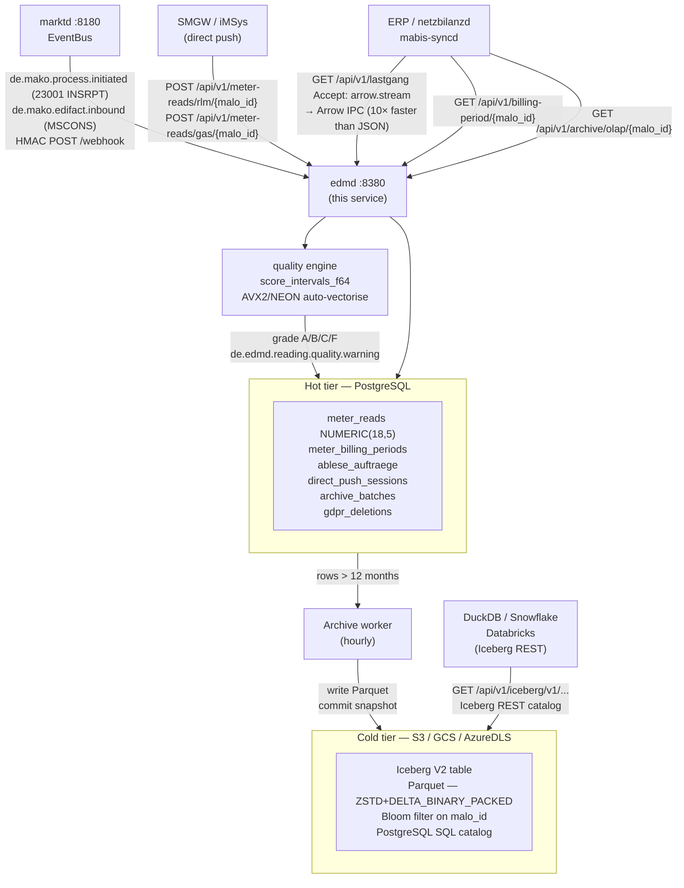
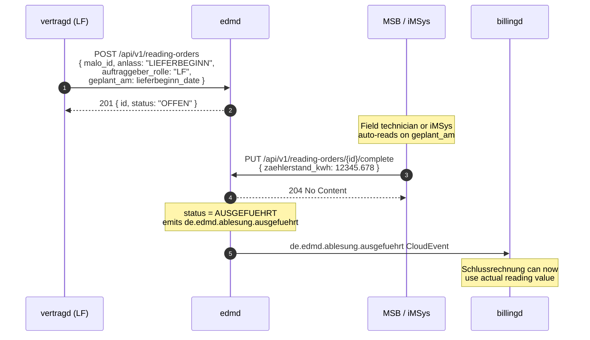
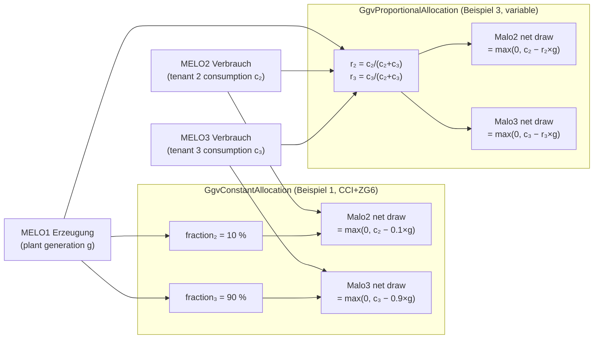
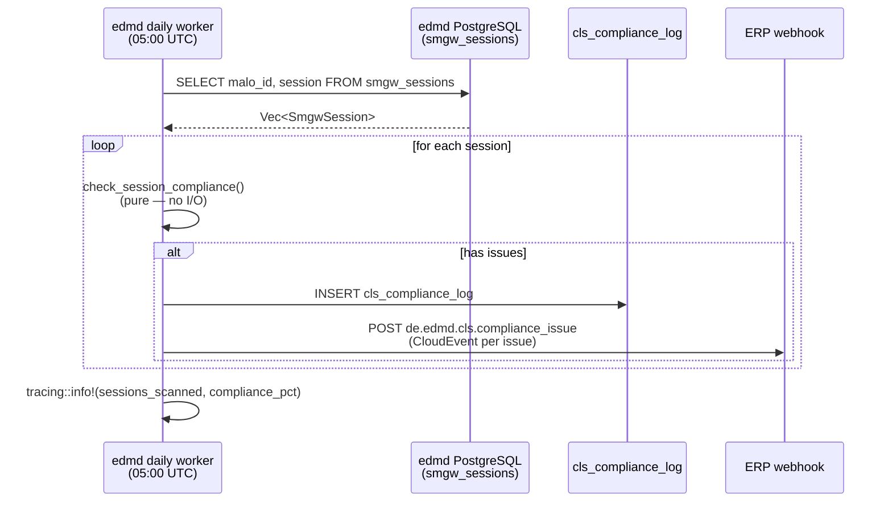

# `edmd` Operator Guide

`edmd` is the **Energy Data Management daemon** — the service that stores meter
readings and computes billing-relevant energy quantities for downstream services.

Key responsibilities:

- Store MSCONS meter readings (SLP and RLM) via the webhook from `marktd`.
- Accept **iMSys / SMGW direct push** (15-min intervals in JSON, bypassing EDIFACT) for §41a real-time billing.
- Run the **Hampel-filter quality scorer** and **V01–V10 validation engine** on all inbound interval data. Emit `de.edmd.reading.quality.warning` CloudEvents for grade C/F data.
- Schedule and track **reading orders** (Ablesesteuerung) for all three market roles (LF, MSB, NB). Auto-creates `INSRPT_STOERUNG` orders when a WiM INSRPT PID 23001 Störungsmeldung arrives.
- Compute and serve **virtual meter time series** (Sum, Residual, PvSelfConsumption, GgvConstantAllocation, GgvProportionalAllocation per §42b EnWG Solarpaket I GGV community solar) on demand.
- Generate **§ 60 Abs. 2 MsbG annual forecasts** (Jahresprognose) and **prior-period substitute values** for gap intervals.
- Provide resampled Lastgang (hourly / daily / monthly / yearly buckets) and monthly Summenzeitreihe for MaBiS.
- Provide a time-series query API for ERP and `netzbilanzd`.
- Export BO4E `Lastgang` objects and `Zeitreihe` objects for ERP and API-Webdienste Strom consumers.
- Compute `MeterBillingPeriod` — RLM Spitzenleistung (kW) and Gas Brennwert / Zustandszahl — required by `netzbilanzd` for Leistungspreis billing.
- Accumulate **Mehr-/Mindermengensaldo** imbalance records per MaLo.
- **Apache Iceberg V2 OLAP archival**: automatically export `meter_reads` older than the configured retention window (default 12 months) to Parquet files on S3/GCS/Azure in Iceberg V2 table format.

The **domain calculation logic** is provided by the [`metering`](https://github.com/hupe1980/mako/tree/main/crates/metering) library crate (zero I/O, no async):

| Function / Type | §-basis | Used in |
|---|---|---|
| `gas_m3_to_kwh_hs(m3, hs, z)` | §25 Nr. 4 MessEV / DVGW G 685 | Gas direct push |
| `aggregate(intervals, AggregationConfig)` | § 12 StromNZV | `MeterBillingPeriod` |
| `classify_messtyp(intervals, source)` | §3/§ 12 StromNZV, §41a EnWG | iMSys classification |
| `compute_imbalance(actual, contracted)` | § 13 StromNZV | Mehr-/Mindermengensaldo |
| `score_intervals(intervals, config)` | — | Hampel quality scoring (A/B/C/F) |
| `validate_intervals(intervals, config)` | §17–22 MsbG | V01–V10 validation engine |
| `resample(intervals, config)` | § 13 StromNZV, MaBiS | Hourly/daily/monthly resampling |
| `compute_virtual_meter(rule, sources)` | §42b EEG, §42a EEG | GGV community solar, Residuallast |
| `project_annual_consumption(intervals, _)` | § 60 Abs. 2 MsbG Jahresprognose | Annual consumption forecast |
| `prior_period_substitutes(gap, _, _, prior, _)` | § 60 Abs. 2 MsbG | Prior-period gap filling |
| `SmgwSession`, `ClsChannel` | BSI TR-03109, §14a EnWG | SMGW lifecycle + CLS management |



---

## Tenant is part of a reading's identity

`meter_reads` is keyed `(tenant, malo_id, dtm_from, obis_code_norm)`.

Leaving `tenant` out of the key made two tenants holding the same MaLo-ID
collide on one row, and the ingest upsert resolved that collision by overwriting
the value *and* reassigning ownership (`SET tenant = EXCLUDED.tenant`) — silent
cross-tenant data loss that every read path then hid, because reads filter on
`tenant` and the row had already changed hands.

### MSCONS stores what it validates

MSCONS is the primary meter-data message in German MaKo. Its interval readings
are parsed from the `ProcessCompleted` event and written through the same
batched `store_reads` path as every other family, so a MSCONS reading lands with
the same primary key, unit and quality record as one that arrived by direct push.

An interval whose quantity will not parse is dropped and counted, not defaulted
to zero: a zero-kWh interval asserts that no energy flowed, which a decode
failure does not establish.

Both the receipt write and the interval store answer **500** on failure.
`marktd` treats 2xx as delivered and will not redeliver, so answering 204 on a
failed write would lose the process with only a log line to show for it.

### Authentication is required, not defaulted

`edmd` and `mabis-syncd` refuse to start without an `[oidc]` section unless
`allow_insecure_no_auth = true` is set explicitly.

The reason is what the absence would mean: `OidcVerifier::disabled` admits every
request as `dev-admin` holding every market role, which satisfies every Cedar
policy — including GDPR erasure and `POST /api/v1/query/sql`. Requiring the
opt-out by name makes running unauthenticated a decision someone wrote down
rather than one they reached by leaving a section out.

```toml
# Development only. Every request is admitted as dev-admin with all roles.
allow_insecure_no_auth = true
```

### The cold tier is partitioned by tenant

The Iceberg partition spec is `identity(tenant)`, `identity(sparte)`,
`month(dtm_from)`. `tenant` leads because it is the coarsest and most selective
predicate every query carries — the archive is read through a tenant-scoped
view, so without it each scan touches every operator's files and prunes them by
row filter instead of by manifest. It also bounds GDPR erasure: an Art. 17
request for one tenant would otherwise implicate files holding other tenants'
readings.

### GDPR Art. 17 in the cold tier

Read-time exclusion hides an erased MaLo's rows from every query. The bytes on
disk are a separate obligation, and Art. 17 reaches them too.

`iceberg-rust` 0.9.1 exposes only `fast_append` on a transaction — there is no
public API to remove or rewrite data files — so the rewrite itself is performed
by an external engine (Spark, Trino). Two endpoints make that obligation
trackable rather than permanently pending:

| Endpoint | Purpose |
|---|---|
| `POST /api/v1/gdpr/erasure/{malo_id}/archive-plan` | list the data files holding the MaLo's rows and record them in `gdpr_archive_files` |
| `POST /api/v1/gdpr/erasure/{malo_id}/archive-complete` | record that the rewrite ran, clearing `archive_deletion_pending` |

Planning requires an erasure already on record — planning a rewrite for a MaLo
nobody asked to erase would delete lawfully-held data. When no files match, the
obligation is discharged immediately: nothing of that MaLo reached the cold tier.

### The cold tier is tenant-scoped by construction

`meter_reads_archive` is a **view** over the physical Iceberg table, already
restricted to the tenant and to rows not subject to a GDPR erasure. Scoping
therefore holds for every query in the module and for the caller-supplied SQL
accepted by `POST /api/v1/query/sql`, rather than depending on each call site
remembering a predicate. A query naming the physical table behind the view is
rejected with `403`.

### GDPR erasure is one transaction

All five steps — request record, anonymisation, and three deletes — run in a
single transaction and the handler names the step that failed. An erasure either
completed or it did not: a partial one reported as success closes out the Art. 17
request while personal data remains, and the caller cannot tell that apart from a
MaLo that legitimately held no readings.

Anonymised rows are also reset to `archived = false`, so the redacted version is
re-exported and replaces the personal data already in the cold tier.

### Cached billing periods are invalidated on ingest

`meter_billing_periods` is populated read-through. `store_reads` drops any cached aggregate the new readings fall inside, and the
read-through write refreshes a stale row rather than skipping it.

Without that, a query issued mid-period caches a partial sum that is then served
for that period indefinitely — including to `billingd` — because the read path
prefers the cache.

### Archival cannot flag a corrected row as durable

`valid_from_tx` doubles as the row version: every write to `meter_reads` bumps
it, and the archival worker's mark-archived matches on the version it exported.

A correction landing mid-batch therefore leaves the row `archived = false` and
queued for a fresh export. Without the version check, the corrected value would
be flagged durable while Iceberg still held the pre-correction one, and partition
release would drop the only correct copy.

### Substitution is atomic

A substitute reading and its § 60 Abs. 6 MsbG audit row commit in one transaction. As
two independent writes a failure part-way would leave billable `SUBSTITUTED`
values in `meter_reads` with no record of who substituted them or why.

### Corrections name their register

`CorrectionRecord` carries `obis_code`, and the update is keyed on
`(tenant, malo_id, dtm_from, obis_code_norm)`. Matching on `dtm_to` instead would
rewrite **every** OBIS register at that timestamp, so correcting an import
reading also overwrote the export one.

A correction advances `allocation_version` to `CORRECTION`. The
`mr_allocation_version` index exists for mabis-syncd to find exactly these rows,
and matches nothing if the value never leaves `INITIAL`.

### Tenant scoping is not optional on any statement

A MaLo-ID is not unique across tenants, so every statement touching a MaLo binds
`tenant`. What each would otherwise do:

| Statement | Consequence of an unscoped query |
|---|---|
| `GET /api/v1/billing-periods?tenant=` | Cedar authorises against the deployment tenant; honouring a caller-supplied parameter lets a principal cleared for its own tenant read any other tenant's portfolio |
| `update_gas_quality` | one tenant's calorific value rewrites every tenant's gas billing rows for the same MaLo-ID, changing invoiced kWh |
| GDPR erasure | one tenant's Art. 17 request deletes another tenant's billing aggregates |
| quality rescore | one tenant's gap verdict is stamped onto another's readings |

`update_gas_quality` takes `tenant` in its trait signature so the scope cannot be
forgotten at a call site, and a `?tenant=` that differs from the authorised
tenant is `403`.

## Ingest is batched and validated

All ingest goes through `store_reads`, a single `unnest` statement per batch.
One statement per batch is what keeps the 100M-intervals/day target reachable,
and it makes a partial failure impossible: the batch lands whole or not at all.

`store_reads` writes the provenance columns alongside the reading:
`allocation_version` carries the MaBiS version a value belongs to,
`sender_mp_id` carries § 60 Abs. 6 MsbG per-interval MSB attribution across a WiM
switch, and `push_session`, `quality_warnings` and `unit` carry the rest.

### Every ingest family validates before it stores

The IoT, RLM/gas direct-push and bulk-import paths all route through
`validate_and_annotate`, which runs **V01–V10 before storing** and attaches each
issue to the rows it names. One code path means a reading lands with the same
quality record whichever door it came in by.

Validation annotates and never rejects. Whether an interval is billable is a
separate decision from whether it is stored — discarding a suspect reading would
destroy the evidence needed to resolve it. Findings land in `quality_warnings`;
when a row already carries a session-level Hampel summary, the rule findings are
added under a `validation` key rather than replacing it. A batch with any issue
returns `202 Accepted` with a `validation` block instead of `201`.

An unrecognised `quality` flag is refused at the boundary with `422`. The column
is CHECK-constrained, so binding an unrecognised value raw fails the insert;
coercing it to `UNKNOWN` instead would silently strip the row from every billing
aggregate.

`stored_count` reports rows that actually committed. Each ingest family writes
one batched statement, so a batch lands whole or not at all.

### One unit contract across the ingest families

Direct push parses units with `MeasurementUnit::parse_scaled` — the same
machinery the IoT path uses — and cross-checks the result against the Sparte. A
unit that is neither the Sparte's measured unit nor its billing unit is rejected.

This closed two mis-billing paths. The gas endpoint compared the unit string
against `"m3"`, which never matches the superscript `"m³"` that `MeasurementUnit`
accepts, so a gas push in m³ was stored **unconverted** — roughly a tenfold
under-count, and a value labelled `"m3"` reaching the electricity endpoint would
be multiplied by the gas Brennwert.

`brennwert_kwh_per_m3` is **required** when gas arrives in m³, on every path.
§25 Nr. 4 MessEV requires a value determined by the recognised rules of
technology, which a national average is not: an L-Gas supply area (Hs ≈ 8.8)
billed at the H-Gas 10.55 is a systematic ~20 % over-charge, with nothing on the
row recording that a default was used.

### Substitute values do not overwrite measurements

`POST /api/v1/meter-reads/{malo_id}/substitute` requires an `obis_code`. It is
part of the primary key, so a substitute filed without one lands on the
empty-string register rather than against the reading it stands in for — leaving
**both** rows in the table, and a 100 kWh reading plus its substitute billing
1099 kWh.

The upsert's conflict action carries `WHERE meter_reads.quality IN ('FAULTY',
'UNKNOWN')`. § 60 Abs. 2 MsbG authorises an Ersatzwert where no usable measurement
exists, not in place of one, so a window overlapping billable data leaves that
data untouched and returns those intervals in `skipped_measured`.

Four methods are honoured: `PriorPeriodAverage`, `LinearInterpolation`,
`ZeroFill` and `LastValueCarryForward`. Anything else is `422`.

Each interval records the method that actually produced it in
`intervals[].method`, which may differ from the request: a prior-period average
with no matching reference slot degrades to carry-forward, then to zero, and
linear interpolation with no closing value has no slope to follow. The response
reports `method_requested` alongside the set of `methods_applied` — a § 60 Abs. 6 MsbG
audit record naming a method that did not run would be a claim the value does not
support.

## `meter_reads` is partitioned, and retention actually reclaims disk

`meter_reads` is range-partitioned monthly on `dtm_from`. The partition key is
already part of the primary key `(tenant, malo_id, dtm_from, obis_code_norm)`,
which is what a partitioned table requires of every unique constraint.

Every partition additionally carries an `EXCLUDE USING gist` constraint
(`btree_gist`) over `(tenant, malo_id, obis_code_norm, tstzrange(dtm_from,
dtm_to, '[)'))`: the primary key stops identical starts and V02 catches
overlaps inside one batch, but only this constraint refuses a later delivery
whose range overlaps a stored one — the double-counting case no application
check can see. Adjacent intervals stay legal (half-open ranges); a redelivery
of the same interval hits the primary key and takes the audited upsert path
instead.

The archival worker runs three partition-related steps per pass:

| Step | Function | Purpose |
|---|---|---|
| before archiving | `ensure_meter_reads_partitions(back, ahead)` | keeps a rolling window of months; a reading whose month has no partition cannot be inserted at all |
| archive | export to Iceberg, then mark `archived = true` | records that a row is durable in the cold tier |
| after archiving | `drop_archived_meter_reads_partitions(cutoff)` | releases whole months whose rows are all archived |

The release step is what reclaims disk: marking a row `archived` records that it
is safe to release, and without the drop the hot tier would grow without bound
regardless of `retention_months`.

Dropping a partition is one catalogue operation. A bulk `DELETE` over the same
rows would instead leave dead tuples for autovacuum to reclaim, competing with
ingest for I/O on the busiest table in the schema.

A partition is only released when **no row in it still has `archived = false`**.
A stalled or failed archival run therefore delays reclamation instead of
destroying unexported readings.

`meter_reads` carries 8 secondary indexes. Most are partial, so they cover only
the rows a query actually looks for — negative quantities, rows with warnings,
corrections, and rows still owed an export — rather than the whole table.

TimescaleDB is not used: `create_hypertable` is not applicable to an
already-partitioned table, and native partitioning keeps the schema installable
on any PostgreSQL 15+ instance without an extension.

## Rate limiting

Ingest endpoints accept unbounded batches, so an unthrottled client can saturate
the write path for every other tenant. Two limiters apply:

| Limiter | Key | Bounds |
|---|---|---|
| `with_tenant_rate_limit` | authenticated tenant, else peer address | any single caller |
| `with_rate_limit` | global | their sum |

A global bucket alone lets one busy tenant consume the whole allowance and starve
every other tenant on a shared deployment, so both are applied.

Rejections return `429` with a `Retry-After` header rounded **up** to whole
seconds — rounding down would invite an immediate retry that is rejected again.
The bucket key is a hash of the bearer token, never the token itself.

```toml
[rate_limit]
requests_per_second            = 500   # global sustained
burst                          = 1000  # metered ingest is bursty by nature
per_tenant_requests_per_second = 100
```

`burst` is deliberately above the sustained rate: an MSCONS batch or an IoT
gateway flushing a backlog arrives all at once but fits comfortably within the
hourly budget.

## V07 — DST ambiguity

Germany repeats local 02:00–03:00 when CEST ends, so that day has **25 hours**.
A series converted from local time without carrying the UTC offset collapses the
two passes into one and silently loses an hour of energy.

V07 fires when a series covers a **whole local fall-back day** but carries less
than 25 hours. Anchoring on whole-day coverage is what makes it immune to
truncated query windows: a series that merely *starts* inside the repeated hour
is short, not corrupt.

## Reading-order idempotency

`ON CONFLICT DO NOTHING` needs a unique index to fire on. With only the surrogate
`id` primary key every redelivered INSRPT minted a fresh UUID and created a
duplicate order. Two partial unique indexes now back it:

| Index | Covers |
|---|---|
| `ablese_insrpt_unique (tenant, insrpt_process_id)` | INSRPT-triggered orders |
| `ablese_scheduled_unique (tenant, malo_id, anlass, geplant_am)` | campaign/scheduled orders, which carry no process id |

## Port layout

```
┌────────────────────────────────────────────────────────────────────────────┐
│  edmd  :8380                                                                │
│                                                                            │
│  POST /webhook                              ← marktd CloudEvents          │
│  GET  /api/v1/deliveries/{malo_id}          ← BO4E Energiemenge           │
│  GET  /api/v1/billing-period/{malo_id}      ← MeterBillingPeriod          │
│  GET  /api/v1/billing-periods               ← collection (mabis-syncd)    │
│  GET  /api/v1/imbalance/{malo_id}/{y}/{m}   ← Mehr-/Mindermengen          │
│  GET  /api/v1/lastgang/{malo_id}            ← BO4E Lastgang               │
│  GET  /api/v1/zeitreihe/{malo_id}           ← BO4E Zeitreihe              │
│  GET  /api/v1/lastgang/{malo_id}/resampled  ← hourly/daily/monthly        │
│  GET  /api/v1/summenzeitreihe/{malo_id}     ← MaBiS monthly aggregate     │
│  GET  /api/v1/forecast/{malo_id}            ← § 60 Abs. 2 MsbG Jahresprognose   │
│  GET  /api/v1/gas-quality/{malo_id}         ← Brennwert + Zustandszahl    │
│  GET  /api/v1/corrections/{malo_id}         ← bitemporal audit trail      │
│  GET  /api/v1/quality-assessments/{malo_id} ← Hampel rescore history      │
│  GET  /api/v1/sharing/{community_id}/alloc  ← §42c Energy Sharing VZW     │
│  GET  /api/v1/sharing/readiness             ← §42c delivery readiness    │
│                                                                            │
│  ── iMSys direct push ────────────────────────────────────────────────── │
│  POST /api/v1/meter-reads/rlm/{malo_id}     ← Strom 15-min direct push   │
│  POST /api/v1/meter-reads/gas/{malo_id}     ← Gas direct push (m³→kWh_Hs)│
│                                                                            │
│  ── §14a SMGW session registry (MsbG §21c / BSI TR-03109) ─────────────  │
│  PUT  /api/v1/smgw/{malo_id}                ← upsert SmgwSession          │
│  GET  /api/v1/smgw/{malo_id}                ← session + recent issues     │
│  GET  /api/v1/smgw                          ← fleet list with issue counts│
│  GET  /api/v1/smgw/compliance               ← read-only compliance scan   │
│  POST /api/v1/smgw/compliance/scan          ← side-effecting fleet sweep  │
│                                                                            │
│  ── Reading order scheduling (Ablesesteuerung) ──────────────────────── │
│  POST|GET /api/v1/reading-orders            ← schedule / list orders     │
│  GET  /api/v1/reading-orders/{id}           ← order detail               │
│  PUT  /api/v1/reading-orders/{id}/complete  ← record reading result       │
│  PUT  /api/v1/reading-orders/{id}/cancel    ← cancel                     │
│  POST /api/v1/reading-orders/campaign       ← bulk Jahresablese-Kampagne  │
│                                                                            │
│  ── Quality scoring ──────────────────────────────────────────────────── │
│  POST /api/v1/quality-score/{malo_id}       ← retroactive Hampel rescore  │
│                                                                            │
│  ── Iceberg / S3 OLAP archival ─────────────────────────────────────────  │
│  GET  /api/v1/archive/status                ← archival stats + batches   │
│  GET  /api/v1/archive/olap/{malo_id}        ← MMM aggregation (OLAP)     │
│  GET  /api/v1/archive/portfolio             ← portfolio-level OLAP        │
│  GET  /api/v1/archive/timeseries/{malo_id}  ← historical time-series      │
│  POST /api/v1/query/sql                     ← arbitrary DataFusion SQL    │
│                                                                            │
│  ── Iceberg REST catalog (DuckDB / Snowflake / Databricks) ──────────── │
│  GET  /api/v1/iceberg/v1/config                                           │
│  GET  /api/v1/iceberg/v1/namespaces[/{ns}/tables[/{table}]]              │
│                                                                            │
│  ── GDPR ─────────────────────────────────────────────────────────────── │
│  DELETE /api/v1/gdpr/erasure/{malo_id}      ← Art. 17 DSGVO erasure      │
│                                                                            │
│  GET  /metrics                              ← Prometheus metrics          │
│  GET  /health/live  /health/ready                                         │
│  POST|GET /mcp      ← MCP Streamable HTTP (LLM tooling)                   │
└────────────────────────────────────────────────────────────────────────────┘
```


### §42c Energy-Sharing readiness

`GET /api/v1/sharing/readiness` answers the **delivery** half of §42c eligibility:
which delivery points are actually producing the quarter-hour series that
§42c Abs. 1 EnWG requires.

| Parameter | Default | Meaning |
|---|---|---|
| `from` / `to` | last 30 days | RFC 3339 observation window |
| `malo_ids` | every MaLo with readings | Comma-separated candidate list |
| `min_coverage_pct` | 95.0 | Share of expected quarter-hour slots required |

Per point it returns `DELIVERING` · `INSUFFICIENT` · `ABSENT` plus the detected
interval length, coverage, and a `required_action`.

**Capability and delivery are separate questions.** `marktd`
`GET /api/v1/melos/{id}/sharing-eligibility` answers whether the *installed
metering* qualifies; this endpoint answers whether values are *arriving*. The
distinction is the point — a meter that supports Zählerstandsgangmessung but has
none configured is *capable but not delivering*, and needs a configuration order
rather than an iMSys rollout. Collapsing both into one boolean hides exactly the
state an operator must act on.

Resolution is derived per point from the median of `dtm_to - dtm_from`
(`metering::classification::detect_interval_length`) — `meter_reads` stores no
resolution column. The shared rule set lives in `metering::sharing`.

---

## Inbound event routing

| `ce_type` | `makopid` | Action |
|-----------|-----------|--------|
| `de.mako.process.completed` | MSCONS set | Store meter readings |
| `de.mako.process.completed` | 55001 (GPKE Anmeldung) | Auto-create `LIEFERBEGINN` reading order (GPKE Beginn-/Schlussablesung) |
| `de.mako.process.completed` | 55004 / 55007 (GPKE Abmeldung / Beendigung der Zuordnung) | Auto-create `LIEFERENDE` reading order (GPKE Beginn-/Schlussablesung) |
| `de.mako.process.initiated` | 23001 (INSRPT Störungsmeldung) | Auto-create `INSRPT_STOERUNG` reading order (WiM Störungsmeldung) |
| `de.mako.process.initiated` | 23003 / 23004 / 23008 (INSRPT Technische Änderung / Gerätebefund) | Auto-create `SONDERABLESUNG` reading order |
| `de.mako.process.initiated` | 23005 / 23009 (WiM Gas INSRPT) | Auto-create `SONDERABLESUNG` reading order |
| anything else | — | 204 No Content (ignored) |

### MSCONS PIDs handled

| PID | Description | Direction |
|-----|-------------|-----------|
| 13005 | Lastgang Messwerte Strom | NB → LF |
| 13006 | Zählerstand / Ersatzwert Strom | NB → LF |
| 13007 | **Gasbeschaffenheitsdaten — Brennwert + Zustandszahl** | NB → LF |
| 13013 | Allokationsliste Gas MMMA (GaBi Gas 2.1) | NB → LF |
| 13015 | Lastgang Summenzeitreihe SLP Strom | NB → LF |
| 13016 | Ausfallarbeit Strom | NB → LF |
| 13017 | Zählerstand Strom — Ablese-Übermittlung | NB → LF |
| 13018 | Messwerte Strom — korrigierte Werte | NB → LF |
| 13019 | Netzverluste Strom | NB → LF |
| 13020–13023, 13026 | Redispatch 2.0 Zeitreihen | NB / ÜNB → LF |
| 13025 | Lastgang Gas — Zustandsmengen / Energiemengen | NB → LF |
| 13027 | Zählerstand Gas | NB → LF |

**PID 13007 (Gasbeschaffenheitsdaten):** When a `de.mako.process.completed` event
arrives for PID 13007, `edmd` automatically extracts `brennwert_kwh_per_m3` (from
`QTY+Z08`) and `zustandszahl` (from `QTY+Z10`) and populates `meter_billing_periods`.
This makes Gas NNE billing possible without manual data entry.

To request Gas quality data on-demand, use `makod` command `geli.gas.datenabruf.anfragen`
(dispatches ORDERS 17103 to the GNB, 10-Werktage response deadline).

---

## iMSys direct push (§41a)

For **iMSys / SMGW** customers with 15-min interval meters, `edmd` accepts direct JSON
push bypassing the EDIFACT/MSCONS pipeline entirely. This is required for §41a EnWG
dynamic tariffs where the MSCONS round-trip adds 15–60 min latency.

```http
POST /api/v1/meter-reads/rlm/{malo_id}
Content-Type: application/json

{
  "session_id": "SMGW-SN-00112233-20260713T0600Z",
  "source": "SMGW",
  "obis_code": "1-0:1.8.0",
  "intervals": [
    { "from": "2026-07-13T00:00:00Z", "to": "2026-07-13T00:15:00Z", "value": "2.345", "unit": "kWh" },
    { "from": "2026-07-13T00:15:00Z", "to": "2026-07-13T00:30:00Z", "value": "2.412", "unit": "kWh" }
  ]
}
```

**Gas variant** (`/api/v1/meter-reads/gas/{malo_id}`): supply `unit = "m3"` plus `brennwert_kwh_per_m3` and optionally `zustandszahl`; `edmd` converts m³ × Hs × Z to kWh_Hs before storing.

The response includes a **quality report** (see below). HTTP 201 = clean data; 202 = stored with quality warnings.

Idempotent on `session_id` — re-submitting the same key returns 200 with the original result.

---

## IoT meter ingest (LoRaWAN, M-Bus, REST heat meters)

```http
POST /api/v1/meter-reads/iot/{malo_id}
```

Heat and water submetering points usually have **no Smart-Meter-Gateway**, so a
purely MSCONS pipeline cannot see them at all. This endpoint is the ingest path
for LoRaWAN uplinks, wM-Bus/M-Bus concentrators and REST-capable heat meters.

**Why it matters commercially.** HeizkostenV §5 Abs. 3 requires every
non-remote-readable device to be retrofitted or replaced by **31 December 2026**
(subject to the Satz 2 hardship exception, and distinct from the §5 Abs. 4
smart-meter-gateway deadline of 31 December 2031),
and §6a requires a monthly consumption message to each user. §12 Abs. 1 backs
both with a **3 % Kürzungsrecht** — Satz 2 for a missing remote-readable device
and, separately, Satz 3 for information that is "nicht oder nicht **vollständig**"
supplied. Missing an ingest path here is a direct revenue deduction.

```http
POST /api/v1/meter-reads/iot/62345678901
Content-Type: application/json

{
  "sparte": "WAERME",
  "unit": "KWH",
  "session_id": "70B3D57ED0012345:4711",
  "transport": "LORAWAN",
  "device_id": "70B3D57ED0012345",
  "obis_code": "6-0:1.0.0",
  "eichung_bis": "2027-12-31",
  "raw_payload": "AwAAECcAAA==",
  "intervals": [
    { "from": "2026-07-13T00:00:00Z", "to": "2026-07-13T01:00:00Z", "value": "4.120" }
  ]
}
```

### The payload must already be decoded

`edmd` deliberately does **not** decode wM-Bus/OMS frames. German submetering
payload specs are gated in practice: ista's protocol is proprietary, Kamstrup's
byte-level wireless document (5512-1034) exists nowhere in public and its AES
keys require a `mykamstrup.com` login plus serial number or an invoice copy, and
Itron formally answered "**No**" to *"Is the payload structure available for
decoding?"* on its own LoRa Alliance device questionnaire for the Cyble 5.
Apator's APT-WMBUS-NA-1 manual states outright that "the application layer is
Apator proprietary". Every working open-source decoder for these vendors is
reverse-engineered rather than spec-derived.

Decoding belongs at the network server or vendor codec, which holds the device
keys. `edmd` retains **`raw_payload` verbatim**: network-server codecs are mutable
and carry no version on the uplink, so a stored value can only be re-derived from
the original frame.

### Idempotency

`session_id` is **required**; there is no timestamp-derived fallback. Use
`devEUI:fCnt` for LoRaWAN or the telegram access number for OMS/M-Bus. A committed
session replays as **200 `already_committed`**. A batch in which nothing landed is
not committed, so it stays retryable.

### Unit and Sparte

A Sparte has **two** units and the endpoint accepts either:

| `sparte` | as measured | as billed |
|---|---|---|
| `STROM` | kWh | kWh |
| `GAS` | **m³** | **kWh** |
| `WAERME` | kWh | kWh |
| `WASSER` | m³ | m³ |

A gas meter registers **volume**, so a raw gas uplink arrives in m³ and
`brennwert_kwh_per_m3` is **required**; `zustandszahl` defaults to 1.0. The
calorific value varies by supply area and month, so it is not defaulted. Submit
`unit = KWH` to supply pre-converted values. The response reports
`unit_submitted`, `unit_stored` and `converted`.

Anything outside those two units is a decode error and 422s, including a `WASSER`
reading in kWh.

The conversion rests on the Eichrecht exceptions to §33 Abs. 1 MessEG, which
permits only measured values: §25 Nr. 4 MessEV covers the Brennwert itself and
§25 Nr. 7 MessEV a value formed as a *"Produkt"* of measured values. DVGW G 685 is
the anerkannte Regel der Technik referenced by Nr. 4.

**Unit strings are liberal, storage is canonical.** `kWh`, `Wh`, `MWh`, `GWh`,
`GJ` and `MJ` are all accepted for energy, `m³`/`m3`/`cbm` and `l`/`ltr`/`liter`
for volume — German heat meters ship with kWh, MWh *or* GJ registers depending on
the ordered variant, and water submeters commonly report litres. Values are
rescaled to kWh/m³ before storage using **exact rational** factors (GJ→kWh is
2500/9, a repeating decimal), so `3.6 GJ` stores as exactly `1000 kWh`.

Negative values are rejected. BDEW requires quantities to be positive or zero;
direction belongs in the OBIS code, so a negative here is a decode error.

### Calibration (Eichfrist)

An expired Eichfrist produces a **warning, never a rejection**. §37 Abs. 1 Satz 1
Nr. 1 MessEG bars use of the *Messgerät* once the Eichfrist has run, and §33 Abs. 1
MessEG then bars the resulting *values*, since a device used contrary to §37 was
not "bestimmungsgemäß verwendet". BGH VIII ZR 112/10 holds that in civil billing
such a reading loses only its *Vermutung der Richtigkeit* and remains usable with
the burden of proof shifted. Public-law Gebührenabrechnung is stricter (BayVGH
20 B 21.2421 requires estimation), which is a billing-side decision.

§37 Abs. 2 also ends a Eichfrist early on defect or tampering, so an expiry date
alone is not the whole eichrechtliche validity test.

Note that §34 Abs. 2 MessEV ends a Eichfrist of at least a year only *"mit dem
Ende des Jahres, in dem die Frist rechnerisch endet"*, so callers send
`YYYY-12-31`.
Leave `eichung_bis` unset for Heizkostenverteiler. They have no Eichfrist because
they are not Messgeräte under MessEG at all — "Heizkostenverteiler" appears nowhere
in MessEV, neither in Anlage 1 nor in the Eichfristen of Anlage 7. HeizkostenV
§5 Abs. 1 admits them through a conditional clause ("soweit nicht eichrechtliche
Bestimmungen zur Anwendung kommen") that requires expert-body confirmation against
EN 834 / EN 835 instead of Eichung.

Note also that **no German law prescribes a unit for heat meters.** MID Annex VI
(MI-004) contains no units clause, and EN 1434-1 cl. 6.3.1 permits *"Joules,
Watt-hours or decimal multiples of those units"* — a GJ meter is exactly as
compliant as a kWh one. This is why the endpoint accepts GJ and MJ rather than
assuming kWh. The one hard kWh mandate is HeizkostenV §6a Abs. 2 Nr. 1, and it
governs the monthly consumption *message*, not the meter.

### Status codes

| Code | Meaning |
|---|---|
| 201 | All intervals stored, no warnings |
| 202 | Stored, with calibration warnings and/or per-interval rejections |
| 200 | `session_id` already committed — no-op replay |
| 422 | Unknown `sparte`/`unit`, unit/Sparte mismatch, or nothing storable |

---

## Kafka batch ingest (head-end systems)

Head-end systems and LoRaWAN network servers that manage large gateway fleets
stream reading batches instead of pushing per-gateway HTTP. The optional
Kafka consumer drains such a topic through **the same path as every other
ingest**: V01–V10 validation, quality-warning annotation, PK-idempotent
upsert with the § 60 Abs. 6 MsbG overwrite audit trail.

```toml
[kafka_ingest]
enabled           = true
bootstrap_servers = "kafka-1:9092,kafka-2:9092"
topic             = "edmd.meter-reads"     # default
group_id          = "edmd-ingest"          # default
```

One JSON document per Kafka record, the same batch shape the bulk REST
endpoint accepts:

```json
{
  "malo_id": "51238696781",
  "sparte": "STROM",
  "source": "IOT_PUSH",
  "intervals": [
    {"from": "2026-07-01T00:00:00Z", "to": "2026-07-01T00:15:00Z",
     "value_kwh": "1.25", "quality": "MEASURED", "obis_code": "1-0:1.8.0"}
  ]
}
```

Delivery is **at-least-once**: offsets commit only after the batch is stored,
and a replay is idempotent on the primary key (a value-changing replay leaves
a correction-audit row like any other redelivery). Unparseable records are
logged and skipped so a poison pill cannot wedge the partition; storage
failures abort without committing and the batch is redelivered. A fresh
consumer group starts at the **earliest** offset — readings produced before
the group's first commit are a backlog to drain, not a feed to tail.

The path is covered end-to-end by `tests/kafka_ingest_e2e.rs`: a real
producer and the real consumer talk to krafka's in-process `FakeBroker`
(`test-broker` feature) over an actual TCP socket — produce → group join →
fetch → V01–V10 → audited store → offset commit, poison pill included, with
no Kafka container.

## Hampel-filter quality scoring

`edmd` runs the **Hampel filter** (window k=3, threshold t=3.0, MAD × 1.4826 robust σ)
on every inbound interval batch via `metering::score_intervals_f64`.

Thresholds are **media-aware** — `QualityConfig::for_sparte`. The k=3/t=3.0
defaults suit 15-minute RLM electricity profiles, which are noisy and rarely flat.
Heat and water profiles are dominated by long legitimate zero runs and need two
wider tolerances:

- **Zero runs.** Electricity has a standby floor; water and heat do not, and a
  vacant flat reads zero for months. `max_zero_run_allowed` is 2 for Strom, 48 for
  Gas, 720 for Wärme/Wasser.
- **Sigma floor.** Across a flat window the median absolute deviation is 0, so
  `t × σ` is 0 and every nonzero value scores as an outlier. `min_sigma` floors the
  scale estimate, making the test "deviates by more than the floor".

On the IoT path an outlier is stored as **`PRELIMINARY`** (MSCONS Z84, vorläufiger
Wert) rather than discarded: measured, not yet confirmed. `FAULTY` would assert a
defect the filter cannot establish, and § 60 Abs. 2 MsbG substitution is a downstream
decision. This function:

- Converts Decimal quantities to f64 once per batch — lossless for kWh ≤ 10¹³
- Uses tight loops over contiguous f64 slices that **auto-vectorise to AVX2
  (4×f64/cycle)** on x86-64 and **NEON (2×f64/cycle)** on AArch64 at `opt-level = 2`
- Returns a full `QualityReport` with gap positions, outlier timestamps, zero-run
  length, coverage %, and grade A/B/C/F — not just a scalar score

The Decimal path is kept for exact billing arithmetic; quality scoring uses f64
because outlier detection doesn't require accounting precision.

### Quality checks

| Check | Detection | Grade impact |
|-------|-----------|--------------|
| Gap detection | Adjacent intervals where `to[i] ≠ from[i+1]` | Warnings |
| Consecutive zero-run | Max run of zero-value intervals | Warnings if > 4 |
| **Hampel outliers** | `\|x[i] − window_median\| > 3.0 × 1.4826 × MAD` | Warnings |
| Spike detection | `value > 10 × window_median` of neighbours | Warnings |
| Interval consistency | Mixed SLP/RLM interval durations | Warnings |
| Coverage | `accepted / expected × 100 %` | Grade degrades if < 95 % |

### Quality grades

| Grade | Meaning | Billing action |
|-------|---------|----------------|
| **A** | No anomalies | Normal billing run |
| **B** | Minor issues | Proceed with note |
| **C** | Significant issues | Manual review recommended |
| **F** | Unusable | Block billing run |

Any validation finding (grade C or F) emits a `de.edmd.reading.quality.warning` CloudEvent to the ERP webhook. In `agentd` that event triggers the `msb-history-agent` (LanceDB RAG indexing), the `meter-data-agent` (grade-F investigation), and the `replacement-value-agent` (§ 60 Abs. 2 MsbG Ersatzwertbildung via edmd `trigger_substitution`).

### Retroactive rescoring

To re-score existing historical data (e.g. after a MSCONS delivery of old data, or after a firmware fix):

```http
POST /api/v1/quality-score/{malo_id}?from=2026-01-01T00:00:00Z&to=2026-07-01T00:00:00Z
```

Returns `{ malo_id, rows_rescored, warnings_found, grade }`.

---

## Reading order scheduling (Ablesesteuerung)

`edmd` is the scheduling authority for **all three market roles**:

| Role | Typical `anlass` values |
|------|------------------------|
| LF | `LIEFERBEGINN`, `LIEFERENDE`, `ZWISCHENABLESUNG`, `JAHRESABLESUNG` |
| NB | `JAHRESABLESUNG`, `SPERRUNG`, `ENTSPERRUNG` |
| MSB | `SONDERABLESUNG`, `INSRPT_STOERUNG`, `ISMS_AUSLESUNG` |

### § 60 Abs. 2 MsbG — Schätzwert-Bestätigungsschleife

Jedes gespeicherte Intervall mit Qualität `ESTIMATED`/`SUBSTITUTED` öffnet
eine Bestätigungspflicht in `estimated_read_confirmations` — der MSB schuldet
einen plausibilisierten realen Wert. Die Auflösung geschieht automatisch,
sobald für denselben Slot (MaLo, `dtm_from`, Register) ein `MEASURED`- oder
`CORRECTED`-Wert eintrifft (Ingest oder Korrekturpfad). Der tägliche Worker
(`[confirmation]`, Standard aktiv) eskaliert offene Einträge nach
`deadline_weeks` (Standard 8 — angelehnt an das MaBiS-BKA-Korrekturfenster;
eine gesetzliche Frist existiert nicht) auf `UEBERFAELLIG` und emittiert
`de.edmd.reading.confirmation.overdue`. Abfrage:
`GET /api/v1/confirmations?status=UEBERFAELLIG`.

```toml
[confirmation]
enabled        = true
deadline_weeks = 8
```

### INSRPT → reading order automation (WiM Störungsmeldung)

When `edmd` receives `de.mako.process.initiated` for PID 23001 (INSRPT Störungsmeldung), it **automatically** creates an `INSRPT_STOERUNG` reading order:

- `geplant_am` = tomorrow
- `ausfuehrt_bis` = + 7 calendar days (covers 5 Werktage WiM Strom window)
- `auftraggeber_rolle` = `MSB`
- Idempotent on `insrpt_process_id`

This eliminates the risk of billing a zero-reading period after a device swap — the field-service scheduler is unblocked immediately on INSRPT arrival, without any ERP action required.

---

## MCP server tools

`edmd` exposes an MCP server at `/mcp` with the following tools:

| Tool | Description |
|------|-------------|
| `get_timeseries` | Meter data time-series for a MaLo in a date range |
| `get_imbalance` | Mehr-/Mindermengen imbalance report |
| `get_billing_period` | MeterBillingPeriod (arbeitsmenge, spitzenleistung, brennwert) |
| `get_device_history` | MSB device history text for LanceDB RAG indexing |
| `get_quality_warnings` | Hampel-filter quality warnings (grade A/B/C/F) |
| `list_reading_orders` | Ablesesteuerung orders for a MaLo |
| `list_overdue_reading_orders` | §40 EnWG compliance gaps |
| `trigger_jahresablesung` | Launch or preview annual reading campaign |
| `trigger_substitution` | Generate + store § 60 Abs. 2 MsbG Ersatzwerte for a gap window |
| `get_correction_history` | Bitemporal correction audit trail (§ 60 Abs. 6 MsbG) |
| `validate_timeseries` | Run V01–V10 validation on stored meter reads |
| `get_quality_assessments` | Per-batch quality history (§ 60 Abs. 6 MsbG) |
| `get_summenzeitreihe` | Monthly aggregated kWh for MaBiS |
| `get_annual_forecast` | § 60 Abs. 2 MsbG Jahresprognose |
| `get_gas_quality` | PID 13007 Brennwert + Zustandszahl |

Prompts: `analyze-consumption`, `submit-mscons`, `quality-assessment`, `jahresablesung-workflow`, `reading-order-lifecycle`.

---
---

## BO4E `Energiemenge` deliveries export

`GET /api/v1/deliveries/{malo_id}?from=RFC3339&to=RFC3339`

Returns all stored meter readings for a MaLo as a **BO4E `Energiemenge` array** —
the canonical business object for metered energy quantities, identical in
structure to what MSCONS messages carry per OBIS register per interval.

This endpoint is the primary data feed for ERP billing-import pipelines and
Mehr-/Mindermengen reconciliation tools. The response is a hard-typed BO4E
contract — not a raw database dump — so ERP systems can consume it without
parsing EDIFACT format-version details.

```bash
curl -s "http://edmd:8380/api/v1/deliveries/10001234567?from=2026-01-01T00:00:00Z&to=2026-04-01T00:00:00Z" \
  -H "Authorization: Bearer <token>" | jq '.[0] | {
    obisKennzahl,
    menge_wert: .menge.wert,
    menge_einheit: .menge.einheit,
    zeitraum_start: .zeitraum.startdatum,
    zeitraum_ende:  .zeitraum.enddatum
  }'
```

Response shape (one `Energiemenge` per stored interval read):

```json
[
  {
    "_typ": "ENERGIEMENGE",
    "obisKennzahl": "1-0:1.29.0",
    "menge": {
      "wert": 42.375,
      "einheit": "KWH"
    },
    "zeitraum": {
      "startdatum": "2026-01-01",
      "startuhrzeit": "00:00:00+00:00",
      "enddatum":    "2026-01-01",
      "enduhrzeit":  "00:15:00+00:00"
    }
  }
]
```

**Filtering.** Both `from` and `to` are optional; omitting them returns all
stored readings. Times are RFC 3339 UTC; use `?from=2026-01-01T00:00:00Z`
for calendar-day boundaries.

**Grouping.** One `Energiemenge` object per stored interval row. For grouped
aggregate views (one object per register with all intervals nested), use
`GET /api/v1/lastgang/{malo_id}` instead.

**Cedar action:** `read-timeseries`

---

## `MeterBillingPeriod`

The `MeterBillingPeriod` struct contains the billing-relevant quantities for
a MaLo over a calendar billing period:

| Field | Type | Source |
|-------|------|--------|
| `spitzenleistung_kw` | `Option<f64>` | RLM: highest 15-min demand in kW |
| `brennwert_kwh_per_m3` | `Option<f64>` | Gas: calorific value (Brennwert H) |
| `zustandszahl` | `Option<f64>` | Gas: state conversion factor |
| `total_kwh` | `f64` | Consumption sum over billing period |

Used by `netzbilanzd` to compute the Leistungspreisanteil (kW × kW-price)
and Gas quantity conversion (m³ × Brennwert × Zustandszahl = kWh).

---

## BO4E `Zeitreihe` export

`GET /api/v1/zeitreihe/{malo_id}?from=RFC3339&to=RFC3339`

Returns the meter time series as a **BO4E `Zeitreihe`** object array — the
generic time-series format used by API-Webdienste Strom consumers. Unlike
`Lastgang`, `Zeitreihe` carries commodity metadata (`medium`, `messart`,
`einheit`) without interval-specific fields (`zeit_intervall_laenge`, OBIS
structure). One `Zeitreihe` is returned per distinct OBIS register.

```bash
curl -s "http://edmd:8380/api/v1/zeitreihe/10001234567?from=2026-01-01T00:00:00Z&to=2026-02-01T00:00:00Z" \
  -H "Authorization: Bearer <token>" | jq '.[0] | {
    bezeichnung,
    medium,
    messart,
    einheit,
    werte_count: (.werte | length)
  }'
```

Response shape:

```json
[
  {
    "bezeichnung": "Zeitreihe MaLo 10001234567 OBIS 1-0:1.29.0",
    "medium":      "STROM",
    "messart":     "MITTELWERT",
    "einheit":     "KWH",
    "werte": [
      {
        "zeitraum": {
          "startdatum": "2026-01-01", "startuhrzeit": "00:00:00+00:00",
          "enddatum":   "2026-01-01", "enduhrzeit":   "00:15:00+00:00"
        },
        "wert": 1.234,
        "status": "ABGELESEN"
      }
    ]
  }
]
```

**When to use `Zeitreihe` vs. `Lastgang`.** Use `Lastgang` when the consumer
needs interval metadata (register, sparte, interval length) for structured
RLM/SLP processing. Use `Zeitreihe` when the consumer is an API-Webdienste
Strom client that expects the generic time-series contract, or when the
commodity context (`medium`, `messart`) is more relevant than the EDIFACT
structure.

---

## BO4E `Lastgang` export

`GET /api/v1/lastgang/{malo_id}?from=RFC3339&to=RFC3339`

Returns the meter time series as a **BO4E `Lastgang`** object array, suitable
for direct import into ERP systems and for the API-Webdienste Strom interface.
Readings are grouped by OBIS-Kennzahl — one `Lastgang` per distinct measurement
register.

```bash
curl -s "http://edmd:8380/api/v1/lastgang/10001234567?from=2026-01-01T00:00:00Z&to=2026-02-01T00:00:00Z" \
  -H "Authorization: Bearer <token>" | jq '.[0] | {
    sparte,
    obis_kennzahl,
    zeit_intervall_laenge,
    werte_count: (.werte | length)
  }'
```

Response shape (one element per OBIS register):

```json
[
  {
    "sparte": "STROM",
    "obis_kennzahl": "1-0:1.29.0",
    "zeitIntervallLaenge": { "wert": 15, "einheit": "VIERTELSTUNDE" },
    "werte": [
      {
        "zeitraum": {
          "startdatum": "2026-01-01", "startuhrzeit": "00:00:00+00:00",
          "enddatum":   "2026-01-01", "enduhrzeit":   "00:15:00+00:00"
        },
        "wert": 1.234,
        "status": "ABGELESEN"
      }
    ]
  }
]
```

**Interval detection.** The `zeitIntervallLaenge` is inferred from the first
consecutive read pair (15 min → `VIERTELSTUNDE`, 60 min → `MINUTE(60)`, 1440
min → `TAG`). RLM reads are typically 15-minute intervals.

**OBIS codes.** Each `MeterRead` carries an optional `obis_code` field
populated from the MSCONS PIA segment. Common values:

| OBIS | Meaning | Sparte |
|------|---------|--------|
| `1-0:1.8.0` | Active energy import, cumulative | Strom |
| `1-0:1.29.0` | Active energy max demand (Spitzenleistung) | Strom RLM |
| `7-20:3.0.0` | Gas volume unconverted (m³) | Gas |
| `7-20:15.0.0` | Gas energy (kWh, after Brennwert conversion) | Gas |

---

## Ablesesteuerung — Reading Order API

All three market roles schedule meter readings through the same `edmd` API.
Reading orders are stored in `ablese_auftraege` and linked to `auftrag_positionen`
(O2C) or MaKo process IDs (makod-triggered).



### Anlass types

| Anlass | Triggered by | Purpose |
|---|---|---|
| `LIEFERBEGINN` | `vertragd` after NB confirms Lieferbeginn | Billing cutoff for outgoing supplier |
| `LIEFERENDE` | `vertragd` on Kündigung | Billing cutoff for final invoice |
| `JAHRESABLESUNG` | NB background job or ERP | §40 EnWG annual billing accuracy |
| `ZWISCHENABLESUNG` | LF or ERP | On-demand (tariff change, billing dispute) |
| `EINZUG` | NB on customer move-in | |
| `AUSZUG` | NB on customer move-out | |
| `SPERRUNG` | `sperrd` before disconnection | §19 StromGVV / §33 GasGVV |
| `ENTSPERRUNG` | `sperrd` after reconnection | |
| `SONDERABLESUNG` | MSB on `INSRPT` fault | Billing restart after meter replacement |
| `ISMS_AUSLESUNG` | iMSys automatic | Smart meter daily/15-min auto-readout |

### Endpoints

| Method | Path | Description |
|---|---|---|
| `POST` | `/api/v1/reading-orders` | Create reading order |
| `GET` | `/api/v1/reading-orders` | List (`?malo_id=&status=&anlass=&limit=`) |
| `GET` | `/api/v1/reading-orders/{id}` | Get status and result |
| `PUT` | `/api/v1/reading-orders/{id}/complete` | Record meter reading result |
| `PUT` | `/api/v1/reading-orders/{id}/cancel` | Cancel pending order — no longer owed |
| `PUT` | `/api/v1/reading-orders/{id}/fail` | Record an Ablesehindernis — still owed |
| `GET` | `/api/v1/compliance/jahresablesung/{year}` | §40 Abs. 2 EnWG compliance report |

### Cancelled vs failed

Both are terminal, but only `STORNIERT` discharges the obligation.

```
OFFEN → BEAUFTRAGT → AUSGEFUEHRT   reading taken, obligation met
   └──────────────→ STORNIERT      no longer owed
   └──────────────→ FEHLGESCHLAGEN Ablesehindernis — still owed
```

```http
PUT /api/v1/reading-orders/{id}/fail
{ "grund": "KEIN_ZUTRITT", "notiz": "3x angetroffen, niemand vor Ort" }
```

| Grund | Meaning |
|---|---|
| `KEIN_ZUTRITT` | No access to the premises |
| `ZAEHLER_UNZUGAENGLICH` | Meter present but blocked |
| `ZAEHLER_DEFEKT` | Meter faulty — reading not usable |
| `ZAEHLER_NICHT_AUFFINDBAR` | Meter not found at the recorded location |
| `KUNDE_VERWEIGERT` | Customer refused the reading |
| `ABLESUNG_UNPLAUSIBEL` | Value read but implausible |
| `SONSTIGES` | Anything else — use `notiz` |

A `CHECK` constraint rejects `FEHLGESCHLAGEN` without a `fehlschlag_grund`, so
the status cannot be used to silently retire an order.

### Quality history

Every scoring path — MSCONS, direct push, IoT, bulk, and retroactive rescoring —
records a verdict in `quality_assessments`. The table is a history of how a
MaLo's data quality moved, not a snapshot of the latest opinion: a billing
dispute is answerable only if it shows when a gap appeared, when it was
substituted, and what the grade was at the moment an invoice was raised.

Re-scoring a window supersedes the previous verdict for the same source rather
than appending a duplicate, so the history reads as a sequence of decisions.

Only grade `F` blocks billing. `C` is significant but still billable, which is
why `billing_blocked` is stored rather than derived from the letter by each
reader.

### §40 Abs. 2 EnWG compliance report

`GET /api/v1/compliance/jahresablesung/{year}` reports what became of each
order, because only `AUSGEFUEHRT` discharges the annual-reading obligation:

| Outcome | Obligation |
|---|---|
| `AUSGEFUEHRT` | discharged |
| `STORNIERT` | withdrawn |
| `FEHLGESCHLAGEN` | outstanding, with a documented Ablesehindernis |
| `OFFEN` / `BEAUFTRAGT` past `ausfuehrt_bis` | late |

`fehlschlag_gruende` breaks the failures down by Ablesehindernis, which is what
decides whether the NB may estimate under §40a EnWG or must re-dispatch.

`ablesequote` is computed over **orders raised**, not over the SLP population:
this service knows what was ordered, and `marktd` owns how many MaLos exist. A
MaLo that was never scheduled has no order here at all, so the population must be
cross-checked against `marktd` — reporting a population-based rate from edmd
would overstate coverage.

A failed `JAHRESABLESUNG` past `ausfuehrt_bis` is still a §40 Abs. 2 EnWG gap, so
it keeps appearing in `list_overdue_reading_orders` until the reading is
re-dispatched or the quantity is estimated under §40a EnWG. Failing an order
emits `de.edmd.reading.order.failed`; the reason decides whether the NB may
estimate or must re-dispatch.

### iMSys auto-close

For smart meters (iMSys), MSCONS data arrives automatically via `makod` → `edmd` webhook.
`edmd` auto-closes open reading orders for the same `malo_id` when the MSCONS timestamp
matches `geplant_am` within ±1 day.

---

## Virtual meters (§42b EnWG GGV — Solarpaket I)

`edmd` computes virtual meter time series on demand for MaLo IDs that have a
`virtual_meter_configs` row. Virtual meters are used for:

| Rule | Legal basis | Typical use-case |
|---|---|---|
| `Sum` | — | Portfolio totals, Summenmessung (multiple transformers, shared substations) |
| `Residual` | §42a EEG | Grid feed-in = gross generation − own consumption |
| `PvSelfConsumption` | §42b EEG | Prosumer: net grid draw after PV self-use |
| `GgvConstantAllocation` | §42b Abs. 5 EnWG | GGV tenant with fixed allocation fraction (UTILTS CCI+ZG6) |
| `GgvProportionalAllocation` | §42b Abs. 5 EnWG | GGV tenant with dynamic consumption-based allocation. **Also carries §42c Energy Sharing**: the allocation arithmetic is identical and the regimes are distinguished by `legal_basis` (§42b = in-building, no grid transit; §42c = via the public grid). Should BNetzA's §42c Festlegung mandate different arithmetic, that needs its own variant. |

### GGV allocation formulas (BDEW Anwendungshilfe, 25.01.2024)

Both GGV variants compute the tenant's **net grid draw after PV allocation** —
the energy each participant draws from the public grid *after* their community
PV share has been credited. This is the `Malo_i Verbrauch` quantity in the
BDEW formula sheets, and directly corresponds to the `Verbrauchszeitreihe`
submitted to the BKV in UTILTS.

The critical invariant (§42b Abs. 5 EnWG, sentence 2) is that the **allocated
PV energy can never exceed the tenant's actual consumption** in any 15-minute
interval. This is enforced by the `Pos()` = `max(0, x)` operator:

```
§42b Abs. 5: "Die einem einzelnen teilnehmenden Letztverbraucher im Wege der
rechnerischen Aufteilung innerhalb eines 15-Minuten-Zeitintervalls zuteilbare
Strommenge ist begrenzt auf die durch ihn in diesem Zeitintervall verbrauchte
Strommenge."
```

**Constant allocation** (BDEW Beispiel 1 — UTILTS CCI+ZG6):

$$\text{net\_grid\_draw}_i[t] = \max\!\bigl(0,\ c_i[t] - f_i \times g[t]\bigr)$$

where $c_i[t]$ is tenant $i$'s consumption, $f_i$ is the static fraction, and $g[t]$ is plant generation.

**Proportional allocation** (BDEW Beispiel 3 — variable):

$$r_i[t] = \frac{c_i[t]}{\sum_j c_j[t]} \qquad \text{(0 if } \sum c_j = 0 \text{)}$$

$$\text{net\_grid\_draw}_i[t] = \max\!\bigl(0,\ c_i[t] - r_i[t] \times g[t]\bigr)$$



### Configuring virtual meters

Create a virtual meter config via the REST API (stored in `virtual_meter_configs`).

The table is keyed by `virtual_malo_id` — a virtual meter *is* a Marktlokation,
addressed by its own MaLo-ID — and carries `legal_basis` so a community records
which regime it operates under. `rule_type` is constrained to the variants of
`metering::aggregation_rule::AggregationRule`; `edmd` deserialises `rule_json`
into that enum, so a value the enum does not know is an unreadable row.

`sqlx::query` is unchecked, so a column that does not exist is a runtime error
rather than a compile error. The `schema_code_guard` test suite reads the
migration and the handler queries and asserts they agree — column set, upsert
conflict key, and the `rule_type` list against the enum.

Routes: `POST /api/v1/virtual` · `GET /api/v1/virtual` ·
`GET|DELETE /api/v1/virtual/{virtual_malo_id}` ·
`GET /api/v1/virtual/{virtual_malo_id}/lastgang`.

```bash
# Tenant 2: constant 10 % allocation (GgvConstantAllocation)
curl -X POST http://edmd:8380/api/v1/virtual \
  -H "Authorization: Bearer <token>" \
  -H "Content-Type: application/json" -d '{
    "virtual_malo_id": "10001234002",
    "display_name":    "GGV MaLo2 — Wohnung 2",
    "sparte":          "STROM",
    "legal_basis":     "§42b EnWG Solarpaket I",
    "valid_from":      "2026-01-01T00:00:00Z",
    "rule_json": {
      "GgvConstantAllocation": {
        "plant_melo_id":  "DE0001234560001",
        "tenant_melo_id": "DE0001234560002",
        "fraction":       "0.10"
      }
    }
  }'

# Tenant 2: proportional/variable allocation (GgvProportionalAllocation)
curl -X POST http://edmd:8380/api/v1/virtual \
  -H "Authorization: Bearer <token>" \
  -H "Content-Type: application/json" -d '{
    "virtual_malo_id": "10001234002",
    "display_name":    "GGV MaLo2 — proportional",
    "sparte":          "STROM",
    "legal_basis":     "§42b EnWG Solarpaket I",
    "valid_from":      "2026-01-01T00:00:00Z",
    "rule_json": {
      "GgvProportionalAllocation": {
        "plant_melo_id":      "DE0001234560001",
        "tenant_melo_id":     "DE0001234560002",
        "all_tenant_melo_ids": ["DE0001234560002", "DE0001234560003"]
      }
    }
  }'
```

### Querying virtual meter time series

```bash
# Net grid draw for tenant MaLo2 — computed live from plant + tenant consumption MeLos
curl -s "http://edmd:8380/api/v1/virtual/10001234002/lastgang?from=2026-07-01T00:00:00Z&to=2026-07-02T00:00:00Z" \
  -H "Authorization: Bearer <token>" | jq '{
    virtual_malo_id: "10001234002",
    first_interval: .[0].werte[0]
  }'
```

Results carry `source = "VIRTUAL"`, `quality` propagated as the worst of all
source MeLo qualities, and `obis_code = null` (set by the caller).

### Design: one rule per tenant MaLo

Each GGV tenant has its own `virtual_meter_configs` row referencing the shared
PV plant MeLo plus that tenant's consumption MeLo. For proportional allocation
the rule also lists **all** tenant MeLos so the denominator $\sum c_j[t]$ can
be computed.

| Config field | GgvConstantAllocation | GgvProportionalAllocation |
|---|---|---|
| `plant_melo_id` | shared PV plant MeLo | shared PV plant MeLo |
| `tenant_melo_id` | this tenant's MeLo | this tenant's MeLo |
| `fraction` | static 0–1 | — |
| `all_tenant_melo_ids` | — | all participating tenant MeLos |

### UTILTS encoding (BDEW CCI+ZG6)

The BDEW UTILTS message encodes both allocation methods as `CCI+ZG6` segments
(Aufteilungsfaktor Energiemenge). Constant fractions use `CAV+Z28:::0.10` for
10%, proportional allocation uses `CAV+Z74` (Divisionsquotient). `makod` handles
UTILTS encoding/decoding transparently — `edmd` only deals with the computed
net-grid-draw intervals.

---

`edmd` reads its configuration from a **TOML file** (default: `edmd.toml`),
with secrets deferred to environment variables via `"env:VAR_NAME"` values.

### CLI flags

| Flag | Env var | Default | Description |
|------|---------|---------|-------------|
| `--config` / `-c` | `EDMD_CONFIG` | `edmd.toml` | Path to `edmd.toml` |
| `--log-level` | `RUST_LOG` | `info` | Log level |
| `--check` | `EDMD_CHECK` | `false` | Validate config + DB connectivity, then exit 0. Used by Dockerfile HEALTHCHECK. |

```bash
edmd --config /etc/edmd/edmd.toml
# or: EDMD_CONFIG=/etc/edmd/edmd.toml edmd
```

### Full `edmd.toml` reference

```toml
[http]
addr = "0.0.0.0:8380"          # default

[database]
url       = "env:DATABASE_URL"  # required; use env: for secrets
pool_size = 10                  # default

[identity]
tenant = "9900357000004"        # required — MP-ID of the operator

[marktd]
url     = "http://marktd:8180"       # required
api_key = "env:EDMD_MARKTD_API_KEY" # required

[webhook]
inbound_secret = "env:EDMD_INBOUND_SECRET"  # optional; omit for dev

[subscription]
# Self-registers with marktd on startup — no manual curl required.
webhook_url   = "http://edmd:8380/webhook"  # public URL marktd POSTs to
subscriber_id = "edmd"                       # default
event_types   = [
  "de.mako.process.initiated",
  "de.mako.process.completed",
  "de.mako.edifact.inbound",
]

# [oidc]          # omit to disable auth (dev only — never omit in production)
# issuer   = "https://login.microsoftonline.com/{tenant-id}/v2.0"
# audience = "api://mako-edmd"
# jwks_refresh_secs = 300

# [otel]          # omit to disable tracing
# endpoint = "http://otel-collector:4317"
```

---

## marktd subscription

`edmd` **auto-registers** its EventBus subscription with `marktd` on startup
when `subscription.webhook_url` is set in the config — no manual `curl` required.

To force re-registration or verify the subscription:

```bash
curl -s http://marktd:8180/api/v1/subscriptions/edmd \
  -H "Authorization: Bearer <token>" | jq .
```

---

## Query examples

```bash
# BO4E Energiemenge — all meter readings for a MaLo (typed, ERP-consumable)
curl -s "http://edmd:8380/api/v1/deliveries/10001234567?from=2026-01-01T00:00:00Z&to=2026-04-01T00:00:00Z" \
  -H "Authorization: Bearer <token>" | jq '.[0] | {obisKennzahl, menge_kwh: .menge.wert}'

# Billing period for a MaLo (used by netzbilanzd)
curl -s "http://edmd:8380/api/v1/billing-period/10001234567?from=2026-01-01&to=2026-03-31" \
  -H "Authorization: Bearer <token>" | jq '{
    spitzenleistung_kw,
    arbeitsmenge_kwh,
    period_from,
    period_to
  }'

# Mehr-/Mindermengensaldo for January 2026
curl -s "http://edmd:8380/api/v1/imbalance/10001234567/2026/1" \
  -H "Authorization: Bearer <token>" | jq .

# BO4E Lastgang export — one object per OBIS register
curl -s "http://edmd:8380/api/v1/lastgang/10001234567?from=2026-01-01T00:00:00Z&to=2026-02-01T00:00:00Z" \
  -H "Authorization: Bearer <token>" | jq '.[0] | {sparte, obis_kennzahl, zeit_intervall_laenge}'

# BO4E Zeitreihe export — one object per OBIS register (medium/messart metadata)
curl -s "http://edmd:8380/api/v1/zeitreihe/10001234567?from=2026-01-01T00:00:00Z&to=2026-02-01T00:00:00Z" \
  -H "Authorization: Bearer <token>" | jq '.[0] | {bezeichnung, medium, messart, einheit}'
```

---

## Apache Iceberg / S3 OLAP archival

`edmd` can automatically offload `meter_reads` older than the configured
retention window to **Apache Iceberg V2 tables** on S3, GCS, or Azure Data Lake.
A **PostgreSQL-backed SQL catalog** (`iceberg-catalog-sql`) stores all table
metadata (schema, partition spec, snapshots, manifests) in the same database that
`edmd` already manages — no Nessie, Apache Polaris, or AWS Glue required.
[Apache DataFusion](https://arrow.apache.org/datafusion/) executes SQL queries
over the Parquet files with Iceberg partition pruning for ≥ 10× faster MMM
aggregation versus full PostgreSQL scans.

### Why Iceberg?

| Challenge | Solution |
|---|---|
| 35 000 rows/RLM MaLo/year — PG scan degrades after year 2 | Parquet columnar format on object storage |
| MMM aggregation spans 3+ years | DataFusion pushes predicates to Iceberg partitions + Parquet row-group statistics |
| Multi-engine access (Spark, Trino, DuckDB) | Iceberg V2 table format via `iceberg = "0.9.1"` |
| No external catalog service | `iceberg-catalog-sql` stores metadata in existing PostgreSQL |

### File layout

```
{storage_uri}/
  data/
    sparte=STROM/                    ← identity(sparte) partition
      dtm_from_year=2024/            ← year(dtm_from)
        dtm_from_month=1/            ← month(dtm_from)
          edmd-archive-{uuid}.parquet
    sparte=GAS/
      dtm_from_year=2024/
        ...
  metadata/
    v1.metadata.json                 ← Iceberg V2 table metadata
```

### Configuration

```toml
[archive]
enabled                = true
storage_uri            = "s3://my-bucket/edmd/meter_reads"
access_key_id          = "env:AWS_ACCESS_KEY_ID"
secret_access_key      = "env:AWS_SECRET_ACCESS_KEY"
region                 = "eu-central-1"
# Optional — for MinIO, Ceph RGW, LocalStack:
# endpoint_url         = "http://minio:9000"
retention_months       = 12      # keep in PostgreSQL for this many months
batch_size             = 100000  # rows per archive run
interval_secs          = 3600    # run every hour
# Iceberg catalog in the same PostgreSQL — no extra service:
iceberg_catalog_schema = "iceberg_catalog"   # schema created automatically
iceberg_catalog_name   = "edmd"
```

### Archive OLAP endpoints

| Endpoint | Description |
|---|---|
| `GET /api/v1/archive/status` | Archival statistics (total batches, rows archived, bytes written) + 20 most recent batches |
| `GET /api/v1/archive/olap/{malo_id}?from=&to=` | **MMM aggregation**: total kWh, read count, period bounds for one MaLo from the cold tier |
| `GET /api/v1/archive/portfolio?from=&to=&limit=N` | Portfolio-level aggregation: top-N MaLo by consumption across the full archive |
| `GET /api/v1/archive/timeseries/{malo_id}?from=&to=` | Historical time-series export from Parquet (up to 50 000 rows) |

**Typical `mmm_aggregate` query** (executes via DataFusion over S3 Parquet):

```bash
curl "http://edmd:8380/api/v1/archive/olap/10001234567?from=2023-01-01T00:00:00Z&to=2025-12-31T23:59:59Z" \
  -H "Authorization: Bearer <token>" | jq '{total_kwh, read_count, period_from, period_to}'
```

Response:

```json
{
  "malo_id":     "10001234567",
  "total_kwh":   123456.789,
  "read_count":  105120,
  "period_from": "2023-01-01T00:00:00Z",
  "period_to":   "2025-12-31T23:45:00Z",
  "source":      "iceberg-archive"
}
```

### Dependencies

| Crate | Version | Purpose |
|---|---|---|
| `iceberg` | 0.9.1 | Apache Iceberg core — FileIO, table spec, writer |
| `iceberg-storage-opendal` | 0.9.1 | S3/GCS/AzureDLS storage via opendal 0.55 |
| `iceberg-datafusion` | 0.9.1 | `IcebergTableProvider` for DataFusion SQL |
| `iceberg-catalog-sql` | 0.9.1 | PostgreSQL-backed Iceberg catalog |
| `datafusion` | 52 | SQL query engine + partition pruning |
| MSRV | **1.94** | Required by iceberg 0.9.1 |

---

## Arrow IPC bulk export

For high-throughput bulk reads — such as `mabis-syncd` fetching a month of
15-min data for 50 000 MaLos — `edmd` supports the
**Apache Arrow IPC stream** binary format as an alternative to JSON.
Set the `Accept` header to request Arrow IPC; the response carries the same
data as the JSON endpoint but serialised as a self-describing columnar stream.
This delivers **10–50× higher throughput** and eliminates the JSON parsing
overhead in the consumer.

```bash
# Request Arrow IPC stream from the Lastgang endpoint
curl -s "http://edmd:8380/api/v1/lastgang/10001234567?from=2026-01-01T00:00:00Z&to=2026-02-01T00:00:00Z" \
  -H "Authorization: Bearer <token>" \
  -H "Accept: application/vnd.apache.arrow.stream" \
  > reads.arrows

# Consume directly in DuckDB (no conversion needed)
duckdb -c "SELECT SUM(quantity_kwh), quality FROM read_ipc_stream('reads.arrows') GROUP BY quality"

# Consume in Python / Polars
python3 -c "
import pyarrow.ipc as ipc
with open('reads.arrows', 'rb') as f:
    reader = ipc.open_stream(f)
    tbl = reader.read_all()
    print(tbl.schema)
    print(f'{len(tbl)} intervals')
"
```

**Endpoints supporting Arrow IPC:**

| Endpoint | JSON response | Arrow IPC available |
|---|---|---|
| `GET /api/v1/lastgang/{malo_id}` | BO4E `Lastgang` | ✓ |
| `GET /api/v1/zeitreihe/{malo_id}` | BO4E `Zeitreihe` | ✓ |

**Arrow schema** (per response row):

| Column | Type | Notes |
|---|---|---|
| `malo_id` | `Utf8` | 11-digit Marktlokations-ID |
| `dtm_from` | `Timestamp(µs, UTC)` | Interval start |
| `dtm_to` | `Timestamp(µs, UTC)` | Interval end |
| `quantity_kwh` | `Float64` | Energy in kWh |
| `quality` | `Utf8` | `MEASURED` / `ESTIMATED` / … |
| `sparte` | `Utf8` | `STROM` / `GAS` |
| `obis_code` | `Utf8?` | nullable |
| `pid` | `Int32` | Source MSCONS PID |

---

## DataFusion SQL endpoint

`POST /api/v1/query/sql` executes an arbitrary SQL query via **Apache DataFusion**
over the Iceberg cold tier. This is the power-user interface for ad-hoc OLAP
analysis — the Iceberg REST catalog endpoints enable tool-native access, while
this endpoint allows programmatic SQL without a database client.

```bash
# Aggregate annual consumption per MaLo from the cold archive
curl -s -X POST http://edmd:8380/api/v1/query/sql \
  -H "Authorization: Bearer <token>" \
  -H "Content-Type: application/json" -d '{
    "sql": "SELECT malo_id, CAST(SUM(quantity_kwh) AS DOUBLE) AS kwh_total FROM meter_reads_archive WHERE dtm_from >= TIMESTAMP '\'2025-01-01T00:00:00Z\'' GROUP BY malo_id ORDER BY kwh_total DESC LIMIT 20",
    "limit": 20
  }' | jq .
```

**Access control:** requires Cedar action `read-archive-olap`.
Only `SELECT` and `WITH` statements are accepted; `INSERT`/`UPDATE`/`DROP` are rejected.

---

## Iceberg REST catalog — external OLAP

`edmd` exposes the Iceberg REST catalog protocol (ICEBERG-89 spec) so that
**DuckDB**, **Snowflake**, and **Databricks** can attach directly to the cold archive
without any ETL pipeline.

```sql
-- DuckDB: attach edmd's Iceberg catalog and query the cold archive directly
ATTACH 'http://edmd:8380/api/v1/iceberg/v1'
    AS mako (TYPE ICEBERG, ENDPOINT_TYPE REST);

-- Annual energy by MaLo — full partition pruning + Bloom filter
SELECT
    malo_id,
    DATE_TRUNC('month', dtm_from) AS month,
    SUM(quantity_kwh)              AS arbeitsmenge_kwh
FROM mako.edmd.meter_reads_archive
WHERE dtm_from BETWEEN TIMESTAMP '2025-01-01' AND TIMESTAMP '2025-12-31'
  AND quality NOT IN ('FAULTY', 'UNKNOWN')
GROUP BY 1, 2
ORDER BY 1, 2;
```

DuckDB executes this with full four-level pruning:
1. Iceberg month-partition pruning
2. Manifest `lower_bound`/`upper_bound` (TimeIndex)
3. Parquet row-group min/max statistics (ZoneMap)
4. Parquet Bloom filter on `malo_id` (1 % FPR, eliminates ~99 % of files for single-MaLo queries)

**Authorization.** All catalog endpoint responses are gated by OIDC/Cedar.
Snowflake or Databricks must present a valid bearer token in the `CATALOG INTEGRATION`
config. Unauthenticated requests receive `403 Forbidden`.

---

## §14a Fernsteuerbarkeit compliance — SMGW session registry

`edmd` maintains a **SMGW (Smart Meter Gateway) session registry** and runs a daily
compliance sweep per **MsbG §21c** and **BSI TR-03109-4 §6.3**.

### Why here?

`edmd` already owns meter-data push sessions (`direct_push_sessions`) and reading-order
scheduling. SMGW connectivity is a metering-domain concern: when a gateway's TLS cert
expires or a CLS channel loses its §14a Konfigurationsprodukt, meter data stops flowing
and substitute values (§ 60 Abs. 2 MsbG) become mandatory. `edmd` detects both conditions and
emits `de.edmd.cls.compliance_issue` CloudEvents so `agentd`'s `smgw-diagnostics-agent`
can escalate to the MSB and ERP system automatically.

### Data model

```
smgw_sessions (1) ──────────────────────────────────► cls_compliance_log (N)
  malo_id (PK)          append-only audit trail
  device_id             per issue detected (CRITICAL / WARNING)
  gateway_status        ← promoted column for fast pre-filtering
  session (JSONB)       ← full SmgwSession (certs + CLS channels)
  last_contact_at
  geraet_konfigurationen (from marktd) drives SMGW_CERT_ABLAUFDATUM here
```

The `session` JSONB column is GIN-indexed, enabling direct SQL queries on the
certificate and CLS channel arrays without application-layer deserialization.

### Compliance check logic

The pure function `check_session_compliance()` in `edmd/src/smgw.rs` checks six
issue types in priority order:

| Priority | `issue_type` | Severity | Legal basis |
|---|---|---|---|
| 1 | `GATEWAY_REVOKED` | **CRITICAL** | MsbG §29 — replace immediately |
| 2 | `COMMUNICATION_FAULT` | **CRITICAL** | § 60 Abs. 2 MsbG — substitute values required after 2h silence |
| 3 | `TLS_CERT_MISSING` | **CRITICAL** | BSI TR-03109-4 — SMGW Admin Protocol unreachable |
| 4 | `CERT_EXPIRED` | **CRITICAL** | BSI TR-03109-4 §6.3 — §14a eligibility lost |
| 5 | `CERT_EXPIRING` | WARNING | BSI TR-03109-4 §6.3 — 30-day renewal window |
| 6 | `CLS_NOT_COMPLIANT` | WARNING | BK6-24-174 §4.3 — DSO load control impossible |

### Background worker

`spawn_cls_compliance_worker()` runs daily (configurable), with a 30s startup delay
and graceful shutdown via `CancellationToken`. On each sweep:

1. Query all `smgw_sessions` for the tenant.
2. For each session, run `check_session_compliance()` (pure — no I/O).
3. For each issue found: insert into `cls_compliance_log` + emit `de.edmd.cls.compliance_issue`.
4. Tracing logs the sweep result (sessions scanned, issue count, `has_critical`).

### SMGW session API

```bash
# Register or update a SMGW session (after BSI TR-03109-4 Admin session or GWA sync)
curl -s -X PUT "http://edmd:8380/api/v1/smgw/10001234567" \
  -H "Authorization: Bearer <token>" \
  -H "Content-Type: application/json" \
  -d '{
    "device_id":       "SMGW-2026-001",
    "firmware_version": "3.1.2",
    "msb_mp_id":       "9900000000003",
    "malo_id":         "10001234567",
    "status":          "OPERATIONAL",
    "certificates": [
      {
        "serial_number": "AA:BB:CC:DD",
        "cert_type":     "TLS",
        "subject_cn":    "SMGW-2026-001",
        "issuer_cn":     "BSI-Smart-Meter-CA",
        "valid_from":    "2025-01-01",
        "valid_to":      "2027-06-30",
        "is_revoked":    false
      }
    ],
    "cls_channels": [
      {
        "channel_id":     "CLS-00042",
        "malo_id":        "10001234567",
        "device_type":    "HEAT_PUMP",
        "max_power_kw":   "8.50",
        "channel_status": "ACTIVE",
        "produktcode":    "FLEX-001",
        "valid_from":     "2026-01-01"
      }
    ],
    "last_contact_at": "2026-07-18T07:55:00Z",
    "installed_at":    "2025-06-01"
  }'
# → 204 No Content when compliant
# → 200 { "status": "accepted_with_compliance_issues", "issues": [...] } when issues detected

# Get session + 10 most recent compliance events
curl -s "http://edmd:8380/api/v1/smgw/10001234567" \
  -H "Authorization: Bearer <token>" | jq '{gateway_status, recent_issues}'

# Fleet overview (with 24-hour issue counts)
curl -s "http://edmd:8380/api/v1/smgw?status=OPERATIONAL" \
  -H "Authorization: Bearer <token>" | jq '.sessions[] | {malo_id, critical_issues_24h}'

# On-demand read-only compliance scan (no CloudEvents emitted, no DB writes)
curl -s "http://edmd:8380/api/v1/smgw/compliance" \
  -H "Authorization: Bearer <token>" | jq '{sessions_scanned, has_critical, compliance_pct}'

# Force a full side-effecting sweep (logs + emits CloudEvents)
curl -s -X POST "http://edmd:8380/api/v1/smgw/compliance/scan" \
  -H "Authorization: Bearer <token>" | jq '{sessions_scanned, sessions_with_issues}'
```

### `de.edmd.cls.compliance_issue` CloudEvent

```json
{
  "specversion": "1.0",
  "id":          "a1b2c3d4-...",
  "type":        "de.edmd.cls.compliance_issue",
  "source":      "urn:edmd:tenant:9900000000003:cls-compliance-worker",
  "subject":     "10001234567",
  "time":        "2026-07-18T05:00:00Z",
  "data": {
    "malo_id":        "10001234567",
    "device_id":      "SMGW-2026-001",
    "issue_type":     "CERT_EXPIRING",
    "severity":       "WARNING",
    "cert_serial":    "AA:BB:CC:DD",
    "cert_type":      "TLS",
    "days_to_expiry": 12,
    "channel_id":     null,
    "description":    "SMGW SMGW-2026-001 TLS cert AA:BB:CC:DD expires in 12 days — renew now"
  }
}
```

`agentd`'s `smgw-diagnostics-agent` subscribes to `de.edmd.cls.compliance_issue` and
automatically escalates to the MSB team, suggests remediation steps, and checks whether
the same device has open § 60 Abs. 2 MsbG substitute-value orders.

### Mermaid: daily sweep flow



---

## GDPR Art. 17 erasure

`DELETE /api/v1/gdpr/erasure/{malo_id}` implements the
[GDPR right to erasure](https://eur-lex.europa.eu/legal-content/EN/TXT/?uri=CELEX%3A32016R0679#d1e2606-1-1)
for meter data. This endpoint:

1. Deletes all rows for the MaLo from `meter_reads` (hot tier) and related tables.
2. Logs the erasure in `gdpr_deletions` (audit trail with `authorized_by`, timestamp).
3. All subsequent cold-tier (Iceberg) queries automatically exclude the erased MaLo
   via a `AND malo_id NOT IN (...)` filter injected at DataFusion query time.

```bash
curl -X DELETE "http://edmd:8380/api/v1/gdpr/erasure/10001234567" \
  -H "Authorization: Bearer <token>" \
  -H "X-Authorized-By: gdpr-officer@example.com" \
  -H "X-Erasure-Reason: Customer right-to-erasure request #2026-42"
```

Response `200 OK`:
```json
{ "malo_id": "10001234567", "rows_deleted": 35040, "archived_pending": true }
```

> **Note:** Physical deletion of Parquet data files from S3 requires an
> asynchronous compaction job (Iceberg copy-on-write). Until the job runs,
> the data is excluded from all query results but physically still present in
> object storage. The `archived_pending: true` field signals that the
> Parquet-level rewrite is outstanding.

---

## Cedar ABAC

`edmd` enforces two layers with Cedar: every action requires the caller's
tenant to match the deployment tenant, and **write actions additionally
require a market role** (`mako_roles` JWT claim). An LF-role service account
of the same tenant — a portal integration, a billing reader — can read
everything but write nothing.

| Action group | Actions | Required role |
|---|---|---|
| Reads | `read-timeseries`, `read-imbalance`, `read-billing-period`, `read-corrections`, `read-archive-olap`, `read-archive-status`, `read-reading-order`, `use-mcp` | any (tenant match only) |
| Reading ingest | `write-meter-reads` (direct push, gas, IoT, SMGW registry) | `MSB` or `admin` |
| Series mutation | `write-timeseries`, `write-corrections`, `write-quality-rescore` (bulk import, §22 corrections, §17 substitutes, virtual meters, rescore) | `MSB`, `NB`, or `admin` |
| Field dispatch | `write-reading-order` (orders + §40 EnWG campaign) | `NB`, `MSB`, or `admin` |
| Erasure | `write-gdpr-erasure` (Art. 17 DSGVO) | `NB`, `MSB`, or `admin` |

`POST /api/v1/query/sql` is gated by `read-archive-olap` (the archive
capability), not the generic hot-tier read action.

The shipped policy is `policies/edmd.cedar`; the `cedar_policy` test suite
pins these gates, so a widening edit fails CI. Example — a same-tenant read
grant:

```cedar
permit(
  principal,
  action == Action::"read-timeseries",
  resource
) when {
  context.principal_tenant == context.resource_tenant
};
```

---

## Monitoring

| Metric | Target |
|--------|--------|
| Webhook `de.mako.edifact.inbound` success rate | > 99 % |
| DB pool utilisation | < 80 % |
| `meter_reads` rows with `archived = false` and `dtm_from < now() - retention_months` | Should decrease each hour when archival is enabled |

