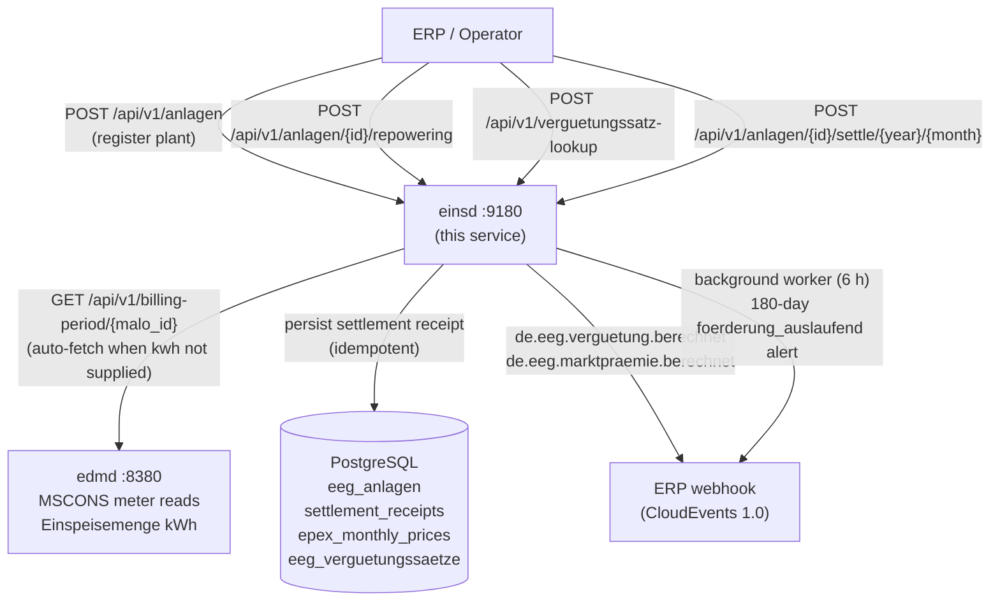

# `einsd` — Einspeiser Registry + EEG/KWKG Settlement

`einsd` is the **Einspeiser Registry and EEG/KWKG Settlement daemon**. It manages the full
lifecycle of decentralised renewable feed-in plants under the EEG and CHP plants under the KWKG,
covering **8 settlement models** and all generation technology types.



Port: **`:9180`**

---

## Why `einsd` Exists

German EEG/KWKG law requires the grid operator (NB) to:

1. **Register** every feed-in plant with its commissioning date, capacity, and applicable
   tariff — immutable for 20 years under EEG (§20 EEG 2023) or fixed term under KWKG.
2. **Calculate monthly remuneration** according to the applicable settlement model.
3. **Alert** the asset owner at least 180 days before the support period ends (Förderendedatum).
4. **Emit CloudEvents** to the ERP system for payment dispatch.
5. **Pay monthly KWK-Zuschlag** to CHP plant operators (§8 KWKG 2023).

---

## Generator Types (`erzeugungsart`)

| Value | Technology | Legal basis |
|---|---|---|
| `SOLAR` / `SOLAR_AUFDACH` | Rooftop PV | §21 EEG 2023 |
| `SOLAR_FREFLAECHE` | Ground-mounted PV ≤1 MWp; >1 MWp via Ausschreibung | §28 EEG 2023 |
| `SOLAR_AGRIPV` | Agri-PV (+0.5 ct/kWh bonus) | §51a EEG 2023 |
| `SOLAR_MIETERSTROM` | Building community solar + Zuschlag | §38a EEG 2023 |
| `SOLAR_STECKER` | Balkonkraftwerk <800 W — simplified registration | §9 EEG 2023 |
| `WIND_ONSHORE` | Onshore wind ≤750 kW; >750 kW via Ausschreibung | §§21, 28 EEG 2023 |
| `WIND_OFFSHORE` | Offshore wind — exclusively Ausschreibung | §§70ff EEG 2023 |
| `BIOMASSE` / `BIOMASSE_HOLZ` | Solid biomass | §42 EEG 2023 |
| `BIOGAS` / `BIOMETHANE` | Fermentation gas / upgraded gas | §42 EEG 2023 |
| `KLAEGAS` / `GRUBENGAS` / `DEPONIEGAS` | Sewage / mine / landfill gas | §41 EEG 2023 |
| `WASSERKRAFT` | Run-of-river hydro — tiered by size | §40 EEG 2023 |
| `GEOTHERMIE` / `GEZEITEN` | Geothermal / tidal | §§45–46 EEG 2023 |
| `KWKG` | Combined heat & power — KWK-Zuschlag on market price | §7 KWKG 2023 |

---

## Settlement Models

`einsd` supports **8 settlement models** covering all EEG and KWKG payment obligations:

| Model | Regulation | Formula | CloudEvent |
|---|---|---|---|
| `VERGUETUNG` | §21 EEG 2023 | `kwh × verguetungssatz_ct / 100` | `de.eeg.verguetung.berechnet` |
| `MIETERSTROM` | §38a EEG 2023 | `kwh × (verguetungssatz_ct + mieter_zuschlag_ct) / 100` | `de.eeg.verguetung.berechnet` |
| `DIREKTVERMARKTUNG` | §20 EEG 2023 | `max(0, AW_ct − EPEX_avg_ct) × kwh / 100` | `de.eeg.marktpraemie.berechnet` |
| `AUSSCHREIBUNG` | §§22a, 28 EEG 2023 | same as DIREKTVERMARKTUNG (AW from BNetzA tender) | `de.eeg.marktpraemie.berechnet` |
| `POST_EEG_SPOT` | post-20yr | `kwh × EPEX_avg_ct / 100` | `de.eeg.verguetung.berechnet` |
| `EIGENVERBRAUCH` | §38a EEG | EUR 0 — self-consumption; no settlement payment | _(none)_ |
| `KWKG_ZUSCHLAG` | §7 KWKG 2023 | `kwh × kwk_zuschlag_ct / 100` (on top of market price) | `de.eeg.verguetung.berechnet` |
| `FLEXIBILITAET` | §50 EEG 2023 | `kwh × (verguetungssatz_ct + flex_praemie_ct) / 100` | `de.eeg.verguetung.berechnet` |

**Rate sources:** `verguetungssatz_ct` is the built-in EEG/KWKG rate from `eeg_verguetungssaetze`
(auto-looked up from `erzeugungsart` + `leistung_kwp` + `inbetriebnahme`).
**KWKG rates** by plant size: ≤50 kW = 8.0 ct, 50–100 kW = 6.0 ct, 100–250 kW = 5.0 ct,
250 kW–2 MW = 4.4 ct, >2 MW = 3.1 ct (§7 Abs. 1 KWKG 2023, valid from 01.01.2023).

---

## Repowering (§22 EEG 2023)

When existing wind turbines or solar panels are replaced with new higher-capacity components, the 20-year Förderungsdauer **resets** from the repowering date:

```http
POST /api/v1/anlagen/DE0123456789.../repowering
Content-Type: application/json

{
  "repowering_datum": "2026-05-01",
  "leistung_kwp_neu": 6.2,
  "verguetungssatz_ct_neu": 7.83
}
```

Response:
```json
{
  "tr_id": "DE0123456789...",
  "repowering_datum": "2026-05-01",
  "foerderendedatum_neu": "2046-05-01",
  "verguetungssatz_ct_neu": 7.83
}
```

When `verguetungssatz_ct_neu` is omitted, `einsd` auto-looks up the applicable rate from `eeg_verguetungssaetze` by `erzeugungsart` + `leistung_kwp` + `repowering_datum`.

The original `inbetriebnahme` is preserved in `ursprungs_inbetriebnahme` for audit trail.

---

## KWKG — Combined Heat & Power

CHP plants registered under the **Kraft-Wärme-Kopplungsgesetz** use `settlement_model = "KWKG_ZUSCHLAG"` and `eeg_gesetz = 0`. The KWK-Zuschlag (§7 KWKG 2023) rates by size:

| Plant size | KWK-Zuschlag | Förderdauer |
|---|---|---|
| ≤50 kW | 8.00 ct/kWh | 20 years |
| 50–100 kW | 6.00 ct/kWh | 20 years |
| 100–250 kW | 5.00 ct/kWh | 20 years |
| 250 kW–2 MW | 4.40 ct/kWh | 10 years |
| >2 MW | 3.10 ct/kWh | 30,000 full-load hours |

Set `kwk_foerderdauer_years` (≤2 MW) or `kwk_foerderdauer_h` (>2 MW) when registering a KWKG plant.

---

## Zusammenlegung (§24 EEG 2023)

Multiple small plants can be merged into one administrative unit. Set `parent_tr_id` on the child plants to link them to the parent:

```json
{ "tr_id": "DE_CHILD_001", "parent_tr_id": "DE_PARENT_MAIN", ... }
```

---

## Flexibilitätsprämie (§50 EEG 2023)

Biomass plants providing demand-response capacity receive an additional Flexibilitätsprämie on top of the base Vergütungssatz. Use `settlement_model = "FLEXIBILITAET"` and set:
- `flex_leistung_kw` — registered flexible capacity in kW
- `flex_praemie_ct_kwh` — premium rate in ct/kWh

---

## Endpoints

| Method | Path | Description |
|---|---|---|
| `POST` | `/api/v1/anlagen` | Register EEG/KWKG plant |
| `GET` | `/api/v1/anlagen` | List plants (`?erzeugungsart=&settlement_model=&status=`) |
| `GET` | `/api/v1/anlagen/{tr_id}` | Fetch plant |
| `PUT` | `/api/v1/anlagen/{tr_id}` | Update plant |
| `DELETE` | `/api/v1/anlagen/{tr_id}` | Decommission plant (status → `abgemeldet`) |
| `POST` | `/api/v1/anlagen/{tr_id}/repowering` | **Repowering** (§22 EEG — reset Förderendedatum) |
| `GET` | `/api/v1/anlagen/foerderung-auslaufend` | Plants expiring within N days (`?days=180`) |
| `POST` | `/api/v1/anlagen/{tr_id}/settle/{year}/{month}` | Trigger monthly settlement |
| `GET` | `/api/v1/anlagen/{tr_id}/settlements` | Settlement history |
| `PUT/GET` | `/api/v1/epex-monthly/{year}/{month}` | Import/fetch EPEX monthly average |
| `POST` | `/api/v1/verguetungssatz-lookup` | Look up applicable EEG/KWKG tariff rate |
| `GET` | `/health` | Liveness check |
| `GET` | `/health/ready` | Readiness check |

---

## Registering a Plant

```http
POST /api/v1/anlagen
Content-Type: application/json

{
  "tr_id":             "DE0123456789012345678901234567890",
  "malo_id":           "51238696781",
  "eeg_gesetz":        2023,
  "inbetriebnahme":    "2024-06-01",
  "leistung_kwp":      9.8,
  "erzeugungsart":     "SOLAR",
  "verguetungssatz_ct": 7.83,
  "settlement_model":  "VERGUETUNG"
}
```

`foerderendedatum` is computed automatically as `inbetriebnahme + 20 years`
(here: `2044-06-01`).

### Looking up the tariff rate

If you are unsure of the applicable `verguetungssatz_ct`, use the lookup endpoint:

```http
POST /api/v1/verguetungssatz-lookup
Content-Type: application/json

{
  "erzeugungsart":  "SOLAR",
  "leistung_kwp":   9.8,
  "inbetriebnahme": "2024-06-01"
}
```

Response:
```json
{
  "erzeugungsart":     "SOLAR",
  "leistung_kwp":      9.8,
  "inbetriebnahme":    "2024-06-01",
  "verguetungssatz_ct": 7.83
}
```

---

## Monthly Settlement

```http
POST /api/v1/anlagen/DE0123456789.../settle/2024/6
Content-Type: application/json

{
  "einspeisemenge_kwh": 312.5
}
```

Response:
```json
{
  "id":                "3fa85f64-...",
  "tr_id":             "DE0123456789...",
  "billing_year":      2024,
  "billing_month":     6,
  "settlement_model":  "VERGUETUNG",
  "einspeisemenge_kwh": 312.5,
  "settlement_eur":    24.47,
  "status":            "calculated"
}
```

Settlement status values:

| Status | Meaning |
|---|---|
| `calculated` | Settlement amount computed successfully |
| `no_data` | `einspeisemenge_kwh` not supplied |
| `price_missing` | EPEX price needed but not stored — import via `PUT /api/v1/epex-monthly` |
| `error` | Unknown settlement model |

The operation is **idempotent**: re-running for the same `(tr_id, year, month)`
overwrites the previous result.

---

## Direktvermarktung (Marktprämie)

For plants with `settlement_model = "DIREKTVERMARKTUNG"`, the Marktprämie formula
(`max(0, AW − EPEX_avg)`) requires the monthly EPEX Spot average:

```http
PUT /api/v1/epex-monthly/2024/6
Content-Type: application/json

{ "avg_ct_kwh": 6.82, "source": "netztransparenz.de" }
```

`einsd` will auto-resolve this price when triggering settlement — you do not need
to pass `epex_avg_ct_kwh` in the settlement request if the price is already stored.

---

## 180-Day Förderendedatum Alerts

The background worker runs every `alert_interval_secs` (default: 6 h) and logs
plants expiring within 180 days. When `erp_webhook_url` is configured, it POSTs
a `de.eeg.anlage.foerderung_auslaufend` CloudEvent for each plant.

You can also query the alert endpoint directly:

```http
GET /api/v1/anlagen/foerderung-auslaufend?days=180
```

---

## Configuration

| Key | Required | Default | Description |
|---|---|---|---|
| `database_url` | yes | — | PostgreSQL connection string |
| `port` | no | `9180` | HTTP listen port |
| `tenant` | yes | — | Operator BDEW-Codenummer (e.g. `9910000000002`) |
| `erp_webhook_url` | no | — | ERP webhook for CloudEvent delivery |
| `erp_hmac_secret` | no | — | HMAC-SHA256 signing secret for outbound CloudEvents |
| `tarifbd_url` | no | — | `tarifbd` URL for automatic EPEX price sync |
| `alert_interval_secs` | no | `21600` | Background alert check interval (seconds) |

### Minimal `einsd.toml`

```toml
database_url = "postgresql://einsd:secret@db:5432/einsd"
port         = 9180
tenant       = "9910000000002"
```

---

## Database Schema

### `eeg_anlagen`

Central plant register. One row per Technische Ressource.

| Column | Type | Notes |
|---|---|---|
| `tr_id` | TEXT | Technische Ressource ID |
| `tenant` | TEXT | Operator BDEW-Codenummer |
| `malo_id` | TEXT | 11-digit MaLo-ID |
| `melo_id` | TEXT? | Optional MeLo-ID |
| `eeg_gesetz` | SMALLINT | EEG law year (2000, 2004, …, 2023) |
| `inbetriebnahme` | DATE | Commissioning date |
| `leistung_kwp` | NUMERIC | Installed peak power |
| `erzeugungsart` | TEXT | SOLAR, WIND_ONSHORE, WIND_OFFSHORE, BIOMASSE, … |
| `verguetungssatz_ct` | NUMERIC | Fixed tariff rate ct/kWh — immutable |
| `foerderendedatum` | DATE | `inbetriebnahme + 20 years` |
| `settlement_model` | TEXT | VERGUETUNG, DIREKTVERMARKTUNG, POST_EEG_SPOT, EIGENVERBRAUCH |
| `direktverm_aw_ct` | NUMERIC? | Anzulegender Wert ct/kWh (Direktvermarktung only) |
| `mieter_zuschlag_ct` | NUMERIC? | Mieterstrom surcharge ct/kWh (§38a EEG) |
| `status` | TEXT | `aktiv`, `abgemeldet`, `foerderung_beendet` |

### `settlement_receipts`

Immutable audit log of every monthly settlement calculation.

| Column | Notes |
|---|---|
| `id` | UUID primary key |
| `tr_id`, `tenant` | Plant reference |
| `billing_year`, `billing_month` | Billing period — unique per plant |
| `settlement_eur` | Calculated amount in EUR (Decimal) |
| `rechnung_json` | Future: full BO4E `Rechnung` JSONB |
| `ce_id` | CloudEvent ID of `de.eeg.verguetung.berechnet` |

### `eeg_verguetungssaetze`

Reference table for EEG tariff rates. Seeded for Solar PV (2000–2024).
Import additional rates via `POST /api/v1/verguetungssaetze` or xtask.

### `epex_monthly_prices`

Operator-supplied or `tarifbd`-synced EPEX Spot monthly averages.
Required for DIREKTVERMARKTUNG and POST_EEG_SPOT settlement models.

---

## EEG Vergütungssätze Reference

For **solar PV** (Aufdachanlagen), the tariff rates are set quarterly by BNetzA
under §23 EEG 2023, degressing by 1% per quarter.

| Period | ≤10 kWp | 10–40 kWp | 40–100 kWp | >100 kWp |
|---|---|---|---|---|
| 2023-02 to 2023-04 | 8.20 ct/kWh | 7.10 ct/kWh | 5.80 ct/kWh | 4.60 ct/kWh |
| 2023-05 to 2023-07 | 8.11 | 7.03 | 5.74 | 4.55 |
| 2023-08 to 2023-10 | 8.03 | 6.95 | 5.68 | 4.50 |
| 2023-11 to 2024-01 | 7.95 | 6.88 | 5.62 | 4.45 |
| 2024-02 to 2024-04 | 7.83 | 6.79 | 5.56 | 4.40 |

For current rates, see [BNetzA EEG-Einspeisevergütungen](https://www.bundesnetzagentur.de/DE/Fachthemen/ElektrizitaetundGas/ErneuerbareEnergien/Einspeiseverguetung/start.html).

---

## CloudEvents Emitted

| Type | When | Payload fields |
|---|---|---|
| `de.eeg.verguetung.berechnet` | VERGUETUNG/POST_EEG_SPOT settled | `tr_id`, `malo_id`, `billing_year`, `billing_month`, `settlement_eur`, `status` |
| `de.eeg.marktpraemie.berechnet` | DIREKTVERMARKTUNG settled | same + `epex_avg_ct_kwh`, `aw_ct` |
| `de.eeg.anlage.foerderung_auslaufend` | Förderendedatum within 180 days | `tr_id`, `malo_id`, `foerderendedatum`, `days_remaining` |

All events are delivered to `erp_webhook_url` as HTTP POST with
`Content-Type: application/cloudevents+json` and `X-Mako-Signature` HMAC header.
