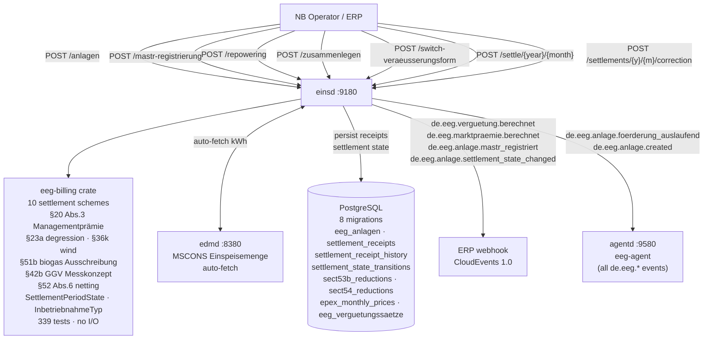
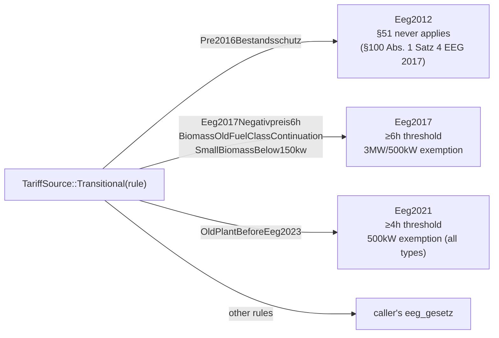
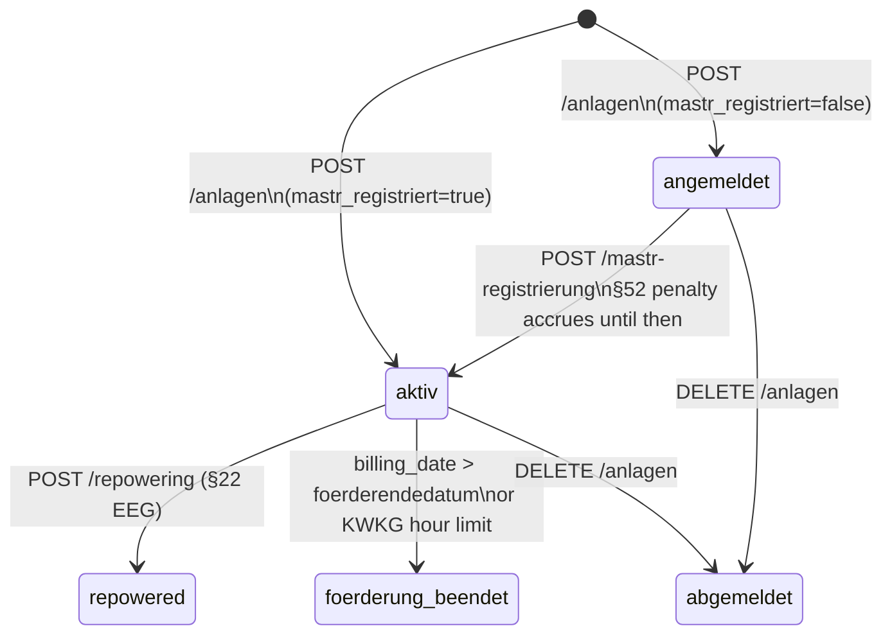
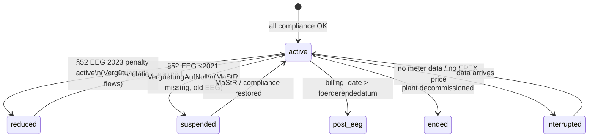
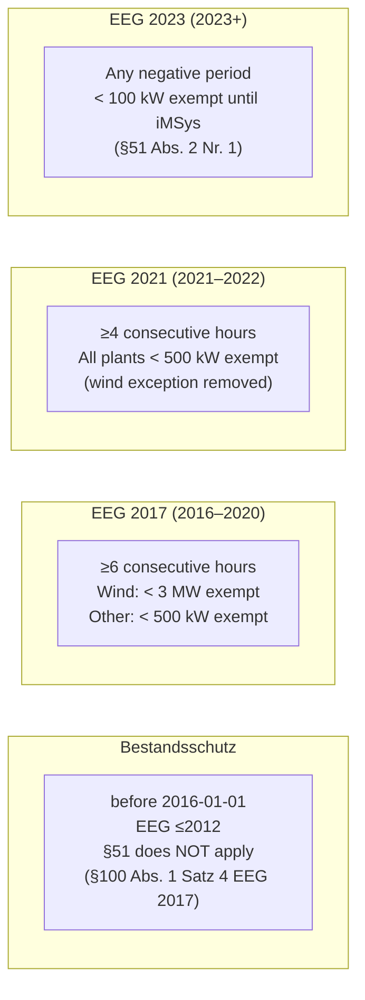
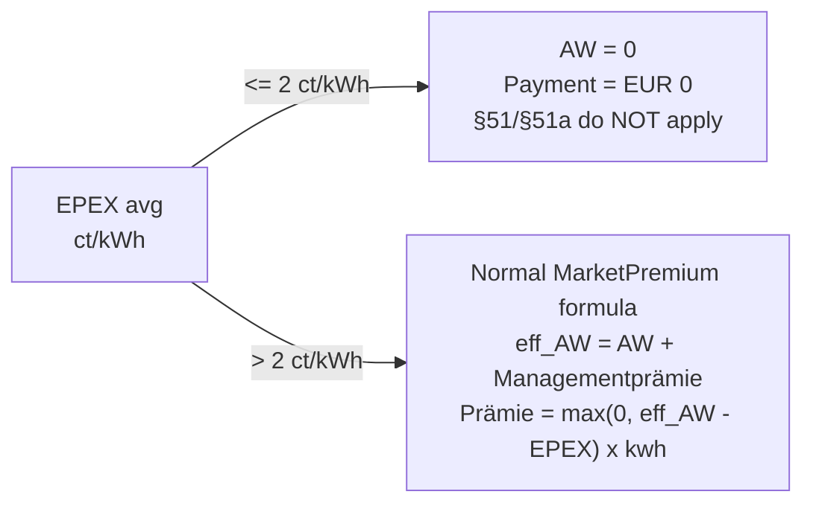
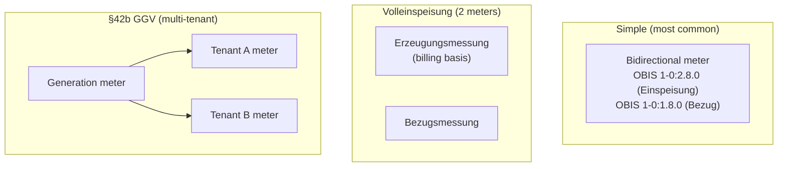
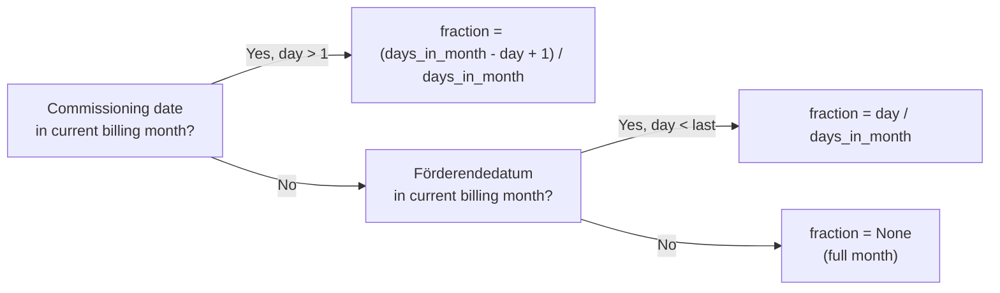

# `einsd` — Einspeiser Registry + EEG/KWKG Settlement

`einsd` is the **Einspeiser Registry and EEG/KWKG Settlement daemon**. It manages the full
lifecycle of decentralised renewable feed-in plants under the EEG (all versions 2000–2023+)
and CHP plants under the KWKG, covering **10 settlement schemes** and all generation technology
types.

Settlement arithmetic is implemented in the separate
[`eeg-billing`](https://github.com/hupe1980/mako/tree/main/crates/eeg-billing) library crate —
zero floating-point money, fully unit-tested, no I/O. The library is **EEG-version-aware**:
it enforces the correct §51/§52/§53 rules for each plant based on its `eeg_gesetz` year and
technology type, respecting Bestandsschutz for old plants commissioned before 2016.



Port: **`:9180`**

---

## Why `einsd` Exists

German EEG/KWKG law requires every **Netzbetreiber (NB)** to:

1. **Register** every feed-in plant with its commissioning date, capacity, applicable tariff,
   and governing EEG version — immutable for 20 years under EEG or fixed term under KWKG.
2. **Verify MaStR registration** before releasing Vergütung payments (§52 EEG 2023 / old
   §47 EEG 2021 via §100 Übergangsregelung).
3. **Calculate monthly remuneration** per the applicable settlement model and EEG version.
4. **Enforce version-specific §51 rules** (Negativpreisregel) — thresholds differ by EEG law
   year; old plants (Bestandsanlagen) keep their original rules via Bestandsschutz.
5. **Alert** the asset owner ≥180 days before the Förderendedatum.
6. **Emit CloudEvents** to the ERP system for payment dispatch and accounting entries.

---

## EEG Version-aware Architecture

Every plant has an `eeg_gesetz` column that determines which version's rules apply. The
`eeg-billing` library exposes an `EegGesetz` enum (8 variants) that encodes all
version-specific behaviour:

```
EegGesetz::Kwkg       — KWKG plants (no §51/§52 EEG rules)
EegGesetz::Eeg2000    — EEG 2000 plants
EegGesetz::Eeg2004    — EEG 2004 plants
EegGesetz::Eeg2009    — EEG 2009 plants
EegGesetz::Eeg2012    — EEG 2012 + 2014 amendment plants
EegGesetz::Eeg2017    — EEG 2017 plants (commissioned 2016-01-01 through 2020-12-31)
EegGesetz::Eeg2021    — EEG 2021 plants (commissioned 2021-01-01 through 2022-12-31)
EegGesetz::Eeg2023    — EEG 2023 plants (commissioned from 2023-01-01)
```

Adding a future EEG 2025/2026 variant requires only one new enum variant — the Rust compiler
enforces exhaustive handling in all `match` sites across the codebase.

### Bestandsschutz

The applicable settlement rules are determined according to the transition provisions of §100 EEG.
Many rule aspects remain as originally commissioned; others (e.g. new sanctions, technical
requirements, Solarpaket I changes) may apply regardless of the original commissioning date.
Confirm specific plant scenarios against the applicable §100 provisions before relying on this
simplification.

The table below shows the **§51 Negativpreisregel thresholds** per EEG version (one of the
most version-sensitive rules). Other rules may differ independently.

| Commissioned | §51 Negativpreisregel |
|---|---|
| before 2016-01-01 | **none** (§100 Abs. 1 Satz 4 EEG 2017) |
| 2016-01-01 – 2020-12-31 | ≥**6h**; Wind <3 MW; other <500 kW (EEG 2017) |
| 2021-01-01 – 2022-12-31 | ≥**4h**; all types <500 kW (EEG 2021) |
| 2023-01-01 + | **any** negative period; <100 kW (EEG 2023) |

Sources: §100 Abs. 1 Satz 4 EEG 2017, §100 EEG 2021 Abs. 2 Nr. 13, §100 EEG 2023 Abs. 1.

Store `eeg_gesetz` as one of the canonical years (0, 2000, 2004, 2009, 2012, 2017, 2021,
2023). The `from_db_year()` function accepts intermediate years defensively
(e.g. 2018 → EEG 2017, 2022 → EEG 2021).

### §100 Transition Rules (`TariffSource::Transitional`)

For old plants with a specific `§100` transition provision, supply
`tariff_source = Transitional(rule)` and `eeg-billing` automatically derives the correct
`EegGesetz` for §51/§52 dispatch — preventing silent miscalculations when
`eeg_gesetz` is set incorrectly in the DB.



| `Paragraph100Rule` | Effective EegGesetz | Source |
|---|---|---|
| `Pre2016Bestandsschutz` | `Eeg2012` — §51 never applies | §100 Abs. 1 Satz 4 EEG 2017 |
| `Eeg2017Negativpreis6h` | `Eeg2017` — ≥6h, 3MW/500kW | §100 Abs. 2 Nr. 13 EEG 2021 |
| `BiomassOldFuelClassContinuation` | `Eeg2017` — old §42–44 fuel rules | §100 Abs. 6 EEG 2023 |
| `SmallBiomassBelow150kw` | `Eeg2017` — small biomass FiT | §100 Abs. 11 EEG 2023 |
| `OldPlantBeforeEeg2023` | `Eeg2021` — ≤4h, 500kW (all types) | §100 Abs. 1 EEG 2023 |
| all other rules | caller's `eeg_gesetz` as-is | — |

This is enforced by `SettleInput::effective_eeg_gesetz()` in the formula dispatcher.

### §53 EEG — Vergütungsabzug

All EEG versions (2017, 2021, 2023) deduct a flat amount from the gross `anzulegender Wert`
(AW) before paying Einspeisevergütung:

| Technology | §53 deduction | Formula for DB storage |
|---|---|---|
| Solar PV, Wind | **−0.4 ct/kWh** | `verguetungssatz_ct = AW − 0.4` |
| Biomasse, Wasserkraft, Gas variants | **−0.2 ct/kWh** | `verguetungssatz_ct = AW − 0.2` |

**Always store the net rate** in `verguetungssatz_ct`. Use the
`eeg_billing::rates::sect53_deduction(ErzeugungsArt)` helper to compute it from the gross AW.
§53 does **not** apply to Direktvermarktung, PostEegSpot, or KWKG plants.

---

## Generator Types (`erzeugungsart`)

| Value | Technology | Legal basis |
|---|---|---|
| `SOLAR` / `SOLAR_AUFDACH` | Rooftop PV | §21 + §48 EEG 2023 |
| `SOLAR_FREFLAECHE` | Ground-mounted PV | §28 EEG 2023 |
| `SOLAR_AGRIPV` | Agri-PV | §51a EEG 2023 |
| `SOLAR_MIETERSTROM` | Building community solar | §38a EEG 2023 |
| `SOLAR_STECKER` | Balkonkraftwerk <800 W | §9 EEG 2023 |
| `WIND_ONSHORE` | Wind onshore | §§21, 28, 36 EEG 2023 |
| `WIND_OFFSHORE` | Wind offshore | §§70ff EEG 2023 |
| `BIOMASSE` / `BIOMASSE_HOLZ` | Solid biomass | §42 EEG 2023 |
| `BIOGAS` / `BIOMETHAN` | Fermentation / upgraded gas | §42 EEG 2023 |
| `KLAEGAS` / `GRUBENGAS` / `DEPONIEGAS` | Sewage / mine / landfill gas | §41 EEG 2023 |
| `WASSERKRAFT` | Hydro | §40 EEG 2023 |
| `GEOTHERMIE` / `GEZEITEN` | Geothermal / tidal | §§45–46 EEG 2023 |
| `KWKG` | Combined heat & power | §7 KWKG 2023 |

The `ErzeugungsArt` enum in `eeg-billing` drives version-specific §51 dispatch:
EEG 2017 wind turbines get the 3 MW exemption (§51 Abs. 3 Nr. 1 EEG 2017), while solar/
biomasse plants get the 500 kW exemption (Nr. 2). Under EEG 2021 both use 500 kW.

---

## Settlement Models

`einsd` supports **10 settlement schemes** via the `eeg-billing` crate.
The scheme is stored as `settlement_model` in `settlement_receipts` and selected when calling
`POST /settle/{year}/{month}`.

| `SettlementScheme` | Regulation | Formula | CloudEvent |
|---|---|---|---|
| `FEED_IN_TARIFF` | §21 EEG | `kwh × verguetungssatz_ct / 100` | `de.eeg.verguetung.berechnet` |
| `TENANT_ELECTRICITY` | §38a EEG 2023 | `kwh × (verguetung + mieter_zuschlag) / 100` | `de.eeg.verguetung.berechnet` |
| `MARKET_PREMIUM` | §20 EEG | see §20 Abs. 3 note below | `de.eeg.marktpraemie.berechnet` |
| `MARKET_PREMIUM` + `TariffSource::Auction` | §§22a,28 EEG | same formula, AW from BNetzA tender | `de.eeg.marktpraemie.berechnet` |
| `POST_EEG` | post-20yr §21b | `kwh × EPEX_avg_ct / 100` (configurable floor) | `de.eeg.verguetung.berechnet` |
| `EIGENVERBRAUCH` | §38a EEG | EUR 0 (no feed-in remuneration) | _(none)_ |
| `KWK_SURCHARGE` | §7 KWKG 2023 | `eligible_kwh × rate / 100` (hour-limit cap) | `de.eeg.verguetung.berechnet` |
| `FLEXIBILITY_PREMIUM` | §50b EEG 2023 | `kwh × (verguetung + flex_praemie) / 100` | `de.eeg.verguetung.berechnet` |
| `FLEXIBILITY_SURCHARGE` | §50a EEG 2023 | `kw × rate_eur_per_kw / 12` (capacity payment) | `de.eeg.verguetung.berechnet` |
| `TEMPORARY_FEED_IN_TARIFF` | §21 Abs. 1 Nr. 2 EEG 2023 | `kwh × verguetungssatz_ct / 100` (at reduced rate) | `de.eeg.verguetung.berechnet` |
| `SONSTIGE_DIREKTVERMARKTUNG` | §21a EEG | EUR 0 EEG payment (revenue on the open market) | _(none)_ |

**Ausschreibung** is not a separate scheme. It is `MARKET_PREMIUM` with
`tariff_source = Auction` — it uses the MarketPremium calculation with an **auction-determined
anzulegender Wert**. Award validity, reductions, and revocation are the caller's responsibility;
the library receives the already-resolved AW from the caller.

### §20 Abs. 3 EEG 2023 — Managementprämie

**This library's implementation** follows the reading that the Managementprämie is incorporated
into the AW before computing the spread, based on the statutory text:
§20 Abs. 3 EEG 2023: *"Bei der Berechnung der Marktprämie ist der anzulegende Wert um
0,4 ct/kWh zu erhöhen."*

```
eff_AW = direktverm_aw_ct + managementpraemie_ct
Marktprämie = max(0, eff_AW − EPEX_avg) × kwh / 100
```

When `EPEX > eff_AW`, the **total payment is zero** — no guaranteed floor.
Auto-calculated from `leistung_kwp` when `managementpraemie_ct` is null:
0.4 ct/kWh (≤100 MW) · 0.2 ct/kWh (>100 MW).

> ⚠ **Settlement positions vs. legal components.** For audit transparency, `eeg-billing`
> decomposes the total spread into two billing positions: `"Gleitende Marktprämie"` and
> `"Managementprämie"`. This is a **software decomposition** to make the calculation
> auditable — it does not mean the Managementprämie is a legally separate payment
> component. The single payment to the operator is `max(0, eff_AW − EPEX) × kwh / 100`.
>
> ⚠ **Verify before production use.** The treatment of the Managementprämie in the context
> of current BNetzA guidance and bilateral contract terms should be confirmed against the
> current statutory text before relying on this calculation for settlement disputes.

**KWKG rates** (§7 Abs. 1 KWKG 2023, from 01.01.2023):

| Plant size | KWK-Zuschlag | Förderdauer |
|---|---|---|
| ≤50 kW\_el | 8.00 ct/kWh | 20 years |
| 50–100 kW\_el | 6.00 ct/kWh | 20 years |
| 100–250 kW\_el | 5.00 ct/kWh | 20 years |
| 250 kW–2 MW\_el | 4.00 ct/kWh | 10 years |
| >2 MW\_el | 3.00 ct/kWh | 30,000 full-load hours |

**Settlement positions:** Each calculation returns a `positions` array for full auditability.
`eeg-billing` guarantees `Σ(positions[*].eur) = settlement_eur`.

**Precision:** `rust_decimal::Decimal` — never `f64`.

---

## Plant Lifecycle



### Monthly settlement state

In addition to the plant `status` column, each plant has a `settlement_state` that
reflects its current billing lifecycle:



| `settlement_state` | Meaning |
|---|---|
| `active` | Full Vergütung flows normally. |
| `reduced` | §52 EEG 2023 Pflichtzahlung active; Vergütung unchanged. |
| `suspended` | §52 EEG ≤2021 `VerguetungAufNull`; no payment. |
| `interrupted` | Temporary: no meter data or EPEX price missing. |
| `post_eeg` | Förderdauer expired; EPEX spot basis. |
| `ended` | Plant decommissioned. |

The `settlement_state_transitions` audit table logs every change with the reason
(`MastrRegistered`, `Sect52ViolationDetected`, `FoerderungExpired`, …).

| Status (plant) | Meaning |
|---|---|
| `angemeldet` | Plant commissioned, **MaStR pending**. §52 penalty accrues. |
| `aktiv` | MaStR confirmed. Vergütung flows normally. |
| `foerderung_beendet` | 20-year Förderdauer expired, or KWKG hour-limit reached. |
| `repowered` | Historical record after §22 repowering. |
| `abgemeldet` | Decommissioned. |

---

## Inbetriebnahmeprozess

1. Physical commissioning by operator.
2. NB registers in `einsd` via `POST /api/v1/anlagen` (`mastr_registriert: false` if pending).
3. Operator registers plant at [marktstammdatenregister.de](https://marktstammdatenregister.de).
4. NB confirms via `POST /api/v1/anlagen/{tr_id}/mastr-registrierung` → plant → `aktiv`.
5. Monthly settlement auto-runs. Vergütung dispatched via CloudEvent.

### Registering a plant

```http
POST /api/v1/anlagen
Content-Type: application/json

{
  "tr_id":              "DE0123456789012345678901234567890",
  "malo_id":            "51238696781",
  "eeg_gesetz":         2023,
  "inbetriebnahme":     "2024-06-01",
  "leistung_kwp":       9.8,
  "erzeugungsart":      "SOLAR_AUFDACH",
  "verguetungssatz_ct": 8.11,
  "settlement_model":   "FEED_IN_TARIFF",
  "mastr_registriert":  true,
  "mastr_nummer":       "SEE900000012345",
  "bank_iban":          "DE89370400440532013000",
  "zahlungsempfaenger": "Max Mustermann"
}
```

`verguetungssatz_ct` = **net rate** (gross AW − §53 deduction). For solar: 8.51 ct gross
AW (Solarpaket I) − 0.4 ct = **8.11 ct net**. Use `POST /api/v1/verguetungssatz-lookup`
to get the gross AW, then subtract with `eeg_billing::rates::sect53_deduction()`.

`foerderendedatum` is computed automatically:
- **Statutory plants** (no BNetzA tender): **December 31 of year+20** (§25 Abs. 1 Satz 2 EEG)
  — 2024-06-01 → `2044-12-31`
- **Ausschreibungsanlagen** (`ausschreibungs_zuschlag_id` set): exact 20-year anniversary
  — 2024-06-01 → `2044-06-01`

### Confirming MaStR registration

```http
POST /api/v1/anlagen/{tr_id}/mastr-registrierung
Content-Type: application/json

{ "mastr_nummer": "SEE900000012345", "mastr_datum": "2024-06-15" }
```

Transitions `angemeldet` → `aktiv`. Emits `de.eeg.anlage.mastr_registriert`.

---

## §51 EEG — Negativpreisregel

During negative EPEX Spot periods, the EEG Vergütung is reduced to zero. **Rules differ by
EEG version** — Bestandsschutz protects old plants commissioned before 2016-01-01.



The **caller pre-checks** whether the hour threshold is met (e.g. from hourly EPEX data).
The formula enforces only the kW exemption:

```http
POST /api/v1/anlagen/{tr_id}/settle/2026/7
Content-Type: application/json

{ "einspeisemenge_kwh": 1000, "kwh_during_negative_epex": 80 }
```

Result: `effective_kwh = 920; settlement_eur = 920 × rate / 100`

Applies to: `FEED_IN_TARIFF`, `TENANT_ELECTRICITY`, `FLEXIBILITY_PREMIUM`.
Not to: `MARKET_PREMIUM`, `POST_EEG`, `KWK_SURCHARGE`, `EIGENVERBRAUCH`.

### §51a — Verlängerungsanspruch

For each period where §51 reduced Vergütung to zero, the Förderdauer is extended:
- **Solar PV**: `ceil(lost_qh / 2)` quarter-hours (§51a Abs. 2: factor 0.5)
- **All others**: `lost_qh` quarter-hours (1:1 factor)

Pass `negative_price_quarter_hours` in the settle request. `einsd` accumulates the result
in `verlaengerungsanspruch_qh_gesamt` per plant. When non-zero, the plant's
`foerderendedatum` is extended accordingly.

### §51b — Biogas Ausschreibung at slightly-positive prices

§51b EEG 2023 applies exclusively to **biogas plants (fermentation only, not biomethane)**
whose Anzulegender Wert was set by BNetzA tender. The rule is triggered by a
**slightly-positive EPEX price**, not a negative one:

> When `epex_avg_ct_kwh ≤ 2 ct/kWh`, the AW reduces to **zero** for that period.
> No payment is made. §51/§51a do **not** apply to these plants (§51b Satz 2 EEG 2023).



Register biogas Ausschreibungsanlagen with `is_biogas_sect51b: true` (migration 0005).
The settlement formula automatically returns EUR 0 with position label `§51b EEG 2023`
for any period where the EPEX average is ≤ 2 ct/kWh.

---

## §23a EEG 2023 — Quarterly Solar PV Degression

Solar PV tariff rates decrease quarterly. The `eeg-billing` crate provides the degression
formula; actual BNetzA-published quarterly rates are stored in `eeg_verguetungssaetze`.

**Solarpaket I reference rates (Q2 2024, §48 EEG 2023 n.F.):**

| Capacity | Überschusseinspeisung | Volleinspeisung |
|---|---|---|
| ≤10 kWp | 8.51 ct/kWh | 13.31 ct/kWh |
| ≤40 kWp | 7.43 ct/kWh | 11.23 ct/kWh |
| ≤100 kWp | 7.64 ct/kWh | 12.74 ct/kWh |
| ≤400 kWp | 7.64 ct/kWh | 10.84 ct/kWh |
| ≤1 MWp | 7.64 ct/kWh | 9.54 ct/kWh |

For plants commissioned after Q2 2024, use `lookup_statutory_rate` MCP tool or
`GET /api/v1/verguetungssatz-lookup` to retrieve the correctly degresssed rate for the
commissioning quarter.

**§23a degression tiers** (based on previous year's installed GW):

| Previous year PV | Degression | Example |
|---|---|---|
| ≤9 GW | 0.00% | no change |
| 9–12 GW | 0.25%/quarter | typical 2022 |
| 13–14 GW | 1.00%/quarter | typical 2023 |
| >15 GW | 1.50%/quarter (max) | typical 2024/2025 |

---

## §§20–22 EEG 2023 — Direktvermarktung

### Mandatory threshold (§20)

Plants > 100 kW installed capacity must participate in Direktvermarktung. Plants that fail
to do so while above the threshold trigger `DirektvermarktungspflichtVerletzt` (§52 Abs. 1
Nr. 4). Use `TEMPORARY_FEED_IN_TARIFF` scheme for plants whose Direktvermarkter is temporarily
unavailable (Ausfallvergütung per §21 Abs. 1 Nr. 2 EEG 2023 — `TemporaryFeedInTariff` is this
library's abstraction for the statutory fallback remuneration).

### Ausschreibungspflicht (§22)

| Technology | Threshold |
|---|---|
| Solar PV | > 1,000 kWp |
| Wind onshore | > 750 kW |
| Biomasse | > 150 kW |
| Wasserkraft | > 500 kW |
| Geothermie | > 150 kW |
| Wind offshore | always |

Plants above these thresholds must use `tariff_source = Auction` with the BNetzA-awarded AW.
The `direktvermarktung_pflicht` and `capacity_blocks` columns (migration 0003) track this.

### Recording Direktvermarktung periods

The `direktvermarktung_perioden` JSONB column stores the history of Direktvermarktung
engagements per plant. Each entry: `{ beginn_datum, ende_datum, direktvermarkter_mp_id,
ist_freiwillig, anzulegender_wert_ct }`. Sorted by `beginn_datum` ascending.

---

## Multi-Meter Messkonzept

German EEG plants can have multiple measurement points. The `metering_mode` column and
optional `meter_config` JSONB describe the topology:



| `MesslokationTyp` | OBIS | Used for |
|---|---|---|
| `Einspeisemessung` | `1-0:2.8.0` | Primary billing (Überschuss, bidirectional) |
| `Erzeugungsmessung` | `1-0:2.8.0` at inverter | Volleinspeisung, §14a |
| `Bezugsmessung` | `1-0:1.8.0` | Eigenverbrauch calculation, §14a |
| `TeilnehmerMessung` | `1-0:1.8.0` | §42b GGV tenant allocation |

For §42b Gemeinschaftliche Gebäudeversorgung: when total tenant consumption ≤ generation,
each tenant receives their actual consumption; surplus goes to grid. When consumption >
generation, allocation is proportional (`eeg-billing::metering::compute_tenant_allocation`).

---

## §52 EEG — Compliance Violations

### Old plants (EEG ≤2021 via §100 Übergangsregelung)

Old plants use the three-tier `SanktionAlt` model (Vergütung reduction, not penalty payment):

| Tier | §52 EEG ≤2021 | Vergütung effect |
|---|---|---|
| `VerguetungAufNull` | Abs. 1 | → **EUR 0** (MaStR not registered, §10b, §27a) |
| `VerguetungAufMarktwert` | Abs. 2 | → **EPEX Monatsmarktwert** (§9 Fernsteuerbarkeit missing) |
| `VerguetungReduziert20Prozent` | Abs. 3 | → **×0.80**, rounded to 2dp (MaStR late/partial) |

### New plants (EEG 2023, commissioned from 2023-01-01)

§52 EEG 2023: **Pflichtzahlung** from operator to NB — Vergütung continues, penalty is netted
(§52 Abs. 6 EEG 2023):

| `SanktionsTyp` | Nr. | Rate | Retroactively reducible? |
|---|---|---|---|
| `FernsteuerbarkeitmFehlend` | Nr. 1 | €10/kW/month | Yes → €2 on fulfillment |
| `SpeicherAnforderungNichtErfuellt` | Nr. 2 | €10/kW/month | No |
| `IMssAnforderungNichtErfuellt` | Nr. 3 | €10/kW/month | Yes → €2 on fulfillment |
| `DirektvermarktungspflichtVerletzt` | Nr. 4 | €10/kW/month | Yes → €2 on fulfillment |
| `MastrNichtRegistriert` | Nr. 11 | €10/kW/month | Yes → €2 on fulfillment |
| `InbetriebnahmeVorgabeVerletzt` | Nr. 9a | **€2/kW always** | N/A (§52 Abs. 3 Nr. 2) |
| `VolleinspeisungspflichtVerletzt` | Nr. 10 | **€2/kW always** | N/A (§52 Abs. 3 Nr. 2) |

§52 Abs. 4 extra months: Nr. 7 (+3m), Nr. 9 (+1m), Nr. 10 (full calendar year), Nr. 12 (+6m).
§52 Abs. 5 cap: multiple violations in the same month capped at €10/kW total.

### §52 violation start tracking

`einsd` automatically tracks violation start dates:

- **On plant registration** (`POST /api/v1/anlagen`): when `mastr_registriert = false`, sets `mastr_violation_start = CURRENT_DATE` if not already set.
- **On MaStR confirmation** (`POST /api/v1/anlagen/{tr_id}/mastr-registrierung`): clears `mastr_violation_start = NULL`, stopping penalty accrual.
- **In monthly settlement**: cumulative `monate_des_verstosses` is computed from the start date → correct §52 Abs. 2 amount is charged from the first month of violation.

---

## §19 EEG 2023 — Einspeisemanagement Compensation

When the NB curtails a plant's output (Einspeisemanagement), §19 Abs. 2 EEG 2023 requires compensation at the AW rate. The §51 Negativpreisregel does NOT apply to these kWh.

```http
POST /api/v1/anlagen/{tr_id}/settle/2024/6
Content-Type: application/json

{ "einspeisemenge_kwh": 850, "einspeisemanagement_kwh": 150 }
```

`einsd` adds a separate §19 EEG position to the settlement:
- Regular kWh: 850 × rate / 100
- EInsMan compensation: 150 × AW / 100 (separate billing position)
- Total: as if 1,000 kWh were fed in

Source: §19 Abs. 2 EEG 2023; §51 Abs. 1 EEG 2023 (explicitly excluded).

---

## §21b EEG 2023 — Veräußerungsform Wechsel

Plants switch between Einspeisevergütung and Direktvermarktung monthly. Rules enforced:

- Plants > 100 kW **cannot** switch back to Einspeisevergütung (mandatory Direktvermarktung, §20 EEG 2023).
- Only **one switch per calendar month** is permitted (§21b / §21c EEG 2023).
- Effective date must be the **1st of a calendar month**.

```http
POST /api/v1/anlagen/{tr_id}/switch-veraeusserungsform
Content-Type: application/json

{
  "new_model": "MARKET_PREMIUM",
  "effective_date": "2026-08-01",
  "direktvermarkter_mp_id": "9910000000001",
  "direktverm_aw_ct": 6.28
}
```

Returns `422 Unprocessable Entity` when:
- `PflichtgemasseDirektvermarktung` — plant > 100 kW cannot revert
- `AlreadySwitchedThisMonth` — switch already performed this calendar month

`last_veraeusserungsform_switch` is updated on success. All subsequent settlements use the new model.

---

## §53b / §54 EEG 2023 — Regional and Auction Reductions

### §53b — Regionale Grünstromkennzeichnung

BNetzA-certified grid areas receive a per-ct/kWh reduction on Einspeisevergütung. Applied automatically when the plant's `grid_area` matches a certified area in `sect53b_reductions`.

Register the plant's Netzgebiet when creating it:
```json
{ ..., "grid_area": "DE-TN-001" }
```

The reduction is queried from `sect53b_reductions` during each settlement and passed as `sect53b_regional_reduction_ct` to `eeg-billing`.

### §54 — Ausschreibungsreduzierung

BNetzA may reduce the awarded AW for Ausschreibungsanlagen. `sect54_reductions` stores per-plant BNetzA deductions. Applied automatically during settlement: `effective_aw = direktverm_aw_ct − deduction_ct` (floor 0).

Manage via direct DB insert (no API endpoint; BNetzA-driven):
```sql
INSERT INTO sect54_reductions (tr_id, tenant, deduction_ct_kwh, bnetza_ref, effective_from)
VALUES ('DE_TR_...', 'your-tenant', 0.50, 'BNetzA-54-2026-WIND-001', '2026-01-01');
```

---

## §51a EEG 2023 — Verlängerungsanspruch (Förderzeitraum extension)

Pass `negative_price_quarter_hours` when settling to accrue extension entitlement:

```http
POST /api/v1/anlagen/{tr_id}/settle/2024/6
Content-Type: application/json

{
  "einspeisemenge_kwh": 1000,
  "kwh_during_negative_epex": 80,
  "negative_price_quarter_hours": 12
}
```

`einsd` accumulates `verlaengerungsanspruch_qh` in each receipt and sums it into `verlaengerungsanspruch_qh_gesamt` on the plant record. When non-zero, the plant's `foerderendedatum` must be extended accordingly.

- **Solar PV**: `ceil(lost_qh / 2)` quarter-hours per §51a Abs. 2 EEG 2023
- **All others**: `lost_qh` quarter-hours (1:1 factor)

---

## Monthly Settlement

```http
POST /api/v1/anlagen/DE0123456789.../settle/2024/6
Content-Type: application/json

{
  "einspeisemenge_kwh": 312.5,
  "kwh_during_negative_epex": 0,
  "negative_price_quarter_hours": 0,
  "einspeisemanagement_kwh": 0,
  "billing_days_fraction": null
}
```

`billing_days_fraction` is computed automatically (§25 Abs. 1 Satz 3) when `null`.
Supply explicitly to override.

Response:
```json
{
  "id": "3fa85f64-...", "billing_year": 2024, "billing_month": 6,
  "settlement_eur": 23.22, "faelligkeitsdatum": "2024-07-15", "status": "calculated",
  "positions": [
    { "description": "Einspeisevergütung §21 EEG 2023", "legal_basis": "§21 EEG 2023",
      "kwh": 312.5, "rate_ct_kwh": 7.43, "eur": 23.22 }
  ]
}
```

`faelligkeitsdatum` = **15th of the following calendar month** (§26 Abs. 1 EEG 2023:
*„monatlich jeweils zum 15. Kalendertag für den Vormonat“*).

| Status | Meaning |
|---|---|
| `calculated` | Amount computed successfully |
| `no_data` | `einspeisemenge_kwh` not supplied |
| `price_missing` | EPEX price needed; import via `PUT /api/v1/epex-monthly` |
| `foerderung_beendet` | Förderdauer ended; this period was prorated |
| `sanctioned` | §52 Abs. 1 EEG ≤2021 — Vergütung = 0 (`SanktionAlt::VerguetungAufNull`) |

Idempotent: re-running overwrites the previous result.

---

## Batch Settlement

```http
POST /api/v1/settle/2024/6
Content-Type: application/json

{ "dry_run": false }
```

```json
{ "total_plants": 42, "settled": 39, "skipped_no_data": 2,
  "skipped_price_missing": 1, "total_settlement_eur": "4813.22" }
```

The monthly auto-settle background worker triggers daily (settles previous month on or after
the 2nd — §26 EEG: payments due by 15th of following month).

---

## § 147 AO / GoBD — Correction Settlement

When meter data or tariffs are corrected, create a correction receipt:

```http
POST /api/v1/anlagen/{tr_id}/settlements/{year}/{month}/correction
Content-Type: application/json

{
  "einspeisemenge_kwh": 340.5,
  "reason": "MeterDataCorrected",
  "reason_detail": "Corrected reading after Zählernachlesung on 2024-07-20"
}
```

The correction:
1. Snapshots the original receipt to `settlement_receipt_history` (immutable, § 147 AO / GoBD)
2. Re-runs settlement with corrected inputs
3. Stores `is_correction = true` and `correction_of = <original_id>` in the new receipt

| `CorrectionReason` | Use case |
|---|---|
| `MeterDataCorrected` | Corrected Einspeisemenge after Zählernachlesung |
| `TariffCorrected` | Wrong `verguetungssatz_ct` applied |
| `MastrRegistrationConfirmed` | Retroactive §52 sanction removal after MaStR confirmed |
| `CapacityCorrected` | Wrong `leistung_kwp` applied |
| `RegulatoryReprocessing` | BNetzA ruling changed billing basis |
| `FoerderendedatumCorrected` | §25 Abs. 1 Satz 2 date recalculated |
| `Other` | Manual correction with free-text detail |

The original receipt is always preserved in `settlement_receipt_history`. The correction chain is queryable via `correction_of`.

---

## §25 EEG — Anteilige Zahlung (Partial Billing Period)

When a plant is commissioned or its Förderdauer ends **mid-month**, only the calendar days
with entitlement count. `einsd` computes
`billing_days_fraction` automatically:



| Case | Example | `billing_days_fraction` |
|---|---|---|
| Commissioned June 15, 30-day month | 16 eligible days | `16/30 = 0.5333` |
| Förderendedatum June 20, 30-day month | 20 eligible days | `20/30 = 0.6667` |
| Full month | any | `null` (full amount) |

`billing_days_fraction` is applied to `settlement_eur` and all position amounts.
`pflichtzahlung_eur` is **not** prorated (penalties are per-calendar-month).

---

## Repowering (§22 EEG 2023)

> ⚠ **Implementation model, not a complete legal statement.** Repowering law is nuanced:
> whether the Förderdauer resets, and what new tariff applies, depends on the type and extent
> of the repowering and the applicable §22 EEG provisions. This endpoint models the most common
> full-repowering case. Always confirm the specific plant scenario with the applicable §22 EEG
> provisions and BNetzA guidance.

For the **full-repowering case**: the Förderdauer resets from the repowering date.
New `foerderendedatum` = December 31 of (year + 20) per §25 Abs. 1 Satz 2 EEG.

```http
POST /api/v1/anlagen/{tr_id}/repowering
Content-Type: application/json

{ "repowering_datum": "2026-05-01", "leistung_kwp_neu": 6.2 }
```

`eeg_gesetz` and `verguetungssatz_ct` are updated to the current law/rate. Original
`inbetriebnahme` is preserved in `ursprungs_inbetriebnahme`.

---

## Zusammenlegung (§24 EEG 2023)

Co-located same-technology plants commissioned within **12 calendar months** can be merged:

```http
POST /api/v1/anlagen/{tr_id}/zusammenlegen
Content-Type: application/json

{ "parent_tr_id": "DE_PARENT_MAIN" }
```

Child → `abgemeldet`. Parent `foerderendedatum` unchanged. Update `verguetungssatz_ct` if
the combined capacity crosses a rate band boundary.

---

## EPEX Monthly Price

Required for `DIREKTVERMARKTUNG` and `POST_EEG_SPOT`:

```http
PUT /api/v1/epex-monthly/2024/6
Content-Type: application/json

{ "avg_ct_kwh": 6.82, "source": "netztransparenz.de" }
```

---

## 180-Day Alerts

```http
GET /api/v1/anlagen/foerderung-auslaufend?days=180
```

Background worker runs every 6h; emits `de.eeg.anlage.foerderung_auslaufend` per plant.

---

## EEG Vergütungssätze Reference

Gross AW for solar PV roof installations (§48 EEG 2023). Net rate = AW − 0.4 ct (§53).

| Period | ≤10 kWp AW | 10–40 kWp AW | Source |
|---|---|---|---|
| 2023-02 to 2024-04 | 8.11–8.20 ct | 6.79–7.10 ct | EEG 2023 initial |
| from 2024-05 (Solarpaket I) | **8.51 ct** | **7.43 ct** | BGBl I 2024 Nr. 107 |

See [BNetzA Einspeisevergütungen](https://www.bundesnetzagentur.de/DE/Fachthemen/ElektrizitaetundGas/ErneuerbareEnergien/Einspeiseverguetung/start.html).

---

## Endpoints

| Method | Path | Description |
|---|---|---|
| `POST` | `/api/v1/anlagen` | Register plant |
| `GET` | `/api/v1/anlagen` | List plants (`?malo_id=&erzeugungsart=&status=`) |
| `GET` | `/api/v1/anlagen/{tr_id}` | Fetch plant |
| `PUT` | `/api/v1/anlagen/{tr_id}` | Update plant |
| `DELETE` | `/api/v1/anlagen/{tr_id}` | Decommission |
| `POST` | `/api/v1/anlagen/{tr_id}/mastr-registrierung` | **Confirm MaStR** → `aktiv`; clears §52 violation clock |
| `POST` | `/api/v1/anlagen/{tr_id}/repowering` | **Repowering** §22 EEG |
| `POST` | `/api/v1/anlagen/{tr_id}/zusammenlegen` | **Zusammenlegung** §24 EEG |
| `POST` | `/api/v1/anlagen/{tr_id}/switch-veraeusserungsform` | **§21b** monthly Veräußerungsform switch |
| `GET` | `/api/v1/anlagen/foerderung-auslaufend` | Expiring within N days |
| `POST` | `/api/v1/anlagen/{tr_id}/settle/{year}/{month}` | Monthly settlement (§19 EInsMan + §51a QH supported) |
| `POST` | `/api/v1/anlagen/{tr_id}/settlements/{year}/{month}/correction` | **§ 147 AO / GoBD** correction receipt (original preserved in history) |
| `POST` | `/api/v1/settle/{year}/{month}` | Batch settle all active plants |
| `GET` | `/api/v1/anlagen/{tr_id}/settlements` | Settlement history |
| `PUT/GET` | `/api/v1/epex-monthly/{year}/{month}` | EPEX monthly average |
| `POST` | `/api/v1/verguetungssatz-lookup` | Tariff rate lookup |
| `GET/POST` | `/mcp` | MCP server (Streamable HTTP 2025-11-25) |
| `GET` | `/health` | Liveness |
| `GET` | `/health/ready` | Readiness |

---

## Configuration

| Key | Required | Default | Description |
|---|---|---|---|
| `database_url` | yes | — | PostgreSQL connection string |
| `port` | no | `9180` | HTTP listen port |
| `tenant` | yes | — | Tenant identifier — data-isolation key (any stable string; typically the operator’s BDEW- or DVGW-Codenummer) |
| `erp_webhook_url` | no | — | ERP webhook for CloudEvents |
| `erp_hmac_secret` | no | — | HMAC-SHA256 signing secret |
| `edmd_url` | no | — | `edmd` URL for auto-fetching Einspeisemenge |
| `edmd_api_key` | no | — | Bearer token for `edmd` |
| `tarifbd_url` | no | — | `tarifbd` URL for EPEX sync |
| `alert_interval_secs` | no | `21600` | Förderendedatum alert interval (6h) |
| `mcp_api_key` | no | — | Bearer token for `/mcp` (open = dev only) |

```toml
# Minimal einsd.toml
database_url = "postgresql://einsd:secret@db:5432/einsd"
port         = 9180
tenant       = "9910000000002"
edmd_url     = "http://edmd:8380"
```

---

## Database Schema

8 migrations (see `services/einsd/migrations/`).

### `eeg_anlagen`

One row per Technische Ressource. PK: `(tr_id, tenant)`.

| Column | Type | Notes |
|---|---|---|
| `tr_id` | TEXT | Technische Ressource ID |
| `tenant` | TEXT | Data-isolation key (any stable string; typically the operator's BDEW- or DVGW-Codenummer) |
| `malo_id` | TEXT | 11-digit MaLo-ID |
| `eeg_gesetz` | SMALLINT | EEG law year (0, 2000, 2004, 2009, 2012, 2017, 2021, 2023) |
| `inbetriebnahme` | DATE | Commissioning date |
| `leistung_kwp` | NUMERIC | Installed peak power kWp (or kW\_el for KWKG) |
| `erzeugungsart` | TEXT | `SOLAR_AUFDACH`, `WIND_ONSHORE`, `BIOMASSE`, … |
| `verguetungssatz_ct` | NUMERIC | **Net** rate ct/kWh (gross AW minus §53 deduction) |
| `foerderendedatum` | DATE | Dec 31 of year+20 (statutory); exact 20y for Ausschreibung |
| `settlement_model` | TEXT | `FEED_IN_TARIFF`, `MARKET_PREMIUM`, … |
| `direktverm_aw_ct` | NUMERIC? | Statutory AW in ct/kWh (before Managementprämie) |
| `mieter_zuschlag_ct` | NUMERIC? | Mieterstrom surcharge ct/kWh (§38a) |
| `mastr_registriert` | BOOL | MaStR confirmed; `false` → §52 penalty |
| `mastr_nummer` | TEXT? | MaStR Registrierungsnummer (`SEE900000012345`) |
| `bank_iban` | TEXT? | IBAN for EEG Vergütung payment (SEPA CT, NB→Betreiber) |
| `status` | TEXT | `angemeldet`, `aktiv`, `foerderung_beendet`, `repowered`, `abgemeldet` |
| `inbetriebnahme_typ` | TEXT? | `ERSTINBETRIEBNAHME`, `REPOWERING`, `ERWEITERUNG`, … |
| `solar_bauform` | TEXT? | `GEBAEUDE`, `FREIFLAECHE`, `AGRI_PV`, `STECKER_PV`, … |
| `wind_guetegrad` | NUMERIC? | §36k Gütegrad (e.g. `0.85` = 85% of reference yield) |
| `wind_korrekturfaktor` | NUMERIC? | §36k certified Korrekturfaktor |
| `fernsteuerbarkeit_datum` | DATE? | §9 EEG Fernsteuerbarkeit installation date |
| `direktvermarktung_pflicht` | BOOL | `true` for plants > 100 kW (auto-set on creation) |
| `direktvermarktung_perioden` | JSONB? | History of Direktvermarktung engagements |
| `capacity_blocks` | JSONB? | §24 Erweiterung blocks |
| `meter_config` | JSONB? | `MeterConfiguration` (mode, meter points, OBIS codes) |
| `metering_mode` | TEXT? | `SLP`, `RLM`, `IMSYS` |
| `sect52_netting_enabled` | BOOL | §52 Abs. 6 netting (default true) |
| `settlement_state` | TEXT | `active`, `reduced`, `suspended`, `interrupted`, `post_eeg`, `ended` |
| `ausschreibungs_zuschlag_id` | TEXT? | BNetzA Zuschlag-ID (e.g. `"SEE-2024-001234"`) |
| `is_biogas_sect51b` | BOOL | §51b EEG 2023: biogas Ausschreibungsanlage (AW=0 when EPEX≤2ct) |
| `grid_area` | TEXT? | Netzgebiet code for §53b regional reduction lookup (e.g. `"DE-TN-001"`) |
| `award_expired` | BOOL | §35a EEG 2023: Zuschlag expired/revoked → FoerderungBeendet |
| `zuschlag_erloeschen_datum` | DATE? | §35a: date when BNetzA Zuschlag automatically expires |
| `last_veraeusserungsform_switch` | DATE? | §21b: date of last Veräußerungsform switch (monthly guard) |
| `mastr_violation_start` | DATE? | §52: date MaStR non-registration began (auto-set on registration) |
| `fernsteuerbarkeit_violation_start` | DATE? | §52: date Fernsteuerbarkeit violation began |
| `verlaengerungsanspruch_qh_gesamt` | BIGINT | §51a: cumulative quarter-hours of Förderzeitraum extension |

Views: `eeg_anlagen_mastr_ausstehend` · `eeg_anlagen_fernsteuerbarkeit_ausstehend` · `eeg_anlagen_direktverm_pflicht`

### `settlement_receipts`

Immutable active receipt per billing period. Unique per `(tr_id, tenant, billing_year, billing_month)` — corrections overwrite the active row, with the original preserved in `settlement_receipt_history`.

| Column | Notes |
|---|---|
| `pflichtzahlung_eur` | §52 EEG 2023 penalty for this period (separate from Vergütung) |
| `faelligkeitsdatum` | §26 Abs. 1 EEG 2023 — 15th of following calendar month |
| `verlaengerungsanspruch_qh` | §51a quarter-hours accrued this period |
| `billing_days_fraction` | §25 partial month factor (mid-month commissioning/expiry) |
| `positions_json` | § 147 AO / GoBD — itemized billing positions JSONB snapshot |
| `is_correction` | `true` when this receipt supersedes a prior calculation |
| `correction_of` | UUID of the original receipt this corrects (traceability chain) |

### `settlement_receipt_history`

§ 147 AO / GoBD immutable snapshots. One row per correction — captures the full original receipt as JSONB before any correction upsert overwrites it. Query this table to reconstruct the billing history for any plant and period.

### `settlement_state_transitions`

Audit log of every settlement state change: `from_state`, `to_state`, `effective_from`, `reason`.

### `sect54_reductions`

§54 EEG 2023 Ausschreibungsreduzierung notices per plant (from BNetzA).

### `sect53b_reductions`

§53b EEG 2023 regional Grünstromkennzeichnung reductions per grid area.

### `eeg_verguetungssaetze`

Reference table for gross AW rates by technology, capacity band, and commissioning quarter.

### `epex_monthly_prices`

EPEX Spot monthly averages. Required for `MARKET_PREMIUM` and `POST_EEG`.

---

## CloudEvents Emitted

| Type | When | Key payload fields |
|---|---|---|
| `de.eeg.verguetung.berechnet` | FEED\_IN\_TARIFF / POST\_EEG settled | `tr_id`, `billing_year`, `billing_month`, `settlement_eur`, `pflichtzahlung_eur`, **`bank_iban`**, **`bank_bic`**, **`zahlungsempfaenger`** |
| `de.eeg.marktpraemie.berechnet` | MARKET\_PREMIUM settled | + `epex_avg_ct_kwh`, `aw_ct`, `effective_aw_ct` |
| `de.eeg.anlage.mastr_registriert` | MaStR confirmed | `tr_id`, `mastr_nummer` |
| `de.eeg.anlage.foerderung_auslaufend` | Förderung ending ≤180 days | `tr_id`, `foerderendedatum`, `days_remaining` |
| `de.eeg.anlage.settlement_state_changed` | State machine transition | `tr_id`, `from_state`, `to_state`, `reason` |

`bank_iban`, `bank_bic`, and `zahlungsempfaenger` are forwarded from the `eeg_anlagen` record
so `accountingd` can generate a SEPA Credit Transfer pain.001 without a secondary DB lookup.
They are absent (null) for `EIGENVERBRAUCH` settlements (no payout).

```json
{
  "specversion": "1.0",
  "type":        "de.eeg.verguetung.berechnet",
  "source":      "urn:einsd:tenant:9910000000002",
  "id":          "a1b2c3d4-...",
  "subject":     "TR-SOLAR-001",
  "data": {
    "tr_id":           "TR-SOLAR-001",
    "malo_id":         "51238696780",
    "billing_year":    2026,
    "billing_month":   7,
    "settlement_model": "FEED_IN_TARIFF",
    "einspeisemenge_kwh": "280.500",
    "settlement_eur":  "22.736",
    "status":          "calculated",
    "bank_iban":       "DE89370400440532013000",
    "bank_bic":        "COBADEFFXXX",
    "zahlungsempfaenger": "Franz Huber"
  }
}
```

All events: `application/cloudevents+json` + `X-Mako-Signature` HMAC.

---

## MCP Server

At `/mcp` (Streamable HTTP 2025-11-25). Auth: `Authorization: Bearer <mcp_api_key>`.

**18 tools:**
`list_plants` · `get_plant` · `list_expiring` · `list_settlements` ·
`lookup_verguetungssatz` · `lookup_statutory_rate` · `trigger_settle` ·
`list_unsettled_plants` · `get_epex_monthly_price` · `import_epex_monthly_price` ·
`get_compliance_status` · `list_plants_without_mastr` ·
`check_direktvermarktung_compliance` · `check_sect44b_quota` ·
`import_jahresmarktwert` · `get_jahresmarktwert_tool` ·
`get_settlement_state_history` · `explain_settlement`

| Tool | Description |
|---|---|
| `check_direktvermarktung_compliance` | Lists active plants >100 kW settled under a non-Direktvermarktung scheme (§3 Nr. 1 + §20 EEG 2023). These are §52 Abs. 2 Nr. 4 violation candidates. |
| `check_sect44b_quota` | Returns annual biogas production cap, YTD kWh, remaining quota, and alerts at 75 % (WARNING) and 90 % (CRITICAL) exhaustion (§44b EEG 2023, plants >100 kW). |

**6 prompts:**
`register-eeg-plant` · `settle-monthly` · `check-foerderung-expiry` ·
`ausschreibung-workflow` · `post-eeg-transition` · `anlagenerweiterung`

The `eeg-agent` specialist in `agentd` handles `de.eeg.*` CloudEvents **and** `de.edmd.reading.direct.stored` (for iMSys rollout detection — lifts the <100 kW §51 Negativpreisregel exemption on first iMSys push).
See [agentd operator guide](./agentd.md) for the full trigger→action mapping.

---

## Testing

**339 tests** (eeg-billing) across four suites:

```bash
cargo test -p eeg-billing -p einsd --all-features
```

| Suite | Count | Coverage |
|---|---|---|
| `eeg-billing` lib tests | 82 | Settlement formulas, §52 cap, positions-sum invariant |
| `prop_tests` (proptest) | 12 | INV-1–INV-10: FeedInTariff exactness, MarketPremium non-negativity, §51 bounds, API contract, PostEeg floor |
| `regulatory_showcase` | 166 | §51/§51a/§51b, §52, §53b, §100 rules, all schemes, Bestandsschutz, `InbetriebnahmeTyp` lifecycle, §40–41 Wasserkraft, §37a Stecker-PV |
| `eeg-billing` doctests | 64 | `EegGesetz::from_db_year`, rate helpers, foerderendedatum |

```bash
cargo test -p eeg-billing -p einsd --all-features
```
