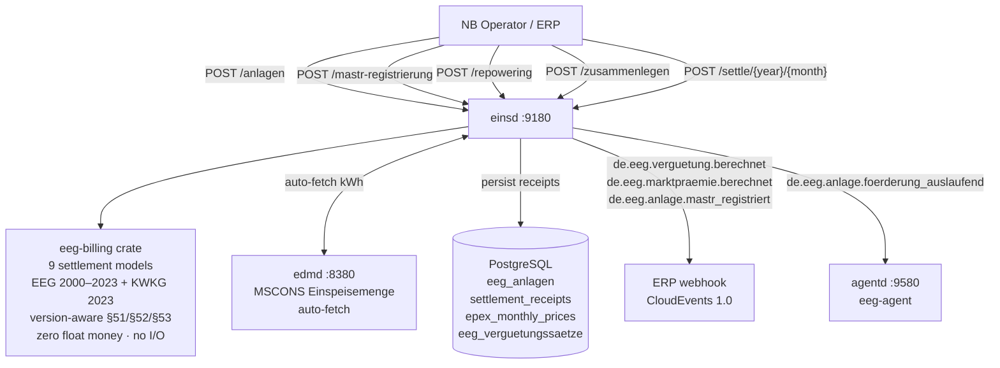
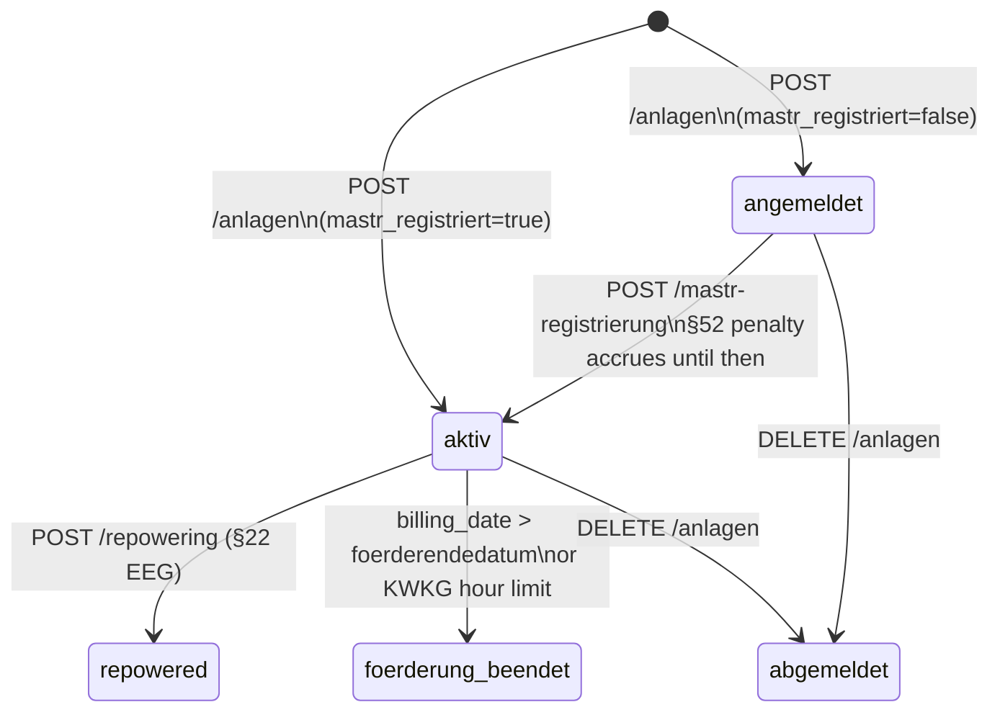
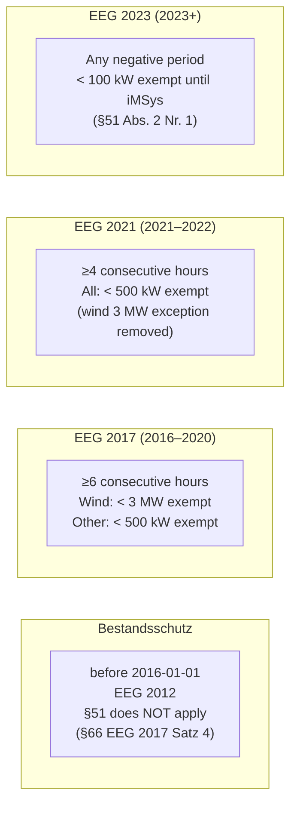

# `einsd` — Einspeiser Registry + EEG/KWKG Settlement

`einsd` is the **Einspeiser Registry and EEG/KWKG Settlement daemon**. It manages the full
lifecycle of decentralised renewable feed-in plants under the EEG (all versions 2000–2023+)
and CHP plants under the KWKG, covering **9 settlement models** and all generation technology
types.

Settlement arithmetic is implemented in the separate
[`eeg-billing`](https://github.com/hupe1980/mako/tree/main/crates/eeg-billing) library crate —
zero floating-point money, fully unit-tested, no I/O. The library is **EEG-version-aware**:
it enforces the correct §51/§52/§53 rules for each plant based on its `eeg_gesetz` year and
technology type, respecting Bestandsschutz for old plants commissioned before 2016.



Port: **`:9180`**

---

## Why `einsd` Exists

German EEG/KWKG law requires every **Netzbetreiber (NB)** to:

1. **Register** every feed-in plant with its commissioning date, capacity, applicable tariff,
   and governing EEG version — immutable for 20 years under EEG or fixed term under KWKG.
2. **Verify MaStR registration** before releasing Vergütung payments (§52 EEG 2023 / old
   §47 EEG 2021 via §100 Übergangsregelung).
3. **Calculate monthly remuneration** per the applicable settlement model and EEG version.
4. **Enforce version-specific §51 rules** (Negativpreisregel) — thresholds differ by EEG law
   year; old plants (Bestandsanlagen) keep their original rules via Bestandsschutz.
5. **Alert** the asset owner ≥180 days before the Förderendedatum.
6. **Emit CloudEvents** to the ERP system for payment dispatch and accounting entries.

---

## EEG Version-aware Architecture

Every plant has an `eeg_gesetz` column that determines which version's rules apply. The
`eeg-billing` library exposes an `EegGesetz` enum (8 variants) that encodes all
version-specific behaviour:

```
EegGesetz::Kwkg       — KWKG plants (no §51/§52 EEG rules)
EegGesetz::Eeg2000    — EEG 2000 plants
EegGesetz::Eeg2004    — EEG 2004 plants
EegGesetz::Eeg2009    — EEG 2009 plants
EegGesetz::Eeg2012    — EEG 2012 + 2014 amendment plants
EegGesetz::Eeg2017    — EEG 2017 plants (commissioned 2016-01-01 through 2020-12-31)
EegGesetz::Eeg2021    — EEG 2021 plants (commissioned 2021-01-01 through 2022-12-31)
EegGesetz::Eeg2023    — EEG 2023 plants (commissioned from 2023-01-01)
```

Adding a future EEG 2025/2026 variant requires only one new enum variant — the Rust compiler
enforces exhaustive handling in all `match` sites across the codebase.

### Bestandsschutz (Grandfather Clause)

Old plants keep the rules of the EEG in force when they were commissioned:

| Commissioned | Governing law | §51 Negativpreisregel |
|---|---|---|
| before 2016-01-01 | EEG 2012 | **none** (§66 EEG 2017 Abs. 1 Satz 4) |
| 2016-01-01 – 2020-12-31 | EEG 2017 | ≥**6h**; Wind <3 MW; other <500 kW |
| 2021-01-01 – 2022-12-31 | EEG 2021 | ≥**4h**; all types <500 kW |
| 2023-01-01 + | EEG 2023 | **any** negative period; <100 kW (until iMSys) |

Sources: §66 EEG 2017 Satz 4, §100 EEG 2021 Abs. 2 Nr. 13, §100 EEG 2023 Abs. 1.

Store `eeg_gesetz` as one of the canonical years (0, 2000, 2004, 2009, 2012, 2017, 2021,
2023). The `from_db_year()` function accepts intermediate years defensively
(e.g. 2018 → EEG 2017, 2022 → EEG 2021).

### §53 EEG — Vergütungsabzug

All EEG versions (2017, 2021, 2023) deduct a flat amount from the gross `anzulegender Wert`
(AW) before paying Einspeisevergütung:

| Technology | §53 deduction | Formula for DB storage |
|---|---|---|
| Solar PV, Wind | **−0.4 ct/kWh** | `verguetungssatz_ct = AW − 0.4` |
| Biomasse, Wasserkraft, Gas variants | **−0.2 ct/kWh** | `verguetungssatz_ct = AW − 0.2` |

**Always store the net rate** in `verguetungssatz_ct`. Use the
`eeg_billing::rates::sect53_deduction(ErzeugungsArt)` helper to compute it from the gross AW.
§53 does **not** apply to Direktvermarktung, PostEegSpot, or KWKG plants.

---

## Generator Types (`erzeugungsart`)

| Value | Technology | Legal basis |
|---|---|---|
| `SOLAR` / `SOLAR_AUFDACH` | Rooftop PV | §21 + §48 EEG 2023 |
| `SOLAR_FREFLAECHE` | Ground-mounted PV | §28 EEG 2023 |
| `SOLAR_AGRIPV` | Agri-PV | §51a EEG 2023 |
| `SOLAR_MIETERSTROM` | Building community solar | §38a EEG 2023 |
| `SOLAR_STECKER` | Balkonkraftwerk <800 W | §9 EEG 2023 |
| `WIND_ONSHORE` | Wind onshore | §§21, 28, 36 EEG 2023 |
| `WIND_OFFSHORE` | Wind offshore | §§70ff EEG 2023 |
| `BIOMASSE` / `BIOMASSE_HOLZ` | Solid biomass | §42 EEG 2023 |
| `BIOGAS` / `BIOMETHAN` | Fermentation / upgraded gas | §42 EEG 2023 |
| `KLAEGAS` / `GRUBENGAS` / `DEPONIEGAS` | Sewage / mine / landfill gas | §41 EEG 2023 |
| `WASSERKRAFT` | Hydro | §40 EEG 2023 |
| `GEOTHERMIE` / `GEZEITEN` | Geothermal / tidal | §§45–46 EEG 2023 |
| `KWKG` | Combined heat & power | §7 KWKG 2023 |

The `ErzeugungsArt` enum in `eeg-billing` drives version-specific §51 dispatch:
EEG 2017 wind turbines get the 3 MW exemption (§51 Abs. 3 Nr. 1 EEG 2017), while solar/
biomasse plants get the 500 kW exemption (Nr. 2). Under EEG 2021 both use 500 kW.

---

## Settlement Models

`einsd` supports **9 settlement models**:

| Model | Regulation | Formula | CloudEvent |
|---|---|---|---|
| `VERGUETUNG` | §21 EEG | `kwh × verguetungssatz_ct / 100` | `de.eeg.verguetung.berechnet` |
| `MIETERSTROM` | §38a EEG 2023 | `kwh × (verguetung + mieter_zuschlag) / 100` | `de.eeg.verguetung.berechnet` |
| `DIREKTVERMARKTUNG` | §20 EEG | `max(0, AW−EPEX) × kwh/100 + mgmt_praemie × kwh/100` | `de.eeg.marktpraemie.berechnet` |
| `AUSSCHREIBUNG` | §§22a,28 EEG | same as DIREKTVERMARKTUNG, AW from BNetzA tender | `de.eeg.marktpraemie.berechnet` |
| `POST_EEG_SPOT` | post-20yr | `kwh × EPEX_avg_ct / 100` (can be negative) | `de.eeg.verguetung.berechnet` |
| `EIGENVERBRAUCH` | §38a EEG | EUR 0 | _(none)_ |
| `KWKG_ZUSCHLAG` | §7 KWKG 2023 | `eligible_kwh × kwk_ct / 100` (hour-limit enforced) | `de.eeg.verguetung.berechnet` |
| `FLEXIBILITAET` | §50b EEG 2023 | `kwh × (verguetung + flex_praemie) / 100` | `de.eeg.verguetung.berechnet` |
| `FLEXIBILITAET_ZUSCHLAG` | §50a EEG 2023 | `kw × rate_eur_per_kw / 12` (capacity payment) | `de.eeg.verguetung.berechnet` |

**KWKG rates** (§7 Abs. 1 KWKG 2023, from 01.01.2023):

| Plant size | KWK-Zuschlag | Förderdauer |
|---|---|---|
| ≤50 kW\_el | 8.00 ct/kWh | 20 years |
| 50–100 kW\_el | 6.00 ct/kWh | 20 years |
| 100–250 kW\_el | 5.00 ct/kWh | 20 years |
| 250 kW–2 MW\_el | 4.00 ct/kWh | 10 years |
| >2 MW\_el | 3.00 ct/kWh | 30,000 full-load hours |

**Managementprämie (§20 Abs. 3 EEG 2023):** Auto-calculated from `leistung_kwp` when
`managementpraemie_ct` is `null`: 0.4 ct/kWh (≤100 MW); 0.2 ct/kWh (>100 MW).

**Settlement positions:** Each calculation returns a `positions` array for full auditability.
`eeg-billing` guarantees `Σ(positions[*].eur) = settlement_eur`.

**Precision:** `rust_decimal::Decimal` — never `f64`.

---

## Plant Lifecycle



| Status | Meaning |
|---|---|
| `angemeldet` | Plant commissioned, **MaStR pending**. §52 penalty accrues. |
| `aktiv` | MaStR confirmed. Vergütung flows normally. |
| `foerderung_beendet` | 20-year Förderdauer expired, or KWKG hour-limit reached. |
| `repowered` | Historical record after §22 repowering. |
| `abgemeldet` | Decommissioned. |

---

## Inbetriebnahmeprozess

1. Physical commissioning by operator.
2. NB registers in `einsd` via `POST /api/v1/anlagen` (`mastr_registriert: false` if pending).
3. Operator registers plant at [marktstammdatenregister.de](https://marktstammdatenregister.de).
4. NB confirms via `POST /api/v1/anlagen/{tr_id}/mastr-registrierung` → plant → `aktiv`.
5. Monthly settlement auto-runs. Vergütung dispatched via CloudEvent.

### Registering a plant

```http
POST /api/v1/anlagen
Content-Type: application/json

{
  "tr_id":              "DE0123456789012345678901234567890",
  "malo_id":            "51238696781",
  "eeg_gesetz":         2023,
  "inbetriebnahme":     "2024-06-01",
  "leistung_kwp":       9.8,
  "erzeugungsart":      "SOLAR_AUFDACH",
  "verguetungssatz_ct": 8.11,
  "settlement_model":   "VERGUETUNG",
  "mastr_registriert":  true,
  "mastr_nummer":       "SEE900000012345",
  "bank_iban":          "DE89370400440532013000",
  "zahlungsempfaenger": "Max Mustermann"
}
```

`verguetungssatz_ct` = **net rate** (gross AW − §53 deduction). For solar: 8.51 ct gross
AW (Solarpaket I) − 0.4 ct = **8.11 ct net**. Use `POST /api/v1/verguetungssatz-lookup`
to get the gross AW, then subtract with `eeg_billing::rates::sect53_deduction()`.

`foerderendedatum` is computed automatically:
- **Statutory plants** (no BNetzA tender): **December 31 of year+20** (§25 Abs. 1 Satz 2 EEG)
  — 2024-06-01 → `2044-12-31`
- **Ausschreibungsanlagen** (`ausschreibungs_zuschlag_id` set): exact 20-year anniversary
  — 2024-06-01 → `2044-06-01`

### Confirming MaStR registration

```http
POST /api/v1/anlagen/{tr_id}/mastr-registrierung
Content-Type: application/json

{ "mastr_nummer": "SEE900000012345", "mastr_datum": "2024-06-15" }
```

Transitions `angemeldet` → `aktiv`. Emits `de.eeg.anlage.mastr_registriert`.

---

## §51 EEG — Negativpreisregel

During negative EPEX Spot periods, the EEG Vergütung is reduced to zero. **Rules differ by
EEG version** and Bestandsschutz protects old plants.



The **caller pre-checks** whether the hour threshold is met (e.g. from hourly EPEX data).
The formula enforces only the kW exemption:

```http
POST /api/v1/anlagen/{tr_id}/settle/2024/6
Content-Type: application/json

{ "einspeisemenge_kwh": 1000, "kwh_during_negative_epex": 80 }
```

Result: `effective_kwh = 920; settlement_eur = 920 × rate / 100`

Applies to: `VERGUETUNG`, `MIETERSTROM`, `FLEXIBILITAET`.
Not to: `DIREKTVERMARKTUNG`, `AUSSCHREIBUNG`, `POST_EEG_SPOT`, `KWKG_ZUSCHLAG`, `EIGENVERBRAUCH`.

---

## §52 EEG — Compliance Violations

### Old plants (EEG ≤2021 via §100 Übergangsregelung)

Old plants use the three-tier `SanktionAlt` model (Vergütung reduction, not penalty payment):

| Tier | §52 EEG ≤2021 | Vergütung effect |
|---|---|---|
| `VerguetungAufNull` | Abs. 1 | → **EUR 0** (MaStR not registered, §10b, §27a) |
| `VerguetungAufMarktwert` | Abs. 2 | → **EPEX Monatsmarktwert** (§9 Fernsteuerbarkeit missing) |
| `VerguetungReduziert20Prozent` | Abs. 3 | → **×0.80**, rounded to 2dp (MaStR late/partial) |

### New plants (EEG 2023, commissioned from 2023-01-01)

§52 EEG 2023: **Pflichtzahlung** from operator to NB — Vergütung continues, penalty is netted
(§52 Abs. 6 EEG 2023):

| `SanktionsTyp` | Nr. | Rate | Retroactively reducible? |
|---|---|---|---|
| `FernsteuerbarkeitmFehlend` | Nr. 1 | €10/kW/month | Yes → €2 on fulfillment |
| `SpeicherAnforderungNichtErfuellt` | Nr. 2 | €10/kW/month | No |
| `IMssAnforderungNichtErfuellt` | Nr. 3 | €10/kW/month | Yes → €2 on fulfillment |
| `DirektvermarktungspflichtVerletzt` | Nr. 4 | €10/kW/month | Yes → €2 on fulfillment |
| `MastrNichtRegistriert` | Nr. 11 | €10/kW/month | Yes → €2 on fulfillment |
| `InbetriebnahmeVorgabeVerletzt` | Nr. 9a | **€2/kW always** | N/A (§52 Abs. 3 Nr. 2) |
| `VolleinspeisungspflichtVerletzt` | Nr. 10 | **€2/kW always** | N/A (§52 Abs. 3 Nr. 2) |

§52 Abs. 4 extra months: Nr. 7 (+3m), Nr. 9 (+1m), Nr. 10 (full calendar year), Nr. 12 (+6m).
§52 Abs. 5 cap: multiple violations in the same month capped at €10/kW total.

---

## Monthly Settlement

```http
POST /api/v1/anlagen/DE0123456789.../settle/2024/6
Content-Type: application/json

{ "einspeisemenge_kwh": 312.5 }
```

Response:
```json
{
  "id": "3fa85f64-...", "billing_year": 2024, "billing_month": 6,
  "settlement_eur": 23.22, "status": "calculated",
  "positions": [
    { "description": "Einspeisevergütung §21 EEG 2023", "legal_basis": "§21 EEG 2023",
      "kwh": 312.5, "rate_ct_kwh": 7.43, "eur": 23.22 }
  ]
}
```

| Status | Meaning |
|---|---|
| `calculated` | Amount computed successfully |
| `no_data` | `einspeisemenge_kwh` not supplied |
| `price_missing` | EPEX price needed; import via `PUT /api/v1/epex-monthly` |
| `foerderung_beendet` | Förderdauer ended; this period was prorated |
| `sanctioned` | §52 Abs. 1 EEG ≤2021 — Vergütung = 0 (`SanktionAlt::VerguetungAufNull`) |

Idempotent: re-running overwrites the previous result.

---

## Batch Settlement

```http
POST /api/v1/settle/2024/6
Content-Type: application/json

{ "dry_run": false }
```

```json
{ "total_plants": 42, "settled": 39, "skipped_no_data": 2,
  "skipped_price_missing": 1, "total_settlement_eur": "4813.22" }
```

The monthly auto-settle background worker triggers daily (settles previous month on or after
the 2nd — §26 EEG: payments due by 15th of following month).

---

## Repowering (§22 EEG 2023)

When turbines or panels are replaced with higher-capacity components, the **20-year clock
resets** from the repowering date. New `foerderendedatum` = December 31 of (year + 20).

```http
POST /api/v1/anlagen/{tr_id}/repowering
Content-Type: application/json

{ "repowering_datum": "2026-05-01", "leistung_kwp_neu": 6.2 }
```

`eeg_gesetz` and `verguetungssatz_ct` are updated to the current law/rate. Original
`inbetriebnahme` is preserved in `ursprungs_inbetriebnahme`.

---

## Zusammenlegung (§24 EEG 2023)

Co-located same-technology plants commissioned within **12 calendar months** can be merged:

```http
POST /api/v1/anlagen/{tr_id}/zusammenlegen
Content-Type: application/json

{ "parent_tr_id": "DE_PARENT_MAIN" }
```

Child → `abgemeldet`. Parent `foerderendedatum` unchanged. Update `verguetungssatz_ct` if
the combined capacity crosses a rate band boundary.

---

## EPEX Monthly Price

Required for `DIREKTVERMARKTUNG` and `POST_EEG_SPOT`:

```http
PUT /api/v1/epex-monthly/2024/6
Content-Type: application/json

{ "avg_ct_kwh": 6.82, "source": "netztransparenz.de" }
```

---

## 180-Day Alerts

```http
GET /api/v1/anlagen/foerderung-auslaufend?days=180
```

Background worker runs every 6h; emits `de.eeg.anlage.foerderung_auslaufend` per plant.

---

## EEG Vergütungssätze Reference

Gross AW for solar PV roof installations (§48 EEG 2023). Net rate = AW − 0.4 ct (§53).

| Period | ≤10 kWp AW | 10–40 kWp AW | Source |
|---|---|---|---|
| 2023-02 to 2024-04 | 8.11–8.20 ct | 6.79–7.10 ct | EEG 2023 initial |
| from 2024-05 (Solarpaket I) | **8.51 ct** | **7.43 ct** | BGBl I 2024 Nr. 107 |

See [BNetzA Einspeisevergütungen](https://www.bundesnetzagentur.de/DE/Fachthemen/ElektrizitaetundGas/ErneuerbareEnergien/Einspeiseverguetung/start.html).

---

## Endpoints

| Method | Path | Description |
|---|---|---|
| `POST` | `/api/v1/anlagen` | Register plant |
| `GET` | `/api/v1/anlagen` | List plants (`?malo_id=&erzeugungsart=&status=`) |
| `GET` | `/api/v1/anlagen/{tr_id}` | Fetch plant |
| `PUT` | `/api/v1/anlagen/{tr_id}` | Update plant |
| `DELETE` | `/api/v1/anlagen/{tr_id}` | Decommission |
| `POST` | `/api/v1/anlagen/{tr_id}/mastr-registrierung` | **Confirm MaStR** → `aktiv` |
| `POST` | `/api/v1/anlagen/{tr_id}/repowering` | **Repowering** §22 EEG |
| `POST` | `/api/v1/anlagen/{tr_id}/zusammenlegen` | **Zusammenlegung** §24 EEG |
| `GET` | `/api/v1/anlagen/foerderung-auslaufend` | Expiring within N days |
| `POST` | `/api/v1/anlagen/{tr_id}/settle/{year}/{month}` | Monthly settlement |
| `POST` | `/api/v1/settle/{year}/{month}` | Batch settle all active plants |
| `GET` | `/api/v1/anlagen/{tr_id}/settlements` | Settlement history |
| `PUT/GET` | `/api/v1/epex-monthly/{year}/{month}` | EPEX monthly average |
| `POST` | `/api/v1/verguetungssatz-lookup` | Tariff rate lookup |
| `GET/POST` | `/mcp` | MCP server (Streamable HTTP 2025-11-25) |
| `GET` | `/health` | Liveness |
| `GET` | `/health/ready` | Readiness |

---

## Configuration

| Key | Required | Default | Description |
|---|---|---|---|
| `database_url` | yes | — | PostgreSQL connection string |
| `port` | no | `9180` | HTTP listen port |
| `tenant` | yes | — | Operator BDEW-Codenummer |
| `erp_webhook_url` | no | — | ERP webhook for CloudEvents |
| `erp_hmac_secret` | no | — | HMAC-SHA256 signing secret |
| `edmd_url` | no | — | `edmd` URL for auto-fetching Einspeisemenge |
| `edmd_api_key` | no | — | Bearer token for `edmd` |
| `tarifbd_url` | no | — | `tarifbd` URL for EPEX sync |
| `alert_interval_secs` | no | `21600` | Förderendedatum alert interval (6h) |
| `mcp_api_key` | no | — | Bearer token for `/mcp` (open = dev only) |

```toml
# Minimal einsd.toml
database_url = "postgresql://einsd:secret@db:5432/einsd"
port         = 9180
tenant       = "9910000000002"
edmd_url     = "http://edmd:8380"
```

---

## Database Schema

### `eeg_anlagen`

One row per Technische Ressource. PK: `(tr_id, tenant)`.

| Column | Type | Notes |
|---|---|---|
| `tr_id` | TEXT | Technische Ressource ID |
| `tenant` | TEXT | Operator BDEW-Codenummer |
| `malo_id` | TEXT | 11-digit MaLo-ID |
| `eeg_gesetz` | SMALLINT | EEG law year (0, 2000, 2004, 2009, 2012, 2017, 2021, 2023) |
| `inbetriebnahme` | DATE | Commissioning date |
| `leistung_kwp` | NUMERIC | Installed peak power kWp (or kW\_el for KWKG) |
| `erzeugungsart` | TEXT | `SOLAR_AUFDACH`, `WIND_ONSHORE`, `BIOMASSE`, … |
| `verguetungssatz_ct` | NUMERIC | **Net** rate ct/kWh (gross AW minus §53 deduction) |
| `foerderendedatum` | DATE | Dec 31 of year+20 (statutory); exact 20y for Ausschreibung |
| `settlement_model` | TEXT | `VERGUETUNG`, `DIREKTVERMARKTUNG`, … |
| `direktverm_aw_ct` | NUMERIC? | Anzulegender Wert (Direktvermarktung/Ausschreibung) |
| `mieter_zuschlag_ct` | NUMERIC? | Mieterstrom surcharge ct/kWh |
| `ausschreibungs_zuschlag_id` | TEXT? | BNetzA Zuschlag reference |
| `ist_repowering` | BOOL | `true` after §22 repowering |
| `repowering_datum` | DATE? | Date of repowering |
| `ursprungs_inbetriebnahme` | DATE? | Original commissioning (audit trail) |
| `parent_tr_id` | TEXT? | §24 Zusammenlegung parent |
| `kwk_foerderdauer_h` | INT? | KWKG full-load hour limit (>2 MW) |
| `kwk_foerderdauer_years` | SMALLINT? | KWKG year limit (≤2 MW) |
| `kwk_strom_kwh_gesamt` | NUMERIC? | KWKG accumulated kWh (hour-limit tracking) |
| `flex_leistung_kw` | NUMERIC? | Flex capacity kW (§50 EEG) |
| `flex_praemie_ct_kwh` | NUMERIC? | Flex premium ct/kWh (§50 EEG) |
| `mastr_registriert` | BOOL | MaStR confirmed; `false` → §52 penalty |
| `mastr_nummer` | TEXT? | MaStR Registrierungsnummer (e.g. `SEE900000012345`) |
| `mastr_datum` | DATE? | MaStR registration confirmation date |
| `bank_iban` | TEXT? | IBAN for EEG Vergütung payment (SEPA CT, NB→Betreiber) |
| `bank_bic` | TEXT? | BIC (optional) |
| `zahlungsempfaenger` | TEXT? | Payee name for SEPA CT |
| `status` | TEXT | `angemeldet`, `aktiv`, `foerderung_beendet`, `repowered`, `abgemeldet` |
| `notes` | TEXT? | Free-text notes |

### `settlement_receipts`

Immutable audit log. Unique per `(tr_id, tenant, billing_year, billing_month)`.

### `eeg_verguetungssaetze`

Reference table for **gross AW rates** (before §53 deduction) by technology, capacity band,
and date range. Seeded for Solar PV 2000–2024, Wind, Biomasse, Gas, KWKG.

### `epex_monthly_prices`

EPEX Spot monthly averages. Required for `DIREKTVERMARKTUNG` and `POST_EEG_SPOT`.

---

## CloudEvents Emitted

| Type | When | Key payload fields |
|---|---|---|
| `de.eeg.verguetung.berechnet` | VERGUETUNG/POST\_EEG\_SPOT settled | `tr_id`, `malo_id`, `billing_year`, `billing_month`, `settlement_eur` |
| `de.eeg.marktpraemie.berechnet` | DIREKTVERMARKTUNG settled | + `epex_avg_ct_kwh`, `aw_ct` |
| `de.eeg.anlage.mastr_registriert` | MaStR confirmed | `tr_id`, `mastr_nummer`, `mastr_datum` |
| `de.eeg.anlage.foerderung_auslaufend` | Förderung ending ≤180 days | `tr_id`, `foerderendedatum`, `days_remaining` |

All events: `application/cloudevents+json` + `X-Mako-Signature` HMAC.

---

## MCP Server

At `/mcp` (Streamable HTTP 2025-11-25). Auth: `Authorization: Bearer <mcp_api_key>`.

**9 tools:** `list_plants` · `get_plant` · `list_expiring` · `list_settlements` ·
`lookup_verguetungssatz` · `trigger_settle` · `list_unsettled_plants` ·
`get_epex_monthly_price` · `import_epex_monthly_price`

**5 prompts:** `register-eeg-plant` · `settle-monthly` · `check-foerderung-expiry` ·
`ausschreibung-workflow` · `post-eeg-transition`

The `eeg-agent` specialist in `agentd` handles:
- `de.eeg.anlage.foerderung_auslaufend` → Post-EEG transition plan (POST_EEG_SPOT / Repowering / Zusammenlegung)
- `de.eeg.verguetung.berechnet` → Anomaly detection (30% rolling average deviation)
- `de.eeg.marktpraemie.berechnet` → Managementprämie and §51/§52 compliance check

---

## Testing

**190+ tests** across three suites:

```bash
cargo test -p eeg-billing -p einsd --all-features
```

| Suite | Count | Coverage |
|---|---|---|
| `regulatory_showcase` | 55 | Settlement models, EEG legal rules, §51/§52/§53 |
| `settlement_tests` | 102 | Bestandsschutz boundaries, version-specific rules, Repowering, KWKG |
| `eeg-billing` doctests | 33 | `EegGesetz::from_db_year` ranges, rate helpers |
