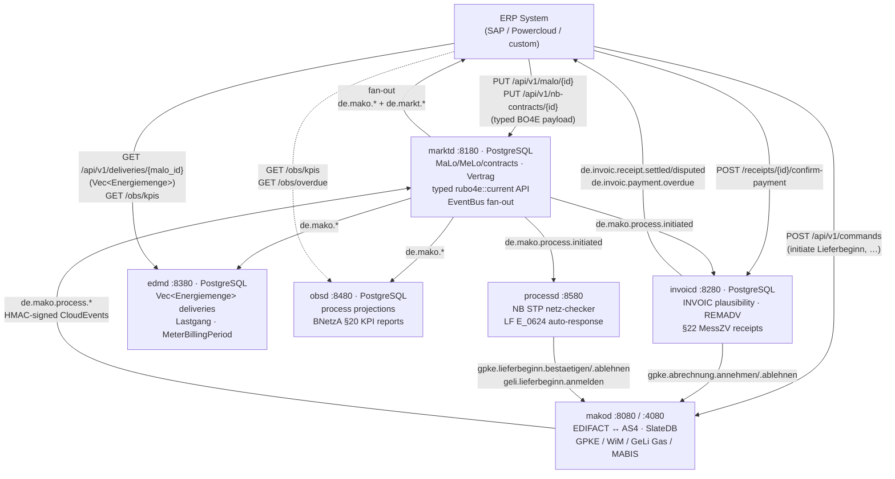

# ERP Integration

`makod` is a protocol processor, not a business system. It handles EDIFACT
parsing, BDEW process rules, AS4 delivery, and regulatory deadlines. All
contract data, billing logic, and master data live in your ERP.

The integration contract between the two is **BO4E** — not raw EDIFACT. Your
ERP never sees EDIFACT format versions or segment codes. When BDEW releases a
new format version (`FV2026-10-01`), the BO4E payload your ERP receives is
unchanged.

```
ERP  ←─────────── BO4E JSON ───────────→  makod
                (ErpAdapter / POST /api/v1/commands)
                        ↕
              EDIFACT / AS4 / BDEW network
```

> **Master data management via `marktd`** — if you deploy the companion
> [`marktd`](./marktd.md) service, configure `makod` to push process lifecycle
> events to `marktd`'s ingest endpoint (`POST /api/v1/events`). `marktd` then
> fans out to your registered ERP subscribers, eliminating the need to
> configure a webhook endpoint directly in `makod`.

Outbound webhook events are delivered as **[CloudEvents 1.0](https://cloudevents.io)**
structured-mode JSON. CloudEvents is a CNCF-graduated vendor-neutral standard
for event metadata. It is natively supported by SAP BTP, AWS EventBridge, Azure
Event Grid, Google Eventarc, and Knative — making makod events directly
routeable by any cloud event bus without custom glue code.

---

## Quick-start: wire the ERP webhook in 5 minutes

This is the minimum configuration to get outbound ERP notifications working.
`makod` will POST a JSON event to your ERP endpoint every time a MaKo process
reaches a significant state (APERAK received, process completed, etc.).

**Step 1 — Generate a shared secret**

```bash
openssl rand -hex 32
# → e.g. a3f8c1d2...  (64 hex chars)
```

**Step 2 — Start makod with the webhook configured**

```bash
makod \
  --data-dir /var/lib/makod \
  --tenant-id 9900357000004 \
  --erp-webhook-url https://erp.example.com/mako/events \
  --erp-webhook-secret a3f8c1d2...
```

Or via `makod.toml`:

```toml
[erp]
webhook_url    = "https://erp.example.com/mako/events"
webhook_secret = "a3f8c1d2..."
```

**Step 3 — Implement the ERP endpoint**

Your ERP must accept `POST` requests at the configured URL:

```
POST /mako/events
Content-Type: application/cloudevents+json
X-Idempotency-Key: 01932a4f-7b3e-4c5d-8f6a-9e0b1c2d3e4f
X-Mako-Signature: <hmac-sha256-hex>
```

Body (CloudEvents 1.0 structured-mode JSON):

```json
{
  "specversion": "1.0",
  "id": "01932a4f-7b3e-4c5d-8f6a-9e0b1c2d3e4f",
  "source": "urn:mako:tenant:9900357000004",
  "type": "de.mako.aperak.accepted",
  "time": "2026-10-01T10:15:00+02:00",
  "subject": "018f3a2b-...",
  "dataschema": "https://raw.githubusercontent.com/BO4E/BO4E-Schemas/v202607.0.0/src/bo4e_schemas/bo/Marktlokation.json",
  "datacontenttype": "application/json",
  "makoconvid": "...",
  "makocausationid": "...",
  "makopid": 55001,
  "data": {
    "_typ": "MARKTLOKATION",
    "_version": "202501",
    "marktlokationsId": "51238696782",
    "sparte": "STROM",
    "bilanzierungsmethode": "SLP",
    "energierichtung": "VERBRAUCH",
    "netzbetreibercodenr": "9900357000004"
  }
}
```

**Step 4 — Verify the signature**

Compute HMAC-SHA256 over the raw request body using your shared secret and
compare with the `X-Mako-Signature` header (64-char lowercase hex):

```python
import hmac, hashlib

def verify_mako_signature(body: bytes, secret: str, header: str) -> bool:
    expected = hmac.new(secret.encode(), body, hashlib.sha256).hexdigest()
    return hmac.compare_digest(expected, header)
```

```typescript
import { createHmac, timingSafeEqual } from "crypto";

function verifyMakoSignature(body: Buffer, secret: string, header: string): boolean {
  const expected = createHmac("sha256", secret).update(body).digest("hex");
  return timingSafeEqual(Buffer.from(expected), Buffer.from(header));
}
```

> CloudEvents deliberately excludes signing from its specification — signing
> semantics vary by use case. `X-Mako-Signature` (HMAC-SHA256) is the mako
> security layer that sits on top of CloudEvents.

**Step 5 — Return `HTTP 200` for duplicates**

`makod` retries on any non-2xx response. Your endpoint **must** persist
`idempotency_key` and return `200 OK` for duplicate deliveries without
re-processing. Any `4xx` except `429` is treated as a permanent error and the
message is dead-lettered.

---

## Integration surfaces

| Direction | Mechanism | Description |
|-----------|-----------|-------------|
| makod → ERP | `--erp-webhook-url` / `WebhookErpAdapter` | POST BO4E JSON on every process event |
| ERP → makod | `POST /api/v1/commands` | Initiate a MaKo process (Lieferbeginn, Gerätewechsel, …) |
| ERP → makod | `PUT /admin/malo/{malo_id}` | Push MaLo master data to the local cache |
| ERP → makod | `PUT /admin/partners/{mp_id}` | Register or update a trading-partner endpoint |
| ERP → makod | `ErpCommandSource` trait | Fully event-driven inbound (Kafka, SFTP, CDC, …) |
| marktd → invoicd | `POST /webhook` CloudEvents | GPKE/WiM billing notifications for automatic plausibility check |
| invoicd → makod | `POST /api/v1/commands` | `gpke.abrechnung.annehmen` or `gpke.abrechnung.ablehnen` |
| invoicd → ERP | `de.invoic.receipt.settled/disputed` CloudEvents | Durable at-least-once payment notifications |
| invoicd → ERP | `de.invoic.payment.overdue` CloudEvents | Background worker every 6 h — unpaid invoices past `pay_by` |
| ERP → invoicd | `POST /api/v1/receipts/{id}/confirm-payment` | Close §22 MessZV payment audit trail when bank transfer confirmed |
| ERP → invoicd | `GET /api/v1/zahlungsstatus/{malo_id}` | AR reconciliation — settled / pending / overdue counts |
| edmd API → ERP | `GET /api/v1/deliveries/{malo_id}` | BO4E `Vec<Energiemenge>` — typed meter readings for billing import |
| edmd API → ERP | `GET /api/v1/lastgang/{malo_id}` | BO4E `Lastgang` — interval time series grouped by OBIS register |
| edmd API → ERP | `GET /api/v1/billing-period/{malo_id}` | `MeterBillingPeriod` — arbeitsmenge, spitzenleistung, brennwert |
| ERP → marktd | `PUT /api/v1/nb-contracts/{id}` | Upsert NB contract with full BO4E `Vertrag` payload |
| obsd API → ERP | `GET /obs/kpis` | BNetzA KPI report — §20 EnWG parity, STP rates, decision times |

### Full service topology



Every `de.mako.*` event from `makod` flows through `marktd`'s EventBus fan-out.
The satellite daemons subscribe independently; fan-out failures are durably
queued in `fanout_dlq` so no regulatory notification is silently dropped.

### Delivery pipeline

```
Workflow::handle()
    └── WorkflowOutput { events, outbox_messages }
                │
                ▼ (single atomic WriteBatch — SSI-isolated)
        EventStore  +  OutboxStore
                │
                ▼ (OutboxErpWorker polls every 5 s)
        CloudEvents 1.0 envelope → WebhookErpAdapter::POST application/cloudevents+json
                │
                ▼ (OutboxWorker polls every 5 s, separate)
        EDIFACT messages  → AS4 sender → BDEW counterparty
```

Events and outbox entries are written atomically. If `makod` crashes between
the two writes, the event is replayed on restart and the outbox entry is
re-enqueued — no lost APERAK.

### Event types

See the event type table in the [CloudEvents envelope schema](#cloudevents-envelope-schema)
section above.

### PID → event mapping

| PID family | Process | CloudEvents `type` sequence |
|---|---|---|
| GPKE 55001 | Lieferbeginn LF-AN | `de.mako.process.initiated` → `de.mako.aperak.accepted` → `de.mako.process.completed` |
| GPKE 55002 | Lieferbeginn NB-AN | same |
| GPKE 55017 | Lieferbeginn Kündigung | same |
| GPKE 31001–31005 | Abrechnung INVOIC | `de.mako.process.initiated` → `de.mako.process.completed` + `de.invoic.receipt.settled`/`disputed` |
| WiM 31009 | MSB-Rechnung (LF payer) | `de.mako.process.initiated` → REMADV → `de.invoic.receipt.settled`/`disputed` |
| WiM 55039, 55042, 55051, 55168 | Gerätewechsel / MSB-Wechsel | `de.mako.process.initiated` → `de.mako.aperak.accepted` → `de.mako.process.completed` |
| GeLi Gas 44001–44006 | Lieferbeginn Gas (LFN-initiated) | `de.mako.process.initiated` → `de.mako.aperak.accepted` → `de.mako.process.completed` |
| GeLi Gas 44017–44018 | Lieferende / Kündigung Gas | same |
| GeLi Gas 17103 | Gas Datenabruf (Brennwert/Zustandszahl) | `de.mako.process.initiated` → `de.mako.process.completed` |
| GeLi Gas 17115, 17117 | Sperr-/Entsperrauftrag Gas (LF-initiated) | `de.mako.process.initiated` → `de.mako.process.completed` or `de.mako.process.failed` |
| MABIS 13003 | Bilanzkreisabrechnung Strom | `de.mako.process.initiated` → `de.mako.process.completed` or `de.mako.process.failed` |

### `invoicd` payment CloudEvents

After each validated INVOIC, `invoicd` emits **payment CloudEvents** directly to
your ERP webhook when `[erp] webhook_url` is configured in `invoicd.toml`.
These events enable **accounts-payable automation** without polling the REST API.

| Type | Trigger | Use case |
|---|---|---|
| `de.invoic.receipt.settled` | REMADV 33001 dispatched | Book received invoice |
| `de.invoic.receipt.disputed` | REMADV 33002 dispatched | Flag for manual review |
| `de.invoic.receipt.dispatched` | Outbound 31006 sent | Track self-issued invoice |

Payment events use `source: "urn:invoicd:tenant:{tenant}"` and `subject: "{process_id}"`.

**Delivery guarantee — durable at-least-once:**
The initial attempt runs inline after REMADV dispatch.  On any failure (transport
error, HTTP 5xx), the background outbox worker retries with exponential backoff
(30 s → 5 min → 30 min → 2 h → dead-letter after 5 attempts / ~11 h window).
HTTP 4xx responses are dead-lettered immediately (permanent misconfiguration).
Track delivery via `invoic_receipts.erp_notified_at`; dead-lettered rows have
`erp_attempts >= 5 AND erp_notified_at IS NULL`.

**Request signing:** when `[erp] hmac_secret` is configured, every POST includes
`X-Mako-Signature: sha256=<hex>` computed over the exact request body bytes.

### Request format

```
POST <erp_webhook_url>
Content-Type: application/cloudevents+json
X-Idempotency-Key: <event.id>
X-Mako-Signature: <hmac-sha256-hex>   ← only when --erp-webhook-secret is set
```

Body is a **CloudEvents 1.0 structured-mode JSON** object (see below).

### CloudEvents envelope schema

All outbound webhook events are **[CloudEvents 1.0](https://cloudevents.io)
structured-mode JSON** with `Content-Type: application/cloudevents+json`.

**Required CloudEvents attributes:**

| Attribute | Value | Notes |
|---|---|---|
| `specversion` | `"1.0"` | Always |
| `id` | `<idempotency_key>` | Stable dedup key — persist in ERP |
| `source` | `"urn:mako:tenant:<tenant_id>"` | Operator GLN |
| `type` | `"de.mako.<domain>.<action>"` | See event type table below |
| `time` | RFC 3339 with timezone offset | Wall-clock time of domain event |
| `subject` | `<process_id>` UUID | The mako process that fired the event |

**Optional CloudEvents attributes:**

| Attribute | Value | Notes |
|---|---|---|
| `dataschema` | BO4E JSON Schema URL | Present when `data` carries a BO4E object |
| `datacontenttype` | `"application/json"` | Always present when `data` is non-null |

**mako extension attributes** (lowercase alphanumeric per CloudEvents spec §3.3):

| Extension | Type | Description |
|---|---|---|
| `makoconvid` | string | BDEW Vorgangsnummer |
| `makocausationid` | string | mako domain event UUID that caused this notification |
| `makopid` | integer | Prüfidentifikator |
| `makofailreason` | string | Only present on `de.mako.process.failed` |

**`data` field:**

BO4E-typed JSON object. Deserialise using the ERP's own BO4E library.
`null` when no primary BO4E object applies (e.g. `de.mako.contrl.received`).

**Event type → CloudEvents `type` mapping:**

| CloudEvents `type` | Trigger | Primary BO4E payload |
|---|---|---|
| `de.mako.process.initiated` | New inbound UTILMD received | `Marktlokation` |
| `de.mako.aperak.accepted` | Counterparty accepted our UTILMD | `Marktlokation` |
| `de.mako.aperak.rejected` | Counterparty rejected our UTILMD | `Marktlokation` + rejection reason |
| `de.mako.aperak.timeout` | No APERAK within regulatory SLA | `Marktlokation` |
| `de.mako.contrl.received` | CONTRL syntax acknowledgement | — (null data) |
| `de.mako.process.completed` | Lieferbeginn/Lieferende confirmed | `Marktlokation` + `Vertrag` |
| `de.mako.process.failed` | Fatal error / regulatory deadline exceeded | `Marktlokation` |
| `de.mako.malo.identified` | MaLo-ID lookup resolved | `Marktlokation` |

**Full example:**

```json
{
  "specversion": "1.0",
  "id": "01932a4f-7b3e-4c5d-8f6a-9e0b1c2d3e4f",
  "source": "urn:mako:tenant:9900357000004",
  "type": "de.mako.aperak.accepted",
  "time": "2026-10-01T10:15:00+02:00",
  "subject": "018f3a2b-...",
  "dataschema": "https://raw.githubusercontent.com/BO4E/BO4E-Schemas/v202607.0.0/src/bo4e_schemas/bo/Marktlokation.json",
  "datacontenttype": "application/json",
  "makoconvid": "...",
  "makocausationid": "...",
  "makopid": 55001,
  "data": {
    "_typ": "MARKTLOKATION",
    "_version": "202501",
    "marktlokationsId": "51238696782",
    "sparte": "STROM",
    "bilanzierungsmethode": "SLP",
    "energierichtung": "VERBRAUCH",
    "netzbetreibercodenr": "9900357000004"
  }
}
```

### Retry and back-off

`makod` retries failed webhook deliveries with **exponential back-off**:

| Attempt | Delay |
|---|---|
| 1st failure | 5 min |
| 2nd failure | 10 min |
| 3rd failure | 20 min |
| 4th failure | 40 min |
| 5th+ failure | 60 min (capped) |
| After 10 failures | Dead-lettered; `WARN` logged |

HTTP response codes:

| Code | Interpretation |
|---|---|
| `2xx` | Success — message acknowledged |
| `4xx` except `429` | Permanent error — message dead-lettered immediately |
| `429` | Transient — rescheduled with back-off |
| `5xx` | Transient — rescheduled with back-off |
| Network timeout / error | Transient — rescheduled with back-off |

### Signature verification

When `--erp-webhook-secret` is set, every POST includes:

```
X-Mako-Signature: <lowercase-hex HMAC-SHA256 of raw request body>
```

The key is the UTF-8 encoding of the shared secret. **Always use a
constant-time comparison** (e.g. `hmac.compare_digest` in Python,
`crypto.timingSafeEqual` in Node.js) to prevent timing attacks.

### No-secret mode

If `--erp-webhook-secret` is omitted, no `X-Mako-Signature` header is sent.
**Do not use no-secret mode in production.** Use it only in local development
with loopback-only ERP endpoints.

### `LogErpAdapter` (development / logging only)

When `--erp-webhook-url` is not set, `makod` falls back to `LogErpAdapter`
which emits every event at `INFO` level. Useful for verifying event flow
during development without a running ERP.

```
INFO mako::erp: ErpAdapter: event logged (no delivery configured)
    idempotency_key=01932a4f-...
    event_type=aperak_accepted   ← short label for structured logs/metrics
    process_id=018f3a2b-...
    tenant_id=9900357000004
    pid=55001
```

> `event_type` in the log line is `ErpEventType::label()` — a short snake_case
> key intended for log filters and metric labels. The CloudEvents wire `type`
> (`de.mako.aperak.accepted`) is only set when delivering via `WebhookErpAdapter`.

---

## Inbound: ERP initiates a MaKo process

### REST (`POST /api/v1/commands`)

Submit a BO4E business object to trigger a MaKo process. `makod` resolves the
correct PID from the object type and process context.

```http
POST /api/v1/commands
Content-Type: application/json
Idempotency-Key: erp-order-991234
Authorization: Bearer <token>

{
  "_typ": "VERTRAG",
  "_version": "202501",
  "vertragsbeginn": "2026-10-01T00:00:00+02:00",
  "sparte": "STROM",
  "vertragsart": "ENERGIELIEFERVERTRAG",
  "marktrolle": "LIEFERANT",
  "vertragspartner1": {
    "_typ": "MARKTTEILNEHMER",
    "rollencodenummer": "9900357000004",
    "rollencodetyp": "GLN",
    "marktrolle": "NETZBETREIBER"
  },
  "vertragsteile": [
    {
      "_typ": "VERTRAGSTEIL",
      "lokation": "51238696782",
      "vertragsteilbeginn": "2026-10-01T00:00:00+02:00"
    }
  ]
}
```

**Response:**

```json
{ "process_id": "018f3a2b-...", "stream_id": "gpke/9900357000004/..." }
```

The `Idempotency-Key` header is forwarded to `InboxStore::accept` — duplicate
submissions within the AS4 72-hour dedup window return the same `process_id`
without re-executing.

**BO4E `_typ` → PID mapping:**

| BO4E `_typ` | `marktrolle` / context | PID family |
|---|---|---|
| `VERTRAG` (Beginn, Strom) | `LIEFERANT` | GPKE 55001 |
| `VERTRAG` (Ende, Strom) | `LIEFERANT` | GPKE 55003 |
| `VERTRAG` (Beginn, Gas) | `LIEFERANT` | GeLi Gas 44001 |
| `ZAEHLER` (Gerätewechsel) | — | WiM 11001 |
| `RECHNUNG` | `BKV` | MABIS 13003 |

### Event-driven inbound (`ErpCommandSource`)

For ERP systems with a message bus, implement `ErpCommandSource` to feed BO4E
business objects into the engine without polling:

```rust
pub trait ErpCommandSource: Send + Sync + 'static {
    async fn next(&self) -> Result<Option<InboundErpCommand>, ErpAdapterError>;
    async fn ack(&self, id: &str) -> Result<(), ErpAdapterError>;
    async fn nack(&self, id: &str, reason: &str) -> Result<(), ErpAdapterError>;
}
```

Register at startup:

```rust
EngineBuilder::new()
    .with_erp_command_source(Arc::new(MyKafkaSource::new(&config)))
    .build()
```

---

## MaLo master data cache

`makod` answers `POST /maloId/request/v1` (BDEW API-Webdienste Strom) from a
local cache. The ERP is the authoritative master — keep the cache current.

### Upsert a MaLo

```http
PUT /admin/malo/51238696782
Authorization: Bearer <token>
Content-Type: application/json

{
  "malo_id": "51238696782",
  "metering_point_operator": "9904357000003",
  "grid_operator": "9900357000004",
  "network_area": "DE-NET-001",
  "address": {
    "street": "Musterstraße", "house_number": "42",
    "postal_code": "10115", "city": "Berlin", "country_code": "DE"
  }
}
```

Trigger this from the ERP on contract activation, address change, and contract
end. Call on every grid assignment change — wrong grid-operator routing is a
common source of APERAK rejections.

### Cache admin

```http
GET    /admin/malo/stats            ← record count + last-upsert timestamp per tenant
DELETE /admin/malo/51238696782      ← remove on contract end
```

---

## Trading-partner directory

```http
PUT /admin/partners/9900000000001
Authorization: Bearer <token>
Content-Type: application/json

{
  "gln": "9900000000001",
  "display_name": "Stadtwerke Beispiel GmbH",
  "channels": [
    { "qualifier": "AK", "address": "https://partner.example/as4/inbox" }
  ],
  "roles": ["NbStrom"]
}
```

Or bulk-import from a PARTIN EDIFACT interchange:

```http
POST /admin/partners/import
Authorization: Bearer <token>
Content-Type: text/plain; charset=utf-8

<raw PARTIN interchange>
```

---

## Receiving CloudEvents — ERP implementation guide

This section shows how to implement the receiver side of the webhook in common
languages. The same pattern works regardless of your ERP stack.

### Checklist

1. Accept `POST` from `makod`'s IP or via your load balancer.
2. **Verify the HMAC-SHA256 signature** before touching the body.
3. Deserialise the CloudEvents envelope.
4. **Persist the `id` field** (idempotency key) before acting on the event.
5. Check the `id` against your dedup log — discard duplicates without error.
6. Dispatch on `type` to your business logic.
7. Return `200 OK` (or any `2xx`) — `makod` retries on `429`/`5xx`.

### Python (FastAPI)

```python
import hashlib, hmac, json
from fastapi import FastAPI, Request, HTTPException, status

app     = FastAPI()
SECRET  = b"your-shared-secret"          # same as --erp-webhook-secret

@app.post("/mako/events")
async def receive(request: Request):
    body = await request.body()

    # 1. Verify signature (constant-time compare)
    sig = request.headers.get("X-Mako-Signature", "")
    expected = hmac.new(SECRET, body, hashlib.sha256).hexdigest()
    if not hmac.compare_digest(sig, expected):
        raise HTTPException(status_code=status.HTTP_401_UNAUTHORIZED)

    event = json.loads(body)

    # 2. Idempotency — skip already-processed events
    if already_processed(event["id"]):
        return {"ok": True}          # return 2xx; makod won't retry

    mark_as_processed(event["id"])

    # 3. Dispatch on CloudEvents type
    match event["type"]:
        case "de.mako.process.initiated":
            await on_process_initiated(event)
        case "de.mako.aperak.accepted":
            await on_aperak_accepted(event)
        case "de.mako.aperak.rejected":
            await on_aperak_rejected(event)
        case "de.mako.aperak.timeout":
            await on_aperak_timeout(event)
        case "de.mako.process.completed":
            await on_process_completed(event)
        case "de.mako.process.failed":
            await on_process_failed(event, reason=event.get("makofailreason"))
        case _:
            pass  # forward-compatible: ignore unknown types

    return {"ok": True}
```

### TypeScript / Node.js (Express)

```typescript
import express, { Request, Response } from "express";
import { createHmac, timingSafeEqual } from "crypto";

const app    = express();
const SECRET = Buffer.from(process.env.MAKO_WEBHOOK_SECRET!);

app.post(
  "/mako/events",
  express.raw({ type: "application/cloudevents+json" }),
  async (req: Request, res: Response) => {
    // 1. Verify signature
    const sig      = req.headers["x-mako-signature"] as string ?? "";
    const expected = createHmac("sha256", SECRET).update(req.body).digest("hex");
    if (!timingSafeEqual(Buffer.from(sig), Buffer.from(expected))) {
      return res.status(401).end();
    }

    const event = JSON.parse(req.body.toString());

    // 2. Idempotency
    if (await alreadyProcessed(event.id)) return res.json({ ok: true });
    await markAsProcessed(event.id);

    // 3. Dispatch
    switch (event.type) {
      case "de.mako.process.initiated":  await onInitiated(event);  break;
      case "de.mako.aperak.accepted":    await onAccepted(event);   break;
      case "de.mako.aperak.rejected":    await onRejected(event);   break;
      case "de.mako.aperak.timeout":     await onTimeout(event);    break;
      case "de.mako.process.completed":  await onCompleted(event);  break;
      case "de.mako.process.failed":     await onFailed(event);     break;
    }
    res.json({ ok: true });
  }
);
```

### SAP BTP / Cloud Integration

SAP Business Technology Platform can consume CloudEvents 1.0 natively via
[SAP Event Mesh](https://help.sap.com/docs/event-mesh) or the
[SAP Integration Suite](https://help.sap.com/docs/cloud-integration). Configure
a webhook receiver channel with:

- **Channel type**: HTTP-based receiver
- **Authentication**: Custom header (`X-Mako-Signature`)
- **Content type**: `application/cloudevents+json`
- **Format**: JSON

The `type` attribute (`de.mako.*`) maps to an SAP Event Mesh topic; you can
route events to different integration flows using the topic filter.

### AWS EventBridge

Register `makod` as a [partner event source](https://docs.aws.amazon.com/eventbridge/latest/userguide/eb-saas.html)
or configure a direct API Gateway → EventBridge target. CloudEvents `type`
maps to an EventBridge `detail-type`. Set the HMAC verification in an API
Gateway Lambda authorizer.

---

## Idempotency implementation notes

`makod` guarantees **at-least-once delivery**: the same event may be delivered
more than once (e.g. after a crash before the delivery was acknowledged, or
during back-off retry). Your receiver must be idempotent.

**Recommended dedup table schema (PostgreSQL):**

```sql
CREATE TABLE mako_webhook_dedup (
  id         TEXT PRIMARY KEY,          -- CloudEvents `id` = idempotency key
  received_at TIMESTAMPTZ DEFAULT now(),
  type       TEXT NOT NULL
);

-- Expire after 30 days (beyond any realistic retry window)
CREATE INDEX ON mako_webhook_dedup (received_at)
  WHERE received_at < now() - INTERVAL '30 days';
```

```sql
-- Check + insert atomically; return whether this is new
INSERT INTO mako_webhook_dedup (id, type)
VALUES ($1, $2)
ON CONFLICT (id) DO NOTHING
RETURNING id;
-- Rows returned = 1 → new event; 0 → duplicate, skip
```

---

## Writing a custom `ErpAdapter`

If the built-in `WebhookErpAdapter` does not fit (e.g. you need mTLS, a
message-bus sink, or a proprietary ERP SDK), implement the trait directly:

```rust
use mako_engine::erp::{ErpAdapter, ErpAdapterError, ErpEvent};

struct MySapAdapter { client: SapHttpClient }

impl ErpAdapter for MySapAdapter {
    async fn notify(&self, event: ErpEvent) -> Result<(), ErpAdapterError> {
        // event.payload contains the BO4E object (same as CloudEvents `data`).
        let malo: MyMalo = serde_json::from_value(event.payload)
            .map_err(ErpAdapterError::payload)?;

        // event.idempotency_key = CloudEvents `id` — use for dedup.
        self.client
            .post_event(&event.idempotency_key, malo.id, event.event_type.label())
            .await
            .map_err(|e| {
                if e.is_retryable() {
                    ErpAdapterError::transport(e)
                } else {
                    ErpAdapterError::permanent(e)
                }
            })
    }
}
```

Wire it in `makod/src/erp_adapter.rs` alongside `WebhookErpAdapter`, or inject
it into a custom `makod` binary.

### Error classification contract

| Return | Worker behaviour |
|---|---|
| `Ok(())` | Acknowledged — removed from outbox |
| `Err(ErpAdapterError::Transport(_))` | Retried with exponential back-off |
| `Err(ErpAdapterError::Permanent(_))` | Dead-lettered immediately |
| `Err(ErpAdapterError::Payload(_))` | Dead-lettered immediately |

---

## Configuration reference

All options can be set via CLI flag, environment variable, or `makod.toml`.

| CLI flag | Env var | TOML key | Default | Description |
|---|---|---|---|---|
| `--erp-webhook-url` | `MAKOD_ERP_WEBHOOK_URL` | `erp.webhook_url` | — | ERP endpoint URL (enables HTTP delivery) |
| `--erp-webhook-secret` | `MAKOD_ERP_WEBHOOK_SECRET` | `erp.webhook_secret` | — | HMAC-SHA256 signing key |

`makod.toml` example:

```toml
[erp]
webhook_url    = "https://erp.internal/mako/events"
webhook_secret = "env:ERP_WEBHOOK_SECRET"   # read from environment at startup
```

---

## Testing

`mako-engine` ships test helpers gated behind `feature = "testing"`:

```toml
[dev-dependencies]
mako-engine = { path = "...", features = ["testing"] }
```

Available types:

| Type | Purpose |
|---|---|
| `NoopErpAdapter` | Succeeds without delivering; use in unit tests |
| `LogErpAdapter` | Logs at INFO; use when you want to see events in test output |
| `NoopErpCommandSource` | Always idle; no inbound commands |

Integration test pattern:

```rust
use mako_engine::erp::NoopErpAdapter;

#[tokio::test]
async fn aperak_accepted_triggers_erp_notification() {
    let store     = InMemoryEventStore::new();
    let outbox    = InMemoryOutboxStore::new();
    let erp       = NoopErpAdapter;

    // Build engine under test.
    let ctx = EngineBuilder::new()
        .with_event_store(store.clone())
        .with_outbox_store(outbox.clone())
        .build();

    // Execute workflow step.
    ctx.execute(tenant, workflow_id, receive_aperak_cmd()).await.unwrap();

    // Assert outbox contains an ERP-targeted message.
    let pending = outbox.pending_now(10).await.unwrap();
    let erp_msg = pending.iter().find(|m| m.payload_schema.is_some()).unwrap();
    assert_eq!(erp_msg.message_type, "AperakAccepted");
}
```

---

## Why BO4E (not EDIFACT)

BO4E (*Business Objects for Energy*, [bo4e.de](https://www.bo4e.de/)) is the
open standard for energy market data models in Germany. Implementations exist
for Python, C#, Go, Kotlin, TypeScript, and PHP — all MIT-licensed.

Without BO4E an ERP adapter must understand `D_7143` segment positions,
maintain identity translation tables, re-implement status code mappings per
vendor, and update on every BDEW format release.

With BO4E:
- `makod` absorbs EDIFACT format changes internally.
- The ERP receives `Marktlokation.marktlokationsId` — already the canonical
  German MaLo ID; no translation table needed.
- CloudEvents `type` carries reverse-DNS semantic identifiers
  (`de.mako.aperak.accepted`, `de.mako.process.completed`) — not raw EDIFACT codes.
- `ErpEventType::label()` provides short snake_case labels (`aperak_accepted`)
  for structured logging and metric dimensions.
- BO4E versioning (`v202607.0.0`) is independent of BDEW format versions.

---

## Implementation status

| Item | Status |
|---|---|
| `ErpAdapter` / `ErpEvent` traits | ✅ Implemented (`mako-engine/src/erp.rs`) |
| `ErpCommandSource` trait | ✅ Implemented (`mako-engine/src/erp.rs`) |
| `WebhookErpAdapter` with HMAC-SHA256 signing | ✅ Implemented (`makod/src/erp_adapter.rs`) |
| `OutboxErpWorker` with exponential back-off | ✅ Implemented (`makod/src/erp_adapter.rs`) |
| `POST /api/v1/commands` REST endpoint | ✅ Implemented (`makod/src/commands_api.rs`) |
| `PUT /admin/malo/{malo_id}` cache | ✅ Implemented |
| `PUT /admin/partners/{mp_id}` | ✅ Implemented |
| BO4E typed Rust crate (`rubo4e`) | ✅ In use — `rubo4e = "0.6.0"` in workspace dependencies (BO4E schema v202607); 31 active `rubo4e::current` types |

---

## Related documentation

| Topic | File |
|---|---|
| `makod` operator reference | [docs/makod.md](makod.md) |
| `marktd` operator reference | [docs/marktd.md](marktd.md) |
| `invoicd` operator guide | [docs/invoicd.md](invoicd.md) |
| `edmd` operator guide | [docs/edmd.md](edmd.md) |
| `obsd` operator guide | [docs/obsd.md](obsd.md) |
| Engine architecture | [docs/engine.md](engine.md) |
| API-Webdienste Strom (MaLo-ID) | [docs/api-webdienste.md](api-webdienste.md) |
| Annual release workflow | [docs/annual-release-workflow.md](annual-release-workflow.md) |

---

## Automated Billing Settlement

For the Lieferant (LF) role, received INVOIC messages (PIDs 31001, 31002, 31005,
31006) require a plausibility check before settlement. Rather than routing every
invoice through the ERP, deploy [`invoicd`](invoicd.md) as
an autonomous sidecar. It subscribes to `de.mako.process.initiated` events from
`marktd`, runs the `invoic-checker` pipeline, **persists every receipt to PostgreSQL**
(satisfying the 3-year retention requirement under §22 MessZV and §41 EnWG), and
issues the settlement command — all without any ERP involvement.

### Full billing flow

```
NB (counterparty)
    │  INVOIC (PID 31001/31002/31005/31006)
    │  AS4/EDIFACT push
    ▼
makod :8080
    │  GpkeAbrechnungWorkflow.handle(ReceiveInvoic)
    │  emits: de.mako.process.initiated
    │  outbox: invoice_ref, Rechnung BO4E object
    ▼
marktd :8180
    │  fan-out to registered subscribers
    ▼
invoicd :8280
    │  InvoicCheckEngine::check(tariff_store, check_config, &rechnung)
    │  upsert_receipt(pool, row)  ← persist to PostgreSQL BEFORE dispatching
    │
    ├─ no dispute findings ──► POST /api/v1/commands
    │                              {"command": "gpke.abrechnung.annehmen",
    │                               "payload": {"invoice_ref": "..."}}
    │                              ↓  mark_dispatched(pool, process_id)
    │                          makod emits REMADV (PID 33001/33002)
    │                          AS4 → NB
    │
    └─ dispute findings ─────► POST /api/v1/commands
                                   {"command": "gpke.abrechnung.ablehnen",
                                    "payload": {"invoice_ref": "...",
                                                "ablehnungsgrund": "..."}}
                                   ↓  mark_dispatched(pool, process_id)
                               makod emits COMDIS (PID 29001)
                               AS4 → NB
```

### Five plausibility checks

| Check | What it verifies |
|---|---|
| Period validity | `rechnungsperiode.startdatum` ≤ `enddatum`; line-item periods via `lieferungszeitraum` |
| Position arithmetic | `position.positions_menge × einzelpreis` ≈ `gesamtpreis` (within `arithmetic_tolerance`) |
| Document total | Sum of `rechnungspositionen[*].gesamtpreis` ≈ `gesamtnetto` (within `total_tolerance`) |
| Tariff match | Each position's unit price falls within the registered tariff band ± `tariff_tolerance` |
| Tariff found | A tariff entry for the MaLo + period exists in the tariff store (only when `require_tariff = true`) |

> **BO4E v202607 field names:** `Rechnungsposition` uses `gesamtpreis` (line total)
> and `lieferungszeitraum` (delivery period) instead of the v202501 `teilsumme_netto`
> and flat `lieferung_von` / `lieferung_bis` fields. Convenience methods
> `.gesamtpreis_decimal()`, `.lieferung_von_date()`, and `.lieferung_bis_date()`
> bridge the structural access.

### Payment deadline tracking (`pay_by`)

`invoicd` extracts the `faelligkeitsdatum` from each `Rechnung` and stores it as
`pay_by TIMESTAMPTZ` in `invoic_receipts`.

**Approaching REMADV deadline** (`GET /api/v1/overdue-remadv`) — receipts where
`pay_by < now() + 3 days` and the REMADV has not yet been dispatched. Poll this
from your ERP for a rolling Zahlungsziel alert:

```http
GET http://invoicd:8280/api/v1/overdue-remadv
Authorization: Bearer ${TOKEN}
```

**Overdue payment** (`de.invoic.payment.overdue` CloudEvent) — after REMADV is
dispatched, the `payment_overdue` background worker (runs every 6 h) emits a
CloudEvent to the ERP webhook when `pay_by` passes without ERP payment confirmation.
Subscribe to trigger your accounts-payable dunning flow automatically:

```json
{
  "type":    "de.invoic.payment.overdue",
  "data":    { "receipt_id": "...", "malo_id": "...", "pay_by": "2026-10-15" }
}
```

**Payment confirmation** — when the bank transfer clears, POST to close the
§22 MessZV audit trail:

```http
POST http://invoicd:8280/api/v1/receipts/{id}/confirm-payment
```

### Tariff seeding

Price sheets (`PreisblattNetznutzung`) are managed in `marktd`, not in `invoicd`.
Upload a price sheet to make it available for the plausibility check:

```bash
curl -X PUT http://marktd:8180/api/v1/preisblaetter/9904234560001 \
  -H "Authorization: Bearer ${TOKEN}" \
  -H "Content-Type: application/json" \
  -d @preisblatt_netznutzung.json   # rubo4e::current::PreisblattNetznutzung (BO4E v202607)
```

`invoicd` fetches the price sheet from `marktd` at check time (1-hour TTL cache,
circuit breaker: 3 failures → 30 s open). No static tariff file or in-process
store is needed.

### ERP involvement

With `invoicd` deployed, the ERP's billing integration is narrowed to:

1. Seeding tariffs in `invoicd` when rates change.
2. Receiving `de.mako.process.completed` (settlement confirmed) or
   `de.mako.process.failed` (manual review required) events from `marktd`
   to update the ERP's payment status.

No ERP webhook response is required for the settlement decision itself — that is
handled end-to-end between `invoicd`, `makod`, and the counterparty AS4 channel.


