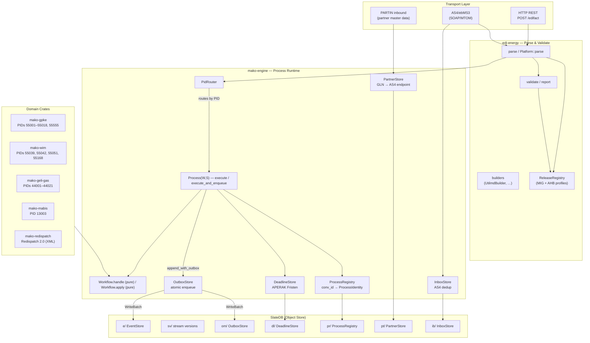
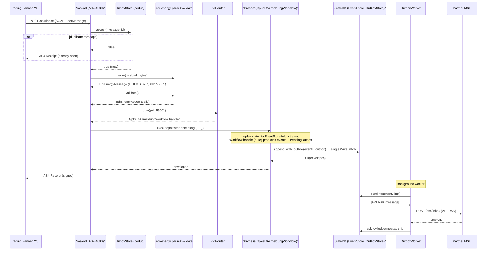
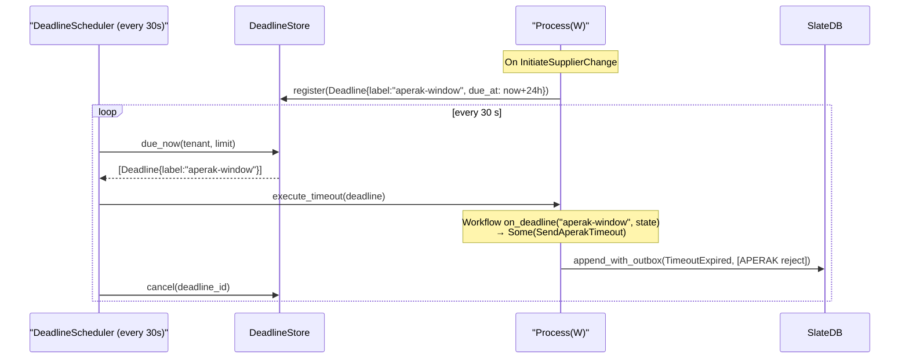

# Getting Started

> **⚠️ Experimental** — Pre-1.0. APIs may change between releases.

This guide walks you through two starting points:

1. **EDIFACT parsing only** (`edi-energy`) — parse, validate, and build EDIFACT messages without a runtime.
2. **Full process engine** (`mako-engine` + domain crates) — run long-lived MaKo workflows with regulatory deadlines, event sourcing, and AS4 transport.

---

## System Architecture

The library is split into two distinct layers. Understanding this separation is
the key to choosing the right entry point.



**Key invariants:**
- `Workflow::handle` and `Workflow::apply` are **pure functions** — no I/O, no clock, no global state mutation.
- Events and outbox messages are always written in a **single `WriteBatch`** via `append_with_outbox`. Separate writes are not permitted — a crash between the two would produce a lost APERAK.
- All parsing, validation, and external lookups happen at the transport boundary, before the command is constructed.

---

## Prerequisites

- Rust **1.88** or newer (`rustup update stable`)
- Basic familiarity with EDIFACT or the BDEW MaKo specification

---

## Part 1 — EDIFACT parsing (`edi-energy`)

### Installation

```toml
[dependencies]
edi-energy = "0.5"
```

By default this enables the four most common message types: **UTILMD**, **MSCONS**, **APERAK**, **CONTRL**.

Enable additional types:

```toml
edi-energy = { version = "0.5", features = ["invoic", "remadv", "orders"] }
```

### Feature flags

| Flag | Default | Description |
|---|---|---|
| `utilmd` | ✅ | UTILMD Strom and Gas — grid connection processes |
| `mscons` | ✅ | MSCONS — metered services consumption reports |
| `aperak` | ✅ | APERAK — application error acknowledgements |
| `contrl` | ✅ | CONTRL — interchange syntax acknowledgements |
| `invoic` | | Invoices |
| `remadv` | | Remittance advice |
| `orders` | | Purchase orders |
| `iftsta` | | Multimodal status reports |
| `insrpt` | | Inspection reports |
| `reqote` | | Requests for quotation |
| `partin` | | Party information (partner master data) |
| `ordchg` | | Purchase order changes |
| `ordrsp` | | Purchase order responses |
| `quotes` | | Quotations |
| `comdis` | | Commercial dispute (Handelsunstimmigkeit) |
| `pricat` | | Price/sales catalogue |
| `utilts` | | Technical master data |
| `archive` | | All archived profiles (expired release windows) |
| `serde` | | `Serialize` on `EdiEnergyReport` and validation issue types |
| `diagnostics` | | `miette::Diagnostic` on reports (rich error output) |
| `tracing` | | Structured spans via the `tracing` crate |

### Your first parse

```rust
use edi_energy::{parse, EdiEnergyMessage};

fn main() -> Result<(), Box<dyn std::error::Error>> {
    let input = std::fs::read("my_message.edi")?;
    let msg = parse(&input)?;

    if let Some(mt) = msg.try_message_type() {
        println!("Type    : {}", mt.as_str());
    }
    println!("Release : {}", msg.detect_release()?.as_str());
    println!("PID     : {}", msg.detect_pruefidentifikator()?.as_u32());

    let report = msg.validate()?;
    println!("Valid   : {}", report.is_valid());

    // Turn the report into a Result — propagates as Error::Validation
    report.into_error_result()?;
    Ok(())
}
```

### Running the built-in examples

```bash
# Parse a UTILMD and inspect typed fields
cargo run --example 01_parse_utilmd

# Parse a MSCONS metering report
cargo run --example 02_parse_mscons

# Build messages from scratch
cargo run --example 03_build_messages

# Route a multi-message interchange
cargo run --example 04_interchange_dispatch

# Full validation report API walkthrough
cargo run --example 05_validate

# Streaming interchange reader
cargo run --example 06_parse_reader
```

### Key concepts

**Pruefidentifikator (PID):** Every EDI@Energy message has a 5-digit Pruefidentifikator (e.g. `55001 = Lieferbeginn Strom`) stored in the BGM segment. The library uses it to select the correct AHB validation rules.

**Release:** A BDEW format-version string such as `"S2.1"` (UTILMD Strom) or `"2.4c"` (MSCONS). Releases are registered in the `ReleaseRegistry` and used to look up the right MIG and AHB profiles.

**Validation layers:**

| Layer | What it checks |
|---|---|
| 1 — Schema | Segment presence and mandatory data elements |
| 2 — Code lists | Data element values against allowed code lists |
| 3 — MIG | Message structure rules (segment order, group cardinality) |
| 4 — AHB | Pruefidentifikator-specific mandatory/conditional rules |
| 5 — Semantic | Cross-field business logic (date coherence, reference completeness) |

---

## Part 2 — Process engine (`mako-engine` + domain crates)

The process engine handles the **runtime side** of MaKo: tracking in-flight
market processes (Lieferbeginn, Gerätewechsel, …) as event-sourced streams,
enforcing regulatory deadlines, and enqueueing outbound EDIFACT messages
atomically with domain events.

### Message flow — inbound UTILMD (Lieferbeginn)

This diagram shows the complete path of a single inbound UTILMD message from
AS4 reception to durable event storage.



### Deadline enforcement — APERAK Frist



### Installation

```toml
[dependencies]
# Core runtime
mako-engine = { version = "0.5", features = ["testing"] }  # add "slatedb" for production

# One or more domain crates depending on the market role:
mako-gpke     = "0.5"   # GPKE — Lieferbeginn/-ende Strom (PIDs 55001–55018, 55555)
mako-wim      = "0.5"   # WiM  — Messstellenwechsel Strom (PIDs 55039, 55042, 55051, 55168)
mako-geli-gas = "0.5"   # GeLi Gas — Lieferbeginn/-ende Gas (PIDs 44001–44021)
mako-mabis    = "0.5"   # MABIS — Bilanzkreisabrechnung Strom (PID 13003)
```

For the **production daemon** (`makod`) that wires everything together, see [Part 3](#part-3--running-makod) below.

### Building an engine context

```rust
use mako_engine::{
    builder::EngineBuilder,
    event_store::InMemoryEventStore,   // "testing" feature
};

let ctx = EngineBuilder::new()
    .with_event_store(InMemoryEventStore::new())
    .build();
```

For production, use `SlateDbStore`:

```rust
use mako_engine::store_slatedb::SlateDbStore;

let store = SlateDbStore::open("/data/mako").await?;
let ctx = EngineBuilder::new()
    .with_event_store(store.clone())
    .with_snapshot_store(store.as_snapshot_store())
    .with_deadline_store(store.as_deadline_store())
    .with_dead_letter_sink(store.as_dead_letter_sink())
    .build();
```

### Spawning and executing a process

```rust
use mako_engine::{ids::TenantId, version::WorkflowId};
use mako_gpke::lf_anmeldung::{GpkeLfAnmeldungWorkflow, LfAnmeldungCommand};

let tenant = TenantId::new();
let wf_id  = WorkflowId::new("gpke-lf-anmeldung", "FV2025-10-01");

// Spawn starts an empty process — no events yet.
let process = ctx.spawn::<GpkeLfAnmeldungWorkflow>(tenant, wf_id);

// execute() replays state, calls Workflow::handle, and appends events.
let envelopes = process.execute(LfAnmeldungCommand::InitiateAnmeldung { .. }).await?;

// Reconstruct current state by replaying all persisted events.
let state = process.state().await?;
```

### Persisting routing information and resuming

```rust
// Register the conversation ID so subsequent messages can find this process.
ctx.registry()
    .register(tenant, &conversation_id.to_string(), process.identity())
    .await?;

// Later — resume on an incoming APERAK or CONTRL:
let identity = ctx.registry()
    .lookup(tenant, &conversation_id.to_string())
    .await?
    .expect("process not found");

let resumed = ctx.resume::<GpkeLfAnmeldungWorkflow>(identity);
let envelopes = resumed.execute(LfAnmeldungCommand::HandleAntwort { .. }).await?;
```

### Dispatching inbound AS4 messages

`makod` handles AS4 reception automatically. In tests or custom integrations, the dispatch path is:

```rust
use edi_energy::{Platform, EdiEnergyMessage};
use mako_engine::pid_router::PidRouter;
use mako_gpke::GpkeModule;

let platform = Platform::with_all_profiles();
let mut router = PidRouter::new();
GpkeModule::register_pids(&mut router);

let msg = platform.parse(payload_bytes)?;
let pid = msg.detect_pruefidentifikator()?.as_u32();

if let Some(handler) = router.route(pid) {
    handler.dispatch(&ctx, tenant, msg).await?;
}
```

---

## Part 3 — Running `makod`

`makod` is the production daemon. It wires the engine, AS4 transport, REST API,
and background workers into a single supervised process.

### Fastest start (in-memory, development)

```bash
cargo run -p makod -- \
  --http-addr 127.0.0.1:8080 \
  --tenant-id 9900357000004
```

Send a test message:

```bash
curl -X POST http://localhost:8080/edifact \
  -H "Content-Type: text/plain; charset=utf-8" \
  --data-binary @crates/edi-energy/tests/fixtures/utilmd/utilmd_55001.edi
```

### Production startup (S3 backend)

```bash
makod \
  --object-store s3 \
  --s3-bucket my-makod-events \
  --tenant-id 9900357000004 \
  --http-addr 0.0.0.0:8080 \
  --http-api-token "${MAKOD_HTTP_API_TOKEN}" \
  --as4-addr 0.0.0.0:4080 \
  --as4-party-id 9900357000004 \
  --as4-signing-key-pem-file /etc/makod/signing.key.pem \
  --as4-signing-cert-pem-file /etc/makod/signing.cert.pem \
  --as4-partner 9900000000001=https://partner.example/as4/inbox
```

Or use the TOML config file — see the full operator guide at
[docs/makod.md](./makod.md).

### `makod` port layout

```
Port  Service              Endpoint
────  ──────────────────── ────────────────────────────────────────────
4080  AS4/ebMS3 inbound    POST /as4/inbox
                           GET  /health
8080  HTTP REST API        POST /edifact
                           GET  /admin/partners
                           PUT  /admin/partners/{gln}
                           GET  /admin/malo/{malo_id}
                           PUT  /admin/malo/{malo_id}
                           GET  /health
8090  API-Webdienste Strom POST /maloId/request/v1
                           POST /controlMeasures/…
                           GET  /health
```

---

## Next Steps

- [**`makod` Operator Guide**](./makod.md) — all config options, Docker/Kubernetes, secrets, health checks, partner management
- [Process Engine Guide](./engine.md) — `mako-engine` architecture, stores, deadlines, outbox
- [Parsing Guide](./parsing.md) — single message, interchange, streaming reader
- [Validation Guide](./validation.md) — interpreting reports, severity levels
- [Builder Guide](./builders.md) — constructing messages programmatically
- [Platform Guide](./platform.md) — multi-tenant use and test isolation
- [API-Webdienste Strom](./api-webdienste.md) — REST/JSON channel for iMS processes (`energy-api`)
- [Release Lifecycle](./release-lifecycle.md) — annual BDEW profile updates

