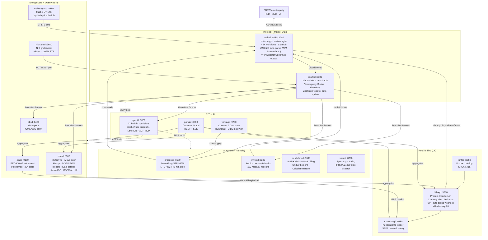

<!-- ── Hero ─────────────────────────────────────────────────────────────────── -->
<div class="mako-hero">
  <div class="mako-hero__badge-row">
    <a href="https://github.com/hupe1980/mako/actions/workflows/ci.yml">
      
    </a>
    <a href="https://crates.io/crates/edi-energy">
      
    </a>
    <a href="https://crates.io/crates/mako-engine">
      
    </a>
    
    <a href="https://github.com/hupe1980/mako/blob/main/LICENSE-MIT">
      
    </a>
    
    
    
  </div>

  <h1 class="mako-hero__title">mako ⚡</h1>

  <p class="mako-hero__subtitle">
    German energy market communication —<br>from EDIFACT bytes to production microservices
  </p>

  <p class="mako-hero__tagline">
    A Rust workspace covering the full BDEW MaKo stack: EDIFACT parsing, AHB/MIG validation,
    event-sourced process runtime, AS4 transport, automated regulatory deadline enforcement,
    energy billing, EEG settlement, and LLM-powered AI orchestration.
    17 independently deployable services. Zero hardcoded EDIFACT parsers required.
  </p>

  <div class="mako-hero__cta">
    <a href="{{ '/getting-started' | relative_url }}" class="mako-btn-primary">
      Get started →
    </a>
    <a href="{{ '/architecture' | relative_url }}" class="mako-btn-secondary">
      Architecture
    </a>
    <a href="https://github.com/hupe1980/mako" class="mako-btn-secondary">
      GitHub ↗
    </a>
  </div>

  <div class="mako-hero__warning">
    <strong>⚠ Pre-1.0 — Experimental.</strong>
    APIs may change between releases. Validate thoroughly before production deployment.
  </div>
</div>

<!-- ── KPI strip ─────────────────────────────────────────────────────────── -->
<div class="mako-kpis">
  <div class="mako-kpi">
    <span class="mako-kpi__value">17</span>
    <span class="mako-kpi__label">EDIFACT message types</span>
  </div>
  <div class="mako-kpi">
    <span class="mako-kpi__value">247</span>
    <span class="mako-kpi__label">Prüfidentifikatoren</span>
  </div>
  <div class="mako-kpi">
    <span class="mako-kpi__value">45+</span>
    <span class="mako-kpi__label">event-sourced workflows</span>
  </div>
  <div class="mako-kpi">
    <span class="mako-kpi__value">17</span>
    <span class="mako-kpi__label">production services</span>
  </div>
  <div class="mako-kpi">
    <span class="mako-kpi__value">0</span>
    <span class="mako-kpi__label">unsafe blocks</span>
  </div>
  <div class="mako-kpi">
    <span class="mako-kpi__value">160+</span>
    <span class="mako-kpi__label">MCP tools (AI-ready)</span>
  </div>
  <div class="mako-kpi">
    <span class="mako-kpi__value">27</span>
    <span class="mako-kpi__label">built-in AI specialists</span>
  </div>
  <div class="mako-kpi">
    <span class="mako-kpi__value">1.94</span>
    <span class="mako-kpi__label">MSRV stable Rust</span>
  </div>
</div>

<div markdown="1">

---

## What is mako?

mako is an **open-source Rust workspace** that implements the German energy market
communication standard (**BDEW MaKo / EDI@Energy**) end-to-end.

It solves two hard problems at once:

- **Protocol correctness** — All 247 Prüfidentifikatoren across 17 EDIFACT message types are validated at AHB/MIG layer, not just schema layer. APERAK 45-minute deadline enforcement is built into the event-sourced runtime, not bolted on.
- **Operational scale** — 17 independently deployable microservices cover the full lifecycle: supplier-switch processes, NNE billing, EEG settlement, B2C/B2B contract management with multi-user portal access, customer account ledger, and AI-powered automation.

Rust provides zero-cost abstractions, `async`/`await` concurrency, and the type safety needed to represent complex regulatory invariants at compile time — not runtime.

---

## Features

</div>

<!-- ── Feature grid ─────────────────────────────────────────────────────── -->
<div class="mako-features">
  <div class="mako-feature">
    <div class="mako-feature__icon">🔍</div>
    <h3>Parse &amp; Validate EDIFACT</h3>
    <p>
      All 17 EDI@Energy message types with a 5-layer validation pipeline:
      schema → code lists → MIG structural → AHB Prüfidentifikator-specific → semantic cross-field rules.
      Returns a structured <code>EdiEnergyReport</code> with per-rule violation details — not raw parse errors.
    </p>
    <a href="{{ '/parsing' | relative_url }}">Parsing guide →</a>
  </div>

  <div class="mako-feature">
    <div class="mako-feature__icon">⚙️</div>
    <h3>Event-Sourced Process Runtime</h3>
    <p>
      45+ durable, replayable MaKo workflows built on <code>mako-engine</code>.
      Atomic dual-write (events + APERAK outbox in one <code>WriteBatch</code>) guarantees
      no lost messages on crash. FV2025-10-01 and FV2026-10-01 coexist simultaneously.
    </p>
    <a href="{{ '/engine' | relative_url }}">Engine guide →</a>
  </div>

  <div class="mako-feature">
    <div class="mako-feature__icon">⚖️</div>
    <h3>Automated Regulatory Compliance</h3>
    <p>
      APERAK 45-minute deadline enforced automatically in <code>processd</code>.
      Cedar ABAC generates per-decision audit records proving §20 EnWG non-discrimination.
      BNetzA KPI reports are a SQL query — not a log search.
    </p>
    <a href="{{ '/bnetza' | relative_url }}">BNetzA reference →</a>
  </div>

  <div class="mako-feature">
    <div class="mako-feature__icon">🌱</div>
    <h3>EEG/KWKG Settlement</h3>
    <p>
      <strong>9 settlement schemes</strong> from §21 FeedInTariff to §50a/50b FlexibilitätsPrämien,
      including Direktvermarktung MarketPremium, KWKG Zuschlag, and Post-EEG Spot.
      Version-aware <strong>§51 Negativpreisregel</strong> (EEG 2017/2021/2023 + Bestandsschutz),
      §52 Pflichtzahlungen (cumulative from violation start), §100 auto-override, §36k Korrekturfaktor.
      Pure <code>eeg-billing</code> crate — <strong>324 tests</strong>, zero I/O.
    </p>
    <a href="{{ '/einsd' | relative_url }}">einsd guide →</a>
  </div>

  <div class="mako-feature">
    <div class="mako-feature__icon">🧾</div>
    <h3>Energy Billing Engine</h3>
    <p>
      <strong>12 product categories</strong> — STROM (SLP/HT/NT/RLM), GAS, WAERME, SOLAR,
      EEG/EINSPEISUNG, §14a WAERMEPUMPE/WALLBOX, HEMS, EMOBILITY, ENERGIEDIENSTLEISTUNG,
      §42c SHARING.
      `Product` typed enum with per-category structs; `ControllableLoadProvider` for §14a;
      §41b iMSys guard; `StromsteuerBefreiung` typed enum; `EnergieQuellen` CO₂ label;
      historic levy lookups (incl. 2022 0-rate); §41a EPEX; §41b enforcement;
      XRechnung 3.0 / ZUGFeRD 2.3 (EN16931, B2G mandate 01.01.2027).
      Pure <code>energy-billing</code> crate — <strong>160 tests</strong>, zero I/O, no rubo4e dep.
    </p>
    <a href="{{ '/billingd' | relative_url }}">billingd guide →</a>
  </div>

  <div class="mako-feature">
    <div class="mako-feature__icon">📊</div>
    <h3>Grid Settlement Engine</h3>
    <p>
      <code>grid-billing</code> calculates NNE, KA, MMM, MSB, and AWH Sperrprozesse invoices
      for PIDs 31001/31002/31005/31006/31009/31011.
      Every position carries a <strong><code>CalculationTrace</code></strong> with explanation,
      legal refs (StromNEV §21, GasNEV §14, KAV §2, §14a EnWG), and tariff source.
      <code>BillingPositionKind</code> on every position drives the service-layer BDEW Artikelnummer
      mapping (<em>Codeliste v5.6</em>) — Gas NNE/MMM/KA use classic codes
      (9990001…); NNE Strom uses <code>artikel_id</code> per BK6-20-160; AWH Gas uses
      <code>2-01-7-001/002</code>.
      §14a Modul 1 flat reduction, Modul 2 HT/NT, Gas Grundpreis, reactive energy (<code>Kvarh</code>).
      <code>calculate_reversal()</code> produces immutable Stornorechnung;
      <code>calculate_correction()</code> returns the (reversal, replacement) pair atomically.
    </p>
    <a href="{{ '/netzbilanzd' | relative_url }}">netzbilanzd guide →</a>
  </div>

  <div class="mako-feature">
    <div class="mako-feature__icon">📡</div>
    <h3>Smart Meter &amp; Energy Data</h3>
    <p>
      <code>edmd</code> accepts 15-min iMSys/SMGW data directly via JSON push — no MSCONS round-trip.
      Quality scoring via <code>metering::score_intervals_f64</code> (Hampel filter, grades A/B/C/F)
      auto-vectorises to AVX2/NEON on every batch; grade F blocks billing.
      GDPR Art. 17 erasure endpoint with cold-tier read-time exclusion.
    </p>
    <p>
      <strong>Apache Iceberg V2 cold tier:</strong> automatic archival to S3/GCS/Azure with
      ZSTD+<code>DELTA_BINARY_PACKED</code> encoding (20–60× timestamp compression), Bloom filters on
      <code>malo_id</code>, and a built-in <strong>Iceberg REST catalog</strong> so DuckDB, Snowflake,
      and Databricks can <code>ATTACH</code> directly — no ETL pipeline.
      Arrow IPC bulk export (<code>Accept: application/vnd.apache.arrow.stream</code>) delivers
      10–50× throughput vs JSON for mabis-syncd and billingd batch reads.
    </p>
    <p>
      <strong>§42b EnWG Solarpaket I (GGV community solar):</strong>
      <code>GgvConstantAllocation</code> (CCI+ZG6, <em>Beispiel 1</em>) and
      <code>GgvProportionalAllocation</code> (<em>Beispiel 3</em>). The <code>Pos()</code>
      operator enforces the §42b Abs. 5 per-tenant cap per 15-min interval.
    </p>
    <a href="{{ '/edmd' | relative_url }}">edmd guide →</a>
  </div>

  <div class="mako-feature">
    <div class="mako-feature__icon">🤝</div>
    <h3>Contract &amp; Customer Management</h3>
    <p>
      <code>vertragd</code> manages B2C and B2B customers with role-based multi-user portal access,
      B2B Rahmenverträge (portfolio pricing, Sammelrechnung), and Versorgungsverträge per site/commodity.
      Preisgarantie guard prevents unauthorized tariff changes (§41 EnWG).
      <strong>GDPR Art. 15/17/20</strong> built-in — full export, irreversible pseudonymization with
      immutable audit trail, and typed <code>Zahlungsinformation</code> (IBAN mod-97 validated).
      Serves as the sole OIDC→MaLo authorization gateway for <code>portald</code>.
    </p>
    <a href="{{ '/vertragd' | relative_url }}">vertragd guide →</a>
  </div>

  <div class="mako-feature">
    <div class="mako-feature__icon">🛠️</div>
    <h3>Service SDK</h3>
    <p>
      <code>mako-service</code> is the shared infrastructure all 17 daemons build on.
      SIGINT/SIGTERM graceful drain, OIDC verifier, MCP auth, Cedar ABAC, OpenTelemetry,
      EventBus (WebhookBus / KafkaBus), webhook HMAC verification, and rate limiting —
      all wired with one call per service.
    </p>
    <a href="https://github.com/hupe1980/mako/tree/main/crates/mako-service">mako-service SDK →</a>
  </div>

  <div class="mako-feature">
    <div class="mako-feature__icon">🤖</div>
    <h3>AI / LLM Integration</h3>
    <p>
      Every service exposes tools and prompts at <code>/mcp</code> (Streamable HTTP 2025-11-25).
      <code>agentd</code> ships <strong>27 built-in specialists compiled into the container image</strong>
      — operators activate them via <code>[bundled_agents]</code> without copying system prompts.
      Supports <strong>sequential / parallel / race dispatch</strong> modes;
      A2A agent cards at <code>/.well-known/agents/{name}</code>;
      OpenAI / Anthropic / AWS Bedrock SigV4; LanceDB RAG; WASM plugin sandboxing.
      Specialists cover billing anomaly detection, §41b/§42 compliance guard,
      annual settlement orchestration, §20 EnWG parity, SMGW BSI TR-03109 diagnostics,
      VPP dispatch settlement audit (RED III Art. 17), MaBiS UTILTS monitoring, and more.
    </p>
    <a href="{{ '/agentd' | relative_url }}">agentd guide →</a>
  </div>
</div>

<div markdown="1">

---

## Architecture

The system organizes 17 independently deployable services across five functional layers,
connected by CloudEvents 1.0 webhooks and a shared `mako-service` infrastructure SDK.

</div>



<div markdown="1">

---

## Quick Start

**Library usage** — add to `Cargo.toml`:

```toml
[dependencies]
edi-energy  = { version = "0.12", features = ["utilmd", "mscons", "aperak"] }
mako-engine = { version = "0.12", features = ["testing"] }
mako-gpke   = "0.12"
```

**Parse and validate a UTILMD Lieferbeginn:**

```rust
use edi_energy::{parse, EdiEnergyMessage};

let msg = parse(std::fs::read("lieferbeginn.edi")?.as_ref())?;
msg.validate()?.into_error_result()?;  // returns Err if any AHB rule fires
let pid = msg.detect_pruefidentifikator()?.as_u32();  // → 55001
println!("PID {pid}: GPKE Lieferbeginn Strom");
```

**Local development** — run services directly, infra in Docker (`cargo-watch` required):

```bash
just infra-up            # start postgres, all 13 databases pre-created

just dev marktd          # hot-reload — cargo watch -x "run -p marktd"
just dev processd        # separate terminal per service
just dev makod
```

**Full demo stack:**

```bash
git clone https://github.com/hupe1980/mako
cd mako
docker buildx bake makod marktd processd
cd demos/nb-stp
docker compose up -d
MARKTD_URL=http://localhost:8180 WEBHOOK_URL=http://localhost:8000 bash smoke.sh
```

→ Full walkthrough: [Getting Started guide]({{ '/getting-started' | relative_url }})

---

## Services

mako consists of 17 independently deployable services. Each ships a built-in MCP server at `/mcp` for LLM tool integration.

</div>

<div class="mako-group-label">Protocol &amp; Market Data</div>
<div class="mako-service-grid">
  <a href="{{ '/makod' | relative_url }}" class="mako-service-card">
    <span class="mako-service-card__name">makod</span>
    <span class="mako-service-card__port">:8080 · :4080 · :8090</span>
    <span class="mako-service-card__desc">45+ GPKE/WiM/GeLi Gas/MABIS/GaBi Gas workflows. AS4, REST, iMS. SlateDB event store.</span>
  </a>
  <a href="{{ '/marktd' | relative_url }}" class="mako-service-card">
    <span class="mako-service-card__name">marktd</span>
    <span class="mako-service-card__port">:8180</span>
    <span class="mako-service-card__desc">Market Data Hub — MaLo/MeLo/contracts, typed BO4E responses, konfigurationsprodukte, MMMA monthly import, EventBus fan-out.</span>
  </a>
  <a href="{{ '/processd' | relative_url }}" class="mako-service-card">
    <span class="mako-service-card__name">processd</span>
    <span class="mako-service-card__port">:8580</span>
    <span class="mako-service-card__desc">Anmeldung STP ≥95%. LF E_0624 45-min auto-response. MSB REQOTE auto-response. §14a Steuerungsauftrag produktcode check.</span>
  </a>
</div>

<div class="mako-group-label">Invoice &amp; Billing (NB)</div>
<div class="mako-service-grid">
  <a href="{{ '/invoicd' | relative_url }}" class="mako-service-card">
    <span class="mako-service-card__name">invoicd</span>
    <span class="mako-service-card__port">:8280</span>
    <span class="mako-service-card__desc">INVOIC 6-check plausibility pipeline. Auto-settle/dispute. §22 MessZV PostgreSQL receipts.</span>
  </a>
  <a href="{{ '/netzbilanzd' | relative_url }}" class="mako-service-card">
    <span class="mako-service-card__name">netzbilanzd</span>
    <span class="mako-service-card__port">:8680</span>
    <span class="mako-service-card__desc">NNE/KA/MMM/MSB/AWH billing (INVOIC 31001/31002/31005/31009/31011). §14a Modul 2 ToU. §42a GGV. REMADV lifecycle. Redispatch 2.0 Kostenblatt. 13-tool MCP.</span>
  </a>
  <a href="{{ '/sperrd' | relative_url }}" class="mako-service-card">
    <span class="mako-service-card__name">sperrd</span>
    <span class="mako-service-card__port">:8780</span>
    <span class="mako-service-card__desc">Sperrung execution tracking. Auto-dispatches IFTSTA 21039 on field confirmation.</span>
  </a>
</div>

<div class="mako-group-label">Energy Data &amp; EEG</div>
<div class="mako-service-grid">
  <a href="{{ '/edmd' | relative_url }}" class="mako-service-card">
    <span class="mako-service-card__name">edmd</span>
    <span class="mako-service-card__port">:8380</span>
    <span class="mako-service-card__desc">MSCONS meter readings (PIDs 13005–13027). iMSys direct push (§41a). Hampel quality scoring (A/B/C/F, AVX2/NEON). Virtual meters (§42b GGV Solarpaket I). §17 MessZV forecasting &amp; substitution. Ablesesteuerung. Iceberg/S3 OLAP archive with Parquet Bloom filters. Arrow IPC bulk export. Iceberg REST catalog (DuckDB/Snowflake/Databricks). GDPR Art. 17 erasure.</span>
  </a>
  <a href="{{ '/mabis-syncd' | relative_url }}" class="mako-service-card">
    <span class="mako-service-card__name">mabis-syncd</span>
    <span class="mako-service-card__port">:8880</span>
    <span class="mako-service-card__desc">MaBiS UTILTS synchronisation — aggregates per-MaLo Lastgang and submits Summenzeitreihen to BIKO. Scheduled day 3 (vorläufig) + day 8 (endgültig) per BK6-22-024 Anlage 3.</span>
  </a>
  <a href="{{ '/einsd' | relative_url }}" class="mako-service-card">
    <span class="mako-service-card__name">einsd</span>
    <span class="mako-service-card__port">:9180</span>
    <span class="mako-service-card__desc">Einspeiser registry. 9 EEG/KWKG settlement schemes. §51/§51a/§51b Negativpreisregel. §100 Bestandsschutz auto-override. §25 Abs. 1 Satz 3 anteilige Zahlung. §26 Fälligkeitsdatum. §19 EInsMan compensation. §21b Veräußerungsform Wechsel. §53b/§54 regional+auction reductions. §22 MessZV correction receipts. derive_settlement_state auto-update. Repowering §22. <strong>324 eeg-billing tests</strong>. 14-tool MCP. §3 Nr. 1 Direktvermarktung compliance check. §44b Biogas quota monitoring.</span>
  </a>
  <a href="{{ '/obsd' | relative_url }}" class="mako-service-card">
    <span class="mako-service-card__name">obsd</span>
    <span class="mako-service-card__port">:8480</span>
    <span class="mako-service-card__desc">Process projections, BNetzA KPI reports, §20 EnWG parity monitoring. Alertmanager bridge.</span>
  </a>
  <a href="{{ '/nis-syncd' | relative_url }}" class="mako-service-card">
    <span class="mako-service-card__name">nis-syncd</span>
    <span class="mako-service-card__port">:9680</span>
    <span class="mako-service-card__desc">Stateless NIS/GIS grid topology import. Lifts NB Anmeldung STP ~80 % → ≥ 95 %.</span>
  </a>
</div>

<div class="mako-group-label">Retail Billing &amp; Finance (LF)</div>
<div class="mako-service-grid">
  <a href="{{ '/tarifbd' | relative_url }}" class="mako-service-card">
    <span class="mako-service-card__name">tarifbd</span>
    <span class="mako-service-card__port">:9080</span>
    <span class="mako-service-card__desc">User-defined product catalog. 12 energy categories. EPEX Spot prices for §41a. MaLo→product assignment.</span>
  </a>
  <a href="{{ '/billingd' | relative_url }}" class="mako-service-card">
    <span class="mako-service-card__name">billingd</span>
    <span class="mako-service-card__port">:9280</span>
    <span class="mako-service-card__desc">Energy billing engine. §41a dynamic EPEX. Gas Brennwertkorrektur + H2-blend audit. §14a Modul 1/3. §42a GGV community solar. VPP auto-billing (de.vpp.dispatch.confirmed → Rechnung, RED III Art. 17). XRechnung 3.0 / ZUGFeRD 2.3.</span>
  </a>
  <a href="{{ '/accountingd' | relative_url }}" class="mako-service-card">
    <span class="mako-service-card__name">accountingd</span>
    <span class="mako-service-card__port">:9380</span>
    <span class="mako-service-card__desc">Massenkontokorrent ledger. FIFO open-item management. CAMT.054 bank import. SEPA pain.008+pain.001 (sepa 0.3). Auto-dunning rule engine (Mahnstufe 1–3). GDPR Art.†17 pseudonymization. Balance reconciliation. IBAN mod-97 validation.</span>
  </a>
</div>

<div class="mako-group-label">B2C &amp; AI</div>
<div class="mako-service-grid">
  <a href="{{ '/vertragd' | relative_url }}" class="mako-service-card">
    <span class="mako-service-card__name">vertragd</span>
    <span class="mako-service-card__port">:9780</span>
    <span class="mako-service-card__desc">Contract &amp; Customer Management. Kunden (B2C+B2B). Rahmenverträge. kunden_identitaeten (N portal users). Tarifwechsel with Preisgarantie guard. Person BO4E (GDPR Art. 15). OIDC→MaLo auth gateway.</span>
  </a>
  <a href="{{ '/portald' | relative_url }}" class="mako-service-card">
    <span class="mako-service-card__name">portald</span>
    <span class="mako-service-card__port">:9480</span>
    <span class="mako-service-card__desc">Customer Portal gateway — Lastgang, invoices, balance, EEG, VersorgungsStatus. REST + SSE. OIDC-gated.</span>
  </a>
  <a href="{{ '/agentd' | relative_url }}" class="mako-service-card">
    <span class="mako-service-card__name">agentd</span>
    <span class="mako-service-card__port">:9580</span>
    <span class="mako-service-card__desc">Multi-agent LLM orchestration. 27 specialists compiled into container image. Activated via [bundled_agents] config. Sequential/parallel/race dispatch. A2A agent cards. LanceDB RAG. Billing regulatory guard (§41/§41b/§42). Annual settlement. Billing anomaly AI. §17 MessZV substitute-value agent. BSI TR-03109 SMGW diagnostics. VPP dispatch settlement audit (RED III Art. 17). MaBiS deadline monitoring. Compliance (§20 EnWG). OpenAI/Anthropic/Bedrock.</span>
  </a>
</div>

<div markdown="1">

---

## Design Principles

</div>

<div class="mako-principles">
  <div class="mako-principle">
    <strong>No EDIFACT expertise required</strong>
    AHB/MIG validation, Prüfidentifikatoren, and regulatory deadlines are built in.
    You write domain logic in Rust; mako handles the protocol layer.
  </div>
  <div class="mako-principle">
    <strong>Annual format versions in hours, not months</strong>
    <code>cargo xtask codegen</code> regenerates all 247 AHB profiles from BDEW PDFs.
    FV2025-10-01 and FV2026-10-01 coexist in the same running instance.
  </div>
  <div class="mako-principle">
    <strong>Atomic dual-write — no lost APERAKs</strong>
    Events and APERAK outbox entries are written in one <code>WriteBatch</code> via
    <code>AtomicAppend::append_with_outbox</code>. A crash between two writes is impossible.
  </div>
  <div class="mako-principle">
    <strong>Pure functions, deterministic state</strong>
    <code>Workflow::handle</code> and <code>Workflow::apply</code> are pure.
    No I/O, no clock access. Replayable, trivially testable, audit-compliant.
  </div>
  <div class="mako-principle">
    <strong>BO4E at every API boundary</strong>
    <code>marktd</code> returns typed <code>rubo4e::current::Marktlokation</code>, not raw JSON.
    Schema validation on every PUT rejects malformed data before it causes silent billing errors.
  </div>
  <div class="mako-principle">
    <strong>MCP server in every service</strong>
    All 17 daemons expose tools and guided prompts at <code>/mcp</code> (Streamable HTTP 2025-11-25).
    Plug any MCP-capable LLM client directly into your energy market operations.
  </div>
</div>

<div markdown="1">

---

## Regulatory Coverage

mako ships AHB/MIG profiles for every active BDEW format version:

</div>

<div class="mako-compliance-grid">
  <div class="mako-compliance-card">
    <div class="mako-compliance-card__id">BK6-24-174</div>
    <div class="mako-compliance-card__desc">GPKE Teil 1–3, WiM Strom, MABIS</div>
    <div class="mako-compliance-card__date">Effective 06.06.2025</div>
  </div>
  <div class="mako-compliance-card">
    <div class="mako-compliance-card__id">BK6-22-024</div>
    <div class="mako-compliance-card__desc">GPKE Teil 4 — Stammdatenprozesse</div>
    <div class="mako-compliance-card__date">Effective 06.06.2025</div>
  </div>
  <div class="mako-compliance-card">
    <div class="mako-compliance-card__id">BK7-24-01-009</div>
    <div class="mako-compliance-card__desc">GeLi Gas 3.0 — UTILMD G supplier-switch</div>
    <div class="mako-compliance-card__date">Effective 01.10.2025</div>
  </div>
  <div class="mako-compliance-card">
    <div class="mako-compliance-card__id">BDEW FV2026-10-01</div>
    <div class="mako-compliance-card__desc">All message types — annual release</div>
    <div class="mako-compliance-card__date">Effective 01.10.2026</div>
  </div>
  <div class="mako-compliance-card">
    <div class="mako-compliance-card__id">§14a EnWG</div>
    <div class="mako-compliance-card__desc">Controllable loads — Modul 1/2/3 discounts</div>
    <div class="mako-compliance-card__date">Since 01.01.2024</div>
  </div>
  <div class="mako-compliance-card">
    <div class="mako-compliance-card__id">§41a EnWG</div>
    <div class="mako-compliance-card__desc">Dynamic EPEX tariffs — mandatory from 2025</div>
    <div class="mako-compliance-card__date">Since 01.01.2025</div>
  </div>
</div>

<div markdown="1">

→ [BNetzA regulatory reference]({{ '/bnetza' | relative_url }}) · [PID reference]({{ '/pid-reference' | relative_url }}) · [Annual release workflow]({{ '/annual-release-workflow' | relative_url }})

---

## Libraries

Beyond the production services, mako exposes reusable Rust libraries:

| Crate | Published | Purpose |
|---|---|---|
| [`edi-energy`](https://crates.io/crates/edi-energy) | ✅ crates.io | Parse · validate · build all 17 EDI@Energy EDIFACT types |
| [`mako-engine`](https://crates.io/crates/mako-engine) | ✅ crates.io | Event-sourced runtime: `Workflow`, `Process`, `EventStore`, outbox, deadlines |
| `metering` | workspace | German metering domain — `MeterInterval`, validation V01–V10, substitution (§17 MessZV), Hampel scoring, resampling, virtual meters, SMGW/CLS (§14a), 177 tests |
| `mako-edm` | workspace | Energy Data Management types — `MeterRead`, `QualityFlag` (8 variants), `BilanzzuordnungRecord`, `GasQualityData` (PID 13007), correction records (§22 MessZV) |
| `eeg-billing` | workspace | Pure EEG/KWKG settlement — 9 schemes, §51 Negativpreisregel, §52 Pflichtzahlungen, §36k Wind Korrekturfaktor, `InbetriebnahmeTyp` lifecycle, proptest invariants, **324 tests** |
| `energy-billing` | workspace | Retail energy billing engine — 12 categories, HT/NT ToU, RLM demand charge, §54 EnergieStG exemption, historic levy rates (`stromsteuer_for_year`, `energiesteuer_gas_for_year`), §14a Modul 1/3, XRechnung 3.0 |
| `grid-billing` | workspace | Role-neutral grid **settlement** engine — `GridSettlement` (+ `CalculationTrace`, `LegalReference`, `TariffSource` per position), `Sparte` (Gas/Strom), `KaKlasse`, `calculate_reversal()`, `validate_*_input()`; zero BO4E dep, no float money |
| `invoic-checker` | workspace | INVOIC plausibility — 6 checks, ToU-aware tariff match |
| `netz-checker` | workspace | NB Anmeldung validation — 6 deterministic checks, ERC A02–A99 |
| `mako-gpke` | workspace | GPKE workflows — UTILMD Strom + INVOIC + ORDERS Sperr/Konfig + PARTIN (37000–37006) |
| `mako-wim` | workspace | WiM Strom workflows — MSB-Wechsel, INSRPT, Preisanfrage, INVOIC 31009 |
| `mako-geli-gas` | workspace | GeLi Gas 3.0 — UTILMD G + ORDERS Sperrung Gas + INVOIC 31011 + PARTIN Gas |
| `mako-wim-gas` | workspace | WiM Gas — UTILMD G MSB-Wechsel + INVOIC 31003/31004 + INSRPT Gas |
| `mako-gabi-gas` | workspace | GaBi Gas 2.0 (BK7-14-020) — INVOIC 31007/31008/31010 + MSCONS 13013 MMMA + 8 DVGW workflows (ALOCAT/NOMINT/NOMRES/SCHEDL/IMBNOT/TRANOT/DELORD/DELRES); rich domain model: `GasDay` (DST-aware 06:00 CET), `GasQuantity` (Decimal, DVGW G 685), `GasBeschaffenheit` (Hs/Hu + Zustandszahl), `AllocationVersion` (Initial/Correction/Final per KoV §6.4), `GasMarketRole`, `GasPortfolioBalance` |
| `mako-mabis` | workspace | MABIS — PID 13003 Bilanzkreisabrechnung Strom + `SummenzeitreiheBuilder` + Clearingliste (BKV↔ÜNB) |
| `dvgw-edi` | workspace | DVGW EDIFACT gas transport — ALOCAT, NOMINT, NOMRES, SCHEDL, … |
| `redispatch-xml` | workspace | Redispatch 2.0 XML/XSD — all 9 CIM/IEC 62325 document types |
| `mako-plugin` | workspace | WASM plugin system — Extism/Wasmtime sandbox for custom extensions |

→ [Getting Started]({{ '/getting-started' | relative_url }}) · [Architecture]({{ '/architecture' | relative_url }}) · [Parsing guide]({{ '/parsing' | relative_url }}) · [Engine guide]({{ '/engine' | relative_url }})

</div>
