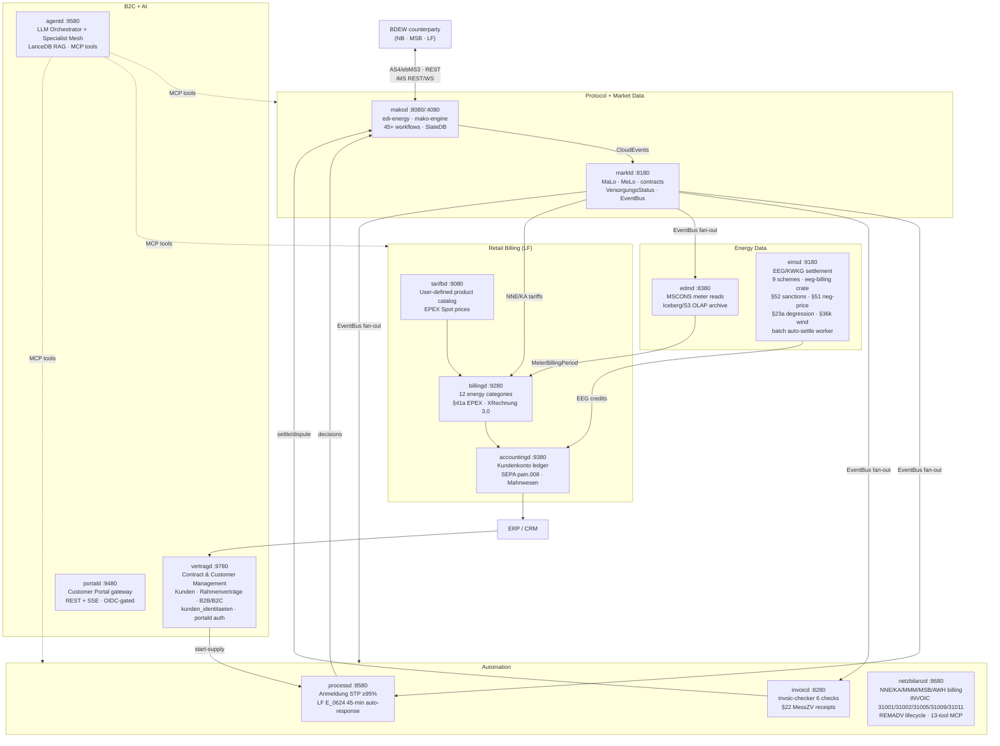

<!-- ── Hero ─────────────────────────────────────────────────────────────────── -->
<div class="mako-hero">
  <div class="mako-hero__badge-row">
    <a href="https://github.com/hupe1980/mako/actions/workflows/ci.yml">
      
    </a>
    <a href="https://crates.io/crates/edi-energy">
      
    </a>
    <a href="https://crates.io/crates/mako-engine">
      
    </a>
    
    <a href="https://github.com/hupe1980/mako/blob/main/LICENSE-MIT">
      
    </a>
    
    
    
  </div>

  <h1 class="mako-hero__title">mako ⚡</h1>

  <p class="mako-hero__subtitle">
    German energy market communication —<br>from EDIFACT bytes to production microservices
  </p>

  <p class="mako-hero__tagline">
    A Rust workspace covering the full BDEW MaKo stack: EDIFACT parsing, AHB/MIG validation,
    event-sourced process runtime, AS4 transport, automated regulatory deadline enforcement,
    energy billing, EEG settlement, and LLM-powered AI orchestration.
    16 independently deployable services. Zero hardcoded EDIFACT parsers required.
  </p>

  <div class="mako-hero__cta">
    <a href="{{ '/getting-started' | relative_url }}" class="mako-btn-primary">
      Get started →
    </a>
    <a href="{{ '/architecture' | relative_url }}" class="mako-btn-secondary">
      Architecture
    </a>
    <a href="https://github.com/hupe1980/mako" class="mako-btn-secondary">
      GitHub ↗
    </a>
  </div>

  <div class="mako-hero__warning">
    <strong>⚠ Pre-1.0 — Experimental.</strong>
    APIs may change between releases. Validate thoroughly before production deployment.
  </div>
</div>

<!-- ── KPI strip ─────────────────────────────────────────────────────────── -->
<div class="mako-kpis">
  <div class="mako-kpi">
    <span class="mako-kpi__value">17</span>
    <span class="mako-kpi__label">EDIFACT message types</span>
  </div>
  <div class="mako-kpi">
    <span class="mako-kpi__value">247</span>
    <span class="mako-kpi__label">Prüfidentifikatoren</span>
  </div>
  <div class="mako-kpi">
    <span class="mako-kpi__value">45+</span>
    <span class="mako-kpi__label">event-sourced workflows</span>
  </div>
  <div class="mako-kpi">
    <span class="mako-kpi__value">16</span>
    <span class="mako-kpi__label">production services</span>
  </div>
  <div class="mako-kpi">
    <span class="mako-kpi__value">0</span>
    <span class="mako-kpi__label">unsafe blocks</span>
  </div>
  <div class="mako-kpi">
    <span class="mako-kpi__value">135+</span>
    <span class="mako-kpi__label">MCP tools (AI-ready)</span>
  </div>
  <div class="mako-kpi">
    <span class="mako-kpi__value">1.94</span>
    <span class="mako-kpi__label">MSRV stable Rust</span>
  </div>
</div>

<div markdown="1">

---

## What is mako?

mako is an **open-source Rust workspace** that implements the German energy market
communication standard (**BDEW MaKo / EDI@Energy**) end-to-end.

It solves two hard problems at once:

- **Protocol correctness** — All 247 Prüfidentifikatoren across 17 EDIFACT message types are validated at AHB/MIG layer, not just schema layer. APERAK 45-minute deadline enforcement is built into the event-sourced runtime, not bolted on.
- **Operational scale** — 16 independently deployable microservices cover the full lifecycle: supplier-switch processes, NNE billing, EEG settlement, B2C/B2B contract management with multi-user portal access, customer account ledger, and AI-powered automation.

Rust provides zero-cost abstractions, `async`/`await` concurrency, and the type safety needed to represent complex regulatory invariants at compile time — not runtime.

---

## Features

</div>

<!-- ── Feature grid ─────────────────────────────────────────────────────── -->
<div class="mako-features">
  <div class="mako-feature">
    <div class="mako-feature__icon">🔍</div>
    <h3>Parse &amp; Validate EDIFACT</h3>
    <p>
      All 17 EDI@Energy message types with a 5-layer validation pipeline:
      schema → code lists → MIG structural → AHB Prüfidentifikator-specific → semantic cross-field rules.
      Structured <code>EdiEnergyReport</code> with per-rule violation details, not raw parse errors.
    </p>
    <a href="{{ '/parsing' | relative_url }}">Parsing guide →</a>
  </div>

  <div class="mako-feature">
    <div class="mako-feature__icon">⚙️</div>
    <h3>Event-Sourced Process Runtime</h3>
    <p>
      Durable, replayable MaKo workflows built on <code>mako-engine</code>.
      Atomic dual-write (events + APERAK outbox in one <code>WriteBatch</code>) guarantees
      no lost messages on crash. Format-version coexistence: FV2025-10-01 and FV2026-10-01
      run simultaneously.
    </p>
    <a href="{{ '/engine' | relative_url }}">Engine guide →</a>
  </div>

  <div class="mako-feature">
    <div class="mako-feature__icon">⏱</div>
    <h3>Automated Regulatory Compliance</h3>
    <p>
      APERAK 45-minute deadline enforced in <code>processd</code>.
      Cedar ABAC generates per-decision audit records proving §20 EnWG non-discrimination.
      BNetzA KPI reports are a SQL query, not a log search.
    </p>
    <a href="{{ '/bnetza' | relative_url }}">BNetzA reference →</a>
  </div>

  <div class="mako-feature">
    <div class="mako-feature__icon">🌱</div>
    <h3>EEG/KWKG Settlement</h3>
    <p>
      <strong>9 settlement schemes</strong> — FeedInTariff (§21 EEG), TenantElectricity (§38a),
      MarketPremium (§20 EEG; §§22a/28 Ausschreibung via <code>TariffSource::Auction</code>),
      PostEeg Spot (configurable price floor), Eigenverbrauch, KwkSurcharge (§7 KWKG 2023),
      FlexibilityPremium (§50b EEG), FlexibilitySurcharge (§50a EEG), FailsafeTariff (§21 Abs. 1 Nr. 2).
      <strong>§20 Abs. 3 Managementprämie</strong> incorporated into AW before spread (EEG 2023 correct formula).
      <strong>§51 version-aware Negativpreisregel</strong> — EEG 2017/2021/2023 thresholds + Bestandsschutz.
      <strong>§51a Verlängerungsanspruch</strong>, <strong>§52 Pflichtzahlungen</strong> (€10/kW),
      <strong>§52 Abs. 6 Netting</strong>, quarterly degression (§23a), §36k Korrekturfaktor,
      multi-meter Messkonzept (§42b GGV, §14a HT/NT). Repowering §22, Zusammenlegung §24.
      284 regulatory tests in <code>eeg-billing</code>.
    </p>
    <a href="{{ '/einsd' | relative_url }}">einsd guide →</a>
  </div>

  <div class="mako-feature">
    <div class="mako-feature__icon">🧾</div>
    <h3>Energy Billing Engine</h3>
    <p>
      12 product categories — STROM, GAS, WAERME, SOLAR, EEG/EINSPEISUNG, WAERMEPUMPE,
      WALLBOX, HEMS, EMOBILITY, ENERGIEDIENSTLEISTUNG, BUNDLE.
      Pure calculation extracted into the <strong><code>energy-billing</code></strong> crate
      (44 tests, zero I/O) — the same pattern as <code>eeg-billing</code> for <code>einsd</code>.
      §41a EPEX dynamic tariffs with optional price floor.
      §51 EEG Negativpreisregel (contractual LF feature).
      XRechnung 3.0 / ZUGFeRD 2.3 output (EN16931).
    </p>
    <a href="{{ '/billingd' | relative_url }}">billingd guide →</a>
  </div>

  <div class="mako-feature">
    <div class="mako-feature__icon">🔄</div>
    <h3>Contract &amp; Customer Management</h3>
    <p>
      <code>vertragd</code> manages B2C and B2B customers with role-based multi-user portal access
      (<code>kunden_identitaeten</code>: N OIDC logins per company with <code>standort_filter</code> site scoping),
      B2B <code>Rahmenverträge</code> with portfolio pricing and Sammelrechnung,
      and <code>Versorgungsverträge</code> per site/commodity. Serves as the sole OIDC→MaLo
      authorization gateway for <code>portald</code>.
    </p>
    <a href="{{ '/vertragd' | relative_url }}">vertragd guide →</a>
  </div>

  <div class="mako-feature">
    <div class="mako-feature__icon">📡</div>
    <h3>iMSys Direct Push &amp; Quality Scoring</h3>
    <p>
      <code>edmd</code> accepts 15-min interval data directly from SMGW/iMSys gateways
      without waiting for the MSCONS round-trip. A <strong>Hampel-filter quality scorer</strong>
      (window k=3, MAD-based σ, grades A/B/C/F) runs on every batch via the
      <code>metering</code> domain library
      (Gas m³→kWh conversion, SLP/RLM/iMSys classification, billing period aggregation).
      Grade F blocks the billing run; grade C/F emits <code>de.edmd.reading.quality.warning</code> to the
      <code>agentd</code> MSB-history specialist for LanceDB RAG indexing.
    </p>
    <a href="{{ '/edmd' | relative_url }}">edmd guide →</a>
  </div>

  <div class="mako-feature">
    <div class="mako-feature__icon">�</div>
    <h3>Service SDK</h3>
    <p>
      <code>mako-service</code> is the shared SDK that all 16 daemons build on. It eliminates
      boilerplate: <code>shutdown::token()</code> wires SIGINT + SIGTERM in one call;
      <code>OidcConfig::build_verifier()</code> replaces 8-line copy-paste OIDC startup code;
      <code>McpAuth</code> + <code>McpAuthConfig</code> unify MCP authentication across all services;
      <code>init_tracing_from_env</code> sets up structured JSON logging with optional OTel.
      Services focus on domain logic, not infrastructure.
    </p>
    <a href="https://github.com/hupe1980/mako/tree/main/crates/mako-service">mako-service SDK →</a>
  </div>

  <div class="mako-feature">
    <div class="mako-feature__icon">�🤖</div>
    <h3>AI / LLM Integration</h3>
    <p>
      Every service ships an MCP server at <code>/mcp</code>.
      <code>agentd</code> runs an Orchestrator + Specialist Mesh with LanceDB RAG
      (ANN vector search, S3/GCS/local). OpenAI, Anthropic, AWS Bedrock SigV4 providers.
      WASM plugins via <code>mako-plugin</code> (Extism sandbox). <strong>20 bundled specialists</strong> cover
      billing anomaly detection, compliance (§20 EnWG parity), EEG lifecycle,
      Sperrung compliance (BK6-22-024), grid anomaly detection, processd STP monitoring,
      customer portal automation, and BNetzA annual reporting.
      Glob-pattern <code>trigger_event_types</code> route all <code>de.mako.*</code>,
      <code>de.eeg.*</code>, <code>de.sperr.*</code> etc. events to the right specialist automatically.
    </p>
    <a href="{{ '/agentd' | relative_url }}">agentd guide →</a>
  </div>
</div>

<div markdown="1">

---

## Architecture

The system is organized in four layers — EDIFACT protocol, market data hub, automation, and retail billing — connected by CloudEvents 1.0 webhooks.

</div>



<div markdown="1">

---

## Quick Start

Install the EDIFACT parsing and process engine libraries:

```toml
[dependencies]
edi-energy  = { version = "0.9", features = ["utilmd", "mscons", "aperak"] }
mako-engine = { version = "0.9", features = ["testing"] }
mako-gpke   = "0.9"
```

**Parse and validate a UTILMD Lieferbeginn:**

```rust
use edi_energy::{parse, EdiEnergyMessage};

let msg = parse(std::fs::read("lieferbeginn.edi")?.as_ref())?;
msg.validate()?.into_error_result()?;  // returns Err if any AHB rule fires
let pid = msg.detect_pruefidentifikator()?.as_u32();  // → 55001
println!("PID {pid}: GPKE Lieferbeginn Strom");
```

**Run a supplier-switch workflow:**

```rust
use mako_engine::{builder::EngineBuilder, event_store::InMemoryEventStore};
use mako_gpke::wechselprozesse::GpkeSupplierChangeWorkflow;

let ctx = EngineBuilder::new()
    .with_event_store(InMemoryEventStore::new())
    .build();
let process = ctx.spawn::<GpkeSupplierChangeWorkflow>(
    tenant_id, workflow_id("gpke-switch", "FV2025-10-01")
);
// Events + APERAK outbox written atomically — no lost messages on crash
let envelopes = process.execute_and_enqueue(cmd).await?;
```

→ Full walkthrough: [Getting Started guide]({{ '/getting-started' | relative_url }})

---

## Services

mako consists of 16 independently deployable services. Each ships a built-in MCP server at `/mcp` for LLM tool integration.

</div>

<div class="mako-group-label">Protocol &amp; Market Data</div>
<div class="mako-service-grid">
  <a href="{{ '/makod' | relative_url }}" class="mako-service-card">
    <span class="mako-service-card__name">makod</span>
    <span class="mako-service-card__port">:8080 · :4080 · :8090</span>
    <span class="mako-service-card__desc">45+ GPKE/WiM/GeLi Gas/MABIS/GaBi Gas workflows. AS4, REST, iMS. SlateDB event store.</span>
  </a>
  <a href="{{ '/marktd' | relative_url }}" class="mako-service-card">
    <span class="mako-service-card__name">marktd</span>
    <span class="mako-service-card__port">:8180</span>
    <span class="mako-service-card__desc">Market Data Hub — MaLo/MeLo/contracts, typed BO4E responses, konfigurationsprodukte, MMMA monthly import, EventBus fan-out.</span>
  </a>
  <a href="{{ '/processd' | relative_url }}" class="mako-service-card">
    <span class="mako-service-card__name">processd</span>
    <span class="mako-service-card__port">:8580</span>
    <span class="mako-service-card__desc">Anmeldung STP ≥95%. LF E_0624 45-min auto-response. MSB REQOTE auto-response. §14a Steuerungsauftrag produktcode check.</span>
  </a>
</div>

<div class="mako-group-label">Invoice &amp; Billing (NB)</div>
<div class="mako-service-grid">
  <a href="{{ '/invoicd' | relative_url }}" class="mako-service-card">
    <span class="mako-service-card__name">invoicd</span>
    <span class="mako-service-card__port">:8280</span>
    <span class="mako-service-card__desc">INVOIC 6-check plausibility pipeline. Auto-settle/dispute. §22 MessZV PostgreSQL receipts.</span>
  </a>
  <a href="{{ '/netzbilanzd' | relative_url }}" class="mako-service-card">
    <span class="mako-service-card__name">netzbilanzd</span>
    <span class="mako-service-card__port">:8680</span>
    <span class="mako-service-card__desc">NNE/KA/MMM/MSB/AWH billing (INVOIC 31001/31002/31005/31009/31011). §14a Modul 2 ToU. §42a GGV. REMADV lifecycle. Redispatch 2.0 Kostenblatt. 13-tool MCP.</span>
  </a>
  <a href="{{ '/sperrd' | relative_url }}" class="mako-service-card">
    <span class="mako-service-card__name">sperrd</span>
    <span class="mako-service-card__port">:8780</span>
    <span class="mako-service-card__desc">Sperrung execution tracking. Auto-dispatches IFTSTA 21039 on field confirmation.</span>
  </a>
</div>

<div class="mako-group-label">Energy Data &amp; EEG</div>
<div class="mako-service-grid">
  <a href="{{ '/edmd' | relative_url }}" class="mako-service-card">
    <span class="mako-service-card__name">edmd</span>
    <span class="mako-service-card__port">:8380</span>
    <span class="mako-service-card__desc">MSCONS meter readings. iMSys direct push (§41a). Hampel quality scoring (A/B/C/F). Ablesesteuerung. Apache Iceberg/S3 OLAP archive.</span>
  </a>
  <a href="{{ '/einsd' | relative_url }}" class="mako-service-card">
    <span class="mako-service-card__name">einsd</span>
    <span class="mako-service-card__port">:9180</span>
    <span class="mako-service-card__desc">Einspeiser registry. 9 EEG/KWKG settlement models. Repowering §22. Foerderendedatum alerts. Built-in rate table EEG 2000–2023 + KWKG 2023.</span>
  </a>
  <a href="{{ '/obsd' | relative_url }}" class="mako-service-card">
    <span class="mako-service-card__name">obsd</span>
    <span class="mako-service-card__port">:8480</span>
    <span class="mako-service-card__desc">Process projections, BNetzA KPI reports, §20 EnWG parity monitoring. Alertmanager bridge.</span>
  </a>
  <a href="{{ '/nis-syncd' | relative_url }}" class="mako-service-card">
    <span class="mako-service-card__name">nis-syncd</span>
    <span class="mako-service-card__port">:9680</span>
    <span class="mako-service-card__desc">Stateless NIS/GIS grid topology import. Lifts NB Anmeldung STP ~80 % → ≥ 95 %.</span>
  </a>
</div>

<div class="mako-group-label">Retail Billing &amp; Finance (LF)</div>
<div class="mako-service-grid">
  <a href="{{ '/tarifbd' | relative_url }}" class="mako-service-card">
    <span class="mako-service-card__name">tarifbd</span>
    <span class="mako-service-card__port">:9080</span>
    <span class="mako-service-card__desc">User-defined product catalog. 12 energy categories. EPEX Spot prices for §41a. MaLo→product assignment.</span>
  </a>
  <a href="{{ '/billingd' | relative_url }}" class="mako-service-card">
    <span class="mako-service-card__name">billingd</span>
    <span class="mako-service-card__port">:9280</span>
    <span class="mako-service-card__desc">Energy billing engine. §41a dynamic EPEX. Gas Brennwertkorrektur + H2-blend audit. §14a Modul 1/3. §42a GGV community solar. XRechnung 3.0 / ZUGFeRD 2.3.</span>
  </a>
  <a href="{{ '/accountingd' | relative_url }}" class="mako-service-card">
    <span class="mako-service-card__name">accountingd</span>
    <span class="mako-service-card__port">:9380</span>
    <span class="mako-service-card__desc">Massenkontokorrent ledger. CAMT.054 bank import. SEPA pain.008 XML (N−5 scheduler). Vorauszahlung BO4E. Mahnwesen Mahnstufe 1–3. IBAN mod-97 validation.</span>
  </a>
</div>

<div class="mako-group-label">B2C &amp; AI</div>
<div class="mako-service-grid">
  <a href="{{ '/vertragd' | relative_url }}" class="mako-service-card">
    <span class="mako-service-card__name">vertragd</span>
    <span class="mako-service-card__port">:9780</span>
    <span class="mako-service-card__desc">Contract &amp; Customer Management. Kunden (B2C+B2B). Rahmenverträge. kunden_identitaeten (N portal users). Tarifwechsel with Preisgarantie guard. Person BO4E (GDPR Art. 15). OIDC→MaLo auth gateway.</span>
  </a>
  <a href="{{ '/portald' | relative_url }}" class="mako-service-card">
    <span class="mako-service-card__name">portald</span>
    <span class="mako-service-card__port">:9480</span>
    <span class="mako-service-card__desc">Customer Portal gateway — Lastgang, invoices, balance, EEG, VersorgungsStatus. REST + SSE. OIDC-gated.</span>
  </a>
  <a href="{{ '/agentd' | relative_url }}" class="mako-service-card">
    <span class="mako-service-card__name">agentd</span>
    <span class="mako-service-card__port">:9580</span>
    <span class="mako-service-card__desc">Multi-agent LLM orchestration. 8 specialist agents. LanceDB RAG. Grid anomaly detection. Billing anomaly AI. OpenAI/Anthropic/Bedrock.</span>
  </a>
</div>

<div markdown="1">

---

## Design Principles

</div>

<div class="mako-principles">
  <div class="mako-principle">
    <strong>No EDIFACT expertise required</strong>
    AHB/MIG validation, Prüfidentifikatoren, and regulatory deadlines are built in.
    You write domain logic in Rust; mako handles the protocol layer.
  </div>
  <div class="mako-principle">
    <strong>Annual format versions in hours, not months</strong>
    <code>cargo xtask codegen</code> regenerates all 247 AHB profiles from BDEW PDFs.
    FV2025-10-01 and FV2026-10-01 coexist in the same running instance.
  </div>
  <div class="mako-principle">
    <strong>Atomic dual-write — no lost APERAKs</strong>
    Events and APERAK outbox entries are written in one <code>WriteBatch</code> via
    <code>AtomicAppend::append_with_outbox</code>. A crash between two writes is impossible.
  </div>
  <div class="mako-principle">
    <strong>Pure functions, deterministic state</strong>
    <code>Workflow::handle</code> and <code>Workflow::apply</code> are pure.
    No I/O, no clock access. Replayable, trivially testable, audit-compliant.
  </div>
  <div class="mako-principle">
    <strong>BO4E at every API boundary</strong>
    <code>marktd</code> returns typed <code>rubo4e::current::Marktlokation</code>, not raw JSON.
    Schema validation on every PUT rejects malformed data before it causes silent billing errors.
  </div>
  <div class="mako-principle">
    <strong>MCP server in every service</strong>
    All 16 daemons expose tools and guided prompts at <code>/mcp</code> (Streamable HTTP 2025-11-05).
    Plug any MCP-capable LLM client directly into your energy market operations.
  </div>
</div>

<div markdown="1">

---

## Regulatory Coverage

mako ships AHB/MIG profiles for every active BDEW format version:

</div>

<div class="mako-compliance-grid">
  <div class="mako-compliance-card">
    <div class="mako-compliance-card__id">BK6-24-174</div>
    <div class="mako-compliance-card__desc">GPKE Teil 1–3, WiM Strom, MABIS</div>
    <div class="mako-compliance-card__date">Effective 06.06.2025</div>
  </div>
  <div class="mako-compliance-card">
    <div class="mako-compliance-card__id">BK6-22-024</div>
    <div class="mako-compliance-card__desc">GPKE Teil 4 — Stammdatenprozesse</div>
    <div class="mako-compliance-card__date">Effective 06.06.2025</div>
  </div>
  <div class="mako-compliance-card">
    <div class="mako-compliance-card__id">BK7-24-01-009</div>
    <div class="mako-compliance-card__desc">GeLi Gas 3.0 — UTILMD G supplier-switch</div>
    <div class="mako-compliance-card__date">Effective 01.10.2025</div>
  </div>
  <div class="mako-compliance-card">
    <div class="mako-compliance-card__id">BDEW FV2026-10-01</div>
    <div class="mako-compliance-card__desc">All message types — annual release</div>
    <div class="mako-compliance-card__date">Effective 01.10.2026</div>
  </div>
  <div class="mako-compliance-card">
    <div class="mako-compliance-card__id">§14a EnWG</div>
    <div class="mako-compliance-card__desc">Controllable loads — Modul 1/2/3 discounts</div>
    <div class="mako-compliance-card__date">Since 01.01.2024</div>
  </div>
  <div class="mako-compliance-card">
    <div class="mako-compliance-card__id">§41a EnWG</div>
    <div class="mako-compliance-card__desc">Dynamic EPEX tariffs — mandatory from 2025</div>
    <div class="mako-compliance-card__date">Since 01.01.2025</div>
  </div>
</div>

<div markdown="1">

→ [BNetzA regulatory reference]({{ '/bnetza' | relative_url }}) · [PID reference]({{ '/pid-reference' | relative_url }}) · [Annual release workflow]({{ '/annual-release-workflow' | relative_url }})

---

## Libraries

Beyond the production services, mako exposes reusable Rust libraries:

| Crate | Published | Purpose |
|---|---|---|
| [`edi-energy`](https://crates.io/crates/edi-energy) | ✅ crates.io | Parse · validate · build all 17 EDI@Energy EDIFACT types |
| [`mako-engine`](https://crates.io/crates/mako-engine) | ✅ crates.io | Event-sourced runtime: `Workflow`, `Process`, `EventStore`, outbox, deadlines |
| `mako-gpke` | workspace | GPKE workflows — UTILMD Strom + INVOIC + ORDERS Sperrung + PARTIN (37000–37006) |
| `mako-wim` | workspace | WiM Strom workflows — MSB-Wechsel, INSRPT, Preisanfrage, INVOIC 31009 |
| `mako-geli-gas` | workspace | GeLi Gas 3.0 — UTILMD G + ORDERS Sperrung Gas + INVOIC 31011 + PARTIN Gas |
| `mako-wim-gas` | workspace | WiM Gas — UTILMD G MSB-Wechsel + INVOIC 31003/31004 + INSRPT Gas |
| `mako-gabi-gas` | workspace | GaBi Gas — INVOIC 31007/31008/31010 + MSCONS 13013 MMMA + DVGW workflows |
| `mako-mabis` | workspace | MABIS — PID 13003 Bilanzkreisabrechnung Strom (BKV↔ÜNB) |
| `dvgw-edi` | workspace | DVGW EDIFACT gas transport — ALOCAT, NOMINT, NOMRES, SCHEDL, … |
| `redispatch-xml` | workspace | Redispatch 2.0 XML/XSD — all 9 CIM/IEC 62325 document types |
| `mako-nne` | workspace | Pure NNE/KA/MMM invoice generation — zero floating-point money |
| `invoic-checker` | workspace | INVOIC plausibility — 6 checks, ToU-aware tariff match |
| `netz-checker` | workspace | NB Anmeldung validation — 6 deterministic checks, ERC A02–A99 |
| `mako-plugin` | workspace | WASM plugin system — Extism/Wasmtime sandbox for custom extensions |

→ [Getting Started]({{ '/getting-started' | relative_url }}) · [Architecture]({{ '/architecture' | relative_url }}) · [Parsing guide]({{ '/parsing' | relative_url }}) · [Engine guide]({{ '/engine' | relative_url }})

</div>
