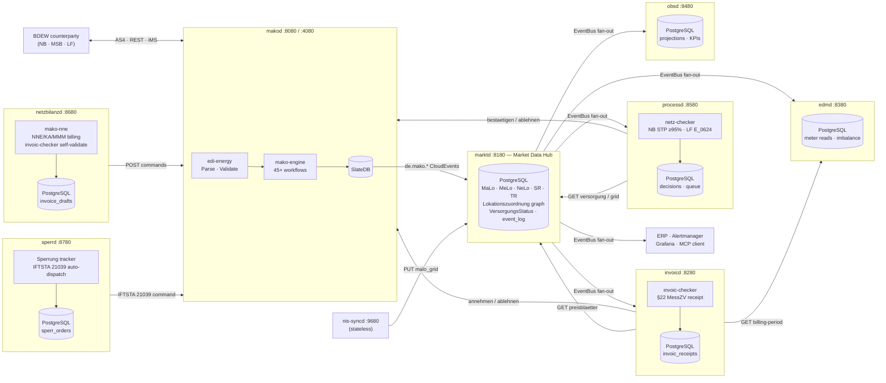

<!-- ── Hero ──────────────────────────────────────────────────────────────── -->
<div class="mako-hero">
  <div class="mako-hero__badge-row">
    <a href="https://github.com/hupe1980/mako/actions/workflows/ci.yml">
      
    </a>
    <a href="https://crates.io/crates/edi-energy">
      
    </a>
    <a href="https://crates.io/crates/mako-engine">
      
    </a>
    
    <a href="https://github.com/hupe1980/mako/blob/main/LICENSE-MIT">
      
    </a>
    
  </div>

  <h1 class="mako-hero__title">mako ⚡</h1>
  <p class="mako-hero__subtitle">
    The only Rust library that covers the full German energy market stack —<br>
    from raw EDIFACT bytes to durable, auditable MaKo process state.
  </p>

  <div class="mako-hero__cta">
    <a href="{{ '/getting-started' | relative_url }}" class="btn btn-primary mako-cta-primary">
      Get started →
    </a>
    <a href="{{ '/reference' | relative_url }}" class="btn mako-cta-secondary">
      API Reference
    </a>
    <a href="https://github.com/hupe1980/mako" class="btn mako-cta-secondary">
      GitHub
    </a>
  </div>

  <div class="mako-hero__warning">
    <strong>⚠ Pre-1.0 — Experimental.</strong>
    APIs may change between patch releases. Not yet recommended for production
    without thorough in-house validation.
  </div>
</div>

<!-- ── KPI strip ─────────────────────────────────────────────────────────── -->
<div class="mako-kpis">
  <div class="mako-kpi">
    <span class="mako-kpi__value">17</span>
    <span class="mako-kpi__label">EDIFACT message types</span>
  </div>
  <div class="mako-kpi">
    <span class="mako-kpi__value">45+</span>
    <span class="mako-kpi__label">event-sourced workflows</span>
  </div>
  <div class="mako-kpi">
    <span class="mako-kpi__value">247</span>
    <span class="mako-kpi__label">Prüfidentifikatoren</span>
  </div>
  <div class="mako-kpi">
    <span class="mako-kpi__value">9</span>
    <span class="mako-kpi__label">production daemons</span>
  </div>
  <div class="mako-kpi">
    <span class="mako-kpi__value">25</span>
    <span class="mako-kpi__label">active BO4E types</span>
  </div>
  <div class="mako-kpi">
    <span class="mako-kpi__value">1.89</span>
    <span class="mako-kpi__label">MSRV stable Rust</span>
  </div>
  <div class="mako-kpi">
    <span class="mako-kpi__value">0</span>
    <span class="mako-kpi__label">unsafe blocks</span>
  </div>
</div>

<!-- ── Six-column feature grid ──────────────────────────────────────────── -->
<div class="mako-features">
  <div class="mako-feature">
    <div class="mako-feature__icon">🔍</div>
    <h3>Parse &amp; Validate</h3>
    <p>
      All 17 EDI@Energy EDIFACT types. Five-layer pipeline: schema → code
      lists → MIG → AHB → semantic rules. Structured <code>EdiEnergyReport</code>
      with per-rule violation details, not raw strings.
    </p>
    <a href="{{ '/parsing' | relative_url }}">Parsing guide →</a>
  </div>

  <div class="mako-feature">
    <div class="mako-feature__icon">⛽</div>
    <h3>DVGW Gas Transport</h3>
    <p>
      8 DVGW EDIFACT message types (ALOCAT, NOMINT, NOMRES, SCHEDL, IMBNOT,
      TRANOT, DELORD, DELRES) for GaBi Gas 2.0 / Kooperationsvereinbarung Gas.
      <code>DvgwPlatform</code> with synthetic PIDs (90001–90062) for routing
      through <code>mako-engine</code>. Independent of the BDEW EDIFACT stack.
    </p>
    <a href="{{ '/dvgw' | relative_url }}">DVGW EDI guide →</a>
  </div>

  <div class="mako-feature">
    <div class="mako-feature__icon">⚡</div>
    <h3>Redispatch 2.0 XML</h3>
    <p>
      All 9 CIM/IEC 62325 document types: parse, validate, and serialize.
      <code>parse_and_validate()</code> enforces XSD constraints and semantic
      cross-field rules. Hard real-time 5-minute activation deadline (UTC)
      enforced by <code>mako-redispatch</code> per BK6-20-060.
    </p>
    <a href="{{ '/redispatch' | relative_url }}">Redispatch guide →</a>
  </div>

  <div class="mako-feature">
    <div class="mako-feature__icon">⚙️</div>
    <h3>Process Runtime</h3>
    <p>
      Event-sourced FSM engine with optimistic concurrency, atomic dual-write
      (events + outbox in one <code>WriteBatch</code>), and APERAK deadline
      enforcement — GPKE 24 h, WiM 5 Werktage, GeLi Gas 10 Werktage.
    </p>
    <a href="{{ '/engine' | relative_url }}">Engine guide →</a>
  </div>

  <div class="mako-feature">
    <div class="mako-feature__icon">🔌</div>
    <h3>Command API &amp; Webhooks</h3>
    <p>
      ERP integration via <code>POST /api/v1/commands</code> (BO4E JSON).
      Outbound events pushed to your ERP over HMAC-SHA256-signed <a href="erp-integration">CloudEvents 1.0 webhooks</a>.
      Idempotency keys prevent double-processing on retries.
    </p>
    <a href="{{ '/erp-integration' | relative_url }}">ERP integration →</a>
  </div>

  <div class="mako-feature">
    <div class="mako-feature__icon">📡</div>
    <h3>AS4 + REST Dual Channel</h3>
    <p>
      AS4/ebMS3 inbound on <code>:4080</code>, HTTP REST on <code>:8080</code>,
      and BDEW API-Webdienste Strom (iMS REST/JSON) on <code>:8090</code>.
      Startup coverage validation panics on missing message adapters.
    </p>
    <a href="{{ '/api-webdienste' | relative_url }}">API-Webdienste →</a>
  </div>

  <div class="mako-feature">
    <div class="mako-feature__icon">📊</div>
    <h3>OpenTelemetry Observability</h3>
    <p>
      Structured traces and metrics exported via OTLP. Every workflow command,
      event append, outbox delivery, and deadline dispatch carries a trace
      context. Plug into Grafana, Jaeger, or any OTLP-compatible backend.
    </p>
    <a href="{{ '/makod' | relative_url }}#observability">Observability →</a>
  </div>

  <div class="mako-feature">
    <div class="mako-feature__icon">📋</div>
    <h3>Typed BO4E Market Data</h3>
    <p>
      All <code>marktd</code> API responses deliver canonical
      <a href="https://www.bo4e.de">BO4E v202607</a> objects — not raw JSONB.
      <code>GET /api/v1/malo/{id}</code> returns a typed <code>Marktlokation</code>;
      <code>GET /api/v1/melo/{id}</code> returns a typed <code>Messlokation</code>;
      <code>GET /api/v1/melos/{id}/zaehler</code> returns <code>Vec&lt;Zaehler&gt;</code>;
      <code>GET /api/v1/zaehler/{id}/zaehlwerke</code> returns <code>Vec&lt;Zaehlwerk&gt;</code>
      (OBIS register access for TOU billing and iMSyS demand management).
      <code>PUT /api/v1/nb-contracts/{id}</code> validates and stores a full BO4E
      <code>Vertrag</code> payload for digital LRV exchange.
      25 active <code>rubo4e::current</code> types — schema validated at every API boundary.
    </p>
    <a href="{{ '/marktd' | relative_url }}">marktd guide →</a>
  </div>

  <div class="mako-feature">
    <div class="mako-feature__icon">🔐</div>
    <h3>Security &amp; Auth</h3>
    <p>
      All HTTP endpoints gated by <a href="https://cedarpolicy.com">Cedar</a>
      attribute-based access control (ABAC). Named API-key principals for
      audit-trail identity. OIDC/JWT authentication from Azure AD, Keycloak,
      Okta, and Kubernetes workload identity — asymmetric algorithms only,
      JWKS cached with background refresh. HMAC tokens unconditionally
      rejected.
    </p>
    <a href="{{ '/makod' | relative_url }}#authorization">Authorization →</a>
  </div>

  <div class="mako-feature">
    <div class="mako-feature__icon">🏭</div>
    <h3>Production Daemons</h3>
    <p>
      Nine independently deployable, Docker-ready services, each with TOML
      configuration, Cedar ABAC, OIDC/JWT auth, OpenTelemetry, and a built-in
      MCP server at <code>/mcp</code>:
      <code>makod</code> — all 45+ workflows behind durable SlateDB; AS4 (`:4080`), REST (`:8080`), iMS (`:8090`).
      <code>marktd</code> — PostgreSQL master data (MaLo/MeLo/NeLo/TR/SR, location graph, preisblaetter,
      VersorgungsStatus, <code>event_log</code> replay), <strong>typed <code>rubo4e::current</code> API responses</strong>
      (Marktlokation, Messlokation, Zaehler, Geraet — schema validated on every PUT),
      NB contracts with full BO4E <code>Vertrag</code> payload (L1 digital LRV exchange),
      Cedar ABAC, EventBus fan-out.
      <code>processd</code> — automated NB Anmeldung STP (≥ 95 %) + LF E_0624 auto-response (45-min LFW24 window)
      + LFN bootstrap (Strom/Gas); role-gated for §7 EnWG separation.
      <code>invoicd</code> — INVOIC settlement (PIDs 31001/31002/31005/31006/31009), §22 MessZV receipts,
      durable at-least-once ERP payment CloudEvents.
      <code>netzbilanzd</code> — NNE/KA/MMM/MSB invoice generation (PIDs 31001/31002/31005/31009), draft workflow
      with <code>invoic-checker</code> self-validation before dispatch (`:8680`).
      <code>sperrd</code> — Sperrung execution tracking; IFTSTA 21039 auto-dispatch on field confirmation;
      prevents permanent protocol violations under GPKE BK6-22-024 (`:8780`).
      <code>edmd</code> — BO4E <code>Energiemenge</code> deliveries API (typed, ERP-consumable), MSCONS
      meter-reading storage, <code>MeterBillingPeriod</code> (RLM Spitzenleistung +
      Gas Brennwert/Zustandszahl via PID 13007), Mehr-/Mindermengen imbalance,
      <code>Lastgang</code> + <code>Zeitreihe</code> time-series export (`:8380`).
      <code>obsd</code> — process projections, BNetzA KPI reports, deadline-risk alerts, §20 EnWG parity monitoring.
      <code>nis-syncd</code> — stateless NIS/GIS grid topology import; pushes <code>malo_grid</code> to <code>marktd</code>;
      drift-event CloudEvents; lifts NB STP ~80 % → ≥ 95 % (`:9680`).
    </p>
    <a href="{{ '/makod' | relative_url }}">makod guide →</a> ·
    <a href="{{ '/marktd' | relative_url }}">marktd guide →</a> ·
    <a href="{{ '/processd' | relative_url }}">processd guide →</a> ·
    <a href="{{ '/invoicd' | relative_url }}">invoicd guide →</a> ·
    <a href="{{ '/netzbilanzd' | relative_url }}">netzbilanzd guide →</a> ·
    <a href="{{ '/sperrd' | relative_url }}">sperrd guide →</a> ·
    <a href="{{ '/edmd' | relative_url }}">edmd guide →</a> ·
    <a href="{{ '/obsd' | relative_url }}">obsd guide →</a> ·
    <a href="{{ '/nis-syncd' | relative_url }}">nis-syncd guide →</a>
  </div>

  <div class="mako-feature">
    <div class="mako-feature__icon">🤖</div>
    <h3>LLM / MCP Integration</h3>
    <p>
      Every daemon ships a built-in <a href="https://modelcontextprotocol.io">MCP server</a>
      at <code>/mcp</code> (MCP Streamable HTTP, 2025-11-25). Tools, resources, and guided
      prompts expose EDIFACT commands, regulatory deadlines, INVOIC plausibility
      outcomes, KPI data, and process projections to Claude Desktop, VS Code
      Copilot, and any MCP-capable LLM client. No extra configuration required.
    </p>
    <a href="{{ '/makod' | relative_url }}#mcp-server">MCP guide →</a>
  </div>

  <div class="mako-feature">
    <div class="mako-feature__icon">🧾</div>
    <h3>Automated Billing — LF &amp; NB</h3>
    <p>
      <strong>LF side (<code>invoicd</code>):</strong>
      Runs the <code>invoic-checker</code> plausibility pipeline on every inbound
      INVOIC (PIDs 31001/31002/31005/31006/31009) and issues the settlement command
      automatically — no ERP round-trip. Five checks: period validity, position arithmetic,
      document total, tariff match, tariff found.
      <code>POST /api/v1/selbstausstellen/{malo_id}</code> triggers outbound PID 31006 (§20
      MessZV): fetches <code>MeterBillingPeriod</code> from <code>edmd</code>, extracts tariffs
      from <code>marktd</code>, and calls the shared <code>mako-nne</code> engine to produce
      the complete BO4E <code>Rechnung</code>.
      Every receipt is written to PostgreSQL (§22 MessZV 3-year retention). A background worker
      emits <code>de.invoic.payment.overdue</code> CloudEvents every 6 h for unpaid invoices.
    </p>
    <p>
      <strong>NB side (<code>netzbilanzd</code>):</strong>
      Generates INVOIC 31001/31002/31005/31009 using <code>mako-nne</code>
      (zero floating-point money), self-validates via <code>invoic-checker</code>, stores
      drafts in PostgreSQL, and dispatches via <code>makod</code> after operator review.
      Pre-dispatch re-validation blocks any invoice that would reach <code>Dispute</code>
      outcome at the counterparty.
    </p>
    <a href="{{ '/invoicd' | relative_url }}">invoicd guide →</a> ·
    <a href="{{ '/netzbilanzd' | relative_url }}">netzbilanzd guide →</a>
  </div>
</div>

<div markdown="1">

---

## Quick Start
{: .mt-8 }

**EDIFACT parsing** — parse and validate a UTILMD message in three lines:

```toml
[dependencies]
edi-energy = { version = "0.8", features = ["utilmd", "mscons", "aperak"] }
```

```rust
use edi_energy::{parse, EdiEnergyMessage};

let msg = parse(std::fs::read("lieferbeginn.edi")?.as_ref())?;
msg.validate()?.into_error_result()?;  // returns Err if any AHB rule fires
println!("PID {}", msg.detect_pruefidentifikator()?.as_u32()); // → 55001
```

**DVGW gas transport** — parse a NOMINT nomination:

```toml
[dependencies]
dvgw-edi = "0.8"
```

```rust
use dvgw_edi::{DvgwPlatform, AnyDvgwMessage};

let msg = DvgwPlatform::default().parse(edi_bytes)?;
if let AnyDvgwMessage::Nomint(n) = &msg {
    println!("nomination ref: {:?}", n.nomination_ref);
    println!("routing PID:    {:?}", msg.detect_pid(Some("Z01"))); // → Some(90011)
}
```

**Redispatch 2.0 XML** — parse and validate an `ActivationDocument`:

```toml
[dependencies]
redispatch-xml = "0.8"
```

```rust
use redispatch_xml::{parse_and_validate, Document};

let doc = parse_and_validate(xml_bytes)?;
println!("mRID:   {}", doc.mrid());
println!("sender: {}", doc.sender_id()); // EIC code of TSO/RSO
```

**Full process runtime** — run a GPKE supplier-change workflow:

```toml
[dependencies]
mako-engine = { version = "0.8", features = ["testing"] }
mako-gpke   = "0.8"
```

```rust
use mako_engine::{builder::EngineBuilder, event_store::InMemoryEventStore, ids::TenantId, version::WorkflowId};
use mako_gpke::wechselprozesse::{GpkeSupplierChangeWorkflow, SupplierChangeCommand};

let ctx = EngineBuilder::new()
    .with_event_store(InMemoryEventStore::new())
    .build();
let process = ctx.spawn::<GpkeSupplierChangeWorkflow>(TenantId::new(), WorkflowId::new("gpke-supplier-change", "FV2025-10-01"));
let envelopes = process.execute_and_enqueue(SupplierChangeCommand::ReceiveUtilmd { .. }).await?;
// Events and APERAK outbox entry written atomically — no lost messages on crash.
```

→ Full walkthrough in the [Getting Started guide]({{ '/getting-started' | relative_url }}).

---

## System Overview
{: .mt-8 }



---

## Workspace at a Glance
{: .mt-8 }

| Crate / service | Purpose |
|---|---|
| [`edi-energy`](https://crates.io/crates/edi-energy) | Parse · validate · build all 17 EDI@Energy EDIFACT types |
| [`mako-engine`](https://crates.io/crates/mako-engine) | Event-sourced runtime: `Workflow`, `Process`, `EventStore`, outbox, deadlines, OpenTelemetry |
| `mako-gpke` | GPKE — 16 workflows covering UTILMD Strom (55001–55018, 55555, 55600–55609), INVOIC (31001/31002/31005/31006), ORDERS Sperrung/Datenabruf/Allokationsliste, MSCONS Messwerte, UTILTS, Konfiguration, PARTIN Strom (37000–37006) |
| `mako-wim` | WiM Strom — 10 workflows: MSB-Wechsel (55039/55042/55051/55168), Geräteübernahme ORDERS, Stammdaten, Preisanfrage/Preisliste, INVOIC 31009, INSRPT Strom, API-Webdienste Steuerungsauftrag |
| `mako-wim-gas` | WiM Gas — MSB-Wechsel Gas (44039–44053, 44168–44170), Stornierung (44022–44024, Msb/Nmsb role), INVOIC 31003/31004, INSRPT Gas (23005/23009) |
| `mako-geli-gas` | GeLi Gas 3.0 (BK7-24-01-009) — 9 workflows: UTILMD G supplier-switch (44001–44021), Stornierung LF/GNB (44022–44024 role-conditional), Sperrung LF+GNB, INVOIC 31011 (AWH), MSCONS Gas (13002/13007–13009), Datenabruf, PARTIN Gas (37008–37014) |
| `mako-mabis` | MABIS — PID 13003 Bilanzkreisabrechnung Strom (BKV↔ÜNB) + PIDs 55065/55069/55070 Clearingliste |
| `mako-redispatch` | Redispatch 2.0 — 8 XML-document-driven workflows (Activation, Stammdaten, NetworkConstraint, …); IFTSTA PIDs 21037/21038 |
| `dvgw-edi` | DVGW EDIFACT gas transport — ALOCAT, NOMINT, NOMRES, SCHEDL, IMBNOT, TRANOT, DELORD, DELRES (GaBi Gas 2.0 · BK7-14-020) |
| `redispatch-xml` | Redispatch 2.0 XML/XSD — all 9 document types |
| `mako-gabi-gas` | GaBi Gas — 8 workflows: INVOIC 31007/31008/31010, MSCONS 13013 Allokationsliste MMMA (ORDERS 17110/ORDRSP 19110), ALOCAT (90001–90003), NOMINT/NOMRES (90011–90022), SCHEDL, IMBNOT, TRANOT, DELORD/DELRES |
| `mako-nbw` | Netzbetreiberwechsel — PARTIN bulk DSO handover *(placeholder)* |
| `energy-api` | BDEW API-Webdienste Strom — REST/WebSocket client + Axum server |
| `mako-markt` | Master data library — `MaloId`, `MeloId`, `MarktpartnerId`, repository traits (including `LokationszuordnungRepository`, `TechnischeRessourceRepository`), CloudEvents, testing doubles |
| `mako-nne` | Pure NNE/KA/MMM invoice generation — `calculate_nne_invoice`, `calculate_mmm_invoice`; zero floating-point money (`EuroAmount`); self-validates via `invoic-checker` |
| `mako-edm` | Energy data library — `MeterDataReceipt`, `TimeSeriesRepository`, `ImbalanceReport`, MSCONS PID set |
| `mako-obs` | Observability library — `ProcessProjection`, `KpiReport`, `DeadlineRisk`, `ProcessProjectionRepository` |
| `invoic-checker` | INVOIC plausibility library — period, arithmetic, total, tariff-match, and tariff-found checks |
| `netz-checker` | NB Anmeldung validation library — 6 deterministic checks, ERC codes A02/A05/A06/A97/A99 |
| `mako-service` | Shared service infrastructure — `ServiceBuilder`, `load_config`, health routes, HMAC-SHA256 webhook verification |
| `makod` | Protocol daemon — all 45+ workflows, three ports (`:8080`/`:4080`/`:8090`), SlateDB, OTLP, Cedar ABAC, OIDC/JWT |
| `marktd` | Market Data Hub — MaLo/MeLo/NeLo/TR/SR, Lokationszuordnung graph, preisblaetter, VersorgungsStatus (history + `?at=`), `event_log` replay, Cedar ABAC, `:8180` |
| `invoicd` | INVOIC plausibility-check daemon (LF role) — auto-settles or disputes GPKE billing; §22 MessZV receipts, `:8280` |
| `netzbilanzd` | NNE/KA/MMM billing daemon (NB role) — generates and dispatches INVOIC 31001/31002/31005; `invoice_drafts` lifecycle (`draft → dispatched/rejected`), `:8680` |
| `sperrd` | Sperrung execution tracking daemon (NB role) — `sperr_orders` lifecycle (`pending → executed/failed`); auto-dispatches IFTSTA 21039 on field confirmation, `:8780` |
| `edmd` | Energy Data Management daemon — MSCONS meter readings, time-series API, Mehr-/Mindermengen imbalance; PostgreSQL, `:8380` |
| `obsd` | Business-process observability daemon — process projections, BNetzA KPI reports, overdue alerts; PostgreSQL, `:8480` |

---

## Regulatory Compliance
{: .mt-8 }

mako tracks every BNetzA ruling that governs German energy market communication
and ships AHB/MIG profiles for every active format version:

| Ruling | Scope | Effective |
|---|---|---|
| BK6-24-174 | GPKE Teil 1–3 + WiM + MABIS | 06.06.2025 |
| BK6-22-024 | GPKE Teil 4 — Stammdatenprozesse | 06.06.2025 |
| BK7-24-01-009 | GeLi Gas 3.0 — UTILMD G supplier-switch | 01.10.2025 |
| BDEW FV2026-10-01 | All message types — annual release | 01.10.2026 |

Both `FV2025-10-01` and `FV2026-10-01` coexist in the same engine instance
simultaneously. A process started under the old format version continues to
completion under the same rules even after the annual cutover.

→ [BNetzA regulatory reference]({{ '/bnetza' | relative_url }}) · [PID reference]({{ '/pid-reference' | relative_url }}) · [Release lifecycle]({{ '/release-lifecycle' | relative_url }})

---

## Why mako?
{: .mt-8 }

| | mako | Hand-rolled EDIFACT | Generic workflow engine |
|---|:---:|:---:|:---:|
| AHB/MIG validation built in | ✅ | ❌ | ❌ |
| APERAK deadline enforcement | ✅ | ❌ | ⚠ manual |
| Annual format-version migration | ✅ codegen | ❌ | ❌ |
| Atomic dual-write (events + outbox) | ✅ | ❌ | ⚠ 2-phase |
| AS4/ebMS3 transport | ✅ | ❌ | ❌ |
| API-Webdienste Strom (iMS) | ✅ | ❌ | ❌ |
| Cedar ABAC authorization | ✅ | ❌ | ⚠ bolt-on |
| OIDC/JWT + API-key auth | ✅ | ❌ | ⚠ varies |
| CloudEvents 1.0 ERP webhooks | ✅ | ❌ | ❌ |
| OpenTelemetry traces + metrics | ✅ | ❌ | ⚠ varies |
| LLM / MCP integration (tools + prompts) | ✅ | ❌ | ❌ |
| 100% safe Rust, no OpenSSL for TLS | ✅ | ❌ | ❌ |

</div>
