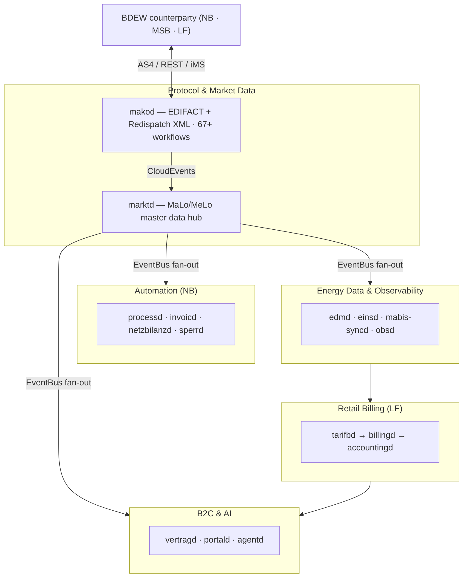
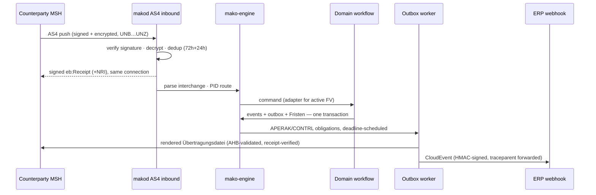

<!-- ── Hero ─────────────────────────────────────────────────────────────────── -->
<div class="mako-hero">
  <div class="mako-hero__badge-row">
    <a href="https://github.com/hupe1980/mako/actions/workflows/ci.yml">
      
    </a>
    <a href="https://crates.io/crates/edi-energy">
      
    </a>
    <a href="https://crates.io/crates/mako-engine">
      
    </a>
    
    <a href="https://github.com/hupe1980/mako/blob/main/LICENSE-MIT">
      
    </a>
    
    
    
  </div>

  <h1 class="mako-hero__title">mako ⚡</h1>

  <p class="mako-hero__subtitle">
    German energy market communication —<br>from EDIFACT bytes to production microservices
  </p>

  <p class="mako-hero__tagline">
    A Rust workspace covering the full BDEW MaKo stack: EDIFACT parsing, AHB/MIG validation,
    event-sourced process runtime, AS4 transport, automated regulatory deadline enforcement,
    energy billing, EEG settlement, and LLM-powered AI orchestration.
    16 independently deployable services. Zero hardcoded EDIFACT parsers required.
  </p>

  <div class="mako-hero__cta">
    <a href="{{ '/getting-started' | relative_url }}" class="mako-btn-primary">
      Get started →
    </a>
    <a href="{{ '/architecture' | relative_url }}" class="mako-btn-secondary">
      Architecture
    </a>
    <a href="https://github.com/hupe1980/mako" class="mako-btn-secondary">
      GitHub ↗
    </a>
  </div>

  <div class="mako-hero__warning">
    <strong>⚠ Pre-1.0 — Experimental.</strong>
    APIs may change between releases. Validate thoroughly before production deployment.
  </div>
</div>

<!-- ── KPI strip ─────────────────────────────────────────────────────────── -->
<div class="mako-kpis">
  <div class="mako-kpi">
    <span class="mako-kpi__value">346</span>
    <span class="mako-kpi__label">Prüfidentifikatoren</span>
  </div>
  <div class="mako-kpi">
    <span class="mako-kpi__value">17</span>
    <span class="mako-kpi__label">EDIFACT message types</span>
  </div>
  <div class="mako-kpi">
    <span class="mako-kpi__value">67+</span>
    <span class="mako-kpi__label">event-sourced workflows</span>
  </div>
  <div class="mako-kpi">
    <span class="mako-kpi__value">16</span>
    <span class="mako-kpi__label">production services</span>
  </div>
  <div class="mako-kpi">
    <span class="mako-kpi__value">150+</span>
    <span class="mako-kpi__label">MCP tools (AI-ready)</span>
  </div>
  <div class="mako-kpi">
    <span class="mako-kpi__value">1</span>
    <span class="mako-kpi__label">audited unsafe block</span>
  </div>
</div>

<div markdown="1">

---

## What is mako?

mako is the **open-source market-operations platform for the German energy market** —
every regulated process modeled as a correct, auditable, event-sourced workflow, for every
market role (NB, LF, MSB, ESA). It implements **BDEW MaKo / EDI@Energy** end-to-end and is
the only platform in this market whose source you can read, verify, and extend.

It solves two hard problems at once:

- **Protocol correctness** — All 346 Prüfidentifikatoren across 17 EDIFACT message types are validated at AHB/MIG layer, not just schema layer. APERAK 45-minute deadline enforcement is built into the event-sourced runtime, not bolted on.
- **Operational scale** — 16 independently deployable microservices cover the full lifecycle: supplier-switch processes, NNE billing, EEG settlement, B2C/B2B contract management with multi-user portal access, customer account ledger, and AI-powered automation.

Rust provides zero-cost abstractions, `async`/`await` concurrency, and the type safety needed to represent complex regulatory invariants at compile time — not runtime.

---

## Choose your path

</div>

<div class="mako-service-grid">
  <a href="{{ '/getting-started' | relative_url }}" class="mako-service-card">
    <span class="mako-service-card__name">🛠 Operator</span>
    <span class="mako-service-card__desc">Run the platform: local dev stack, Docker demo, per-service operator guides with every port, flag, and worker.</span>
    <span class="mako-service-card__port">Getting Started · Services</span>
  </a>
  <a href="{{ '/parsing' | relative_url }}" class="mako-service-card">
    <span class="mako-service-card__name">🦀 Developer</span>
    <span class="mako-service-card__desc">Build on the libraries: EDIFACT parsing &amp; validation, the event-sourced engine, builders, and the service SDK.</span>
    <span class="mako-service-card__port">Parsing · Engine · Libraries</span>
  </a>
  <a href="{{ '/regulatory' | relative_url }}" class="mako-service-card">
    <span class="mako-service-card__name">⚖️ Auditor / Compliance</span>
    <span class="mako-service-card__desc">Trace every legal obligation to code: BNetzA rulings, EnWG/MsbG/EEG coverage, PID reference, release compliance.</span>
    <span class="mako-service-card__port">Regulatory · BNetzA · Releases</span>
  </a>
</div>

<div markdown="1">

---

## Features

</div>

<!-- ── Feature grid ─────────────────────────────────────────────────────── -->
<div class="mako-features">
  <div class="mako-feature">
    <div class="mako-feature__icon">🔍</div>
    <h3>Parse &amp; Validate EDIFACT</h3>
    <p>
      All 17 EDI@Energy message types with a 5-layer validation pipeline:
      schema → code lists → MIG structural → AHB Prüfidentifikator-specific → semantic cross-field rules.
      Returns a structured <code>EdiEnergyReport</code> with per-rule violation details — not raw parse errors.
    </p>
    <a href="{{ '/parsing' | relative_url }}">Parsing guide →</a>
  </div>

  <div class="mako-feature">
    <div class="mako-feature__icon">⚙️</div>
    <h3>Event-Sourced Process Runtime</h3>
    <p>
      67+ durable, replayable MaKo workflows built on <code>mako-engine</code> —
      GPKE &amp; GeLi&nbsp;Gas supplier switch, WiM Messstellenbetrieb (incl. the
      <strong>WiM&nbsp;Teil&nbsp;2 ESA Wertebestellung</strong>, §34 MsbG: one correlated
      REQOTE→QUOTES→ORDERS→ORDRSP→ORDCHG subscription lifecycle),
      MaBiS, and Redispatch&nbsp;2.0.
      Atomic dual-write (events + APERAK outbox in one <code>WriteBatch</code>) guarantees
      no lost messages on crash. FV2025-10-01 and FV2026-10-01 coexist simultaneously.
    </p>
    <a href="{{ '/engine' | relative_url }}">Engine guide →</a>
  </div>

  <div class="mako-feature">
    <div class="mako-feature__icon">⚖️</div>
    <h3>Automated Regulatory Compliance</h3>
    <p>
      APERAK 45-minute deadline enforced automatically in <code>processd</code>.
      Cedar ABAC generates per-decision audit records proving §20 EnWG non-discrimination.
      BNetzA KPI reports are a SQL query — not a log search.
    </p>
    <a href="{{ '/bnetza' | relative_url }}">BNetzA reference →</a>
  </div>

  <div class="mako-feature">
    <div class="mako-feature__icon">🌱</div>
    <h3>EEG/KWKG Settlement &amp; Gutschrift</h3>
    <p>
      <strong>10 settlement schemes</strong> from §21 FeedInTariff to §50a/50b FlexibilitätsPrämien,
      including Direktvermarktung MarketPremium, KWKG Zuschlag, and Post-EEG Spot.
      Version-aware <strong>§51 Negativpreisregel</strong> (EEG 2017/2021/2023 + Bestandsschutz),
      §52 Pflichtzahlungen (cumulative from violation start), §100 auto-override, §36h Korrekturfaktor.
      Every billable settlement issues the <strong>§14 UStG Gutschrift</strong>
      (Gutschriftverfahren — the NB issues the document) as a BO4E <code>Rechnung</code> with the
      per-rate USt breakdown, VAT from the operator's declared <code>ust_status</code>
      (Regelbesteuerung 19 % category <code>S</code> / §19 Kleinunternehmer 0 % category
      <code>E</code>). Pure <code>eeg-billing</code> crate, zero I/O.
    </p>
    <a href="{{ '/einsd' | relative_url }}">einsd guide →</a>
  </div>

  <div class="mako-feature">
    <div class="mako-feature__icon">🧾</div>
    <h3>Energy Billing Engine</h3>
    <p>
      A typed <code>Product</code> enum across <strong>13 categories</strong> — Strom (SLP/HT/NT/RLM),
      Gas, Wärme, Wasser, Solar, EEG/Einspeisung, §14a Wärmepumpe/Wallbox, HEMS, E-Mobility and §42c Sharing —
      each with its own struct rather than one god-struct of optional fields.
      Dynamic §41a EPEX tariffs (with floor/cap), the §41a iMSys guard, commodity-aware VAT history
      and historic levy tables are built in.
      Invoices map to a real <strong>EN 16931 semantic model</strong> (<code>en16931</code> +
      <code>en16931-formats</code>) that renders <strong>XRechnung 3.0 CII and PEPPOL UBL</strong> with a
      correct <strong>per-line VAT</strong> that reconciles to the BG-23 breakdown — B2G submissions are
      validated against the full XRechnung profile before dispatch.
      In <code>billingd</code> a deterministic <strong>risk gate</strong> HOLDs anomalous invoices for
      operator release, and <strong>§40b EnWG billing runs</strong> drive monthly/quarterly cycles.
      Pure <code>energy-billing</code> crate — zero I/O, integer-cent money.
    </p>
    <a href="{{ '/billingd' | relative_url }}">billingd guide →</a>
  </div>

  <div class="mako-feature">
    <div class="mako-feature__icon">📊</div>
    <h3>Grid Settlement Engine</h3>
    <p>
      <code>grid-billing</code> calculates NNE, KA, MMM, MSB, AWH Sperrprozesse and §13a
      Redispatch invoices — role-neutral, integer-cent money, no BO4E dependency.
      Every position carries a <strong><code>CalculationTrace</code></strong> with a plain-language
      explanation, the legal reference (StromNEV §21, GasNEV §14, KAV §2, §14a EnWG) and its
      tariff source, so a Stornorechnung or a correction pair reproduces exactly why each figure exists.
    </p>
    <a href="{{ '/netzbilanzd' | relative_url }}">netzbilanzd guide →</a>
  </div>

  <div class="mako-feature">
    <div class="mako-feature__icon">🔌</div>
    <h3>Redispatch 2.0 Congestion Management</h3>
    <p>
      Full §§ 13/13a/14 EnWG stack per BK6-20-059/-060/-061:
      <code>redispatch-xml</code> parses all <strong>9 CIM/IEC 62325 XML document types</strong>,
      <code>mako-redispatch</code> runs 8 event-sourced workflows, and makod's AS4 ingest
      dispatches both legs — EDIFACT IFTSTA/MSCONS/ORDERS and XML — with the
      <strong>5-minute activation response window</strong> and 6h/24h ACK windows registered
      atomically at spawn. Aufforderungs-/Duldungsfall resolved behaviorally;
      §13a angemessene Vergütung computed by <code>grid-billing</code> with a per-component trace.
    </p>
    <a href="{{ '/redispatch' | relative_url }}">Redispatch 2.0 guide →</a>
  </div>

  <div class="mako-feature">
    <div class="mako-feature__icon">📡</div>
    <h3>Smart Meter, SMGW &amp; Energy Data</h3>
    <p>
      <code>edmd</code> ingests 15-min iMSys/SMGW data by direct JSON push — no MSCONS
      round-trip — with SIMD-vectorised Hampel quality scoring (grade F blocks billing),
      §14a Fernsteuerbarkeit compliance sweeps over a BSI TR-03109 SMGW registry, and §42b
      GGV community-solar metering.
    </p>
    <p>
      The <code>meterstore</code> engine — a standalone crates.io crate edmd links in-process —
      keeps a recent PostgreSQL window and a settled
      Apache Iceberg V2 history behind one tiering watermark — reads are version-resolved and
      <code>as_of</code> reproduces any past settlement. A built-in read-only Iceberg REST catalog
      lets DuckDB, Spark and Trino <code>ATTACH</code> and read the cold tier directly, no ETL, and
      Arrow IPC streams bulk reads. GDPR Art. 17 is pseudonymisation: erasing the subject mapping
      leaves the append-only history unattributable in both tiers.
    </p>
    <a href="{{ '/edmd' | relative_url }}">edmd guide →</a>
  </div>

  <div class="mako-feature">
    <div class="mako-feature__icon">🤝</div>
    <h3>Contract &amp; Customer Management</h3>
    <p>
      <code>vertragd</code> manages B2C and B2B customers — role-based multi-user portal access,
      B2B Rahmenverträge (portfolio pricing, Sammelrechnung, cascade Kündigung), and
      per-site Versorgungsverträge, all behind OIDC/JWT write endpoints. It is the sole
      OIDC→MaLo authorization gateway for <code>portald</code>.
    </p>
    <p>
      Regulatory guards are built in: a §41 EnWG Preisgarantie lock with an immutable override
      log, Kündigung-Widerruf, automatic 42-day advance notices (§5 StromGVV/GasGVV, §41 EnWG),
      and full GDPR Art. 15/17/20 (PII export + irreversible pseudonymization).
    </p>
    <a href="{{ '/vertragd' | relative_url }}">vertragd guide →</a>
  </div>

  <div class="mako-feature">
    <div class="mako-feature__icon">🛠️</div>
    <h3>Service SDK</h3>
    <p>
      <code>mako-service</code> is the shared infrastructure all 16 daemons build on.
      A daemon's <code>main</code> is <strong>one line</strong> —
      <code>mako_service::run::&lt;D&gt;()</code> owns the whole lifecycle: structured tracing,
      the tuned connection pool (with per-service <code>application_name</code>), migrations,
      a real <code>/health/ready</code> that pings the database, infra routes, SIGINT/SIGTERM
      graceful drain, and a <code>--check</code> container health probe.
    </p>
    <p>
      Event-emitting services get a <strong>transactional outbox</strong>: each outbound
      CloudEvent is written to <code>event_outbox</code> <em>in the same transaction</em> as the
      business change and drained by a background worker with retry and a dead-letter queue —
      persist-before-dispatch, so a crash never drops an event. One canonical CloudEvent builder
      and HMAC signer (<code>sha256=</code>), a typed <code>ApiError</code> for
      RFC-problem HTTP responses, OIDC, MCP auth, Cedar ABAC, and OpenTelemetry round it out.
    </p>
    <a href="{{ '/services' | relative_url }}">Service SDK guide →</a>
  </div>

  <div class="mako-feature">
    <div class="mako-feature__icon">🤖</div>
    <h3>AI / LLM Integration</h3>
    <p>
      Every service exposes tools and prompts at <code>/mcp</code> (Streamable HTTP 2025-11-25).
    `agentd` ships <strong>28 built-in specialists compiled into the container image</strong>
      — operators activate them via <code>[bundled_agents]</code> without copying system prompts.
      Supports <strong>sequential / parallel / race dispatch</strong> modes;
      A2A agent cards at <code>/.well-known/agents/{name}</code>;
      OpenAI / Anthropic / AWS Bedrock SigV4; LanceDB RAG (tenant-isolated, cosine distance score filtering).
      Specialists cover billing anomaly detection, §41a/§42 compliance guard,
      annual settlement orchestration, §20 EnWG parity, SMGW BSI TR-03109 diagnostics,
      VPP dispatch settlement audit (RED III Art. 17), MaBiS Summenzeitreihe monitoring,
      GaBi Gas 2.1 ALOCAT/IMBNOT balance monitoring, EEG batch settlement + §52 sweep, and more.
      OIDC auth on <code>POST /api/v1/run</code>; inbound HMAC verification; max_sessions semaphore;
      per-session wall-clock timeout; dead-letter queue with exponential-backoff retry worker.
    </p>
    <a href="{{ '/agentd' | relative_url }}">agentd guide →</a>
  </div>
</div>

<div markdown="1">

---

## Architecture

The system organizes 16 independently deployable services across five functional layers,
connected by CloudEvents 1.0 webhooks and a shared `mako-service` infrastructure SDK.

</div>


```mermaid
graph TB
    BDEW["BDEW counterparty (NB · MSB · LF)"]

    subgraph core ["Protocol & Market Data"]
        makod["makod — EDIFACT + Redispatch XML · 67+ workflows"]
        marktd["marktd — MaLo/MeLo master data hub"]
    end

    subgraph auto ["Automation (NB)"]
        nbrole["processd · invoicd · netzbilanzd · sperrd"]
    end

    subgraph data ["Energy Data & Observability"]
        edm["edmd · einsd · mabis-syncd · obsd"]
    end

    subgraph retail ["Retail Billing (LF)"]
        lfrole["tarifbd → billingd → accountingd"]
    end

    subgraph b2c ["B2C & AI"]
        ai["vertragd · portald · agentd"]
    end

    BDEW <-->|"AS4 / REST / iMS"| makod
    makod -->|CloudEvents| marktd
    marktd -->|"EventBus fan-out"| auto & data & b2c
    data --> retail
    retail --> b2c
```

<div markdown="1">

Every arrow is a CloudEvents 1.0 webhook (HMAC-signed) or typed REST call —
no shared database between services.
→ **[Full architecture diagram with all 16 services, ports, and event flows]({{ '/architecture' | relative_url }})**

</div>

<div markdown="1">

---

## Quick Start

**Library usage** — add to `Cargo.toml`:

```toml
[dependencies]
edi-energy  = { version = "0.13", features = ["utilmd", "mscons", "aperak"] }
mako-engine = { version = "0.13", features = ["testing"] }
mako-gpke   = "0.13"
```

**Parse and validate a UTILMD Lieferbeginn:**

```rust
use edi_energy::{parse, EdiEnergyMessage};

let msg = parse(std::fs::read("lieferbeginn.edi")?.as_ref())?;
msg.validate()?.into_error_result()?;  // returns Err if any AHB rule fires
let pid = msg.detect_pruefidentifikator()?.as_u32();  // → 55001
println!("PID {pid}: GPKE Lieferbeginn Strom");
```

**Local development** — run services directly, infra in Docker (`cargo-watch` required):

```bash
just infra-up            # start postgres, all 14 databases pre-created

just dev marktd          # hot-reload — cargo watch -x "run -p marktd"
just dev processd        # separate terminal per service
just dev makod
```

**Full demo stack:**

```bash
git clone https://github.com/hupe1980/mako
cd mako
docker buildx bake makod marktd processd
cd demos/nb-stp
docker compose up -d
MARKTD_URL=http://localhost:8180 WEBHOOK_URL=http://localhost:8000 bash smoke.sh
```

→ Full walkthrough: [Getting Started guide]({{ '/getting-started' | relative_url }})

---

## Services

mako consists of 16 independently deployable services. 13 of them ship a built-in MCP server at `/mcp` for LLM tool integration (agentd is an MCP *client* that orchestrates the others; makod routes protocol traffic and mabis-syncd is a pure batch worker).

</div>

<div class="mako-group-label">Protocol &amp; Market Data</div>
<div class="mako-service-grid">
  <a href="{{ '/makod' | relative_url }}" class="mako-service-card">
    <span class="mako-service-card__name">makod</span>
    <span class="mako-service-card__port">:8080 · :4080 · :8090</span>
    <span class="mako-service-card__desc">67+ GPKE/WiM/GeLi Gas/MaBiS/GaBi Gas/Redispatch workflows. AS4 sign+encrypt (asx-rs v0.11, BrainpoolP256r1) carrying EDIFACT + Redispatch XML. REST, iMS. SlateDB event store. 12 AS4 security tests.</span>
  </a>
  <a href="{{ '/marktd' | relative_url }}" class="mako-service-card">
    <span class="mako-service-card__name">marktd</span>
    <span class="mako-service-card__port">:8180</span>
    <span class="mako-service-card__desc">Market Data Hub — MaLo/MeLo/contracts, typed BO4E responses, konfigurationsprodukte, MMMA monthly import, EventBus fan-out.</span>
  </a>
  <a href="{{ '/processd' | relative_url }}" class="mako-service-card">
    <span class="mako-service-card__name">processd</span>
    <span class="mako-service-card__port">:8580</span>
    <span class="mako-service-card__desc">Anmeldung STP ≥95%. LF E_0624 45-min auto-response. MSB REQOTE auto-response. §14a Steuerungsauftrag produktcode check.</span>
  </a>
</div>

<div class="mako-group-label">Invoice &amp; Billing (NB)</div>
<div class="mako-service-grid">
  <a href="{{ '/invoicd' | relative_url }}" class="mako-service-card">
    <span class="mako-service-card__name">invoicd</span>
    <span class="mako-service-card__port">:8280</span>
    <span class="mako-service-card__desc">INVOIC 6-check plausibility pipeline. Auto-settle/dispute. § 147 AO / GoBD PostgreSQL receipts.</span>
  </a>
  <a href="{{ '/netzbilanzd' | relative_url }}" class="mako-service-card">
    <span class="mako-service-card__name">netzbilanzd</span>
    <span class="mako-service-card__port">:8680</span>
    <span class="mako-service-card__desc">NNE/KA/MMM/MSB/AWH billing (INVOIC 31001/31002/31005/31009/31011). §14a Modul 2 ToU. §42a GGV. REMADV lifecycle. Redispatch 2.0 Kostenblatt. 13-tool MCP.</span>
  </a>
  <a href="{{ '/sperrd' | relative_url }}" class="mako-service-card">
    <span class="mako-service-card__name">sperrd</span>
    <span class="mako-service-card__port">:8780</span>
    <span class="mako-service-card__desc">Sperrung execution tracking. Auto-dispatches IFTSTA 21039 on field confirmation.</span>
  </a>
</div>

<div class="mako-group-label">Energy Data &amp; EEG</div>
<div class="mako-service-grid">
  <a href="{{ '/edmd' | relative_url }}" class="mako-service-card">
    <span class="mako-service-card__name">edmd</span>
    <span class="mako-service-card__port">:8380</span>
    <span class="mako-service-card__desc">MSCONS meter readings (PIDs 13005–13027). iMSys direct push (§41a). Hampel quality scoring (A/B/C/F, AVX2/NEON). Virtual meters (§42b GGV Solarpaket I). § 60 Abs. 2 MsbG forecasting &amp; substitution. Ablesesteuerung. `meterstore` hot/cold tiering (PostgreSQL + Apache Iceberg, version-resolved, `as_of` snapshots). Cross-tier OLAP + JSON/Arrow-IPC export. Read-only Iceberg REST catalog (DuckDB/Spark/Trino attach). GDPR Art. 17 pseudonymisation. Tenant-scoped.</span>
  </a>
  <a href="{{ '/mabis-syncd' | relative_url }}" class="mako-service-card">
    <span class="mako-service-card__name">mabis-syncd</span>
    <span class="mako-service-card__port">:8880</span>
    <span class="mako-service-card__desc">MaBiS synchronisation — aggregates quarter-hourly Lastgang per Bilanzierungsgebiet and files Summenzeitreihen with the BIKO as MSCONS 13003. Submits on the 10. Werktag; tracks the BIKO-assigned Datenstatus and open Korrekturbedarf.</span>
  </a>
  <a href="{{ '/einsd' | relative_url }}" class="mako-service-card">
    <span class="mako-service-card__name">einsd</span>
    <span class="mako-service-card__port">:9180</span>
    <span class="mako-service-card__desc">Einspeiser registry and EEG/KWKG settlement. 10 settlement schemes with the version-aware §51 Negativpreisregel, §52 Pflichtzahlungen, §36h Korrekturfaktor and §22 Repowering. Every billable settlement issues the <strong>§14 UStG Gutschrift</strong> as a BO4E <code>Rechnung</code> with the per-rate USt breakdown, and § 147 AO / GoBD correction receipts keep the audit chain. 18-tool MCP server.</span>
  </a>
  <a href="{{ '/obsd' | relative_url }}" class="mako-service-card">
    <span class="mako-service-card__name">obsd</span>
    <span class="mako-service-card__port">:8480</span>
    <span class="mako-service-card__desc">Process projections, BNetzA KPI reports, §20 EnWG parity monitoring. Alertmanager bridge.</span>
  </a>
</div>

<div class="mako-group-label">Retail Billing &amp; Finance (LF)</div>
<div class="mako-service-grid">
  <a href="{{ '/tarifbd' | relative_url }}" class="mako-service-card">
    <span class="mako-service-card__name">tarifbd</span>
    <span class="mako-service-card__port">:9080</span>
    <span class="mako-service-card__desc">User-defined product catalog. 14 categories (incl. catalog-only BUNDLE; billingd bills 13). EPEX Spot prices for §41a. MaLo→product assignment.</span>
  </a>
  <a href="{{ '/billingd' | relative_url }}" class="mako-service-card">
    <span class="mako-service-card__name">billingd</span>
    <span class="mako-service-card__port">:9280</span>
    <span class="mako-service-card__desc">Energy billing engine. §41a dynamic EPEX. §40b monthly/quarterly billing runs + iMSys Abrechnungsinformation. Deterministic risk gate (score → HOLD → operator release). Gas Brennwertkorrektur + H2-blend audit. §14a Modul 1/3. §42a GGV community solar. VPP auto-billing (de.vpp.dispatch.confirmed → Rechnung, RED III Art. 17). EN 16931 e-invoicing — XRechnung 3.0 CII + PEPPOL UBL, B2G profile-validated.</span>
  </a>
  <a href="{{ '/accountingd' | relative_url }}" class="mako-service-card">
    <span class="mako-service-card__name">accountingd</span>
    <span class="mako-service-card__port">:9380</span>
    <span class="mako-service-card__desc">Massenkontokorrent ledger — tamper-evident double-entry on the <code>doubleentry</code> kernel: Merkle inclusion proofs, period seals for GoBD/§146 AO Festschreibung, per-MaLo Kontokorrent + GL contras, FIFO open-item clearing, Summen- und Saldenliste §238 HGB. Aging. Verzugszinsen §288 BGB. Zahlungsvereinbarung. pain.008 multi-group single message + mandatory Gläubiger-ID. camt.054 XML + JSON dedup import. Idempotent CE ingest. OIDC auth + inbound HMAC. GDPR Art. 17.</span>
  </a>
</div>

<div class="mako-group-label">B2C &amp; AI</div>
<div class="mako-service-grid">
  <a href="{{ '/vertragd' | relative_url }}" class="mako-service-card">
    <span class="mako-service-card__name">vertragd</span>
    <span class="mako-service-card__port">:9780</span>
    <span class="mako-service-card__desc">Contract &amp; Customer Management. Kunden (B2C+B2B). Rahmenverträge. kunden_identitaeten (N portal users). Tarifwechsel with Preisgarantie guard. Person BO4E (GDPR Art. 15). OIDC→MaLo auth gateway.</span>
  </a>
  <a href="{{ '/portald' | relative_url }}" class="mako-service-card">
    <span class="mako-service-card__name">portald</span>
    <span class="mako-service-card__port">:9480</span>
    <span class="mako-service-card__desc">Customer Portal gateway — Lastgang, invoices, balance, EEG, VersorgungsStatus. REST + SSE. OIDC-gated.</span>
  </a>
  <a href="{{ '/agentd' | relative_url }}" class="mako-service-card">
    <span class="mako-service-card__name">agentd</span>
    <span class="mako-service-card__port">:9580</span>
    <span class="mako-service-card__desc">Multi-agent LLM orchestration. 28 specialists compiled into container image. Activated via [bundled_agents] config. Sequential/parallel/race dispatch. A2A agent cards. LanceDB RAG. Billing regulatory guard (§41/§41a/§42). Annual settlement. Billing anomaly AI. § 60 Abs. 2 MsbG substitute-value agent. BSI TR-03109 SMGW diagnostics. VPP dispatch settlement audit (RED III Art. 17). MaBiS deadline monitoring. Compliance (§20 EnWG). OpenAI/Anthropic/Bedrock.</span>
  </a>
</div>

<div markdown="1">

---

## One message, end to end

What happens when a counterparty's UTILMD arrives — every hop below is
covered by the test suite:


```mermaid
sequenceDiagram
    participant NB as Counterparty MSH
    participant AS4 as makod AS4 inbound
    participant ENG as mako-engine
    participant WF as Domain workflow
    participant OUT as Outbox worker
    participant ERP as ERP webhook

    NB->>AS4: AS4 push (signed + encrypted, UNB…UNZ)
    AS4->>AS4: verify signature · decrypt · dedup (72h+24h)
    AS4-->>NB: signed eb:Receipt (+NRI), same connection
    AS4->>ENG: parse interchange · PID route
    ENG->>WF: command (adapter for active FV)
    WF->>ENG: events + outbox + Fristen — one transaction
    ENG->>OUT: APERAK/CONTRL obligations, deadline-scheduled
    OUT->>NB: rendered Übertragungsdatei (AHB-validated, receipt-verified)
    OUT->>ERP: CloudEvent (HMAC-signed, traceparent forwarded)
```

## Design Principles

</div>

<div class="mako-principles">
  <div class="mako-principle">
    <strong>No EDIFACT expertise required</strong>
    AHB/MIG validation, Prüfidentifikatoren, and regulatory deadlines are built in.
    You write domain logic in Rust; mako handles the protocol layer.
  </div>
  <div class="mako-principle">
    <strong>Annual format versions in hours, not months</strong>
    <code>cargo xtask codegen</code> regenerates every AHB rule-pack (all 346 Prüfidentifikatoren) from BDEW PDFs.
    FV2025-10-01 and FV2026-10-01 coexist in the same running instance.
  </div>
  <div class="mako-principle">
    <strong>Atomic dual-write — no lost APERAKs</strong>
    Events and APERAK outbox entries are written in one <code>WriteBatch</code> via
    <code>AtomicAppend::append_with_outbox</code>. A crash between two writes is impossible.
  </div>
  <div class="mako-principle">
    <strong>Pure functions, deterministic state</strong>
    <code>Workflow::handle</code> and <code>Workflow::apply</code> are pure.
    No I/O, no clock access. Replayable, trivially testable, audit-compliant.
  </div>
  <div class="mako-principle">
    <strong>BO4E at every API boundary</strong>
    <code>marktd</code> returns typed <code>rubo4e::current::Marktlokation</code>, not raw JSON.
    Every PUT is strict-validated (<code>Bo4eStrict::ensure_known_enums</code>): an out-of-schema
    enum value anywhere in the payload is rejected with its JSON-path, never silently decoded to
    <code>Unknown</code> where it could cause a downstream billing error.
  </div>
  <div class="mako-principle">
    <strong>MCP server in (nearly) every service</strong>
    14 daemons expose tools and guided prompts at <code>/mcp</code> (Streamable HTTP 2025-11-25).
    Plug any MCP-capable LLM client directly into your energy market operations.
  </div>
</div>

<div markdown="1">

---

## Regulatory Coverage

mako ships AHB/MIG profiles for every active BDEW format version:

</div>

<div class="mako-compliance-grid">
  <div class="mako-compliance-card">
    <div class="mako-compliance-card__id">BK6-24-174</div>
    <div class="mako-compliance-card__desc">GPKE Teil 1–3, WiM Strom, MABIS</div>
    <div class="mako-compliance-card__date">Effective 06.06.2025</div>
  </div>
  <div class="mako-compliance-card">
    <div class="mako-compliance-card__id">BK6-22-024</div>
    <div class="mako-compliance-card__desc">GPKE Teil 4 — Stammdatenprozesse</div>
    <div class="mako-compliance-card__date">Effective 06.06.2025</div>
  </div>
  <div class="mako-compliance-card">
    <div class="mako-compliance-card__id">BK7-24-01-009</div>
    <div class="mako-compliance-card__desc">GeLi Gas 3.0 — UTILMD G supplier-switch</div>
    <div class="mako-compliance-card__date">Effective 01.10.2025</div>
  </div>
  <div class="mako-compliance-card">
    <div class="mako-compliance-card__id">BDEW FV2026-10-01</div>
    <div class="mako-compliance-card__desc">All message types — annual release</div>
    <div class="mako-compliance-card__date">Effective 01.10.2026</div>
  </div>
  <div class="mako-compliance-card">
    <div class="mako-compliance-card__id">§14a EnWG</div>
    <div class="mako-compliance-card__desc">Controllable loads — Modul 1/2/3 discounts</div>
    <div class="mako-compliance-card__date">Since 01.01.2024</div>
  </div>
  <div class="mako-compliance-card">
    <div class="mako-compliance-card__id">§41a EnWG</div>
    <div class="mako-compliance-card__desc">Dynamic EPEX tariffs — mandatory from 2025</div>
    <div class="mako-compliance-card__date">Since 01.01.2025</div>
  </div>
  <div class="mako-compliance-card">
    <div class="mako-compliance-card__id">§34 / §60 MsbG</div>
    <div class="mako-compliance-card__desc">WiM Teil 2 — ESA Wertebestellung &amp; Typ-2 value delivery</div>
    <div class="mako-compliance-card__date">Consent-gated (GDPR Art. 7)</div>
  </div>
</div>

<div markdown="1">

→ [BNetzA regulatory reference]({{ '/bnetza' | relative_url }}) · [PID reference]({{ '/pid-reference' | relative_url }}) · [Redispatch 2.0]({{ '/redispatch' | relative_url }}) · [Annual release workflow]({{ '/annual-release-workflow' | relative_url }})

---

## Libraries

Beyond the production services, mako exposes reusable Rust libraries:

| Crate | Published | Purpose |
|---|---|---|
| [`edi-energy`](https://crates.io/crates/edi-energy) | ✅ crates.io | Parse · validate · build all 17 EDI@Energy EDIFACT types |
| [`mako-engine`](https://crates.io/crates/mako-engine) | ✅ crates.io | Event-sourced runtime: `Workflow`, `Process`, `EventStore`, outbox, deadlines |
| [`metering`](https://crates.io/crates/metering) | ✅ crates.io | German metering domain — `MeterInterval`, `MeasurementSeries`, `ObisCode`, `Sparte`, validation V01–V10, substitution (§ 60 Abs. 2 MsbG), Hampel scoring, resampling, virtual meters, SMGW/CLS (§14a), DST-correct calendar |
| [`meterstore`](https://crates.io/crates/meterstore) | ✅ crates.io | Hot/cold tiered metering store — recent PostgreSQL window + settled Apache Iceberg V2 history behind one tiering watermark; version-resolved + transaction-time (`as_of`) reads across both tiers, coded-column CHECKs, GDPR-Art.-17 pseudonymisation, read-only Iceberg REST catalog + Arrow Flight SQL. Backs edmd's `meter_reads` + `esa_typ2_reads` |
| `eeg-billing` | workspace | Pure EEG/KWKG settlement — 10 schemes, §51 Negativpreisregel, §52 Pflichtzahlungen, §36h Wind Korrekturfaktor, `InbetriebnahmeTyp` lifecycle, proptest invariants; opt-in `bo4e` feature → **§14 UStG Gutschrift** (BO4E `Rechnung` + per-rate USt breakdown) |
| `energy-billing` | workspace | Retail energy billing engine — 13 categories (incl. municipal WASSER), HT/NT ToU, RLM demand charge, §54 EnergieStG exemption, historic levy rates (`stromsteuer_for_year`, `energiesteuer_gas_for_year`), §14a Modul 1/3, §17 UStG Boni; opt-in `en16931` feature → `Invoice::to_en16931` EN 16931 semantic model (XRechnung/CII + PEPPOL UBL via `en16931-formats`, per-line VAT) |
| `grid-billing` | workspace | Role-neutral grid **settlement** engine — `SettlementResult` (+ `CalculationTrace`, `LegalReference`, `TariffSource` per position), `Sparte` (Gas/Strom), `KaKundengruppe` (KAV tier), `calculate_reversal()`, `validate_*_input()`, §13a EnWG `redispatch_verguetung`; zero BO4E dep, no float money |
| [`doubleentry`](https://github.com/hupe1980/doubleentry) | external | Immutable, tamper-evident **double-entry ledger** kernel — balanced by construction, exact integer money, append-only BLAKE3 Merkle log with `O(log n)` inclusion/consistency proofs, period seals, open-item clearing, Postgres/SQLite/Iceberg backends verified by one conformance suite. accountingd's accounting/storage base (domain-neutral: chart of accounts + SEPA stay in accountingd) |
| `invoic-checker` | workspace | INVOIC plausibility — 6 checks, ToU-aware tariff match |
| `netz-checker` | workspace | NB Anmeldung validation — 6 deterministic checks, ERC A02/A05/A06/A07/E17 |
| `mako-gpke` | workspace | GPKE workflows — UTILMD Strom + INVOIC + ORDERS Sperr/Konfig + PARTIN (37000–37006) |
| `mako-wim` | workspace | WiM Strom workflows — MSB-Wechsel, INSRPT, Preisanfrage, INVOIC 31009 |
| `mako-geli-gas` | workspace | GeLi Gas 3.0 — UTILMD G + ORDERS Sperrung Gas + INVOIC 31011 + PARTIN Gas |
| `mako-wim-gas` | workspace | WiM Gas — UTILMD G MSB-Wechsel + INVOIC 31003/31004 + INSRPT Gas |
| `mako-gabi-gas` | workspace | GaBi Gas 2.1 (BK7-24-01-008) — INVOIC 31007/31008/31010 + MSCONS 13013 MMMA + 8 DVGW workflows (ALOCAT/NOMINT/NOMRES/SCHEDL/IMBNOT/TRANOT/DELORD/DELRES); rich domain model: `GasDay` (DST-aware 06:00 CET; `nomres_deadline_utc`, `initial_alocat_deadline_utc`, `final_alocat_deadline_utc` per KoV), `GasQuantity` (Decimal, DVGW G 685), `GasBeschaffenheit` (Hs/Hu + Zustandszahl; `.validate()` per DVGW G 260), `GasQualityFlag` (7 states; billability gate per GaBi Gas 2.1 (BK7-24-01-008)), `AllocationVersion` (Initial/Correction/Final per KoV §6.4), `GasMarketRole`, `GasPortfolioBalance` (`conservation_check()`), `GasImbalanceSaldo` (`ausgleichsenergie_price_ct_per_kwh` per KoV §9), `cloud_events` module (`de.gabi.*`), `dvgw_versions` module (biannual release tracking); nomination correction chain |
| `mako-mabis` | workspace | MABIS — PID 13003 Bilanzkreisabrechnung Strom + `SummenzeitreiheBuilder` + Clearingliste (BKV↔ÜNB) |
| `dvgw-edi` | workspace | DVGW EDIFACT gas transport — ALOCAT, NOMINT, NOMRES, SCHEDL, … |
| `mako-redispatch` | workspace | Redispatch 2.0 process engine — 8 event-sourced workflows (§§ 13/13a/14 EnWG), `RedispatchRouter`, 5-min/6h/24h deadline labels |
| `redispatch-xml` | workspace | Redispatch 2.0 XML/XSD — all 9 CIM/IEC 62325 document types, parse · serialize · validate |
| `mako-plugin` | workspace | WASM plugin system — Extism/Wasmtime sandbox for custom extensions |

→ [Getting Started]({{ '/getting-started' | relative_url }}) · [Architecture]({{ '/architecture' | relative_url }}) · [Parsing guide]({{ '/parsing' | relative_url }}) · [Engine guide]({{ '/engine' | relative_url }})

</div>
