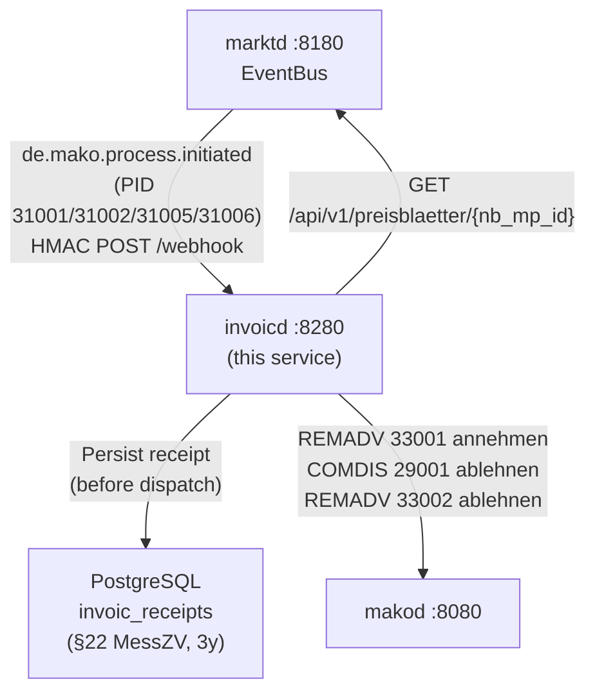

# `invoicd` Operator Guide

`invoicd` is the **INVOIC plausibility-check daemon** for the LF (Lieferant) role.
It subscribes to `marktd`'s EventBus, receives inbound INVOIC events, and:

1. Fetches the `PreisblattNetznutzung` from `marktd`.
2. Runs **5 deterministic checks** via `invoic-checker`.
3. Auto-settles (REMADV 33001) or disputes (COMDIS 29001 / REMADV 33002).
4. Persists every receipt to PostgreSQL for the **3-year §22 MessZV** audit trail.



---

## Port layout

```
┌─────────────────────────────────────────────────────────────────┐
│  invoicd  :8280                                                  │
│                                                                 │
│  POST /webhook                      ← marktd CloudEvents        │
│  GET  /api/v1/receipts              ← INVOIC receipt ledger     │
│  GET  /api/v1/receipts/{id}         ← single receipt by UUID    │
│  GET  /api/v1/disputes              ← open disputes             │
│  GET  /api/v1/overdue-remadv        ← receipts near pay_by      │
│  POST /api/v1/selbstausstellen/{malo_id} ← LF selbstausgestellt │
│  GET  /health/live  /health/ready                               │
└─────────────────────────────────────────────────────────────────┘
```

---

## Handled PIDs

| PID | Description | Direction |
|-----|-------------|-----------|
| 31001 | MMM-Rechnung Strom (NB → LF) | Inbound |
| 31002 | MMM-selbst ausgest. Rechnung (LF → LF) | Inbound |
| 31005 | NNE-Rechnung Strom (NB → LF) | Inbound |
| 31006 | NNE-selbst ausgest. Rechnung (LF) | Inbound + outbound |

PIDs 31003, 31004, 31009, 31011 belong to WiM Gas / GeLi Gas billing workflows
whose `ProcessInitiated` payload does not embed a `Rechnung` BO4E object — they
are routed to specialist handlers and are **not** processed by `invoicd`.

---

## invoic-checker — 5 plausibility checks

| # | Check | Outcome on failure |
|---|-------|--------------------|
| 1 | Billing period validity (DTM+163/DTM+164 in scope) | `Dispute` |
| 2 | Position arithmetic (unit price × quantity = line net) | `Dispute` |
| 3 | Document total (sum of positions = INVOIC total) | `Dispute` |
| 4 | Tariff unit price within tolerance of `PreisblattNetznutzung` | `Warn` or `Dispute` |
| 5 | Tariff entry found in `PreisblattNetznutzung` | `Warn` or `Dispute` |

`Warn` outcomes auto-approve when the total net invoice is below
`INVOICD_AUTO_DISPUTE_THRESHOLD_EUR_CENTS`. Set this to `0` to always approve
warnings (default: approve all warnings).

---

## Idempotency and §22 MessZV

`invoicd` writes each receipt to PostgreSQL **before** dispatching any command
to `makod`. The `invoic_receipts` table has a `UNIQUE (process_id)` constraint,
so re-delivery of the same `de.mako.process.initiated` event is a no-op.

Receipts must be retained for **3 years** (§22 MessZV / §41 EnWG).
The `received_at` column drives the retention query:

```sql
-- Receipts eligible for deletion (> 3 years old):
SELECT * FROM invoic_receipts
WHERE received_at < now() - INTERVAL '3 years';
```

---

## Configuration reference

All settings can be provided as environment variables or CLI flags.

| Env var | CLI flag | Default | Description |
|---------|----------|---------|-------------|
| `INVOICD_LISTEN` | `--listen` | `0.0.0.0:8280` | HTTP listen address |
| `INVOICD_MAKOD_URL` | `--makod-url` | `http://localhost:8080` | `makod` base URL |
| `INVOICD_MAKOD_API_KEY` | `--makod-api-key` | — | `makod` API key |
| `INVOICD_MARKTD_URL` | `--marktd-url` | `http://localhost:9180` | `marktd` base URL |
| `INVOICD_MARKTD_API_KEY` | `--marktd-api-key` | — | `marktd` Bearer token |
| `INVOICD_SUBSCRIBER_ID` | `--subscriber-id` | `invoicd` | EventBus subscriber ID |
| `INVOICD_WEBHOOK_URL` | `--webhook-url` | — | Public URL `marktd` POSTs events to |
| `INVOICD_WEBHOOK_SECRET` | `--webhook-secret` | — | HMAC secret for outbound signing |
| `INVOICD_INBOUND_SECRET` | `--inbound-secret` | = webhook-secret | HMAC verification secret |
| `DATABASE_URL` | `--database-url` | — | PostgreSQL connection string |
| `INVOICD_ARITHMETIC_TOLERANCE` | `--arithmetic-tolerance` | `0.01` | Relative tolerance for arithmetic checks |
| `INVOICD_TOTAL_TOLERANCE` | `--total-tolerance` | `0.01` | Relative tolerance for total-amount checks |
| `INVOICD_TARIFF_TOLERANCE` | `--tariff-tolerance` | `0.03` | Relative tolerance for tariff unit-price checks |
| `INVOICD_REQUIRE_TARIFF_FOUND` | `--require-tariff-found` | `false` | Escalate `Warn` to `Dispute` on missing tariff |
| `INVOICD_AUTO_DISPUTE_THRESHOLD_EUR_CENTS` | `--auto-dispute-threshold-eur-cents` | `0` | Escalate `Warn` to `Dispute` above this amount |
| `OIDC_ISSUER` | `--oidc-issuer` | — | OIDC issuer URL |
| `OIDC_AUDIENCE` | `--oidc-audience` | — | OIDC audience |
| `RUST_LOG` | — | `info` | Log level |
| `OTEL_EXPORTER_OTLP_ENDPOINT` | `--otel-endpoint` | — | OTLP endpoint |

---

## marktd subscription setup

Register `invoicd` as an EventBus subscriber in `marktd`:

```bash
curl -X PUT http://marktd:8180/api/v1/subscriptions/invoicd \
  -H "Authorization: Bearer <token>" \
  -H "Content-Type: application/json" \
  -d '{
    "webhook_url": "http://invoicd:8280/webhook",
    "webhook_secret": "<shared-hmac-secret>",
    "event_types": ["de.mako.process.initiated"],
    "active": true
  }'
```

Set `INVOICD_INBOUND_SECRET` to the same `<shared-hmac-secret>`.

---

## LF selbstausgestellt INVOIC (PID 31006)

When the LF issues the invoice itself (§20 MessZV selbstausgestellt), trigger via:

```bash
curl -X POST http://invoicd:8280/api/v1/selbstausstellen/10001234567 \
  -H "Authorization: Bearer <token>" \
  -H "Content-Type: application/json" \
  -d '{
    "nb_mp_id": "9900000000002",
    "period_from": "2026-01-01",
    "period_to":   "2026-03-31"
  }'
```

`invoicd` dispatches `gpke.abrechnung.selbstausstellen` to `makod`, which generates
and enqueues the outbound INVOIC 31006 for AS4 delivery to the NB.

---

## Monitoring

| Query / metric | Target |
|----------------|--------|
| `outcome IN ('Ok','AcceptedPartial','Warn')` rate | > 95 % |
| `outcome = 'Dispute'` count | < 1 % of volume |
| `pay_by < now() + INTERVAL '3 days' AND dispatched_at IS NULL` | 0 |

Alert when receipts approach `pay_by` without a `dispatched_at` — the NB may
not have received the REMADV and will begin a dispute window.

---

## Schema

```sql
-- invoic_receipts (§22 MessZV, 3-year retention)
SELECT
  process_id,    -- UUID, unique business key
  pid,           -- 31001 | 31002 | 31005 | 31006
  direction,     -- 'Inbound' | 'Outbound'
  sender_mp_id,  -- NB/MSB MP-ID
  outcome,       -- 'Ok' | 'AcceptedPartial' | 'Warn' | 'Dispute' | 'Dispatched' | 'Paid'
  pay_by,        -- Zahlungsziel from INVOIC DTM+92
  received_at,   -- first ingest timestamp
  dispatched_at  -- when REMADV/COMDIS was sent
FROM invoic_receipts
WHERE tenant = 'your-tenant-gln';
```
