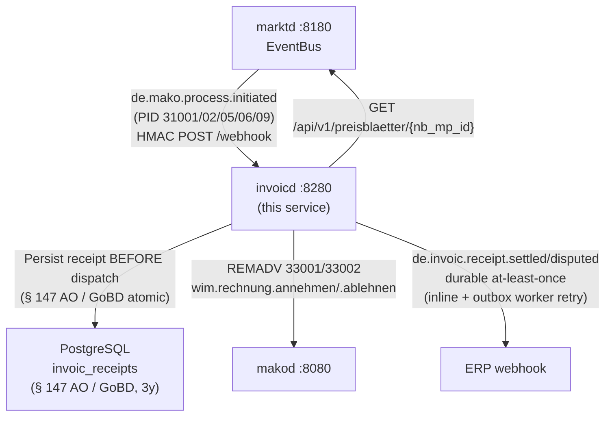
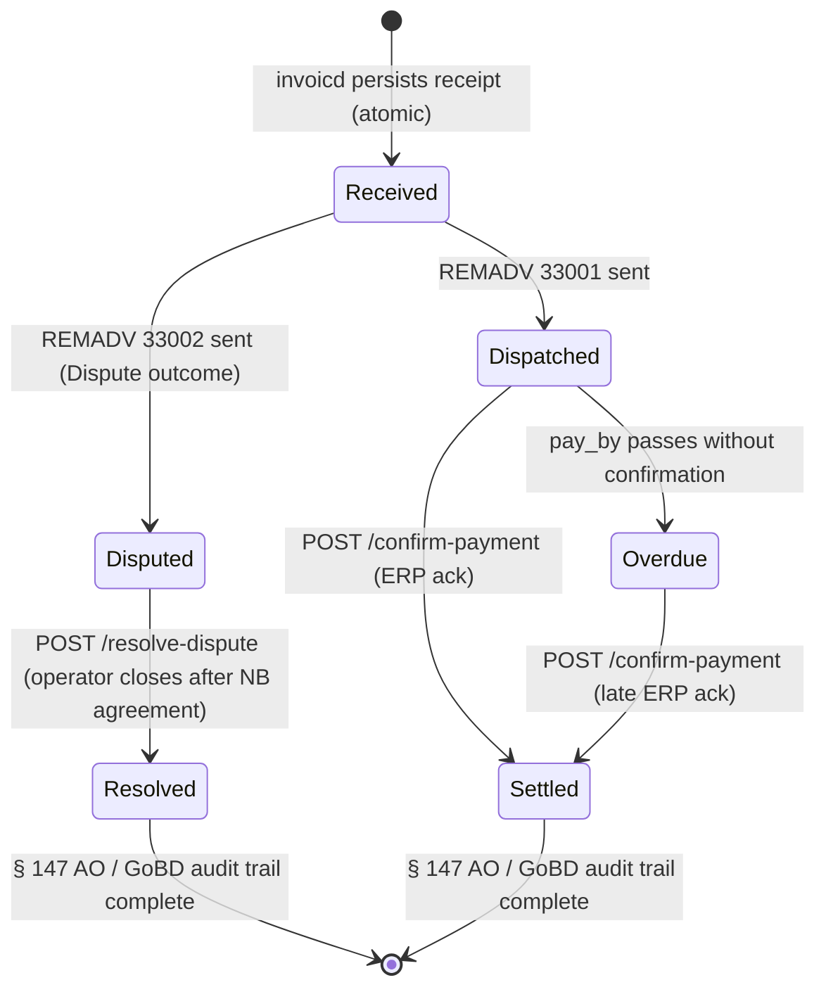

# `invoicd` Operator Guide

`invoicd` is the **INVOIC plausibility-check daemon** for the LF (Lieferant) role.
It subscribes to `marktd`'s EventBus, receives inbound INVOIC events, and:

1. Fetches the `PreisblattNetznutzung` and `NbContractRecord` from `marktd`.
2. Runs **5+1 deterministic checks** via `invoic-checker` (check 6 applies to MMM PIDs only).
3. Auto-settles (REMADV 33001) or disputes (REMADV 33002).
4. Persists every receipt to PostgreSQL for the **3-year § 147 AO / GoBD** audit trail.
5. Emits `de.invoic.receipt.*` CloudEvents to your ERP — **durable at-least-once delivery** with exponential-backoff retry.



---

## Port layout

```
┌─────────────────────────────────────────────────────────────────┐
│  invoicd  :8280                                                  │
│                                                                 │
│  POST /webhook                      ← marktd CloudEvents        │
│  GET  /api/v1/receipts              ← INVOIC receipt ledger     │
│  GET  /api/v1/receipts/{id}         ← single receipt by UUID    │
│  GET  /api/v1/receipts/{id}/rechnung← full BO4E Rechnung JSON   │
│  POST /api/v1/receipts/{id}/confirm-payment  ← ERP payment ack  │
│  POST /api/v1/receipts/{id}/dispatch-remadv  ← manual REMADV    │
│  POST /api/v1/receipts/{id}/resolve-dispute  ← close dispute    │
│  GET  /api/v1/disputes              ← open disputes             │
│  GET  /api/v1/overdue-remadv        ← receipts near pay_by      │
│  GET  /api/v1/zahlungsstatus/{malo_id}  ← payment status per MaLo│
│  POST /api/v1/selbstausstellen/{malo_id} ← LF selbstausgestellt │
│  GET  /metrics                      ← Prometheus metrics        │
│  GET  /health/live  /health/ready                               │
│  POST|GET /mcp      ← MCP Streamable HTTP (LLM tooling)         │
└─────────────────────────────────────────────────────────────────┘
```

---

## Handled PIDs

| PID | Description | Direction | Sparte | Status |
|-----|-------------|-----------|--------|--------|
| 31001 | Abschlagsrechnung Netznutzung (NB → LF) | Inbound | Strom | ✅ |
| 31002 | Netznutzungsabrechnung (NB → LF) | Inbound | Strom | ✅ |
| 31003 | WiM Gas Rechnung (NB → LF) | Inbound | Gas | ✅ |
| 31004 | WiM Gas Stornorechnung (NB → LF) | Inbound | Gas | ✅ auto-accept |
| 31005 | MMM-Rechnung Mehr-/Mindermengensaldo | Inbound | Strom | ✅ |
| 31006 | MMM-Rechnung selbst ausgestellt (LF → NB) | Inbound + Outbound | Strom | ✅ |
| 31007 | GaBi Gas Aggreg. MMM-Rechnung (NB → MGV) | Inbound | Gas | ✅ + MMM check 6 |
| 31008 | GaBi Gas selbst ausgest. Aggreg. MMM-Rechnung | Inbound | Gas | ✅ + MMM check 6 |
| 31009 | MSB-Rechnung (MSB → LF, WiM) | Inbound | Strom | ✅ PreisblattMessung |
| 31011 | GeLi Gas Rechnung sonstige Leistung (AWH) | Inbound | Gas | ✅ |

**PID 31009 (WiM MSB-Rechnung):** Handled by `Wim31009Ingestor`. Uses `PreisblattMessung` (MSB metering service tariff) for checks 4/5. Fallback to `GET /api/v1/invoic/{process_id}/rechnung` on `makod` when Rechnung is not embedded in `ProcessInitiated`.

**Gas PIDs 31003/31004/31011:** Use the standard 5-check pipeline with `PreisblattNetznutzung` Gas tariff. PID 31004 (Stornorechnung) skips the tariff check (checks 4/5) and always resolves as `AcceptedPartial` unless arithmetic fails.

**GaBi Gas PIDs 31007/31008:** Standard 5 checks + MMM Gas check 6 against Trading Hub Europe (THE) MMMA prices from `marktd`. These are Gas MGV billing PIDs (`mako-gabi-gas`).

---

## invoic-checker — checks

| # | Check | PIDs | Outcome on failure |
|---|-------|------|--------------------|
| 0 | **Storno reference** — `ist_storno=true` must have `original_rechnungsnummer` | all | `Dispute` |
| 1 | **Billing period validity** (boundaries consistent, in scope) | all | `Dispute` |
| 1.5 | **Zahlungsziel** — `faelligkeitsdatum` must not precede `rechnungsdatum` (invalid: `Dispute`) or exceed `max_zahlungsziel_days` (exceeded: `Warn`) | all | `Dispute` or `Warn` |
| 2 | **Position arithmetic** (unit price × quantity = line net; tolerance 1%) | all | `Dispute` |
| 3 | **Document total** (sum of positions = Gesamtnetto; tolerance 1%) | all | `Warn` |
| 4 | **Tariff unit price** within tolerance — ToU-aware: each INVOIC position’s text is matched against the `zaehlzeitregister` band code of `zeitvariablePreispositionen` entries. Flat positions fall back to `Preisstaffel` prices. **PID 31009:** uses `PreisblattMessung`. **Stornorechnungen: skipped** (`ist_storno=true` carries negated original amounts, not tariff positions) | all (not Storno) | `Warn` or `Dispute` |
| 5 | **Tariff entry found** in price sheet | all (not Storno) | `Warn` or `Dispute` |
| 6 | **MMM settlement price** — for Strom MMM PIDs (31002/31005): MMMA Strom reference; for Gas MMM PIDs (31007/31008): MMMA Gas reference (THE) | 31002/31005/31007/31008 | `Warn` or `Dispute` |
| 6 | **AufAbschlag discount validation** — for PID 31009: every negative position must match a contracted `AufAbschlag` name from `PreisblattMessung.auf_abschlaege` (WiM PRICAT 27001–27003). AufAbschlag names are now fetched from `marktd` and passed to `check_msb_rechnung_with_aufabschlaege` | 31009 | `Dispute` |
| 1 | Billing period validity (boundaries consistent, in scope) | all | `Dispute` |
| 2 | Position arithmetic (unit price × quantity = line net; tolerance 1%) | all | `Dispute` |
| 3 | Document total (sum of positions = Gesamtnetto; tolerance 1%) | all | `Dispute` |
| 4 | Tariff unit price within tolerance — **ToU-aware**: each INVOIC position's text is matched against the `zaehlzeitregister` band code of `zeitvariablePreispositionen` entries (e.g. `"HT"`, `"NT"`, `"ST"`). Flat positions fall back to `Preisstaffel` prices. **PID 31009:** uses `PreisblattMessung` via `check_msb_rechnung()` instead of `PreisblattNetznutzung`. | all | `Warn` or `Dispute` |
| 5 | Tariff entry found in price sheet — **PID 31009:** `PreisblattMessung`; all others: `PreisblattNetznutzung` | all | `Warn` or `Dispute` |
| 6 | **MMM settlement price check** — for MMM PIDs (31002/31005/31007/31008) only: fetches Gas MMMA prices (Trading Hub Europe) or Strom MMM prices (VNB per GPKE BK6-24-174 Teil 1 Kap. 8.4) from `marktd` and validates each Mehrmengen/Mindermengen position against the reference within tolerance. Skipped gracefully when prices are not yet imported for the billing month. | 31002/31005/31007/31008 | `Warn` or `Dispute` |
| 6 | **AufAbschlag discount validation** — for PID 31009: every **negative** Rechnungsposition (discount) must match a contracted `AufAbschlag` name from `PreisblattMessung.auf_abschlaege` (WiM PRICAT 27001–27003). Undocumented discounts are disputed. Activated via `check_msb_rechnung_with_aufabschlaege()`. | 31009 | `Dispute` |

`Warn` outcomes auto-approve unless the total net invoice exceeds
`auto_dispute_threshold_eur`. Set this to `0` to always approve warnings (default).

**Gas tariff (31009 / Gas PIDs):** Energy (kWh) = Volume (m³) × `brennwert_kwh_per_m3`
× `zustandszahl`. Both values are populated in `edmd` `MeterBillingPeriod` via
PID 13007 (Gas Datenabruf / `geli.gas.datenabruf.anfragen`).

---

## Payment CloudEvents

`invoicd` emits **outbound payment CloudEvents** to your ERP after each validated
INVOIC when `[erp] webhook_url` is configured.

| CloudEvents `type` | Trigger |
|---|---|
| `de.invoic.receipt.settled` | Outcome `Ok`, `AcceptedPartial`, or `Warn` |
| `de.invoic.receipt.disputed` | Outcome `Dispute` |
| `de.invoic.receipt.dispatched` | Outbound 31006 selbstausgestellt sent |
| `de.invoic.payment.overdue` | Background worker (every 6 h) — receipt with `pay_by < now()` and `payment_confirmed_at IS NULL` |

```json
{
  "specversion": "1.0",
  "type": "de.invoic.receipt.settled",
  "source": "urn:invoicd:tenant:9900357000004",
  "subject": "<process_id>",
  "data": {
    "process_id": "...",
    "pid": 31001,
    "direction": "Inbound",
    "sender_mp_id": "9904234560001",
    "outcome": "Ok",
    "pay_by": "2026-10-15",
    "findings_count": 0
  }
}
```

`de.invoic.payment.overdue` — emitted by the `payment_overdue` background worker (every 6 h) for each receipt where `pay_by < now()` and `payment_confirmed_at IS NULL`:

```json
{
  "specversion": "1.0",
  "type": "de.invoic.payment.overdue",
  "source": "urn:invoicd:tenant:9900357000004",
  "subject": "<receipt_id>",
  "data": {
    "receipt_id": "550e8400-...",
    "malo_id": "10001234567",
    "pid": 31001,
    "sender_mp_id": "9904234560001",
    "pay_by": "2026-10-15",
    "dispatched_at": "2026-10-01T09:12:00Z"
  }
}
```

### Delivery guarantee — durable at-least-once

The initial delivery attempt runs inline in the handler task immediately after
the REMADV is dispatched.  On any failure the `erp_outbox` background worker
retries with exponential backoff:

| Attempt | Delay before retry |
|---------|--------------------|
| 1       | 30 s               |
| 2       | 5 min              |
| 3       | 30 min             |
| 4       | 2 h                |
| 5       | dead-lettered      |

**HTTP status semantics:**
- **2xx** — success; `erp_notified_at` set in `invoic_receipts`
- **4xx** — permanent failure (bad config / auth); dead-lettered immediately
- **5xx / transport error** — transient; retried per schedule above

**Request signing** (`[erp] hmac_secret`): when configured, every POST includes
`X-Mako-Signature: sha256=<hex>` so the ERP can verify authenticity.

**REMADV is dispatched before ERP notification** — a failed ERP webhook never
blocks the regulatory obligation.  Reconcile dead-lettered events by querying
`invoic_receipts WHERE erp_notified_at IS NULL AND erp_attempts >= 5`.

---

## Idempotency and § 147 AO / GoBD

`invoicd` writes each receipt to PostgreSQL **before** dispatching any command
to `makod`. The `invoic_receipts` table has a `UNIQUE (process_id)` constraint,
so re-delivery of the same `de.mako.process.initiated` event is a no-op.

Receipts must be retained for **3 years** (§ 147 AO / GoBD / §41 EnWG).
The `received_at` column drives the retention query:

```sql
-- Receipts eligible for deletion (> 3 years old):
SELECT * FROM invoic_receipts
WHERE received_at < now() - INTERVAL '3 years';
```

---

## Payment Lifecycle & Zahlungsstatus

After `invoicd` dispatches a REMADV, the payment is settled via bank transfer
outside the EDIFACT process. `invoicd` provides an ERP callback endpoint to
close the § 147 AO / GoBD / §41 EnWG payment audit trail and a status query endpoint
for accounts-payable reconciliation.

### `POST /api/v1/receipts/{id}/confirm-payment`

The ERP calls this endpoint when it confirms that the bank transfer for an
invoice has been received. Sets `payment_confirmed_at = now()` on the receipt.

```bash
curl -X POST http://invoicd:8280/api/v1/receipts/550e8400-e29b-41d4-a716-446655440000/confirm-payment \
  -H "Authorization: Bearer <token>" \
  -H "Content-Type: application/json" \
  -d '{}'
# → 204 No Content
```

| Response | Meaning |
|---|---|
| `204 No Content` | Payment confirmed; `payment_confirmed_at` set |
| `404 Not Found` | Receipt not found or already confirmed |
| `403 Forbidden` | Caller lacks `write-receipt` Cedar action |

### `GET /api/v1/zahlungsstatus/{malo_id}`

Returns the payment status for all INVOIC receipts linked to a MaLo, with a
summary of overdue / pending / settled counts.

```bash
curl -s http://invoicd:8280/api/v1/zahlungsstatus/10001234567 \
  -H "Authorization: Bearer <token>" | jq .
```

```json
{
  "malo_id": "10001234567",
  "overdue_count": 1,
  "pending_count": 2,
  "settled_count": 14,
  "items": [
    {
      "id": "550e8400-...",
      "pid": 31001,
      "zahlungsstatus": "overdue",
      "pay_by": "2026-10-15T00:00:00Z",
      "dispatched_at": "2026-10-01T09:12:00Z",
      "payment_confirmed_at": null,
      "received_at": "2026-10-01T08:00:00Z"
    }
  ]
}
```

**`zahlungsstatus` values:**

| Value | Condition |
|---|---|
| `settled` | `payment_confirmed_at IS NOT NULL` |
| `overdue` | `dispatched_at IS NOT NULL` AND `pay_by < now()` AND `payment_confirmed_at IS NULL` |
| `pending` | `dispatched_at IS NOT NULL` AND `pay_by >= now()` AND `payment_confirmed_at IS NULL` |
| `undispatched` | `dispatched_at IS NULL` |

> **Alert rule:** `overdue_count > 0` should trigger an accounts-payable
> escalation. The `payment_overdue` background worker (runs every 6 hours)
> automatically emits `de.invoic.payment.overdue` CloudEvents to your ERP
> webhook for each overdue receipt, so dunning workflows can be triggered
> without polling this endpoint.

### Payment lifecycle state machine



---

## Configuration reference

`invoicd` reads its configuration from a **TOML file** (default: `invoicd.toml`),
with secrets deferred to environment variables via `"env:VAR_NAME"` values.

### CLI flags

| Flag | Env var | Default | Description |
|------|---------|---------|-------------|
| `--config` / `-c` | `INVOICD_CONFIG` | `invoicd.toml` | Path to `invoicd.toml` |
| `--log-level` | `RUST_LOG` | `info` | Log level |
| `--check` | `INVOICD_CHECK` | `false` | Validate config + DB connectivity, then exit 0. Used by Dockerfile HEALTHCHECK. |

```bash
invoicd --config /etc/invoicd/invoicd.toml
# or: INVOICD_CONFIG=/etc/invoicd/invoicd.toml invoicd
```

### Full `invoicd.toml` reference

```toml
[http]
addr = "0.0.0.0:8280"          # default

[database]
# Required for § 147 AO / GoBD 3-year receipt retention.
url             = "env:DATABASE_URL"   # required; use env: for secrets
max_connections = 5                    # default

[identity]
tenant = "9900357000004"               # required — MP-ID of the operator

[makod]
url     = "http://makod:8080"          # required
api_key = "env:INVOICD_MAKOD_API_KEY" # required

[marktd]
url     = "http://marktd:8180"            # required
api_key = "env:INVOICD_MARKTD_API_KEY"   # required

[webhook]
inbound_secret = "env:INVOICD_INBOUND_SECRET"  # optional; omit for dev

[subscription]
# Self-registers with marktd on startup — no manual curl required.
webhook_url   = "http://invoicd:8280/webhook"  # public URL marktd POSTs to
subscriber_id = "invoicd"                        # default
event_types   = [
  "de.mako.process.initiated",
  "de.mako.process.completed",
]

[check]
# Relative tolerances for invoic-checker plausibility pipeline.
arithmetic_tolerance       = 0.01   # 1 % — qty × price = line net
total_tolerance            = 0.01   # 1 % — Σ line nets = Gesamtnetto
tariff_tolerance           = 0.03   # 3 % — PRICAT unit price vs INVOIC
require_tariff             = false  # true → missing tariff escalates to Dispute
auto_dispute_threshold_eur = 0.0    # 0.0 → Warn always auto-approved
max_zahlungsziel_days      = 30     # 0 = disable; default 30 (§7 Allg. Festlegungen)

[erp]
# Required for ERP accounts-payable automation.
webhook_url = "https://erp.example.com/webhooks/invoicd"
# Optional: sign outbound requests with HMAC-SHA256.
# The ERP verifies via X-Mako-Signature: sha256=<hex>.
hmac_secret = "env:INVOICD_ERP_HMAC_SECRET"

[edmd]
# Required for POST /api/v1/selbstausstellen (PID 31006 self-issue).
# Without this section the endpoint returns 503.
url = "http://edmd:8380"
# api_key = "env:EDMD_API_KEY"  # optional bearer token

# [oidc]          # omit to disable auth (dev only — never omit in production)
# issuer   = "https://login.microsoftonline.com/{tenant-id}/v2.0"
# audience = "api://mako-invoicd"
# jwks_refresh_secs = 300

# [otel]          # omit to disable tracing
# endpoint = "http://otel-collector:4317"
```

---

## marktd subscription

`invoicd` **auto-registers** its EventBus subscription with `marktd` on startup
when `subscription.webhook_url` is set in the config — no manual `curl` required.

To force re-registration or verify the subscription:

```bash
curl -s http://marktd:8180/api/v1/subscriptions/invoicd \
  -H "Authorization: Bearer <token>" | jq .
```

---

## LF selbstausgestellt INVOIC (PID 31006)

When the LF issues the invoice itself (INVOIC AHB Selbstausstellung selbstausgestellt), trigger via:

```bash
curl -X POST http://invoicd:8280/api/v1/selbstausstellen/10001234567 \
  -H "Authorization: Bearer <token>" \
  -H "Content-Type: application/json" \
  -d '{
    "nb_mp_id": "9900000000002",
    "period_from": "2026-01-01",
    "period_to":   "2026-03-31"
  }'
```

The endpoint performs the following pipeline:

1. Fetches `MeterBillingPeriod` from `edmd GET /api/v1/billing-period/{malo_id}` — returns **503** if `[edmd]` is not configured.
2. Fetches `PreisblattNetznutzung` for the MaLo from `marktd` — returns **422** if no active price sheet exists.
3. Extracts `ArbeitspreisWirkarbeit` and `LeistungspreisWirkleistung` from typed `Preisposition.preisstaffeln`.
4. Calls `grid_billing::calculate_nne_invoice(NneInput)` to produce a `GridSettlement`
   (`GridInvoice` is a backward-compatible alias).
   `invoicd` calls `into_rechnung()` locally to build the GoBD-compliant `Rechnung`
   — `grid-billing` has no `rubo4e` dependency.
5. Persists the real `Rechnung` JSON to `invoic_receipts` (audit trail).
6. Dispatches `gpke.abrechnung.selbstausstellen` to `makod` with the full `rechnung` payload, which enqueues the outbound INVOIC 31006 for AS4 delivery to the NB.

### Required configuration

```toml
[edmd]
url = "http://edmd:8380"
# api_key = "${EDMD_API_KEY}"  # optional bearer token
```

The `[edmd]` section is required. Without it, `POST /api/v1/selbstausstellen` returns **503 Service Unavailable**.

---

## MCP tools

| Tool | Description |
|------|-------------|
| `get_receipt` | Get a single INVOIC receipt by process UUID |
| `list_disputes` | List all receipts with outcome `Dispute` |
| `get_check_result` | Get the full invoic-checker findings for a process |
| `list_overdue_remadv` | Receipts approaching Zahlungsziel without dispatched REMADV |
| `get_zahlungsstatus` | Payment status per MaLo-ID (settled / pending / overdue counts) |
| `summarize_billing_month` | Monthly billing volume + dispute rate per NB counterparty |
| `dispatch_remadv` | Check dispatch status for a stuck receipt (see REST API for action) |

## MCP prompts

| Prompt | Description |
|--------|-------------|
| `resolve-dispute` | Guided dispute investigation (check classification + resolution steps) |
| `check-overdue-remadv` | Monitor and action overdue REMADV dispatches |
| `monthly-billing-review` | § 147 AO / GoBD monthly reconciliation checklist |
| `detect-systematic-errors` | Find NB counterparties with systematic billing errors |

The `invoice-reconciliation-agent` in `agentd` subscribes to `de.invoic.payment.overdue` and `de.invoic.receipt.disputed`, runs the systematic-error detection workflow automatically, and escalates when a single NB exceeds 10% dispute rate over 2+ consecutive months.

---

## Monitoring

| Query / metric | Target |
|----------------|--------|
| `outcome IN ('Ok','AcceptedPartial','Warn')` rate | > 95 % |
| `outcome = 'Dispute'` count | < 1 % of volume |
| `pay_by < now() + INTERVAL '3 days' AND dispatched_at IS NULL` | 0 |
| `pay_by < now() AND payment_confirmed_at IS NULL AND dispatched_at IS NOT NULL` | 0 (trigger dunning) |

Alert when receipts approach `pay_by` without a `dispatched_at` — the NB may
not have received the REMADV and will begin a dispute window.

### Prometheus metrics (`/metrics`)

| Metric | Description |
|--------|-------------|
| `invoicd_receipts_total` | Total INVOIC receipts persisted (§ 147 AO / GoBD) |
| `invoicd_disputes_total` | Receipts with `Dispute` outcome |
| `invoicd_overdue_remadv_total` | Receipts with `pay_by < now() + 3 days` and no `dispatched_at` |
| `invoicd_receipts_by_pid_outcome{pid, outcome}` | Receipt count broken down by PID and outcome |

```sql
-- invoic_receipts (§ 147 AO / GoBD, 3-year retention)
SELECT
  process_id,    -- UUID, unique business key
  pid,           -- 31001 | 31002 | 31005 | 31006 | 31009
  direction,     -- 'Inbound' | 'Outbound'
  sender_mp_id,  -- NB/MSB MP-ID
  outcome,       -- 'Ok' | 'AcceptedPartial' | 'Warn' | 'Dispute' | 'Dispatched' | 'Paid'
  pay_by,        -- Zahlungsziel from INVOIC DTM+92
  received_at,   -- first ingest timestamp
  dispatched_at, -- when REMADV/COMDIS was sent
  payment_confirmed_at  -- set by POST /confirm-payment (ERP bank transfer ack)
FROM invoic_receipts
WHERE tenant = 'your-tenant-gln';
```
