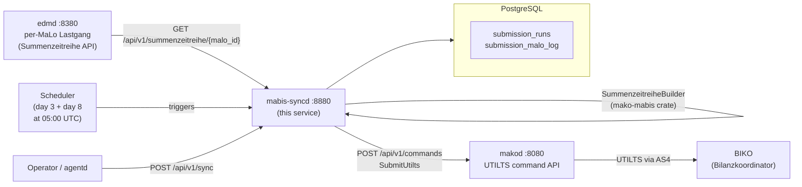
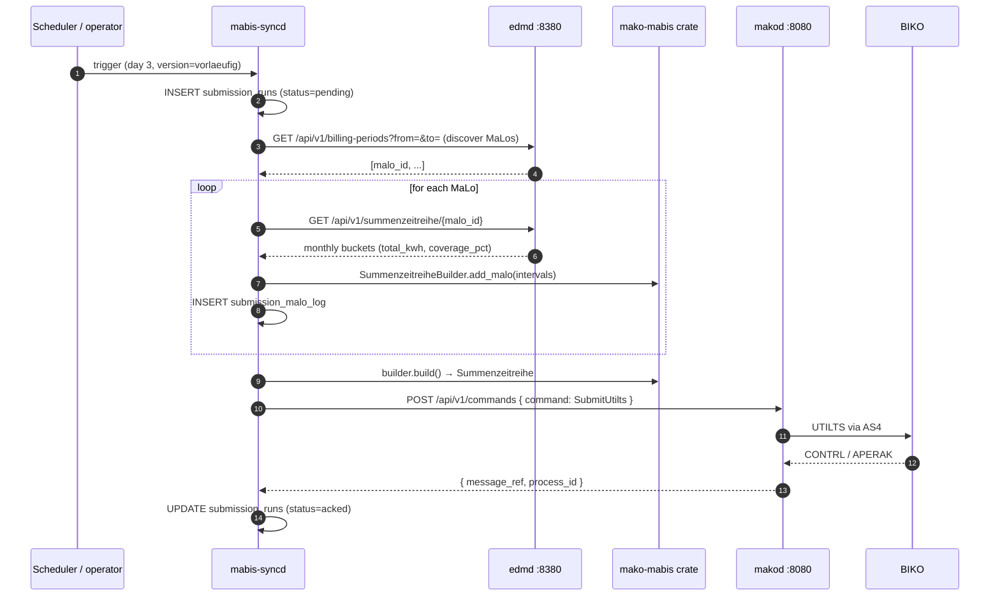

# `mabis-syncd` Operator Guide

`mabis-syncd` is the **MaBiS UTILTS synchronisation daemon** — the service that
aggregates per-MaLo Lastgang data from `edmd` and submits monthly
**Summenzeitreihen** to the BIKO (Bilanzkoordinator) via UTILTS messages.



## Regulatory basis

| Rule | Requirement |
|---|---|
| **BK6-22-024 Anlage 3 MaBiS** | Vorlaeufige Summenzeitreihe by day 3 after period end |
| **BK6-22-024 Anlage 3 MaBiS** | Endgueltige Summenzeitreihe by day 8 after period end |
| **MaBiS (Anlage 3 zur Festlegung BK6-24-174)** | Marktregeln für die Bilanzkreisabrechnung Strom |
| **UTILTS AHB S1.0 / S2.0** | EDIFACT message format for Summenzeitreihe |
| **§22 MessZV** | 3-year audit retention for all billing-relevant data |

---

## Port layout

```
┌────────────────────────────────────────────────────────────────────────────┐
│  mabis-syncd  :8880                                                         │
│                                                                            │
│  POST /api/v1/sync              ← trigger manual aggregation run          │
│  GET  /api/v1/runs              ← list recent submission runs             │
│  GET  /api/v1/runs/{id}         ← get single run with status + stats      │
│  PUT  /api/v1/runs/{id}/retry   ← retry a failed run (≤ 3 attempts)       │
│                                                                            │
│  GET  /health/live                                                        │
│  GET  /health/ready             ← PostgreSQL ping                         │
│  GET  /metrics                  ← Prometheus metrics                      │
└────────────────────────────────────────────────────────────────────────────┘
```

---

## Aggregation pipeline

`mabis-syncd` runs the standard MaBiS aggregation pipeline:



### Vorlaeufig vs. endgueltig

| Version | Trigger day | What changes |
|---|---|---|
| `vorlaeufig` | Day 3 of month | Preliminary data; corrected values replace earlier estimates |
| `endgueltig` | Day 8 of month | Final; incorporates all available corrections. Overwrites vorlaeufig at BIKO |

Both use the same `SummenzeitreiheBuilder` — only the `version` field and timing differ.

---

## MaLo discovery

`mabis-syncd` discovers which MaLos to include via `edmd`'s billing-periods API.
All MaLos that have `meter_billing_periods` rows within the submission period
are automatically included. There is no static MaLo configuration file.

To **exclude** a MaLo from MABIS aggregation, remove its billing period records
from `edmd` or set a negative tenant override (advanced use case).

---

## Configuration reference

```toml
[http]
addr = "0.0.0.0:8880"       # default

[database]
url = "env:MABIS_SYNCD_DATABASE_URL"   # required

[identity]
tenant                  = "env:MABIS_SYNCD_TENANT"             # BDEW Codenummer of ÜNB / NB
sender_mp_id            = "env:MABIS_SYNCD_SENDER_MP_ID"       # NAD+MS in UTILTS
receiver_mp_id          = "env:MABIS_SYNCD_RECEIVER_MP_ID"     # NAD+MR in UTILTS (BIKO)
bilanzierungsgebiet_id  = "env:MABIS_SYNCD_BILANZIERUNGSGEBIET_ID"  # BNetzA zone code

[edmd]
url     = "http://edmd:8380"
api_key = "env:MABIS_SYNCD_EDMD_API_KEY"

[makod]
url     = "http://makod:8080"
api_key = "env:MABIS_SYNCD_MAKOD_API_KEY"

[schedule]
preliminary_day = 3     # day of month for vorlaeufig submission
final_day       = 8     # day of month for endgueltig submission
run_hour_utc    = 5     # 05:00 UTC = 06:00 CET / 07:00 CEST

# [otel]
# endpoint = "http://otel-collector:4317"
```

### Common BIKO BDEW codes (receiver_mp_id)

| BIKO | BDEW code | Control zone |
|---|---|---|
| Transnet BW | `9900077000006` | Baden-Württemberg |
| TenneT TSO | `9900357000004` | Bayern + Niedersachsen |
| Amprion | `9900629000001` | West + Mitte |
| 50Hertz | `9900255000008` | Ost + Hamburg |

---

## Submission run lifecycle

```
pending
  │
  ├──► aggregating
  │         │
  │         └──► submitted
  │                   │
  │                   ├──► acked         (terminal — success)
  │                   └──► rejected      (terminal — BIKO rejected message)
  │
  └──► failed         (retry allowed, attempt_count < 3)
```

A `failed` run can be retried via `PUT /api/v1/runs/{id}/retry`.
After 3 failed attempts, manual intervention is required.

---

## API examples

```bash
# Trigger manual vorlaeufig submission for May 2026
curl -X POST http://mabis-syncd:8880/api/v1/sync \
  -H "Content-Type: application/json" \
  -d '{ "version": "vorlaeufig", "period_from": "2026-05-01", "period_to": "2026-05-31" }'

# Check status of all runs
curl http://mabis-syncd:8880/api/v1/runs | jq '.runs[] | {id, version, status, total_kwh, malo_count}'

# Retry a failed run
curl -X PUT http://mabis-syncd:8880/api/v1/runs/550e8400-e29b-41d4-a716-446655440000/retry
```

---

## PostgreSQL schema

| Table | Purpose |
|---|---|
| `submission_runs` | One row per aggregation + submission attempt. Tracks status, period, version, BIKO message_ref. |
| `submission_malo_log` | One row per MaLo per run. Used for audit trail and coverage gap analysis. |

---

## Monitoring

| Metric / Alert | Target |
|---|---|
| `submission_runs.status = failed` older than 24h | Immediate escalation — regulatory deadline at risk |
| Day 3 run missing by 10:00 CET | Vorlaeufig deadline alert (BK6-22-024 Anlage 3) |
| Day 8 run missing by 10:00 CET | Endgueltig deadline alert |
| MaLo coverage < 95% in `submission_malo_log` | Missing data — check edmd quality warnings |

The **`mabis-syncd-agent`** in `agentd` monitors submission deadlines automatically and escalates via the ERP webhook when a run is overdue or missing.

---

## Integration with `mako-mabis`

`mabis-syncd` uses the pure domain logic in `mako-mabis`:

```rust
// SummenzeitreiheBuilder — used in mabis-syncd/src/sync_engine.rs
use mako_mabis::{BilanzierungsgebietId, SummenzeitreiheBuilder};
use metering::MeterInterval;

let mut builder = SummenzeitreiheBuilder::new(
    BilanzierungsgebietId("11YAPG4CTRDNZ--A".to_owned()),
    period_from, period_to,
    "vorlaeufig",
    "9900357000004",  // sender (NB / ÜNB)
    "9900077000006",  // receiver (BIKO Transnet BW)
);

for malo in &malos {
    let intervals: Vec<MeterInterval> = fetch_from_edmd(malo).await;
    builder.add_malo(&intervals);  // typed — no raw tuples
}

let series = builder.build();
println!("total kWh: {}, intervals: {}", series.total_kwh(), series.interval_count());
// Monthly buckets (ready for UTILTS billing period encoding):
let monthly = series.monthly_totals();
```

`BilanzierungsgebietId` and `BilanzkreisId` are canonical types from `mako-edm`
(single source of truth — `mako-mabis` re-exports them, not duplicates).
