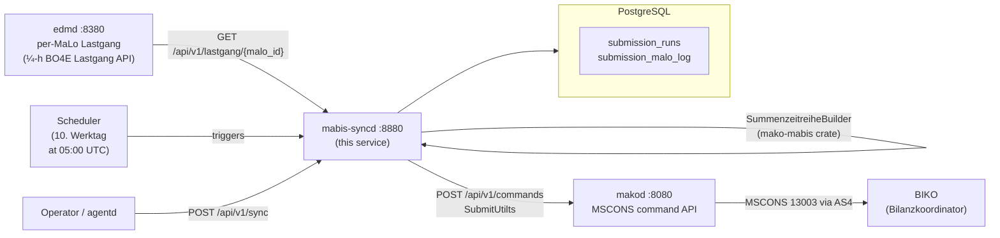
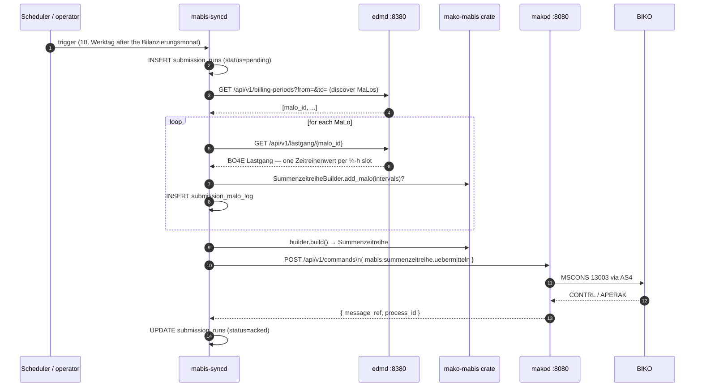

# `mabis-syncd` Operator Guide

`mabis-syncd` is the **MaBiS synchronisation daemon** — the service that
aggregates per-MaLo Lastgang data from `edmd` and submits monthly
**Summenzeitreihen** to the BIKO (Bilanzkoordinator).

A Summenzeitreihe is an **MSCONS** message, Prüfidentifikator **13003**
("Übertragung Summenzeitreihe", MSCONS AHB 3.2 §8.3.1). UTILTS carries
Berechnungsformel and Zählzeit-/Schaltzeitdefinitionen and has no Summenzeitreihe
use case.

Submission goes out through `makod` as `mabis.summenzeitreihe.uebermitteln`
(Marktrolle `NB`/`ÜNB`). That command enqueues the MSCONS message directly rather
than spawning a workflow: a Summenzeitreihe is a statement of fact, and the
BIKO's answers — Datenstatus (IFTSTA 21003/21004) and Prüfmitteilung (21000/
21001) — arrive asynchronously here, where the version history lives. The
`mabis.abrechnung.*` commands are the other direction: the BKV receiving an
Abrechnungssummenzeitreihe and answering it.

The wire message carries the identifying 3-tuple as `LOC` (MaBiS-Zählpunkt),
`DTM+492` (Bilanzierungsmonat, `CCYYMM`) and `DTM+293` (Versionsangabe,
`CCYYMMDDHHMMSSZZZ`), and one `QTY+220` per settlement slot bounded by
`DTM+163`/`DTM+164`. A quantity without those bounds has no time reference, so
the BIKO cannot place it on the grid.

Quantities carry DE 6063 `79` — "Energiemenge summiert (Summenwert,
Bilanzsumme)" — not a consumption qualifier, which would describe one metering
point's draw rather than the aggregate of a Bilanzierungsgebiet. The OBIS in
`PIA` carries DE 7143 `SRW`, which marks the value as an OBIS-Kennzahl rather
than a Medium (`Z08`).

The renderer dispatches on the Prüfidentifikator:

| PID | Anwendungsfall | BGM 1001 | Shape |
|---|---|---|---|
| 13003 | Summenzeitreihe (MaBiS) | `BK` | summed series over settlement slots |
| 13023 | Redispatch 2.0 Ausfallarbeitssummenzeitreihe | `Z46` | same |
| 13015 | Arbeit / Leistungsmaximum im Kalenderjahr vor Lieferbeginn | `Z27` | work entry plus one or two monthly maxima |
| 13016 | Energiemenge und Leistungsmaximum | `Z28` | same |
| 13019 | Energiemenge (Strom) | `7` | work entry only |

`BGM` DE 1001 names what kind of document the message is and the receiver routes
by it, so it is set per Anwendungsfall rather than left at a default — a
Summenzeitreihe sent as `7` would arrive labelled a Prozessdatenbericht.

13019 carries energy alone: the AHB marks no Leistungsperiode row for it, so a
maximum sent under it would have no period to be attributed to. The renderer
refuses it and points at 13016.

Rendered messages are validated against the registered release profile by
`makod`'s conformance suite — parsed back and checked for mandatory segments,
segment order and code lists, rather than by asserting on segment substrings.

Units are validated against DE 6411's closed code list (`KWH`, `KWT`, `D54`,
`MTS`; MIG 2.5). The AHB's per-Anwendungsfall table has no DE 6411 row for
13015/13016/13019, so the unit follows the MIG: energy is `KWH`, a power maximum
is `KWT`.

Any other Anwendungsfall is refused by name rather than rendered in a shape that
would be syntactically valid and mean something else.

13015 repeats SG9 two to three times for one `NAD+DP`: once for the energy from
the start of the calendar year to Lieferbeginn, then once or twice for the
highest and second-highest monthly power maxima, which the KAV concession-levy
band depends on. Each maximum carries the period it fell in as `DTM+306` —
format `610` (`CCYYMM`) under a monthly or yearly Leistungspreissystem, `102`
(`CCYYMMDD`) under a daily one. Its quantities use DE 6063 `220` (Wahrer Wert)
or `67` (Ersatzwert), so a substitute is never reported as a measurement.



## Aggregation is per Bilanzierungsgebiet

MaBiS settles per territory, so `aggregate()` returns **one Summenzeitreihe per
Bilanzierungsgebiet**, not one per run.

Each MaLo's territory comes from `marktd` (`GET /api/v1/malo/{id}` →
`bilanzierungsgebiet`). `identity.bilanzierungsgebiet_id` is now only a
**fallback** for MaLos whose master data names none, and those MaLos are logged
rather than silently folded into the fallback zone — energy filed against the
wrong territory is a settlement error the BIKO cannot detect.

This requires a `[marktd]` config section:

```toml
[marktd]
url     = "http://marktd:8180"
api_key = "..."
```

A submission that discovers **no** MaLos fails the run. An empty Summenzeitreihe
would settle the Bilanzierungsgebiet at zero, and the BIKO cannot tell that apart
from a territory that genuinely drew nothing.

## Aggregation is quarter-hourly

MaBiS settles electricity on a **¼-h grid**, so `fetch_lastgang` reads
`GET /api/v1/lastgang/{malo_id}` — the BO4E `Lastgang` projection, which carries
one `Zeitreihenwert` per metered slot.

The resampled endpoints are not interchangeable here. Aggregating monthly buckets
produces a Summenzeitreihe whose period total is right but whose **shape is
wrong**, and the BIKO cannot detect that from the message alone.

Two guards make the resolution explicit rather than implied:

- `SummenzeitreiheBuilder` is constructed with the slot length it expects
  (`MABIS_SLOT` = 15 min) and returns `SlotResolutionError` for any interval that
  does not match. The offending MaLo is excluded and logged, so the run
  under-reports rather than mis-reports.
- `Summenzeitreihe::missing_slot_count()` reports slots in the settlement period
  that no MaLo covered. A non-zero count means the BIKO would receive a series
  that silently omits energy rather than reporting zero, so it is logged at
  `WARN` when the series is built.

Quality flags are mapped conservatively on the way in: the forward BO4E mapping
in `edmd` is lossy, so anything not plainly `ABGELESEN` counts as non-measured.
Over-reporting substitution costs a flag in the MaBiS log; under-reporting it
lets an estimate settle as a reading.

## Regulatory basis

| Rule | Requirement |
|---|---|
| **BK6-24-174 Anlage 3 §3.8.2** | Version ascending per (MaBiS-ZP, Bilanzierungsmonat) |
| **BK6-24-174 Anlage 3 §3.8.3** | Datenstatus assigned exclusively by the BIKO |
| **BK6-24-174 Anlage 3 §3.10** | Erstaufschlag 1.–10. WT, Clearingphase 11.–30. WT, KBKA to month 7 |
| **BK6-24-174 Anlage 3 §9.8.1** | Negative Prüfmitteilung → corrected Summenzeitreihe |
| **MSCONS AHB 3.2 §8.3.1** | PID 13003, Summenzeitreihe message format |
| **IFTSTA AHB 2.1** | PID 21000/21001 Prüfmitteilung, 21003/21004 Datenstatus |
| **§ 147 AO / GoBD** | 3-year audit retention for all billing-relevant data |

---

## Port layout

```
┌────────────────────────────────────────────────────────────────────────────┐
│  mabis-syncd  :8880                                                         │
│                                                                            │
│  POST /api/v1/sync              ← trigger manual aggregation run          │
│  GET  /api/v1/runs              ← list recent submission runs             │
│  GET  /api/v1/runs/{id}         ← get single run with status + stats      │
│  PUT  /api/v1/runs/{id}/retry   ← retry a failed run (≤ 3 attempts)       │
│  POST /api/v1/datenstatus       ← record BIKO Datenstatus (IFTSTA 21003/4) │
│  POST /api/v1/pruefmitteilung   ← record Prüfmitteilung (IFTSTA 21000/1)   │
│  GET  /api/v1/korrekturbedarf   ← negative Prüfmitteilungen, uncorrected   │
│                                                                            │
│  GET  /health/live                                                        │
│  GET  /health/ready             ← PostgreSQL ping                         │
│  GET  /metrics                  ← Prometheus metrics                      │
└────────────────────────────────────────────────────────────────────────────┘
```

---

## Aggregation pipeline

`mabis-syncd` runs the standard MaBiS aggregation pipeline:



### Versionierung and Datenstatus

There is no preliminary/final pair. A Summenzeitreihe is identified by the
3-tuple **(MaBiS-Zählpunkt, Bilanzierungsmonat, Version)**, and §3.8.2 requires
only that the version ascend: *"Die Version einer Summenzeitreihe ist jeweils
aufsteigend zu vergeben und ist über die gesamte BKA beizubehalten."* A
correction is the same series resent under a higher version, so a period may
carry arbitrarily many.

The version is a timestamp — MSCONS carries it as `SG6 DTM+293`
(Fertigstellungsdatum/-zeit, format 304, `CCYYMMDDHHMMSSZZZ`) — which is what
makes "ascending" well defined. `BGM 1225` is always `9` (Original); there is no
replace or correction qualifier, so the version is the only thing distinguishing
a correction from the first submission.

**Datenstatus** is the separate, inbound axis. It is assigned exclusively by the
BIKO (§3.8.3: *"Der Datenstatus wird ausschließlich vom BIKO vergeben"*) and
arrives via IFTSTA `SG7 STS+Z04`:

| Datenstatus | Meaning |
|---|---|
| `Prüfdaten` | received, not yet accepted for settlement |
| `Abrechnungsdaten` | accepted for the ordinary BKA |
| `Abrechnungsdaten KBKA` | accepted for the Korrekturbilanzkreisabrechnung |
| `abgerechnete Daten` | settled in the BKA |
| `abgerechnete Daten KBKA` | settled in the KBKA |

Settlement uses the **highest version carrying `Abrechnungsdaten`** or
`Abrechnungsdaten KBKA` — not simply the newest version. `mabis-syncd` never
derives a Datenstatus; it only records what the BIKO sent.

### Fristen (§3.10, Tabelle 2)

Werktage after the end of the Bilanzierungsmonat, for a BG-SZR (Kategorie B):

| Phase | BKA | KBKA |
|---|---|---|
| Erstaufschlag | 1.–10. WT | — |
| Clearingphase | 11.–30. WT | 31. WT – end of month 7 |
| Abrechnungsstichtag | 42. WT | end of month 8 |

Within the Erstaufschlag a new version is assigned `Abrechnungsdaten`
automatically; after it a new version starts as `Prüfdaten` and needs a positive
Prüfmitteilung to be promoted. The scheduler therefore submits on the **10.
Werktag** by default, which maximises the input data while the automatic
assignment still applies.

---

## MaLo discovery

`mabis-syncd` discovers which MaLos to include via `edmd`'s billing-periods API.
All MaLos that have `meter_billing_periods` rows within the submission period
are automatically included. There is no static MaLo configuration file.

To **exclude** a MaLo from MABIS aggregation, remove its billing period records
from `edmd` or set a negative tenant override (advanced use case).

---

## Configuration reference

```toml
[http]
addr = "0.0.0.0:8880"       # default

[database]
url = "env:MABIS_SYNCD_DATABASE_URL"   # required

[identity]
tenant                  = "env:MABIS_SYNCD_TENANT"             # BDEW Codenummer of ÜNB / NB
sender_mp_id            = "env:MABIS_SYNCD_SENDER_MP_ID"       # NAD+MS in MSCONS
receiver_mp_id          = "env:MABIS_SYNCD_RECEIVER_MP_ID"     # NAD+MR in MSCONS (BIKO)
bilanzierungsgebiet_id  = "env:MABIS_SYNCD_BILANZIERUNGSGEBIET_ID"  # BNetzA zone code

[edmd]
url     = "http://edmd:8380"
api_key = "env:MABIS_SYNCD_EDMD_API_KEY"

[marktd]                    # required — per-MaLo Bilanzierungsgebiet lookup
url     = "http://marktd:8180"
api_key = "env:MABIS_SYNCD_MARKTD_API_KEY"

[makod]
url     = "http://makod:8080"
api_key = "env:MABIS_SYNCD_MAKOD_API_KEY"

[oidc]                      # required unless allow_insecure_no_auth = true
issuer   = "https://login.microsoftonline.com/{tenant-id}/v2.0"
audience = "api://mako-mabis-syncd"

[schedule]
erstaufschlag_werktag = 10   # Werktag after the Bilanzierungsmonat to submit on
run_hour_utc    = 5     # 05:00 UTC = 06:00 CET / 07:00 CEST

# [otel]
# endpoint = "http://otel-collector:4317"
```

### `env:` indirection

Every value above may be written as `env:VARNAME` and is resolved at startup by
`mako_service::config::resolve_env`. A referenced variable that is not set fails
the process with the variable named, rather than being used verbatim — an
unresolved `api_key = "env:MABIS_SYNCD_EDMD_API_KEY"` would otherwise be sent as
that literal string in the `Authorization` header, 401 against every upstream,
and produce a submission missing the MaLos it could not fetch.

## Authentication

A MaBiS submission settles a balance group under BK6-22-024 Anlage 3 and cannot
be withdrawn once the BIKO acks it. Every route is therefore authorised, and the
service refuses to start without `[oidc]` unless
`allow_insecure_no_auth = true` is set explicitly.

| Route | Cedar action |
|---|---|
| `GET /api/v1/runs`, `GET /api/v1/runs/{id}` | `read-mabis-run` |
| `POST /api/v1/sync`, `PUT /api/v1/runs/{id}/retry` | `trigger-mabis-run` |

Triggering is separated from reading and restricted to the **NB** and **ÜNB**
roles — the roles that aggregate a Bilanzierungsgebiet and have standing to file
a Summenzeitreihe in the tenant's name. Read access is scoped to the tenant
because run history discloses which Bilanzierungsgebiete it settles.

Policies live in `services/mabis-syncd/policies/mabis-syncd.cedar`.

### Common BIKO BDEW codes (receiver_mp_id)

| BIKO | BDEW code | Control zone |
|---|---|---|
| Transnet BW | `9900077000006` | Baden-Württemberg |
| TenneT TSO | `9900357000004` | Bayern + Niedersachsen |
| Amprion | `9900629000001` | West + Mitte |
| 50Hertz | `9900255000008` | Ost + Hamburg |

---

## Submission run lifecycle

```
pending
  │
  ├──► aggregating
  │         │
  │         └──► submitted
  │                   │
  │                   ├──► acked         (terminal — success)
  │                   └──► rejected      (terminal — BIKO rejected message)
  │
  └──► failed         (retry allowed, attempt_count < 3)
```

A `failed` run can be retried via `PUT /api/v1/runs/{id}/retry`.
After 3 failed attempts, manual intervention is required.

---

## API examples

```bash
# Trigger a submission for May 2026. The version is assigned by the service —
# it must ascend (§3.8.2) — and the phase follows from the Werktag calendar.
curl -X POST http://mabis-syncd:8880/api/v1/sync \
  -H "Content-Type: application/json" \
  -d '{ "period_from": "2026-05-01", "period_to": "2026-05-31" }'

# Check status of all runs
curl http://mabis-syncd:8880/api/v1/runs \
  | jq '.runs[] | {id, version, abrechnungslauf, datenstatus, status, total_kwh}'

# Record the Datenstatus the BIKO assigned (IFTSTA 21003/21004)
curl -X POST http://mabis-syncd:8880/api/v1/datenstatus \
  -H "Content-Type: application/json" \
  -d '{ "bilanzierungsgebiet_id": "11YAPG4CTRDNZ--A",
        "period_from": "2026-05-01", "period_to": "2026-05-31",
        "version": "2026-06-15T05:00:00Z", "datenstatus": "Abrechnungsdaten" }'

# Record a Prüfmitteilung (IFTSTA 21000/21001). A negative one requires a
# corrected Summenzeitreihe under a higher version.
curl -X POST http://mabis-syncd:8880/api/v1/pruefmitteilung \
  -H "Content-Type: application/json" \
  -d '{ "bilanzierungsgebiet_id": "11YAPG4CTRDNZ--A",
        "period_from": "2026-05-01", "period_to": "2026-05-31",
        "version": "2026-06-15T05:00:00Z", "positiv": false,
        "sender_mp_id": "9900077000006", "pid": 21000,
        "begruendung": "Abweichung MaLo 51238696781" }'

# Open Korrekturbedarf — negative Prüfmitteilungen with no correction yet
curl http://mabis-syncd:8880/api/v1/korrekturbedarf

# Send the correction, naming the run it corrects
curl -X POST http://mabis-syncd:8880/api/v1/sync \
  -H "Content-Type: application/json" \
  -d '{ "period_from": "2026-05-01", "period_to": "2026-05-31",
        "corrects_run_id": "550e8400-e29b-41d4-a716-446655440000" }'

# Retry a failed run (a fresh attempt, so a new version)
curl -X PUT http://mabis-syncd:8880/api/v1/runs/550e8400-e29b-41d4-a716-446655440000/retry
```

---

## PostgreSQL schema

| Table | Purpose |
|---|---|
| `submission_runs` | One row per aggregation + submission attempt. Tracks status, period, version, BIKO message_ref. |
| `submission_malo_log` | One row per MaLo per run. Used for audit trail and coverage gap analysis. |

---

## Monitoring

| Metric / Alert | Target |
|---|---|
| `submission_runs.status = failed` older than 24h | Immediate escalation — regulatory deadline at risk |
| Day 3 run missing by 10:00 CET | Vorlaeufig deadline alert (BK6-22-024 Anlage 3) |
| Day 8 run missing by 10:00 CET | Endgueltig deadline alert |
| MaLo coverage < 95% in `submission_malo_log` | Missing data — check edmd quality warnings |

The **`mabis-syncd-agent`** in `agentd` monitors submission deadlines automatically and escalates via the ERP webhook when a run is overdue or missing.

---

## Integration with `mako-mabis`

`mabis-syncd` uses the pure domain logic in `mako-mabis`:

```rust
// SummenzeitreiheBuilder — used in mabis-syncd/src/sync_engine.rs
use mako_mabis::{BilanzierungsgebietId, MABIS_SLOT, SummenzeitreiheBuilder};
use metering::MeterInterval;

let mut builder = SummenzeitreiheBuilder::new(
    BilanzierungsgebietId("11YAPG4CTRDNZ--A".to_owned()),
    period_from, period_to,
    version, // ascending timestamp; MSCONS SG6 DTM+293
    "9900357000004",  // sender (NB / ÜNB)
    "9900077000006",  // receiver (BIKO Transnet BW)
    MABIS_SLOT,       // ¼-h settlement grid — mismatched intervals are rejected
);

for malo in &malos {
    let intervals: Vec<MeterInterval> = fetch_from_edmd(malo).await;
    // Errs if any interval is not a ¼-h slot; exclude the MaLo rather than
    // fold it in at the wrong shape.
    if let Err(e) = builder.add_malo(&intervals) {
        warn!(malo, error = %e, "excluded from Summenzeitreihe");
    }
}

let series = builder.build();
println!("total kWh: {}, intervals: {}", series.total_kwh(), series.interval_count());
if !series.is_complete() {
    warn!(missing = series.missing_slot_count(), "settlement slots uncovered");
}
// Monthly roll-up, for reporting only — the message carries the ¼-h slots:
let monthly = series.monthly_totals();
```

`BilanzierungsgebietId` and `BilanzkreisId` are canonical types from `mako-edm`
(single source of truth — `mako-mabis` re-exports them, not duplicates).
