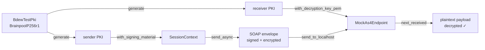
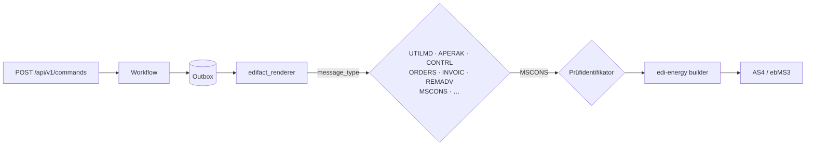
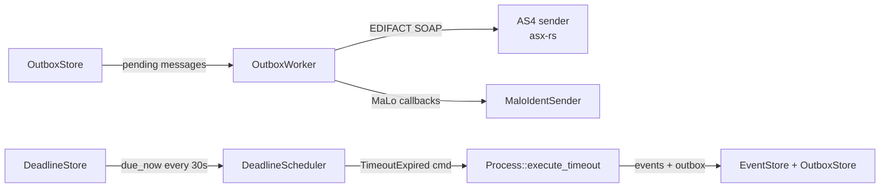

# `makod` Operator Guide

`makod` is the production daemon for the Mako process engine. It assembles all
domain modules (GPKE, WiM, GeLi Gas, MABIS), wires them to a durable
[SlateDB](https://github.com/slatedb/slatedb) event store, and exposes three
independent server ports — AS4 inbound, HTTP REST ingest, and BDEW
API-Webdienste Strom.

---

## Port Layout

```
┌───────────────────────────────────────────────────────────────┐
│  makod                                                        │
│                                                               │
│  :4080  ← AS4/ebMS3 inbound (EDIFACT via SOAP/MTOM)          │
│  :8080  ← HTTP REST API  (POST /edifact, admin endpoints)    │
│  :8090  ← API-Webdienste Strom (iMS REST/JSON)               │
│                                                               │
│  GET /health — available on every enabled port               │
└───────────────────────────────────────────────────────────────┘
```

All three ports are optional and independently enabled via CLI flags or
environment variables. A minimal deployment can use a single port; a full
production deployment uses all three.

Companion daemons complete the production stack:

| Daemon | Port | Role |
|--------|------|------|
| [`marktd`](./marktd.md) | `:8180` | Master data (MaLo/MeLo/contracts), webhook fan-out, price sheets |
| `invoicd` | `:8280` | INVOIC plausibility, receipt persistence, REMADV auto-dispatch |
| `edmd` | `:8380` | Meter-data store (MSCONS), time-series API, Mehr-/Mindermengen |
| `obsd` | `:8480` | Business-process observability, BNetzA KPI reports, alerting |

See the individual service READMEs for setup details.

---

## Quick Start

### Volatile in-memory mode — **development and CI only**

> **⚠ WARNING — VOLATILE MODE IS NOT FOR PRODUCTION USE ⚠**
>
> When `--data-dir` is omitted and no cloud object store is configured,
> `makod` starts in **volatile in-memory mode**: all event streams, outbox
> messages, snapshots, process registry entries, and deadlines are stored
> in RAM only.
>
> **Any of the following immediately and permanently loses all in-flight
> process state:**
> - Process exit (including graceful shutdown with Ctrl-C)
> - Process crash or OOM kill
> - Container restart or pod rescheduling
> - Host reboot
>
> In volatile mode you cannot:
> - Resume in-flight MaKo processes after restart
> - Guarantee delivery of APERAK and CONTRL responses
> - Meet regulatory audit requirements (§22 MessZV, BDEW AHB)
>
> Use volatile mode only for automated integration tests, local debugging,
> and CI pipelines where data loss is acceptable.

```bash
cargo run -p makod -- \
  --allow-volatile \
  --http-addr 127.0.0.1:8080 \
  --tenant-id 9900357000004 \
  --marktrollen LF
```

Without `--allow-volatile`, makod **refuses to start** in volatile mode and
prints an error directing you to either set `--data-dir` or pass the flag
explicitly.  This prevents accidental production deployments without
persistent storage.

The flag can also be set via the environment variable `MAKOD_ALLOW_VOLATILE=1`
or via the config file (`storage.allow_volatile = true`).

### Persistent local storage

```bash
cargo run -p makod -- \
  --data-dir /var/lib/makod \
  --http-addr 0.0.0.0:8080 \
  --auth-key erp-prod=$(openssl rand -hex 32) \
  --tenant-id 9900357000004
```

### Full production deployment

```bash
makod \
  --data-dir /var/lib/makod \
  --tenant-id 9900357000004 \
  --http-addr 0.0.0.0:8080 \
  --auth-key erp-sap=$(openssl rand -hex 32) \
  --auth-key ops-grafana=$(openssl rand -hex 32) \
  --api-webdienste-addr 0.0.0.0:8090 \
  --as4-addr 0.0.0.0:4080 \
  --as4-party-id 9900357000004 \
  --as4-signing-key-pem-file /etc/makod/signing.key.pem \
  --as4-signing-cert-pem-file /etc/makod/signing.cert.pem \
  --as4-partner 9900000000001=https://partner-a.example/as4/inbox \
  --as4-partner 9900000000002=https://partner-b.example/as4/inbox
```

---

## TOML Configuration File

All CLI flags can be placed in a TOML file and loaded with `--config <FILE>`
(or `MAKOD_CONFIG=<FILE>`). CLI flags and environment variables take precedence
over the config file.

```toml
# /etc/makod/makod.toml

[logging]
level  = "info"     # trace | debug | info | warn | error
format = "json"     # pretty | compact | json

[storage]
backend  = "s3"     # local | s3 | gcs | azure

[storage.s3]
bucket   = "my-makod-events"
prefix   = "makod"              # key prefix within the bucket
# endpoint = "http://minio:9000"  # uncomment for MinIO / S3-compatible

[engine]
tenant_id = "9900357000004"     # your 13-digit GLN

[http]
addr           = "0.0.0.0:8080"
max_body_bytes = 10485760       # 10 MiB (default)
# Note: auth_keys, marktrollen, and cedar_policy_dir are CLI flags / env vars only.

[oidc]
# issuer   = "https://login.microsoftonline.com/{tenant-id}/v2.0"
# audience = "api://makod"

[as4]
addr     = "0.0.0.0:4080"
party_id = "9900357000004"
# Inline PEM (alternative: use *_pem_file to reference disk files)
signing_key_pem_file  = "/etc/makod/signing.key.pem"
signing_cert_pem_file = "/etc/makod/signing.cert.pem"
# Trading partners — bootstrapped into the durable PartnerStore at startup.
# Runtime updates via PUT /admin/partners/{mp_id} or inbound PARTIN messages.
partners = [
  "9900000000001=https://partner-a.example/as4/inbox",
  "9900000000002=https://partner-b.example/as4/inbox",
]

[webdienste]
addr = "0.0.0.0:8090"
```

### Configuration precedence

```
CLI flags  >  Environment variables  >  Config file  >  Built-in defaults
```

---

## All Configuration Options

### `[logging]` / environment / CLI

| TOML key | Env var | CLI flag | Default | Values |
|---|---|---|---|---|
| `level` | `MAKOD_LOG_LEVEL` | `--log-level` | `info` | `trace` `debug` `info` `warn` `error` |
| `format` | `MAKOD_LOG_FORMAT` | `--log-format` | `pretty` | `pretty` `compact` `json` |

Use `format = "json"` in production for log aggregators (Loki, OpenSearch, CloudWatch).

### `[storage]` — event store backend

| TOML key | Env var | CLI flag | Default | Description |
|---|---|---|---|---|
| `backend` | `MAKOD_OBJECT_STORE` | `--object-store` | `local` | `local` `s3` `gcs` `azure` |
| `data_dir` | `MAKOD_DATA_DIR` | `--data-dir` | *(in-memory)* | Local FS path (backend=local only) |
| `allow_volatile` | `MAKOD_ALLOW_VOLATILE` | `--allow-volatile` | `false` | Must be `true` to run without `data_dir`; **never production** |

When `backend = "local"` and `data_dir` is **omitted**, makod **refuses to start** unless
`allow_volatile` is also set. This is a hard safety guard; it prevents silent accidental
volatile deployments. A `WARN` is emitted at startup. Never omit `data_dir` in
production.

#### `[storage.s3]`

| TOML key | Env var | CLI flag | Description |
|---|---|---|---|
| `bucket` | `MAKOD_S3_BUCKET` | `--s3-bucket` | S3 bucket name *(required)* |
| `prefix` | `MAKOD_S3_PREFIX` | `--s3-prefix` | Key prefix (default: `"makod"`) |
| `endpoint` | `MAKOD_S3_ENDPOINT` | `--s3-endpoint` | Custom endpoint for MinIO/compat |

S3 credentials are read from the standard AWS environment variables:
`AWS_ACCESS_KEY_ID`, `AWS_SECRET_ACCESS_KEY`, `AWS_REGION`.

#### `[storage.gcs]`

| TOML key | Env var | CLI flag | Description |
|---|---|---|---|
| `bucket` | `MAKOD_GCS_BUCKET` | `--gcs-bucket` | GCS bucket name *(required)* |
| `prefix` | `MAKOD_GCS_PREFIX` | `--gcs-prefix` | Key prefix (default: `"makod"`) |

GCS credentials: `GOOGLE_SERVICE_ACCOUNT_KEY` (JSON content) or `GOOGLE_APPLICATION_CREDENTIALS` (path to key file).

#### `[storage.azure]`

| TOML key | Env var | CLI flag | Description |
|---|---|---|---|
| `container` | `MAKOD_AZURE_CONTAINER` | `--azure-container` | Blob container name *(required)* |
| `account` | `MAKOD_AZURE_ACCOUNT` | `--azure-account` | Storage account name *(required)* |
| `prefix` | `MAKOD_AZURE_PREFIX` | `--azure-prefix` | Key prefix (default: `"makod"`) |

Azure credentials: `AZURE_STORAGE_ACCOUNT_KEY`, or service-principal via `AZURE_CLIENT_ID` + `AZURE_TENANT_ID` + `AZURE_CLIENT_SECRET`.

### `[engine]`

| TOML key | Env var | CLI flag | Default | Description |
|---|---|---|---|---|
| `tenant_id` | `MAKOD_TENANT_ID` | `--tenant-id` | `"default"` | Operator GLN or opaque ID |
| `shutdown_timeout_secs` | `MAKOD_SHUTDOWN_TIMEOUT_SECS` | `--shutdown-timeout-secs` | `30` | Shutdown grace period in seconds |
| `deadline_poll_interval_secs` | `MAKOD_DEADLINE_POLL_INTERVAL_SECS` | `--deadline-poll-interval-secs` | `30` | How often the deadline scheduler polls for due deadlines (minimum 1 s; set ≤30 s for Redispatch 2.0 Activation 5-minute constraint) |
| *(CLI/env only)* | `MAKOD_MARKTROLLEN` | `--marktrollen` | *(required when `--http-addr` is set)* | Marktrollen this instance is authorised to issue commands for (comma-separated) |
| *(CLI/env only)* | `MAKOD_DEPLOYMENT_ROLES` | `--deployment-roles` | *(all roles)* | Roles that gate PID registration: `NB`, `LF`, `MSB`, `NMSB`, `AMSB`, `BKV`, `UENB`/`FNB`, `BIKO`, `ESA` |
| *(CLI/env only)* | `MAKOD_ESA_PARTNER_GLNS` | `--esa-partner-glns` | *(empty)* | GLNs of counterparties acting as an Energieserviceanbieter — see below |

Set `tenant_id` to your own 13-digit GLN. All process streams and inbox keys are
scoped to this identifier.

### ESA counterparties

REQOTE **35002** is shared: an ESA Werteanfrage (WiM Teil 2 Kap. 4 UC 4.1 Nr. 1)
and a Preisanfrage arrive under the same Prüfidentifikator, because no
ESA-specific REQOTE PID exists in any published format version. WiM Teil 2
resolves this at content level, and the sender's registered role — an ESA is
registered via PARTIN 37006 — is the decisive signal.

A NAD segment carries only the party code, not the role, so list the ESA
counterparties in `--esa-partner-glns`. Without them the classifier falls back to
the `PIA` Messprodukt marker alone, and a Werteanfrage that omits it is routed to
`wim-preisanfrage`.

`deployment-roles ESA` is for a deployment that **is** an ESA: it registers the
inbound answers (QUOTES 15003, ORDRSP 19011/19012/19013/19014). An MSB *serving*
an ESA registers ORDERS 17007 under `MSB`. The two sets are disjoint, so an
integrated deployment may hold both.

`marktrollen` declares which market-participant roles this deployment is
authorised to issue commands for.  Every command submitted to
`POST /api/v1/commands` is checked against this list before any workflow is
touched; commands for unlisted roles are rejected with `422 role_not_configured`.
This setting is **required** when `--http-addr` is enabled — `makod` refuses
to start without it to prevent accidentally exposing an unrestricted command
gateway.

**Typical values:**

| Operator type | `--marktrollen` value |
|---|---|
| Electricity supplier only | `LF` |
| Dual-fuel supplier | `LF,LFG` |
| Electricity DSO only | `NB` |
| Integrated DSO + MSB (Stadtwerke) | `NB,MSB` |
| Balancing-zone responsible | `BKV` |

---

## Role Feature Flags

`makod` uses Cargo feature flags to determine **which workflow modules are
compiled in**. This allows building trimmed binaries that omit processes that are
irrelevant for a particular operator — reducing binary size and attack surface.

### Granular flags

| Feature flag | Compiled modules |
|---|---|
| `role-lf-strom` | `mako-gpke` (LF side): `gpke-lf-anmeldung`, `gpke-lf-abmeldung`, `gpke-ankuendigung-zuordnung-lf`, `gpke-abrechnung`, `gpke-messwerte`, `gpke-allokationsliste`, `gpke-datenabruf`, `gpke-anfrage-bestellung`, `gpke-utilts` |
| `role-lf-gas` | `mako-geli-gas` (LF side): `geli-gas-stornierung-lf`, `geli-gas-sperrung-lf`, `geli-gas-mscons` |
| `role-nb-strom` | `mako-gpke` (NB side): `gpke-supplier-change`, `gpke-sperrung`, `gpke-konfiguration`, `gpke-konfiguration-aenderung`, `gpke-neuanlage`, `gpke-partin`, `mako-wim` (NB side), **`mako-redispatch`** (Redispatch 2.0 is gated to NB Strom / ÜNB — LF and MSB deployments are out of scope per BK6-20-059/060/061) |
| `role-nb-gas` | `mako-geli-gas` (GNB side): `geli-gas-supplier-change`, `geli-gas-sperrung-nb`, `geli-gas-stornierung`, `geli-gas-datenabruf`, `geli-gas-partin`, `geli-gas-sperrprozesse-invoic` |
| `role-msb-strom` | `mako-wim`: `wim-device-change`, `wim-geraeteubernahme`, `wim-stammdaten`, `wim-preisanfrage`, `wim-preisliste`, `wim-rechnung`, `wim-insrpt`, `wim-stornierung` |
| `role-msb-gas` | `mako-wim-gas`: all WiM Gas workflows |

### Composite flags

| Composite flag | Expands to |
|---|---|
| `role-lf` | `role-lf-strom` + `role-lf-gas` |
| `role-nb` | `role-nb-strom` + `role-nb-gas` |
| `role-msb` | `role-msb-strom` + `role-msb-gas` |

### Default (no flags)

When no role feature flags are set, **all modules register** — this is the
backward-compatible default. Use this for development and combined
multi-role deployments. The `makod` binary in the container image ships with all
roles compiled in; use feature flags to produce smaller operator-specific images.

```dockerfile
# Lieferant-only image
FROM rust:1.89 AS build
RUN cargo build -p makod --release \
    --no-default-features \
    --features role-lf,slatedb
```

> **Runtime `--marktrollen` is separate from compile-time feature flags.**
> Feature flags determine which *code* is compiled; `--marktrollen` determines
> which *commands* are accepted at runtime. In a full binary, setting
> `--marktrollen LF` still loads the NB-side modules in memory — they simply
> reject NB-addressed commands. Use feature flags to remove them from the binary
> entirely.

---

### `[http]` — REST admin API

| TOML key | Env var | CLI flag | Default | Description |
|---|---|---|---|---|
| `addr` | `MAKOD_HTTP_ADDR` | `--http-addr` | *(disabled)* | TCP listen address |
| `max_body_bytes` | `MAKOD_HTTP_MAX_BODY_BYTES` | `--http-max-body-bytes` | `10485760` | Max `POST /edifact` body in bytes |
| *(CLI/env only)* | `MAKOD_AUTH_KEYS` | `--auth-key` | *(none)* | Named API keys `NAME=TOKEN`. Repeatable. At least one `--auth-key` or `--oidc-issuer` is required when `--http-addr` is set. |
| *(CLI/env only)* | `MAKOD_CEDAR_POLICY_DIR` | `--cedar-policy-dir` | *(none)* | Directory of extra `.cedar` policy files appended to the built-in policy |

`makod` **refuses to start** when `--http-addr` is set and neither `--auth-key`
nor `--oidc-issuer` is provided. `GET /health` is always public. Every other
endpoint requires `Authorization: Bearer <token>`.

---

## Authorization
{: #authorization }

`makod` uses [Cedar](https://cedarpolicy.com) — the same policy engine used by
Amazon Verified Permissions — for attribute-based access control (ABAC) across
all HTTP endpoints.

### How it works

Every authenticated caller maps to a `MaKo::Principal` entity identified by the
key name from `--auth-key NAME=TOKEN`. On each request the engine builds a Cedar
`Request` with the principal, action, and resource, then evaluates it against the
active policy set.

The **built-in `default.cedar` policy** permits all actions to every authenticated
principal — a reasonable default for single-tenant operator deployments. Replace
it with stricter policies for multi-tenant or multi-system deployments.

At startup, Cedar Validator runs in **strict mode** against the built-in schema.
A policy file with type errors **prevents startup** — misconfigured policies are
caught before they could silently over-permit or under-permit.

### Identity model

```
MaKo namespace
├── Principal          — caller identity (keyed by --auth-key NAME)
├── Command            — attrs: name, marktrolle, pid, tenant
├── EdifactIngest      — attrs: tenant
├── AdminMaloRecord    — attrs: tenant, malo_id (optional)
└── AdminPartnerRecord — attrs: tenant, gln (optional)

Actions
├── SubmitCommand
├── IngestEdifact
├── AdminMalo (group)
│   ├── AdminMaloRead / AdminMaloWrite / AdminMaloDelete / AdminMaloStats
├── AdminPartner (group)
│   └── AdminPartnerRead / AdminPartnerWrite / AdminPartnerDelete / AdminPartnerImport
```

### Action groups

Every mutating or data-bearing endpoint is behind a Cedar action:
`SubmitCommand`, `IngestEdifact`, the `AdminMalo*`/`AdminPartner*` families,
`ReadMetrics`, `UseMcp`, `ReadRechnung` (`GET /api/v1/invoic/{id}/rechnung` —
BO4E billing data), `AdminMigrations` (`POST /admin/migrations`),
`UseWebdienste` (every `:8090` route), and `ReadProcess` (MCP `get_process`).
The conservative policy grants `AdminMigrations` to **no** standing principal:
grant it to a break-glass principal for the FV-cutover window, then remove it.

`ReadProcess` carries the process's **workflow name** in the Cedar context, so
a combined-role (VIU) deployment enforces §9 EnWG Informatorisches Unbundling
with policy alone — an NB-scoped principal can be limited to NB-side
workflows and never sees LF process state (denials answer as `not_found` to
avoid an existence oracle). On the MCP transport, `UseMcp` only opens the
endpoint; `submit_command` additionally evaluates the same `SubmitCommand`
action as the REST handler, with the identity the transport authenticated.

The Cedar schema defines `AdminMalo` and `AdminPartner` action groups.
Policies can reference the group name to match all member actions at once,
without enumerating each one individually:

```cedar
// Deny ops-grafana everything except MaLo stats and partner read.
forbid(
  principal == MaKo::Principal::"ops-grafana",
  action in [MaKo::Action::"AdminMalo", MaKo::Action::"AdminPartner"],
  resource
)
unless {
  action == MaKo::Action::"AdminMaloStats"
  || action == MaKo::Action::"AdminPartnerRead"
};
```

```cedar
// Deny a gas-ERP key all partner admin and all Malo write/delete.
forbid(
  principal == MaKo::Principal::"erp-gas",
  action in [MaKo::Action::"AdminPartner"],
  resource
);
forbid(
  principal == MaKo::Principal::"erp-gas",
  action in [MaKo::Action::"AdminMalo"],
  resource
)
unless { action == MaKo::Action::"AdminMaloRead"
      || action == MaKo::Action::"AdminMaloStats" };
```

### Provisioning keys

```bash
# Single integration (e.g. SAP IS-U ERP)
makod --auth-key erp-sap=$(openssl rand -hex 32) ...

# Multiple integrations with separate keys
makod \
  --auth-key erp-sap=$(openssl rand -hex 32) \
  --auth-key ops-grafana=$(openssl rand -hex 32) \
  --auth-key ci-tests=$(openssl rand -hex 32) \
  ...
```

Environment variable (comma-separated `NAME=TOKEN` pairs):

```bash
export MAKOD_AUTH_KEYS="erp-sap=<token1>,ops-grafana=<token2>"
```

In the TOML config file, API keys are set via the environment variable only
(`MAKOD_AUTH_KEYS`) — they are not a TOML config field.

### Custom Cedar policies

Drop `.cedar` files into a directory and set `--cedar-policy-dir`:

```cedar
// /etc/makod/cedar/read_only_grafana.cedar
// ops-grafana may only query MaLo stats — use the AdminMalo group.
forbid(
  principal == MaKo::Principal::"ops-grafana",
  action in [MaKo::Action::"AdminMalo"],
  resource
)
unless { action == MaKo::Action::"AdminMaloStats" };
```

```bash
makod --cedar-policy-dir /etc/makod/cedar ...
```

Or via the environment variable:

```bash
export MAKOD_CEDAR_POLICY_DIR=/etc/makod/cedar
```

Multiple `.cedar` files in the directory are merged into a single policy set.
The Cedar Validator validates all policies (including custom ones) at startup.

### OIDC / JWT authentication

`makod` supports JWT bearer tokens issued by any standards-compliant OIDC
identity provider — Azure AD/Entra ID, Keycloak, Okta, Google Workspace, AWS
Cognito, Kubernetes workload identity, and others.

**Configuration:**

| TOML key | Env var | CLI flag | Description |
|---|---|---|---|
| `oidc.issuer` | `MAKOD_OIDC_ISSUER` | `--oidc-issuer` | OIDC issuer URL |
| `oidc.audience` | `MAKOD_OIDC_AUDIENCE` | `--oidc-audience` | Expected `aud` claim |
| `oidc.jwks_refresh_secs` | `MAKOD_OIDC_JWKS_REFRESH_SECS` | `--oidc-jwks-refresh-secs` | JWKS refresh interval (default: 300 s) |

At startup, `makod` fetches `<issuer>/.well-known/openid-configuration` to
locate the JWKS endpoint, downloads the public keys, and caches them in
memory.  Token verification is **synchronous and non-blocking** — no
per-request network round-trips.  A background task refreshes the JWKS every
`jwks_refresh_secs` seconds to handle key rotation without restarting.

**Security constraints:**
- Only **asymmetric algorithms** are accepted: RS256/384/512, ES256/384, PS256/384/512.
- HMAC algorithms (`HS256`, `HS384`, `HS512`) are unconditionally rejected.
- The JWT `iss` and `aud` claims are validated on every token.
- JWT expiry (`exp`) is enforced.

**Identity mapping:**  The JWT `sub` claim becomes the Cedar principal entity
ID — identical to API-key names.  All Cedar policies work unchanged regardless
of authentication method.

**Coexistence:** `--auth-key` and `--oidc-issuer` can be active simultaneously.
This enables gradual migration: add OIDC without removing existing API keys.

**TOML example:**

```toml
[oidc]
issuer   = "https://login.microsoftonline.com/{tenant-id}/v2.0"
audience = "api://makod"
jwks_refresh_secs = 300
```

**Azure Managed Identity example (CLI):**

```bash
makod --oidc-issuer "https://login.microsoftonline.com/$TENANT/v2.0" \
      --oidc-audience "api://makod" \
      --http-addr "0.0.0.0:8080"
```

**Cedar policy scoping an OIDC service account:**

```cedar
// Allow the Azure Managed Identity (identified by its object-id `sub`)
// to submit commands only — no admin access.
forbid(
  principal == MaKo::Principal::"<azure-object-id>",
  action in [MaKo::Action::"AdminMalo", MaKo::Action::"AdminPartner"],
  resource
);
```

**Kubernetes workload identity example:**

```toml
[oidc]
issuer   = "https://token.actions.githubusercontent.com"
audience = "api://makod"
```

The Kubernetes service-account token `sub` typically looks like
`system:serviceaccount:<namespace>:<name>` — use that string as the Cedar
principal entity ID in your policies.

### `[as4]` — AS4/ebMS3 inbound and outbound

| TOML key | Env var | CLI flag | Description |
|---|---|---|---|
| `addr` | `MAKOD_AS4_ADDR` | `--as4-addr` | TCP listen address |
| `party_id` | `MAKOD_AS4_PARTY_ID` | `--as4-party-id` | Operator GLN (defaults to `engine.tenant_id`) |
| `signing_key_pem` | `MAKOD_AS4_SIGNING_KEY_PEM` | `--as4-signing-key-pem` | PEM key (inline) |
| `signing_key_pem_file` | — | — | Path to PEM key file *(preferred)* |
| `signing_cert_pem` | `MAKOD_AS4_SIGNING_CERT_PEM` | `--as4-signing-cert-pem` | PEM cert (inline) |
| `signing_cert_pem_file` | — | — | Path to PEM cert file *(preferred)* |
| `partners` | `MAKOD_AS4_PARTNER` | `--as4-partner` | Trading-partner MP-ID=URL pairs |
| — | `MAKOD_AS4_PARTNER_CERT` | `--as4-partner-cert` | Trading-partner encryption certificates, `MP-ID=<PEM>` pairs (see [docs/as4-bdew.md]) |
| — | `MAKOD_AS4_DECRYPTION_KEY_PEM` | `--as4-decryption-key-pem` | Operator's own EC (BrainpoolP256r1) private key for inbound decryption |
| — | `MAKOD_ALLOW_UNENCRYPTED_AS4` | `--allow-unencrypted-as4` | **Dev/test only:** downgrade missing-encryption-material startup refusals to warnings |

The `--as4-partner` flag is repeatable. Using the env var, provide a
comma-separated list:

```bash
MAKOD_AS4_PARTNER="9900000000001=https://a.example/as4,9900000000002=https://b.example/as4"
```

Partners are bootstrapped into the durable `PartnerStore` on startup. Changes
made at runtime via the REST API (`PUT /admin/partners/{mp_id}`) survive restarts
without requiring a redeploy.

**Encryption is fail-closed.** BDEW AS4-Profil v1.2 §2.2.6.2.2 requires every
production AS4 message to be encrypted. `makod` refuses to start when AS4 is
active but the inbound decryption key is missing, or when a registered partner
has no `--as4-partner-cert` encryption certificate — outbound deliveries to
such a partner would fail at send time anyway, since the sender refuses
`encrypt = true` without a recipient certificate. `--allow-unencrypted-as4`
downgrades both refusals to warnings for dev/test.

**Signed receipts and receipt-verified delivery.** Inbound messages are
answered with a **signed** `eb:Receipt` echoing the inbound signature digests
as NonRepudiationInformation (asx-rs ≥ 0.10). Outbound deliveries are only
acknowledged after the counterparty's synchronous `eb:Receipt` is verified to
reference the sent message id; an unverifiable receipt is a retryable failure
that backs off and eventually dead-letters. `--as4-lenient-receipts`
downgrades that check to a warning for interop debugging.

**Per-sender rate limiting.** The AS4 port applies two independent GCRA
limits: per peer IP (100 req/s, burst 50) and per sender MP-ID (50 req/s,
burst 25), the latter keyed on the `eb:From` PartyId extracted *before* the
costly receive pipeline runs. The pre-verification value is spoofable, which
is acceptable for a limiter: both limits always apply, so spoofing can only
cause extra rejections, never extra capacity.

**OpenTelemetry.** Set `OTEL_EXPORTER_OTLP_ENDPOINT` and makod initialises
the shared `mako-service` telemetry stack — spans export via OTLP/gRPC with
W3C propagation. Without it, the local pretty/compact/json subscriber is
used unchanged.

**End-to-end tracing.** The W3C `traceparent` of an inbound request is
scoped into a task-local, captured into every `OutboxMessage.trace_context`
created while handling it, and re-injected on delivery as the ERP webhook
`traceparent` header and the CloudEvents `traceparent` extension, and forwarded
as the `traceparent` header on outbound AS4 HTTP — one trace across the
asynchronous outbox boundary and on to the counterparty MSH.

**Outbound wire format.** Every outbound message is a complete EDIFACT
Übertragungsdatei: `UNB … UNH … UNT … UNZ`. The UNB sender/receiver MP-IDs are
the same values as the message's `NAD+MS`/`NAD+MR` (Allgemeine Festlegungen
6.1d, Kap. 2), the DE0007 qualifier is derived from the MP-ID (`500` BDEW,
`502` DVGW, `14` GS1), and the UNB DE0020 Datenaustauschreferenz — repeated in
UNZ and in the §2.12 Content-Disposition filename — is derived from the outbox
message id, so delivery retries reuse the same DAR.

### AS4 security test coverage

`makod` ships **11 automated tests** in `services/makod/tests/as4_security.rs` that
verify BDEW AS4-Profil v1.2 compliance without WIRK certificates:



| Test | What it proves | BDEW spec |
|---|---|---|
| `sign_encrypt_pmode_defaults` | `bdew_pmode()` defaults to `encrypt=true` | §2.2.6.2.2 |
| `policy_with_key_requires_encryption` | `bdew_push_policy` enforces `require_encrypted_inbound` | §2.2.6.2.2 |
| `sign_encrypt_policy_is_bdew_compliant` | SOAP constants satisfy §2.2.6.2.1 + §2.2.6.2.2 | §2.2.6 |
| `tampered_signature_is_rejected` | Real `As4WsSecVerifier` rejects payload tampering | §2.2.6.2.1 |
| `inbound_encryption_enforced_when_decryption_key_set` | Unencrypted inbound is rejected | §2.2.6.2.2 |
| `replay_dedup_blocks_duplicate_message_id` | 72-hour dedup window prevents replay attacks | §4.2 |
| `sign_encrypt_round_trip_via_mock_endpoint` | Full sign+encrypt→transport→decrypt pipeline | §2.2.6 |

Run these tests with:

```bash
cargo test -p makod --test as4_security
```

### `[webdienste]` — BDEW API-Webdienste Strom

| TOML key | Env var | CLI flag | Description |
|---|---|---|---|
| `addr` | `MAKOD_API_WEBDIENSTE_ADDR` | `--api-webdienste-addr` | TCP listen address |

> **Security requirement — mTLS**: The BDEW API-Webdienste Strom specification
> requires mutual TLS (mTLS) with certificates issued by the BDEW PKI CA.
> The `:8090` port has **no built-in bearer-token or mTLS guard** — deploy it
> behind a reverse proxy (Nginx, Envoy, AWS ALB) that enforces mTLS with the
> BDEW PKI CA before forwarding requests in production.
>
> `makod` emits a `WARN` at startup when `--api-webdienste-addr` is set without
> an mTLS proxy: `"API-Webdienste Strom port started WITHOUT authentication"`.
> The warning is safe to suppress only when the port is behind a service mesh
> or VPC boundary with network-level access controls.

---

## MCP Server

`makod` exposes an [Model Context Protocol (MCP)](https://modelcontextprotocol.io)
server at `/mcp` on the same `--http-addr` port. This allows LLM tooling (Claude
Desktop, VS Code Copilot, any MCP-capable client) to directly inspect process state
and submit MaKo commands without writing integration code.

### Transport

Uses the **MCP Streamable HTTP transport** (spec 2025-11-25). Clients `POST` to
`/mcp` for JSON-RPC requests and `GET /mcp` for SSE event streams. Stateful sessions
are maintained in-memory (no separate session store required for single-instance
deployments).

### Authentication

Every HTTP request to `/mcp` (including SSE stream connections) must carry an
`Authorization: Bearer <token>` header. The same Cedar ABAC layer enforced on all
other HTTP endpoints applies — unauthenticated requests are rejected with
`401 Unauthorized` before reaching the MCP session layer.

Both static auth keys and OIDC tokens are accepted, whichever is configured.

### Tools

`makod` ships **11 MCP tools** covering process management, operational monitoring, and incident response:

| Tool | Annotations | Description |
|---|---|---|
| `list_commands` | `read_only` | All commands for this instance's configured Marktrollen |
| `submit_command` | `destructive` | Trigger a MaKo process command — same as `POST /api/v1/commands` (with progress notifications) |
| `get_malo` | `read_only` | Read a cached Marktlokation by 11-digit ID |
| `list_partners` | `read_only` | List all registered trading partners for this tenant |
| `get_partner` | `read_only` | Get a trading partner by 13-digit MP-ID (BDEW `99…`, DVGW `98…`) |
| `get_health` | `read_only` | Daemon version, tenant ID, Marktrollen, MaLo cache stats |
| `get_process` | `read_only` | Business-key lookup (malo_id/melo_id/vorgang) → active process identity |
| `list_overdue_deadlines` | `read_only` | All APERAK/response deadlines currently overdue — alert if non-empty |
| **`list_active_processes`** | `read_only` | **Total count of registered process instances (capacity planning)** |
| **`get_outbox_status`** | `read_only` | **Pending outbox count + oldest message age — alert when stuck > 5 min** |
| **`list_dead_letters`** | `read_only` | **20 most recent permanently dead-lettered messages (§22 MessZV — requires investigation)** |

Call `list_commands` first — it returns every command name, its Marktrolle(n),
primary Prüfidentifikator, and whether a `marktrolle` override is required at
dispatch time. Results are pre-filtered to the Marktrollen this instance was
started with.

#### `submit_command` parameters

| Field | Type | Required | Description |
|---|---|---|---|
| `command` | string | ✓ | Dotted command name: `<domain>.<prozess>.<aktion>` — e.g. `gpke.lieferbeginn.anmelden` |
| `payload` | object | ✓ | Command-specific payload, e.g. `{"malo_id": "10001234567", "lieferbeginn_datum": "2026-10-01"}` |
| `marktrolle` | string | – | Marktrolle override (`LF`, `NB`, `MSB`, …); required for multi-role commands |
| `idempotency_key` | string | – | Stable UUID for retry safety; a random UUID is generated when omitted |

#### `get_malo` / `get_partner` parameters

`get_malo` takes `malo_id` (11-digit string). `get_partner` takes `mp_id` (13-digit MP-ID string — BDEW `99…`, DVGW `98…`, or GS1).

### Resources

| URI template | Description |
|---|---|
| `malo://{malo_id}` | Full `MaloIdentResultPositive` record from the MaLo cache |
| `partner://{mp_id}` | Full partner record including AS4 URL, market roles, and channels |

Clients that support MCP Resources can read these directly (e.g. drag-and-drop into
a Claude conversation, or `@resource malo://10001234567` in VS Code Copilot Chat).

### Prompts

Three guided workflow prompts are built in and pre-fill the relevant tool calls with
context and step-by-step instructions:

| Prompt | Arguments | Description |
|---|---|---|
| `gpke-lieferbeginn` | `malo_id`, `lieferbeginn_datum` | Guided GPKE Lieferbeginn Strom workflow (electricity supplier change) |
| `geli-lieferbeginn` | `malo_id`, `lieferbeginn_datum` | Guided GeLi Gas Lieferbeginn workflow (gas supplier change) |
| `wim-geraetewechsel` | `melo_id`, `process_date`, `receiver_mp_id`, `marktrolle` | Guided WiM Gerätewechsel workflow (meter device change) |
| `msb-preisanfrage` | *(none)* | Step-by-step MSB Preisanfrage (REQOTE/QUOTES, PRICAT 27003 dispatch) |
| `wim-gas-anmeldung` | *(none)* | Guided WiM Gas MSB-Wechsel Anmeldung (GNB approve/reject within 10 WT) |
| `gpke-sperrung` | *(none)* | Guided GPKE Sperrung Strom (LF confirms disconnection to NB) |

Each prompt returns a `User` message that instructs the LLM to call the right tools
in the right order, with the correct payload fields and applicable regulatory deadline.

### Server instructions

When a client connects, `makod` returns dynamic server instructions that include:

- The instance's tenant ID and configured Marktrollen
- A filtered command list (only commands relevant to the configured roles)
- A regulatory deadline table (GPKE 24 h, WiM 5 Werktage, GeLi Gas 10 Werktage, MABIS 1 Werktag)
- Machine-readable error prefix glossary

This means the LLM always has full operational context without additional configuration.

### Claude Desktop integration

Add `makod` as an MCP server in `~/Library/Application Support/Claude/claude_desktop_config.json`:

```json
{
  "mcpServers": {
    "makod": {
      "url": "http://localhost:8080/mcp",
      "headers": {
        "Authorization": "Bearer <your-auth-key-or-oidc-token>"
      }
    }
  }
}
```

Replace `localhost:8080` with your `--http-addr` and the header value with a
valid auth key or OIDC access token. Restart Claude Desktop to activate.

### VS Code Copilot integration

Add to your VS Code `settings.json` or `.vscode/mcp.json`:

```json
{
  "mcp": {
    "servers": {
      "makod": {
        "type": "http",
        "url": "http://localhost:8080/mcp",
        "headers": {
          "Authorization": "Bearer ${env:MAKOD_AUTH_KEY}"
        }
      }
    }
  }
}
```

Set `MAKOD_AUTH_KEY` in your shell environment before opening VS Code.

### Kubernetes deployment note

When `makod` runs inside a cluster, expose the HTTP port to the MCP client via
`kubectl port-forward` or an internal `Service`. The `/mcp` path is subject to the
same network access controls as the REST API — no additional configuration is needed.

---

## REST API Endpoints

All REST endpoints are mounted on the `--http-addr` port. `GET /health` is also
mounted on `--as4-addr` and `--api-webdienste-addr`.

### OpenAPI spec and Swagger UI

The full machine-readable API contract is served at runtime:

| Path | Description |
|------|-------------|
| `GET /api/v1/openapi.json` | OpenAPI 3.1 JSON spec — suitable for client generation (openapi-generator, oapi-codegen, etc.) |
| `GET /api/v1/docs/` | Swagger UI — interactive browser-based API explorer |

Both paths are **public** (no bearer token required). The spec is generated from
the handler annotations and is always in sync with the running binary — no
separate maintenance step needed.

```bash
# Download the spec for client generation
curl http://localhost:8080/api/v1/openapi.json -o makod-openapi.json

# Open Swagger UI in the browser
open http://localhost:8080/api/v1/docs/
```

The bearer token for protected endpoints can be entered directly in Swagger UI
via the **Authorize** button.

### ERP command ingest

| Method | Path | Auth | Description |
|--------|------|------|-------------|
| `POST` | `/api/v1/commands` | ✅ Bearer | Submit an ERP process-trigger command (GPKE, GeLi Gas, WiM, MABIS) |

### EDIFACT ingest

| Method | Path | Auth | Description |
|--------|------|------|-------------|
| `POST` | `/edifact` | ✅ Bearer | Submit a raw EDIFACT interchange for routing and processing |
| `GET` | `/health` | ❌ public | Liveness/readiness probe; pings the SlateDB store |

See the [ERP Commands](#erp-commands-post-apiv1commands) section below for the full endpoint specification.

**`POST /edifact` request:**
```http
POST /edifact HTTP/1.1
Content-Type: text/plain; charset=utf-8
Authorization: Bearer <token>

UNB+UNOC:3+9900357000004:500+4012345000023:500+261001:1200+001++TL
UNH+...
```

**`POST /edifact` response `200 OK`:**
```json
{
  "accepted": 1,
  "rejected": 0,
  "messages": [
    {
      "message_type": "UTILMD",
      "pid": 55001,
      "workflow": "GpkeSupplierChange",
      "status": "routed"
    }
  ]
}
```

---

## ERP Commands (`POST /api/v1/commands`)

This endpoint is the integration point between your ERP system and the MaKo
process engine.  The ERP names the exact process command to trigger; the engine
resolves all EDI-layer details (sender/receiver GLNs, PID, message reference)
from internal state.

### Why not just send EDIFACT?

ERP systems (SAP IS-U, Powercloud, Wilken, Schleupen) model business objects
(MaLo, Lieferant, Zähler), not EDIFACT messages.  This endpoint accepts those
objects and process-specific dates — the engine generates the correct EDIFACT
interchange and dispatches it over AS4.

### Request envelope

```json
{
  "command": "gpke.lieferbeginn.anmelden",
  "payload": {
    "malo_id":            "10001234567",
    "lieferbeginn_datum": "2026-10-01"
  }
}
```

For multi-role commands, include `"marktrolle"` to disambiguate:

```json
{
  "command":    "wim.geraetewechsel.beauftragen",
  "marktrolle": "NB",
  "payload": { "melo_id": "DE00012345678", "process_date": "20261001", "receiver_mp_id": "9900357000004" }
}
```

| Field | Required | Description |
|---|---|---|
| `command` | ✅ | Dotted command name: `<domain>.<prozess>.<aktion>` |
| `marktrolle` | See below | Required only for multi-role commands; inferred for single-role |
| `payload` | ✅ | Command-specific fields (see payload table below) |

**Recommended:** send an `Idempotency-Key: <uuid>` header to prevent
double-execution on network retries.

### Marktrolle resolution

The engine resolves the effective Marktrolle in two steps:

**Step 1 — Infer or require from request**

- **Single-role commands** (e.g. `gpke.lieferbeginn.anmelden` → always `LF`):
  the Marktrolle is inferred from the command name.  Any `marktrolle` value in
  the request is **silently ignored** — this means ERP connectors that always
  send a fixed role will not break.

- **Multi-role commands** (e.g. `wim.geraetewechsel.beauftragen` → `NB` or
  `MSB`): `marktrolle` **must** be supplied.  The engine cannot infer which
  EDIFACT qualifier and workflow variant to use without it.

**Step 2 — Check against `--marktrollen`**

The resolved effective role must appear in `--marktrollen`.  This prevents an
LF-licensed deployment from accidentally issuing NB commands, and vice versa.

**Error responses:**

| HTTP | `error` field | Cause |
|------|---------------|-------|
| `422` | `command_rejected` / detail `unknown_command` | Command name not in registry |
| `422` | `command_rejected` / detail `marktrolle_required` | Multi-role command, no `marktrolle` supplied |
| `422` | `command_rejected` / detail `role_not_permitted` | Asserted `marktrolle` is not allowed for this command |
| `422` | `command_rejected` / detail `role_not_configured` | Effective role is not in `--marktrollen` |
| `422` | `malo_not_found` | `malo_id` is not in the MaLo cache |
| `422` | `invalid_payload` | Missing or malformed required payload field |
| `500` | `engine_error` | Storage or engine failure |

**Success response `202 Accepted`:**

```json
{
  "idempotency_key": "01924f4e-3b4a-7e12-8c47-0022f4b2d3a1",
  "command":         "gpke.lieferbeginn.anmelden",
  "marktrolle":      "LF",
  "status":          "accepted"
}
```

### Fields the engine owns — never supply these

| Field | Source |
|---|---|
| `sender_mp_id` | Always our operator GLN from `--tenant-id` |
| `receiver_mp_id` | Resolved from the MaLo cache (`data_market_location_network_operators`) |
| `pruefidentifikator` | Derived from command name (e.g. `gpke.lieferbeginn.anmelden` → 55001) |
| `message_ref` | Generated by the engine (UUID); replay-stable across retries |
| `document_date` | Today (UTC) at dispatch time |

The MaLo cache is populated by the ERP via `PUT /admin/malo/{malo_id}` using
the NB's `MaloIdentResultPositive` response from the API-Webdienste Strom
endpoint.  If the MaLo is not in the cache, the engine returns
`422 malo_not_found`.

### Command registry

| Command | Marktrolle | Domain | PIDs | Notes |
|---------|-----------|--------|------|---------|
| `gpke.lieferbeginn.anmelden` | `LF` | GPKE | 55001 | New supplier registers supply start |
| `gpke.lieferbeginn.bestaetigen` | `NB` | GPKE | 55003/55004 | DSO accepts/rejects supply start |
| `gpke.lieferende.anmelden` | `LF` | GPKE | 55002 | Old supplier registers supply end |
| `gpke.lieferende.bestaetigen` | `NB` | GPKE | 55005/55006 | DSO accepts/rejects supply end |
| `gpke.kuendigung.anmelden` | `LF` | GPKE | 55017 | LF cancels a Lieferbeginn Anmeldung |
| `gpke.sperrung.beauftragen` | `LF` | GPKE | 17115 | LF orders a disconnection from the NB |
| `gpke.entsperrung.beauftragen` | `LF` | GPKE | 17117 | LF orders a reconnection from the NB |
| `gpke.sperrung.stornieren` | `LF` | GPKE | 39000 | LF cancels a pending Sperrauftrag (ORDCHG) |
| `gpke.sperrung.bestaetigen` | `NB` | GPKE | 17115/17117 | NB reports successful execution → IFTSTA 21039 |
| `gpke.sperrung.fehlgeschlagen` | `NB` | GPKE | 17115/17117 | NB reports failed execution + reason → IFTSTA 21039 |
| `gpke.abrechnung.annehmen` | `NB` | GPKE | 31001/31002 | DSO settles a Netznutzungsabrechnung |
| `gpke.abrechnung.ablehnen` | `NB` | GPKE | 31001/31002 | DSO disputes a Netznutzungsabrechnung |
| `geli.lieferbeginn.anmelden` | `LFG` | GeLi Gas | 44001 | Gas supplier registers supply start |
| `geli.lieferbeginn.bestaetigen` | `GNB` | GeLi Gas | 44003/44004 | Gas DSO accepts/rejects supply start |
| `geli.lieferende.anmelden` | `LFG` | GeLi Gas | 44002 | Gas supplier registers supply end |
| `geli.lieferende.bestaetigen` | `GNB` | GeLi Gas | 44005/44006 | Gas DSO accepts/rejects supply end |
| `wim.geraetewechsel.beauftragen` | `NB` or `MSB` | WiM | 55039/55042/55051/55168 | Commission a meter-device change |
| `wim.geraetewechsel.bestaetigen` | `MSB` | WiM | 55039/55042/55051/55168 | MSB confirms physical device swap |
| `wim.steuerungsauftrag.bestaetigen` | `MSB` | WiM | — | MSB sends final positive control-measure response |
| `wim.steuerungsauftrag.ablehnen` | `MSB` | WiM | — | MSB sends final negative control-measure response |
| `mabis.abrechnung.einleiten` | `BKV` | MABIS | 13003 | Open a balancing-zone billing period |
| `mabis.abrechnung.daten-einreichen` | `BKV` | MABIS | 13003 | BKV answers the Abrechnungssummenzeitreihe with a Prüfmitteilung (positive, or negative with `reason`) |
| `mabis.abrechnung.begleichen` | `BKV` or `ÜNB` | MABIS | 13003 | Mark billing period settled |
| `mabis.summenzeitreihe.uebermitteln` | `NB` or `ÜNB` | MABIS | 13003 | File a Summenzeitreihe for one Bilanzierungsgebiet with the BIKO |
| `gpke.vollzugsmeldung.empfangen` | `NB`/`LFN`/`LFA` | GPKE | 21024–21033 | Vollzugsmeldung received via REST (manual replay) |
| `wim.iftsta.empfangen` | `NB`/`MSB` | WiM | 21009–21018 | WiM IFTSTA status received via REST (manual replay) |
| `wim.gas.anmeldung.bestaetigen` | `NB`/`GNB` | WiM Gas | 44042–44053 | GNB accepts GMSB Anmeldung (positive APERAK within 10 WT) |
| `wim.gas.anmeldung.ablehnen` | `NB`/`GNB` | WiM Gas | 44042–44053 | GNB rejects GMSB Anmeldung (negative APERAK within 10 WT) |
| `wim.gas.kuendigung.bestaetigen` | `NB`/`GNB` | WiM Gas | 44039–44041 | GNB accepts GMSB Kündigung |
| `wim.gas.kuendigung.ablehnen` | `NB`/`GNB` | WiM Gas | 44039–44041 | GNB rejects GMSB Kündigung |
| `wim.gas.stornierung.bestaetigen` | `NB`/`GNB` | WiM Gas | 44022–44024 | GNB sends positive APERAK 44023 to LF Stornierung |
| `wim.gas.stornierung.ablehnen` | `NB`/`GNB` | WiM Gas | 44022–44024 | GNB sends negative APERAK 44024 to LF Stornierung |
| `mabis.iftsta.empfangen` | `BKV`/`NB`/`ÜNB`/`BIKO` | MABIS | 21000–21003, 21005, 21007 | MABIS IFTSTA informational status received via REST |
| `mabis.datenstatus.empfangen` | `BKV`/`NB`/`BIKO` | MABIS | 21004 | MABIS Datenstatus received via REST (BIKO → BKV/NB) |

Commands with a single Marktrolle never need a `marktrolle` field.
Commands listing two Marktrollen (`NB`/`MSB`, `BKV`/`ÜNB`) **always** require it.

### ERP payload fields per command

Only fields the ERP genuinely owns are listed here.
GLNs resolved by the engine (sender, receiver) are intentionally absent.

| Command | Required ERP payload fields |
|---------|-----------------------------|
| `gpke.lieferbeginn.anmelden` | `malo_id`, `lieferbeginn_datum` |
| `gpke.lieferende.anmelden` | `malo_id`, `lieferende_datum` |
| `gpke.kuendigung.anmelden` | `malo_id`, `kuendigung_datum`, `alter_lf_mp_id`¹ |
| `gpke.sperrung.beauftragen` | `malo_id` |
| `gpke.entsperrung.beauftragen` | `malo_id` |
| `gpke.sperrung.stornieren` | `malo_id` |
| `gpke.sperrung.bestaetigen` | `malo_id`, optional `note`/`reason` |
| `gpke.sperrung.fehlgeschlagen` | `malo_id`, **`reason`** (or `note`) — required |
| `gpke.abrechnung.annehmen` | `rechnung` (BO4E `RECHNUNG` object) |
| `gpke.abrechnung.ablehnen` | `rechnung` (BO4E `RECHNUNG` object), `ablehnungsgrund` |
| `geli.lieferbeginn.anmelden` | `malo_id` (gas MaLo), `lieferbeginn_datum` |
| `geli.lieferende.anmelden` | `malo_id` (gas MaLo), `lieferende_datum` |
| `wim.geraetewechsel.beauftragen` | `melo_id`², `process_date` (YYYYMMDD), `receiver_mp_id`, optional `pid` (default 55042) |
| `wim.gas.anmeldung.bestaetigen` | `malo_id` (gas MaLo) |
| `wim.gas.anmeldung.ablehnen` | `malo_id` (gas MaLo), `reason` (ERC code + text) |
| `wim.gas.kuendigung.bestaetigen` | `malo_id` (gas MaLo) |
| `wim.gas.kuendigung.ablehnen` | `malo_id` (gas MaLo), `reason` |
| `wim.gas.stornierung.bestaetigen` | `vorgang_id` (Vorgangsnummer from PID 44022 IDE+24) |
| `wim.gas.stornierung.ablehnen` | `vorgang_id`, `reason` |
| `mabis.abrechnung.einleiten` | `bilanzierungsgebiet`, `abrechnungszeitraum_von`, `abrechnungszeitraum_bis` |

¹ `alter_lf_mp_id` is required only when the old supplier is a different legal entity.
  The ERP derives it from contract data; the engine does not know the previous LF.

² For WiM Gerätewechsel the primary key is the `melo_id` (Messlokation), not the MaLo.
  The NB and MSB GLNs are resolved from the MeLo cache entry.

### Integrated operators (NB + MSB, same GLN)

A Stadtwerke operating as both NB and MSB has **one GLN** in the
BDEW Marktstammdatenregister.  Start makod with `--marktrollen NB,MSB`.
For multi-role commands, `marktrolle` selects the EDIFACT qualifier
(`DDM` for NB, `MS` for MSB) and the correct workflow variant — it is a
**dispatch hint**, not an identity claim.

#### In-process loopback for self-addressed outbox messages

Several workflows emit outbox messages addressed to a co-located role's GLN
as part of their normal process flow:

| Message | Workflow | Sender → Recipient |
|---|---|---|
| ORDERS 17116 (Anfrage Sperrung Strom) | `gpke-sperrung` | NB → MSB |
| ORDERS 17116 (Anfrage Gas-Sperrung) | `geli-gas-sperrung-nb` | GNB → gMSB |
| ORDERS 17134/17135 (Konfiguration) | `gpke-konfiguration` | NB → MSB |
| ORDERS 17001/17009 (Geräteübernahme) | `wim-geraeteubernahme` | NB → MSBA |

When NB and MSB (or GNB and gMSB) share the same `tenant_party_id` — the
typical configuration for an integrated Stadtwerke deployment — `BdewAs4Sender`
detects this automatically and delivers the message via an **in-process
loopback** instead of an AS4 round-trip:

1. Renders the EDIFACT interchange (identical to external delivery).
2. Re-parses it via `Platform::parse_interchange`.
3. Passes each parsed message to `EdifactIngestDispatcher::dispatch`, which
   spawns or resumes the correct workflow process with zero network overhead.

No `--as4-partner` registration is required for own-MP-ID loopback delivery.  `--marktrollen
NB,MSB` (or `GNB,gMSB`) is still required so the Command API accepts
multi-role ERP commands.

**Dispatch table for loopback-delivered messages:**

| PID(s) received via loopback | Action | Workflow |
|---|---|---|
| 17115, 17117 (ORDERS Strom) | spawn by MaLo | `gpke-sperrung` — `ReceiveSperrauftrag` |
| 17115, 17117 (ORDERS Gas) | spawn by MaLo | `geli-gas-sperrung-nb` — `ReceiveSperrung` |
| 19118, 19119 (ORDRSP) | resume by MaLo | `gpke-sperrung` — `ReceiveMsbAntwort` |
| 19116, 19117 (ORDRSP) | resume by MaLo | `gpke-sperrung-lf` — `ReceiveOrdrsp` |
| 19116, 19117 (ORDRSP Gas) | resume by MaLo | `geli-gas-sperrung-lf` — `ReceiveOrdrsp` |
| 55001, 55002, 55016 | spawn by MaLo | `gpke-supplier-change` — `ReceiveUtilmd` |
| 55003–55006, 55017, 55018 | resume by MaLo | `gpke-lf-anmeldung` — `ReceiveAntwort` |
| 44001–44021 | spawn by MaLo | `geli-gas-supplier-change` — `ReceiveUtilmd` |

**PIDs without a registered handler** — for example, ORDERS 17116 when no
autonomous gMSB-side workflow is running — are **acknowledged immediately** with
a `warn!` log.  The outbox entry is not retried.  The waiting NB/GNB workflow
continues until the APERAK deadline fires or the ERP delivers a confirmation
via the Command API:

```bash
# NB reports successful physical execution → dispatches IFTSTA 21039 to the LF:
curl -X POST http://localhost:8080/api/v1/commands \
  -H "Authorization: Bearer ${TOKEN}" \
  -H "Content-Type: application/json" \
  -d '{
    "command": "gpke.sperrung.bestaetigen",
    "marktrolle": "NB",
    "malo_id": "51238696781",
    "payload": { "note": "Zähler gesperrt, Plombe gesetzt" }
  }'

# NB reports that execution failed — `reason` is mandatory, so the LF learns why
# instead of waiting out the 24-hour deadline:
curl -X POST http://localhost:8080/api/v1/commands \
  -H "Authorization: Bearer ${TOKEN}" \
  -H "Content-Type: application/json" \
  -d '{
    "command": "gpke.sperrung.fehlgeschlagen",
    "marktrolle": "NB",
    "malo_id": "51238696781",
    "payload": { "reason": "Zutritt verweigert" }
  }'
```

`sperrd` issues both of these automatically from
`PUT /api/v1/sperr-orders/{id}/execute` and `.../fail`.

---

### Partner management (`/admin/partners/`)

| Method | Path | Description |
|--------|------|-------------|
| `GET` | `/admin/partners` | List all trading-partner records for this tenant |
| `GET` | `/admin/partners/{mp_id}` | Retrieve a single partner record |
| `PUT` | `/admin/partners/{mp_id}` | Create or update a partner record |
| `DELETE` | `/admin/partners/{mp_id}` | Remove a partner record |
| `POST` | `/admin/partners/import` | Import from a raw PARTIN EDIFACT interchange |

**`PUT /admin/partners/{mp_id}` request body:**
```json
{
  "mp_id": "9900000000001",
  "display_name": "Stadtwerke Beispiel GmbH",
  "channels": [
    { "qualifier": "AK", "address": "https://partner.example/as4/inbox" },
    { "qualifier": "EM", "address": "edifact@partner.example" }
  ],
  "roles": ["NbStrom"],
  "valid_from": "2025-10-01T00:00:00Z",
  "country_code": "DE"
}
```

**Response `200 OK`:**
```json
{
  "gln": "9900000000001",
  "display_name": "Stadtwerke Beispiel GmbH",
  "updated_at": "2026-06-17T10:00:00Z"
}
```

### MaLo cache (`/admin/malo/`)

| Method | Path | Description |
|--------|------|-------------|
| `GET` | `/admin/malo/{malo_id}` | Retrieve a cached MaLo record |
| `PUT` | `/admin/malo/{malo_id}` | Upsert a MaLo record |
| `DELETE` | `/admin/malo/{malo_id}` | Remove a MaLo record |
| `GET` | `/admin/malo/stats` | Per-tenant statistics |

---

## EDIFACT Rendering

Workflow intent becomes wire bytes in `edifact_renderer.rs`, which dispatches on
the outbox message type and — for MSCONS — on the Prüfidentifikator.



### MSCONS use cases

MSCONS carries many Anwendungsfälle with materially different segment shapes, so
the renderer dispatches on the PID. An unimplemented one is refused by name —
rendering it in a supported shape would produce a syntactically valid message
stating something the sender did not say.

| PID | Anwendungsfall | BGM DE 1001 | Shape |
|---|---|---|---|
| 13003 | Summenzeitreihe (MaBiS) | `BK` | summed series over settlement slots |
| 13023 | Redispatch 2.0 Ausfallarbeitssummenzeitreihe | `Z46` | same |
| 13015 | Arbeit + Leistungsmaximum im Kalenderjahr vor Lieferbeginn | `Z27` | work entry plus one or two monthly maxima |
| 13016 | Energiemenge und Leistungsmaximum | `Z28` | same |
| 13019 | Energiemenge (Strom) | `7` | work entry only |

`BGM` DE 1001 names what kind of document the message is and the receiver routes
by it, so it is set per Anwendungsfall rather than left at a default.

**Summed series (13003, 13023).** Carries the identifying 3-tuple — `LOC+172`
(MaBiS-Zählpunkt), `DTM+492` (Bilanzierungsmonat, `CCYYMM`) and `DTM+293`
(Versionsangabe, `CCYYMMDDHHMMSSZZZ`) — then one `QTY` per settlement slot,
each bounded by `DTM+163`/`DTM+164`. A quantity without those bounds has no time
reference, so the receiver cannot place it on the grid.

**Work and maxima (13015, 13016, 13019).** `SG9` repeats two to three times for
one delivery point: once for the energy from the start of the calendar year to
Lieferbeginn, then once or twice for the highest and second-highest monthly power
maxima, which the KAV concession-levy band depends on. Each maximum carries the
period it fell in as `DTM+306` — format `610` (`CCYYMM`) under a monthly or
yearly Leistungspreissystem, `102` (`CCYYMMDD`) under a daily one. 13019 carries
energy alone and refuses a maximum, pointing at 13016.

Quantities use DE 6063 `220` (Wahrer Wert) or `67` (Ersatzwert), so a substitute
is never reported as a measurement. Units are validated against DE 6411's closed
code list — `KWH`, `KWT`, `D54`, `MTS` (MIG 2.5).

### Conformance

`services/makod/tests/mscons_conformance.rs` renders each use case, parses it
back, and validates it against the registered release profile — mandatory
segments, segment order, group repeats and code lists — rather than asserting on
segment substrings. A substring assertion confirms a segment the author thought
of is present; profile validation confirms the message satisfies the rules the
receiver applies.

Messages with more than one `LIN`/`QTY` cycle are covered by `#[ignore]`d cases:
the MSCONS profile models the AHB's SG5 (`NAD+DP`) and SG6 (`LOC`) as one group
triggered by `LOC`, so a repeated cycle reads as out of order even when it
conforms. Run them with `--include-ignored` to see it.

---

## Docker Deployment

The workspace ships a production-grade `Dockerfile` at the repository root.
It uses a **4-stage cargo-chef + distroless** build:

| Stage | Base | Purpose |
|---|---|---|
| `chef` | `lukemathwalker/cargo-chef:latest-rust-1.89-bookworm` | Rust toolchain + native build deps (`libssl-dev`, `libclang-dev`, `cmake`, `nasm`) |
| `planner` | `chef` | `cargo chef prepare` — analyses workspace manifests, emits `recipe.json` |
| `builder` | `chef` | `cargo chef cook` (cached dep layer) → `cargo build -p makod` → `strip` |
| `runtime` | `gcr.io/distroless/cc-debian12:nonroot` | Minimal runtime: glibc + libgcc + CA certs + tzdata only; no shell, no package manager |

**Key build properties:**

- `OPENSSL_STATIC=1` — OpenSSL linked statically into the binary; no `libssl.so` needed at runtime.
- `TZ=Europe/Berlin` — `/usr/share/zoneinfo/Europe/` copied from builder so `time::OffsetDateTime` resolves CET/CEST correctly for regulatory deadline arithmetic.
- `/var/lib/makod` pre-created with uid 65532 (distroless `nonroot`) so SlateDB can write without a mounted volume (e.g. `--check` mode and CI).
- `VOLUME ["/var/lib/makod"]` declared *after* the pre-owned directory so Docker does not reset ownership.
- `HEALTHCHECK CMD ["/usr/local/bin/makod", "--check"]` — validates all adapters and profiles; exits 0 on success.

### Pre-built image

Every release is automatically built for `linux/amd64` and `linux/arm64` and pushed to
the GitHub Container Registry:

```bash
# Pull the latest release
docker pull ghcr.io/hupe1980/makod:latest

# Pin to a specific version
docker pull ghcr.io/hupe1980/makod:0.12.0

# Smoke-test the image
docker run --rm ghcr.io/hupe1980/makod:0.12.0 --check
```

Images are tagged with the semver version (`0.12.0`), major.minor (`0.12`), and `latest`.

### Building locally

```bash
docker build \
  --build-arg OCI_REVISION=$(git rev-parse HEAD) \
  --build-arg OCI_CREATED=$(date -u +%Y-%m-%dT%H:%M:%SZ) \
  -t makod:latest \
  .
```

Pass `--build-arg PROFILE=dev` for a debug build. The dep layer is cached as long as `Cargo.lock` and `Cargo.toml` files are unchanged.

### Running the container

```bash
# Persistent local storage, signing keys, full port layout
docker run -d \
  -v /srv/makod/data:/var/lib/makod \
  -v /srv/makod/config:/etc/makod:ro \
  -p 4080:4080 \
  -p 8080:8080 \
  -p 8090:8090 \
  -e MAKOD_CONFIG=/etc/makod/makod.toml \
  -e MAKOD_AUTH_KEYS="erp-sap=$(openssl rand -hex 32)" \
  makod:latest

# Validate config without starting any workers (useful in CI pre-flight)
docker run --rm makod:latest --check
```

The container runs as uid 65532 (`nonroot`) with no capabilities. Mount signing keys and config as read-only volumes (`-v /path:/etc/makod:ro`); the data volume must be writable by uid 65532.

For `docker-compose`, declare the volume as user-scoped:

```yaml
services:
  makod:
    image: makod:latest
    user: "65532:65532"
    volumes:
      - makod-data:/var/lib/makod
      - ./config:/etc/makod:ro
    ports: ["4080:4080", "8080:8080", "8090:8090"]
    environment:
      MAKOD_CONFIG: /etc/makod/makod.toml

volumes:
  makod-data:
```

### Kubernetes example

```yaml
apiVersion: apps/v1
kind: Deployment
metadata:
  name: makod
spec:
  replicas: 1          # ← single writer; see Scaling below
  selector:
    matchLabels: { app: makod }
  template:
    metadata:
      labels: { app: makod }
    spec:
      containers:
        - name: makod
          image: ghcr.io/hupe1980/makod:0.12.0
          ports:
            - containerPort: 4080    # AS4
            - containerPort: 8080    # HTTP REST
            - containerPort: 8090    # Webdienste
          env:
            - name: MAKOD_CONFIG
              value: /etc/makod/makod.toml
            - name: MAKOD_AUTH_KEYS
              valueFrom:
                secretKeyRef: { name: makod-secrets, key: auth-keys }
          volumeMounts:
            - name: config
              mountPath: /etc/makod
            - name: data
              mountPath: /var/lib/makod
          livenessProbe:
            httpGet: { path: /health, port: 8080 }
            initialDelaySeconds: 5
          readinessProbe:
            httpGet: { path: /health, port: 8080 }
      volumes:
        - name: config
          secret: { secretName: makod-config }
        - name: data
          persistentVolumeClaim: { claimName: makod-data }
```

### Scaling

SlateDB uses snapshot-isolation OCC transactions. For `local` and `s3` backends,
only **one writer** at a time is safe — run `replicas: 1`. Multiple readers can
share the same store via read-only `SlateDbStore::open_read_only()`.

For high-availability, use an S3-compatible object store and implement a leader
election layer (e.g. Kubernetes leader election, etcd) to ensure only one makod
instance writes at a time.

---

## Health Checks

`GET /health` is mounted on every enabled port.

```
HTTP 200 {"status":"ok","store":"open"}      ← store is healthy
HTTP 503 {"status":"degraded","store":"err"} ← store closed or unreachable
```

In Kubernetes, target the `--http-addr` port for both liveness and readiness
probes. Target `--as4-addr` separately if the AS4 server must be healthy before
traffic is routed.

---

## Background Workers

Three background tasks run continuously after startup:



| Worker | Poll interval | Purpose |
|--------|--------------|---------|
| **OutboxWorker** | Continuous, exponential backoff | Drains `OutboxStore` and delivers via AS4 or HTTP |
| **DeadlineScheduler** | Every 30 s | Fires overdue process deadlines (APERAK Frist, Zahlungsfrist) |

---

## Logging

### Structured JSON (production)

```toml
[logging]
level  = "info"
format = "json"
```

Log lines look like:

```json
{"timestamp":"2026-06-17T10:00:00.000Z","level":"INFO","target":"makod","fields":{"addr":"0.0.0.0:8080","authenticated":true,"msg":"HTTP REST API listening"}}
```

### Tracing spans

Enable the `tracing` feature in `edi-energy` to get per-message parse/validate
spans:

```toml
edi-energy = { version = "0.12", features = ["tracing"] }
```

These integrate with OpenTelemetry exporters when a global subscriber is
configured. The `makod` daemon wires a `tracing_subscriber::Registry` at
startup — set `RUST_LOG=mako_engine=debug,edi_energy=debug` for verbose output.

---

## Secrets Management

Never embed secrets (signing keys, API tokens) in container images or version
control. Use:

| Method | How |
|---|---|
| **Kubernetes Secrets** | Mount as volume files; use `signing_key_pem_file` config key |
| **Docker Secrets** | `docker secret create makod-key signing.pem`; bind-mount into container |
| **Environment variables** | `MAKOD_AS4_SIGNING_KEY_PEM` (inline PEM); `MAKOD_AUTH_KEYS` |
| **AWS Secrets Manager** | Fetch at startup via init container; write to tmpfs volume |

For the signing key and cert, **always prefer the `*_pem_file` variant** over
inline PEM — it avoids the key appearing in process environment listings or
container inspect output.

---

## Operational Runbook

### First-time setup

```bash
# 1. Generate a signing keypair (RSA 2048 minimum; RSA 4096 recommended for production)
openssl genrsa -out signing.key.pem 4096
openssl req -new -x509 -key signing.key.pem -out signing.cert.pem -days 3650 \
  -subj "/CN=9900357000004/O=Stadtwerke Beispiel/C=DE"

# 2. Register the certificate with your trading partners (out-of-band via BDEW)

# 3. Start makod
makod --config /etc/makod/makod.toml

# 4. Seed partner records (if not already in config)
curl -X PUT http://localhost:8080/admin/partners/9900000000001 \
  -H "Authorization: Bearer ${TOKEN}" \
  -H "Content-Type: application/json" \
  -d '{
    "gln": "9900000000001",
    "channels": [{"qualifier":"AK","address":"https://partner.example/as4/inbox"}]
  }'
```

### Checking the store is healthy

```bash
curl -s http://localhost:8080/health | jq .
# → {"status":"ok","store":"open"}
```

### Submitting a test EDIFACT message

```bash
curl -X POST http://localhost:8080/edifact \
  -H "Authorization: Bearer ${TOKEN}" \
  -H "Content-Type: text/plain; charset=utf-8" \
  --data-binary @my_message.edi
```

### Listing registered trading partners

```bash
curl http://localhost:8080/admin/partners \
  -H "Authorization: Bearer ${TOKEN}" | jq '.partners[].gln'
```

---

## Observability
{: #observability }

`makod` exports OpenTelemetry traces and metrics via OTLP (gRPC or HTTP).
Every significant operation carries a trace context:

| Signal | What is instrumented |
|---|---|
| **Traces** | Inbound AS4/REST request → parse → route → execute → WriteBatch |
| **Traces** | OutboxWorker delivery attempts (success / retry / dead-letter) |
| **Traces** | DeadlineScheduler tick — due_now scan → TimeoutExpired dispatch |
| **Metrics** | `mako.events.appended` counter (by workflow, tenant) |
| **Metrics** | `mako.outbox.pending` gauge (by tenant) |
| **Metrics** | `mako.deadline.fired` counter (by workflow, label) |
| **Metrics** | `mako.process.duration_ms` histogram |

`makod` also exports a Prometheus-format counter endpoint at `GET /metrics`:

| Counter | Labels | Alert condition |
|---|---|---|
| `makod_process_initiated_total` | `family` | Baseline for process volume |
| `makod_process_completed_total` | `family`, `result` | `result != "accepted"` for NB-STP compliance |
| `makod_outbox_delivery_attempts_total` | `result` | `result = "transport_error"` spikes |
| `makod_deadline_fired_total` | `family` | Missed APERAK windows |
| `makod_dead_letter_recorded_total` | `reason` | Any dead-letter = regulatory risk |
| `makod_inbound_messages_total` | `pid`, `result` | `result = "error"` for unknown PIDs |
| **`makod_aperak_missed_total`** | `label` | **Alert when > 0** — late APERAK = regulatory violation (APERAK AHB 1.0 §2.4.1 Strom / §2.3.1 Gas) |

### AS4 inbound rate limiting

The AS4 inbound endpoint (`/as4/inbox`) is protected by a **GCRA token-bucket rate limiter**:
- Sustained: 100 requests/second
- Burst: 50 requests  
- Response on exhaustion: `HTTP 429 Too Many Requests` + `Retry-After: 1`

Protects the event store from capacity exhaustion by misconfigured or malicious counterparties (OWASP A05).

### Configuration

```toml
[otel]
endpoint    = "http://otel-collector:4317"   # OTLP gRPC
service_name = "makod"
# or: endpoint = "http://otel-collector:4318"  # OTLP HTTP
```

Or via environment:

```bash
OTEL_EXPORTER_OTLP_ENDPOINT=http://otel-collector:4317 \
OTEL_SERVICE_NAME=makod \
makod --data-dir /var/lib/makod ...
```

Omit the `[otel]` section entirely to disable telemetry with zero overhead — the instrumentation compiles to a no-op when the feature is off.

---

## Outbox Auto-Integrations

`makod` emits several CloudEvents from its outbox that downstream services consume
automatically — no manual ERP triggering required.

### WiM Stammdaten — ZAK+ZE register auto-population

When `makod` receives a WiM Stammdaten ORDERS response (PIDs **17102–17133**) from the MSB,
the `wim_stammdaten_uebermittlung_registry()` adapter automatically:

1. Parses **ZAK+ZE+ZD** EDIFACT segments into structured `zaehlwerke` JSON
2. Emits a `de.mako.process.completed` outbox entry carrying `melo_id` + parsed register data

`marktd` receives the event and upserts the `ZaehlzeitRegister` + `ZaehlzeitSaison` rows.
This feeds `billingd`'s §14a Modul 2 HT/NT tariff-zone resolution without manual setup.

| ZAK/ZE segment | Parsed field | Values |
|---|---|---|
| `ZAK` element 0 | `obis_kennzahl` | OBIS code (e.g. `"1-1:1.8.0"`) |
| `ZAK` element 1 | `zaehlerauspraegung` | `Z01`→`HT`, `Z02`→`NT`, `Z03`→`EINZEL` |
| `ZAK` element 2 | `bezeichnung` | Human-readable label |
| `ZE` element 0 | `saison` | `Z01`→`SOMMER`, `Z02`→`WINTER`, `Z03`→`GESAMT` |
| `ZD` element 0 | `tagtyp` | `Z01`→`WERKTAG`, `Z02`→`SAMSTAG`, `Z03`→`SONNTAG_FEIERTAG` |
| `ZD` elements 1..N | time windows | `"HHMM:RegisterCode"` switch-point pairs |

No additional configuration is required — the pipeline activates whenever `wim-stammdaten`
is registered in the PID router (role `role-msb-strom` or `role-nb-strom`).

### WiM Steuerungsauftrag — VPP dispatch auto-billing

When an MSB confirms a **Konfiguration** command via `wim.steuerungsauftrag.bestaetigen`
(PID 55168 positive Endantwort), `makod` emits a `de.vpp.dispatch.confirmed` CloudEvent
(CE type `de.vpp.dispatch.confirmed`) via the `DispatchConfirmed` outbox message.

The payload carries all data needed for downstream billing:

```json
{
  "tx_id":               "abc123",
  "location_id":         "C0001234567890",
  "location_type":       "sr",
  "execution_time_from": "2026-01-15T10:00:00Z",
  "execution_time_until": "2026-01-15T10:15:00Z",
  "max_power_kw":        "11.0",
  "command_type":        "Konfiguration",
  "sender_mp_id":        "9900123456789",
  "produkt_code":        "TX-MODUL2-HT"
}
```

`billingd` subscribes to this CloudEvent at `POST /api/v1/webhooks/vpp-dispatch` and
automatically generates a VPP settlement `Rechnung`:

```
flexibility_kwh = max_power_kw × (execution_time_until − execution_time_from) / 3600
netto_eur       = flexibility_kwh × capacity_price_eur_per_kwh   (from vpp_contracts)
```

The `vpp-billing-agent` in `agentd` monitors settlement completeness and performs
RED III Article 17 audit-field checks.

> **`InitialZustand` resets** (command_type = "InitialZustand") do **not** emit a
> `DispatchConfirmed` event — only load-reduction Konfiguration commands generate billing.

---

## See Also

- [Getting Started](./getting-started.md) — first workflow in 5 minutes
- [Process Engine Guide](./engine.md) — event-sourcing architecture
- [`marktd` Operator Guide](./marktd.md) — Master Data Manager daemon (MaLo/MeLo, subscriptions, ERP webhooks)
- [`invoicd` README](../services/invoicd/README.md) — INVOIC plausibility, receipt persistence, REMADV auto-dispatch
- [`edmd` README](../services/edmd/README.md) — meter-data store, time-series API, Mehr-/Mindermengen
- [`obsd` README](../services/obsd/README.md) — business-process observability, BNetzA KPI reports
- [ERP Integration](./erp-integration.md) — CloudEvents 1.0 webhooks, Command API, receiver implementation guide
- [API-Webdienste Strom](./api-webdienste.md) — REST/JSON channel for iMS processes
- [Annual Release Workflow](./annual-release-workflow.md) — incorporating new BDEW specs
