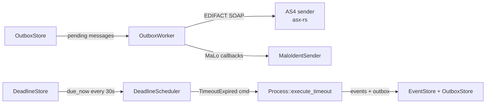

# `makod` Operator Guide

`makod` is the production daemon for the Mako process engine. It assembles all
domain modules (GPKE, WiM, GeLi Gas, MABIS), wires them to a durable
[SlateDB](https://github.com/slatedb/slatedb) event store, and exposes three
independent server ports — AS4 inbound, HTTP REST ingest, and BDEW
API-Webdienste Strom.

---

## Port Layout

```
┌───────────────────────────────────────────────────────────────┐
│  makod                                                        │
│                                                               │
│  :4080  ← AS4/ebMS3 inbound (EDIFACT via SOAP/MTOM)          │
│  :8080  ← HTTP REST API  (POST /edifact, admin endpoints)    │
│  :8090  ← API-Webdienste Strom (iMS REST/JSON)               │
│                                                               │
│  GET /health — available on every enabled port               │
└───────────────────────────────────────────────────────────────┘
```

All three ports are optional and independently enabled via CLI flags or
environment variables. A minimal deployment can use a single port; a full
production deployment uses all three.

---

## Quick Start

### Volatile in-memory mode — **development and CI only**

> **⚠ WARNING — VOLATILE MODE IS NOT FOR PRODUCTION USE ⚠**
>
> When `--data-dir` is omitted and no cloud object store is configured,
> `makod` starts in **volatile in-memory mode**: all event streams, outbox
> messages, snapshots, process registry entries, and deadlines are stored
> in RAM only.
>
> **Any of the following immediately and permanently loses all in-flight
> process state:**
> - Process exit (including graceful shutdown with Ctrl-C)
> - Process crash or OOM kill
> - Container restart or pod rescheduling
> - Host reboot
>
> In volatile mode you cannot:
> - Resume in-flight MaKo processes after restart
> - Guarantee delivery of APERAK and CONTRL responses
> - Meet regulatory audit requirements (§22 MessZV, BDEW AHB)
>
> Use volatile mode only for automated integration tests, local debugging,
> and CI pipelines where data loss is acceptable.

```bash
cargo run -p makod -- \
  --allow-volatile \
  --http-addr 127.0.0.1:8080 \
  --tenant-id 9900357000004
```

Without `--allow-volatile`, makod **refuses to start** in volatile mode and
prints an error directing you to either set `--data-dir` or pass the flag
explicitly.  This prevents accidental production deployments without
persistent storage.

The flag can also be set via the environment variable `MAKOD_ALLOW_VOLATILE=1`
or via the config file (`storage.allow_volatile = true`).

### Persistent local storage

```bash
cargo run -p makod -- \
  --data-dir /var/lib/makod \
  --http-addr 0.0.0.0:8080 \
  --http-api-token "$(openssl rand -hex 32)" \
  --tenant-id 9900357000004
```

### Full production deployment

```bash
makod \
  --data-dir /var/lib/makod \
  --tenant-id 9900357000004 \
  --http-addr 0.0.0.0:8080 \
  --http-api-token "${MAKOD_HTTP_API_TOKEN}" \
  --api-webdienste-addr 0.0.0.0:8090 \
  --as4-addr 0.0.0.0:4080 \
  --as4-party-id 9900357000004 \
  --as4-signing-key-pem-file /etc/makod/signing.key.pem \
  --as4-signing-cert-pem-file /etc/makod/signing.cert.pem \
  --as4-partner 9900000000001=https://partner-a.example/as4/inbox \
  --as4-partner 9900000000002=https://partner-b.example/as4/inbox
```

---

## TOML Configuration File

All CLI flags can be placed in a TOML file and loaded with `--config <FILE>`
(or `MAKOD_CONFIG=<FILE>`). CLI flags and environment variables take precedence
over the config file.

```toml
# /etc/makod/makod.toml

[logging]
level  = "info"     # trace | debug | info | warn | error
format = "json"     # pretty | compact | json

[storage]
backend  = "s3"     # local | s3 | gcs | azure

[storage.s3]
bucket   = "my-makod-events"
prefix   = "makod"              # key prefix within the bucket
# endpoint = "http://minio:9000"  # uncomment for MinIO / S3-compatible

[engine]
tenant_id   = "9900357000004"     # your 13-digit GLN
marktrollen = ["LF"]              # roles this instance may issue commands for

[http]
addr           = "0.0.0.0:8080"
api_token      = "change-me-in-production"
max_body_bytes = 10485760       # 10 MiB (default)

[as4]
addr     = "0.0.0.0:4080"
party_id = "9900357000004"
# Inline PEM (alternative: use *_pem_file to reference disk files)
signing_key_pem_file  = "/etc/makod/signing.key.pem"
signing_cert_pem_file = "/etc/makod/signing.cert.pem"
# Trading partners — bootstrapped into the durable PartnerStore at startup.
# Runtime updates via PUT /admin/partners/{gln} or inbound PARTIN messages.
partners = [
  "9900000000001=https://partner-a.example/as4/inbox",
  "9900000000002=https://partner-b.example/as4/inbox",
]

[webdienste]
addr = "0.0.0.0:8090"
```

### Configuration precedence

```
CLI flags  >  Environment variables  >  Config file  >  Built-in defaults
```

---

## All Configuration Options

### `[logging]` / environment / CLI

| TOML key | Env var | CLI flag | Default | Values |
|---|---|---|---|---|
| `level` | `MAKOD_LOG_LEVEL` | `--log-level` | `info` | `trace` `debug` `info` `warn` `error` |
| `format` | `MAKOD_LOG_FORMAT` | `--log-format` | `pretty` | `pretty` `compact` `json` |

Use `format = "json"` in production for log aggregators (Loki, OpenSearch, CloudWatch).

### `[storage]` — event store backend

| TOML key | Env var | CLI flag | Default | Description |
|---|---|---|---|---|
| `backend` | `MAKOD_OBJECT_STORE` | `--object-store` | `local` | `local` `s3` `gcs` `azure` |
| `data_dir` | `MAKOD_DATA_DIR` | `--data-dir` | *(in-memory)* | Local FS path (backend=local only) |
| `allow_volatile` | `MAKOD_ALLOW_VOLATILE` | `--allow-volatile` | `false` | Must be `true` to run without `data_dir`; **never production** |

When `backend = "local"` and `data_dir` is **omitted**, makod **refuses to start** unless
`allow_volatile` is also set. This is a hard safety guard; it prevents silent accidental
volatile deployments. A `WARN` is emitted at startup. Never omit `data_dir` in
production.

#### `[storage.s3]`

| TOML key | Env var | CLI flag | Description |
|---|---|---|---|
| `bucket` | `MAKOD_S3_BUCKET` | `--s3-bucket` | S3 bucket name *(required)* |
| `prefix` | `MAKOD_S3_PREFIX` | `--s3-prefix` | Key prefix (default: `"makod"`) |
| `endpoint` | `MAKOD_S3_ENDPOINT` | `--s3-endpoint` | Custom endpoint for MinIO/compat |

S3 credentials are read from the standard AWS environment variables:
`AWS_ACCESS_KEY_ID`, `AWS_SECRET_ACCESS_KEY`, `AWS_REGION`.

#### `[storage.gcs]`

| TOML key | Env var | CLI flag | Description |
|---|---|---|---|
| `bucket` | `MAKOD_GCS_BUCKET` | `--gcs-bucket` | GCS bucket name *(required)* |
| `prefix` | `MAKOD_GCS_PREFIX` | `--gcs-prefix` | Key prefix (default: `"makod"`) |

GCS credentials: `GOOGLE_SERVICE_ACCOUNT_KEY` (JSON content) or `GOOGLE_APPLICATION_CREDENTIALS` (path to key file).

#### `[storage.azure]`

| TOML key | Env var | CLI flag | Description |
|---|---|---|---|
| `container` | `MAKOD_AZURE_CONTAINER` | `--azure-container` | Blob container name *(required)* |
| `account` | `MAKOD_AZURE_ACCOUNT` | `--azure-account` | Storage account name *(required)* |
| `prefix` | `MAKOD_AZURE_PREFIX` | `--azure-prefix` | Key prefix (default: `"makod"`) |

Azure credentials: `AZURE_STORAGE_ACCOUNT_KEY`, or service-principal via `AZURE_CLIENT_ID` + `AZURE_TENANT_ID` + `AZURE_CLIENT_SECRET`.

### `[engine]`

| TOML key | Env var | CLI flag | Default | Description |
|---|---|---|---|---|
| `tenant_id` | `MAKOD_TENANT_ID` | `--tenant-id` | `"default"` | Operator GLN or opaque ID |
| `marktrollen` | `MAKOD_MARKTROLLEN` | `--marktrollen` | *(empty — permissive)* | Comma-separated list of Marktrollen this instance is licensed to operate |

Set `tenant_id` to your own 13-digit GLN. All process streams and inbox keys are
scoped to this identifier.

`marktrollen` declares which market-participant roles this deployment is
licensed for.  Commands whose effective Marktrolle is not in this list are
rejected with `422 role_not_configured` before any workflow is touched.
Leave it empty to run in **permissive mode** (no check — useful in development
and for deployments that have not yet restricted their role set).

**Typical values:**

| Operator type | `--marktrollen` value |
|---|---|
| Electricity supplier only | `LF` |
| Dual-fuel supplier | `LF,LFG` |
| Electricity DSO only | `NB` |
| Integrated DSO + MSB (Stadtwerke) | `NB,MSB` |
| Balancing-zone responsible | `BKV` |

### `[http]` — REST admin API

| TOML key | Env var | CLI flag | Default | Description |
|---|---|---|---|---|
| `addr` | `MAKOD_HTTP_ADDR` | `--http-addr` | *(disabled)* | TCP listen address |
| `api_token` | `MAKOD_HTTP_API_TOKEN` | `--http-api-token` | *(none)* | Bearer token for protected endpoints |
| `max_body_bytes` | `MAKOD_HTTP_MAX_BODY_BYTES` | `--http-max-body-bytes` | `10485760` | Max `POST /edifact` body in bytes |

If `api_token` is absent, a startup `WARN` is logged. `GET /health` is always
public. Every other endpoint requires `Authorization: Bearer <token>`.

### `[as4]` — AS4/ebMS3 inbound and outbound

| TOML key | Env var | CLI flag | Description |
|---|---|---|---|
| `addr` | `MAKOD_AS4_ADDR` | `--as4-addr` | TCP listen address |
| `party_id` | `MAKOD_AS4_PARTY_ID` | `--as4-party-id` | Operator GLN (defaults to `engine.tenant_id`) |
| `signing_key_pem` | `MAKOD_AS4_SIGNING_KEY_PEM` | `--as4-signing-key-pem` | PEM key (inline) |
| `signing_key_pem_file` | — | — | Path to PEM key file *(preferred)* |
| `signing_cert_pem` | `MAKOD_AS4_SIGNING_CERT_PEM` | `--as4-signing-cert-pem` | PEM cert (inline) |
| `signing_cert_pem_file` | — | — | Path to PEM cert file *(preferred)* |
| `partners` | `MAKOD_AS4_PARTNER` | `--as4-partner` | Trading-partner GLN=URL pairs |

The `--as4-partner` flag is repeatable. Using the env var, provide a
comma-separated list:

```bash
MAKOD_AS4_PARTNER="9900000000001=https://a.example/as4,9900000000002=https://b.example/as4"
```

Partners are bootstrapped into the durable `PartnerStore` on startup. Changes
made at runtime via the REST API (`PUT /admin/partners/{gln}`) survive restarts
without requiring a redeploy.

### `[webdienste]` — BDEW API-Webdienste Strom

| TOML key | Env var | CLI flag | Description |
|---|---|---|---|
| `addr` | `MAKOD_API_WEBDIENSTE_ADDR` | `--api-webdienste-addr` | TCP listen address |

---

## REST API Endpoints

All REST endpoints are mounted on the `--http-addr` port. `GET /health` is also
mounted on `--as4-addr` and `--api-webdienste-addr`.

### ERP command ingest

| Method | Path | Auth | Description |
|--------|------|------|-------------|
| `POST` | `/api/v1/commands` | ✅ Bearer | Submit an ERP process-trigger command (GPKE, GeLi Gas, WiM, MABIS) |

### EDIFACT ingest

| Method | Path | Auth | Description |
|--------|------|------|-------------|
| `POST` | `/edifact` | ✅ Bearer | Submit a raw EDIFACT interchange for routing and processing |
| `GET` | `/health` | ❌ public | Liveness/readiness probe; pings the SlateDB store |

See the [ERP Commands](#erp-commands-post-apiv1commands) section below for the full endpoint specification.

**`POST /edifact` request:**
```http
POST /edifact HTTP/1.1
Content-Type: text/plain; charset=utf-8
Authorization: Bearer <token>

UNB+UNOC:3+9900357000004:500+4012345000023:500+261001:1200+001++TL
UNH+...
```

**`POST /edifact` response `200 OK`:**
```json
{
  "accepted": 1,
  "rejected": 0,
  "messages": [
    {
      "message_type": "UTILMD",
      "pid": 55001,
      "workflow": "GpkeSupplierChange",
      "status": "routed"
    }
  ]
}
```

---

## ERP Commands (`POST /api/v1/commands`)

This endpoint is the integration point between your ERP system and the MaKo
process engine.  The ERP names the exact process command to trigger; the engine
resolves all EDI-layer details (sender/receiver GLNs, PID, message reference)
from internal state.

### Why not just send EDIFACT?

ERP systems (SAP IS-U, Powercloud, Wilken, Schleupen) model business objects
(MaLo, Lieferant, Zähler), not EDIFACT messages.  This endpoint accepts those
objects and process-specific dates — the engine generates the correct EDIFACT
interchange and dispatches it over AS4.

### Request envelope

```json
{
  "command": "gpke.lieferbeginn.anmelden",
  "payload": {
    "malo_id":            "10001234567",
    "lieferbeginn_datum": "2026-10-01"
  }
}
```

For multi-role commands, include `"marktrolle"` to disambiguate:

```json
{
  "command":    "wim.geraetewechsel.beauftragen",
  "marktrolle": "NB",
  "payload": { "melo_id": "DE00012345678", "wechseldatum": "2026-10-01" }
}
```

| Field | Required | Description |
|---|---|---|
| `command` | ✅ | Dotted command name: `<domain>.<prozess>.<aktion>` |
| `marktrolle` | See below | Required only for multi-role commands; inferred for single-role |
| `payload` | ✅ | Command-specific fields (see payload table below) |

**Recommended:** send an `Idempotency-Key: <uuid>` header to prevent
double-execution on network retries.

### Marktrolle resolution

The engine resolves the effective Marktrolle in two steps:

**Step 1 — Infer or require from request**

- **Single-role commands** (e.g. `gpke.lieferbeginn.anmelden` → always `LF`):
  the Marktrolle is inferred from the command name.  Any `marktrolle` value in
  the request is **silently ignored** — this means ERP connectors that always
  send a fixed role will not break.

- **Multi-role commands** (e.g. `wim.geraetewechsel.beauftragen` → `NB` or
  `MSB`): `marktrolle` **must** be supplied.  The engine cannot infer which
  EDIFACT qualifier and workflow variant to use without it.

**Step 2 — Check against `--marktrollen`**

If the instance was started with `--marktrollen`, the resolved effective role
must appear in that list.  This prevents an LF-licensed deployment from
accidentally issuing NB commands, and vice versa.  If the list is empty,
this check is skipped (permissive mode).

**Error responses:**

| HTTP | `error` field | Cause |
|------|---------------|-------|
| `422` | `command_rejected` / detail `unknown_command` | Command name not in registry |
| `422` | `command_rejected` / detail `marktrolle_required` | Multi-role command, no `marktrolle` supplied |
| `422` | `command_rejected` / detail `role_not_permitted` | Asserted `marktrolle` is not allowed for this command |
| `422` | `command_rejected` / detail `role_not_configured` | Effective role is not in `--marktrollen` |
| `422` | `malo_not_found` | `malo_id` is not in the MaLo cache |
| `422` | `invalid_payload` | Missing or malformed required payload field |
| `500` | `engine_error` | Storage or engine failure |

**Success response `202 Accepted`:**

```json
{
  "idempotency_key": "01924f4e-3b4a-7e12-8c47-0022f4b2d3a1",
  "command":         "gpke.lieferbeginn.anmelden",
  "marktrolle":      "LF",
  "status":          "accepted"
}
```

### Fields the engine owns — never supply these

| Field | Source |
|---|---|
| `sender_gln` | Always our operator GLN from `--tenant-id` |
| `receiver_gln` | Resolved from the MaLo cache (`data_market_location_network_operators`) |
| `pruefidentifikator` | Derived from command name (e.g. `gpke.lieferbeginn.anmelden` → 55001) |
| `message_ref` | Generated by the engine (UUID); replay-stable across retries |
| `document_date` | Today (UTC) at dispatch time |

The MaLo cache is populated by the ERP via `PUT /admin/malo/{malo_id}` using
the NB's `MaloIdentResultPositive` response from the API-Webdienste Strom
endpoint.  If the MaLo is not in the cache, the engine returns
`422 malo_not_found`.

### Command registry

| Command | Marktrolle | Domain | PIDs | Notes |
|---------|-----------|--------|------|---------|
| `gpke.lieferbeginn.anmelden` | `LF` | GPKE | 55001 | New supplier registers supply start |
| `gpke.lieferbeginn.bestaetigen` | `NB` | GPKE | 55003/55004 | DSO accepts/rejects supply start |
| `gpke.lieferende.anmelden` | `LF` | GPKE | 55002 | Old supplier registers supply end |
| `gpke.lieferende.bestaetigen` | `NB` | GPKE | 55005/55006 | DSO accepts/rejects supply end |
| `gpke.kuendigung.anmelden` | `LF` | GPKE | 55017 | LF cancels a Lieferbeginn Anmeldung |
| `gpke.sperrung.bestaetigen` | `LF` | GPKE | 17115/17116/17117 | LF confirms disconnection execution |
| `gpke.abrechnung.annehmen` | `NB` | GPKE | 31001/31002 | DSO settles a Netznutzungsabrechnung |
| `gpke.abrechnung.ablehnen` | `NB` | GPKE | 31001/31002 | DSO disputes a Netznutzungsabrechnung |
| `geli.lieferbeginn.anmelden` | `LFG` | GeLi Gas | 44001 | Gas supplier registers supply start |
| `geli.lieferbeginn.bestaetigen` | `GNB` | GeLi Gas | 44003/44004 | Gas DSO accepts/rejects supply start |
| `geli.lieferende.anmelden` | `LFG` | GeLi Gas | 44002 | Gas supplier registers supply end |
| `geli.lieferende.bestaetigen` | `GNB` | GeLi Gas | 44005/44006 | Gas DSO accepts/rejects supply end |
| `wim.geraetewechsel.beauftragen` | `NB` or `MSB` | WiM | 11001 | Commission a meter-device change |
| `wim.geraetewechsel.bestaetigen` | `MSB` | WiM | 11001 | MSB confirms physical device swap |
| `mabis.abrechnung.einleiten` | `BKV` | MABIS | 13003 | Open a balancing-zone billing period |
| `mabis.abrechnung.daten-einreichen` | `BKV` | MABIS | 13003 | Submit pre-aggregated meter data |
| `mabis.abrechnung.begleichen` | `BKV` or `ÜNB` | MABIS | 13003 | Mark billing period settled |

Commands with a single Marktrolle never need a `marktrolle` field.
Commands listing two Marktrollen (`NB`/`MSB`, `BKV`/`ÜNB`) **always** require it.

### ERP payload fields per command

Only fields the ERP genuinely owns are listed here.
GLNs resolved by the engine (sender, receiver) are intentionally absent.

| Command | Required ERP payload fields |
|---------|-----------------------------|
| `gpke.lieferbeginn.anmelden` | `malo_id`, `lieferbeginn_datum` |
| `gpke.lieferende.anmelden` | `malo_id`, `lieferende_datum` |
| `gpke.kuendigung.anmelden` | `malo_id`, `kuendigung_datum`, `alter_lf_gln`¹ |
| `gpke.sperrung.bestaetigen` | `malo_id`, `ausfuehrungsdatum` |
| `gpke.abrechnung.annehmen` | `rechnung` (BO4E `RECHNUNG` object) |
| `gpke.abrechnung.ablehnen` | `rechnung` (BO4E `RECHNUNG` object), `ablehnungsgrund` |
| `geli.lieferbeginn.anmelden` | `malo_id` (gas MaLo), `lieferbeginn_datum` |
| `geli.lieferende.anmelden` | `malo_id` (gas MaLo), `lieferende_datum` |
| `wim.geraetewechsel.beauftragen` | `melo_id`², `wechseldatum` |
| `mabis.abrechnung.einleiten` | `bilanzierungsgebiet`, `abrechnungszeitraum_von`, `abrechnungszeitraum_bis` |

¹ `alter_lf_gln` is required only when the old supplier is a different legal entity.
  The ERP derives it from contract data; the engine does not know the previous LF.

² For WiM Gerätewechsel the primary key is the `melo_id` (Messlokation), not the MaLo.
  The NB and MSB GLNs are resolved from the MeLo cache entry.

### Integrated operators (NB + MSB, same GLN)

A Stadtwerke operating as both NB and MSB has **one GLN** in the
BDEW Marktstammdatenregister.  Start makod with `--marktrollen NB,MSB`.
For multi-role commands, `marktrolle` selects the EDIFACT qualifier
(`DDM` for NB, `MS` for MSB) and the correct workflow variant — it is a
**dispatch hint**, not an identity claim.

#### In-process loopback for self-addressed outbox messages

Several workflows emit outbox messages addressed to a co-located role's GLN
as part of their normal process flow:

| Message | Workflow | Sender → Recipient |
|---|---|---|
| ORDERS 17116 (Anfrage Sperrung Strom) | `gpke-sperrung` | NB → MSB |
| ORDERS 17116 (Anfrage Gas-Sperrung) | `geli-gas-sperrung-nb` | GNB → gMSB |
| ORDERS 17134/17135 (Konfiguration) | `gpke-konfiguration` | NB → MSB |
| ORDERS 17001/17009 (Geräteübernahme) | `wim-geraeteubernahme` | NB → MSBA |

When NB and MSB (or GNB and gMSB) share the same `tenant_party_id` — the
typical configuration for an integrated Stadtwerke deployment — `BdewAs4Sender`
detects this automatically and delivers the message via an **in-process
loopback** instead of an AS4 round-trip:

1. Renders the EDIFACT interchange (identical to external delivery).
2. Re-parses it via `Platform::parse_interchange`.
3. Passes each parsed message to `EdifactIngestDispatcher::dispatch`, which
   spawns or resumes the correct workflow process with zero network overhead.

No `--as4-partner OWN_GLN=...` registration is required.  `--marktrollen
NB,MSB` (or `GNB,gMSB`) is still required so the Command API accepts
multi-role ERP commands.

**Dispatch table for loopback-delivered messages:**

| PID(s) received via loopback | Action | Workflow |
|---|---|---|
| 17115, 17117 (ORDERS Strom) | spawn by MaLo | `gpke-sperrung` — `ReceiveSperrauftrag` |
| 17115, 17117 (ORDERS Gas) | spawn by MaLo | `geli-gas-sperrung-nb` — `ReceiveSperrung` |
| 19118, 19119 (ORDRSP) | resume by MaLo | `gpke-sperrung` — `ReceiveMsbAntwort` |
| 19116, 19117 (ORDRSP) | resume by MaLo | `gpke-sperrung-lf` — `ReceiveOrdrsp` |
| 19116, 19117 (ORDRSP Gas) | resume by MaLo | `geli-gas-sperrung-lf` — `ReceiveOrdrsp` |
| 55001, 55002, 55016 | spawn by MaLo | `gpke-supplier-change` — `ReceiveUtilmd` |
| 55003–55006, 55017, 55018 | resume by MaLo | `gpke-lf-anmeldung` — `ReceiveAntwort` |
| 44001–44021 | spawn by MaLo | `geli-gas-supplier-change` — `ReceiveUtilmd` |

**PIDs without a registered handler** — for example, ORDERS 17116 when no
autonomous gMSB-side workflow is running — are **acknowledged immediately** with
a `warn!` log.  The outbox entry is not retried.  The waiting NB/GNB workflow
continues until the APERAK deadline fires or the ERP delivers a confirmation
via the Command API:

```bash
# Confirm disconnection execution for an NB workflow (no gMSB workflow running):
curl -X POST http://localhost:8080/api/v1/commands \
  -H "Authorization: Bearer ${TOKEN}" \
  -H "Content-Type: application/json" \
  -d '{
    "command": "gpke.sperrung.bestaetigen",
    "marktrolle": "NB",
    "malo_id": "DE0000000000000000000000000000001",
    "ausfuehrungsdatum": "2025-11-01"
  }'
```

---

### Partner management (`/admin/partners/`)

| Method | Path | Description |
|--------|------|-------------|
| `GET` | `/admin/partners` | List all trading-partner records for this tenant |
| `GET` | `/admin/partners/{gln}` | Retrieve a single partner record |
| `PUT` | `/admin/partners/{gln}` | Create or update a partner record |
| `DELETE` | `/admin/partners/{gln}` | Remove a partner record |
| `POST` | `/admin/partners/import` | Import from a raw PARTIN EDIFACT interchange |

**`PUT /admin/partners/{gln}` request body:**
```json
{
  "gln": "9900000000001",
  "display_name": "Stadtwerke Beispiel GmbH",
  "channels": [
    { "qualifier": "AK", "address": "https://partner.example/as4/inbox" },
    { "qualifier": "EM", "address": "edifact@partner.example" }
  ],
  "roles": ["NbStrom"],
  "valid_from": "2025-10-01T00:00:00Z",
  "country_code": "DE"
}
```

**Response `200 OK`:**
```json
{
  "gln": "9900000000001",
  "display_name": "Stadtwerke Beispiel GmbH",
  "updated_at": "2026-06-17T10:00:00Z"
}
```

### MaLo cache (`/admin/malo/`)

| Method | Path | Description |
|--------|------|-------------|
| `GET` | `/admin/malo/{malo_id}` | Retrieve a cached MaLo record |
| `PUT` | `/admin/malo/{malo_id}` | Upsert a MaLo record |
| `DELETE` | `/admin/malo/{malo_id}` | Remove a MaLo record |
| `GET` | `/admin/malo/stats` | Per-tenant statistics |

---

## Docker Deployment

```dockerfile
FROM rust:1.88-slim AS builder
WORKDIR /src
COPY . .
RUN cargo build -p makod --release --features slatedb

FROM debian:bookworm-slim
RUN apt-get update && apt-get install -y ca-certificates && rm -rf /var/lib/apt/lists/*
COPY --from=builder /src/target/release/makod /usr/local/bin/makod
VOLUME ["/var/lib/makod", "/etc/makod"]
EXPOSE 4080 8080 8090
ENTRYPOINT ["makod"]
```

Mount your signing keys into `/etc/makod/` and point `--config` at a TOML file:

```bash
docker run -d \
  -v /srv/makod/data:/var/lib/makod \
  -v /srv/makod/config:/etc/makod \
  -p 4080:4080 -p 8080:8080 \
  -e MAKOD_CONFIG=/etc/makod/makod.toml \
  makod:latest
```

### Kubernetes example

```yaml
apiVersion: apps/v1
kind: Deployment
metadata:
  name: makod
spec:
  replicas: 1          # ← single writer; see Scaling below
  selector:
    matchLabels: { app: makod }
  template:
    metadata:
      labels: { app: makod }
    spec:
      containers:
        - name: makod
          image: ghcr.io/your-org/makod:latest
          ports:
            - containerPort: 4080    # AS4
            - containerPort: 8080    # HTTP REST
            - containerPort: 8090    # Webdienste
          env:
            - name: MAKOD_CONFIG
              value: /etc/makod/makod.toml
            - name: MAKOD_HTTP_API_TOKEN
              valueFrom:
                secretKeyRef: { name: makod-secrets, key: http-api-token }
          volumeMounts:
            - name: config
              mountPath: /etc/makod
            - name: data
              mountPath: /var/lib/makod
          livenessProbe:
            httpGet: { path: /health, port: 8080 }
            initialDelaySeconds: 5
          readinessProbe:
            httpGet: { path: /health, port: 8080 }
      volumes:
        - name: config
          secret: { secretName: makod-config }
        - name: data
          persistentVolumeClaim: { claimName: makod-data }
```

### Scaling

SlateDB uses snapshot-isolation OCC transactions. For `local` and `s3` backends,
only **one writer** at a time is safe — run `replicas: 1`. Multiple readers can
share the same store via read-only `SlateDbStore::open_read_only()`.

For high-availability, use an S3-compatible object store and implement a leader
election layer (e.g. Kubernetes leader election, etcd) to ensure only one makod
instance writes at a time.

---

## Health Checks

`GET /health` is mounted on every enabled port.

```
HTTP 200 {"status":"ok","store":"open"}      ← store is healthy
HTTP 503 {"status":"degraded","store":"err"} ← store closed or unreachable
```

In Kubernetes, target the `--http-addr` port for both liveness and readiness
probes. Target `--as4-addr` separately if the AS4 server must be healthy before
traffic is routed.

---

## Background Workers

Three background tasks run continuously after startup:



| Worker | Poll interval | Purpose |
|--------|--------------|---------|
| **OutboxWorker** | Continuous, exponential backoff | Drains `OutboxStore` and delivers via AS4 or HTTP |
| **DeadlineScheduler** | Every 30 s | Fires overdue process deadlines (APERAK Frist, Zahlungsfrist) |

---

## Logging

### Structured JSON (production)

```toml
[logging]
level  = "info"
format = "json"
```

Log lines look like:

```json
{"timestamp":"2026-06-17T10:00:00.000Z","level":"INFO","target":"makod","fields":{"addr":"0.0.0.0:8080","authenticated":true,"msg":"HTTP REST API listening"}}
```

### Tracing spans

Enable the `tracing` feature in `edi-energy` to get per-message parse/validate
spans:

```toml
edi-energy = { version = "0.5", features = ["tracing"] }
```

These integrate with OpenTelemetry exporters when a global subscriber is
configured. The `makod` daemon wires a `tracing_subscriber::Registry` at
startup — set `RUST_LOG=mako_engine=debug,edi_energy=debug` for verbose output.

---

## Secrets Management

Never embed secrets (signing keys, API tokens) in container images or version
control. Use:

| Method | How |
|---|---|
| **Kubernetes Secrets** | Mount as volume files; use `signing_key_pem_file` config key |
| **Docker Secrets** | `docker secret create makod-key signing.pem`; bind-mount into container |
| **Environment variables** | `MAKOD_AS4_SIGNING_KEY_PEM` (inline PEM); `MAKOD_HTTP_API_TOKEN` |
| **AWS Secrets Manager** | Fetch at startup via init container; write to tmpfs volume |

For the signing key and cert, **always prefer the `*_pem_file` variant** over
inline PEM — it avoids the key appearing in process environment listings or
container inspect output.

---

## Operational Runbook

### First-time setup

```bash
# 1. Generate a signing keypair (RSA 2048 minimum; RSA 4096 recommended for production)
openssl genrsa -out signing.key.pem 4096
openssl req -new -x509 -key signing.key.pem -out signing.cert.pem -days 3650 \
  -subj "/CN=9900357000004/O=Stadtwerke Beispiel/C=DE"

# 2. Register the certificate with your trading partners (out-of-band via BDEW)

# 3. Start makod
makod --config /etc/makod/makod.toml

# 4. Seed partner records (if not already in config)
curl -X PUT http://localhost:8080/admin/partners/9900000000001 \
  -H "Authorization: Bearer ${TOKEN}" \
  -H "Content-Type: application/json" \
  -d '{
    "gln": "9900000000001",
    "channels": [{"qualifier":"AK","address":"https://partner.example/as4/inbox"}]
  }'
```

### Checking the store is healthy

```bash
curl -s http://localhost:8080/health | jq .
# → {"status":"ok","store":"open"}
```

### Submitting a test EDIFACT message

```bash
curl -X POST http://localhost:8080/edifact \
  -H "Authorization: Bearer ${TOKEN}" \
  -H "Content-Type: text/plain; charset=utf-8" \
  --data-binary @my_message.edi
```

### Listing registered trading partners

```bash
curl http://localhost:8080/admin/partners \
  -H "Authorization: Bearer ${TOKEN}" | jq '.partners[].gln'
```

---

## Observability
{: #observability }

`makod` exports OpenTelemetry traces and metrics via OTLP (gRPC or HTTP).
Every significant operation carries a trace context:

| Signal | What is instrumented |
|---|---|
| **Traces** | Inbound AS4/REST request → parse → route → execute → WriteBatch |
| **Traces** | OutboxWorker delivery attempts (success / retry / dead-letter) |
| **Traces** | DeadlineScheduler tick — due_now scan → TimeoutExpired dispatch |
| **Metrics** | `mako.events.appended` counter (by workflow, tenant) |
| **Metrics** | `mako.outbox.pending` gauge (by tenant) |
| **Metrics** | `mako.deadline.fired` counter (by workflow, label) |
| **Metrics** | `mako.process.duration_ms` histogram |

### Configuration

```toml
[otel]
endpoint    = "http://otel-collector:4317"   # OTLP gRPC
service_name = "makod"
# or: endpoint = "http://otel-collector:4318"  # OTLP HTTP
```

Or via environment:

```bash
OTEL_EXPORTER_OTLP_ENDPOINT=http://otel-collector:4317 \
OTEL_SERVICE_NAME=makod \
makod --data-dir /var/lib/makod ...
```

Omit the `[otel]` section entirely to disable telemetry with zero overhead — the instrumentation compiles to a no-op when the feature is off.

---

## See Also

- [Getting Started](./getting-started.md) — first workflow in 5 minutes
- [Process Engine Guide](./engine.md) — event-sourcing architecture
- [ERP Integration](./erp-integration.md) — CloudEvents 1.0 webhooks, Command API, receiver implementation guide
- [API-Webdienste Strom](./api-webdienste.md) — REST/JSON channel for iMS processes
- [Annual Release Workflow](./annual-release-workflow.md) — incorporating new BDEW specs
