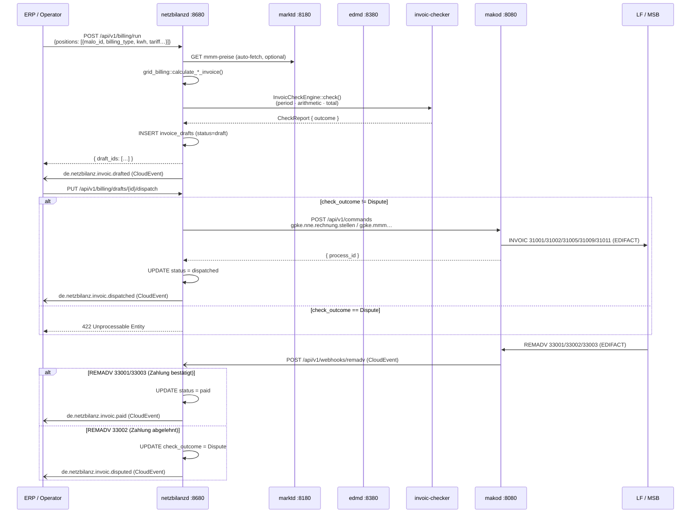
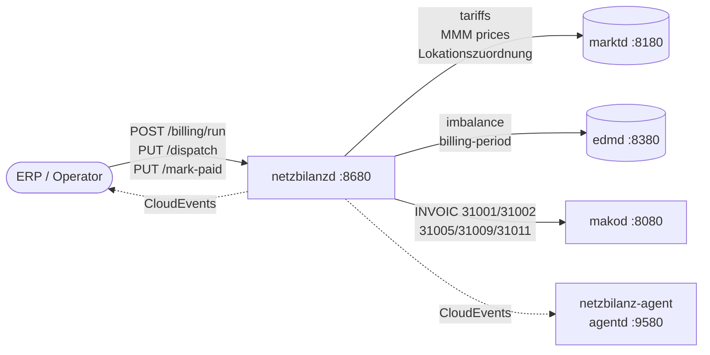
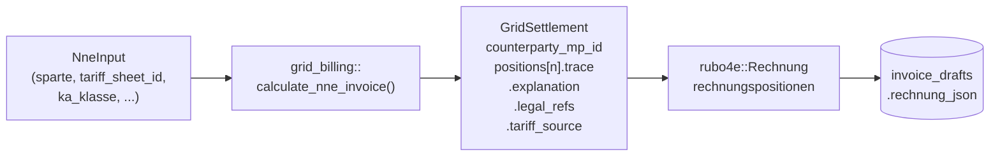
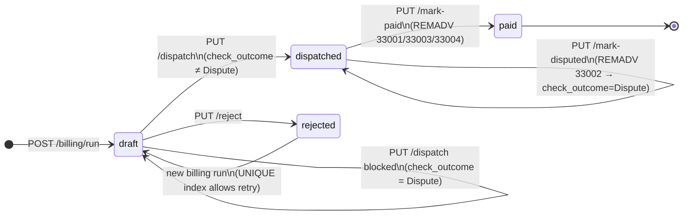
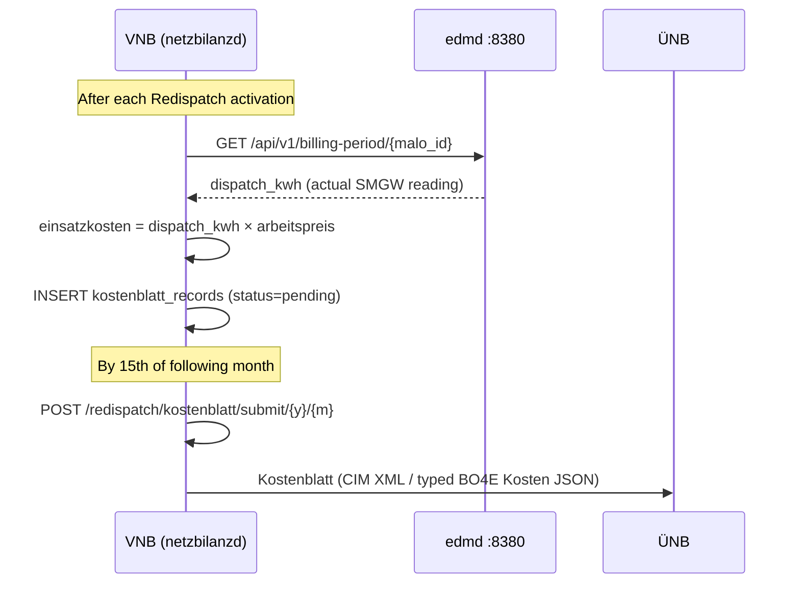

# `netzbilanzd` Operator Guide
{: .no_toc }

`netzbilanzd` automates the full outbound billing cycle for network operators (NB, GNB):
generating Netznutzungsentgelt (NNE), Konzessionsabgabe (KA),
Mehr-/Mindermengen (MMM), MSB-Rechnung, and GeLi Gas AWH Sperrprozesse invoices;
running mandatory pre-dispatch plausibility checks; dispatching via `makod`; and
updating payment status when REMADV responses arrive.

**Port:** `:8680`  
**Storage:** PostgreSQL (`invoice_drafts`, `kostenblatt_records`, `fremdkosten_records`)  
**Role:** NB (Netzbetreiber) / GNB (Gasnetzbetreiber) only

{: .toc }
1. TOC
{:toc}

---

## Architecture

### Full billing lifecycle



### Service integration topology



### Billing pipeline (step by step)

1. **Input collection** — ERP provides meter readings (`arbeitsmenge_kwh`, `spitzenleistung_kw`)
   and tariff data (`arbeitspreis_ct_per_kwh`, `leistungspreis_eur_per_kw`, `ka_satz_ct_per_kwh`).

   **Tariff auto-fetch exceptions** — the following fields are optional when
   `netzbilanzd` can resolve them automatically:

   | Field | Auto-fetch source | Condition |
   |---|---|---|
   | `mehr_preis_ct_per_kwh` (Gas) | `marktd GET /api/v1/mmma-preise/gas/{y}/{m}` | `billing_type = "mmm_gas"` |
   | `mehr_preis_ct_per_kwh` (Strom) | `marktd GET /api/v1/mmm-preise/strom/{y}/{m}` | `billing_type = "mmm_strom"` + `vnb_mp_id` configured |
   | `minder_preis_ct_per_kwh` | Same as above | Same as above |
   | `lastprofil` | `marktd GET /api/v1/malo/{id}` → `bilanzierungsmethode` | `billing_type = "mmm_*"`, field absent |

2. **Invoice generation** — pure `grid-billing` library, no I/O.
   Returns `GridSettlement` (domain type, no BO4E dep) with:
   - **`counterparty_mp_id`** — auto-populated from `lf_mp_id` (NNE/MMM) or `msb_mp_id` (PID 31009)
   - **`CalculationTrace`** per position — `explanation`, `legal_refs`, `tariff_source`, `gross_eur`
   - **`LegalReference`** list — e.g. `StromNEV §21`, `KAV §2 Abs. 2`, `§14a EnWG Modul 2`
   - **`Sparte`** on input drives legal refs + `SettlementType` automatically (`Gas` → `GasNEV §14`, PID 31005)

   `netzbilanzd` calls `into_rechnung()` locally before validation and serialization.

3. **Self-validation** — `invoic-checker` checks 1–3 run immediately.
   Check outcomes: `Ok` → safe to dispatch; `Warn` → operator review; `Dispute` → **blocks dispatch**.

4. **Draft persistence** — every invoice stored in `invoice_drafts` with `status = 'draft'`.
   Double-billing is prevented by a partial `UNIQUE` index on `(tenant, malo_id, period_from, period_to, pid)`
   for `rechnungsart = 'RECHNUNG'` (Stornorechnung/Korrekturrechnung allowed).

5. **Operator review** — list drafts with `GET /api/v1/billing/drafts`;
   inspect full `rechnung` BO4E payload with `GET /api/v1/billing/drafts/{id}`.

6. **Dispatch** — `PUT /api/v1/billing/drafts/{id}/dispatch` re-validates
   then issues the corresponding `makod` command.
   The invoice recipient (`counterparty_mp_id`) is set automatically by `grid-billing`
   from the input: `lf_mp_id` for NNE/MMM, `msb_mp_id` for `msb_31009`.
   No separate lookup required.

7. **Payment lifecycle** — REMADV responses update `status` automatically via
   the `POST /api/v1/webhooks/remadv` CloudEvent endpoint.

---

## Regulatory baseline (2026)

**StromNZV and GasNZV ceased to apply with the end of 31.12.2025** (Art. 15 Abs. 4
resp. Abs. 6 of the Gesetz v. 22.12.2023, BGBl. 2023 I Nr. 405). The successor
competence is §20 Abs. 3 EnWG, exercised through BNetzA Festlegungen — for MMM
Strom that is **GPKE (BK6-24-174) Teil 1 Kap. 8.4**, for MMM Gas **GaBi Gas 2.1
(BK7-24-01-008)**.

Two consequences for this service:

- **MMM prices come from the VNB, not the ÜNB.** GPKE Kap. 8.4 Nr. 3: *"Der
  Betreiber von Elektrizitätsverteilernetzen berechnet für Jahresmehr- und
  Jahresmindermengen auf Grundlage der monatlichen Marktpreise einen einheitlichen
  Preis."* The distribution operator computes and publishes it on its own site.
- **Konzessionsabgabe is KAV §2**, never StromNZV. The rate bands key on
  municipality inhabitants, not annual consumption — see `grid-billing`.

### Mehr-/Mindermengen sign convention

| Measurement vs profile | Quantity | Money |
|---|---|---|
| measured **<** profiled | ungewollte **Mehrmenge** | NB vergütet → credit |
| measured **>** profiled | ungewollte **Mindermenge** | NB stellt in Rechnung → charge |

Named from the network operator's side: consuming below the profile leaves
surplus energy the network absorbed, and that surplus is reimbursed.

---

## Billing types

| `billing_type` | PID | Direction | Description | Regulatory basis |
|---|---|---|---|---|
| `nne_strom` | 31001 | NB → LF | Netznutzungsentgelt Strom, monthly | GPKE BK6-22-024 |
| `mmm_strom` | 31002 | NB → LF | Mehr-/Mindermengensaldo Strom | GPKE (BK6-24-174) Teil 1 Kap. 8.4 |
| `mmm_gas` | 31002 | GNB → LFG | Mehr-/Mindermengensaldo Gas (THE prices) | GaBi Gas 2.1 (BK7-24-01-008) |
| `nne_gas` | 31005 | GNB → LFG | Netznutzungsentgelt Gas, monthly | GasNEV |
| `msb_31009` | 31009 | NB → MSB | MSB-Rechnung (metering service) | WiM BK6-24-174 |
| `nne_gas_awh_31011` | 31011 | GNB → LFG | AWH Sperrprozesse Gas (Abrechnungswürdige Handlungen) | GeLi Gas 3.0 (BK7-24-01-009) §5.4 |

> `"mmm"` (legacy alias) maps to `"mmm_strom"`. Use `"mmm_strom"` or `"mmm_gas"` in new integrations.

### NNE billing positions

| # | Position | Formula | Condition |
|---|---|---|---|
| 1 | Netznutzung Arbeit | `kwh × ct/kWh ÷ 100` | Always (flat) |
| 2 | Netznutzung Leistung (RLM) | `spitzenleistung_kw × EUR/kW` | When `spitzenleistung_kw` supplied |
| 3 | Konzessionsabgabe | `kwh × ka_ct/kWh ÷ 100` | When `ka_satz_ct_per_kwh` supplied |

### §14a Modul 2 — Time-of-Use NNE (mandatory since 01.01.2024)

For controllable loads (Wärmepumpen, Wallboxen, §14a-eligible assets), set
`arbeitsmenge_ht_kwh` **and** `arbeitsmenge_nt_kwh` to split the Arbeit position
into separate HT (Hochlast) and NT (Niedertarif) positions:

| # | Position | Formula | Condition |
|---|---|---|---|
| 1 | Netznutzung Arbeit HT | `ht_kwh × ht_ct/kWh ÷ 100` | HT/NT split supplied |
| 2 | Netznutzung Arbeit NT | `nt_kwh × nt_ct/kWh ÷ 100` | HT/NT split supplied |
| 3 | Netznutzung Leistung (RLM) | `spitzenleistung_kw × EUR/kW` | When set |
| 4 | Konzessionsabgabe | `(ht_kwh + nt_kwh) × ka_ct/kWh ÷ 100` | When set |

**Data sources for §14a ToU:**
- HT/NT split → `edmd GET /api/v1/billing-period/{malo_id}` (OBIS codes HT/NT)
- Band prices → `marktd GET /api/v1/preisblaetter/{nb_mp_id}` → field `zeitvariable_preispositionen`

### §14a Modul 1 — Flat reduction (mandatory offer since 01.01.2024)

For controllable loads that choose Modul 1 instead of HT/NT metering, set
`sect14a_modul1_reduction_factor` (e.g. `0.85` for 15% reduction per BK6-22-300 Anlage 2):

| # | Position | Formula | Condition |
|---|---|---|---|
| 1 | Netznutzung Arbeit §14a Modul 1 (85% Reduzierung) | `kwh × (ct × 0.85) ÷ 100` | `sect14a_modul1_reduction_factor` set |

> Modul 1 and Modul 2 (HT/NT) are **mutually exclusive**. The validator rejects both
> being set simultaneously (`MODUL1_AND_MODUL2_CONFLICT`).

### MMM billing positions

| # | Position | Formula | Condition |
|---|---|---|---|
| 1 | Mehrmengen | `max(0, actual − profil) × mehr_ct ÷ 100` | actual > profil |
| 2 | Mindermengen (Gutschrift) | `−max(0, profil − actual) × minder_ct ÷ 100` | profil > actual |

### MSB billing positions

| # | Position | Formula | Condition |
|---|---|---|---|
| 1 | Grundgebühr Messstellenbetrieb | `grundgebuehr_eur/month × months` | Always |
| 2 | Messdienstleistung | flat amount | When `messdienstleistung_eur` supplied |

### Gas NNE with Grundpreis (GasNEV §14 monthly standing charge)

When the Gas tariff includes a monthly base fee, supply `nne_grundpreis_eur_per_month`
alongside `nne_grundpreis_months`. The resulting `Grundpreis` position uses article
code `9990001 00008 7` (BDEW Codeliste v5.6).

### §42a GGV — Community solar / shared metering

`POST /api/v1/billing/ggv-nne/{ggv_malo_id}` generates N × INVOIC 31001 drafts,
one per GGV tenant MaLo. Proportional attribution via `tenant_consumption` map or
equal-split fallback when consumption data is unavailable. The GGV topology is
auto-discovered from `marktd` Lokationszuordnung (edges `beziehungstyp = "GGV_MIETER"`).

---

## BDEW Artikelnummern

`netzbilanzd` automatically populates `Rechnungsposition.artikelnummer` and
`Rechnungsposition.artikel_id` on every generated invoice position using the
`kind_to_artikelnummer()` function in `into_rechnung()`.

Source: BDEW Codeliste Artikelnummern und Artikel-ID v5.6 (valid 01.09.2025).

| Position type | `BillingPositionKind` | `BdewArtikelnummer` | Artikelnummer code |
|---|---|---|---|
| NNE Gas Arbeit (all types) | `NneArbeit*` | `Wirkarbeit` | `9990001 00026 9` |
| NNE Gas Leistung | `NneLeistung` | `Leistung` | `9990001 00005 3` |
| Gas Grundpreis | `NneGasGrundpreis` | `Grundpreis` | `9990001 00008 7` |
| Konzessionsabgabe | `Konzessionsabgabe` | `Konzessionsabgabe` | `9990001 00041 7` |
| Mehrmengen | `Mehrmenge` | `Mehrmenge` | `9990001 00074 8` |
| Mindermengen | `Mindermenge` | `Mindermenge` | `9990001 00075 6` |
| MSB Grundgebühr | `MsbGrundgebuehr` | `EntgeltEinbauBetriebWartungMesstechnik` | `9990001 00061 5` |
| Messdienstleistung | `Messdienstleistung` | `EntgeltMessungAblesung` | `9990001 00062 3` |
| Blindmehrarbeit | `Blindmehrarbeit` | `Blindmehrarbeit` | `9990001 00047 5` |

> **NNE Strom (PIDs 31001/31006):** BK6-20-160 replaced classic `artikelnummer` with
> `artikel_id` from the BNetzA Netznutzungspreisblatt. The `netzbilanzd` billing run
> handler must populate `InvoicePosition.artikel_id` from the `PreisblattNetznutzung`
> article ID (e.g. `"1-02-5-001"` for NS Grundpreis-/Arbeitspreissystem Arbeitspreis)
> before calling `into_rechnung()`. The `artikel_id` flows automatically to
> `Rechnungsposition.artikel_id` in the BO4E output.

**AWH Gas Sperrprozesse (PID 31011)** use `artikel_id` from section 3.2 of the codelist:

| Action | `artikel_id` |
|---|---|
| Sperrung (reguläre AZ) | `2-01-7-001` |
| Entsperrung (reguläre AZ) | `2-01-7-002` |
| Erfolglose Unterbrechung | `2-01-7-003` |
| Stornierung (bis Vortag) | `2-01-7-004` |
| Stornierung (am Sperrtag) | `2-01-7-005` |
| Entsperrung (außerhalb AZ) | `2-01-7-006` |

Set `AwhPositionInput.artikel_id` to the appropriate code when building the `POST /billing/run` request.

---

## Calculation audit trail

Every `GridSettlement` returned by `grid-billing` carries a full `CalculationTrace`
per position. This answers *"why is this amount on the invoice?"* without re-running
the calculation — a BNetzA §20 EnWG regulatory requirement.

```
GET /api/v1/billing/drafts/{id}
→ rechnung JSONB
  rechnungspositionen[0].positionstext = "Netznutzung Arbeit HT (§14a Modul 2)"
  trace.explanation  = "600.000 kWh × 0.042000 EUR/kWh = 25.20000 EUR"
  trace.legal_refs   = ["§14a EnWG Modul 2", "BNetzA BK6-22-300", "StromNEV §21"]
  trace.tariff_source.sheet_id = "Preisblatt-NNE-2026-Q1"
  trace.gross_eur    = 25.200000
```

`netzbilanzd` stores the `rechnung` BO4E JSON in `invoice_drafts.rechnung_json`.
The trace is embedded in the `zusatz_attribute` of each position by `into_rechnung()`
so it survives serialization.



### Legal references by billing type

| Billing type | Arbeit basis | Leistung basis | KA basis | MMM basis |
|---|---|---|---|---|
| `nne_strom` | StromNEV §21 | StromNEV §17 | KAV §2 Abs. 2 | — |
| `nne_strom` + §14a | §14a EnWG Modul 2 · BNetzA BK6-22-300 | StromNEV §17 | KAV §2 Abs. 2 | — |
| `nne_gas` | GasNEV §14 | — | — | — |
| `mmm_strom` | — | — | — | GPKE (BK6-24-174) Teil 1 Kap. 8.4 · GPKE BK6-22-024 |
| `mmm_gas` | — | — | — | GaBi Gas 2.1 (BK7-24-01-008) · GeLi Gas 3.0 (BK7-24-01-009) |
| `msb_31009` | — | — | — | MsbG §§6–7 · MsbG §2 |

---

## HTTP API reference

### Billing run

```
POST /api/v1/billing/run
```

```json
{
  "nb_mp_id":               "9900357000004",
  "lf_mp_id":               "9900012345678",
  "invoice_date":           "2026-02-15",
  "due_date":               "2026-03-17",
  "rechnungsnummer_prefix": "NNE-2026-01",
  "positions": [
    {
      "malo_id":                  "51238696780",
      "period_from":              "2026-01-01",
      "period_to":                "2026-01-31",
      "billing_type":             "nne_strom",
      "arbeitsmenge_kwh":         "1500.000",
      "arbeitspreis_ct_per_kwh":  "3.500",
      "spitzenleistung_kw":       "12.500",
      "leistungspreis_eur_per_kw":"4.200",
      "ka_satz_ct_per_kwh":       "1.320"
    }
  ]
}
```

Response `201 Created`:
```json
{ "draft_ids": ["550e8400-e29b-41d4-a716-446655440000"] }
```

### §14a Modul 2 example

```json
{
  "billing_type": "nne_strom",
  "malo_id":      "51238696780",
  "period_from":  "2026-01-01",
  "period_to":    "2026-01-31",
  "arbeitsmenge_kwh":           "1000.000",
  "arbeitspreis_ct_per_kwh":    "3.500",
  "arbeitsmenge_ht_kwh":        "600.000",
  "arbeitspreis_ht_ct_per_kwh": "4.200",
  "arbeitsmenge_nt_kwh":        "400.000",
  "arbeitspreis_nt_ct_per_kwh": "1.500",
  "ka_satz_ct_per_kwh":         "1.320"
}
```

### MMM auto-run (recommended)

For SLP MaLos the entire MMM calculation — including edmd profil_kwh fetch
and optional marktd MMM price lookup — is automated:

```
POST /api/v1/billing/mmm-run/{malo_id}
{
  "nb_mp_id":    "9900357000004",
  "lf_mp_id":    "9900012345678",
  "period_year": 2026,
  "period_month": 1
}
```

Auto-fetches: `profil_kwh` ← `edmd /imbalance/{malo_id}`;
prices ← `marktd /mmm-preise/strom` (when `vnb_mp_id` configured) or `marktd /mmma-preise/gas`.

### Draft lifecycle endpoints

| Method | Path | Description |
|---|---|---|
| `GET`  | `/api/v1/billing/drafts` | List (`?status=&malo_id=&nb_mp_id=&limit=`) |
| `GET`  | `/api/v1/billing/drafts/{id}` | Full Rechnung BO4E JSON |
| `PUT`  | `/api/v1/billing/drafts/{id}/dispatch` | Validate + dispatch to makod |
| `PUT`  | `/api/v1/billing/drafts/{id}/reject` | Reject with reason |
| `PUT`  | `/api/v1/billing/drafts/{id}/mark-paid` | REMADV 33001/33003/33004 — payment confirmed |
| `PUT`  | `/api/v1/billing/drafts/{id}/mark-disputed` | REMADV 33002 — dispute received |
| `POST` | `/api/v1/billing/drafts/dispatch-batch` | Dispatch all approved drafts (max 500) |
| `POST` | `/api/v1/billing/drafts/{id}/correction` | Create Stornorechnung or Korrekturrechnung |

#### mark-paid request body

```json
{ "remadv_ref": "33001-2026-01-REF-001" }
```

#### mark-disputed request body

```json
{ "erc_code": "Z32", "reason": "Arbeitspreis weicht von PRICAT ab" }
```

Common ERC codes: `Z32` = Tariff deviation, `Z34` = Period invalid, `Z35` = MMM price deviation.

### REMADV webhook (automatic lifecycle)

Wire your `makod` outbox or ERP to:
```
POST /api/v1/webhooks/remadv
Content-Type: application/cloudevents+json

{
  "specversion": "1.0",
  "type": "de.invoic.receipt.settled",
  "source": "makod",
  "data": {
    "draft_id": "550e8400-...",
    "remadv_ref": "33001-REF-001"
  }
}
```

Accepted `type` values: `de.invoic.receipt.settled`, `de.invoic.receipt.disputed`,
`de.netzbilanz.invoic.paid`, `de.netzbilanz.invoic.disputed`.

### Analytics and audit

| Method | Path | Description |
|---|---|---|
| `GET`  | `/api/v1/billing/summary` | Monthly totals by PID × status (`?year=&month=`) |
| `GET`  | `/api/v1/billing/audit` | § 147 AO / GoBD BNetzA audit export (`?from=&to=&pid=&status=&limit=`) |
| `GET`  | `/api/v1/billing/malo/{malo_id}` | Per-MaLo billing history (lightweight, no JSONB) |

The `audit` endpoint returns up to 50 000 rows without Rechnung JSONB for fast
BNetzA audit responses. Full Rechnung BO4E is available via the individual `GET /drafts/{id}`.

### Fremdkosten (§ 147 AO / GoBD external costs)

Associates typed `rubo4e::current::Fremdkosten` + `FremdkostenBlock` + `FremdkostenPosition`
with an existing draft (e.g. ÜNB balancing charges):

```
PUT /api/v1/billing/fremdkosten/{draft_id}
{
  "fremdkosten_json": {
    "_typ": "FREMDKOSTEN",
    "summe": [{
      "_typ": "FREMDKOSTENBLOCK",
      "kostenblocksbezeichnung": "ÜNB Ausgleichsenergie",
      "kostenpositionen": [{ "_typ": "FREMDKOSTENPOSITION", … }]
    }]
  },
  "total_eur": "25.50"
}
```

---

## Draft lifecycle



---

## Redispatch 2.0 Kostenblatt

BK6-20-061 §4.2 — VNB must submit a monthly Kostenblatt to the ÜNB by the **15th of the following month**.



### Endpoints

| Method | Path | Description |
|---|---|---|
| `PUT` | `/api/v1/redispatch/kostenblatt/{activation_id}` | Create/update Kostenblatt record |
| `GET` | `/api/v1/redispatch/kostenblatt/{activation_id}` | Fetch record |
| `GET` | `/api/v1/redispatch/kostenblatt` | List by period (`?year=&month=&status=`) |
| `POST`| `/api/v1/redispatch/kostenblatt/{activation_id}/compute` | Auto-compute via edmd |
| `POST`| `/api/v1/redispatch/kostenblatt/submit/{year}/{month}` | Submit all pending |

---

## Background workers

Both workers are activated only when `erp_webhook_url` is configured.

| Worker | Interval | CloudEvent emitted | Condition |
|---|---|---|---|
| Undispatched draft alert | 1 hour (configurable) | `de.netzbilanz.invoic.dispatch_overdue` | Drafts in `status=draft` older than 48 h |
| Kostenblatt deadline | 1 day (configurable) | `de.netzbilanz.kostenblatt.deadline_approaching` | Day 10–14 of month + pending records exist |

The dispatch-overdue event includes the list of `draft_ids` so the ERP can trigger
a `dispatch-batch` call automatically. The `netzbilanz-agent` in `agentd` subscribes
to both event types.

---

## CloudEvents emitted

All events are CloudEvents 1.0 (`application/cloudevents+json`) POSTed to `erp_webhook_url`.

| Event type | Trigger | Key fields in `data` |
|---|---|---|
| `de.netzbilanz.invoic.drafted` | `POST /billing/run` | `draft_id`, `tenant` |
| `de.netzbilanz.invoic.dispatched` | `PUT /drafts/{id}/dispatch` | `draft_id`, `dispatch_ref`, `tenant` |
| `de.netzbilanz.invoic.paid` | `PUT /mark-paid` or REMADV webhook | `draft_id`, `remadv_ref`, `tenant` |
| `de.netzbilanz.invoic.disputed` | `PUT /mark-disputed` or REMADV webhook | `draft_id`, `erc_code`, `reason`, `tenant` |
| `de.netzbilanz.invoic.dispatch_overdue` | Background worker (hourly) | `draft_ids[]`, `undispatched_count` |
| `de.netzbilanz.kostenblatt.deadline_approaching` | Background worker (daily) | `period_year`, `period_month`, `pending_count`, `days_until_deadline` |

---

## MCP server

Available at `/mcp` (Streamable HTTP, MCP 2025-11-25). Authenticate with
`Authorization: Bearer <mcp_api_key>`. When `mcp_api_key` is unset, all requests
are allowed (dev mode).

### Tools (13)

| Tool | Description |
|---|---|
| `list_nne_drafts` | List drafts by `malo_id`, `lf_mp_id`, `status`, or `outcome` |
| `list_disputed` | All invoices with `check_outcome = Dispute` (REMADV 33002 candidates) |
| `get_nne_draft` | Full Rechnung BO4E + invoic-checker findings for one draft |
| `get_billing_summary` | Monthly totals by PID × status for ERP reconciliation |
| `list_undispatched_drafts` | Stuck drafts older than N hours (default 48 h) |
| `list_pending_kostenblatt` | Redispatch 2.0 Kostenblatt due for 15th-of-month submission |
| `compute_kostenblatt` | Compute Kostenblatt (manual kWh override) |
| `dispatch_draft` | Check dispatch readiness; instructs on REST call |
| `reject_draft` | Reject a draft (unlocks same period for re-billing) |
| `trigger_mmm_auto_run` | Prepare MMM auto-run request body for one MaLo |
| `list_corrections` | Stornorechnung / Korrekturrechnung audit trail (§ 147 AO / GoBD) |
| `get_payment_stats` | Paid vs. outstanding totals by PID (Zahlungsverzug detection) |
| `list_paid_invoices` | All REMADV-confirmed paid invoices |

### Prompts (6)

| Prompt | Description |
|---|---|
| `trigger-nne-billing` | Full NNE billing run step-by-step |
| `investigate-dispute` | REMADV 33002 root-cause investigation |
| `mmm-monthly-run` | Complete monthly MMM billing workflow |
| `redispatch-monthly-submit` | Prepare and submit BK6-20-061 Kostenblatt |
| `ggv-nne-billing` | §42a GGV community solar multi-tenant NNE |
| `nb-invoic-overview` | All NB INVOIC types, PIDs, and compliance rules |

---

## Configuration

```toml
# netzbilanzd.toml

# PostgreSQL connection string
database_url = "env:NETZBILANZD_DATABASE_URL"

# HTTP port (default 8680)
port = 8680

# Tenant identifier for multi-tenant deployments (default "default")
# Typically the NB's MP-ID or a logical name
tenant = "9900357000004"

# marktd for tariff lookups and MMM prices
marktd_url     = "http://marktd:8180"
marktd_api_key = "env:NETZBILANZD_MARKTD_API_KEY"

# makod for INVOIC command dispatch
makod_url     = "http://makod:8080"
makod_api_key = "env:NETZBILANZD_MAKOD_API_KEY"

# edmd for MeterBillingPeriod (imbalance for MMM, billing-period for Kostenblatt)
edmd_url     = "http://edmd:8380"
edmd_api_key = "env:NETZBILANZD_EDMD_API_KEY"

# ÜNB MP-ID for Strom MMM price auto-fetch from marktd.
# Identifies your Regelzone. Without this, callers must supply
# mehr_preis_ct_per_kwh / minder_preis_ct_per_kwh explicitly.
# Common values:
#   50Hertz:   "9907324000007"
#   TenneT:    "9907324000008"
#   Amprion:   "9907324000009"
#   TransnetBW:"9907324000010"
vnb_mp_id = "9907324000007"

# ERP webhook — receives all de.netzbilanz.* CloudEvents
# Also required for background workers to fire
erp_webhook_url = "http://erp:9000/webhooks/mako"

# MCP server auth (leave unset to allow all requests in dev)
mcp_api_key = "env:NETZBILANZD_MCP_API_KEY"

# Background worker intervals (seconds, 0 = disable)
dispatch_alert_interval_secs    = 3600   # hourly undispatched-draft alert
kostenblatt_alert_interval_secs = 86400  # daily Kostenblatt 15th deadline
```

### Environment variable overrides

All keys support `_FILE` suffix for Kubernetes secrets:
`NETZBILANZD_MAKOD_API_KEY_FILE=/run/secrets/makod-key`.
Nested keys use double underscore: `NETZBILANZD_DATABASE__URL`.

---

## PostgreSQL schema

Migrations run automatically at startup via `sqlx::migrate!`.

```sql
-- invoice_drafts: core billing ledger (migrations 0001–0002)
CREATE TABLE invoice_drafts (
    id               UUID        PRIMARY KEY DEFAULT gen_random_uuid(),
    tenant           TEXT        NOT NULL DEFAULT 'default',
    malo_id          TEXT        NOT NULL,
    nb_mp_id         TEXT        NOT NULL,   -- invoice sender (NB/GNB)
    lf_mp_id         TEXT        NOT NULL,   -- invoice recipient (LF/MSB/LFG)
    pid              INTEGER     NOT NULL,   -- 31001|31002|31005|31009|31011
    rechnungsart     TEXT        NOT NULL DEFAULT 'RECHNUNG',
                     -- 'RECHNUNG'|'STORNORECHNUNG'|'KORREKTURRECHNUNG'
    period_from      DATE        NOT NULL,
    period_to        DATE        NOT NULL,
    rechnung         JSONB       NOT NULL DEFAULT '{}',  -- BO4E Rechnung
    bo4e_version     TEXT        NOT NULL DEFAULT 'v202607.0.0',
    gross_eur_units  BIGINT      NOT NULL DEFAULT 0,   -- × 10⁻⁵ EUR (lossless)
    check_outcome    TEXT,                  -- 'Ok'|'Warn'|'Dispute'
    status           TEXT        NOT NULL DEFAULT 'draft',
                     -- 'draft'|'dispatched'|'paid'|'rejected'
    dispatch_ref     TEXT,                  -- makod command UUID
    reject_reason    TEXT,                  -- § 147 AO / GoBD audit note
    original_draft_id UUID REFERENCES invoice_drafts(id) ON DELETE SET NULL,
    created_at       TIMESTAMPTZ NOT NULL DEFAULT now(),
    updated_at       TIMESTAMPTZ NOT NULL DEFAULT now()
);

-- Prevent double-billing: unique per (tenant, malo_id, period, pid) for RECHNUNG
CREATE UNIQUE INDEX id_no_double_billing
    ON invoice_drafts (tenant, malo_id, period_from, period_to, pid)
    WHERE rechnungsart = 'RECHNUNG' AND status != 'rejected';

-- kostenblatt_records: Redispatch 2.0 Kostenblatt (migration 0001)
CREATE TABLE kostenblatt_records (
    id                       UUID PRIMARY KEY DEFAULT gen_random_uuid(),
    tenant                   TEXT NOT NULL,
    activation_id            TEXT NOT NULL,
    tr_id                    TEXT NOT NULL,
    malo_id                  TEXT,
    period_year              SMALLINT NOT NULL,
    period_month             SMALLINT NOT NULL,
    uenb_mp_id               TEXT NOT NULL,
    vnb_mp_id                TEXT NOT NULL,
    dispatch_kwh             NUMERIC(18,3) NOT NULL,
    arbeitspreis_eur_per_kwh NUMERIC(12,6) NOT NULL,
    einsatzkosten_eur        NUMERIC(16,5) GENERATED ALWAYS AS (dispatch_kwh * arbeitspreis_eur_per_kwh) STORED,
    kosten_json              JSONB,         -- rubo4e::current::Kosten for CIM export
    status                   TEXT NOT NULL DEFAULT 'pending',
                             -- 'pending'|'submitted'|'confirmed'|'disputed'|'paid'
    UNIQUE (tenant, activation_id, tr_id)
);

-- fremdkosten_records: typed external-cost pass-through (migration 0003)
CREATE TABLE fremdkosten_records (
    id                UUID PRIMARY KEY DEFAULT gen_random_uuid(),
    tenant            TEXT NOT NULL DEFAULT 'default',
    draft_id          UUID NOT NULL REFERENCES invoice_drafts(id) ON DELETE CASCADE,
    fremdkosten_json  JSONB NOT NULL,  -- rubo4e::current::Fremdkosten
    bezeichnung       TEXT,
    total_eur         NUMERIC(16,5) NOT NULL DEFAULT 0,
    UNIQUE (tenant, draft_id)
);
```

---

## Regulatory basis

| Regulation | Requirement handled |
|---|---|
| GPKE BK6-22-024 §5 | NNE invoice generation and dispatch (INVOIC 31001) |
| GPKE (BK6-24-174) Teil 1 Kap. 8.4 | MMM settlement reflecting actual vs. SLP profile deviation (INVOIC 31002) |
| KAV §2 | KA as separate Rechnungsposition; §17 residential (1.32 ct/kWh) and commercial (0.11 ct/kWh) rates accepted |
| Lieferantenrahmenvertrag Strom | Zahlungsziel (due_date) recorded per invoice; § 147 AO / GoBD 3-year retention enforced in PostgreSQL |
| § 147 AO / GoBD | BNetzA audit export via `GET /api/v1/billing/audit`; Stornorechnung/Korrekturrechnung with `originalRechnungsnummer` + `korrekturGrund` |
| WiM BK6-24-174 | MSB-Rechnung (INVOIC 31009): NB → MSB metering service fee |
| GeLi Gas 3.0 (BK7-24-01-009) §5.4 | AWH Sperrprozesse Gas (INVOIC 31011): GNB → LFG for billable Sperrprozess actions |
| §14a EnWG (BK6-22-300) | Time-of-Use NNE with separate HT/NT positions; mandatory for controllable loads from 01.01.2024 |
| §42a EEG 2023 | GGV NNE: each tenant MaLo billed individually for proportional NNE share |
| BK6-20-061 §4.2 | Redispatch 2.0 Kostenblatt submission to ÜNB by 15th of following month |

---

## Informatorisches Unbundling

`netzbilanzd` is a **NB-only service**. The LF billing services (`billingd`, `accountingd`,
`invoicd`) run independently. Access controls:

- Cedar ABAC policies restrict `netzbilanzd` REST API to `NB` role principals.
- `netzbilanzd` does **not** appear in the LF `agentd` MCP server list.
- `billingd`/`invoicd` do **not** receive `de.netzbilanz.*` CloudEvents.

See [§9 EnWG Informatorisches Unbundling](./architecture#informatorisches-unbundling).
