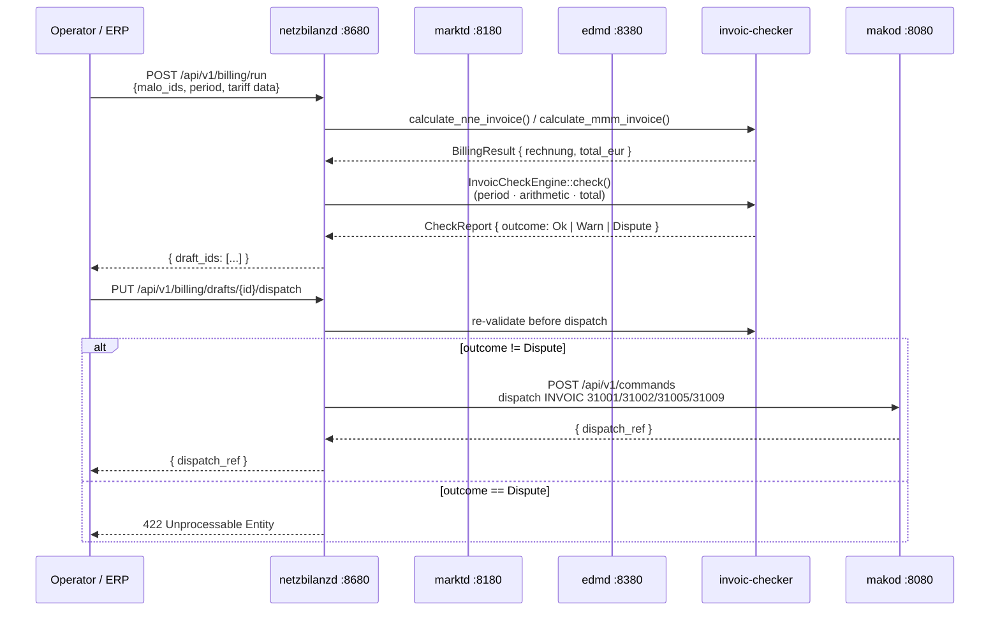
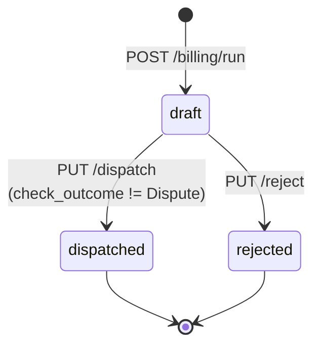

# `netzbilanzd` Operator Guide
{: .no_toc }

`netzbilanzd` automates the outbound billing cycle for network operators:
generating Netznutzungsentgelt (NNE), Konzessionsabgabe (KA),
Mehr-/Mindermengen (MMM), and MSB-Rechnung (Messstellenbetreiber settlement)
invoices, running plausibility checks, and dispatching via `makod` as
INVOIC 31001/31002/31005/31009.

**Port:** `:8680`  
**Storage:** PostgreSQL (`invoice_drafts` table)  
**Role:** NB (Netzbetreiber) role only

{: .toc }
1. TOC
{:toc}

---

## Architecture



### Billing pipeline

1. **Input collection** — the operator (or ERP) provides meter readings
   (`arbeitsmenge_kwh`, `spitzenleistung_kw`) and tariff data from `marktd`
   (`arbeitspreis_ct_per_kwh`, `leistungspreis_eur_per_kw`, `ka_satz_ct_per_kwh`).
   `netzbilanzd` does not query `marktd` or `edmd` autonomously; all inputs are
   supplied in the billing-run request, making the run idempotent.

2. **Invoice generation** — the pure `mako-nne` library calculates billing
   positions with no floating-point money (all amounts in `EuroAmount` = `i64 × 10⁻⁵ EUR`).

3. **Self-validation** — `invoic-checker` runs checks 1–3 (period validity,
   position arithmetic, document total) immediately after generation. Generated
   invoices satisfy these checks by construction.

4. **Draft persistence** — every generated invoice is stored as a draft in
   `invoice_drafts` with status `draft`. No `makod` command is issued yet.

5. **Operator review** — the operator reviews drafts via `GET /api/v1/billing/drafts`.
   An operator approval step prevents erroneous invoices from reaching counterparties.

6. **Dispatch** — `PUT /api/v1/billing/drafts/{id}/dispatch` re-validates,
   then dispatches to `makod` as an INVOIC 31001/31002/31005/31009 command.
   The `lf_mp_id` is used as the counterparty for all types except `msb_31009`,
   which uses `msb_mp_id` as the invoice recipient (MSB, not LF).

---

## Billing types

| `billing_type` | PID | Description | Required fields |
|---|---|---|---|
| `nne_strom` | 31001 | NNE Strom — monthly network usage (NB → LF) | `arbeitsmenge_kwh`, `arbeitspreis_ct_per_kwh` |
| `nne_gas` | 31005 | NNE Gas — monthly gas network usage (GNB → LFG) | `arbeitsmenge_kwh`, `arbeitspreis_ct_per_kwh` |
| `mmm` | 31002 | Mehr-/Mindermengen settlement | `arbeitsmenge_kwh` (actual), `profil_kwh`, `mehr_preis_ct_per_kwh`, `minder_preis_ct_per_kwh` |
| `msb_31009` | 31009 | MSB-Rechnung — metering service settlement (NB → MSB) | `msb_mp_id`, `grundgebuehr_eur_per_month`, `billing_months` |

### NNE billing positions

| # | Position | Formula | Condition |
|---|---|---|---|
| 1 | Netznutzung Arbeit | `arbeitsmenge_kwh × arbeitspreis_ct_per_kwh ÷ 100` | Always |
| 2 | Netznutzung Leistung (RLM) | `spitzenleistung_kw × leistungspreis_eur_per_kw` | When `spitzenleistung_kw` set |
| 3 | Konzessionsabgabe | `arbeitsmenge_kwh × ka_satz_ct_per_kwh ÷ 100` | When `ka_satz_ct_per_kwh` set |

### MMM billing positions

| # | Position | Formula | Condition |
|---|---|---|---|
| 1 | Mehrmengen | `max(0, actual − profil) × mehr_preis_ct_per_kwh ÷ 100` | actual > profil |
| 2 | Mindermengen (Gutschrift) | `−max(0, profil − actual) × minder_preis_ct_per_kwh ÷ 100` | profil > actual (negative = credit) |

### MSB billing positions

For `msb_31009`, the NB invoices the MSB for the metering service period.
Tariff data is fetched from `marktd` (`PreisblattMessung`) by the operator
before calling the billing-run endpoint.

| # | Position | Formula | Condition |
|---|---|---|---|
| 1 | Grundgebühr Messstellenbetrieb | `grundgebuehr_eur_per_month × billing_months` | Always |
| 2 | Messdienstleistung | `messdienstleistung_eur` (flat) | When `messdienstleistung_eur` is set |

---

## HTTP API

### `POST /api/v1/billing/run`

Generate invoice drafts for one or more MaLos in a billing period.

```json
{
  "nb_mp_id":               "9900357000004",
  "lf_mp_id":               "9900012345678",
  "invoice_date":           "2025-02-15",
  "due_date":               "2025-03-15",
  "rechnungsnummer_prefix": "NNE-2025-01",
  "positions": [
    {
      "malo_id":                  "51238696780",
      "period_from":              "2025-01-01",
      "period_to":                "2025-01-31",
      "billing_type":             "nne_strom",
      "arbeitsmenge_kwh":         "1500.000",
      "arbeitspreis_ct_per_kwh":  "3.500",
      "spitzenleistung_kw":       "12.500",
      "leistungspreis_eur_per_kw":"4.200",
      "ka_satz_ct_per_kwh":       "0.110"
    },
    {
      "malo_id":                   "51238696780",
      "period_from":               "2025-01-01",
      "period_to":                 "2025-01-31",
      "billing_type":              "msb_31009",
      "msb_mp_id":                 "9900123400001",
      "grundgebuehr_eur_per_month": "12.50",
      "billing_months":             1,
      "messdienstleistung_eur":     "8.00"
    }
  ]
}
```

Response `201 Created`:

```json
{ "draft_ids": ["550e8400-e29b-41d4-a716-446655440000"] }
```

### `GET /api/v1/billing/drafts`

Query parameters: `status`, `malo_id`, `nb_mp_id`, `limit` (default 100, max 1000).

### `GET /api/v1/billing/drafts/{id}`

Returns the full draft including `rechnung` (BO4E JSON), `check_outcome`, and `status`.

### `PUT /api/v1/billing/drafts/{id}/dispatch`

Dispatches a `draft` invoice to `makod`. Blocked if `check_outcome == "Dispute"`.

Response `200 OK`: `{ "dispatch_ref": "<makod-command-id>" }`

### `PUT /api/v1/billing/drafts/{id}/reject`

```json
{ "reason": "Tariff mismatch — awaiting updated PRICAT from NB" }
```

---

## Draft lifecycle



---

## Configuration

```toml
# netzbilanzd.toml
database_url   = "env:DATABASE_URL"
port           = 8680

marktd_url     = "http://marktd:8180"
marktd_api_key = "env:MARKTD_API_KEY"

makod_url      = "http://makod:8080"
makod_api_key  = "env:MAKOD_API_KEY"
```

---

## PostgreSQL schema

```sql
-- invoice_drafts: stores BO4E Rechnung drafts.
-- status: draft → dispatched | rejected
CREATE TABLE invoice_drafts (
    id               UUID        PRIMARY KEY DEFAULT gen_random_uuid(),
    malo_id          TEXT        NOT NULL,
    nb_mp_id         TEXT        NOT NULL,
    lf_mp_id         TEXT        NOT NULL,
    pid              INTEGER     NOT NULL,  -- 31001 | 31002 | 31005 | 31009
    period_from      DATE        NOT NULL,
    period_to        DATE        NOT NULL,
    rechnung         JSONB       NOT NULL DEFAULT '{}',
    gross_eur_units  BIGINT      NOT NULL DEFAULT 0,  -- × 10⁻⁵ EUR
    check_outcome    TEXT,                -- 'Ok' | 'Warn' | 'Dispute'
    status           TEXT        NOT NULL DEFAULT 'draft',
    dispatch_ref     TEXT,
    reject_reason    TEXT,
    created_at       TIMESTAMPTZ NOT NULL DEFAULT now(),
    updated_at       TIMESTAMPTZ NOT NULL DEFAULT now()
);
```

---

## Regulatory basis

| Regulation | Requirement |
|---|---|
| GPKE BK6-22-024 §5 | NB must issue NNE invoices (Netznutzungsabrechnungen) within the billing cycle |
| §17 StromNZV | Konzessionsabgabe must be included as a separate position in NNE invoices for Tarifkunden |
| §22 MessZV | INVOIC receipts must be retained for 3 years — handled by `invoicd` after dispatch |
| BK6-22-024 §4 | MMM settlement must reflect actual vs. SLP profile deviation for the billing period |
| WiM BK6-24-174 Teil 1 §12 | NB must settle metering service fees with MSB via INVOIC 31009 (MSB-Rechnung) |

> **Note:** `netzbilanzd` generates and dispatches outbound INVOIC messages.
> Inbound INVOIC plausibility checking (REMADV settlement) is handled by `invoicd`.
