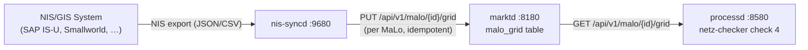

# `nis-syncd` Operator Guide
{: .no_toc }

`nis-syncd` bridges the NB's internal NIS/GIS system with `marktd`.
Every delivery point (MaLo) registered in the NIS is pushed into `marktd`'s
`malo_grid` table, giving `processd` the `Bilanzierungsgebiet` data it needs
for check 4 (Anmeldung STP).

**Port:** `:9680`  
**Storage:** None — stateless adapter  
**Role:** NB (Netzbetreiber) role only

{: .toc }
1. TOC
{:toc}

---

## Why `nis-syncd` exists

`processd` NB check 4 validates that the Lieferant's `Bilanzierungsgebiet`
matches the NB's grid record.  Without this record, check 4 **escalates** to the
operator instead of auto-accepting.



| State | `processd` STP |
|---|---|
| No `malo_grid` records | ~60 % (check 4 escalates) |
| Manual grid provisioning via `PUT /api/v1/malo/{id}/grid` | ~80 % |
| **With `nis-syncd`** | **≥ 95 %** |

---

## HTTP API

### `POST /api/v1/grid/sync`

Accepts a NIS export batch and syncs each `malo_grid` record to `marktd`.
Returns a `SyncReport` showing how many records were updated, skipped, and failed.

**Request:**

```json
{
  "entries": [
    {
      "malo_id":              "51238696780",
      "bilanzierungsgebiet":  "10YDE-VE-------2",
      "netzgebiet":           "MUSTERSTADT-NORD",
      "sparte":               "STROM"
    },
    {
      "malo_id":              "51238696781",
      "bilanzierungsgebiet":  "10YDE-VE-------2",
      "netzgebiet":           null,
      "sparte":               "STROM"
    }
  ]
}
```

**Response `200 OK`:**

```json
{
  "updated":         1,
  "skipped":         1,
  "errors":          [],
  "drift_detected":  false
}
```

**Response `207 Multi-Status`** (partial failure):

```json
{
  "updated":  1,
  "skipped":  0,
  "errors":   ["PUT malo_grid for 51238696782 failed: HTTP 404"],
  "drift_detected": true
}
```

### `POST /api/v1/grid/sync?dry_run=true`

Compares incoming data against `marktd` **without writing**.  Returns the same
`SyncReport` but all differing records are counted as `skipped`.

Use dry-run to validate a NIS export before committing it:

```bash
curl -s -X POST http://nis-syncd:9680/api/v1/grid/sync?dry_run=true \
  -H 'Content-Type: application/json' \
  -d @nis-export.json | jq '.drift_detected'
```

---

## SyncReport fields

| Field | Type | Description |
|---|---|---|
| `updated` | `usize` | Records written to `marktd` (upserted) |
| `skipped` | `usize` | Records already matching — no write needed (or dry-run) |
| `errors` | `Vec<String>` | Per-entry errors (network failures, `marktd` rejections) |
| `drift_detected` | `bool` | `true` if at least one record differed from `marktd` state |

---

## Configuration

```toml
# nis-syncd.toml
port          = 9680
marktd_url    = "http://marktd:8180"
marktd_api_key = "env:MARKTD_API_KEY"
# NB MP-ID that owns the imported grid records
nb_mp_id      = "9900357000004"
```

---

## Scheduling

`nis-syncd` is stateless — it has no internal scheduler. Trigger sync from:

1. **Scheduled job (cron/Kubernetes CronJob):** Post NIS export daily or on-change
2. **NIS change event webhook:** Configure NIS to call `POST /api/v1/grid/sync` on topology change
3. **Manual operator call:** For incident response or initial bootstrapping

Typical sync interval: **nightly** for stable networks, **hourly** for networks
with frequent new-connection activations.

---

## NIS export format

`nis-syncd` accepts a JSON body with a flat `entries` array.  For NIS systems
that export CSV, add a thin conversion layer or use `jq`:

```bash
# Convert CSV to JSON for nis-syncd
csvjson --key=malo_id nis-export.csv | jq '{entries: .}' | \
  curl -s -X POST http://nis-syncd:9680/api/v1/grid/sync \
    -H 'Content-Type: application/json' -d @-
```

---

## Observability

All requests are logged with structured fields via `tracing`.  Key log fields:

| Field | Description |
|---|---|
| `updated` | Records updated in this batch |
| `drift_detected` | Whether any record differed |
| `errors` | Number of per-entry errors |

For `drift_detected = true`, integrate with `obsd` or Alertmanager to alert
the NB data team that the NIS has diverged from `marktd`.

---

## Drift CloudEvent

When `drift_detected = true` **and** `drift_webhook_url` is configured,
`nis-syncd` fires a `de.markt.grid.drift.detected` CloudEvent 1.0 payload
(fire-and-forget, POST to the configured URL):

```json
{
  "specversion": "1.0",
  "id":          "550e8400-e29b-41d4-a716-446655440000",
  "source":      "urn:nis-syncd:nb:9900357000004",
  "type":        "de.markt.grid.drift.detected",
  "time":        "2026-07-11T08:15:00Z",
  "data": {
    "nb_mp_id":    "9900357000004",
    "drift_count": 3,
    "updated":     12,
    "error_count": 0
  }
}
```

Route this event to an Alertmanager receiver, a Slack webhook, or your incident
management system.  Configure the URL in `nis-syncd.toml`:

```toml
[marktd]
drift_webhook_url = "https://alertmanager:9093/api/v2/alerts"
```

---

## See Also

- [`marktd` Operator Guide](./marktd.md) — `malo_grid` table details
- [`processd` Operator Guide](./processd.md) — NB STP and netz-checker
- [Getting Started](./getting-started.md)
