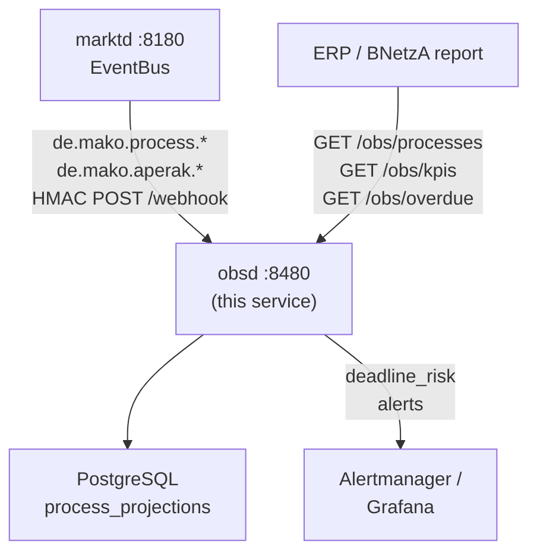

# `obsd` Operator Guide

`obsd` is the **business-process observability daemon** — the service that tracks
every active MaKo process, monitors regulatory deadlines, and produces the
BNetzA-mandated §20 EnWG parity reports.

Key responsibilities:
- Build and maintain **`ProcessProjection`** records from `de.mako.process.*` events.
- Detect and report **overdue processes** (approaching or past regulatory deadline).
- Produce **KPI reports** for BNetzA audit — decision times, affiliate/non-affiliate
  parity (`initiator_is_affiliate`), STP rates.
- Bridge to **Alertmanager** for operational alerting on deadline violations.



---

## Port layout

```
┌─────────────────────────────────────────────────────────────────┐
│  obsd  :8480                                                     │
│                                                                 │
│  POST /webhook              ← marktd CloudEvents (HMAC-auth)   │
│  GET  /obs/processes        ← list / filter process projections │
│  GET  /obs/processes/{id}   ← single process by UUID           │
│  GET  /obs/kpis             ← BNetzA KPI report                │
│  GET  /obs/overdue          ← processes near or past deadline   │
│  GET  /health/live  /health/ready                               │
└─────────────────────────────────────────────────────────────────┘
```

---

## ProcessProjection

Each `ProcessProjection` record is a read-model built from the event stream:

| Field | Description |
|-------|-------------|
| `process_id` | UUID from `de.mako.process.initiated` |
| `pid` | BDEW Prüfidentifikator (e.g. 55001) |
| `workflow` | Workflow family name (e.g. `gpke-supplier-change`) |
| `state` | `Open` \| `Accepted` \| `Rejected` \| `Completed` \| `Escalated` |
| `initiator_mp_id` | Requesting party MP-ID |
| `partner_mp_id` | Responding party MP-ID |
| `malo_id` | 11-digit Marktlokations-ID |
| `initiated_at` | Process start (from `ProcessInitiated`) |
| `deadline_at` | Regulatory deadline (computed from PID + regulatory source) |
| `completed_at` | When `ProcessCompleted` was received |
| `initiator_is_affiliate` | `true` if initiating party == operator (§20 parity flag) |
| `deadline_risk` | `None` \| `Warning` \| `Breach` |

---

## §20 EnWG parity

The `initiator_is_affiliate` flag enables §20 EnWG non-discrimination monitoring.
When `processd` decides an Anmeldung, it sets this flag based on whether the
requesting LF GLN matches the operator's own GLN. `obsd` aggregates this in KPI
reports:

```bash
# Affiliate vs non-affiliate STP parity (BNetzA audit)
curl -s "http://obsd:8480/obs/kpis?days=90" \
  -H "Authorization: Bearer <token>" | jq '{
    affiliate_stp_rate: .affiliate.stp_rate,
    non_affiliate_stp_rate: .non_affiliate.stp_rate,
    parity_delta: (.affiliate.stp_rate - .non_affiliate.stp_rate | fabs)
  }'
```

BNetzA expects the parity delta to be < 2 percentage points.

---

## Deadline monitoring

`obsd` monitors regulatory deadlines:

| PID family | Deadline |
|------------|---------|
| GPKE (55001–55018) | 24 wall-clock hours |
| WiM Strom (55039…) | 5 Werktage |
| GeLi Gas (44001…) | 10 Werktage |
| MABIS (13003) | 1 Werktag |

Processes approaching the deadline within a configurable window (`WARNING`) or
past it (`BREACH`) appear in `GET /obs/overdue`:

```bash
curl -s "http://obsd:8480/obs/overdue" \
  -H "Authorization: Bearer <token>" | jq '.[] | {
    process_id, pid, malo_id, deadline_at, deadline_risk
  }'
```

---

## Configuration reference

| Env var | CLI flag | Default | Description |
|---------|----------|---------|-------------|
| `OBSD_LISTEN` | `--listen` | `0.0.0.0:8480` | HTTP listen address |
| `OBSD_DATABASE_URL` | `--database-url` | — | PostgreSQL connection string |
| `OBSD_DB_POOL_SIZE` | `--db-pool-size` | `10` | Connection pool size |
| `OBSD_MARKTD_URL` | `--marktd-url` | `http://localhost:8180` | `marktd` base URL |
| `OBSD_MARKTD_API_KEY` | `--marktd-api-key` | — | `marktd` Bearer token |
| `OBSD_SUBSCRIBER_ID` | `--subscriber-id` | `obsd` | EventBus subscriber ID |
| `OBSD_WEBHOOK_URL` | `--webhook-url` | — | Public URL `marktd` POSTs events to |
| `OBSD_WEBHOOK_SECRET` | `--webhook-secret` | — | HMAC signing secret |
| `OBSD_INBOUND_SECRET` | `--inbound-secret` | = webhook-secret | HMAC verification secret |
| `OBSD_TENANT` | `--tenant` | `default` | Tenant identifier |
| `OBSD_OIDC_ISSUER` | `--oidc-issuer` | — | OIDC issuer (omit for dev mode) |
| `OBSD_OIDC_AUDIENCE` | `--oidc-audience` | — | OIDC audience |
| `RUST_LOG` | `--log-level` | `info` | Log level |
| `OBSD_OTEL_ENDPOINT` | `--otel-endpoint` | — | OTLP endpoint |

---

## marktd subscription setup

```bash
curl -X PUT http://marktd:8180/api/v1/subscriptions/obsd \
  -H "Authorization: Bearer <token>" \
  -H "Content-Type: application/json" \
  -d '{
    "webhook_url": "http://obsd:8480/webhook",
    "webhook_secret": "<shared-hmac-secret>",
    "event_types": [
      "de.mako.process.initiated",
      "de.mako.process.completed",
      "de.mako.aperak.rejected"
    ],
    "active": true
  }'
```

---

## Query examples

```bash
# Open processes for a MaLo
curl -s "http://obsd:8480/obs/processes?state=Open&pid=55001" \
  -H "Authorization: Bearer <token>" | jq '.[] | {process_id, initiated_at, deadline_at}'

# 90-day KPI report
curl -s "http://obsd:8480/obs/kpis?days=90" \
  -H "Authorization: Bearer <token>" | jq .

# Overdue processes (deadline breached or within 2 hours)
curl -s "http://obsd:8480/obs/overdue" \
  -H "Authorization: Bearer <token>" | jq '.[] | select(.deadline_risk == "Breach")'
```

---

## Alertmanager integration

`obsd` can fire Alertmanager webhook alerts when processes breach their deadline.
Configure the Alertmanager webhook receiver URL via environment:

```bash
OBSD_ALERTMANAGER_URL=http://alertmanager:9093/api/v2/alerts
```

Alert labels include `pid`, `workflow`, `malo_id`, and `deadline_risk`.

---

## Monitoring (self-monitoring)

| Metric | Target |
|--------|--------|
| Projection build lag | < 5 s from `ProcessInitiated` |
| `deadline_risk = 'Breach'` count | 0 |
| `initiator_is_affiliate` parity delta | < 2 pp |
| DB pool utilisation | < 80 % |

The `obsd` `GET /obs/kpis` endpoint is also the input for BNetzA audit submissions
under §20 EnWG — export as JSON or CSV before each annual report.
