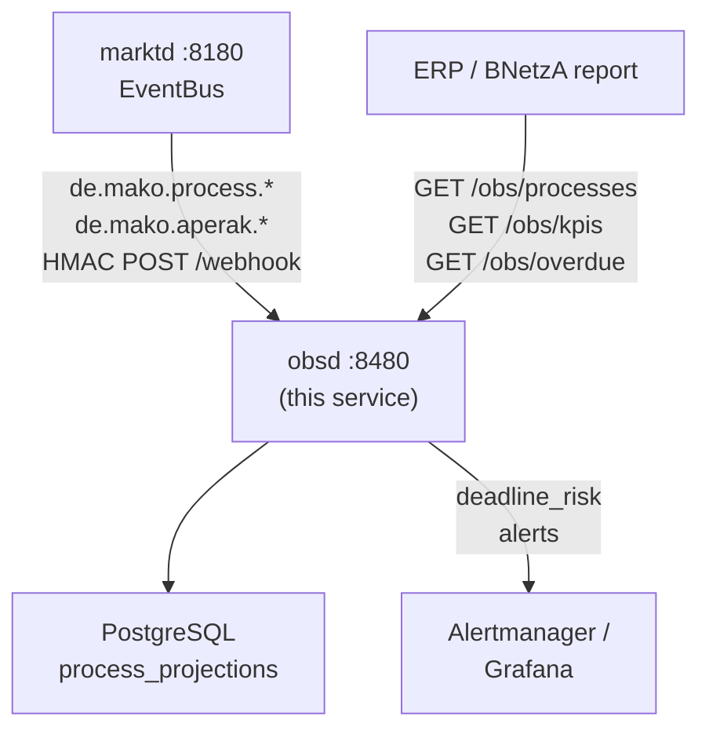

# `obsd` Operator Guide

`obsd` is the **business-process observability daemon** — the service that tracks
every active MaKo process, monitors regulatory deadlines, and produces the
BNetzA-mandated §20 EnWG parity reports.

Key responsibilities:
- Build and maintain **`ProcessProjection`** records from `de.mako.process.*` events.
- Detect and report **overdue processes** (approaching or past regulatory deadline).
- Produce **KPI reports** for BNetzA audit — decision times, affiliate/non-affiliate
  parity (`initiator_is_affiliate`), STP rates.
- Bridge to **Alertmanager** for operational alerting on deadline violations.



---

## Port layout

```
┌─────────────────────────────────────────────────────────────────┐
│  obsd  :8480                                                     │
│                                                                 │
│  POST /webhook                  ← marktd CloudEvents (HMAC)    │
│  GET  /obs/processes            ← list / filter projections     │
│  GET  /obs/processes/{id}       ← single process by UUID        │
│  GET  /obs/kpis                 ← BNetzA KPI report (per PID)   │
│  GET  /obs/overdue              ← processes past deadline        │
│  GET  /api/v1/audit/bnetza-report ← §20 Abs.1 EnWG annual audit │
│  GET  /metrics                  ← Prometheus metrics            │
│  GET  /health/live  /health/ready                               │
│  POST|GET /mcp                  ← MCP Streamable HTTP           │
└─────────────────────────────────────────────────────────────────┘
```

---

## ProcessProjection

Each `ProcessProjection` record is a read-model built from the event stream:

| Field | Description |
|-------|-------------|
| `process_id` | UUID from `de.mako.process.initiated` |
| `pid` | BDEW Prüfidentifikator (e.g. 55001) |
| `family` | Process family: `gpke`, `geli-gas`, `wim`, `wim-gas`, `gabi-gas`, `mabis`, `unknown` |
| `workflow_name` | Workflow name from `makoworkflow` CE extension |
| `state` | `initiated` \| `running` \| `completed` \| `rejected` \| `cancelled` \| `aperak_timeout` |
| `malo_id` | 11-digit Marktlokations-ID |
| `partner_mp_id` | GLN of the counterparty (NB/GNB/MSB) |
| `mdm_role` | Canonical Marktrolle (`LF`, `NB`, …) |
| `started_at` | UTC timestamp of the first `process.initiated` event |
| `last_event_at` | UTC timestamp of the most recently received event |
| `completed_at` | Set when state transitions to `completed`, `rejected`, or `cancelled`; used for cycle-time KPIs |
| `deadline_at` | Regulatory deadline, computed from PID on `Initiated` event (see below) |
| `deadline_risk` | `green` \| `amber` (< 24 h) \| `red` (past deadline) |
| `erc_code` | BDEW ERC error code when `state == rejected` |
| `initiator_is_affiliate` | `true` if initiating LF MP-ID ∈ operator's `own_mp_ids` (§20 parity flag) |

---

## Deadline computation

`obsd` computes `deadline_at` **automatically** when processing `de.mako.process.initiated` events.
Deadlines are derived from the PID using conservative calendar-day approximations:

| Process family | Deadline | Regulatory source |
|---|---|---|
| GPKE (PIDs 55001–55609) | **24 wall-clock hours** | BK6-22-024 §5 |
| WiM Strom (PIDs 55039, 55042, 55051, 55168) | **7 calendar days** (≥ 5 Werktage) | BK6-24-174 |
| GeLi Gas (PIDs 44001–44024) | **14 calendar days** (≥ 10 Werktage) | BK7-24-01-009 §5 |
| WiM Gas (PIDs 44039–44053, 44168–44170) | **14 calendar days** (≥ 10 Werktage) | BK7-24-01-009 §5 |
| MABIS (PID 13003) | **2 calendar days** (≥ 1 Werktag) | BK6-24-174 §13.8 |
| Billing / PARTIN / INSRPT PIDs | `null` (no per-process deadline) | — |

> **Conservative approximations:** 7 calendar days ≥ 5 Werktage in all cases
> (Saturday counts as a Werktag; only Sundays and public holidays do not).
> `obsd` therefore never marks a process as overdue before its true BNetzA deadline.
> Exact Werktage arithmetic lives in `processd`/`mako-engine`; `obsd` uses the coarser
> approximation for alerting.

`deadline_risk` is re-classified on every event:
- `green` — more than 24 h before deadline
- `amber` — less than 24 h before deadline
- `red` — deadline has passed and process is still open

---

## §20 EnWG parity

`processd` and `obsd` together implement the **§20 EnWG Diskriminierungsfreiheitspflicht**
(non-discrimination obligation) for vertically integrated utilities operating both NB
and LF roles (§6b EnWG deployment).

### How it works

When a Lieferbeginn Anmeldung (PID 55001, 55016, or 44001) arrives, `processd` computes:

```rust
initiator_is_affiliate = new_supplier_mp_id ∈ own_mp_ids
```

- `own_mp_ids` is a `Vec<String>` configured per service instance — covering
  **all** operator MP-IDs (Strom NB `99…` and Gas GNB `98…` for integrated Stadtwerk deployments).
- Falls back to `[tenant]` when `own_mp_ids` is not explicitly configured.

`processd` **blocks automatic acceptance** (`auto_accept = false` is enforced) when
`initiator_is_affiliate = true`, forcing operator review for all affiliate Anmeldungen.
This ensures the NB cannot give its subsidiary LF an automatic processing advantage.

`obsd` records `initiator_is_affiliate` on every `ProcessProjection`, enabling
BNetzA audit evidence as a structured query:

```bash
# §20 EnWG parity audit: affiliate vs. non-affiliate STP rates
curl -s "http://obsd:8480/obs/kpis?days=90" \
  -H "Authorization: Bearer <token>" | jq '{
    affiliate_stp_rate:     .affiliate.stp_rate,
    non_affiliate_stp_rate: .non_affiliate.stp_rate,
    parity_delta:           (.affiliate.stp_rate - .non_affiliate.stp_rate | fabs),
    bnetza_limit_pp:        2.0
  }'
```

BNetzA expects the parity delta to be **< 2 percentage points**.

### Multi-MP-ID configuration

An integrated NB+GNB instance operates under multiple MP-IDs. Configure all of them:

```toml
[identity]
tenant     = "9900357000004"   # primary (for Cedar resource checks)
# §20 EnWG: list all operator MP-IDs — Strom NB (BDEW 99…) + Gas GNB (DVGW 98…)
own_mp_ids = ["9900357000004", "9800357000004"]
```

When `own_mp_ids` is omitted, it defaults to `[tenant]` (pure single-role deployments).

---

## Deadline monitoring

`obsd` monitors regulatory deadlines:

| PID family | Deadline |
|------------|---------|
| GPKE (55001–55018) | 24 wall-clock hours |
| WiM Strom (55039…) | 5 Werktage |
| GeLi Gas (44001…) | 10 Werktage |
| MABIS (13003) | 1 Werktag |

Processes approaching the deadline within a configurable window (`WARNING`) or
past it (`BREACH`) appear in `GET /obs/overdue`:

```bash
curl -s "http://obsd:8480/obs/overdue" \
  -H "Authorization: Bearer <token>" | jq '.[] | {
    process_id, pid, malo_id, deadline_at, deadline_risk
  }'
```

---

## Configuration reference

`obsd` reads its configuration from a **TOML file** (default: `obsd.toml`),
with secrets deferred to environment variables via `"env:VAR_NAME"` values.

### CLI flags

| Flag | Env var | Default | Description |
|------|---------|---------|-------------|
| `--config` / `-c` | `OBSD_CONFIG` | `obsd.toml` | Path to `obsd.toml` |
| `--log-level` | `RUST_LOG` | `info` | Log level |
| `--check` | `OBSD_CHECK` | `false` | Validate config + DB connectivity, then exit 0. Used by Dockerfile HEALTHCHECK. |

```bash
obsd --config /etc/obsd/obsd.toml
# or: OBSD_CONFIG=/etc/obsd/obsd.toml obsd
```

### Full `obsd.toml` reference

```toml
[http]
addr = "0.0.0.0:8480"          # default

[database]
url       = "env:DATABASE_URL"  # required; use env: for secrets
pool_size = 10                  # default

[identity]
tenant = "9900357000004"        # required — MP-ID of the operator

[marktd]
url     = "http://marktd:8180"      # required
api_key = "env:OBSD_MARKTD_API_KEY" # required

[webhook]
inbound_secret = "env:OBSD_INBOUND_SECRET"  # optional; omit for dev

[subscription]
# Self-registers with marktd on startup — no manual curl required.
webhook_url   = "http://obsd:8480/webhook"  # public URL marktd POSTs to
subscriber_id = "obsd"                       # default
event_types   = [
  "de.mako.process.initiated",
  "de.mako.process.completed",
  "de.mako.process.timed_out",
  "de.mako.process.failed",
  "de.mako.aperak.rejected",
]

# [oidc]          # omit to disable auth (dev only — never omit in production)
# issuer   = "https://login.microsoftonline.com/{tenant-id}/v2.0"
# audience = "api://mako-obsd"
# jwks_refresh_secs = 300

# [otel]          # omit to disable tracing
# endpoint = "http://otel-collector:4317"
```

---

## marktd subscription

`obsd` **auto-registers** its EventBus subscription with `marktd` on startup
when `subscription.webhook_url` is set in the config — no manual `curl` required.

To force re-registration or verify the subscription:

```bash
curl -s http://marktd:8180/api/v1/subscriptions/obsd \
  -H "Authorization: Bearer <token>" | jq .
```

---

## Query examples

```bash
# Open processes for a MaLo
curl -s "http://obsd:8480/obs/processes?state=Open&pid=55001" \
  -H "Authorization: Bearer <token>" | jq '.[] | {process_id, initiated_at, deadline_at}'

# 90-day KPI report
curl -s "http://obsd:8480/obs/kpis?days=90" \
  -H "Authorization: Bearer <token>" | jq .

# Overdue processes (deadline breached or within 2 hours)
curl -s "http://obsd:8480/obs/overdue" \
  -H "Authorization: Bearer <token>" | jq '.[] | select(.deadline_risk == "Breach")'
```

---

## Alertmanager integration

`obsd` can fire Alertmanager webhook alerts when processes breach their deadline.
Configure the Alertmanager webhook receiver URL via environment:

```bash
OBSD_ALERTMANAGER_URL=http://alertmanager:9093/api/v2/alerts
```

Alert labels include `pid`, `workflow`, `malo_id`, and `deadline_risk`.

---

## Monitoring (self-monitoring)

| Metric | Target |
|--------|--------|
| Projection build lag | < 5 s from `ProcessInitiated` |
| `deadline_risk = 'Breach'` count | 0 |
| `initiator_is_affiliate` parity delta | < 2 pp |
| DB pool utilisation | < 80 % |

The `obsd` `GET /obs/kpis` endpoint is also the input for BNetzA audit submissions
under §20 EnWG — export as JSON or CSV before each annual report.

---

## MCP server

`obsd` exposes an MCP server at `/mcp` for LLM-based compliance automation.

### Tools (6)

| Tool | Description |
|---|---|
| `get_process(process_id)` | Full process projection by UUID — state, PIDs, deadlines, ERC code |
| `list_overdue_processes` | All MaKo processes past their regulatory deadline, ordered by urgency |
| `get_kpi_report(pid, period)` | BNetzA KPI for a single PID and billing month (`YYYY-MM`) |
| `get_parity_report(days)` | §20 EnWG compliance: affiliate vs. non-affiliate completion rates; target gap < 2 pp |
| `get_stp_rate(days)` | Rolling STP rate across all process families; target ≥ 95% |
| `list_processes_by_family(family, state, limit)` | Drill into a process family (`gpke`, `wim`, `geli-gas`, …) |

### Prompts (2)

| Prompt | Description |
|---|---|
| `audit-kpi` | Generate a BNetzA KPI report for a reporting period |
| `investigate-aperak-violation` | Root-cause an APERAK deadline violation |

### Example: rolling STP rate check

```bash
curl -X POST http://obsd:8480/mcp \
  -H "Content-Type: application/json" \
  -d '{"jsonrpc":"2.0","id":1,"method":"tools/call","params":{"name":"get_stp_rate","arguments":{"days":30}}}'
```

Returns `{ "stp_rate": 0.9720, "stp_pct": 97.2, "target_stp": 0.95, "compliant": true, ... }`.
