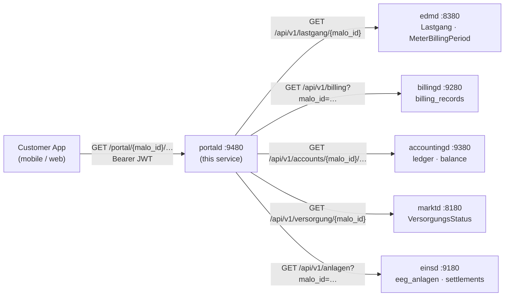

# `portald` — Customer Portal Gateway

`portald` is a **stateless read-model gateway** that aggregates data from all LF backend
services into a single customer-facing REST + Server-Sent Events API.



Port: **`:9480`**

---

## Design Principles

- **No domain policy.** `portald` never modifies data. All writes go directly to the
  authoritative service via the ERP Command API.
- **Stateless.** No database. Can be scaled horizontally without coordination.
- **Service-unavailable isolation.** When an upstream is unreachable, that field returns
  `null` rather than failing the entire request.
- **OIDC-gated.** All endpoints require a valid JWT bearer token. When `oidc_issuer` is
  absent from config, authentication is skipped (dev/test mode only).

---

## Endpoints

### Read-only endpoints

| Method | Path | Description |
|--------|------|-------------|
| `GET` | `/api/v1/portal/{malo_id}/dashboard` | Parallel aggregation — all fields in one call |
| `GET` | `/api/v1/portal/{malo_id}/lastgang` | Interval meter reads (proxied from `edmd`) |
| `GET` | `/api/v1/portal/{malo_id}/invoices` | Invoice list (proxied from `billingd`) |
| `GET` | `/api/v1/portal/{malo_id}/balance` | Current open-items balance (from `accountingd`) |
| `GET` | `/api/v1/portal/{malo_id}/kontoauszug` | Full account statement / ledger (from `accountingd`) |
| `GET` | `/api/v1/portal/{malo_id}/vorauszahlung` | Advance payment schedule / Abschlag (from `accountingd`) |
| `GET` | `/api/v1/portal/{malo_id}/eeg` | EEG/KWKG plant list + latest settlements (from `einsd`) |
| `GET` | `/api/v1/portal/{malo_id}/versorgung` | Supply state (from `marktd`) |
| `GET` | `/api/v1/portal/{malo_id}/events` | Server-Sent Events stream (30 s heartbeat) |

### Self-service write endpoints (§41 EnWG customer rights)

| Method | Path | Description |
|--------|------|-------------|
| `GET`  | `/api/v1/portal/{malo_id}/vertrag` | Current supply contract (resolved via `vertragd`) |
| `POST` | `/api/v1/portal/{malo_id}/tarifwechsel` | Tariff switch (§41 Abs. 1 EnWG; min. 14 days notice) |
| `POST` | `/api/v1/portal/{malo_id}/kuendigen` | Contract termination (notice period per contract; §20 StromGVV/GasGVV two weeks in Grundversorgung) |
| `PUT`  | `/api/v1/portal/{malo_id}/kontakt` | Update contact data (GDPR Art. 16) |
| `PUT`  | `/api/v1/portal/{malo_id}/sepa` | Update SEPA direct-debit mandate |
| `GET`  | `/api/v1/portal/{malo_id}/invoices/{id}/download` | ZUGFeRD 2.3 / XRechnung 3.0 CII XML |
| `GET`  | `/health` | Liveness |
| `GET`  | `/health/ready` | Readiness |

---

## Dashboard

`GET /api/v1/portal/{malo_id}/dashboard` fetches from all configured upstream services **in parallel** (`tokio::join!`) and returns a single JSON object:

```json
{
  "malo_id": "51238696781",
  "tenant": "9910000000002",
  "versorgung": {
    "lieferstatus": "Beliefert",
    "lf_mp_id": "9910000000002",
    "lf_next_lieferbeginn": null
  },
  "balance": {
    "balance_ct": -4500,
    "currency": "EUR"
  },
  "last_invoice": [
    {
      "id": "…",
      "period_from": "2026-06-01",
      "period_to": "2026-06-30",
      "total_brutto_eur": "126.14",
      "outcome": "generated"
    }
  ],
  "meter_summary": {
    "arbeitsmenge_kwh": "312.5",
    "sparte": "STROM"
  }
}
```

Fields are `null` when the upstream service is not configured or returned 404.

---

## Lastgang

`GET /api/v1/portal/{malo_id}/lastgang?from=2026-06-01&to=2026-06-30`

Proxies `edmd GET /api/v1/lastgang/{malo_id}?from=…&to=…`. Returns BO4E `Lastgang` array.

---

## Server-Sent Events

`GET /api/v1/portal/{malo_id}/events`

Returns an SSE stream. The current implementation emits a 30-second heartbeat:

```
event: heartbeat
data: {"malo_id": "51238696781"}

event: heartbeat
data: {"malo_id": "51238696781"}
```

**Production wiring.** In production, wire the SSE stream to an internal notification channel
populated by CloudEvents from `accountingd` (`de.accounting.mahnung.issued`),
`billingd` (`de.billing.rechnung.erstellt`), and `einsd` (`de.eeg.verguetung.berechnet`).
This enables real-time portal updates without polling.

---

## Configuration

```toml
# portald.toml
port   = 9480
tenant = "9910000000002"   # data-isolation key (operator tenant; value = BDEW-Codenummer in this example)

# Upstream service URLs
edmd_url        = "http://edmd:8380"
billingd_url    = "http://billingd:9280"
accountingd_url = "http://accountingd:9380"
einsd_url       = "http://einsd:9180"
marktd_url      = "http://marktd:8180"

# OIDC authentication
# When oidc_issuer is absent, authentication is SKIPPED (dev only).
# In production: configure your OIDC issuer.
oidc_issuer   = "https://auth.example.com/realms/mako"
oidc_audience = "portald"

# API keys for upstream service auth
# edmd_api_key        = "env:EDMD_API_KEY"
# billingd_api_key    = "env:BILLINGD_API_KEY"
# accountingd_api_key = "env:ACCOUNTINGD_API_KEY"
# einsd_api_key       = "env:EINSD_API_KEY"
# marktd_api_key      = "env:MARKTD_API_KEY"
```

---

## Authentication

`portald` validates OIDC JWT bearer tokens. The `sub` claim should match the customer
identity. The exact claim-to-MaLo mapping is operator-configurable:

- **Simple deployments**: `sub == malo_id` (each customer token scoped to one MaLo)
- **Multi-MaLo customers**: the ERP injects a `malo_ids` claim listing all accessible MaLos

When `oidc_issuer` is not configured, **authentication is disabled** — suitable for
internal tooling and development, but never for production customer-facing deployments.

---

## Deployment

`portald` is stateless — no database schema, no migrations. Deploy as many replicas
as needed behind a load balancer:

```yaml
# docker-compose.yml (excerpt)
portald:
  image: ghcr.io/hupe1980/portald:latest
  ports:
    - "9480:9480"
  volumes:
    - ./portald.toml:/etc/mako/portald.toml:ro
  environment:
    EDMD_API_KEY: "${EDMD_API_KEY}"
    BILLINGD_API_KEY: "${BILLINGD_API_KEY}"
    ACCOUNTINGD_API_KEY: "${ACCOUNTINGD_API_KEY}"
    MARKTD_API_KEY: "${MARKTD_API_KEY}"
    EINSD_API_KEY: "${EINSD_API_KEY}"
```

---

## Related Services

| Service | Role |
|---------|------|
| [`edmd`](./edmd.md) | Authoritative meter data source |
| [`billingd`](./billingd.md) | Authoritative invoice calculation + XRechnung |
| [`accountingd`](./accountingd.md) | Authoritative account ledger + SEPA |
| [`einsd`](./einsd.md) | Authoritative EEG/KWKG settlement |
| [`marktd`](./marktd.md) | Authoritative supply status + MaLo data |
| [`vertragd`](./vertragd.md) | Contract management + OIDC→MaLo auth gateway |

---

## MCP server

`portald` exposes an MCP server at `/mcp` for LLM-based customer service automation.
All tools are **read-only** (`readOnlyHint = true`) — write operations go through the REST API.

### Tools (8)

| Tool | Description |
|---|---|
| `get_dashboard(malo_id)` | Instant aggregated snapshot: supply status, latest invoice, account balance |
| `get_lastgang(malo_id, from, to)` | Energy consumption time-series (MSCONS 15-min or hourly) |
| `get_invoices(malo_id, limit)` | Billing history, newest first |
| `get_balance(malo_id)` | Open-items net balance (positive = owed, negative = credit) |
| `get_kontoauszug(malo_id)` | Full account statement — all ledger entries for dispute investigation |
| `get_vorauszahlung(malo_id)` | Advance payment schedule (Abschlag amount, cycle, next due date) |
| `get_eeg_status(malo_id)` | EEG/KWKG plant list + settlements for a MaLo |
| `get_versorgung(malo_id)` | Supply status (Beliefert / Unbeliefert / Gesperrt) |

### Prompts (3)

| Prompt | Description |
|---|---|
| `customer-overview` | Complete account overview workflow |
| `billing-dispute` | Investigate a disputed invoice (Lastgang ↔ invoice comparison) |
| `eeg-foerderung-check` | EEG Förderungsende options (POST_EEG_SPOT, Direktvermarktung, Repowering §22 EEG) |

### Informatorisches Unbundling (§9 EnWG)

`portald` is an **LF-role service**. It accesses `marktd` only for VersorgungsStatus
(the LF's own supply records) — not for NB grid topology or NB billing data.
Unbundled NB services (`netzbilanzd`, `sperrd`, `nis-syncd`) are never accessible via `portald`.
