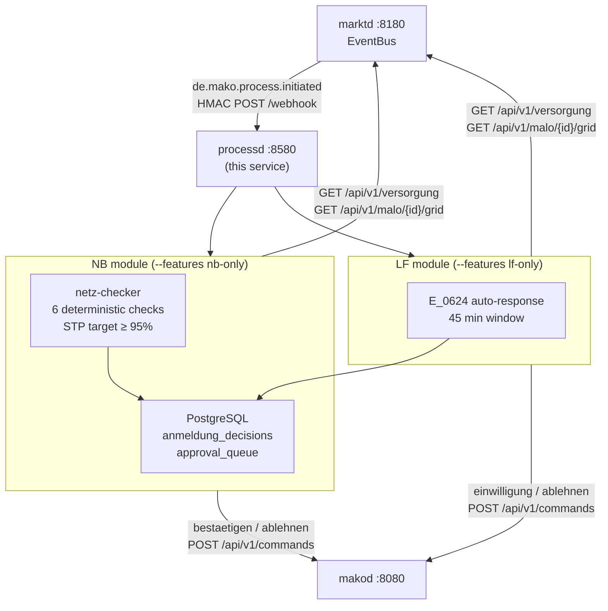

# `processd` Operator Guide

`processd` is the **process decision engine** — the service that automates
regulatory decisions within mandatory deadlines.



---

## Port layout

```
┌─────────────────────────────────────────────────────────────────┐
│  processd  :8580                                                 │
│                                                                 │
│  POST /webhook         ← marktd CloudEvents (HMAC-verified)    │
│  GET  /api/v1/decisions ← NB STP audit log (OIDC+Cedar)        │
│  GET  /api/v1/queue    ← LF approval queue (OIDC+Cedar)        │
│  POST /api/v1/queue/{id}/approve|reject  ← operator action     │
│  GET  /health/live  /health/ready                               │
│  POST|GET /mcp         ← MCP Streamable HTTP (2025-11-25)      │
└─────────────────────────────────────────────────────────────────┘
```

---

## Role isolation

`processd` is compiled with **feature flags** that gate which modules are included.
This ensures §7 EnWG separation: an `nb-only` binary provably contains no LF PIDs.

```toml
[features]
role-lf-strom  = []  # LFA E_0624 (PID 55008), LFN Strom bootstrap
role-lf-gas    = []  # LFA GeLi Gas (PID 44022/44023)
role-nb-strom  = []  # GPKE Anmeldung STP (PIDs 55001, 55016)
role-nb-gas    = []  # GeLi Gas Anmeldung STP (PID 44001)

lf-only    = ["role-lf-strom", "role-lf-gas"]
nb-only    = ["role-nb-strom", "role-nb-gas"]
integrated = ["role-lf-strom", "role-lf-gas", "role-nb-strom", "role-nb-gas"]
```

For §7 EnWG deployments (≥ 100k Netzkunden): BNetzA inspects the binary SHA to
confirm no cross-contamination. Use separate container images compiled with
`nb-only` and `lf-only` respectively.

---

## NB module — Anmeldung STP

### Decision pipeline

```text
de.mako.process.initiated (PID 55001/55016/44001)
  → extract AnmeldungAnfrage from event payload
  → GET marktd /api/v1/versorgung/{malo_id}         → VersorgungsStatus
  → GET marktd /api/v1/malo/{malo_id}/grid           → MaloGridRecord
  → GET marktd /api/v1/partners/{lf_gln}             → partner_known
  → netz_checker::evaluate(anfrage, vs, grid, partner_known, now_utc())
      Accept   → anmeldung_decisions(Accept)
                 [if NB_AUTO_ACCEPT=true] → makod gpke.lieferbeginn.bestaetigen
      Reject   → anmeldung_decisions(Reject, erc_code) → makod ablehnen
      Escalate → anmeldung_decisions(Escalate) → operator alert
```

### netz-checker — 6 checks

| # | Rule | On failure |
|---|------|------------|
| 1 | `MaloGridRecord` exists for the MaLo | `Escalate` |
| 2 | `lf_gln_next` is `None` (no pending Lieferbeginn) | `Reject A06` |
| 3 | `process_date ≥ today` (no retroactive starts) | `Reject A97` |
| 4 | Bilanzierungsgebiet in UTILMD matches grid record | `Reject A02` |
| 5 | LF GLN in partner directory | `Reject A05` |
| 6 | Mindestvorlauffrist met (SLP: tomorrow+; RLM: 2 Werktage+) | `Reject A99` |

### STP rate targets

| Condition | STP |
|-----------|-----|
| Grid records not imported (cold NIS cache) | ~60 % |
| NIS data imported via `nis-syncd` (N7) or manual provisioning | ≥ 95 % |

Grid records are sourced from the NB’s own NIS/GIS system — **not** from MaStR.
See [marktd Grid topology](marktd#grid-topology--nisgis-integration) for import options.

Monitor via `GET /api/v1/decisions` or the `get_stp_rate` MCP tool.

### `NB_AUTO_ACCEPT`

Set `NB_AUTO_ACCEPT=false` (default) until you have verified:

1. Grid record coverage for your MaLo portfolio (`GET /api/v1/malo/{id}/grid`)
2. Partner directory populated for all expected LF GLNs
3. At least one manual review cycle confirmed correct ERC codes

---

## LF module — E_0624 auto-response

### Decision rules (PID 55008)

| VersorgungsStatus | Scenario | Decision |
|-------------------|----------|----------|
| `Beliefert` + `lf_gln == own_gln` | Standard | `einwilligung` |
| `Beliefert` + `lf_gln == own_gln` | `Einzug` | `ablehnen A32` |
| `Beliefert` + `lf_gln == own_gln` | `Ersatzversorgung` | `einwilligung` |
| `Grundversorgung` | any | `einwilligung` |
| MaLo unknown | any | `approval_queue` |
| `lf_gln != own_gln` | any | `approval_queue` |

### Approval queue

Entries expire at `deadline_at - 5 min` (where `deadline_at = event_time + 45 min`).
A background task runs every 60 s and sets `status = Expired` for stale entries.

**Operator workflow:**
```
GET /api/v1/queue                     → list Pending entries (review before expires_at)
POST /api/v1/queue/{id}/approve       → dispatch einwilligung via makod AND mark Approved
POST /api/v1/queue/{id}/reject        → dispatch ablehnen via makod AND mark Rejected
```

> **Regulatory deadline:** `expires_at = event_time + 45 min - 5 min`.
> The approve/reject handlers dispatch to `makod` **before** updating the DB — if
> `makod` is unavailable, the entry stays `Pending` so the operator can retry.
> Expired entries log a `WARN` and must be reconciled manually.

---

## §20 EnWG parity

Every `anmeldung_decisions` row includes:

```sql
initiator_is_affiliate BOOLEAN  -- TRUE when lf_gln == own_gln (integrated deployment)
```

This field is the BNetzA audit evidence for §20 EnWG parity compliance.
A systematically faster decision time for `initiator_is_affiliate = true` is
a §20 EnWG violation in integrated §6b EnWG deployments.

Use `obsd`'s parity report or query directly:

```sql
SELECT
    initiator_is_affiliate,
    COUNT(*) AS total,
    AVG(EXTRACT(EPOCH FROM (decided_at - created_at))) AS avg_response_secs
FROM anmeldung_decisions
WHERE tenant = $1 AND decided_at >= now() - interval '90 days'
GROUP BY initiator_is_affiliate;
```

---

## Configuration reference

All settings can be provided as environment variables or CLI flags.

| Env var | CLI flag | Default | Description |
|---------|----------|---------|-------------|
| `PROCESSD_LISTEN` | `--listen` | `0.0.0.0:8580` | HTTP listen address |
| `DATABASE_URL` | `--database-url` | — | PostgreSQL connection string |
| `DB_POOL_SIZE` | `--db-pool-size` | `10` | Connection pool size |
| `MAKOD_URL` | `--makod-url` | — | `makod` base URL |
| `MAKOD_API_KEY` | `--makod-api-key` | — | `makod` API key |
| `MARKTD_URL` | `--marktd-url` | — | `marktd` base URL |
| `MARKTD_API_KEY` | `--marktd-api-key` | — | `marktd` API key |
| `OWN_MP_ID` | `--own-mp-id` | — | Operator primary Marktpartner-ID |
| `TENANT` | `--tenant` | = `OWN_MP_ID` | Tenant identifier |
| `NB_AUTO_ACCEPT` | `--nb-auto-accept` | `false` | Auto-dispatch bestaetigen on Accept |
| `LF_AUTO_RESPOND` | `--lf-auto-respond` | `true` | Auto-dispatch einwilligung/ablehnen |
| `LF_QUEUE_TTL_SECS` | `--lf-queue-ttl-secs` | `2700` | Approval queue TTL (45 min) |
| `PROCESSD_SELF_REGISTER_WEBHOOK_URL` | `--self-register-webhook-url` | — | Self-register URL for marktd subscription |
| `PROCESSD_SUBSCRIBER_ID` | `--subscriber-id` | `processd` | Subscriber ID for marktd upsert |
| `PROCESSD_SUBSCRIBER_EVENT_TYPES` | `--subscriber-event-types` | `de.mako.process.initiated` | Comma-separated event types |
| `OIDC_ISSUER` | `--oidc-issuer` | — | OIDC issuer URL |
| `OIDC_AUDIENCE` | `--oidc-audience` | — | OIDC audience |
| `INBOUND_WEBHOOK_SECRET` | `--inbound-secret` | — | HMAC secret for inbound webhooks |
| `RUST_LOG` | `--log-level` | `info` | Log level |
| `OTEL_EXPORTER_OTLP_ENDPOINT` | `--otel-endpoint` | — | OpenTelemetry OTLP endpoint |

---

## marktd subscription — self-registration

`processd` **self-registers** its subscription with `marktd` on startup.
Set `PROCESSD_SELF_REGISTER_WEBHOOK_URL` to the URL `marktd` should POST
events to, and `processd` calls `PUT /api/v1/subscriptions/{subscriber_id}`
automatically with exponential-backoff retry (up to 30 s).

This makes subscription topology **configuration-driven** (env var / Helm
`values.yaml`) rather than an imperative bootstrap step:

```bash
# Kubernetes / docker compose env block:
PROCESSD_SELF_REGISTER_WEBHOOK_URL=http://processd:8580/webhook
PROCESSD_SUBSCRIBER_ID=processd-prod
PROCESSD_SUBSCRIBER_EVENT_TYPES=de.mako.process.initiated
INBOUND_WEBHOOK_SECRET=<shared-hmac-secret>
```

For Helm charts, map these to `values.yaml` under `processd.selfRegister.*`.

---

## MCP tools

| Tool | Role | Description |
|------|------|-------------|
| `list_decisions` | NB | Last N Anmeldung decisions with ERC codes and affiliate flag |
| `get_stp_rate` | NB | STP rate over last N days vs. 95 % target |
| `list_queue` | LF | Pending approval queue entries (most urgent first) |
| `get_queue_entry` | LF | Single queue entry by UUID |

---

## Monitoring

| Metric / Query | Target |
|----------------|--------|
| `get_stp_rate` (MCP) ≥ 95 % | Accept / (Accept+Reject) |
| `approval_queue` where `status = 'Pending' AND expires_at < now() + interval '10 min'` | 0 |
| `anmeldung_decisions` where `decision = 'Escalate'` > 5 % | Investigate grid coverage |

Alert when:
- STP rate drops below 90 % (grid record coverage degraded)
- `approval_queue` entries approaching expiry (LF deadline risk)
- Decision latency > 10 s (marktd connectivity issue)
