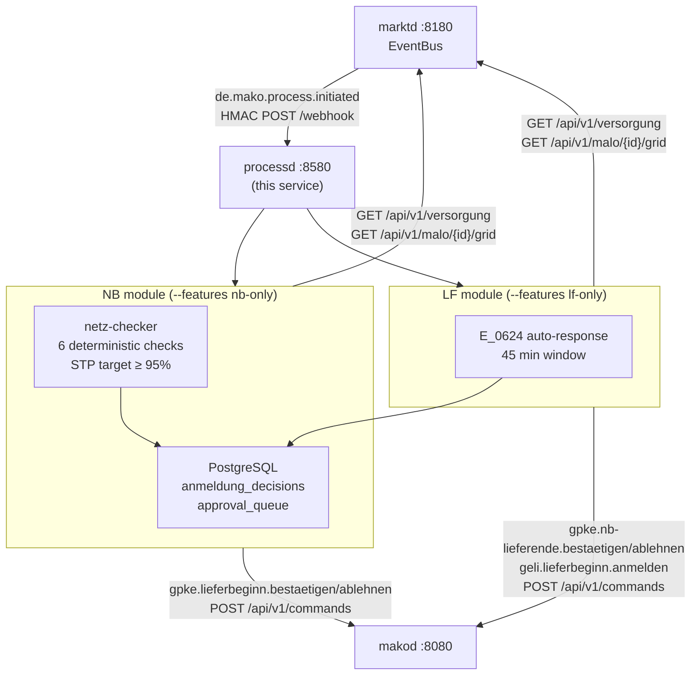

# `processd` Operator Guide

`processd` is the **process decision engine** — the service that automates
regulatory decisions within mandatory deadlines.



---

## Port layout

```
┌────────────────────────────────────────────────────────────────────┐
│  processd  :8580                                                  │
│                                                                  │
│  POST /webhook              ← marktd CloudEvents (HMAC)          │
│  GET  /api/v1/decisions     ← NB STP audit log (OIDC+Cedar)     │
│  GET  /api/v1/queue         ← LF approval queue                 │
│  POST /api/v1/queue/{id}/approve|reject  ← operator action       │
│  POST /api/v1/start-supply              ← LFN Strom bootstrap    │
│  POST /api/v1/start-supply-gas          ← LFN Gas 44001 bootstrap│
│  GET  /health/live  /health/ready                                │
│  POST|GET /mcp       ← MCP Streamable HTTP (2025-11-25)          │
└────────────────────────────────────────────────────────────────────┘
```

---

## Role isolation

`processd` is compiled with **feature flags** that gate which modules are included.
This ensures §7 EnWG separation: an `nb-only` binary provably contains no LF PIDs.

```toml
[features]
role-lf-strom  = []  # LFA E_0624 (PID 55008), LFN Strom bootstrap, INSRPT
role-lf-gas    = []  # LFA GeLi Gas stornierung + LFN Gas bootstrap (PID 44001)
role-nb-strom  = []  # GPKE Anmeldung STP (PIDs 55001, 55016)
role-nb-gas    = []  # GeLi Gas Anmeldung STP (PID 44001)

lf-only    = ["role-lf-strom", "role-lf-gas"]
nb-only    = ["role-nb-strom", "role-nb-gas"]
integrated = ["role-lf-strom", "role-lf-gas", "role-nb-strom", "role-nb-gas"]
```

For §7 EnWG deployments (≥ 100k Netzkunden): BNetzA inspects the binary SHA to
confirm no cross-contamination. Use separate container images compiled with
`nb-only` and `lf-only` respectively.

---

## NB module — Anmeldung STP

### Decision pipeline

```text
de.mako.process.initiated (PID 55001/55016/44001)
  → extract AnmeldungAnfrage from event payload
  → GET marktd /api/v1/versorgung/{malo_id}         → VersorgungsStatus
  → GET marktd /api/v1/malo/{malo_id}/grid           → MaloGridRecord
  → GET marktd /api/v1/partners/{lf_mp_id}             → partner_known
  → netz_checker::evaluate(anfrage, vs, grid, partner_known, now_utc())
      Accept   → anmeldung_decisions(Accept)
                 [if NB_AUTO_ACCEPT=true] → makod gpke.lieferbeginn.bestaetigen
      Reject   → anmeldung_decisions(Reject, erc_code) → makod ablehnen
      Escalate → anmeldung_decisions(Escalate) → operator alert
```

### netz-checker — 6 checks

| # | Rule | On failure |
|---|------|------------|
| 1 | `MaloGridRecord` exists for the MaLo | `Escalate` |
| 2 | `lf_mp_id_next` is `None` (no pending Lieferbeginn) | `Reject A06` |
| 3 | `process_date ≥ today` (no retroactive starts) | `Reject A97` |
| 4 | Bilanzierungsgebiet in UTILMD matches grid record | `Reject A02` |
| 5 | LF MP-ID in partner directory | `Reject A05` |
| 6 | Mindestvorlauffrist met (SLP: tomorrow+; RLM: 2 Werktage+) | `Reject A99` |

### STP rate targets

| Condition | STP |
|-----------|-----|
| Grid records not imported (cold NIS cache) | ~60 % |
| NIS data imported via `nis-syncd` or manual provisioning | ≥ 95 % |

Grid records are sourced from the NB’s own NIS/GIS system — **not** from MaStR.
See [marktd Grid topology](marktd#grid-topology--nisgis-integration) for import options.

Monitor via `GET /api/v1/decisions` or the `get_stp_rate` MCP tool.

### `NB_AUTO_ACCEPT`

Set `NB_AUTO_ACCEPT=false` (default) until you have verified:

1. Grid record coverage for your MaLo portfolio (`GET /api/v1/malo/{id}/grid`)
2. Partner directory populated for all expected LF MP-IDs
3. At least one manual review cycle confirmed correct ERC codes

### §20 EnWG — affiliate guard

When `processd` is deployed in an **integrated NB+LF utility** (§6b EnWG),
auto-acceptance is **always blocked** for Anmeldungen where the requesting LF
is an **affiliate** of the NB operator. This implements the §20 EnWG
Diskriminierungsfreiheitspflicht non-discrimination obligation.

Detection logic:

```text
new_supplier_mp_id ∈ obsd.own_mp_ids  →  initiator_is_affiliate = true
                                           auto_accept overridden to false
                                           decision: Escalate (operator review)
```

Configure the operator's own MP-IDs in `obsd.toml` (they are shared with `processd`
via the `obsd` CloudEvent payload):

```toml
[identity]
own_mp_ids = ["9900357000004", "9800357000004"]
```

`obsd` records `initiator_is_affiliate = true` on the resulting `ProcessProjection`
and the KPI report exposes the parity delta for **BNetzA audit evidence**.
See [obsd §20 EnWG parity](obsd#20-enwg-parity) for query examples.

---

## LF module — E_0624 auto-response

### Decision rules (PID 55008)

| VersorgungsStatus | Scenario | Decision |
|-------------------|----------|----------|
| `Beliefert` + `lf_mp_id == own_mp_id` | Standard | `einwilligung` |
| `Beliefert` + `lf_mp_id == own_mp_id` | `Einzug` | `ablehnen A32` |
| `Beliefert` + `lf_mp_id == own_mp_id` | `Ersatzversorgung` | `einwilligung` |
| `Grundversorgung` | any | `einwilligung` |
| MaLo unknown | any | `approval_queue` |
| `lf_mp_id != own_mp_id` | any | `approval_queue` |

### Approval queue

Entries expire at `deadline_at - 5 min` (where `deadline_at = event_time + 45 min`).
A background task runs every 60 s and sets `status = Expired` for stale entries.

**Operator workflow:**
```
GET /api/v1/queue                     → list Pending entries (review before expires_at)
POST /api/v1/queue/{id}/approve       → dispatch consent command via makod AND mark Approved
POST /api/v1/queue/{id}/reject        → dispatch reject command via makod AND mark Rejected
```

> **Regulatory deadline:** `expires_at = event_time + 45 min - 5 min`.
> The approve/reject handlers dispatch to `makod` **before** updating the DB — if
> `makod` is unavailable, the entry stays `Pending` so the operator can retry.
> Expired entries log a `WARN` and must be reconciled manually.

---

## LF module — LFN bootstrap

### Strom: `POST /api/v1/start-supply`

Initiates a GPKE Lieferbeginn (UTILMD 55001) with **LFW24 Vorlauffrist validation**
(BK6-22-024, effective 2025-06-06).

```bash
curl -X POST http://processd:8580/api/v1/start-supply \
  -H "Authorization: Bearer <token>" \
  -H "Content-Type: application/json" \
  -d '{"malo_id": "10001234567", "lieferbeginn_datum": "2026-10-01"}'
```

| Field | Required | Notes |
|---|---|---|
| `malo_id` | ✓ | 11-digit Strom Marktlokations-ID |
| `lieferbeginn_datum` | ✓ | ISO-8601 date (YYYY-MM-DD) |

**Vorlauffrist rules (15:00 CET/CEST cutoff):**

| Submission time | Earliest allowed Lieferbeginn |
|---|---|
| Before 15:00 Berlin | Next Arbeitstag (+1 Werktag) |
| At or after 15:00 Berlin | übernächster Arbeitstag (+2 Werktage) |
| Retroactive date (`< today_berlin`) | Rejected with `RETROACTIVE_DATE` |

Response includes `earliest_lieferbeginn` and `berlin_time_at_submission` for
operator transparency.

### Gas: `POST /api/v1/start-supply-gas`

Initiates a GeLi Gas Lieferbeginn (UTILMD 44001). Both `malo_id` and `zaehlpunkt`
**are mandatory** per BK7-24-01-009 AHB rules.

```bash
curl -X POST http://processd:8580/api/v1/start-supply-gas \
  -H "Authorization: Bearer <token>" \
  -H "Content-Type: application/json" \
  -d '{
    "malo_id":    "10001234567",
    "zaehlpunkt": "DE00123456789012345678901234567890",
    "process_date": "20261001"
  }'
```

| Field | Required | Notes |
|---|---|---|
| `malo_id` | ✓ | 11-digit Gas-MaLo-ID (IDE+Z19) |
| `zaehlpunkt` | ✓ | Zählpunktbezeichnung (RFF+Z13) |
| `process_date` | ✓ | Lieferbeginn date (YYYYMMDD, CET/CEST) |

The GNB responds with PID 44003 (confirmation) or 44004 (rejection). The LF
process (`geli-gas-lf-anmeldung`) tracks the 10-Werktage response deadline
automatically.

> **No API-Webdienste equivalent for Gas.** The ERP must supply the Gas-MaLo-ID
> (`malo_id`) upfront from the customer contract, MaStR, or DVGW Codevergabe.

### Gas Datenabruf: `geli.gas.datenabruf.anfragen`

Request Abrechnungsbrennwert and Zustandszahl on-demand (ORDERS 17103):

```bash
curl -X POST http://makod:8080/api/v1/commands \
  -H "Authorization: Bearer <token>" \
  -H "Content-Type: application/json" \
  -d '{"command": "geli.gas.datenabruf.anfragen", "payload": {"malo_id": "10001234567"}}'
```

The GNB responds with MSCONS 13007 (data delivery) or ORDRSP 19103 (rejection).
Successful delivery automatically updates `edmd` `meter_billing_periods` via the
existing `update_gas_quality` path.

---

## §20 EnWG parity

Every `anmeldung_decisions` row includes:

```sql
initiator_is_affiliate BOOLEAN  -- TRUE when lf_mp_id == own_mp_id (integrated deployment)
```

This field is the BNetzA audit evidence for §20 EnWG parity compliance.
A systematically faster decision time for `initiator_is_affiliate = true` is
a §20 EnWG violation in integrated §6b EnWG deployments.

Use `obsd`'s parity report or query directly:

```sql
SELECT
    initiator_is_affiliate,
    COUNT(*) AS total,
    AVG(EXTRACT(EPOCH FROM (decided_at - created_at))) AS avg_response_secs
FROM anmeldung_decisions
WHERE tenant = $1 AND decided_at >= now() - interval '90 days'
GROUP BY initiator_is_affiliate;
```

---

## Configuration reference

`processd` reads its configuration from a **TOML file** (default: `processd.toml`),
with secrets deferred to environment variables via `"env:VAR_NAME"` values.

```bash
processd --config /etc/processd/processd.toml
# or: PROCESSD_CONFIG=/etc/processd/processd.toml processd
```

### Full `processd.toml` reference

```toml
[http]
addr = "0.0.0.0:8580"          # default

[database]
url       = "env:DATABASE_URL"  # required; use env: for secrets
pool_size = 10                  # default

[identity]
own_mp_id = "9900357000004"     # required — must match makod.toml [[party]] primary
tenant    = ""                  # optional; defaults to own_mp_id

[makod]
url     = "http://makod:8080"   # required
api_key = "env:MAKOD_API_KEY"   # required

[marktd]
url     = "http://marktd:8180"  # required
api_key = "env:MARKTD_API_KEY"  # required

[webhook]
inbound_secret = "env:INBOUND_WEBHOOK_SECRET"   # optional; omit for dev

[subscription]
# Self-register this subscription with marktd on startup.
# No manual curl required — topology is fully config-driven.
webhook_url   = "http://processd:8580/webhook"  # optional; omit to skip registration
subscriber_id = "processd"                       # default
event_types   = "de.mako.process.initiated"     # default

[nb]
auto_accept = false   # true → dispatch bestaetigen automatically on Accept

[lf]
auto_respond   = true   # false → all E_0624 routed to approval_queue
queue_ttl_secs = 2700   # 45 min — LFW24 deadline

# [oidc]                # omit to disable auth (dev only — never omit in production)
# issuer   = "https://login.microsoftonline.com/{tenant-id}/v2.0"
# audience = "api://mako-processd"
# jwks_refresh_secs = 300

# [otel]               # omit to disable tracing
# endpoint = "http://otel-collector:4317"
```

### CLI flags

| Flag | Env var | Default | Description |
|------|---------|---------|-------------|
| `--config` / `-c` | `PROCESSD_CONFIG` | `processd.toml` | Path to `processd.toml` |
| `--log-level` | `RUST_LOG` | `info` | Log level (`info`, `debug`, `processd=trace`) |
| `--check` | `PROCESSD_CHECK` | `false` | Validate config + DB connectivity, then exit 0 |

---

## marktd subscription — self-registration

`processd` **self-registers** its subscription with `marktd` on startup.
Set `[subscription] webhook_url` in `processd.toml` to the URL `marktd` should POST
events to, and `processd` calls `PUT /api/v1/subscriptions/{subscriber_id}`
automatically with exponential-backoff retry (up to 30 s).

This makes subscription topology **configuration-driven** (TOML / Helm
`values.yaml`) rather than an imperative bootstrap step.

For Helm charts, map `[subscription]` to `values.yaml` under `processd.subscription.*`.

---

## MCP tools

| Tool | Role | Description |
|------|------|-------------|
| `list_decisions` | NB | Last N Anmeldung decisions with ERC codes and affiliate flag |
| `get_stp_rate` | NB | STP rate over last N days vs. 95 % target |
| `list_pending_approvals` | LF | Pending approval queue entries (most urgent first) |
| `get_queue_entry` | LF | Single queue entry by UUID |

---

## Monitoring

`GET /metrics` returns Prometheus-compatible metrics sourced from PostgreSQL:

| Metric | Type | Description |
|--------|------|-------------|
| `processd_decisions_total{decision,pid}` | counter | NB STP decisions by outcome (`Accept`/`Reject`/`Escalate`) and PID (`55001`/`44001`) |
| `processd_approval_queue_depth` | gauge | Pending LF E_0624 entries in `approval_queue` (unresolved) |
| `processd_db_pool_size` | gauge | PostgreSQL connection pool size |
| `processd_db_pool_idle` | gauge | Idle PostgreSQL connections |

### Alert rules

| Metric / Query | Target |
|----------------|--------|
| `processd_decisions_total{decision="Accept"} / processd_decisions_total` | ≥ 95 % (STP rate) |
| `processd_approval_queue_depth` approaching TTL | 0 near-expiry entries |
| `processd_decisions_total{decision="Escalate"}` / total | < 5 % (grid coverage indicator) |

Alert when:
- STP rate drops below 90 % (grid record coverage degraded — run `nis-syncd`)
- `processd_approval_queue_depth` > 0 entries near TTL (LF deadline risk)
- Decision latency > 10 s (marktd connectivity issue)

---

## MSB module — WiM MSB-Wechsel STP

`processd` includes a **WiM MSB-Wechsel STP** engine (feature: `role-nb-strom`) that
automatically evaluates inbound UTILMD 55039 (Kündigung MSB) and 55042 (Anmeldung MSB)
requests from new Messstellenbetreiber. STP target: **≥ 80 %**.

### Decision pipeline (`msb_module.rs`)

```
de.mako.process.initiated (PID 55039 / 55042)
  → GET marktd /api/v1/versorgung/{malo_id}   ← MeLo exists?
  → GET marktd /api/v1/partners/{nmsb_mp_id}  ← nMSB registered?
  → GET marktd /api/v1/technische-ressourcen/{sr_id} ← SR linked?
  → evaluate_msb_anmeldung / evaluate_msb_kuendigung (pure, no I/O)
      Accept   → wim.msb-wechsel.anmeldung.bestaetigen
      Reject   → wim.msb-wechsel.anmeldung.ablehnen (ERC code)
      Escalate → operator alert (manual decision required)
```

### Evaluation checks (PID 55042 — Anmeldung)

| # | Check | ERC on failure |
|---|---|---|
| 1 | MeLo exists in `marktd` grid registry | A02 |
| 2 | nMSB registered in partner directory | A05 |
| 3 | MeLo has an iMSys device (§14a mandatory MSB eligibility review) | Escalate |
| 4 | `SteuerbareRessource` linked (§14a eligibility review) | Escalate |
| 5 | Zaehler count > 0 (grid record exists for the MeLo) | Escalate |

Checks 1–2 are hard rejects (A02/A05). Checks 3–5 trigger operator escalation — `processd`
cannot make the §14a eligibility determination autonomously.

**Kündigung (PID 55039)** only applies checks 1–2. The NB has no valid grounds to reject
termination when the MeLo exists and the nMSB is registered.

### Escalation reasons

| Scenario | Escalate reason |
|---|---|
| iMSys device present | `MeLo {id} has an iMSys device — §14a eligibility check required` |
| SR-linked §14a load | `MeLo {id} has linked SteuerbareRessource {id} — §14a Modul eligibility check required` |
| No Zaehler registered | `MeLo {id} has no registered meters — NIS/GIS data import required` |

All escalated decisions still generate an `anmeldung_decisions` row for §20 EnWG audit trail.

---

## MSB module — REQOTE auto-response

When `processd` receives `de.mako.process.initiated` for PIDs 35001–35005 (REQOTE Preisanfrage from an nMSB), it **automatically dispatches a QUOTES response** sourced from the active `PreisblattMessung` in `marktd`. Dispatching from master data rather than from a manual ERP trigger is what keeps the response inside the APERAK ERC A97 deadline.

### Decision pipeline

```
de.mako.process.initiated (PIDs 35001–35005, REQOTE)
  → GET marktd /api/v1/preisblaetter-messung/{own_mp_id}  ← PreisblattMessung current?
      Found   → wim.preisanfrage.angebot-senden
                 (includes preisblatt_gueltigkeit in payload for makod QUOTES build)
      Not found → operator alert (no auto-response — prevents blind QUOTES)
```

Enable in `processd.toml`:

```toml
[msb]
auto_preisanfrage = true   # default: true
```

Set `auto_preisanfrage = false` to require manual QUOTES dispatch via ERP (e.g. during PreisblattMessung update windows).

---

## MSB module — §14a Steuerungsauftrag auto-ORDRSP

When an MSB receives a WiM Steuerungsauftrag (iMS ORDERS, `makoworkflow = wim-steuerungsauftrag`), `processd` auto-confirms if:

1. The `SteuerbareRessource.istFernschaltbar = true` (remote-switchable), **and**
2. The dispatched `produktcode` is in the contracted `konfigurationsprodukte` list (BK6-24-174 §4.3).

If the `produktcode` is not contracted, `processd` dispatches `wim.steuerungsauftrag.ablehnen` immediately — preventing unauthorized control of customer assets.

### Decision pipeline

```
de.mako.process.initiated (wim-steuerungsauftrag)
  → [parallel]
      GET marktd /api/v1/steuerbare-ressourcen/{sr_id}                 ← istFernschaltbar?
      GET marktd /api/v1/steuerbare-ressourcen/{sr_id}/konfigurationsprodukte  ← contracted?
  → istFernschaltbar=true + produktcode contracted  → bestaetigen
  → istFernschaltbar=true + produktcode NOT contracted  → ablehnen (BK6-24-174 §4.3)
  → istFernschaltbar=false  → Escalate (manual ORDRSP required)
  → SR not found  → Escalate
```

Register contracted products via `PUT /api/v1/steuerbare-ressourcen/{sr_id}/konfigurationsprodukte` in `marktd`. Each entry requires a non-empty `zaehlzeitregister`-linked `produktcode`.
