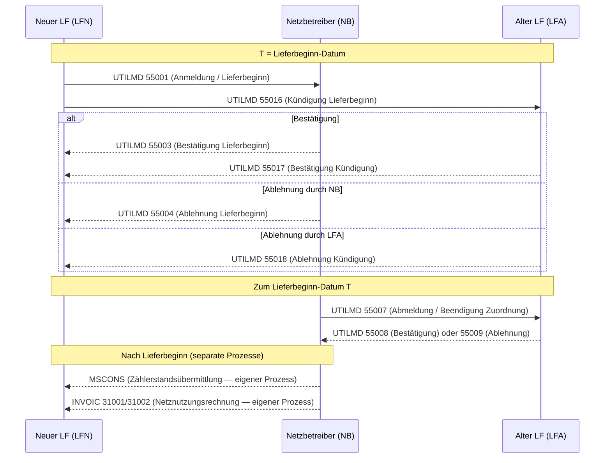
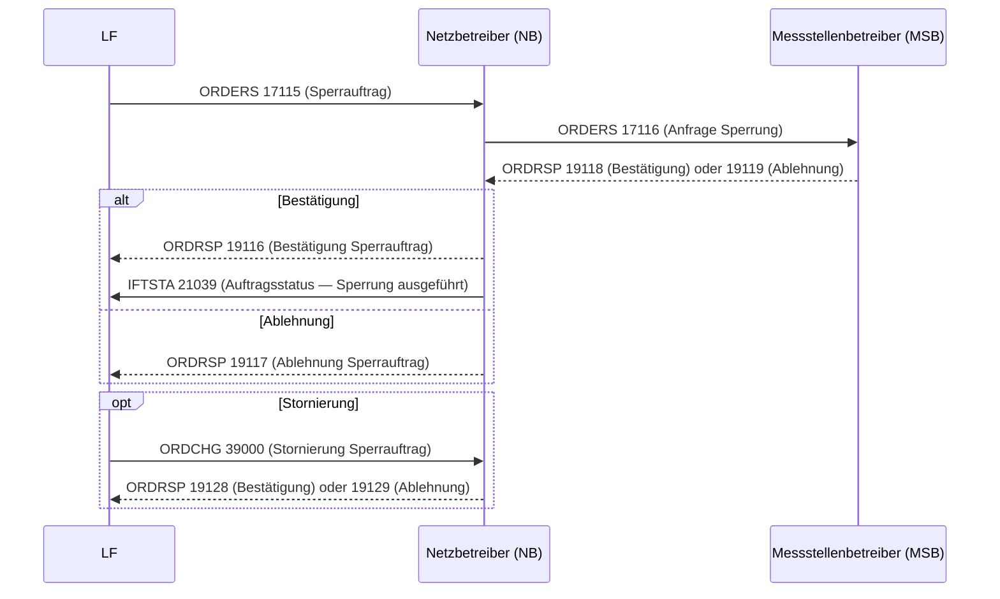
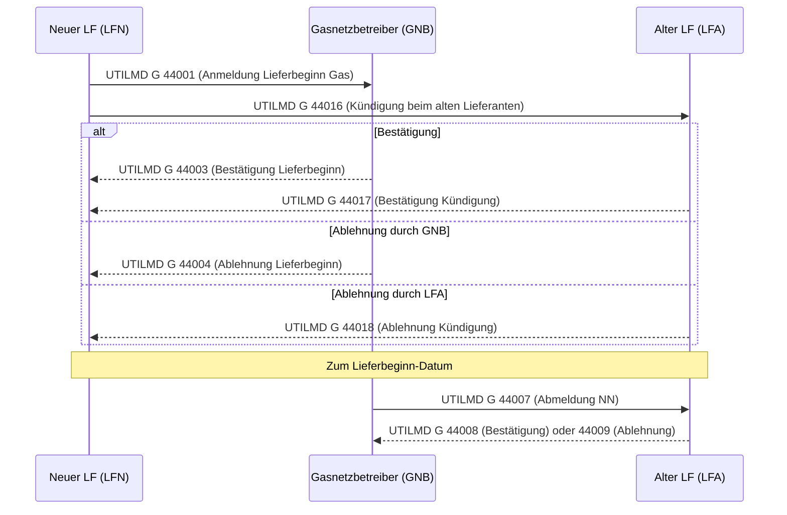
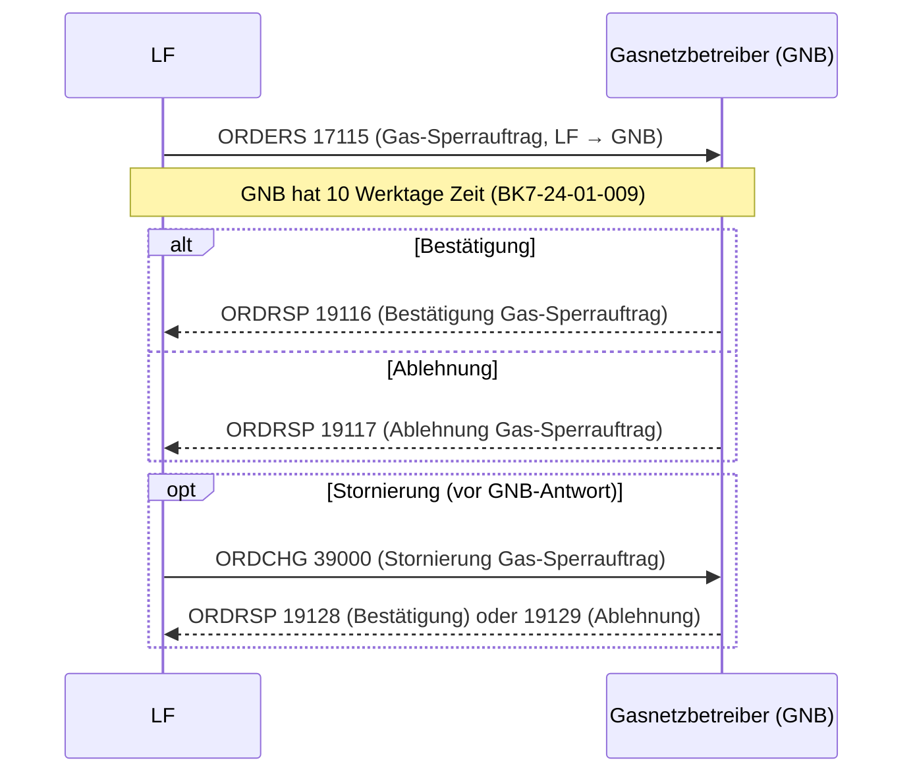
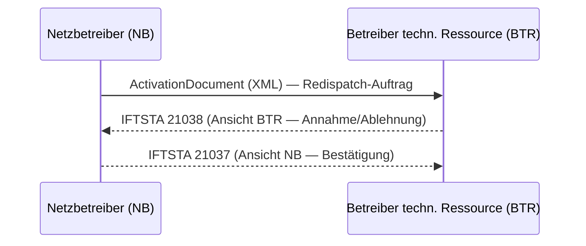

# Process Catalog

This page is the **business-level** companion to the [PID Reference](pid-reference).
Where the PID Reference lists every individual EDIFACT message type, the Process
Catalog groups related messages into **complete end-to-end processes** — the unit
of work from the business perspective and the unit of implementation in the
`mako-*` domain crates.

> **Role coverage.** All market roles are equally supported: Lieferant (LF/LFN/LFA),
> Netzbetreiber (NB/GNB), Messstellenbetreiber (MSB/gMSB), Bilanzkreisverantwortlicher (BKV),
> Übertragungsnetzbetreiber (ÜNB), and others. Each process table lists all participating
> roles and marks which crate implements each side of the exchange.

> **Commodity isolation.** Strom and Gas are fully independent deployment units.
> A makod instance for Strom loads only `mako-gpke` + `mako-wim` + `mako-mabis`.
> A makod instance for Gas loads only `mako-geli-gas` + `mako-wim-gas` + `mako-gabi-gas`.
> Running separate instances per commodity is explicitly supported and common in
> production. A combined instance is equally valid. Each section in this catalog
> is documented as **self-contained** — no cross-commodity knowledge required.

**Both format versions coexist simultaneously:**

| Format version | Valid period |
|---|---|
| `FV2025-10-01` | 2025-10-01 – 2026-09-30 (current production) |
| `FV2026-10-01` | from 2026-10-01 (next release — profiles already deployed) |

**Status legend:**

| Symbol | Meaning |
|---|---|
| ✅ | Full state machine + AHB rule enforcement, production-safe |
| ⚠️ | PID registered, partial handling — accepts message, limited state transitions |
| 🔄 | Placeholder crate — not yet implemented |
| — | Not registered; inbound messages are dead-lettered |

**APERAK Frist legend:**

| Domain | Frist |
|---|---|
| GPKE | 24 Stunden (wall-clock) |
| WiM Strom | 5 Werktage |
| GeLi Gas | 10 Werktage |
| WiM Gas | 10 Werktage |

Saturday counts as a Werktag; Sundays and public holidays do not.
Deadline arithmetic uses German local time (CET/CEST) — an off-by-one-hour error
at DST transitions constitutes a regulatory deadline violation.

---

## Process Overview

Quick reference across all process families. Each row is a top-level domain.

| Domain | Sparte | Crate | Key PIDs | APERAK Frist | Basis |
|---|:---:|---|---|---|---|
| **GPKE Lieferantenwechsel** | ⚡ | `mako-gpke` | UTILMD 55001–55018, 55600–55605 | 24 h | BK6-24-174 |
| **GPKE Sperrung/Entsperrung** | ⚡ | `mako-gpke` | ORDERS 17115, 17117 → ORDRSP 19116/19117 | 24 h | BK6-22-024 |
| **GPKE Abrechnung (INVOIC)** | ⚡ | `mako-gpke` | INVOIC 31001, 31002, 31005–31008; REMADV 33001–33004 | 24 h | BK6-24-174 |
| **GPKE Datenabruf** | ⚡ | `mako-gpke` | ORDERS 17004, 17102, 17113; UTILMD 55555 | 24 h | BK6-22-024 |
| **GPKE UTILTS** | ⚡ | `mako-gpke` | UTILTS 25001, 25004–25010 | 24 h | BK6-24-174 |
| **GPKE MSCONS** | ⚡ | `mako-gpke` | MSCONS (metered values NB→LF) | 24 h | BK6-24-174 |
| **WiM Strom MSB-Wechsel** | ⚡ | `mako-wim` | UTILMD 55039, 55042, 55051, 55168 | 5 WT | BK6-24-174 |
| **WiM Strom Geräteübernahme** | ⚡ | `mako-wim` | ORDERS 17001, 17002, 17009, 17011 | 5 WT | BK6-24-174 |
| **WiM Strom Abrechnung** | ⚡ | `mako-wim` | INVOIC 31009 | 5 WT | BK6-24-174 |
| **MaBiS Bilanzkreisabrechnung** | ⚡ | `mako-mabis` | MSCONS 13003; IFTSTA 21000–21005 | — (calendar) | BK6-24-174 |
| **GeLi Gas Lieferantenwechsel** | 🔥 | `mako-geli-gas` | UTILMD G 44001–44021 | 10 WT | BK7-24-01-009 |
| **GeLi Gas Sperrung/Entsperrung** | 🔥 | `mako-geli-gas` | ORDERS 17115, 17117 → ORDRSP 19116/19117 | 10 WT | BK7-24-01-009 |
| **GeLi Gas Datenabruf** | 🔥 | `mako-geli-gas` | ORDERS 17103, 17104 | 10 WT | BK7-24-01-009 |
| **WiM Gas MSB-Wechsel** | 🔥 | `mako-wim-gas` ⚠️ | UTILMD G 44039–44053, 44168–44170 | 10 WT | BK7-24-01-009 |
| **GaBi Gas Kapazitätsabrechnung** | 🔥 | `mako-gabi-gas` ✅ | INVOIC 31010, 31011 | — | BK7 |
| **PARTIN Partnerstammdaten** | ⚡🔥 | `mako-gpke` / `mako-geli-gas` | PARTIN 37000–37014 | — | PARTIN AHB 1.0f |
| **Redispatch 2.0** | ⚡ | `mako-redispatch` | IFTSTA 21037/21038; XML documents | — | BK6-20-160 |
| **DVGW Gas Transport** | 🔥 | `mako-gabi-gas` 🔄 | Synthetic PIDs 90001–90062 | — | DVGW G685/G2000 |

> WT = Werktage (Saturday counts; Sunday and public holidays excluded).
> All APERAK Fristen computed in German local time (CET/CEST).

---

## Table of Contents

1. [GPKE — Kundenbelieferung Elektrizität](#gpke--kundenbelieferung-elektrizität)
   - [Lieferantenwechsel Strom](#lieferantenwechsel-strom)
   - [Sperrung / Entsperrung Strom](#sperrung--entsperrung-strom)
   - [INVOIC Strom Abrechnung](#invoic-strom-abrechnung)
   - [Datenabruf und Stammdatenprozesse](#datenabruf-und-stammdatenprozesse)
   - [UTILTS — Berechnungsformeln und Zählzeitdefinitionen](#utilts--berechnungsformeln-und-zählzeitdefinitionen)
   - [MSCONS — Zählerstandsübermittlung](#mscons--zählerstandsübermittlung)
   - [GPKE IFTSTA — Vollzugsmeldungen, Statusmeldungen, EnFG](#gpke-iftsta--vollzugsmeldungen-statusmeldungen-enfg-gpke-teil-234)
2. [WiM Strom — Messstellenbetrieb](#wim-strom--messstellenbetrieb)
   - [MSB-Wechsel Strom](#msb-wechsel-strom)
   - [Geräteübernahme und Stammdaten](#geräteübernahme-und-stammdaten)
   - [WiM-Abrechnung](#wim-abrechnung)
   - [Technik-Änderung und Gerätekonfiguration](#technik-änderung-und-gerätekonfiguration)
   - [Preisanfrage, Angebote und Preislisten](#preisanfrage-angebote-und-preislisten)
   - [Steuerungsauftrag (API-Webdienste Strom)](#steuerungsauftrag-api-webdienste-strom)
   - [IFTSTA Status (WiM Strom)](#iftsta-status-wim-strom)
   - [INSRPT — Störungsmeldungen (WiM Strom)](#insrpt--störungsmeldungen-wim-strom)
3. [MaBiS — Bilanzkreisabrechnung Strom](#mabis--bilanzkreisabrechnung-strom)
4. [GeLi Gas — Lieferantenwechsel Gas](#geli-gas--lieferantenwechsel-gas)
   - [Lieferantenwechsel Gas](#lieferantenwechsel-gas)
   - [Sperrung / Entsperrung Gas](#sperrung--entsperrung-gas)
   - [Gas Abrechnung — Billing Scope](#gas-abrechnung--billing-scope)
   - [Gas Datenabruf](#gas-datenabruf)
   - [MSCONS Gas — Messwert- und Energiemengenübermittlung](#mscons-gas--messwert--und-energiemengenübermittlung)
5. [WiM Gas — Messstellenbetrieb Gas](#wim-gas--messstellenbetrieb-gas)
   - [WiM Gas Abrechnung](#wim-gas-abrechnung)
   - [WiM Gas — INSRPT Störungsmeldungen](#wim-gas--insrpt-störungsmeldungen)
6. [GaBi Gas — Kapazitätsabrechnung Gas](#gabi-gas--kapazitätsabrechnung-gas)
7. [PARTIN — Stammdaten Marktpartner](#partin--stammdaten-marktpartner)
8. [Redispatch 2.0](#redispatch-20)
9. [DVGW — Gas Transport](#dvgw--gas-transport)

---

## GPKE — Kundenbelieferung Elektrizität

**Regulatory basis:** BK6-24-174 (Beschluss 24.10.2024, gültig ab 06.06.2025) +
BK6-22-024 (GPKE Teil 4, Stammdaten und Konfiguration)

**APERAK Frist:** **24 wall-clock hours** from receipt of the triggering message.

---

### Lieferantenwechsel Strom

The supplier-switch process (GPKE Teil 2) is the highest-volume process in the
German electricity market. The incoming supplier (LFN) initiates the registration
and simultaneously cancels the outgoing supplier's (LFA) contract. Both the
NB and LFA must respond within 24 h.

**Process timing rules (BK6-22-024 / BK6-24-174):**

| Scenario | Mindestvorlauffrist | Notes |
|---|---|---|
| Standardwechsel | 7 Werktage vor Lieferbeginn | Eingang bei NB und LFA auf demselben Kalendertag |
| Schneller Lieferantenwechsel | nächster Werktag | Eingang bis 12:00 Uhr des Vortages |
| Neuanlage MaLo | keine Mindestfrist | Lieferbeginn = Tag der Fertigstellung |
| Stornierung Zuordnung | bis 24 h vor Lieferbeginn | Nur der ursprüngliche Sender darf stornieren |

> **Einreichungstag rule:** UTILMD 55001 (LFN → NB) and UTILMD 55016 (LFN → LFA)
> must be submitted on the **same calendar day**. The NB coordinates the transition;
> the actual LFA disconnection follows automatically at Lieferbeginn-Datum.

**Grund- und Ersatzversorgung (GEV / EOG):** When a customer has no active
supplier (e.g. after LFA exit, insolvency), the NB activates the basic supplier
(Grundversorger). The NB sends an End-of-Contract / EOG notification to the
outgoing LF and registers the basic supplier automatically. Standard GPKE PIDs
apply (55007–55015 range) via the `gpke-supplier-change` workflow.

| Process | Initiator → Responder | Anfrage PID | Antwort OK | Antwort NG | Crate |
|---|---|---|---|---|---|
| Anmeldung / Lieferbeginn (LF-AN) | LFN → NB | UTILMD **55001** | 55003 | 55004 | `mako-gpke` ✅ |
| Lieferende / Abmeldung (LFN → NB) | LFN → NB | UTILMD **55002** | 55005 | 55006 | `mako-gpke` ✅ |
| Anmeldung erz. MaLo (LF-AN) | LFN → NB | UTILMD **55077** | 55078 | 55080 | `mako-gpke` — |
| Neuanlage verb. MaLo | LF → NB | UTILMD **55600** | 55602 | 55604 | `mako-gpke` ✅ |
| Neuanlage erz. MaLo | LF → NB | UTILMD **55601** | 55603 | 55605 | `mako-gpke` ✅ |
| Kündigung Lieferbeginn | LFN → LFA | UTILMD **55016** | 55017 | 55018 | `mako-gpke` ✅ |
| Abmeldung (NB-initiiert) | NB → LFA | UTILMD **55007** | 55008 | 55009 | `mako-gpke` ✅ |
| Änderung MSB-Abrechnungsdaten der MaLo | LFN ↔ NB | UTILMD **55557** | — | — | `mako-gpke` ✅ |
| Ankündigung Zuordnung LF | NB → LFN | UTILMD **55607** | 55608 | 55609 | — |
| Stornierung Zuordnungsprozess | orig. → orig. | UTILMD **55022** | 55023 | 55024 | `mako-gpke` ✅ |

> **Lieferbeginn = T.** Both UTILMD 55001 (LFN → NB) and 55016 (LFN → LFA) are sent
> on the same day, referencing the same `Lieferbeginn`-date. The NB coordinates
> the transition; the actual disconnection of LFA follows automatically when the
> Lieferbeginn date is reached.

**Message flow — Lieferantenwechsel Strom (LF-AN):**

> **Note:** MSCONS and INVOIC arrive after Lieferbeginn as independent processes with
> their own process IDs and APERAK windows. They are shown here only to indicate the
> downstream billing relationship.

---

### Sperrung / Entsperrung Strom

The LF can order a disconnection (Sperrung) or reconnection (Entsperrung) of a
market location via ORDERS. The NB forwards the order to the MSB (metering point
operator). After physical execution, the NB confirms back to the LF via ORDRSP
and sends an IFTSTA status update.

PIDs 17115 and 17117 are shared between **GPKE Strom** (NB-role inbound) and
**GeLi Gas** (LF-role outbound). Routing is determined by market context
(Sparte Strom vs. Gas) at the protocol level.

| Process | Initiator → Responder | Anfrage PID | Antwort OK | Antwort NG | Crate |
|---|---|---|---|---|---|
| Sperrauftrag LF-initiiert (Strom) | LF → NB | ORDERS **17115** | ORDRSP 19116 | ORDRSP 19117 | `mako-gpke` ✅ |
| Entsperrauftrag LF-initiiert (Strom) | LF → NB | ORDERS **17117** | ORDRSP 19116 | ORDRSP 19117 | `mako-gpke` ✅ |
| Anfrage Sperrung (NB → MSB) | NB → MSB | ORDERS **17116** | ORDRSP 19118 | ORDRSP 19119 | `mako-gpke` ✅ |
| Auftragsstatus Sperren | NB → LF/MSB/ÜNB | — | IFTSTA **21039** | — | `mako-gpke` ✅ |
| Info Entsperrauftrag | NB → MSB | — | IFTSTA **21040** | — | — |
| Stornierung Sperrauftrag | LF → NB | ORDCHG **39000** | ORDRSP 19128 | ORDRSP 19129 | `mako-gpke` ✅ |
| Weiterleitung Stornierung | NB → MSB | ORDCHG **39001** | — | — | — |

**Message flow — Sperrauftrag Strom (LF-initiiert):**

---

### INVOIC Strom Abrechnung

Network billing messages from the NB to the LF. The LF is the passive receiver;
acknowledgement is via APERAK within 24 h.

#### INVOIC — Netznutzungs- und Mehr-/Mindermengenabrechnung

| Process | Sender → Empfänger | INVOIC PID | Content | Crate |
|---|---|---|---|---|
| Abschlagsrechnung | NB → LF | INVOIC **31001** | Netznutzung Abschlag | `mako-gpke` ✅ |
| NN-Rechnung | NB → LF | INVOIC **31002** | Netznutzungsabrechnung (Jahresabrechnung) | `mako-gpke` ✅ |
| Mehr-/Mindermengen Strom | NB → LF | INVOIC **31005–31008** | MMM Strom Abrechnung | `mako-gpke` ✅ |
| MSB-Rechnung | MSB → LF | INVOIC **31009** | WiM Messstellenbetriebsabrechnung | `mako-wim` ✅ |

> **Note:** PIDs 31003 and 31004 do not belong to GPKE Strom. A Strom-only
> deployment never receives these messages. See the [WiM Gas](#wim-gas--messstellenbetrieb-gas)
> section if deploying Gas metering-service billing.

> **Regulatory boundary:** PIDs 31005–31008 are exclusively **Strom** processes per
> BNetzA BK6 Mitteilung Nr. 72 (05.02.2026). Gas MMM billing uses separate PIDs.

#### REMADV / COMDIS — Zahlungsabwicklung

After an INVOIC is received, the **payer** (LF or NB) sends a REMADV to confirm or
partially reject the payment. The **invoicer** (NB or MSB) can dispute the REMADV
via COMDIS 29001.

| Message | Sender → Empfänger | PID | Meaning | Crate |
|---|---|---|---|---|
| Zahlungsavis (vollständige Zahlung) | LF → NB | REMADV **33001** | Full payment confirmation | `mako-gpke` ✅ |
| Zahlungsavis (Ablehnung Zahlung) | LF → NB | REMADV **33002** | Payment rejected | `mako-gpke` ✅ |
| Zahlungsavis (Teilzahlung Netznutzung) | LF → NB | REMADV **33003** | Partial payment NNA | `mako-gpke` ✅ |
| Zahlungsavis (Teilzahlung MMM) | LF → NB | REMADV **33004** | Partial payment MMM | `mako-gpke` ✅ |
| Ablehnung Zahlungsavis | NB → LF | COMDIS **29001** | Invoicer disputes REMADV | `mako-gpke` ✅ |

---

### Datenabruf und Stammdatenprozesse

Data requests and configuration processes under GPKE Teil 4 (BK6-22-024).

> **Multi-crate processes:** Some PIDs appear in more than one crate when the
> direction or Marktrolle differs. For example, ORDERS 17132 (Stammdaten MeLo)
> is handled by `mako-wim` because it uses WiM-specific MeLo semantics, while
> all other GPKE datenabruf PIDs live in `mako-gpke`.

#### Datenabruf

| Process | Initiator → Responder | Anfrage PID | Antwort | Crate |
|---|---|---|---|---|
| Anfrage Daten der individuellen Bestellung | LF → NB | UTILMD **55555** | UTILMD 55553 | `mako-gpke` ✅ |
| Anfrage Werte (GPKE) | LF → MSB/NB | ORDERS **17004** | ORDRSP 19101 | `mako-gpke` ✅ |
| Anfrage Stammdaten MaLo (Strom) | LF/NB → NB | ORDERS **17102** | ORDRSP 19102 | `mako-gpke` ✅ |
| Anfrage Stammdaten NNE/NLPV | LF → NB | ORDERS **17113** | ORDRSP 19114 | `mako-gpke` ✅ |
| Anfrage Stammdaten Messlokation | LF/MSB → NB | ORDERS **17132** | ORDRSP | `mako-wim` ✅ |
| Anforderung Allokationsliste | LF → NB | ORDERS **17110** | ORDRSP 19110 | `mako-gpke` ✅ |
| Anforderung bilanzierte Menge | NB/LF → ÜNB | ORDERS **17114** | ORDRSP 19115 | `mako-gpke` ✅ |

#### Konfigurationseinrichtung (NB-outbound)

These ORDERS messages are **generated by the NB workflow** as part of its
post-Lieferbeginn configuration obligation (GPKE Teil 4 §3). They are dispatched
via the NB's outbox after UTILMD 55001 is accepted — they are **not** inbound
routing PIDs. The MSB responds with ORDRSP 19001 (Bestätigung) or 19002 (Ablehnung)
which are routed back to the `gpke-konfiguration` workflow.

| Process (BDEW AHB name) | NB sends to | ORDERS PID | MSB-Antwort | Crate |
|---|---|---|---|---|
| Einrichtung Konfiguration aufgrund Zuordnung LF (NB an MSB) | NB → MSB | **17134** | ORDRSP 19001/19002 | `mako-gpke` ✅ |
| Einrichtung Konfiguration aufgrund Zuordnung LF (MSB an MSB) ¹ | NB → MSB | **17135** | ORDRSP 19001/19002 | `mako-gpke` ✅ |

> ¹ Despite the name "MSB an MSB", ORDERS 17135 is **sent by the NB** (via its outbox)
> to coordinate configuration between two MSBs. The NB workflow (`gpke-konfiguration`)
> is the owner; no MSB system invokes this directly.

#### Konfigurationsänderung (LF/NB-initiated)

| Process | Initiator → Responder | ORDERS PID | Antwort | Crate |
|---|---|---|---|---|
| Änderung Prognosegrundlage | LF → NB | **17120** | ORDRSP 19121 | `mako-gpke` ✅ |
| Änderung Konfiguration (NB → MSB) | NB → MSB | **17121** | ORDRSP | `mako-gpke` ✅ |
| Änderung Lastprofilzuordnung | LF/NB → NB | **17122/17123** | ORDRSP | `mako-gpke` ✅ |
| Änderung iMS-Pflichteinbau | NB → MSB | **17128–17131** | ORDRSP | `mako-gpke` ✅ |
| Änderung Netzengpassmanagement | LF → NB | **17133** | ORDRSP | `mako-gpke` ✅ |

---

### UTILTS — Berechnungsformeln und Zählzeitdefinitionen

**Workflow:** `gpke-utilts` — Inbound-only receive-and-store. No APERAK is triggered
by the LF for UTILTS; the NB expects acknowledgement via CONTRL at transport level.

| PID | Description | Sender → Empfänger |
|---|---|---|
| 25001 | Berechnungsformel | NB → LF |
| 25004 | Übermittlung Übersicht Zählzeitdefinitionen | NB/MSB → LF |
| 25005–25010 | Weitere UTILTS-Varianten (Messwertparameter, etc.) | NB/MSB → LF |

UTILTS is used by the NB to distribute tariff formula structures and meter-reading
time-zone definitions to all connected suppliers. The LF stores these for billing
calculation and pass-through to the ERP system.

---

### MSCONS — Zählerstandsübermittlung

**Workflow:** `gpke-messwerte`

MSCONS messages carry meter readings, load profiles, and interval metered values.
The NB sends MSCONS to the LF at defined reporting intervals and at Lieferbeginn/
Lieferende. The LF acknowledges with APERAK within 24 h.

| Context | Sender → Empfänger | Trigger |
|---|---|---|
| Turnusablesung | NB → LF | Annual or quarterly meter read |
| Lieferbeginn | NB → LF | At or shortly after Lieferbeginn-Datum |
| Lieferende | NB → LF | Final reading at Lieferende |
| Nachlieferung | NB → LF | Late-arriving corrected values |

---

### GPKE IFTSTA — Vollzugsmeldungen, Statusmeldungen, EnFG (GPKE Teil 2/3/4)

IFTSTA messages in the GPKE family carry supplier-change execution confirmations
(Vollzugsmeldungen), Konfigurationsänderung responses, and EnFG-related status
notifications (privilege information and billing status under the
Energiefinanzierungsgesetz, 2023). All are routed to the relevant `mako-gpke`
workflow for correlation; no separate receipt-only workflow exists.

| IFTSTA PID | Description (IFTSTA AHB) | Sender → Empfänger | Crate |
|---|---|---|---|
| 21024 | Vollzugsmeldung Lieferantenwechsel | NB → LF | `mako-gpke` `gpke-supplier-change` ✅ |
| 21025 | Vollzugsmeldung Einzug | NB → LF | `mako-gpke` `gpke-supplier-change` ✅ |
| 21026 | Vollzugsmeldung Auszug | NB → LF | `mako-gpke` `gpke-supplier-change` ✅ |
| 21027 | Vollzugsmeldung Netznutzung | NB → LF | `mako-gpke` `gpke-supplier-change` ✅ |
| 21028 | Vollzugsmeldung | NB → LF | `mako-gpke` `gpke-supplier-change` ✅ |
| 21033 | Statusmeldung Kündigung | MSB → NB/LF | `mako-gpke` `gpke-supplier-change` ✅ |
| 21035 | Rückmeldung an Lieferstelle (GPKE Teil 2) | MSB → LF | `mako-gpke` `gpke-supplier-change` ✅ |
| 21043 | Bestellungsantwort / -mitteilung (GPKE Teil 3) | NB → LF · MSB → MSB · MSB → NB · MSB → LF | `mako-gpke` `gpke-konfiguration-aenderung` ✅ |
| 21044 | Bestellungsbeendigung (GPKE Teil 3) | MSB → NB · MSB → LF | `mako-gpke` `gpke-konfiguration-aenderung` ✅ |
| 21045 | EnFG Informationen (GPKE Teil 4) | LF → NB | `mako-gpke` `gpke-supplier-change` ✅ |
| 21047 | Bearbeitungsstandsmeldung (GPKE Teil 2/4) | NB → LF · NB → ÜNB · MSB → NB · MSB → LF | `mako-gpke` `gpke-supplier-change` ✅ |

> PID 21042 (Privilegierungsinformation EnFG, NB → LF) is a WiM Strom Teil 2
> message (MSB/ESA domain). It is not registered in `mako-gpke`.

> **Why are 17134/17135/17121/17128–17131 NB→MSB PIDs in GPKE, not WiM?**
> GPKE governs *what metering configuration is required* after a supplier change
> and *who can authorize disconnection* (BK6-22-024). WiM governs *which company
> provides the metering service* (BK6-24-174). These are orthogonal obligations:
> GPKE Teil 3/4 obligates the NB to configure the MSB after confirming
> `Lieferbeginn`; WiM Teil 1 governs the MSB-Wechsel process itself. A combined
> Stadtwerke NB+MSB operator implements both crates simultaneously.

---

## WiM Strom — Messstellenbetrieb

**Regulatory basis:** BK6-24-174 (Beschluss 24.10.2024, gültig ab 06.06.2025)

**APERAK Frist:** **5 Werktage** (Samstag = Werktag)

WiM regulates the competitive metering point market. The key processes from the LF
perspective are: MSB-Wechsel (when the customer switches their metering service
provider) and receiving WiM-Rechnungen for metering services.

### MSB-Wechsel Strom

| Process | Initiator → Responder | UTILMD PID | Antwort OK | Antwort NG | Crate |
|---|---|---|---|---|---|
| Kündigung MSB (neuer MSB initiiert) | MSBN → MSBA | **55039** | 55040 | 55041 | `mako-wim` ✅ |
| Anmeldung MSB beim NB | MSBN → NB | **55042** | 55043 | 55044 | `mako-wim` ✅ |
| Ende MSB (alter MSB → NB) | MSBA → NB | **55051** | 55052 | 55053 | `mako-wim` ✅ |
| Verpflichtungsanfrage / Aufforderung | NB → gMSB | **55168** | 55169 | 55170 | `mako-wim` ✅ |

### Geräteübernahme und Stammdaten

| Process | Initiator → Responder | ORDERS PID | Antwort | Crate |
|---|---|---|---|---|
| Anzeige Gerätewechselabsicht | MSBN → MSBA | ORDERS **17009** | ORDRSP 19015/19016 | `mako-wim` ✅ |
| Bestellung Angebot Änderung Technik | NB/LF → MSB | ORDERS **17011** | — | `mako-wim` ✅ |
| Stammdaten Messlokation (Strom) | LF/MSB → NB | ORDERS **17132** | — | `mako-wim` ✅ |
| Geräteübernahme Bestellung | MSBN → MSBA | ORDERS **17001/17002** | ORDRSP | `mako-wim` ✅ |

### WiM-Abrechnung

| Process | Sender → Empfänger | INVOIC PID | Content | Crate |
|---|---|---|---|---|
| MSB-Rechnung | MSB → LF | INVOIC **31009** | Messstellenbetriebsabrechnung | `mako-wim` ✅ |
| Stornierung WiM | ESA → MSB | ORDCHG **39002** | Storno Bestellung von Werten | `mako-wim` ✅ |

### Technik-Änderung und Gerätekonfiguration

**Workflow:** `wim-technik-aenderung`

ORDERS-based requests for device or configuration changes defined in WiM Strom
Teil 1 and AWH Änderung Technik (BK6-24-174). APERAK Frist: **5 Werktage**.

| Process | Initiator → Responder | ORDERS PID | Antwort | Crate |
|---|---|---|---|---|
| Beauftragung Änderung Technik (Gas / MeLo) | LF → MSB | **17003** | ORDRSP 19005/19006 | `mako-wim` ✅ |
| Bestellung Werte ESA | LF/NB → MSB | **17007** | ORDRSP 19011/19012 | `mako-wim` ✅ |
| Abbestellung Werte ESA | ESA → MSB | **17008** | ORDRSP 19007 (Ablehnung) | `mako-wim` ✅ |
| Konfigurationsänderung (MSB → MSB) | MSB → MSB | **17118** | ORDRSP 19003/19004 | `mako-wim` ✅ |

> **ORDRSP semantics:** 19005 = Auftragsbestätigung Änderung Technik · 19006 = Ablehnung ·
> 19011 = Bestätigung Ab-/Bestellung Werte ESA · 19012 = Ablehnung ·
> 19007 = Ablehnung Anforderung Messwerte · 19003 = Fortführungsbestätigung (MSB→MSB) ·
> 19004 = Ablehnung Fortführung. All ORDRSP 19003–19012 route to `wim-technik-aenderung`.
### Preisanfrage, Angebote und Preislisten

Allows market participants to request and receive price offers (REQOTE/QUOTES)
and price lists (PRICAT) for MSB services before committing to a device takeover
or configuration change. **Workflow:** `wim-preisanfrage` / `wim-preisliste`.

**Preisanfrage / Angebot:**

| Process | Initiator → Responder | PID | Crate |
|---|---|---|---|
| Anfrage Geräteübernahmeangebot | MSBN → MSBA | REQOTE **35001** | `mako-wim` ✅ |
| Anfrage Rechnungsabwicklung MSB | LF → MSB | REQOTE **35002** | `mako-wim` ✅ |
| Anfrage Werte | ESA → MSB | REQOTE **35003** | `mako-wim` ✅ |
| Anfrage Konfigurationsangebot | NB/LF → MSB | REQOTE **35004** | `mako-wim` ✅ |
| Anfrage Angebot Änderung Technik | NB/LF → MSB | REQOTE **35005** | `mako-wim` ✅ |
| Angebot Geräteübernahme | MSBA → MSBN | QUOTES **15001** | `mako-wim` ✅ |
| Angebot Rechnungsabwicklung MSB | MSB → LF | QUOTES **15002** | `mako-wim` ✅ |
| Angebot Werte | MSB → ESA | QUOTES **15003** | `mako-wim` ✅ |
| Angebot Konfiguration | MSB → NB/LF | QUOTES **15004** | `mako-wim` ✅ |
| Angebot Änderung Technik | MSB → NB/LF | QUOTES **15005** | `mako-wim` ✅ |

**Preislisten (PRICAT):**

| Process | Sender → Empfänger | PID | Content | Crate |
|---|---|---|---|---|
| Ausgleichsenergiepreis | BIKO → BKV | PRICAT **27001** | Settlement energy price | `mako-wim` ✅ |
| Preisblätter MSB-Leistungen | MSB → NB/LF | PRICAT **27002** | MSB service price list | `mako-wim` ✅ |
| Preisblätter NB-Leistungen | NB → LF | PRICAT **27003** | NB service price list (incl. Sperrprozesse) | `mako-wim` ✅ |

### Steuerungsauftrag (API-Webdienste Strom)

**Workflow:** `wim-steuerungsauftrag` — **REST-based, not EDIFACT/AS4.**

The Steuerungsauftrag handles remote load control commands
(`controlMeasuresV1`) via HTTPS using the **BDEW API-Webdienste Strom**
interface (API-Guideline 1.0a, BK6-18-032). APERAK Frist: **5 Werktage**.

| Step | Sender → Empfänger | Transport | Description |
|---|---|---|---|
| Konfiguration / InitialZustand | NB/LF → MSB | REST JSON | Command dispatch |
| Sofortquittung | MSB → NB/LF | REST 202 Accepted | Immediate receipt |
| Vorläufige Antwort | MSB → NB/LF | REST JSON | Feasibility confirmed |
| Endantwort (positiv/negativ) | MSB → NB/LF | REST JSON | Execution result |

> This workflow has no EDIFACT Prüfidentifikator and is not listed in the BDEW
> PID overview. It is implemented as an event-sourced workflow over the REST
> channel; AS4 is not involved.

### IFTSTA Status (WiM Strom)

IFTSTA messages carry status updates that the NB or MSB sends to inform the LF or
the outgoing MSB about the progress of an ongoing WiM process. The LF receives
these passively — no workflow state change is required on the LF side.

| IFTSTA PID | Description | Sender → Empfänger |
|---|---|---|
| 21007 | Statusmeldung Gerätewechsel | NB → MSBA / NB → LF |
| 21009 | Statusmeldung MSB-Wechsel nach MsbG an LF | NB → LF |
| 21010 | Statusmeldung MSB-Wechsel nach MsbG an NB | MSB alt → NB |
| 21011 | Statusmeldung MSB-Wechsel nach MsbG an NB | MSB neu → NB |
| 21012 | Statusmeldung MSB-Wechsel nach MsbG an BKV | NB → BKV |
| 21013 | Statusmeldung MSB-Wechsel nach MsbG an ÜNB | NB → ÜNB |
| 21015 | Statusmeldung Einbau iMS | wMSB → gMSB |
| 21018 | Statusmeldung Anforderung Datenzugang | MSB → LF |
| 21029 | Vorabinformation iMS-Einbau | wMSB → NB |
| 21030 | iMS-Ersteinbauzustand | wMSB → gMSB |
| 21031 | Bestandssituation / Eigenausbau iMS | wMSB → gMSB |
| 21032 | Antwort auf das Angebot | LF → MSB |

All PIDs above are routed to `mako-wim` `wim-device-change` ✅.

### INSRPT — Störungsmeldungen (WiM Strom)

**Workflow:** `wim-insrpt` — APERAK Frist: **5 Werktage**

Fault and interruption reports sent to the MSB when a supply-point problem is
detected. The MSB responds with a confirmation or rejection within 5 Werktage.
PIDs 23011/23012 (Strom-only Ergebnisbericht variants) are registered exclusively
in `mako-wim`; PIDs 23005/23009 (Gas-only variants) belong to `mako-wim-gas`.

| PID | Process | Sender → Empfänger | Crate |
|---|---|---|---|
| 23001 | Störungsmeldung | LF/NB/Melder → MSB | `mako-wim` `wim-insrpt` ✅ |
| 23003 | Ablehnung Störungsmeldung | MSB → LF/NB/Melder | `mako-wim` `wim-insrpt` ✅ |
| 23004 | Bestätigung Störungsmeldung | MSB → LF/NB/Melder | `mako-wim` `wim-insrpt` ✅ |
| 23008 | Ergebnisbericht (gemeinsam) | MSB → LF/NB/Melder | `mako-wim` `wim-insrpt` ✅ |
| 23011 | Ergebnisbericht Strom (Variante 1) | MSB → LF/NB/Melder | `mako-wim` `wim-insrpt` ✅ |
| 23012 | Ergebnisbericht Strom (Variante 2) | MSB → LF/NB/Melder | `mako-wim` `wim-insrpt` ✅ |

> PIDs 23005 and 23009 (Gas-only Ablehnung/Ergebnisbericht variants) are handled
> by `mako-wim-gas` `wim-gas-insrpt` with a **10-Werktage** deadline. See
> [WiM Gas — INSRPT Störungsmeldungen](#wim-gas--insrpt-störungsmeldungen).

---

## MaBiS — Bilanzkreisabrechnung Strom

**Regulatory basis:** BK6-24-174 (Anlage 3 MaBiS, gültig ab 06.06.2025)

**Architecture note:** MaBiS is a **batch projection**, not a per-MaLo saga.
`mako-mabis` uses `ProjectionRunner::catch_up_persistent` to aggregate metering
data across all MaLo streams for a billing period, then produces MSCONS output.
There is no per-process deadline (Frist) — the submission windows are calendar-based.

| Process | Roles | Message | PID | Crate |
|---|---|---|---|---|
| Summenzeitreihe (BKV-Abrechnung) | ÜNB → BKV | MSCONS | **13003** | `mako-mabis` ✅ |
| Statusmeldung BKV | LF/NB/BKV → NB/ÜNB | IFTSTA | **21000–21005** | `mako-mabis` ✅ |
| Clearingliste DZR | BIKO → NB/ÜNB | UTILMD | **55069** | — |
| Clearingliste BAS | BIKO → BKV | UTILMD | **55070** | — |
| Lieferantenclearingliste | NB → LF | UTILMD | **55065** | — |

---

## GeLi Gas — Lieferantenwechsel Gas

**Regulatory basis:** BK7-24-01-009 (Beschluss 12.09.2025, gültig ab 24.09.2025)
Supersedes BK7-19-001 and BK7-06-067.

**APERAK Frist:** **10 Werktage** (longest Frist across all MaKo process families)

**Key difference from electricity:** Gas uses **MaLo** (not MeLo) as the supply
object. The grid operator is called **GNB** (Gasnetzbetreiber), not NB.

---

### Lieferantenwechsel Gas

**Process timing rules (BK7-24-01-009):**

| Scenario | Mindestvorlauffrist | Notes |
|---|---|---|
| Standardwechsel | 10 Werktage vor Lieferbeginn | Eingang bei GNB und LFA auf demselben Werktag |
| Schneller Wechsel | **nicht anwendbar** | Gas kennt keinen schnellen Lieferantenwechsel |
| Neuanlage | keine Mindestfrist | Lieferbeginn = frühestmöglicher Termin |
| Stornierung | bis 24 h vor Lieferbeginn | Nur der ursprüngliche Sender darf stornieren |

> **GNB-role note:** In the gas market the grid operator is always called **GNB**
> (Gasnetzbetreiber). Messages are addressed to the GNB by EIC/GLN. The GNB
> coordinates with the outgoing LF (LFA) automatically after receiving the LFN's
> Anmeldung.

| Process | Initiator → Responder | UTILMD PID | Antwort OK | Antwort NG | Crate |
|---|---|---|---|---|---|
| Lieferbeginn Gas (LF-AN) | LFN → GNB | UTILMD G **44001** | 44003 | 44004 | `mako-geli-gas` ✅ |
| Lieferende Gas | LFN → GNB | UTILMD G **44002** | 44005 | 44006 | `mako-geli-gas` ✅ |
| Abmeldung NN (GNB → LFN) | GNB → LFN | UTILMD G **44007** | 44008 | 44009 | `mako-geli-gas` ✅ |
| Abmeldungsanfrage (GNB → LFA) | GNB → LFA | UTILMD G **44010** | 44011 | 44012 | `mako-geli-gas` ✅ |
| EoG Anmeldung (GNB → LF) | GNB → LF | UTILMD G **44013** | 44014 | 44015 | `mako-geli-gas` ✅ |
| Kündigung beim alten Lieferanten | LFN → LFA | UTILMD G **44016** | 44017 | 44018 | `mako-geli-gas` ✅ |
| Bestandsliste (GNB → LF) | GNB → LF | UTILMD G **44019** | — | — | `mako-geli-gas` ✅ |
| Änderungsmeldung zur Bestandsliste | LF → GNB | UTILMD G **44020** | 44021 | — | `mako-geli-gas` ✅ |

> **PIDs 44022–44024** (Stornierung Lieferbeginn Gas / MSB-Wechsel Gas) are
> multi-domain per BDEW PID overview: they appear in both GeLi Gas 2.0 (supply
> cancellation by LFN/LFA) and WiM Gas (MSB-change cancellation by gMSB).
> Routing is performed by `mako-wim-gas` `wim-gas-stornierung` ✅.
> Role-based disambiguation for the GeLi Gas LFN/LFA role is a known TODO.

**Message flow — Lieferbeginn Gas:**

---

### Sperrung / Entsperrung Gas

The gas disconnection / reconnection process (LF-initiated) follows the same PID
numbers as the Strom Sperrung, but runs between the LF and the GNB on a Gas MaLo
and is governed by BK7-24-01-009 with a **10-Werktage deadline** instead of 24 h.

| Process | Initiator → Responder | Anfrage PID | Antwort OK | Antwort NG | Crate |
|---|---|---|---|---|---|
| Gas-Sperrauftrag (LF-initiiert) | LF → GNB | ORDERS **17115** | ORDRSP 19116 | ORDRSP 19117 | `mako-geli-gas` ✅ |
| Gas-Entsperrauftrag (LF-initiiert) | LF → GNB | ORDERS **17117** | ORDRSP 19116 | ORDRSP 19117 | `mako-geli-gas` ✅ |
| Stornierung Gas-Sperrauftrag | LF → GNB | ORDCHG **39000** | ORDRSP 19128 | ORDRSP 19129 | `mako-geli-gas` ✅ |

> **Same PIDs, different market.** ORDERS 17115 and 17117 are used for both
> **Strom Sperrung** (routed to `mako-gpke`) and **Gas Sperrung** (routed to
> `mako-geli-gas`). The routing is determined at dispatch time by the commodity
> field in the ORDERS message header and the deployment role of the receiving party.

**Message flow — Gas-Sperrauftrag (LF-initiiert):**

---

### Gas Abrechnung — Billing Scope

GeLi Gas (BK7-24-01-009) governs **supplier switching only**. The BK7 regulator
did not mandate EDI@Energy INVOIC messages for GNB→LF gas network access charges;
that billing is settled via bilateral contracts outside the EDIFACT/AS4 channel.

Gas billing that is mandated under BK7 belongs to two separate crates:

| INVOIC PID | Content | Sender → Empfänger | Crate |
|---|---|---|---|
| **31003** | WiM Gas Rechnung (gMSB-Gerätewechsel) | gMSB → NB | `mako-wim-gas` ⚠️ |
| **31004** | Stornorechnung WiM Gas | gMSB → NB | `mako-wim-gas` ⚠️ |
| **31010** | Kapazitätsabrechnung Gas | GNB → KN | `mako-gabi-gas` ✅ |
| **31011** | Rechnung sonstige Leistung (Sperrprozesse) | GNB → LF | `mako-gabi-gas` ✅ |

> A Gas-only deployment never sees INVOIC PIDs from the Strom range (31001, 31002,
> 31005–31008, 31009). Those are not registered and will be dead-lettered.

---

### Gas Datenabruf

Data retrieval processes for gas-specific values. The positive response is the
actual data (MSCONS or similar); ORDRSP is sent only for rejections.

| Process | Initiator → Responder | ORDERS PID | Ablehnung PID | Crate |
|---|---|---|---|---|
| Anfrage Abrechnungsbrennwert / Zustandszahl | LF → GNB/MSB | ORDERS **17103** | ORDRSP 19103 | `mako-geli-gas` ✅ |
| Anfrage MSB Gas an NB Strom (Messwerte) | MSB Gas → NB Strom | ORDERS **17104** | ORDRSP 19104 | `mako-geli-gas` ✅ |
| Anfrage Stammdaten MaLo Gas | LF → GNB | ORDERS **17101** | ORDRSP 19101 | — |
| Anfrage Stammdaten MeLo Gas | MSB → GNB | ORDERS **17126** | — | — |

### MSCONS Gas — Messwert- und Energiemengenübermittlung

**Workflow:** `geli-gas-mscons`

Gas meter readings, load profiles, energy quantities, and gas quality values
delivered via MSCONS by the GNB or MSB to the LF. The LF acknowledges
with APERAK within **10 Werktage** (BK7-24-01-009).

| PID | Content | Sender → Empfänger |
|---|---|---|
| **13002** | Zählerstand Gas | MSBA/MSBN → GNB · GNB → LF |
| **13007** | Gasbeschaffenheit (Brennwert, Zustandszahl) | GNB → LF · MSBA → GNB |
| **13008** | Lastgang Gas | GNB → LF · MSBA → GNB |
| **13009** | Energiemenge Gas | MSBA/MSBN → GNB · GNB → LF |
| **13013** | Allokationsliste Gas (MaLo-scharf, MMM) | GNB → LF |
| **13014** | Bilanzierte Menge Gas/Strom (MaLo-scharf, MMM) | ÜNB → GNB · GNB → LF |

---

## WiM Gas — Messstellenbetrieb Gas

**Regulatory basis:** BK7-24-01-009 (Beschluss 12.09.2025, gültig ab 24.09.2025)

**APERAK Frist:** **10 Werktage**

**Implementation status:** Core switching workflows implemented. INVOIC stub
(records receipt, settlement state machine pending). See module status below.

| Process | Initiator → Responder | UTILMD PID | Status | Crate |
|---|---|---|---|---|
| Kündigung MSB Gas (neuer MSB) | gMSBN → gMSBA | UTILMD G **44039–44041** | ✅ | `mako-wim-gas` |
| Anmeldung neuer MSB Gas beim GNB | gMSBN → GNB | UTILMD G **44042–44044** | ✅ | `mako-wim-gas` |
| Ende MSB Gas / Vorläufige Abmeldung | gMSBA → GNB | UTILMD G **44051–44053** | ✅ | `mako-wim-gas` |
| Verpflichtungsanfrage gMSB | GNB → gMSB | UTILMD G **44168–44170** | ✅ | `mako-wim-gas` |
| Stornierung LF/MSB Gas ¹ | orig. → orig. | UTILMD G **44022–44024** | ✅ | `mako-wim-gas` |
| Weitere MSB-Wechsel Varianten | gMSBN/GNB | UTILMD G **44045–44050** | 🔄 | `mako-wim-gas` |

> ¹ PIDs 44022–44024 are **multi-domain** per BDEW PID overview: they appear in
> both "GeLi Gas 2.0" (supply-change cancellation by LFN/LFA) and "WiM Gas"
> (MSB-change cancellation by gMSB). Routing is currently performed by
> `mako-wim-gas` `wim-gas-stornierung`. Role-based disambiguation for the
> GeLi Gas context (LFN/LFA role) is a known TODO in `mako-geli-gas`.

### WiM Gas Abrechnung

> **Key difference from WiM Strom:** In Strom the MSB bills the **LF** directly
> (INVOIC 31009: MSB → LF). In Gas the gMSB bills the **NB** (INVOIC 31003/31004:
> gMSB → NB). The NB is the contractual counterpart for gas MSB services.

| Message | Sender → Empfänger | PID | Content | Status | Crate |
|---|---|---|---|---|---|
| WiM Gas Rechnung | gMSB → NB | INVOIC **31003** | MSB-Rechnung Gerätewechsel | ⚠️ | `mako-wim-gas` |
| Stornorechnung WiM Gas | gMSB → NB | INVOIC **31004** | Storno MSB-Rechnung | ⚠️ | `mako-wim-gas` |
| Zahlungsavis (NB → gMSB) | NB → gMSB | REMADV **33001/33002** | Payment confirmation/rejection | ⚠️ | `mako-wim-gas` |
| Ablehnung Zahlungsavis | gMSB → NB | COMDIS **29001** | Invoicer disputes REMADV | ⚠️ | `mako-wim-gas` |

### WiM Gas — INSRPT Störungsmeldungen

**Workflow:** `wim-gas-insrpt` — APERAK Frist: **10 Werktage**

Gas fault and interruption reports use the same base INSRPT message type as
WiM Strom, but with Gas-specific qualifier codes and a **10-Werktage deadline**
(BK7-24-01-009). Gas-only PIDs (23005, 23009) are exclusively registered in
`mako-wim-gas`. Shared PIDs (23001, 23003, 23004, 23008) are registered by
`mako-wim` (via `register_with_sparte(pid, Sparte::Strom)`) and by `mako-wim-gas`
(via `register_with_sparte(pid, Sparte::Gas)`) in both standalone and combined deployments.

| PID | Process | Sender → Empfänger | Deployment | Crate |
|---|---|---|---|---|
| 23001 | Störungsmeldung | LF/NB/Melder → MSB | Combined: `route_with_sparte(Strom)→wim-insrpt` · Gas-only: `wim-gas-insrpt` | `wim-insrpt` / `wim-gas-insrpt` |
| 23003 | Ablehnung Störungsmeldung | MSB → LF/NB/Melder | Combined: `route_with_sparte(Strom)→wim-insrpt` · Gas-only: `wim-gas-insrpt` | `wim-insrpt` / `wim-gas-insrpt` |
| 23004 | Bestätigung Störungsmeldung | MSB → LF/NB/Melder | Combined: `route_with_sparte(Strom)→wim-insrpt` · Gas-only: `wim-gas-insrpt` | `wim-insrpt` / `wim-gas-insrpt` |
| 23005 | Ablehnung Gas-Variante | MSB → NB/MSB | **Gas-only** | `mako-wim-gas` `wim-gas-insrpt` ✅ |
| 23008 | Ergebnisbericht (gemeinsam) | MSB → LF/NB/Melder | Combined: `route_with_sparte(Strom)→wim-insrpt` · Gas-only: `wim-gas-insrpt` | `wim-insrpt` / `wim-gas-insrpt` |
| 23009 | Ergebnisbericht Gas-Variante | MSB → NB/MSB | **Gas-only** | `mako-wim-gas` `wim-gas-insrpt` ✅ |

> In a **combined Strom+Gas** `makod` instance, `PidRouter::route_with_sparte` selects the workflow
> by commodity: `Sparte::Strom → wim-insrpt` (5 WT) and `Sparte::Gas → wim-gas-insrpt` (10 WT).
> PIDs 23005/23009 always route to `wim-gas-insrpt` (10 WT) regardless of deployment topology.

---

## GaBi Gas — Kapazitätsabrechnung Gas

**Regulatory basis:** BK7 (Kapazitätsabrechnung Gas / AWH Sperrprozesse Gas) + DVGW G685/G2000

**Implementation status:** `mako-gabi-gas` ✅ for BK7 billing (INVOIC 31010/31011 — full state machine with validation, happy-path, timeout, and dead-letter handling). DVGW transport processes (NOMINT, NOMRES, ALOCAT, SCHEDL, …) remain placeholder 🔄 — see DVGW section.

> **Crate layering:** `dvgw-edi` is the **format library** (parses NOMINT, NOMRES,
> ALOCAT, SCHEDL, …) — analogous to `edi-energy` for EDI@Energy messages.
> `mako-gabi-gas` is the **process layer** built on top of it, handling both
> DVGW transport workflows (nominations, allocations) and BK7 billing (INVOIC
> 31010/31011) — analogous to `mako-gpke` sitting on top of `edi-energy`.

**DVGW transport processes** (placeholder — see [DVGW — Gas Transport](#dvgw--gas-transport) for message list):

| Process | Roles | Format | Crate |
|---|---|---|---|
| Nomination / Renomination | BKV → FNB/MGV | NOMINT / NOMRES | `mako-gabi-gas` 🔄 |
| Allocation | FNB/MGV/VNB → BKV | ALOCAT | `mako-gabi-gas` 🔄 |
| Schedule | FNB → BKV | SCHEDL | `mako-gabi-gas` 🔄 |
| Delivery order / response | BKV ↔ FNB | DELORD / DELRES | `mako-gabi-gas` 🔄 |

**BK7 billing processes:**

| Process | Sender → Empfänger | INVOIC PID | Content | Crate |
|---|---|---|---|---|
| Kapazitätsrechnung | GNB → KN (Kapazitätsnutzer) | INVOIC **31010** | Kapazitätsabrechnung Gas | `mako-gabi-gas` ✅ |
| Rechnung sonstige Leistung | GNB → LF | INVOIC **31011** | AWH Sperrprozesse Gas | `mako-gabi-gas` ✅ |

> Note: PID 31011 also appears in the GPKE Teil 2 context for Strom deployments
> (AWH Sperrprozesse Strom). Routing `mako-gabi-gas` is correct for Gas; a
> Strom-only routing path is a known TODO.

---

## PARTIN — Stammdaten Marktpartner

PARTIN messages carry trading-partner master data (GLN, AS4 endpoint, email).
They are not part of any process saga — they update the durable `PartnerStore`
directly on receipt.

**Inbound PARTIN auto-upsert:** Any PARTIN message with a PID in the
37000–37014 range is automatically parsed and merged into the partner store.
No ERP webhook is triggered. A more recent `valid_from` always wins; a
config-bootstrapped record (no `valid_from`) is overwritten by inbound PARTIN data.

| PID range | Description | Commodity | Crate |
|---|---|---|---|
| **37000–37006** | LF, NB, MSB, BKV, BIKO, ÜNB, ESA Kommunikationsdaten | Strom | `mako-gpke` `gpke-partin` ✅ |
| **37008–37014** | LF, GNB, gMSB, MGV, ÜNB, spartenübergreifend Kommunikationsdaten Gas | Gas | `mako-geli-gas` `geli-gas-partin` ✅ |

**COM segment qualifier for AS4:**

The AS4 endpoint URL is carried in the `COM` segment with qualifier `"AK"`
(PARTIN AHB 1.0f, DE 3155). The `PartnerStore` stores this as
`CommunicationChannel { qualifier: "AK", address: "<URL>" }`.

**REST admin endpoints** (see also [makod Operator Guide](makod#partner-management-adminpartners)):

| Method | Path | Description |
|---|---|---|
| `GET` | `/admin/partners` | List all trading-partner records |
| `GET` | `/admin/partners/{gln}` | Retrieve a single partner record |
| `PUT` | `/admin/partners/{gln}` | Create or update a partner record |
| `DELETE` | `/admin/partners/{gln}` | Remove a partner record |
| `POST` | `/admin/partners/import` | Bulk-import from a raw PARTIN interchange |

---

## Redispatch 2.0

**Regulatory basis:** BNetzA BK6 (Beschluss BK6-20-160 und Folgebeschlüsse)

Redispatch 2.0 uses **XML-based messages** (not EDIFACT) alongside IFTSTA status
messages. The `mako-redispatch` crate handles the IFTSTA-based status workflow;
the XML document formats are parsed by `redispatch-xml`.

| Process | Roles | Format | IFTSTA PID | Crate |
|---|---|---|---|---|
| Aktivierungsauftrag | NB → BTR | ActivationDocument (XML) | IFTSTA **21037/21038** | `mako-redispatch` ✅ |
| Kaskade | NB → NB | Kaskade (XML) | — | `redispatch-xml` |
| Stammdaten | NB → BTR | Stammdaten (XML) | — | `redispatch-xml` |
| Netzrestriktion | NB → BTR | NetworkConstraintDocument (XML) | — | `redispatch-xml` |
| PlannedResourceSchedule | NB → NB | PlannedResourceScheduleDocument (XML) | — | `redispatch-xml` |

**Message flow — Redispatch Aktivierung:**

---

## DVGW — Gas Transport

DVGW EDIFACT messages handle gas transport nominations, allocations, and schedules
between FNBs (Fernleitungsnetzbetreiber), BKVs, and MGVs. They carry **no BGM
Prüfidentifikator**; routing uses synthetic PIDs (90000–90999) derived from
`(message_type, role_qualifier)`.

> **Crate layering.** `dvgw-edi` is the **format library** — it parses and
> validates DVGW EDIFACT messages (NOMINT, NOMRES, ALOCAT, SCHEDL, …),
> analogous to `edi-energy` for EDI@Energy. `mako-gabi-gas` is the
> **process layer** on top of it, implementing GABi Gas workflows (both
> DVGW transport and BK7 billing) — analogous to `mako-gpke` on top of
> `edi-energy`. See [GaBi Gas — Kapazitätsabrechnung Gas](#gabi-gas--kapazitätsabrechnung-gas)
> for the full process table.

See [DVGW EDI](dvgw) for the full regulatory basis and parsing architecture.

| Synthetic PID | Message | Direction | Description |
|---|---|---|---|
| 90001 | ALOCAT | FNB → BKV | Daily allocation |
| 90002 | ALOCAT | MGV → BKV | Monthly allocation |
| 90003 | ALOCAT | VNB → FNB | Sub-daily allocation |
| 90011 | NOMINT | BKV → FNB | Nomination |
| 90012 | NOMINT | BKV → MGV | Nomination |
| 90021 | NOMRES | FNB → BKV | Nomination response |
| 90022 | NOMRES | MGV → BKV | Nomination response |
| 90031 | SCHEDL | FNB → BKV | Schedule |
| 90041 | IMBNOT | MGV → BKV | Intraday imbalance |
| 90061 | DELORD | BKV → FNB | Delivery order |
| 90062 | DELRES | FNB → BKV | Delivery response |

---

## Cross-Process Notes

### APERAK — Universal acknowledgement

Every EDIFACT message exchange has an APERAK acknowledgement layer. The sender
expects an APERAK within the applicable Frist. An APERAK can carry:

- **Acceptance** (`Z01`) — message syntactically and semantically valid
- **Functional rejection** (`Z04`) — AHB rule violation
- **Technical rejection** (`Z07`) — message could not be processed

The APERAK does not signal process acceptance/rejection — that is done by the
substantive response (e.g. UTILMD 55002/55003). APERAK is purely the
**technical receipt acknowledgement**.

### CONTRL — Syntactic Transport Acknowledgement

CONTRL is distinct from APERAK. It operates at the **transport/interchange level**
(between AS4 Message Service Handlers) and confirms that the EDIFACT interchange
was syntactically parseable. CONTRL is exchanged automatically by the AS4 MSH and
is never exposed to the workflow layer.

| Level | Message | Scope | Who handles it |
|---|---|---|---|
| Transport | CONTRL | Interchange syntax | AS4 MSH (`mako-as4`) |
| Application | APERAK | Functional / AHB rules | Domain workflow (`mako-gpke`, etc.) |

Implementors must not confuse a CONTRL acknowledgement with APERAK compliance:
a CONTRL-accepted message may still be rejected by an APERAK with code `Z04`.

### ERP Integration

All process events are forwarded to the ERP system via outbound webhooks.
The INVOIC/REMADV/COMDIS messages in particular drive downstream accounting
workflows. See [ERP Integration Guide](erp-integration) for the full webhook
payload schema and retry semantics.

### Shared PID numbers across commodities

The BDEW ORDERS/ORDRSP AHB reuses some PID numbers across both Strom and Gas
because the underlying message structure is identical — only the commodity context
differs. **No cross-commodity coupling exists in the code.** Each crate registers
only the PIDs it owns; a Strom-only instance never loads any Gas crate and vice versa.

| PID | Strom usage | Gas usage | Routing |
|---|---|---|---|
| 17115 (Sperrauftrag) | Inbound NB receives from LF (`mako-gpke`) | **Outbound** LF sends to GNB (`mako-geli-gas` outbox) | Commodity in ORDERS header |
| 17117 (Entsperrauftrag) | Inbound NB receives from LF (`mako-gpke`) | **Outbound** LF sends to GNB (`mako-geli-gas` outbox) | Commodity in ORDERS header |
| 19116 (Bestätigung Sperrung) | Inbound LF receives from NB (`mako-gpke`) | Inbound LF receives from GNB (`mako-geli-gas`) | `DeploymentRoles` / `Marktrolle` |
| 19117 (Ablehnung Sperrung) | Inbound LF receives from NB (`mako-gpke`) | Inbound LF receives from GNB (`mako-geli-gas`) | `DeploymentRoles` / `Marktrolle` |
| 19128/19129 (Storno ORDRSP) | `mako-gpke` | `mako-geli-gas` | `DeploymentRoles` / `Marktrolle` |
| 19001/19002 (ORDRSP Bestätigung/Ablehnung) | `mako-gpke` (NB-role only) + `mako-wim` | not used by GeLi/WiM Gas | ORDERS correlation ID |
| 23001/23003/23004/23008 (INSRPT shared) | `mako-wim` `wim-insrpt` (5 WT) | `mako-wim-gas` `wim-gas-insrpt` (10 WT) | `PidRouter::route_with_sparte(pid, Sparte)` |

> **Inbound disambiguation:** When the same PID is registered by two crates in a
> combined Strom+Gas instance, `PidRouter` dispatches using:
>
> - **ORDERS/ORDRSP Sperrung** (17115, 17117, 19116–19129): by `DeploymentRoles` / `Marktrolle` (EIC prefix).
> - **INSRPT** (23001/23003/23004/23008): by `Sparte` via `route_with_sparte(pid, Sparte)` — the sender sets Strom/Gas Sparte, routing selects the correct deadline (5 WT vs. 10 WT).
>
> In commodity-separated instances (separate makod per Sparte), no disambiguation
> is needed — only one crate registers the PID.

### Format versions and process transitions

A process started under `FV2025-10-01` continues under those AHB rules until it
completes, even after the `FV2026-10-01` cutover on 2026-10-01. Both format versions
coexist simultaneously in the same engine instance.
`WorkflowVersionPolicy::ForwardCompatible` is the mandatory default for all MaKo
workflows. See [Schema Versioning](schema-versioning) for details.
