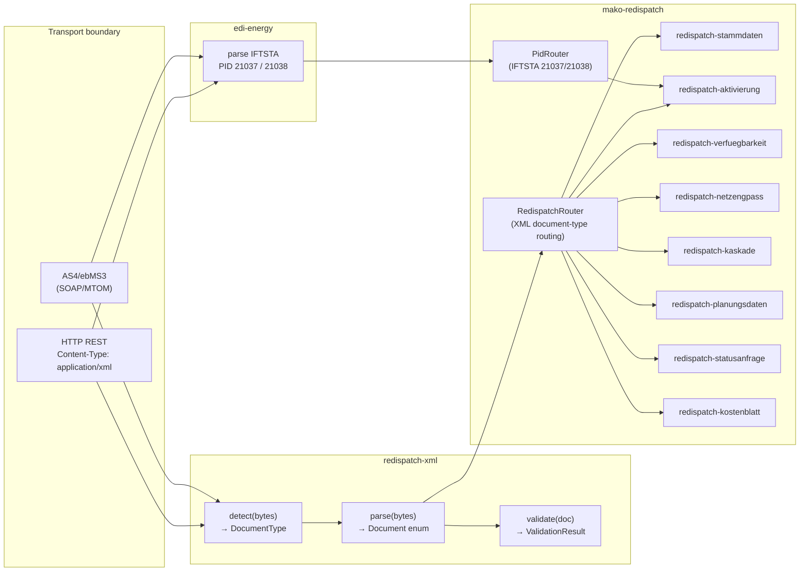

# Redispatch 2.0

Redispatch 2.0 is the mandatory German grid-congestion management protocol
under §§ 13, 13a, 14 EnWG, effective 1 October 2021 (NABEG). It requires all
TSOs (ÜNB) and DSOs (VNB) to coordinate controllable generation units across
transmission and distribution networks using structured XML documents.

Unlike GPKE / WiM / GeLi Gas, which use EDIFACT `RFF+Z13` Prüfidentifikatoren
for routing, Redispatch 2.0 uses **CIM/IEC 62325-based XML** for primary data
exchange and **IFTSTA (EDIFACT)** only for final status confirmations.

---

## Regulatory basis

| BNetzA decision | Topic | Effective |
|---|---|---|
| BK6-20-059 | `AcknowledgementDocument` deadline (6 h), `StatusRequest` deadline (24 h) | 2021-10-01 |
| BK6-20-060 | `Stammdaten` forwarding (1 Werktag), Activation response (5 min) | 2021-10-01 |
| BK6-20-061 | `Kostenblatt` submission (15th of following month) | 2021-10-01 |

NABEG 2019 and the above BNetzA decisions implement the legal obligation.
Absence of a conformant implementation is a regulatory violation under § 14 EnWG.

---

## Market roles in scope

| Abbrev. | Role |
|---|---|
| **ÜNB** | Übertragungsnetzbetreiber — Transmission System Operator (TSO) |
| **VNB** | Verteilnetzbetreiber — Distribution System Operator (DSO) |
| **ANB** | Anlagenbetreiber — generation / storage asset operator |
| **DV** | Direktvermarkter — direct marketer |
| **BKV** | Bilanzkreisverantwortlicher — balance responsible party |

Suppliers (LF) and metering-point operators (MSB) are **not** in scope for
Redispatch 2.0. Register `RedispatchModule` only when `DeploymentRoles`
contains at least one of `Marktrolle::Nb`, `Marktrolle::Unb`, or
`Marktrolle::Anb`.

---

## Three-crate architecture



---

## XML document types

All nine document types are CIM/IEC 62325-based XML — **not** EDIFACT. The
`redispatch-xml` crate handles all parsing, serialization, and validation.

| Document type | XSD version | Sender → Receiver | Handled by workflow |
|---|---|---|---|
| `ActivationDocument` | 1.1f | ÜNB → VNB → ANB | `redispatch-aktivierung` |
| `PlannedResourceScheduleDocument` | 1.0f | ÜNB → VNB → ANB | `redispatch-planungsdaten` |
| `AcknowledgementDocument` | 1.0f | any → sender of referenced doc | correlation routing (ProcessRegistry) |
| `Stammdaten` (master data) | 1.4b | ANB → VNB → ÜNB | `redispatch-stammdaten` |
| `StatusRequest_MarketDocument` | 1.1 | bidirectional | `redispatch-statusanfrage` |
| `Unavailability_MarketDocument` | 1.1b | ANB → VNB | `redispatch-verfuegbarkeit` |
| `Kaskade` | 1.0 | ÜNB → VNB → ANB | `redispatch-kaskade` |
| `NetworkConstraintDocument` | 1.1b | ÜNB ↔ VNB | `redispatch-netzengpass` |
| `Kostenblatt` | 1.0d | VNB → ÜNB | `redispatch-kostenblatt` |

XSD schemas and application guidelines are published by BDEW at
[bdew-mako.de](https://www.bdew-mako.de/market_communication/documents)
(topicGroupId 25 — XML-Datenformate Redispatch 2.0).

### AcknowledgementDocument routing

`AcknowledgementDocument` is **not** registered in the document-type router.
Every ACK carries a `ReceivingDocumentIdentification` field that identifies
the workflow instance it belongs to. The `makod` dispatcher resolves that
correlation key against the `ProcessRegistry` and delivers the ACK directly to
the originating workflow without routing by type.

---

## IFTSTA EDIFACT integration

Status messages are the only EDIFACT component of Redispatch 2.0. The
`edi-energy` crate handles IFTSTA parsing; `mako-redispatch` registers the
two PIDs in the `PidRouter`:

| PID | Perspective | Description |
|---|---|---|
| **21037** | NB (VNB) | Kommunikationsprozesse Redispatch — Ansicht NB |
| **21038** | BTR | Kommunikationsprozesse Redispatch — Ansicht BTR |

Both PIDs route to the `redispatch-aktivierung` workflow via conversation-ID
lookup, delivering the Vollzugsmeldung (completion notice) to the matching
activation process instance.

---

## Regulatory deadlines

> **Critical:** Deadlines differ fundamentally from GPKE/WiM.
> Redispatch 2.0 uses **UTC wall-clock hours** for acknowledgement and
> activation deadlines — not Werktage. Only Stammdaten and Kostenblatt
> follow German local time (CET/CEST) + Werktag rules.

| Obligation | Deadline | Clock | Source |
|---|---|---|---|
| `AcknowledgementDocument` reply | **6 wall-clock hours** | UTC | BK6-20-059 |
| `StatusRequest` response | **24 wall-clock hours** | UTC | BK6-20-059 |
| `Stammdaten` forward (VNB→ÜNB) | **1 Werktag** | German local time (CET/CEST) | BK6-20-060 |
| Activation (ACO) response | **5 minutes** | UTC | BK6-20-060 |
| `Kostenblatt` submission | **15th of following month** | German local time (CET/CEST) | BK6-20-061 |

### 5-minute hard real-time constraint

The activation deadline is safety-critical. `makod` must be configured with a
dedicated `DeadlineScheduler` instance polling at **≤ 30-second intervals** for
Redispatch workflows. The standard Werktage-based GPKE/WiM scheduler (which
typically polls every few minutes) is **not** sufficient and must not be shared
with the Redispatch scheduler.

```
GPKE/WiM deadline scheduler  →  polls every few minutes  (Werktage arithmetic)
Redispatch deadline scheduler →  polls every 30 s         (UTC, 5-min activation window)
```

---

## Workflow overview

The `mako-redispatch` crate provides 8 fully implemented workflows, all backed
by the same `mako-engine` `Workflow` + `Process` infrastructure.

| Workflow | Document type | Direction | Key deadline |
|---|---|---|---|
| `redispatch-stammdaten` | `Stammdaten` | ANB → VNB → ÜNB | 1 Werktag forward |
| `redispatch-aktivierung` | `ActivationDocument` + IFTSTA | ÜNB → VNB → ANB | **5 minutes** |
| `redispatch-verfuegbarkeit` | `UnavailabilityMarketDocument` | ANB → VNB | 6-hour ACK |
| `redispatch-netzengpass` | `NetworkConstraintDocument` | ÜNB ↔ VNB | 6-hour ACK |
| `redispatch-kaskade` | `Kaskade` (§ 13 Abs. 2 EnWG) | ÜNB → VNB → ANB | 6-hour ACK |
| `redispatch-planungsdaten` | `PlannedResourceScheduleDocument` | ÜNB → VNB → ANB | 6-hour ACK |
| `redispatch-statusanfrage` | `StatusRequest_MarketDocument` | bidirectional | 24-hour response |
| `redispatch-kostenblatt` | `Kostenblatt` | VNB → ÜNB | 15th of following month |

Each workflow uses a dedicated event-type newtype (e.g., `VerfuegbarkeitEvent`,
`NetzengpassEvent`) to prevent cross-workflow event-type collisions in the
shared `EventStore`.

---

## RedispatchModule

`RedispatchModule` implements `mako_engine::builder::EngineModule` and is the
single registration point for all Redispatch 2.0 handling in `makod`.

```rust,no_run
use mako_redispatch::RedispatchModule;
use mako_engine::builder::EngineBuilder;

// Register conditionally — only for NB/ÜNB/ANB deployments:
if roles.contains_any(&[Marktrolle::Nb, Marktrolle::Unb, Marktrolle::Anb]) {
    builder.register(Box::new(RedispatchModule));
}
```

`RedispatchModule::configure()` wires:
1. All 8 workflows into a `RedispatchRouter` (XML document-type routing)
2. IFTSTA PIDs 21037 and 21038 into the `PidRouter` (EDIFACT routing)

---

## Quick start — parsing a Redispatch XML document

```rust
use redispatch_xml::{parse_and_validate, Document};

// Recommended: parse + validate in one step
let doc = parse_and_validate(&xml_bytes)?;

// Access common fields on any document type
println!("mRID: {}", doc.mrid());
println!("Sender: {}", doc.sender_id());
println!("Receiver: {}", doc.receiver_id());

// Pattern match on the variant to access type-specific fields
match &doc {
    Document::Activation(a) => {
        println!("Activation period: {}", a.time_interval);
    }
    Document::Stammdaten(s) => {
        println!("Asset count: {}", s.controllable_units.len());
    }
    _ => {}
}
```

### Validation details

```rust
use redispatch_xml::{parse, validate};

let doc = parse(&xml_bytes)?;
let result = validate(&doc);

if result.is_valid() {
    // Zero errors — proceed with processing
} else {
    // All errors, not just the first:
    let all_errors = result.into_errors().unwrap_err();
    for e in &all_errors {
        eprintln!("Validation error: {}", e);
    }
}
```

---

## Integration with `makod`

The `makod` daemon routes inbound messages by content type:

1. `Content-Type: application/xml` → calls `redispatch_xml::detect(bytes)` to
   identify the document type, then dispatches via `RedispatchRouter`.
2. `Content-Type: application/edifact` with `RFF+Z13:21037` or `21038` →
   dispatched via `PidRouter` to `redispatch-aktivierung`.
3. `AcknowledgementDocument` → correlation key extracted from
   `ReceivingDocumentIdentification`, process looked up in `ProcessRegistry`,
   ACK delivered directly.

### Startup coverage check

`makod` panics at startup if `DeploymentRoles` includes `Nb`/`Unb`/`Anb` but
`RedispatchModule` is not registered. This prevents silent misconfiguration
in regulatory-critical deployments.

---

## Key invariants

- `Workflow::handle` and `Workflow::apply` are **pure functions**: no I/O, no
  clock access, no global state mutation.
- Events and `AcknowledgementDocument` outbox entries are always written in a
  **single `WriteBatch`** via `AtomicAppend::append_with_outbox`. Separate
  writes are not permitted — a crash between them produces a lost ACK with no
  recovery path (regulatory violation).
- The 5-minute Activation deadline uses **UTC nanosecond precision**; do not
  convert to local time before comparing.

---

## See also

- [`redispatch-xml` crate](https://crates.io/crates/redispatch-xml) — XML format layer
- [Process Engine Guide]({{ '/engine' | relative_url }}) — `Workflow`, `Process`, `EventStore`
- [PID Reference — Redispatch section]({{ '/pid-reference' | relative_url }}#redispatch-20--xml-document-types-not-edifact-pids)
- [BNetzA Regulatory Reference]({{ '/bnetza' | relative_url }}) — BK6-20-059, BK6-20-060, BK6-20-061
